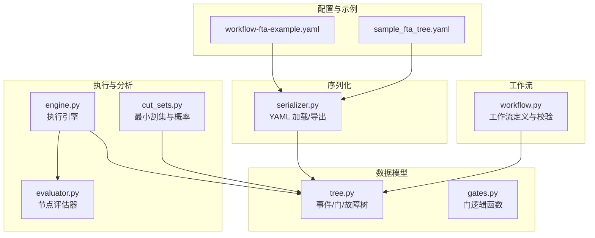
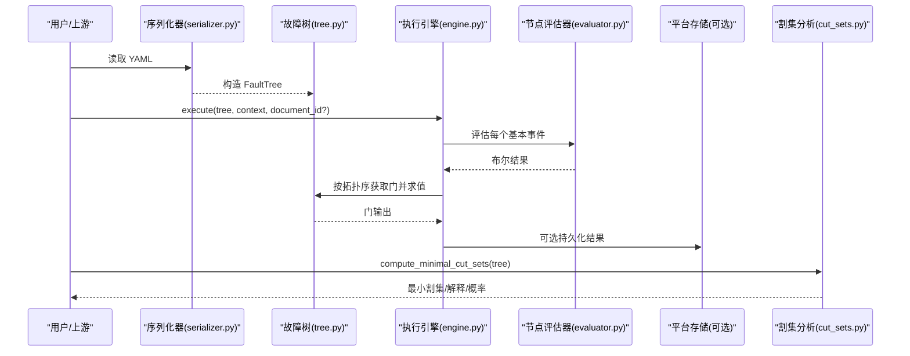
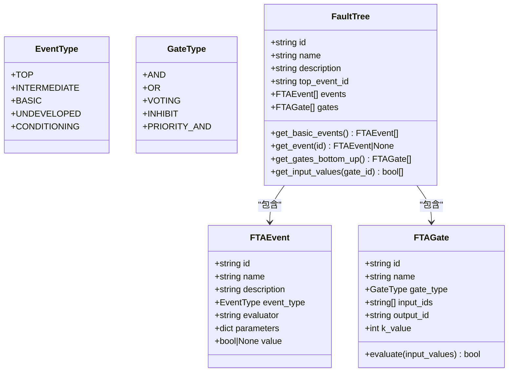
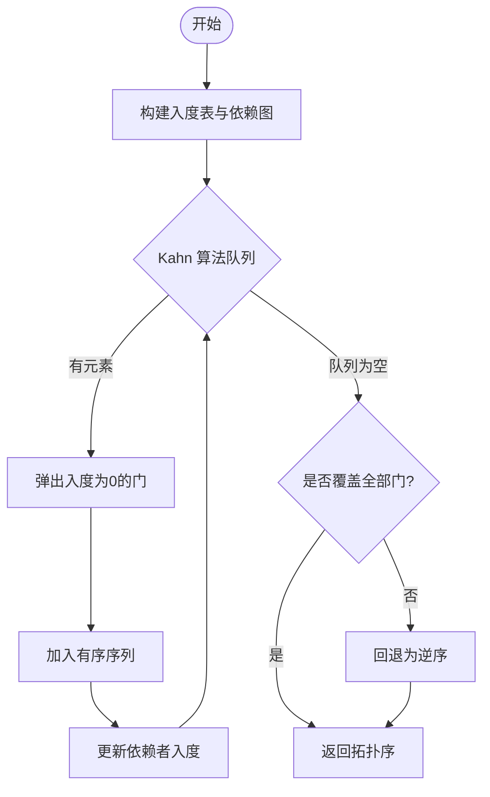
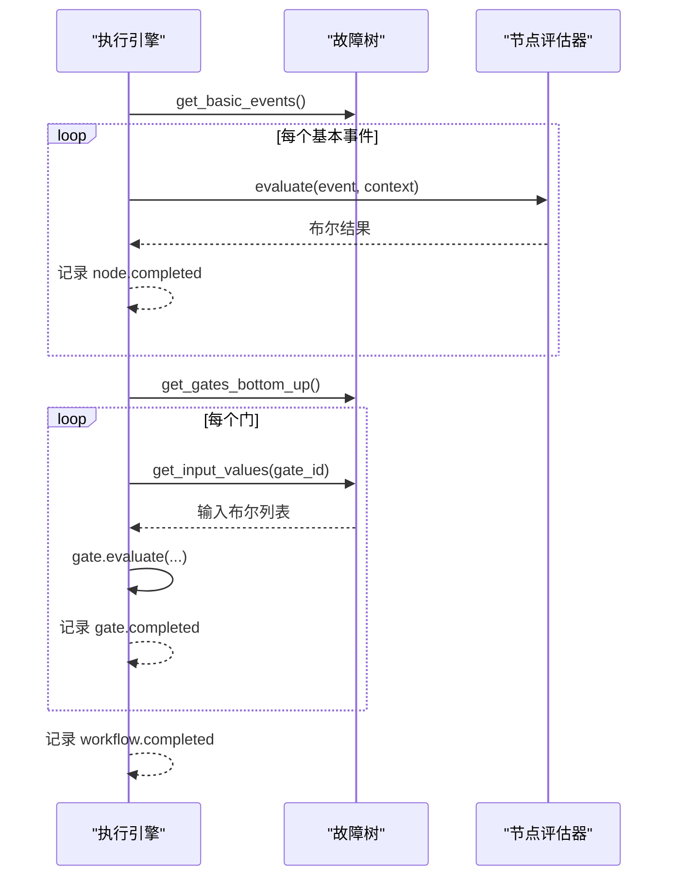
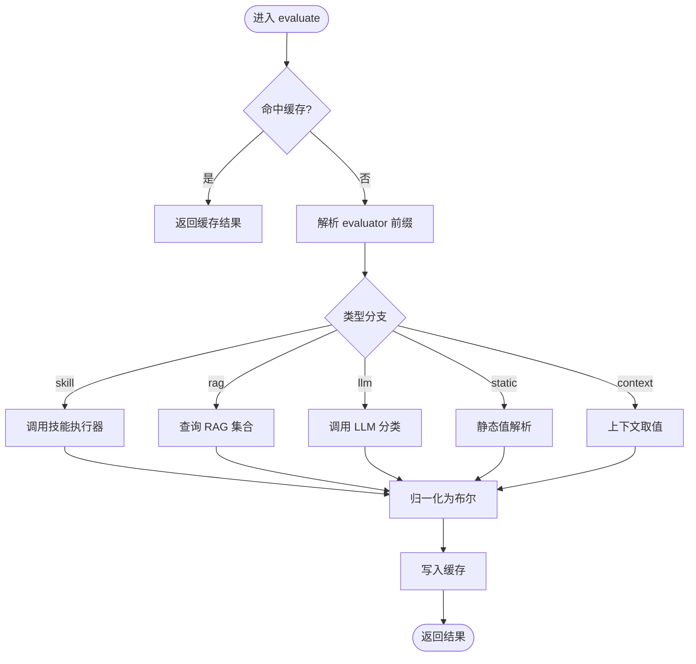
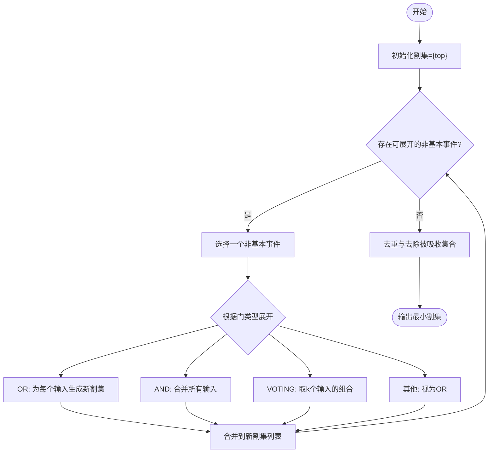
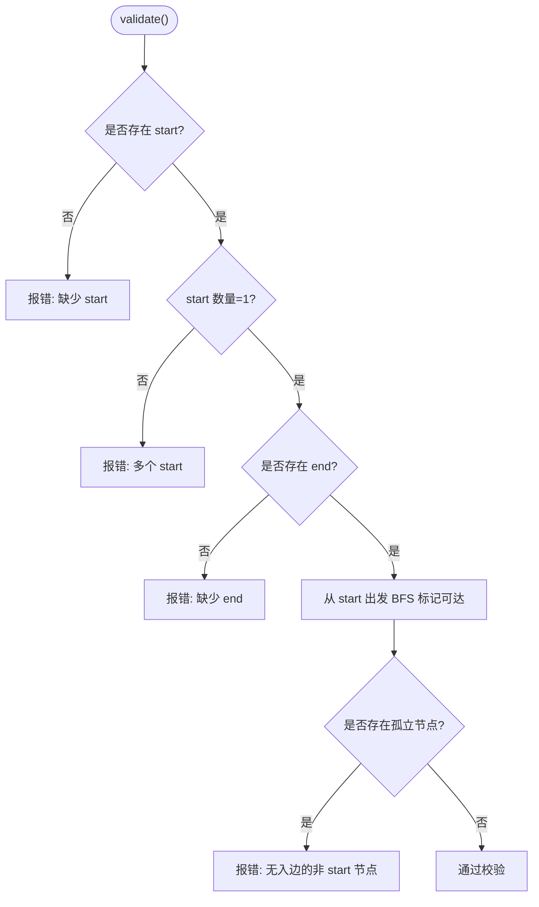
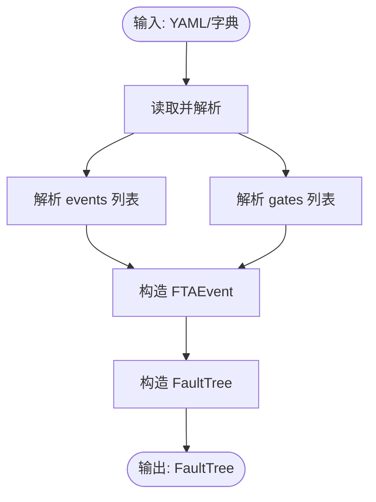
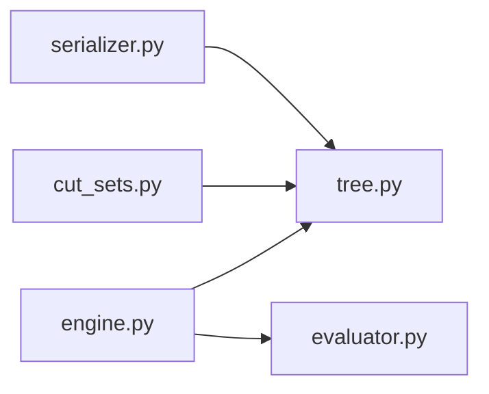

# 故障树结构设计

<cite>
**本文引用的文件**
- [tree.py](file://python/src/resolveagent/fta/tree.py)
- [gates.py](file://python/src/resolveagent/fta/gates.py)
- [serializer.py](file://python/src/resolveagent/fta/serializer.py)
- [engine.py](file://python/src/resolveagent/fta/engine.py)
- [evaluator.py](file://python/src/resolveagent/fta/evaluator.py)
- [cut_sets.py](file://python/src/resolveagent/fta/cut_sets.py)
- [workflow.py](file://python/src/resolveagent/fta/workflow.py)
- [workflow-fta-example.yaml](file://configs/examples/workflow-fta-example.yaml)
- [sample_fta_tree.yaml](file://python/tests/fixtures/sample_fta_tree.yaml)
</cite>

## 目录
1. [简介](#简介)
2. [项目结构](#项目结构)
3. [核心组件](#核心组件)
4. [架构总览](#架构总览)
5. [详细组件分析](#详细组件分析)
6. [依赖关系分析](#依赖关系分析)
7. [性能考量](#性能考量)
8. [故障排查指南](#故障排查指南)
9. [结论](#结论)
10. [附录](#附录)

## 简介
本技术文档围绕 ResolveAgent 中的故障树（Fault Tree Analysis, FTA）子系统，系统阐述其数据结构、节点类型与属性设计、层次结构与父子关系管理、执行引擎流程、序列化与反序列化机制、最小割集计算与可解释性输出，以及构建最佳实践与常见错误处理策略。目标读者包括希望理解或扩展故障树能力的开发者与运维工程师。

## 项目结构
故障树相关代码集中在 Python 模块 resolveagent.fta 下，采用分层组织：
- 数据模型层：定义事件、门、故障树等核心数据结构
- 逻辑层：门逻辑实现、节点评估器、执行引擎、最小割集算法
- 工作流层：通用工作流定义与校验
- 序列化层：YAML 的加载与导出
- 配置与示例：示例工作流与测试样例

图表来源
- [tree.py:10-90](file://python/src/resolveagent/fta/tree.py#L10-L90)
- [gates.py:6-28](file://python/src/resolveagent/fta/gates.py#L6-L28)
- [engine.py:20-130](file://python/src/resolveagent/fta/engine.py#L20-L130)
- [evaluator.py:21-110](file://python/src/resolveagent/fta/evaluator.py#L21-L110)
- [cut_sets.py:17-65](file://python/src/resolveagent/fta/cut_sets.py#L17-L65)
- [workflow.py:9-92](file://python/src/resolveagent/fta/workflow.py#L9-L92)
- [serializer.py:12-113](file://python/src/resolveagent/fta/serializer.py#L12-L113)
- [workflow-fta-example.yaml:1-50](file://configs/examples/workflow-fta-example.yaml#L1-L50)
- [sample_fta_tree.yaml:1-23](file://python/tests/fixtures/sample_fta_tree.yaml#L1-L23)

章节来源
- [tree.py:10-90](file://python/src/resolveagent/fta/tree.py#L10-L90)
- [gates.py:6-28](file://python/src/resolveagent/fta/gates.py#L6-L28)
- [engine.py:20-130](file://python/src/resolveagent/fta/engine.py#L20-L130)
- [evaluator.py:21-110](file://python/src/resolveagent/fta/evaluator.py#L21-L110)
- [cut_sets.py:17-65](file://python/src/resolveagent/fta/cut_sets.py#L17-L65)
- [workflow.py:9-92](file://python/src/resolveagent/fta/workflow.py#L9-L92)
- [serializer.py:12-113](file://python/src/resolveagent/fta/serializer.py#L12-L113)
- [workflow-fta-example.yaml:1-50](file://configs/examples/workflow-fta-example.yaml#L1-L50)
- [sample_fta_tree.yaml:1-23](file://python/tests/fixtures/sample_fta_tree.yaml#L1-L23)

## 核心组件
- 事件与门模型：定义顶事件、中间事件、基本事件、未开发事件、条件事件；支持 AND/OR/VOTING/INHIBIT/PRIORITY_AND 门类型
- 执行引擎：自底向上遍历并评估基本事件与门，产出工作流事件流
- 节点评估器：将“技能调用”“RAG 查询”“LLM 分类”“静态值”“上下文取值”统一为布尔结果
- 最小割集：基于 MOCUS 算法计算最小割集、概率估计与重要性排序
- 工作流：通用 DAG 描述与校验
- 序列化：YAML 到内存对象的双向转换

章节来源
- [tree.py:10-90](file://python/src/resolveagent/fta/tree.py#L10-L90)
- [engine.py:20-130](file://python/src/resolveagent/fta/engine.py#L20-L130)
- [evaluator.py:21-110](file://python/src/resolveagent/fta/evaluator.py#L21-L110)
- [cut_sets.py:17-65](file://python/src/resolveagent/fta/cut_sets.py#L17-L65)
- [workflow.py:9-92](file://python/src/resolveagent/fta/workflow.py#L9-L92)
- [serializer.py:12-113](file://python/src/resolveagent/fta/serializer.py#L12-L113)

## 架构总览
下图展示了从 YAML 配置到执行与结果持久化的端到端流程，以及最小割集分析在分析阶段的接入点。

图表来源
- [serializer.py:12-70](file://python/src/resolveagent/fta/serializer.py#L12-L70)
- [engine.py:34-130](file://python/src/resolveagent/fta/engine.py#L34-L130)
- [evaluator.py:51-110](file://python/src/resolveagent/fta/evaluator.py#L51-L110)
- [cut_sets.py:17-65](file://python/src/resolveagent/fta/cut_sets.py#L17-L65)

## 详细组件分析

### 数据模型与节点类型
- 事件类型
  - 顶事件（top）：作为根事件，通常由某个门的输出指向
  - 中间事件（intermediate）：由门组合产生，非叶子
  - 基本事件（basic）：叶子节点，需通过评估器求解
  - 未开发事件（undeveloped）：暂不展开的事件占位
  - 条件事件（conditioning）：用于抑制门等场景的条件输入
- 门类型
  - AND：所有输入为真才为真
  - OR：任一输入为真即为真
  - VOTING：k-of-n，至少 k 个输入为真
  - INHIBIT：AND 加一个条件输入（当前实现中按 AND 语义）
  - PRIORITY_AND：有序 AND（当前实现中按 AND 语义）
- 事件属性
  - id/name/description：标识与说明
  - event_type：事件类型枚举
  - evaluator：评估器路由，形如 “skill:xxx”“rag:collection”“llm:hint”“static:value”“context:key”
  - parameters：评估器参数
  - value：运行时赋值（供门求值使用）
- 门属性
  - id/name/type：标识与类型
  - input_ids：输入节点 ID 列表（可为事件或门）
  - output_id：输出事件 ID
  - k_value：投票门阈值

图表来源
- [tree.py:10-90](file://python/src/resolveagent/fta/tree.py#L10-L90)
- [tree.py:92-151](file://python/src/resolveagent/fta/tree.py#L92-L151)

章节来源
- [tree.py:10-90](file://python/src/resolveagent/fta/tree.py#L10-L90)
- [tree.py:92-151](file://python/src/resolveagent/fta/tree.py#L92-L151)

### 门逻辑与求值顺序
- 门逻辑函数提供独立的可测试单元（AND/OR/VOTING/INHIBIT/PRIORITY_AND）
- 故障树内部对门进行拓扑排序，保证自底向上求值；若检测到环或不连通，回退为逆序

图表来源
- [tree.py:103-137](file://python/src/resolveagent/fta/tree.py#L103-L137)

章节来源
- [gates.py:6-28](file://python/src/resolveagent/fta/gates.py#L6-L28)
- [tree.py:103-137](file://python/src/resolveagent/fta/tree.py#L103-L137)

### 执行引擎与事件流
- 执行入口接收 FaultTree、上下文与可选文档 ID
- 先评估所有基本事件，再按拓扑序评估门，最后产出完成事件
- 支持可选的结果持久化（失败时记录警告）

图表来源
- [engine.py:34-130](file://python/src/resolveagent/fta/engine.py#L34-L130)
- [tree.py:92-151](file://python/src/resolveagent/fta/tree.py#L92-L151)

章节来源
- [engine.py:34-130](file://python/src/resolveagent/fta/engine.py#L34-L130)

### 节点评估器（基本事件求解）
- 支持多种评估后端：
  - skill：调用技能执行器，解析结果为布尔
  - rag：查询知识库集合，按相似度阈值判定
  - llm：构造提示词，调用 LLM 做二分类
  - static：静态字符串转布尔
  - context：从上下文按点号路径取值并转布尔
- 内置缓存避免重复计算；异常时安全降级

图表来源
- [evaluator.py:51-110](file://python/src/resolveagent/fta/evaluator.py#L51-L110)
- [evaluator.py:112-368](file://python/src/resolveagent/fta/evaluator.py#L112-L368)

章节来源
- [evaluator.py:51-110](file://python/src/resolveagent/fta/evaluator.py#L51-L110)
- [evaluator.py:112-368](file://python/src/resolveagent/fta/evaluator.py#L112-L368)

### 最小割集与可解释性
- 基于 MOCUS 自顶向下展开，OR 拆分、AND 合并、VOTING 组合选择
- 去除被吸收的超集，得到最小割集
- 提供人类可读解释与概率估算、重要性排序

图表来源
- [cut_sets.py:17-65](file://python/src/resolveagent/fta/cut_sets.py#L17-L65)
- [cut_sets.py:68-184](file://python/src/resolveagent/fta/cut_sets.py#L68-L184)
- [cut_sets.py:187-221](file://python/src/resolveagent/fta/cut_sets.py#L187-L221)

章节来源
- [cut_sets.py:17-65](file://python/src/resolveagent/fta/cut_sets.py#L17-L65)
- [cut_sets.py:68-184](file://python/src/resolveagent/fta/cut_sets.py#L68-L184)
- [cut_sets.py:187-221](file://python/src/resolveagent/fta/cut_sets.py#L187-L221)

### 工作流定义与校验
- 工作流由节点与边组成，支持 start/end/agent/skill/condition/action 等节点类型
- 校验规则：必须存在且仅一个 start；必须存在 end；所有节点可达；除 start 外每个节点需有入边

图表来源
- [workflow.py:47-92](file://python/src/resolveagent/fta/workflow.py#L47-L92)

章节来源
- [workflow.py:9-92](file://python/src/resolveagent/fta/workflow.py#L9-L92)

### 序列化器（YAML 加载/导出）
- 加载：从 YAML 文件或字典构造 FaultTree，映射事件与门字段
- 导出：将 FaultTree 转为 YAML 字符串，保持键顺序
- 约定：顶层 key 为 tree；事件 type 默认 basic；门 type 默认 and

图表来源
- [serializer.py:12-70](file://python/src/resolveagent/fta/serializer.py#L12-L70)
- [serializer.py:73-113](file://python/src/resolveagent/fta/serializer.py#L73-L113)

章节来源
- [serializer.py:12-70](file://python/src/resolveagent/fta/serializer.py#L12-L70)
- [serializer.py:73-113](file://python/src/resolveagent/fta/serializer.py#L73-L113)

## 依赖关系分析
- 执行引擎依赖：
  - 故障树模型（事件/门/拓扑序）
  - 节点评估器（多后端统一接口）
  - 可选平台客户端（结果持久化）
- 最小割集分析依赖：
  - 故障树模型（事件类型、门类型、ID 映射）
- 序列化器依赖：
  - 故障树模型与枚举类型

图表来源
- [engine.py:20-130](file://python/src/resolveagent/fta/engine.py#L20-L130)
- [cut_sets.py:17-65](file://python/src/resolveagent/fta/cut_sets.py#L17-L65)
- [serializer.py:12-113](file://python/src/resolveagent/fta/serializer.py#L12-L113)
- [tree.py:10-90](file://python/src/resolveagent/fta/tree.py#L10-L90)

章节来源
- [engine.py:20-130](file://python/src/resolveagent/fta/engine.py#L20-L130)
- [cut_sets.py:17-65](file://python/src/resolveagent/fta/cut_sets.py#L17-L65)
- [serializer.py:12-113](file://python/src/resolveagent/fta/serializer.py#L12-L113)
- [tree.py:10-90](file://python/src/resolveagent/fta/tree.py#L10-L90)

## 性能考量
- 拓扑排序：使用 Kahn 算法 O(V+E)，保证自底向上高效求值；遇到环或不连通时回退为逆序，避免死循环
- 评估缓存：NodeEvaluator 基于事件 ID 与上下文哈希缓存结果，减少重复计算
- 最小割集：迭代展开设置最大迭代次数保护；吸收集去除按大小排序提升效率
- I/O 与外部调用：RAG/LLM/Skill 调用可能成为瓶颈，建议结合超时与重试策略（在更上层实现）

[本节为通用性能讨论，不直接分析具体文件]

## 故障排查指南
- 事件未定义评估器：日志告警并返回默认值（True），检查 evaluator 字段是否正确配置
- 未知评估器类型：记录警告并返回 True，确认 evaluator 前缀是否为 skill/rag/llm/static/context
- 技能/RAG/LLM 不可用：记录警告并返回默认值（技能/RAG 返回 True，LLM 返回 True），确保相应组件已注入
- 评估异常：捕获异常并返回 False（表示事件未发生），检查外部服务可用性与参数
- 拓扑排序失败：回退为逆序，检查是否存在环或断链
- 工作流校验失败：确保存在唯一 start、存在 end、所有节点可达、非 start 节点均有入边
- 序列化字段缺失：确保事件/门具备必要字段（id、type 等），否则使用默认值

章节来源
- [evaluator.py:71-110](file://python/src/resolveagent/fta/evaluator.py#L71-L110)
- [evaluator.py:112-368](file://python/src/resolveagent/fta/evaluator.py#L112-L368)
- [tree.py:103-137](file://python/src/resolveagent/fta/tree.py#L103-L137)
- [workflow.py:47-92](file://python/src/resolveagent/fta/workflow.py#L47-L92)
- [serializer.py:26-70](file://python/src/resolveagent/fta/serializer.py#L26-L70)

## 结论
ResolveAgent 的故障树子系统提供了清晰的数据模型、可扩展的评估后端、稳健的执行流程与可解释的最小割集分析。通过 YAML 序列化与工作流校验，便于工程化落地。建议在构建故障树时遵循命名规范、明确事件类型与评估器、合理设置门与阈值，并结合缓存与超时策略优化性能。

[本节为总结性内容，不直接分析具体文件]

## 附录

### 节点类型与用途速查
- 顶事件：根问题定位的目标
- 中间事件：由门组合产生的次级问题
- 基本事件：需要实际检测或推理的叶子条件
- 未开发事件：暂时不展开的占位
- 条件事件：用于抑制门等场景的附加条件

章节来源
- [tree.py:10-18](file://python/src/resolveagent/fta/tree.py#L10-L18)

### 事件与门属性设计要点
- 事件
  - id/name/description：唯一标识与可读信息
  - event_type：决定其在树中的角色
  - evaluator：统一抽象外部能力
  - parameters：评估器所需参数
  - value：运行时状态
- 门
  - input_ids/output_id：连接关系
  - k_value：投票门阈值
  - evaluate：内联求值逻辑

章节来源
- [tree.py:30-78](file://python/src/resolveagent/fta/tree.py#L30-L78)
- [tree.py:81-90](file://python/src/resolveagent/fta/tree.py#L81-L90)

### 序列化格式约定（YAML）
- 顶层 key：tree
- 事件字段：id、name、description、type、evaluator、parameters
- 门字段：id、name、type、inputs、output、k_value
- 默认值：事件 type 为 basic；门 type 为 and；k_value 为 1

章节来源
- [serializer.py:26-70](file://python/src/resolveagent/fta/serializer.py#L26-L70)
- [serializer.py:73-113](file://python/src/resolveagent/fta/serializer.py#L73-L113)

### 示例参考
- 示例工作流：生产事故根因分析的故障树配置
- 测试样例：最小可复现的故障树结构

章节来源
- [workflow-fta-example.yaml:1-50](file://configs/examples/workflow-fta-example.yaml#L1-L50)
- [sample_fta_tree.yaml:1-23](file://python/tests/fixtures/sample_fta_tree.yaml#L1-L23)