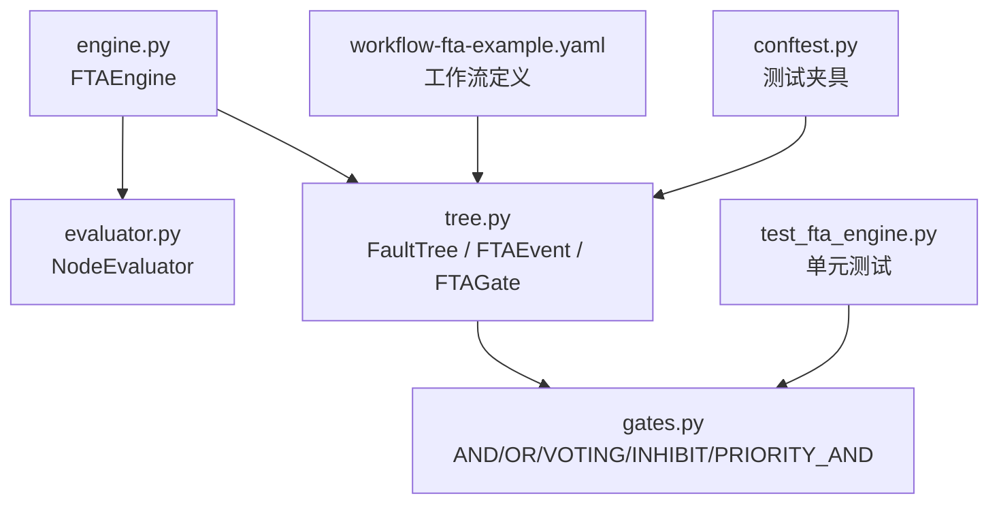
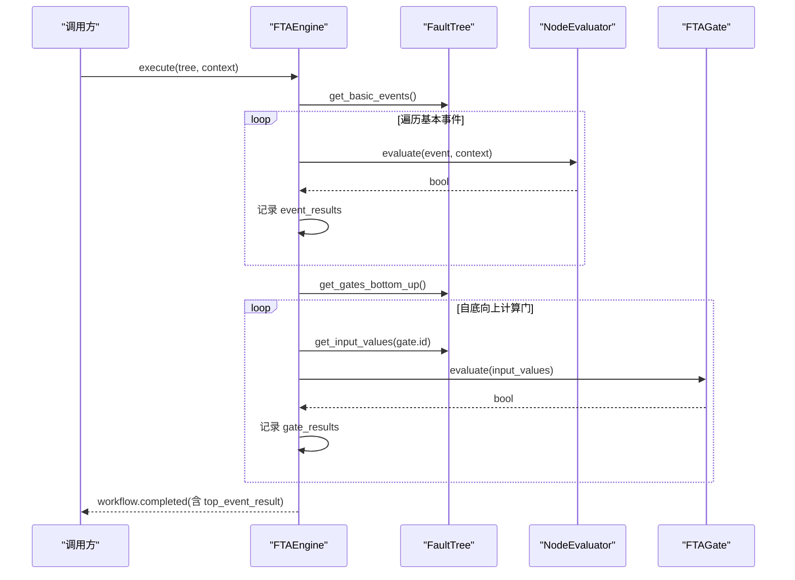
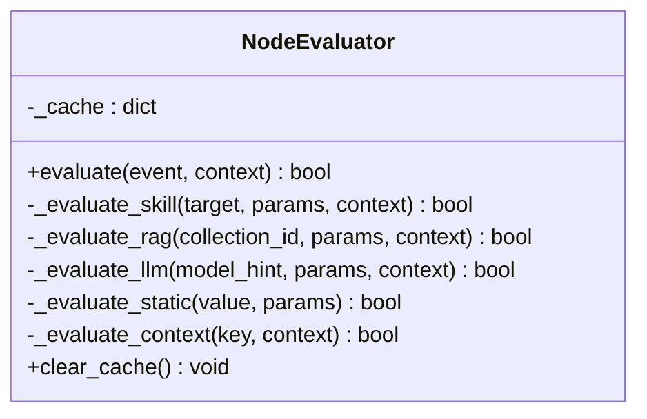
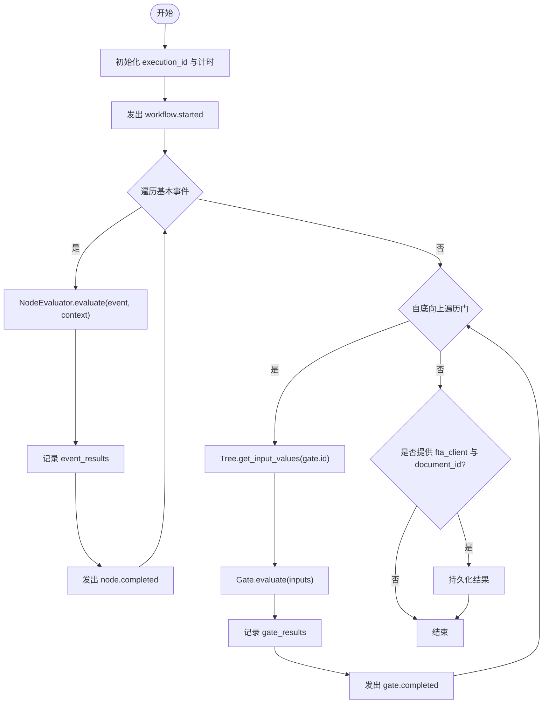
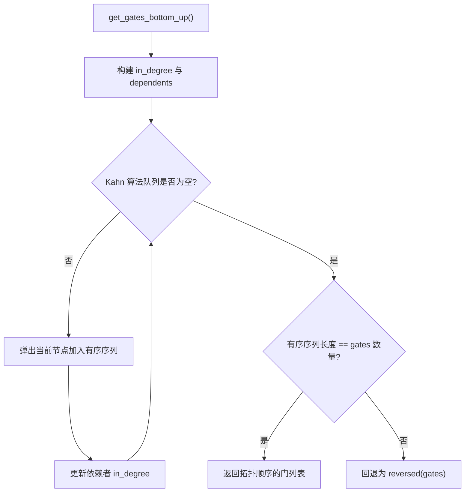
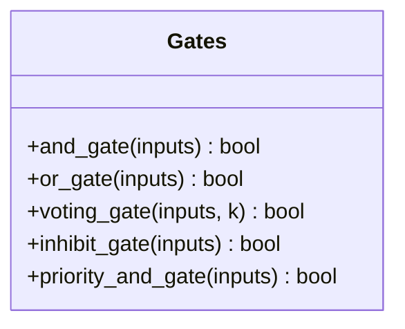
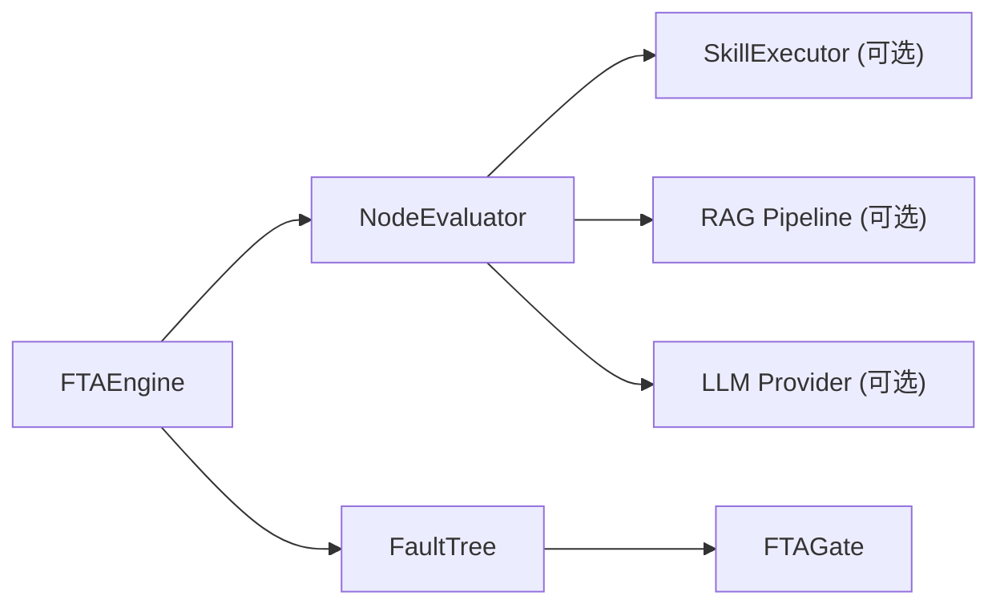

# 节点评估引擎

<cite>
**本文引用的文件**
- [engine.py](file://python/src/resolveagent/fta/engine.py)
- [evaluator.py](file://python/src/resolveagent/fta/evaluator.py)
- [tree.py](file://python/src/resolveagent/fta/tree.py)
- [gates.py](file://python/src/resolveagent/fta/gates.py)
- [workflow-fta-example.yaml](file://configs/examples/workflow-fta-example.yaml)
- [test_fta_engine.py](file://python/tests/unit/test_fta_engine.py)
- [conftest.py](file://python/tests/conftest.py)
- [fta-engine.md](file://docs/zh/fta-engine.md)
</cite>

## 目录
1. [简介](#简介)
2. [项目结构](#项目结构)
3. [核心组件](#核心组件)
4. [架构总览](#架构总览)
5. [详细组件分析](#详细组件分析)
6. [依赖关系分析](#依赖关系分析)
7. [性能考虑](#性能考虑)
8. [故障排查指南](#故障排查指南)
9. [结论](#结论)
10. [附录：使用示例与扩展接口](#附录使用示例与扩展接口)

## 简介
本技术文档聚焦于故障树（FTA）中的“节点评估引擎”，围绕 NodeEvaluator 类的设计与实现，系统阐述其评估流程、数据流与状态管理、上下文参数传递、结果缓存策略与性能优化措施，并给出扩展接口与自定义评估器的实现方法。同时提供完整的代码级示例路径，展示如何使用评估引擎进行故障树分析与结果获取。

## 项目结构
FTA 相关代码位于 Python 模块 resolveagent.fta 下，核心文件包括：
- 执行编排：engine.py（FTAEngine）
- 节点评估：evaluator.py（NodeEvaluator）
- 数据结构：tree.py（FaultTree、FTAEvent、FTAGate）
- 门逻辑：gates.py（各类门函数）
- 配置示例：workflow-fta-example.yaml（工作流定义）
- 测试用例：test_fta_engine.py、conftest.py
- 用户文档：fta-engine.md（中文说明）

图表来源
- [engine.py:20-130](file://python/src/resolveagent/fta/engine.py#L20-L130)
- [evaluator.py:21-368](file://python/src/resolveagent/fta/evaluator.py#L21-L368)
- [tree.py:30-151](file://python/src/resolveagent/fta/tree.py#L30-L151)
- [gates.py:6-29](file://python/src/resolveagent/fta/gates.py#L6-L29)
- [workflow-fta-example.yaml:1-50](file://configs/examples/workflow-fta-example.yaml#L1-L50)
- [test_fta_engine.py:1-40](file://python/tests/unit/test_fta_engine.py#L1-L40)
- [conftest.py:1-44](file://python/tests/conftest.py#L1-L44)

章节来源
- [engine.py:20-130](file://python/src/resolveagent/fta/engine.py#L20-L130)
- [tree.py:30-151](file://python/src/resolveagent/fta/tree.py#L30-L151)
- [gates.py:6-29](file://python/src/resolveagent/fta/gates.py#L6-L29)
- [workflow-fta-example.yaml:1-50](file://configs/examples/workflow-fta-example.yaml#L1-L50)

## 核心组件
- FTAEngine：负责从叶子节点到根节点的自底向上执行，协调基本事件评估与门逻辑传播，输出流式事件并可选持久化结果。
- NodeEvaluator：对基本事件进行评估，支持 skill、rag、llm、static、context 五种评估器类型；内置基于事件ID与上下文哈希的缓存机制；异常时采用失败安全策略返回 False。
- FaultTree/FTAEvent/FTAGate：描述故障树的数据模型，包含事件类型、门类型、拓扑排序与输入值收集等能力。
- gates.py：提供 AND、OR、VOTING、INHIBIT、PRIORITY_AND 等门逻辑函数。

章节来源
- [engine.py:20-130](file://python/src/resolveagent/fta/engine.py#L20-L130)
- [evaluator.py:21-368](file://python/src/resolveagent/fta/evaluator.py#L21-L368)
- [tree.py:30-151](file://python/src/resolveagent/fta/tree.py#L30-L151)
- [gates.py:6-29](file://python/src/resolveagent/fta/gates.py#L6-L29)

## 架构总览
FTAEngine 作为编排层，先遍历所有基本事件调用 NodeEvaluator.evaluate 计算布尔结果，再按拓扑顺序自底向上计算各门的结果，最终得到顶级事件结果。NodeEvaluator 根据事件定义的 evaluator 字段选择具体评估策略，并通过 SkillExecutor、RAG Pipeline、LLM Provider 或静态/上下文取值完成判定。

图表来源
- [engine.py:34-130](file://python/src/resolveagent/fta/engine.py#L34-L130)
- [tree.py:92-151](file://python/src/resolveagent/fta/tree.py#L92-L151)
- [evaluator.py:51-110](file://python/src/resolveagent/fta/evaluator.py#L51-L110)

## 详细组件分析

### NodeEvaluator：基本事件评估器
- 职责：解析事件 evaluator 字符串（如 "skill:xxx"），路由到对应评估分支；统一返回布尔值；维护内存缓存；异常时返回 False（失败安全）。
- 评估分支：
  - skill：通过 SkillExecutor.execute 执行技能，兼容多种返回格式（bool/dict/int/float），提取布尔结果。
  - rag：调用 RAG Pipeline.query，依据最高相似度分数与阈值判断是否命中。
  - llm：构造提示词，调用 LLMProvider.chat，解析 true/false 响应。
  - static：将字符串转换为布尔值。
  - context：支持点号路径访问上下文字典，并将任意值转为布尔。
- 缓存策略：以 "event_id:hash(context)" 为键缓存结果，避免重复评估。
- 错误处理：任一分支异常均记录日志并返回 False，确保整体评估鲁棒性。

图表来源
- [evaluator.py:21-368](file://python/src/resolveagent/fta/evaluator.py#L21-L368)

章节来源
- [evaluator.py:51-110](file://python/src/resolveagent/fta/evaluator.py#L51-L110)
- [evaluator.py:112-167](file://python/src/resolveagent/fta/evaluator.py#L112-L167)
- [evaluator.py:169-238](file://python/src/resolveagent/fta/evaluator.py#L169-L238)
- [evaluator.py:240-313](file://python/src/resolveagent/fta/evaluator.py#L240-L313)
- [evaluator.py:315-368](file://python/src/resolveagent/fta/evaluator.py#L315-L368)

### FTAEngine：执行编排与流式事件
- 执行流程：
  - 生成 execution_id 与计时起点。
  - 发出 workflow.started 事件。
  - 遍历基本事件，调用 NodeEvaluator.evaluate，记录 event_results 并发出 node.evaluating/node.completed 事件。
  - 自底向上遍历门，收集输入值并计算门结果，记录 gate_results 并发出 gate.evaluating/gate.completed 事件。
  - 计算耗时，若提供 fta_client 与 document_id，则持久化结果（execution_id、top_event_result、basic_event_probabilities、gate_results、status、duration_ms、context）。
  - 发出 workflow.completed 事件。
- 数据流：event_results 与 gate_results 贯穿执行过程，最终汇总为顶层结果。

图表来源
- [engine.py:34-130](file://python/src/resolveagent/fta/engine.py#L34-L130)

章节来源
- [engine.py:34-130](file://python/src/resolveagent/fta/engine.py#L34-L130)

### FaultTree：拓扑排序与输入值收集
- 基本事件筛选：get_basic_events 过滤 EventType.BASIC。
- 门拓扑排序：get_gates_bottom_up 使用入度表与队列（Kahn 算法）生成自底向上的门序列；若检测到环或不连通图，回退为逆序。
- 输入值收集：get_input_values 根据 gate.input_ids 查找事件并读取其 value 字段，组装布尔列表供门计算。

图表来源
- [tree.py:103-137](file://python/src/resolveagent/fta/tree.py#L103-L137)

章节来源
- [tree.py:92-151](file://python/src/resolveagent/fta/tree.py#L92-L151)

### 门逻辑：gates.py
- AND：全部为真才为真。
- OR：任一为真即为真。
- VOTING：至少 k 个为真。
- INHIBIT：条件与（当前实现等价 all）。
- PRIORITY_AND：顺序与（当前实现等价 all）。

图表来源
- [gates.py:6-29](file://python/src/resolveagent/fta/gates.py#L6-L29)

章节来源
- [gates.py:6-29](file://python/src/resolveagent/fta/gates.py#L6-L29)

## 依赖关系分析
- FTAEngine 依赖 NodeEvaluator 与 FaultTree。
- NodeEvaluator 依赖外部组件：SkillExecutor、RAG Pipeline、LLM Provider（均为可选注入）。
- FaultTree 依赖 FTAGate 与 FTAEvent。
- gates.py 被测试覆盖，体现门逻辑正确性。

图表来源
- [engine.py:20-130](file://python/src/resolveagent/fta/engine.py#L20-L130)
- [evaluator.py:21-368](file://python/src/resolveagent/fta/evaluator.py#L21-L368)
- [tree.py:30-151](file://python/src/resolveagent/fta/tree.py#L30-L151)

章节来源
- [engine.py:20-130](file://python/src/resolveagent/fta/engine.py#L20-L130)
- [evaluator.py:21-368](file://python/src/resolveagent/fta/evaluator.py#L21-L368)
- [tree.py:30-151](file://python/src/resolveagent/fta/tree.py#L30-L151)

## 性能考虑
- 缓存：NodeEvaluator 内部 _cache 基于事件ID与上下文哈希，减少重复评估开销。可通过 clear_cache 主动清理。
- 短路：OR 门天然具备短路特性（任一为真即止），可在设计工作流时将快速检查前置以提升效率。
- 拓扑排序：使用 Kahn 算法保证门计算的线性复杂度 O(V+E)，避免循环依赖导致的死锁。
- I/O 与外部调用：skill/rag/llm 评估可能涉及网络请求，建议合理设置超时与重试策略（在更高层封装中实现）。
- 结果持久化：仅在提供 fta_client 与 document_id 时写入存储，避免不必要的 I/O。

[本节为通用性能指导，不直接分析具体文件]

## 故障排查指南
- 无评估器：当事件未定义 evaluator 时，NodeEvaluator 会记录警告并返回 True（默认认为事件发生）。需检查工作流定义。
- 未知评估器类型：evaluator 前缀非法时会记录警告并返回 True。
- 外部依赖缺失：
  - skill：未注入 SkillExecutor 时无法评估，记录警告并返回 True。
  - rag：未注入 RAG Pipeline 或查询为空时，返回 False。
  - llm：未注入 LLM Provider 或响应歧义时，记录警告并尝试解析。
- 异常兜底：任何评估分支抛出异常都会记录错误日志并返回 False，确保整体流程继续。

章节来源
- [evaluator.py:70-110](file://python/src/resolveagent/fta/evaluator.py#L70-L110)
- [evaluator.py:123-167](file://python/src/resolveagent/fta/evaluator.py#L123-L167)
- [evaluator.py:180-238](file://python/src/resolveagent/fta/evaluator.py#L180-L238)
- [evaluator.py:251-313](file://python/src/resolveagent/fta/evaluator.py#L251-L313)

## 结论
NodeEvaluator 提供了可扩展、健壮的基本事件评估框架，结合 FTAEngine 的自底向上编排与 FaultTree 的拓扑排序，实现了高效的故障树分析。通过缓存、短路、拓扑排序与可选的外部集成，系统在准确性与性能之间取得平衡。配合清晰的流式事件与持久化能力，便于监控与调试。

[本节为总结性内容，不直接分析具体文件]

## 附录：使用示例与扩展接口

### 使用示例：从 YAML 创建工作流并执行
- 工作流定义参考：
  - [workflow-fta-example.yaml:1-50](file://configs/examples/workflow-fta-example.yaml#L1-L50)
- 执行入口与事件流参考：
  - [engine.py:34-130](file://python/src/resolveagent/fta/engine.py#L34-L130)
- 中文使用说明与事件类型参考：
  - [fta-engine.md:197-273](file://docs/zh/fta-engine.md#L197-L273)

章节来源
- [workflow-fta-example.yaml:1-50](file://configs/examples/workflow-fta-example.yaml#L1-L50)
- [engine.py:34-130](file://python/src/resolveagent/fta/engine.py#L34-L130)
- [fta-engine.md:197-273](file://docs/zh/fta-engine.md#L197-L273)

### 扩展接口：自定义评估器
- 新增评估器类型：
  - 在 NodeEvaluator.evaluate 中增加新的 evaluator_type 分支，并实现对应的私有方法（如 _evaluate_custom）。
  - 保持返回布尔值的约定，并在异常时记录日志并返回 False。
- 注入依赖：
  - 通过构造函数注入 SkillExecutor、LLM Provider、RAG Pipeline 等外部组件。
- 缓存与上下文：
  - 复用现有缓存机制；如需细粒度控制，可调整 cache_key 生成策略。
  - 支持通过 context 传递动态参数，或在事件 parameters 中配置。

章节来源
- [evaluator.py:51-110](file://python/src/resolveagent/fta/evaluator.py#L51-L110)
- [evaluator.py:112-368](file://python/src/resolveagent/fta/evaluator.py#L112-L368)

### 验证与测试
- 门逻辑单元测试：
  - [test_fta_engine.py:7-25](file://python/tests/unit/test_fta_engine.py#L7-L25)
- 样例故障树夹具：
  - [conftest.py:8-44](file://python/tests/conftest.py#L8-L44)

章节来源
- [test_fta_engine.py:7-25](file://python/tests/unit/test_fta_engine.py#L7-L25)
- [conftest.py:8-44](file://python/tests/conftest.py#L8-L44)