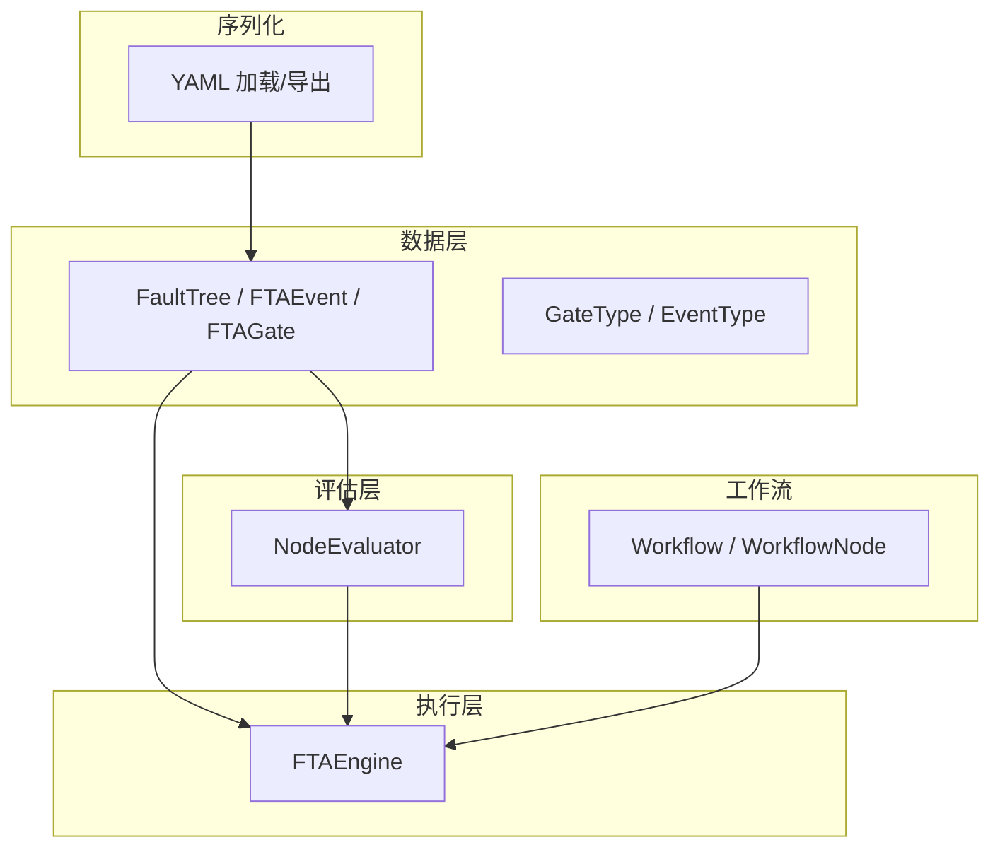
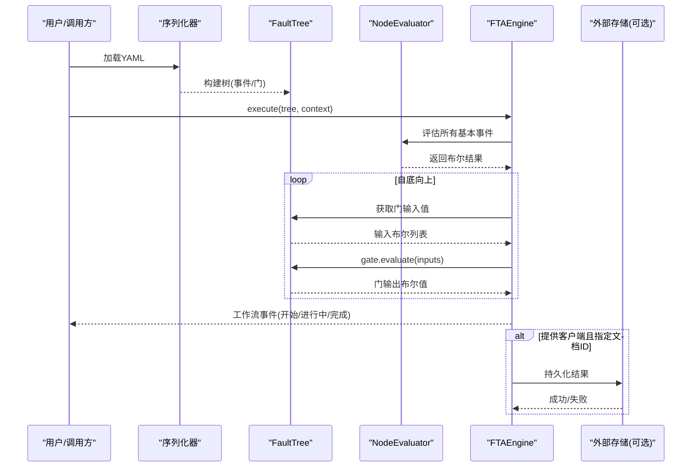
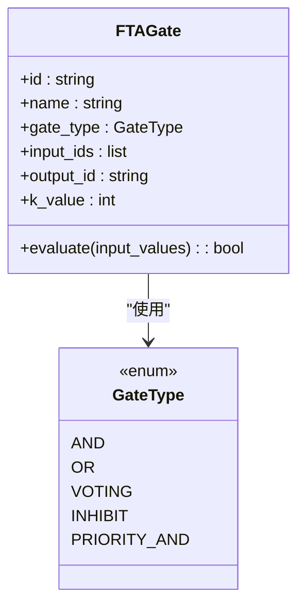
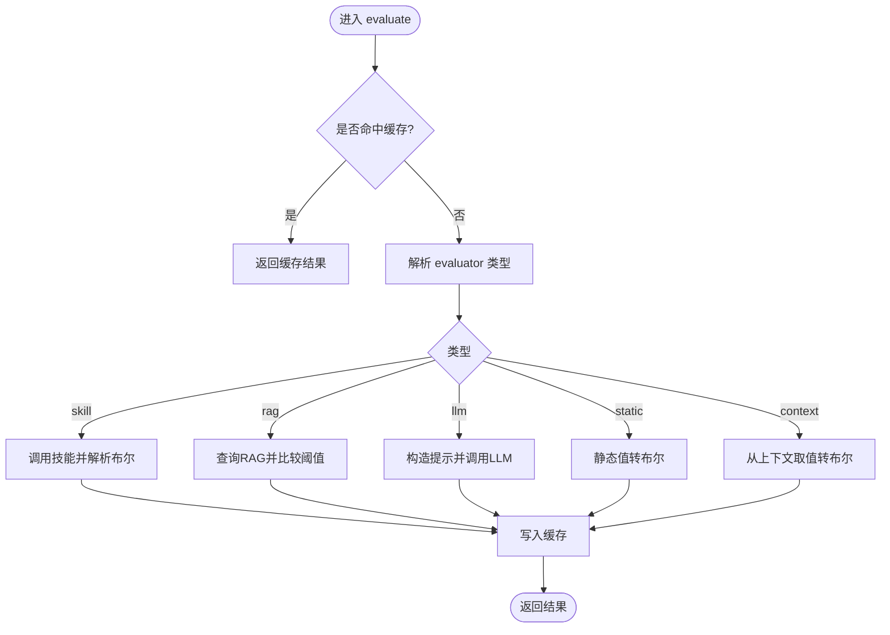
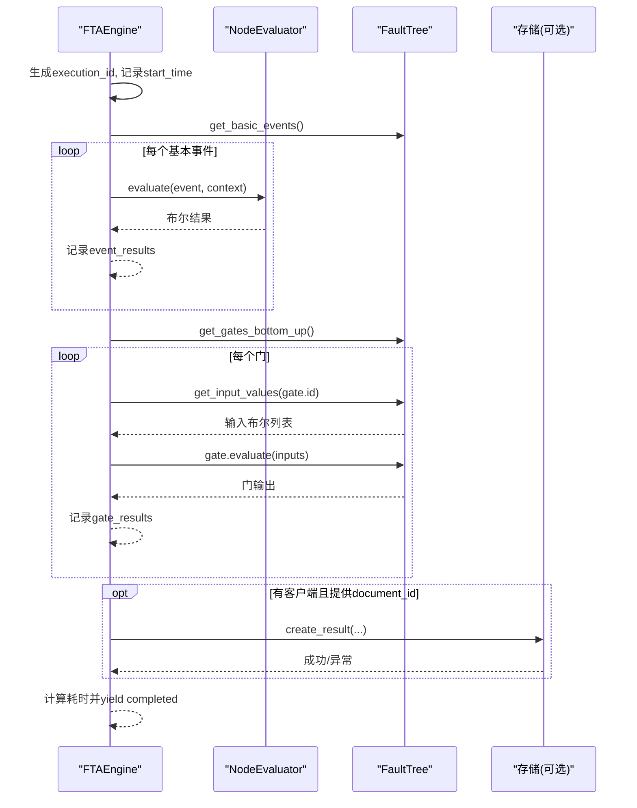
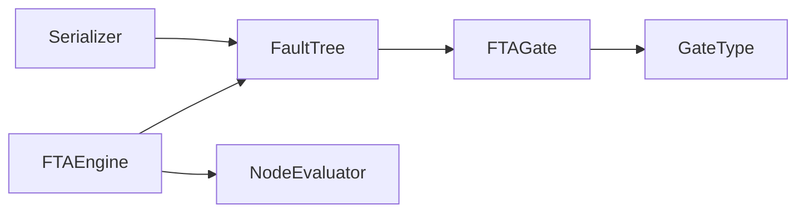

# 逻辑门实现

<cite>
**本文引用的文件**
- [gates.py](file://python/src/resolveagent/fta/gates.py)
- [tree.py](file://python/src/resolveagent/fta/tree.py)
- [engine.py](file://python/src/resolveagent/fta/engine.py)
- [evaluator.py](file://python/src/resolveagent/fta/evaluator.py)
- [serializer.py](file://python/src/resolveagent/fta/serializer.py)
- [workflow.py](file://python/src/resolveagent/fta/workflow.py)
- [test_fta_engine.py](file://python/tests/unit/test_fta_engine.py)
- [test_fta_parallel.py](file://python/tests/test_fta_parallel.py)
- [sample_fta_tree.yaml](file://python/tests/fixtures/sample_fta_tree.yaml)
</cite>

## 目录
1. [简介](#简介)
2. [项目结构](#项目结构)
3. [核心组件](#核心组件)
4. [架构总览](#架构总览)
5. [详细组件分析](#详细组件分析)
6. [依赖关系分析](#依赖关系分析)
7. [性能考虑](#性能考虑)
8. [故障排查指南](#故障排查指南)
9. [结论](#结论)
10. [附录：真值表与公式、示例与测试](#附录真值表与公式示例与测试)

## 简介
本技术文档聚焦于故障树分析（FTA）中的逻辑门实现，系统阐述各类门的数学原理、输入输出关系、计算公式与触发机制，并说明其在故障树中的应用场景与组合使用方法。文档覆盖与门（AND）、或门（OR）、投票门（VOTING）、抑制门（INHIBIT）、优先级与门（PRIORITY_AND），并对条件与门（COND_AND）、条件或门（COND_OR）、非门（NOT）、阈值门（THRESHOLD）在工程实践中的映射与扩展进行说明。同时提供代码级流程图、时序图与类图，帮助读者快速理解从数据模型到执行引擎的完整链路。

## 项目结构
FTA 相关代码位于 Python 模块中，核心由“数据结构 + 评估器 + 执行引擎 + 序列化”组成：
- 数据结构：定义事件、门类型、故障树拓扑与自评估方法
- 评估器：负责基本事件的求值（技能调用、RAG、LLM、静态值、上下文）
- 执行引擎：自底向上遍历树，计算各门结果并产出工作流事件
- 序列化：YAML 导入导出，便于配置与版本管理
- 工作流：通用流程节点与边定义，用于编排更复杂的诊断流程

图表来源
- [tree.py:20-78](file://python/src/resolveagent/fta/tree.py#L20-L78)
- [evaluator.py:21-110](file://python/src/resolveagent/fta/evaluator.py#L21-L110)
- [engine.py:20-130](file://python/src/resolveagent/fta/engine.py#L20-L130)
- [serializer.py:12-113](file://python/src/resolveagent/fta/serializer.py#L12-L113)
- [workflow.py:9-134](file://python/src/resolveagent/fta/workflow.py#L9-L134)

章节来源
- [tree.py:20-151](file://python/src/resolveagent/fta/tree.py#L20-L151)
- [engine.py:20-130](file://python/src/resolveagent/fta/engine.py#L20-L130)
- [evaluator.py:21-368](file://python/src/resolveagent/fta/evaluator.py#L21-L368)
- [serializer.py:12-113](file://python/src/resolveagent/fta/serializer.py#L12-L113)
- [workflow.py:9-134](file://python/src/resolveagent/fta/workflow.py#L9-L134)

## 核心组件
- 故障树数据结构：包含事件与门的声明、拓扑关系与自评估能力
- 门类型枚举：统一描述 AND、OR、VOTING、INHIBIT、PRIORITY_AND
- 基本事件评估器：支持 skill、rag、llm、static、context 多种求值方式
- 执行引擎：按拓扑顺序自底向上计算门结果，产出可观测的工作流事件
- 序列化：将树结构以 YAML 形式持久化与反序列化
- 工作流：通用流程建模，便于与 FTA 结合形成端到端诊断流程

章节来源
- [tree.py:30-78](file://python/src/resolveagent/fta/tree.py#L30-L78)
- [evaluator.py:21-110](file://python/src/resolveagent/fta/evaluator.py#L21-L110)
- [engine.py:34-130](file://python/src/resolveagent/fta/engine.py#L34-L130)
- [serializer.py:26-113](file://python/src/resolveagent/fta/serializer.py#L26-L113)
- [workflow.py:9-134](file://python/src/resolveagent/fta/workflow.py#L9-L134)

## 架构总览
下图展示了从 YAML 配置到执行结果的完整链路：解析树、评估基本事件、自底向上计算门、最终得到顶事件结果并可持久化。

图表来源
- [serializer.py:12-70](file://python/src/resolveagent/fta/serializer.py#L12-L70)
- [engine.py:34-130](file://python/src/resolveagent/fta/engine.py#L34-L130)
- [tree.py:103-151](file://python/src/resolveagent/fta/tree.py#L103-L151)

## 详细组件分析

### 门类型与运算规则
- AND（与门）：当所有输入为真时输出真；空输入为假
- OR（或门）：至少一个输入为真则输出真；空输入为假
- VOTING（投票门）：当 True 数量达到 k 时输出真；空输入为假
- INHIBIT（抑制门）：语义上为“带条件事件的与门”，当前实现等价于 all(inputs)
- PRIORITY_AND（优先级与门）：语义上为“有序依赖的与门”，当前实现等价于 all(inputs)

上述门在 FTAGate.evaluate 中统一处理，并在 gates.py 中提供独立函数接口。

图表来源
- [tree.py:43-78](file://python/src/resolveagent/fta/tree.py#L43-L78)
- [tree.py:20-28](file://python/src/resolveagent/fta/tree.py#L20-L28)

章节来源
- [tree.py:43-78](file://python/src/resolveagent/fta/tree.py#L43-L78)
- [gates.py:6-28](file://python/src/resolveagent/fta/gates.py#L6-L28)

### 基本事件评估器
NodeEvaluator 负责将“基本事件”转化为布尔值，支持：
- skill：调用技能，解析结果为布尔
- rag：检索知识库，基于相似度阈值判定匹配
- llm：通过大模型分类，解析 true/false
- static：静态字符串转布尔
- context：从执行上下文中取值并转为布尔

评估过程具备缓存机制，避免重复计算。

图表来源
- [evaluator.py:51-110](file://python/src/resolveagent/fta/evaluator.py#L51-L110)
- [evaluator.py:112-368](file://python/src/resolveagent/fta/evaluator.py#L112-L368)

章节来源
- [evaluator.py:21-368](file://python/src/resolveagent/fta/evaluator.py#L21-L368)

### 执行引擎与工作流事件
FTAEngine 负责：
- 生成执行 ID 与计时
- 先评估所有基本事件，再自底向上评估门
- 产生 workflow.started / node.evaluating / node.completed / gate.evaluating / gate.completed / workflow.completed 等事件
- 可选地将结果持久化到 Go 平台存储

图表来源
- [engine.py:34-130](file://python/src/resolveagent/fta/engine.py#L34-L130)
- [tree.py:103-151](file://python/src/resolveagent/fta/tree.py#L103-L151)

章节来源
- [engine.py:34-130](file://python/src/resolveagent/fta/engine.py#L34-L130)

### 条件门（COND_AND / COND_OR）与阈值门（THRESHOLD）的工程映射
- 条件与门（COND_AND）：可用“抑制门（INHIBIT）”表达，将主输入与条件输入一起作为 all(inputs) 的输入集合
- 条件或门（COND_OR）：可通过“或门（OR）+ 上下文/评估器”实现，例如将条件作为额外输入参与 any(inputs)，或在 NodeEvaluator 中根据上下文动态决定输入集合
- 阈值门（THRESHOLD）：可用“投票门（VOTING）”近似实现，设置 k 为阈值计数；或使用评估器对连续值进行阈值判断后转换为布尔

章节来源
- [tree.py:43-78](file://python/src/resolveagent/fta/tree.py#L43-L78)
- [evaluator.py:169-238](file://python/src/resolveagent/fta/evaluator.py#L169-L238)

### 故障树序列化与示例
- 支持从 YAML 加载树结构，包括事件与门
- 支持将树结构导出为 YAML，便于版本管理与共享
- 示例树定义了顶层事件、两个基本事件和一个或门

章节来源
- [serializer.py:12-113](file://python/src/resolveagent/fta/serializer.py#L12-L113)
- [sample_fta_tree.yaml:1-23](file://python/tests/fixtures/sample_fta_tree.yaml#L1-L23)

## 依赖关系分析
- FTAGate.evaluate 依赖 GateType 枚举
- FTAEngine 依赖 FaultTree 的拓扑方法与 FTAGate.evaluate
- NodeEvaluator 依赖外部能力（skill、rag、llm）但通过接口解耦
- 序列化模块依赖 tree 的数据结构

图表来源
- [tree.py:20-78](file://python/src/resolveagent/fta/tree.py#L20-L78)
- [engine.py:20-130](file://python/src/resolveagent/fta/engine.py#L20-L130)
- [evaluator.py:21-110](file://python/src/resolveagent/fta/evaluator.py#L21-L110)
- [serializer.py:12-70](file://python/src/resolveagent/fta/serializer.py#L12-L70)

章节来源
- [tree.py:20-151](file://python/src/resolveagent/fta/tree.py#L20-L151)
- [engine.py:20-130](file://python/src/resolveagent/fta/engine.py#L20-L130)
- [evaluator.py:21-368](file://python/src/resolveagent/fta/evaluator.py#L21-L368)
- [serializer.py:12-113](file://python/src/resolveagent/fta/serializer.py#L12-L113)

## 性能考虑
- 基本事件评估缓存：NodeEvaluator 内部维护缓存，避免重复调用外部服务
- 拓扑排序：FaultTree.get_gates_bottom_up 使用 Kahn 算法保证自底向上顺序，减少重复计算
- 短路求值：AND/OR 的 all/any 天然具备短路特性，可降低不必要计算
- 并行评估：测试中引入 ParallelFTAEvaluator，可按层级并行评估以提升吞吐
- I/O 优化：RAG/LLM/skill 调用应配合超时与重试策略，避免阻塞

[本节为通用指导，不直接分析具体文件]

## 故障排查指南
- 未定义评估器：NodeEvaluator 会警告并默认返回 True，检查事件 evaluator 字段是否正确配置
- 未知评估器类型：日志记录警告，建议修正 evaluator 格式为 type:target
- 技能/RAG/LLM 调用失败：捕获异常并返回 False，检查外部依赖可用性、参数与网络
- 循环或断连：get_gates_bottom_up 检测到环或不可达时回退为逆序，需检查输入依赖关系
- 空输入门：AND/OR/VOTING 对空输入返回 False，确保输入列表非空或业务逻辑允许

章节来源
- [evaluator.py:70-110](file://python/src/resolveagent/fta/evaluator.py#L70-L110)
- [tree.py:103-137](file://python/src/resolveagent/fta/tree.py#L103-L137)

## 结论
本实现以简洁清晰的数据结构与统一的门评估接口为核心，配合灵活的评估器与稳健的执行引擎，实现了可扩展的 FTA 逻辑门体系。通过对条件门与阈值门的工程映射，可在现有门类型基础上满足更丰富的业务需求。结合序列化与工作流，能够支撑从配置到执行的完整闭环。

[本节为总结性内容，不直接分析具体文件]

## 附录：真值表与公式、示例与测试

### 真值表与计算公式
- AND：输出 = AND(x1, x2, ..., xn) = all([x1..xn])；空集为 False
- OR：输出 = OR(x1, x2, ..., xn) = any([x1..xn])；空集为 False
- VOTING(k)：输出 = sum([x1..xn]) >= k；空集为 False
- INHIBIT：当前实现为 all(inputs)，可视为“主输入与条件输入的与”
- PRIORITY_AND：当前实现为 all(inputs)，可视为“有序依赖的与”

章节来源
- [tree.py:54-78](file://python/src/resolveagent/fta/tree.py#L54-L78)
- [gates.py:6-28](file://python/src/resolveagent/fta/gates.py#L6-L28)

### 代码示例路径
- 门函数示例：and_gate、or_gate、voting_gate
  - [gates.py:6-28](file://python/src/resolveagent/fta/gates.py#L6-L28)
- 门评估封装：FTAGate.evaluate
  - [tree.py:54-78](file://python/src/resolveagent/fta/tree.py#L54-L78)
- 执行入口：FTAEngine.execute
  - [engine.py:34-130](file://python/src/resolveagent/fta/engine.py#L34-L130)
- 基本事件评估：NodeEvaluator.evaluate
  - [evaluator.py:51-110](file://python/src/resolveagent/fta/evaluator.py#L51-L110)
- 树序列化：load_tree_from_yaml/dump_tree_to_yaml
  - [serializer.py:12-113](file://python/src/resolveagent/fta/serializer.py#L12-L113)

### 测试用例路径
- 门与树的单元测试
  - [test_fta_engine.py:7-40](file://python/tests/unit/test_fta_engine.py#L7-L40)
- 并行评估与缓存行为
  - [test_fta_parallel.py:14-210](file://python/tests/test_fta_parallel.py#L14-L210)
- 示例故障树配置
  - [sample_fta_tree.yaml:1-23](file://python/tests/fixtures/sample_fta_tree.yaml#L1-L23)