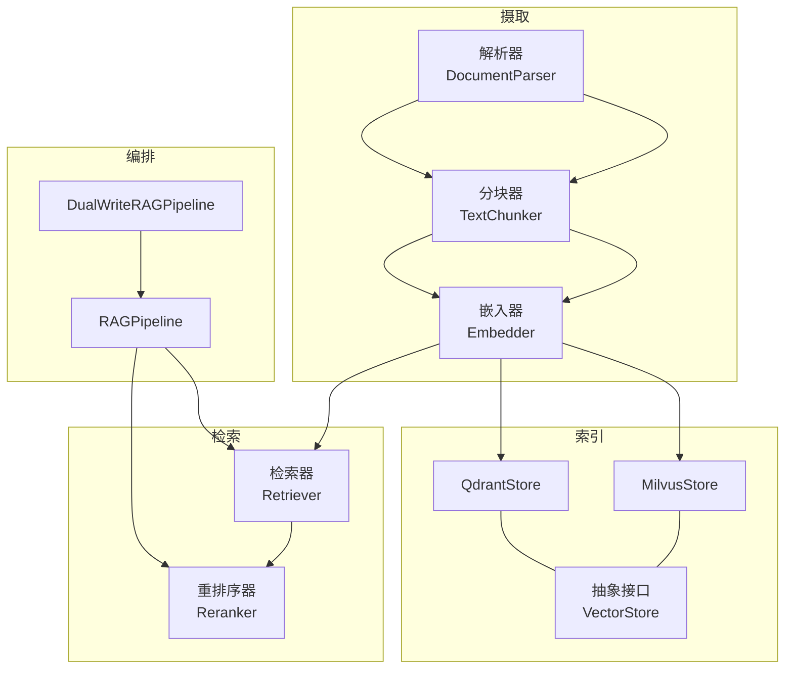
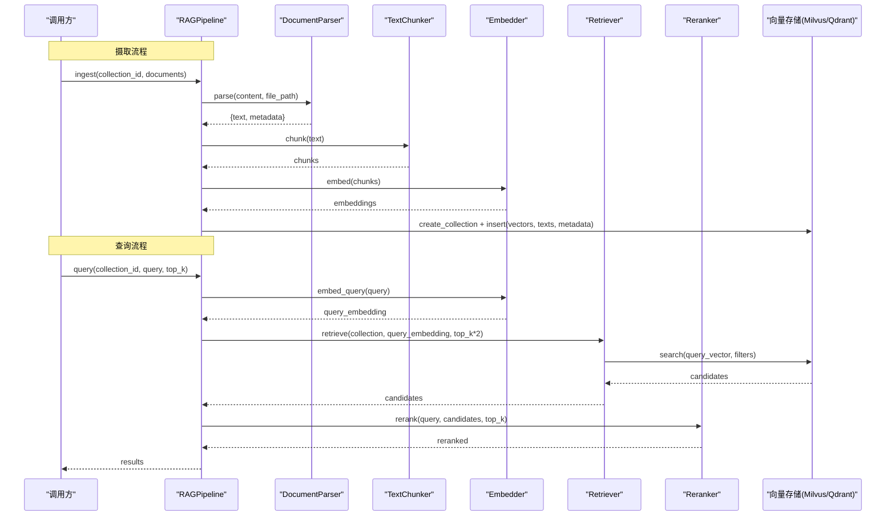
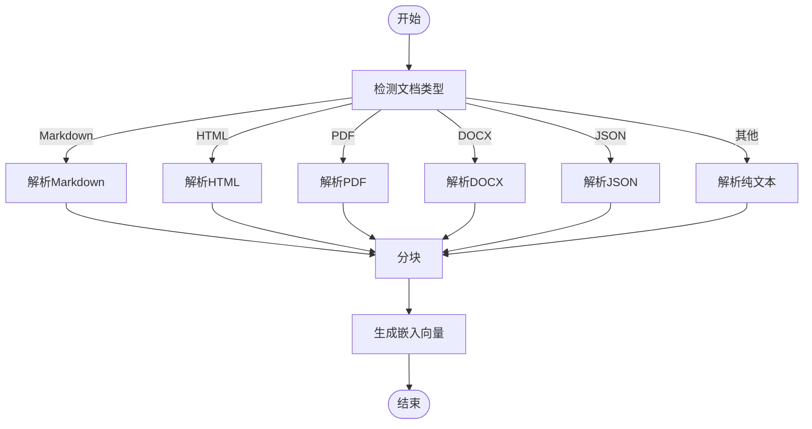
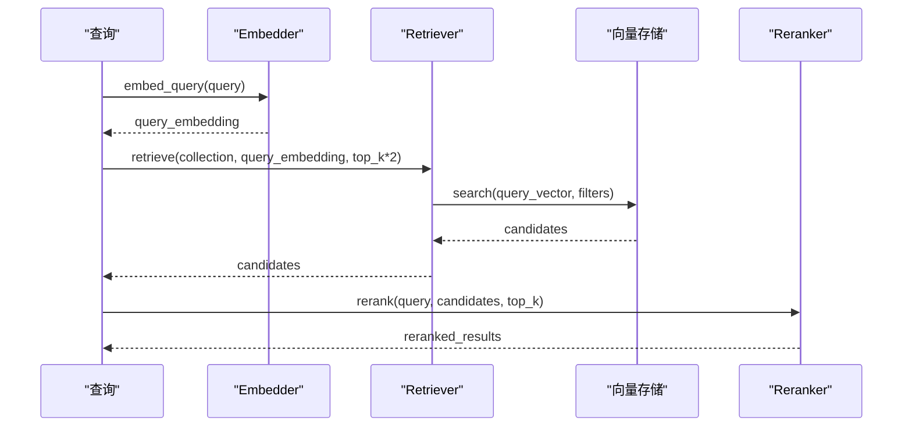
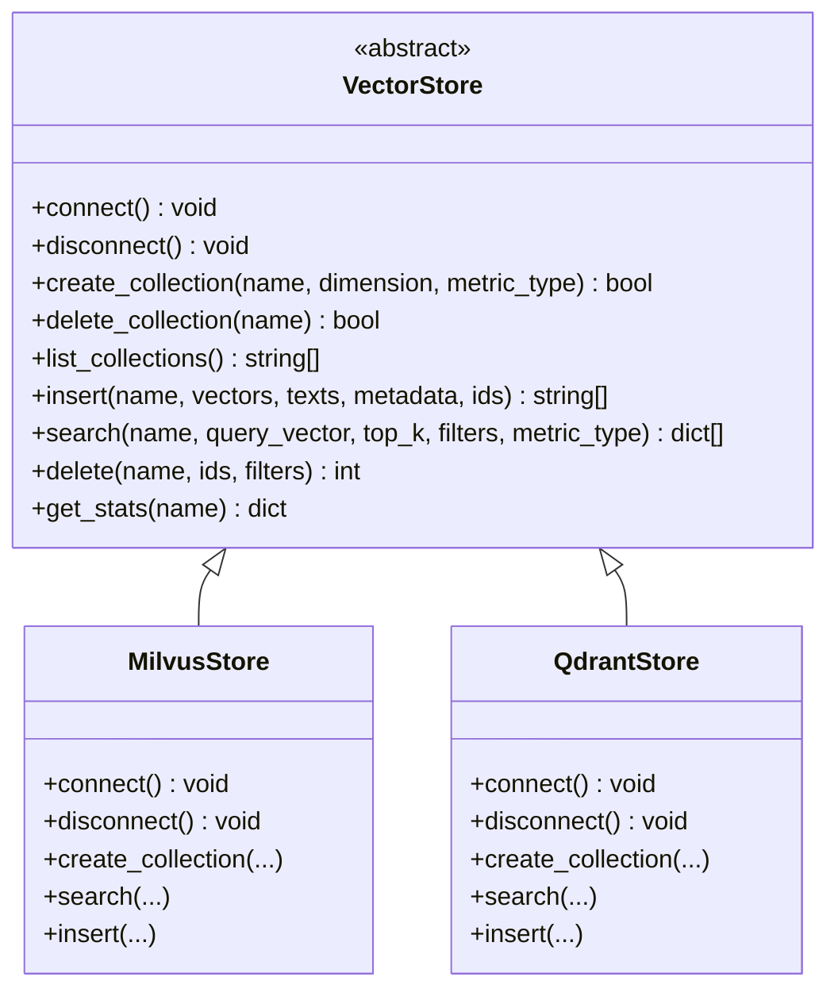
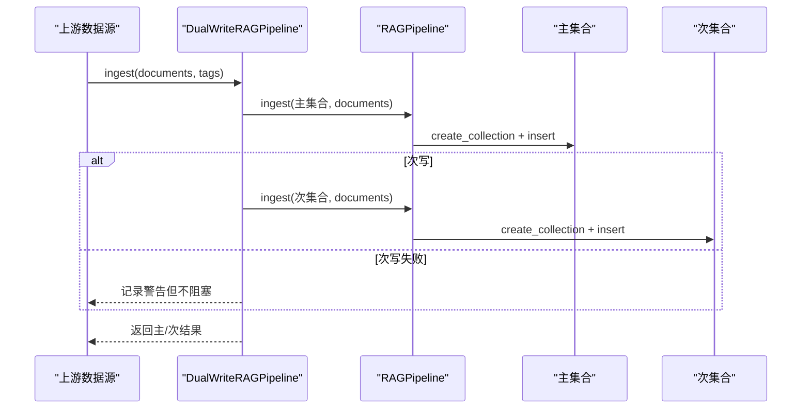
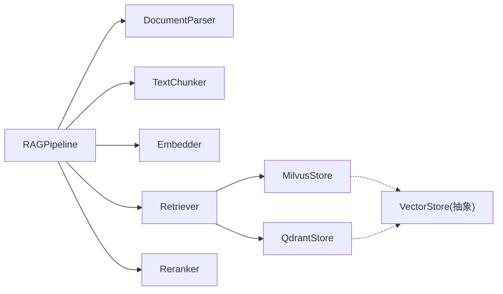

# RAG 管道系统

<cite>
**本文引用的文件**
- [pipeline.py](file://python/src/resolveagent/rag/pipeline.py)
- [dual_writer.py](file://python/src/resolveagent/rag/dual_writer.py)
- [parser.py](file://python/src/resolveagent/rag/ingest/parser.py)
- [chunker.py](file://python/src/resolveagent/rag/ingest/chunker.py)
- [embedder.py](file://python/src/resolveagent/rag/ingest/embedder.py)
- [retriever.py](file://python/src/resolveagent/rag/retrieve/retriever.py)
- [reranker.py](file://python/src/resolveagent/rag/retrieve/reranker.py)
- [milvus.py](file://python/src/resolveagent/rag/index/milvus.py)
- [qdrant.py](file://python/src/resolveagent/rag/index/qdrant.py)
- [base.py](file://python/src/resolveagent/rag/index/base.py)
- [config.yaml](file://docs/demo/demo/rag/config.yaml)
- [test_rag_pipeline.py](file://python/tests/unit/test_rag_pipeline.py)
</cite>

## 目录
1. [简介](#简介)
2. [项目结构](#项目结构)
3. [核心组件](#核心组件)
4. [架构总览](#架构总览)
5. [详细组件分析](#详细组件分析)
6. [依赖关系分析](#依赖关系分析)
7. [性能考量](#性能考量)
8. [故障排查指南](#故障排查指南)
9. [结论](#结论)
10. [附录：配置与示例](#附录配置与示例)

## 简介
本技术文档面向 ResolveAgent 中的检索增强生成（RAG）管道系统，系统性阐述从文档摄取、向量化、索引存储到检索与重排序的完整流程。重点覆盖：
- 文档摄取：Parser 解析器、Chunker 分块器、Embedder 嵌入器如何协同处理多格式文档并生成向量表示
- 检索与重排序：Retriever 检索器与 Reranker 重排序器如何从向量数据库召回并精排最相关内容
- 向量索引后端：Milvus 与 Qdrant 的配置与使用方式
- 双写机制：DualWriter 如何确保数据一致性并兼顾向后兼容
- 配置与优化：提供完整的 RAG 配置示例与性能调优建议

## 项目结构
RAG 相关代码位于 Python 模块中，按职责分层组织：
- ingest：文档解析、分块、嵌入
- retrieve：检索、重排序
- index：向量存储抽象与具体实现（Milvus、Qdrant）
- pipeline：端到端编排
- dual_writer：双写封装

图表来源
- [pipeline.py:18-42](file://python/src/resolveagent/rag/pipeline.py#L18-L42)
- [retriever.py:14-51](file://python/src/resolveagent/rag/retrieve/retriever.py#L14-L51)
- [milvus.py:29-40](file://python/src/resolveagent/rag/index/milvus.py#L29-L40)
- [qdrant.py:13-24](file://python/src/resolveagent/rag/index/qdrant.py#L13-L24)
- [base.py:9-14](file://python/src/resolveagent/rag/index/base.py#L9-L14)

章节来源
- [pipeline.py:18-42](file://python/src/resolveagent/rag/pipeline.py#L18-L42)
- [retriever.py:14-51](file://python/src/resolveagent/rag/retrieve/retriever.py#L14-L51)
- [milvus.py:29-40](file://python/src/resolveagent/rag/index/milvus.py#L29-L40)
- [qdrant.py:13-24](file://python/src/resolveagent/rag/index/qdrant.py#L13-L24)
- [base.py:9-14](file://python/src/resolveagent/rag/index/base.py#L9-L14)

## 核心组件
- RAGPipeline：端到端编排“解析→分块→嵌入→索引”和“查询嵌入→检索→重排序”，并可选持久化文档元数据
- DocumentParser：统一解析多种文档格式（文本、Markdown、HTML、PDF、DOCX、JSON），输出纯文本与元信息
- TextChunker：支持固定大小、句子边界、标题层级等多种分块策略
- Embedder：通过 HTTP 调用嵌入模型（如 BGE），批量或单条生成向量
- Retriever：基于配置的向量后端（Milvus/Qdrant）进行相似度检索，支持元数据过滤
- Reranker：优先使用交叉编码器（CrossEncoder）重排序，回退至 LLM 评分或词频相似度
- MilvusStore / QdrantStore：实现统一的 VectorStore 接口，负责集合管理、插入、搜索、统计等
- DualWriteRAGPipeline：将同一批文档写入主集合与次集合，保障向后兼容与数据一致性

章节来源
- [pipeline.py:18-42](file://python/src/resolveagent/rag/pipeline.py#L18-L42)
- [parser.py:24-71](file://python/src/resolveagent/rag/ingest/parser.py#L24-L71)
- [chunker.py:8-50](file://python/src/resolveagent/rag/ingest/chunker.py#L8-L50)
- [embedder.py:13-49](file://python/src/resolveagent/rag/ingest/embedder.py#L13-L49)
- [retriever.py:14-51](file://python/src/resolveagent/rag/retrieve/retriever.py#L14-L51)
- [reranker.py:28-56](file://python/src/resolveagent/rag/retrieve/reranker.py#L28-L56)
- [milvus.py:29-40](file://python/src/resolveagent/rag/index/milvus.py#L29-L40)
- [qdrant.py:13-24](file://python/src/resolveagent/rag/index/qdrant.py#L13-L24)
- [base.py:9-14](file://python/src/resolveagent/rag/index/base.py#L9-L14)
- [dual_writer.py:22-43](file://python/src/resolveagent/rag/dual_writer.py#L22-L43)

## 架构总览
下图展示 RAG 管道在 ResolveAgent 中的整体交互：用户或上游服务调用 Pipeline，内部依次完成解析、分块、嵌入、索引；查询时先嵌入再检索，最后重排序返回结果。双写包装器可同时将数据写入两个集合。

图表来源
- [pipeline.py:44-138](file://python/src/resolveagent/rag/pipeline.py#L44-L138)
- [pipeline.py:192-254](file://python/src/resolveagent/rag/pipeline.py#L192-L254)
- [retriever.py:53-112](file://python/src/resolveagent/rag/retrieve/retriever.py#L53-L112)
- [milvus.py:270-337](file://python/src/resolveagent/rag/index/milvus.py#L270-L337)
- [qdrant.py:252-318](file://python/src/resolveagent/rag/index/qdrant.py#L252-L318)

## 详细组件分析

### 文档摄取：Parser → Chunker → Embedder
- Parser 根据扩展名或内容特征识别格式，分别走 Markdown、HTML、PDF、DOCX、JSON、纯文本路径，提取正文与元信息（标题、作者、来源等）
- Chunker 支持 fixed/sentence/by_h2/by_h3/by_section 等策略，保证分块长度可控且语义连贯
- Embedder 通过 HTTP 调用嵌入服务，支持批量与单条查询，具备维度映射与错误回退

图表来源
- [parser.py:38-71](file://python/src/resolveagent/rag/ingest/parser.py#L38-L71)
- [parser.py:114-148](file://python/src/resolveagent/rag/ingest/parser.py#L114-L148)
- [parser.py:150-199](file://python/src/resolveagent/rag/ingest/parser.py#L150-L199)
- [parser.py:201-247](file://python/src/resolveagent/rag/ingest/parser.py#L201-L247)
- [parser.py:249-309](file://python/src/resolveagent/rag/ingest/parser.py#L249-L309)
- [parser.py:311-336](file://python/src/resolveagent/rag/ingest/parser.py#L311-L336)
- [chunker.py:30-50](file://python/src/resolveagent/rag/ingest/chunker.py#L30-L50)
- [embedder.py:50-119](file://python/src/resolveagent/rag/ingest/embedder.py#L50-L119)

章节来源
- [parser.py:24-71](file://python/src/resolveagent/rag/ingest/parser.py#L24-L71)
- [chunker.py:8-50](file://python/src/resolveagent/rag/ingest/chunker.py#L8-L50)
- [embedder.py:13-49](file://python/src/resolveagent/rag/ingest/embedder.py#L13-L49)

### 检索与重排序：Retriever → Reranker
- Retriever 根据配置选择 Milvus 或 Qdrant 后端，执行相似度检索，支持元数据过滤
- Reranker 优先使用 CrossEncoder 对候选片段重排序，若不可用则回退到 LLM 评分或词频相似度；支持多样性选择（MMR）

图表来源
- [retriever.py:53-112](file://python/src/resolveagent/rag/retrieve/retriever.py#L53-L112)
- [reranker.py:97-134](file://python/src/resolveagent/rag/retrieve/reranker.py#L97-L134)
- [milvus.py:270-337](file://python/src/resolveagent/rag/index/milvus.py#L270-L337)
- [qdrant.py:252-318](file://python/src/resolveagent/rag/index/qdrant.py#L252-L318)

章节来源
- [retriever.py:14-51](file://python/src/resolveagent/rag/retrieve/retriever.py#L14-L51)
- [reranker.py:28-56](file://python/src/resolveagent/rag/retrieve/reranker.py#L28-L56)

### 向量索引后端：Milvus 与 Qdrant
- 抽象接口 VectorStore 定义连接、集合管理、插入、搜索、删除、统计等统一方法
- MilvusStore：创建集合、构建 IVF_FLAT 索引、支持 COSINE/L2/IP 距离度量、元数据过滤
- QdrantStore：创建集合、设置向量参数、支持 COSINE/EUCLID/DOT、payload 过滤与批量 upsert

图表来源
- [base.py:9-144](file://python/src/resolveagent/rag/index/base.py#L9-L144)
- [milvus.py:29-40](file://python/src/resolveagent/rag/index/milvus.py#L29-L40)
- [qdrant.py:13-24](file://python/src/resolveagent/rag/index/qdrant.py#L13-L24)

章节来源
- [base.py:9-144](file://python/src/resolveagent/rag/index/base.py#L9-L144)
- [milvus.py:29-40](file://python/src/resolveagent/rag/index/milvus.py#L29-L40)
- [qdrant.py:13-24](file://python/src/resolveagent/rag/index/qdrant.py#L13-L24)

### 双写机制：DualWriter
- 将同一批文档同时写入主集合（如 code-analysis）与次集合（如 kudig-rag）
- 主写必须成功，次写为尽力而为（失败仅记录日志不阻塞主流程）
- 提供便捷方法将静态分析结果或报告转换为 RAG 文档并入库

图表来源
- [dual_writer.py:45-95](file://python/src/resolveagent/rag/dual_writer.py#L45-L95)
- [pipeline.py:44-138](file://python/src/resolveagent/rag/pipeline.py#L44-L138)

章节来源
- [dual_writer.py:22-43](file://python/src/resolveagent/rag/dual_writer.py#L22-L43)
- [dual_writer.py:45-95](file://python/src/resolveagent/rag/dual_writer.py#L45-L95)

## 依赖关系分析
- RAGPipeline 依赖 Parser/Chunker/Embedder/Retriever/Reranker，并在索引阶段动态加载 MilvusStore
- Retriever 根据 vector_backend 选择 MilvusStore 或 QdrantStore
- Reranker 依赖 sentence-transformers（可选），否则回退到 LLM 或词频策略
- Embedder 依赖 httpx 与外部嵌入 API（默认 DashScope 兼容模式）

图表来源
- [pipeline.py:18-42](file://python/src/resolveagent/rag/pipeline.py#L18-L42)
- [retriever.py:14-51](file://python/src/resolveagent/rag/retrieve/retriever.py#L14-L51)
- [milvus.py:29-40](file://python/src/resolveagent/rag/index/milvus.py#L29-L40)
- [qdrant.py:13-24](file://python/src/resolveagent/rag/index/qdrant.py#L13-L24)
- [base.py:9-14](file://python/src/resolveagent/rag/index/base.py#L9-L14)

章节来源
- [pipeline.py:18-42](file://python/src/resolveagent/rag/pipeline.py#L18-L42)
- [retriever.py:14-51](file://python/src/resolveagent/rag/retrieve/retriever.py#L14-L51)

## 性能考量
- 分块策略选择
  - 长文档建议使用 by_h2/by_h3/by_section 保持段落语义；短文本可用 sentence；需要严格长度控制时使用 fixed
  - 参考测试用例验证分块效果与上限
- 嵌入批处理
  - 使用 Embedder.embed_batch 提高吞吐，合理设置 batch_size
- 检索规模
  - 检索 top_k 建议设置为最终 top_k 的 2 倍，为重排序留出空间
- 重排序开销
  - CrossEncoder 精度高但较慢，适合小批量候选；无依赖时可回退到 LLM 或词频策略
- 向量索引
  - Milvus 使用 IVF_FLAT 索引，nlist 可根据数据量调整；Qdrant 注意向量距离度量匹配
- 双写成本
  - 次写为 best-effort，避免影响主流程延迟

章节来源
- [test_rag_pipeline.py:6-18](file://python/tests/unit/test_rag_pipeline.py#L6-L18)
- [embedder.py:133-154](file://python/src/resolveagent/rag/ingest/embedder.py#L133-L154)
- [pipeline.py:192-254](file://python/src/resolveagent/rag/pipeline.py#L192-L254)
- [milvus.py:146-158](file://python/src/resolveagent/rag/index/milvus.py#L146-L158)
- [qdrant.py:108-133](file://python/src/resolveagent/rag/index/qdrant.py#L108-L133)

## 故障排查指南
- 嵌入 API 失败
  - 检查 API Key 与 base_url；网络超时或状态码异常会抛出运行时错误
- 向量库连接失败
  - 确认 Milvus/Qdrant 服务可达；未安装客户端库会报错提示安装
- 集合名称非法
  - Milvus 要求以字母或下划线开头且仅含字母数字下划线；管道已内置名称清洗
- 重排序不可用
  - 未安装 sentence-transformers 将自动回退；LLM 重排序需配置 llm_provider
- 双写不一致
  - 次写失败仅记录日志；关注日志告警并检查次集合可用性

章节来源
- [embedder.py:111-119](file://python/src/resolveagent/rag/ingest/embedder.py#L111-L119)
- [milvus.py:67-88](file://python/src/resolveagent/rag/index/milvus.py#L67-L88)
- [qdrant.py:51-78](file://python/src/resolveagent/rag/index/qdrant.py#L51-L78)
- [milvus.py:14-26](file://python/src/resolveagent/rag/index/milvus.py#L14-L26)
- [reranker.py:14-22](file://python/src/resolveagent/rag/retrieve/reranker.py#L14-L22)
- [dual_writer.py:76-89](file://python/src/resolveagent/rag/dual_writer.py#L76-L89)

## 结论
ResolveAgent 的 RAG 管道提供了从多格式文档摄取到高质量检索的完整链路，并通过双写机制保障向后兼容与数据一致性。借助灵活的解析、分块、嵌入与重排序策略，以及 Milvus/Qdrant 双后端支持，可在不同场景下平衡精度与性能。结合合理的配置与优化实践，可有效提升问答与知识检索的效果与稳定性。

## 附录：配置与示例
- 集合与嵌入配置
  - embedding.model：如 bge-large-zh，对应维度由 Embedder 维护
  - chunking.strategy：fixed/sentence/semantic（语义策略可由上层策略决定）
  - retrieval.rerank_enabled：是否启用重排序；rerank_model：交叉编码器模型名
- 文档源
  - sources.type：directory；path：文档目录；patterns：文件后缀匹配
- 运行与测试
  - 单元测试验证分块策略与边界条件

章节来源
- [config.yaml:1-38](file://docs/demo/demo/rag/config.yaml#L1-L38)
- [embedder.py:24-49](file://python/src/resolveagent/rag/ingest/embedder.py#L24-L49)
- [test_rag_pipeline.py:6-18](file://python/tests/unit/test_rag_pipeline.py#L6-L18)