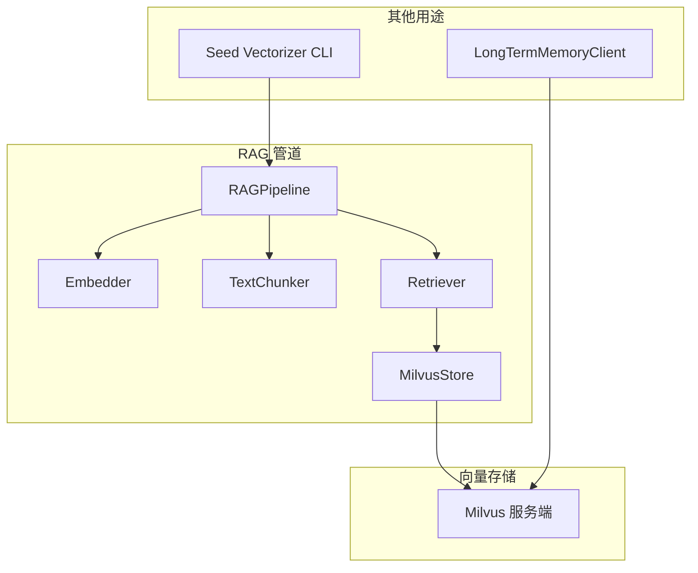
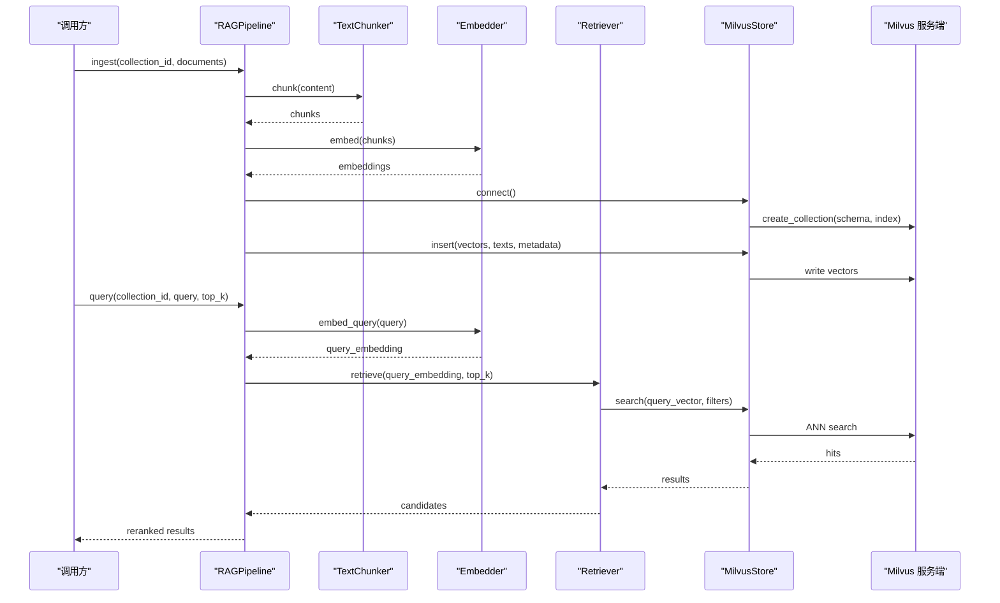
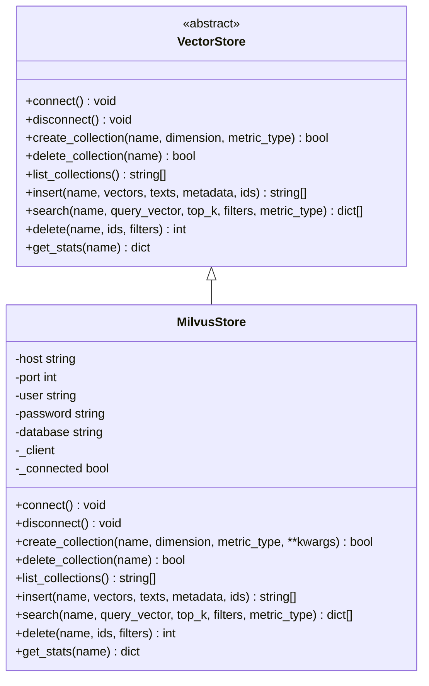
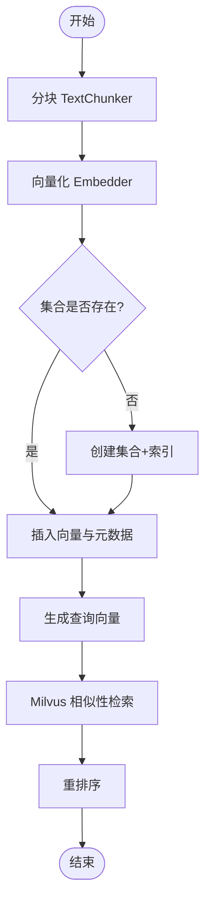
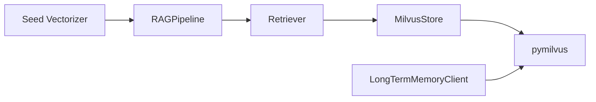

# Milvus 向量存储

<cite>
**本文引用的文件**
- [milvus.py](file://python/src/resolveagent/rag/index/milvus.py)
- [base.py](file://python/src/resolveagent/rag/index/base.py)
- [pipeline.py](file://python/src/resolveagent/rag/pipeline.py)
- [retriever.py](file://python/src/resolveagent/rag/retrieve/retriever.py)
- [seed_vectorizer.py](file://python/src/resolveagent/corpus/seed_vectorizer.py)
- [memory.py](file://python/src/resolveagent/memory.py)
- [docker-compose.yaml](file://deploy/docker-compose/docker-compose.yaml)
- [resolveagent.yaml](file://configs/resolveagent.yaml)
</cite>

## 目录
1. [简介](#简介)
2. [项目结构](#项目结构)
3. [核心组件](#核心组件)
4. [架构总览](#架构总览)
5. [详细组件分析](#详细组件分析)
6. [依赖关系分析](#依赖关系分析)
7. [性能与调优](#性能与调优)
8. [部署与配置](#部署与配置)
9. [RAG 管道集成示例](#rag-管道集成示例)
10. [故障排除指南](#故障排除指南)
11. [结论](#结论)

## 简介
本技术文档聚焦于 ResolveAgent 项目中 Milvus 向量存储的具体实现，覆盖连接配置、集合管理、向量插入与查询优化、索引与度量类型选择、分区策略建议，以及 RAG 管道中的使用方式。同时提供基于 Docker Compose 的部署参考与常见问题排查方法，帮助读者快速搭建并稳定运行基于 Milvus 的语义检索能力。

## 项目结构
本项目在 Python 侧实现了统一的向量存储抽象接口，并提供 Milvus 后端的具体实现；RAG 管道通过检索器与嵌入器协同完成“分块→向量化→索引→检索→重排”的端到端流程；CLI 工具支持批量将种子文档向量化并写入 Milvus；内存模块亦可直接对接 Milvus 作为长期记忆存储。

图表来源
- [pipeline.py:18-43](file://python/src/resolveagent/rag/pipeline.py#L18-L43)
- [retriever.py:14-51](file://python/src/resolveagent/rag/retrieve/retriever.py#L14-L51)
- [milvus.py:29-95](file://python/src/resolveagent/rag/index/milvus.py#L29-L95)
- [seed_vectorizer.py:257-301](file://python/src/resolveagent/corpus/seed_vectorizer.py#L257-L301)
- [memory.py:315-335](file://python/src/resolveagent/memory.py#L315-L335)

章节来源
- [pipeline.py:18-43](file://python/src/resolveagent/rag/pipeline.py#L18-L43)
- [retriever.py:14-51](file://python/src/resolveagent/rag/retrieve/retriever.py#L14-L51)
- [milvus.py:29-95](file://python/src/resolveagent/rag/index/milvus.py#L29-L95)
- [seed_vectorizer.py:257-301](file://python/src/resolveagent/corpus/seed_vectorizer.py#L257-L301)
- [memory.py:315-335](file://python/src/resolveagent/memory.py#L315-L335)

## 核心组件
- 向量存储抽象：定义统一的连接、集合管理、插入、搜索、删除、统计等接口，便于切换不同后端（如 Qdrant）。
- Milvus 实现：封装连接、集合创建（含 schema、索引）、插入、搜索、删除、统计等功能，并对集合名进行规范化处理。
- RAG 管道：编排“分块→嵌入→索引→检索→重排”，自动确保集合存在并按维度创建索引。
- 检索器：根据配置的向量后端（默认 Milvus）建立连接并执行检索，支持元数据过滤。
- Seed Vectorizer：批量对种子文档进行分块、向量化并写入 Milvus，支持 dry-run 与按集合过滤。
- 长期记忆：直接通过 pymilvus 客户端连接 Milvus，用于跨会话的语义记忆存储。

章节来源
- [base.py:9-144](file://python/src/resolveagent/rag/index/base.py#L9-L144)
- [milvus.py:29-413](file://python/src/resolveagent/rag/index/milvus.py#L29-L413)
- [pipeline.py:18-255](file://python/src/resolveagent/rag/pipeline.py#L18-L255)
- [retriever.py:14-180](file://python/src/resolveagent/rag/retrieve/retriever.py#L14-L180)
- [seed_vectorizer.py:257-384](file://python/src/resolveagent/corpus/seed_vectorizer.py#L257-L384)
- [memory.py:315-416](file://python/src/resolveagent/memory.py#L315-L416)

## 架构总览
下图展示了从 RAG 管道到 Milvus 的数据流与控制流：管道负责切分与向量化，检索器负责调用 Milvus 进行相似性检索，Milvus 负责持久化与近似最近邻搜索。

图表来源
- [pipeline.py:44-190](file://python/src/resolveagent/rag/pipeline.py#L44-L190)
- [pipeline.py:192-255](file://python/src/resolveagent/rag/pipeline.py#L192-L255)
- [retriever.py:53-112](file://python/src/resolveagent/rag/retrieve/retriever.py#L53-L112)
- [milvus.py:97-168](file://python/src/resolveagent/rag/index/milvus.py#L97-L168)
- [milvus.py:207-341](file://python/src/resolveagent/rag/index/milvus.py#L207-L341)

## 详细组件分析

### MilvusStore 类
- 职责：封装与 Milvus 的连接、集合生命周期管理、向量插入与检索、删除与统计。
- 关键特性：
  - 连接参数：host、port、user、password、database。
  - 集合名规范化：确保符合 Milvus 命名规范（字母或下划线开头，仅包含字母数字与下划线，长度限制）。
  - 集合创建：动态字段、主键 id、向量字段、文本字段、JSON 元数据；默认使用 IVF_FLAT 索引与 COSINE 度量。
  - 插入：支持自定义 ID、自动生成 UUID、批量写入。
  - 搜索：支持元数据过滤表达式、加载集合、返回结构化结果。
  - 删除：支持按 ID 删除；按过滤器删除为占位逻辑。
  - 统计：获取集合行数等统计信息。

图表来源
- [base.py:9-144](file://python/src/resolveagent/rag/index/base.py#L9-L144)
- [milvus.py:29-413](file://python/src/resolveagent/rag/index/milvus.py#L29-L413)

章节来源
- [milvus.py:14-26](file://python/src/resolveagent/rag/index/milvus.py#L14-L26)
- [milvus.py:42-95](file://python/src/resolveagent/rag/index/milvus.py#L42-L95)
- [milvus.py:97-168](file://python/src/resolveagent/rag/index/milvus.py#L97-L168)
- [milvus.py:207-341](file://python/src/resolveagent/rag/index/milvus.py#L207-L341)
- [milvus.py:343-408](file://python/src/resolveagent/rag/index/milvus.py#L343-L408)

### RAGPipeline 与 Retriever
- RAGPipeline：
  - 编排分块、嵌入、索引与检索；自动检测嵌入维度并创建集合与索引。
  - 支持可选的 rag_document_client 以持久化文档元数据与状态。
- Retriever：
  - 根据 vector_backend 选择具体存储（默认 Milvus），维护连接复用。
  - 提供 retrieve 与 retrieve_by_text 两种检索入口，支持元数据过滤与度量类型。

图表来源
- [pipeline.py:44-190](file://python/src/resolveagent/rag/pipeline.py#L44-L190)
- [pipeline.py:192-255](file://python/src/resolveagent/rag/pipeline.py#L192-L255)
- [retriever.py:53-112](file://python/src/resolveagent/rag/retrieve/retriever.py#L53-L112)

章节来源
- [pipeline.py:18-255](file://python/src/resolveagent/rag/pipeline.py#L18-L255)
- [retriever.py:14-180](file://python/src/resolveagent/rag/retrieve/retriever.py#L14-L180)

### Seed Vectorizer 与长期记忆
- Seed Vectorizer：
  - 批量处理种子文档，按集合分组，调用 RAGPipeline 进行 ingests。
  - 支持 dry-run、按 collection_filter 筛选、批处理延迟控制。
- 长期记忆：
  - 直接使用 pymilvus 客户端连接 Milvus，创建集合（固定维度与度量），存储与检索记忆条目。

章节来源
- [seed_vectorizer.py:257-384](file://python/src/resolveagent/corpus/seed_vectorizer.py#L257-L384)
- [memory.py:315-416](file://python/src/resolveagent/memory.py#L315-L416)

## 依赖关系分析
- 组件耦合：
  - RAGPipeline 依赖 TextChunker、Embedder、Retriever；Retriever 依赖 MilvusStore/QdrantStore。
  - MilvusStore 依赖 pymilvus 客户端；集合名规范化函数独立于外部库。
- 外部依赖：
  - pymilvus：Milvus 客户端库。
  - 运行时环境：Milvus 服务地址、端口、认证与数据库名。
- 潜在循环依赖：无直接循环；模块间通过抽象接口解耦。

图表来源
- [pipeline.py:18-43](file://python/src/resolveagent/rag/pipeline.py#L18-L43)
- [retriever.py:14-51](file://python/src/resolveagent/rag/retrieve/retriever.py#L14-L51)
- [milvus.py:67-88](file://python/src/resolveagent/rag/index/milvus.py#L67-L88)
- [seed_vectorizer.py:257-301](file://python/src/resolveagent/corpus/seed_vectorizer.py#L257-L301)
- [memory.py:315-335](file://python/src/resolveagent/memory.py#L315-L335)

章节来源
- [pipeline.py:18-43](file://python/src/resolveagent/rag/pipeline.py#L18-L43)
- [retriever.py:14-51](file://python/src/resolveagent/rag/retrieve/retriever.py#L14-L51)
- [milvus.py:67-88](file://python/src/resolveagent/rag/index/milvus.py#L67-L88)
- [seed_vectorizer.py:257-301](file://python/src/resolveagent/corpus/seed_vectorizer.py#L257-L301)
- [memory.py:315-335](file://python/src/resolveagent/memory.py#L315-L335)

## 性能与调优
- 索引类型与参数：
  - 当前默认使用 IVF_FLAT 索引，nlist=128；可根据数据规模与查询吞吐调整 nlist 与索引类型（如 HNSW、IVF_PQ 等）。
- 距离度量：
  - 默认 COSINE；若嵌入模型输出归一化向量，COSINE 通常更合适；否则可考虑 L2。
- 集合维度：
  - 需与嵌入模型输出维度一致；管道会自动检测并使用该维度创建集合。
- 检索参数：
  - top_k 影响召回与重排成本；可在检索阶段扩大候选集后再重排。
- 元数据过滤：
  - 通过 JSON 字段构建过滤表达式，避免全表扫描；尽量利用元数据缩小搜索范围。
- 资源与并发：
  - 合理设置 Milvus 集群副本与分片；在高并发场景下关注 CPU、内存与磁盘 IO。

[本节为通用性能建议，不直接分析具体代码文件]

## 部署与配置
- Docker Compose：
  - 提供平台、运行时、WebUI、PostgreSQL、Redis、NATS 的完整编排；可通过环境变量注入服务地址与端口。
  - 注意：Milvus 未包含在当前 compose 中，需单独部署或通过环境变量指向外部 Milvus 服务。
- 应用配置：
  - resolveagent.yaml 定义了平台服务、数据库、Redis、NATS、遥测等配置项；向量存储相关参数通常在 Python 运行时通过环境变量或代码参数传入。
- 环境变量与密钥：
  - 数据库密码等敏感信息建议使用环境变量注入；Milvus 用户名与密码可通过 MilvusStore 初始化参数传递。

章节来源
- [docker-compose.yaml:22-232](file://deploy/docker-compose/docker-compose.yaml#L22-L232)
- [resolveagent.yaml:5-156](file://configs/resolveagent.yaml#L5-L156)

## RAG 管道集成示例
以下示例展示如何在 RAG 管道中使用 Milvus 进行文档入库与查询。为避免泄露实现细节，仅提供路径引用。

- 文档入库（分块→嵌入→索引）
  - 入口：RAGPipeline.ingest
  - 关键步骤：分块、生成嵌入、确保集合存在并创建索引、批量插入
  - 参考路径
    - [pipeline.py:44-190](file://python/src/resolveagent/rag/pipeline.py#L44-L190)
    - [milvus.py:97-168](file://python/src/resolveagent/rag/index/milvus.py#L97-L168)
    - [milvus.py:207-268](file://python/src/resolveagent/rag/index/milvus.py#L207-L268)

- 查询检索（嵌入→检索→重排）
  - 入口：RAGPipeline.query
  - 关键步骤：生成查询向量、检索候选、重排
  - 参考路径
    - [pipeline.py:192-255](file://python/src/resolveagent/rag/pipeline.py#L192-L255)
    - [retriever.py:53-112](file://python/src/resolveagent/rag/retrieve/retriever.py#L53-L112)
    - [milvus.py:270-341](file://python/src/resolveagent/rag/index/milvus.py#L270-L341)

- 批量种子文档向量化
  - 入口：vectorize_seeds
  - 关键步骤：按集合分组、调用 RAGPipeline 进行 ingests、统计与错误收集
  - 参考路径
    - [seed_vectorizer.py:257-384](file://python/src/resolveagent/corpus/seed_vectorizer.py#L257-L384)

- 长期记忆存储与检索
  - 入口：LongTermMemoryClient.connect/store/search
  - 关键步骤：连接 Milvus、创建集合、插入记忆、相似度检索
  - 参考路径
    - [memory.py:315-416](file://python/src/resolveagent/memory.py#L315-L416)

## 故障排除指南
- 无法连接到 Milvus
  - 现象：连接失败或导入 pymilvus 失败
  - 排查：检查 host/port、网络连通性、认证信息与数据库名；确认已安装 pymilvus
  - 参考路径
    - [milvus.py:67-88](file://python/src/resolveagent/rag/index/milvus.py#L67-L88)
    - [memory.py:315-335](file://python/src/resolveagent/memory.py#L315-L335)

- 集合创建失败或维度不匹配
  - 现象：插入时报错维度不一致
  - 排查：确保嵌入模型输出维度与集合维度一致；管道会自动检测维度，但长期记忆使用固定维度需保持一致
  - 参考路径
    - [pipeline.py:160-168](file://python/src/resolveagent/rag/pipeline.py#L160-L168)
    - [memory.py:320-327](file://python/src/resolveagent/memory.py#L320-L327)

- 检索结果为空或质量不佳
  - 现象：top_k 过小或未命中
  - 排查：增大 top_k 并在检索后重排；检查元数据过滤是否过严；调整索引参数与度量类型
  - 参考路径
    - [retriever.py:53-112](file://python/src/resolveagent/rag/retrieve/retriever.py#L53-L112)
    - [milvus.py:270-341](file://python/src/resolveagent/rag/index/milvus.py#L270-L341)

- 集合名无效
  - 现象：集合名不符合 Milvus 命名规范导致创建失败
  - 排查：使用规范化函数处理集合名；避免特殊字符与以数字开头
  - 参考路径
    - [milvus.py:14-26](file://python/src/resolveagent/rag/index/milvus.py#L14-L26)

- 删除操作未按预期生效
  - 现象：按过滤器删除未实现
  - 排查：当前按 ID 删除可用；按过滤器删除为占位逻辑，需扩展实现
  - 参考路径
    - [milvus.py:343-384](file://python/src/resolveagent/rag/index/milvus.py#L343-L384)

## 结论
ResolveAgent 通过统一的向量存储抽象与 Milvus 后端实现，提供了完整的 RAG 管道能力，涵盖文档入库、检索与重排，并支持批量种子文档向量化与长期记忆存储。结合 Docker Compose 与配置文件，可以快速部署与运行。在生产环境中，建议根据数据规模与查询需求调优索引类型与参数，完善按过滤器删除等能力，并加强监控与告警以提升稳定性与可观测性。