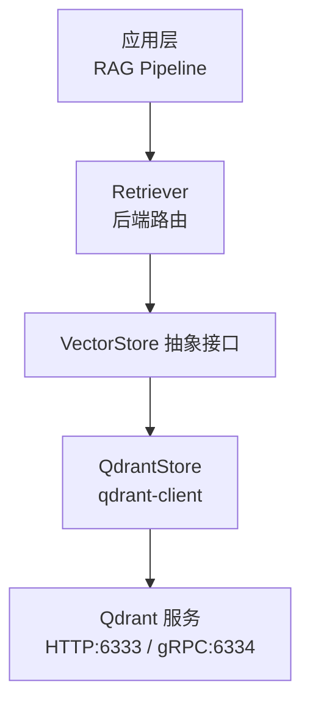
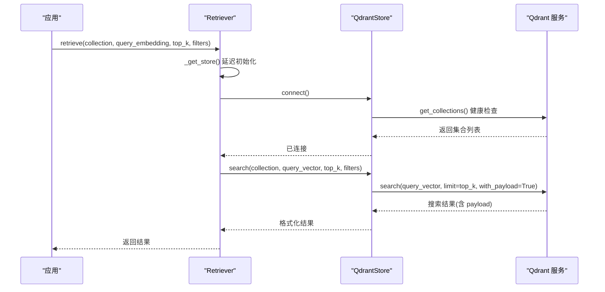
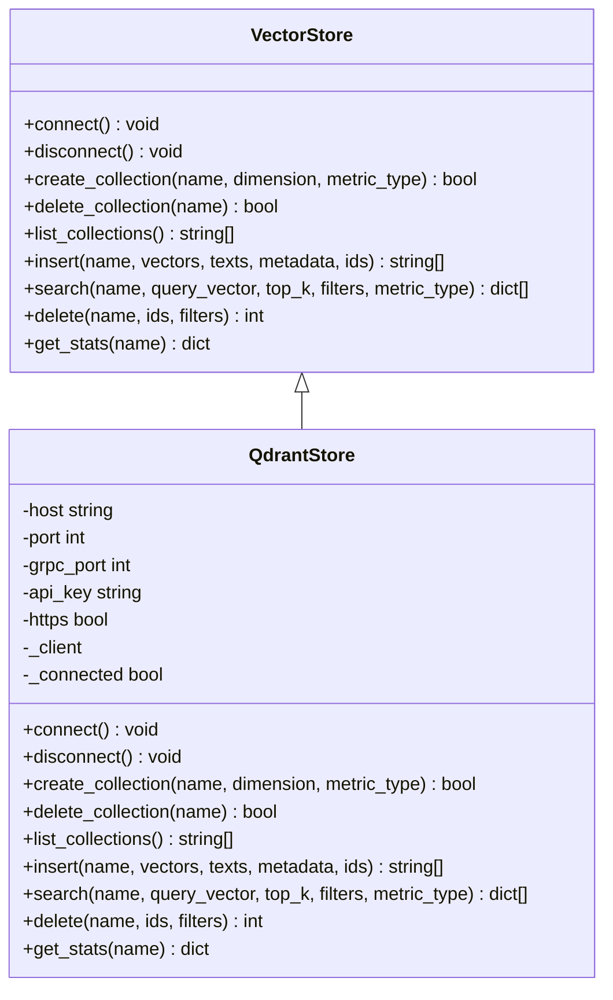
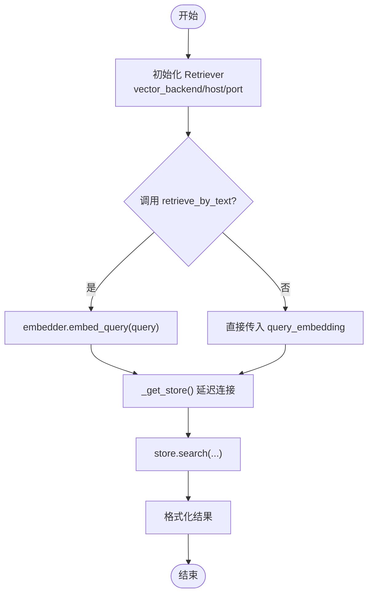
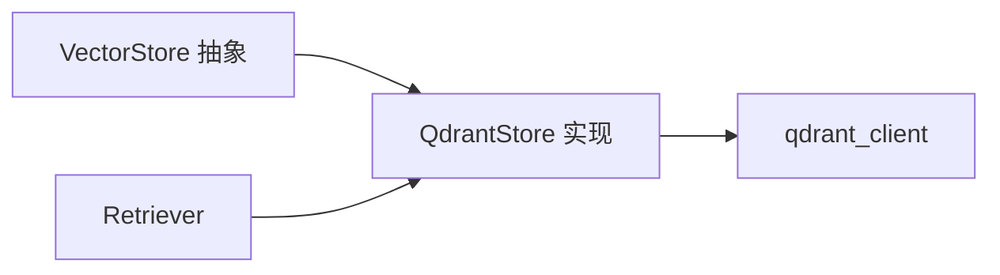

# Qdrant 向量存储

<cite>
**本文引用的文件**
- [qdrant.py](file://python/src/resolveagent/rag/index/qdrant.py)
- [base.py](file://python/src/resolveagent/rag/index/base.py)
- [retriever.py](file://python/src/resolveagent/rag/retrieve/retriever.py)
- [configuration.md](file://docs/zh/configuration.md)
</cite>

## 目录
1. [简介](#简介)
2. [项目结构](#项目结构)
3. [核心组件](#核心组件)
4. [架构总览](#架构总览)
5. [详细组件分析](#详细组件分析)
6. [依赖关系分析](#依赖关系分析)
7. [性能与容量规划](#性能与容量规划)
8. [部署与配置指南](#部署与配置指南)
9. [使用示例与最佳实践](#使用示例与最佳实践)
10. [故障排除与调试](#故障排除与调试)
11. [结论](#结论)

## 简介
本技术文档聚焦于 ResolveAgent 中基于 Qdrant 的向量存储实现，覆盖 REST/gRPC 集成、集合管理、向量插入与检索、过滤表达式、嵌入模型支持、以及查询优化等关键能力。同时提供单节点与集群部署建议、容量规划、监控策略、以及常见问题排查方法，帮助读者在生产环境中稳定高效地使用 Qdrant 作为 RAG 管道的向量后端。

## 项目结构
ResolveAgent 将向量存储抽象为统一接口，并通过可插拔后端（Milvus/Qdrant）实现具体逻辑。Qdrant 的实现位于 Python 层的 RAG 索引模块，通过 Retriever 在运行时动态选择后端并复用连接。

图表来源
- [retriever.py:14-51](file://python/src/resolveagent/rag/retrieve/retriever.py#L14-L51)
- [base.py:9-144](file://python/src/resolveagent/rag/index/base.py#L9-L144)
- [qdrant.py:13-78](file://python/src/resolveagent/rag/index/qdrant.py#L13-L78)

章节来源
- [retriever.py:14-51](file://python/src/resolveagent/rag/retrieve/retriever.py#L14-L51)
- [base.py:9-144](file://python/src/resolveagent/rag/index/base.py#L9-L144)
- [qdrant.py:13-78](file://python/src/resolveagent/rag/index/qdrant.py#L13-L78)

## 核心组件
- VectorStore 抽象：定义统一的连接、集合管理、插入、搜索、删除与统计接口，屏蔽底层差异。
- QdrantStore：基于 qdrant-client 的具体实现，支持批量 upsert、结构化过滤、HNSW 自动索引、Payload 元数据。
- Retriever：后端路由器，延迟初始化连接，按配置选择 Milvus 或 Qdrant，并提供文本到向量的检索便捷方法。

章节来源
- [base.py:9-144](file://python/src/resolveagent/rag/index/base.py#L9-L144)
- [qdrant.py:13-395](file://python/src/resolveagent/rag/index/qdrant.py#L13-L395)
- [retriever.py:14-180](file://python/src/resolveagent/rag/retrieve/retriever.py#L14-L180)

## 架构总览
下图展示从应用调用到 Qdrant 的完整调用链，包括连接建立、集合创建、批量写入、相似性检索与结果格式化。

图表来源
- [retriever.py:39-51](file://python/src/resolveagent/rag/retrieve/retriever.py#L39-L51)
- [retriever.py:53-112](file://python/src/resolveagent/rag/retrieve/retriever.py#L53-L112)
- [qdrant.py:51-78](file://python/src/resolveagent/rag/index/qdrant.py#L51-L78)
- [qdrant.py:252-322](file://python/src/resolveagent/rag/index/qdrant.py#L252-L322)

## 详细组件分析

### QdrantStore：集合管理与向量操作
- 连接与会话
  - 通过 qdrant_client.QdrantClient 建立连接，默认 prefer_grpc=True 以获得更高吞吐。
  - 连接后立即执行 get_collections() 进行健康检查，确保服务可用。
- 集合管理
  - create_collection：支持维度与距离度量映射（COSINE/L2/EUCLID/IP/DOT），重复创建会安全返回。
  - delete_collection：删除指定集合。
  - list_collections：列出所有集合名称。
- 向量插入
  - insert：构造 PointStruct，payload 包含 text 与元数据；采用批量 upsert（每批 100）控制请求体积。
- 相似性检索
  - search：构建 FieldCondition + MatchValue 的结构化过滤器，支持 with_payload 返回原文与元数据。
- 删除
  - delete：支持按 ID 列表或按过滤器删除；按过滤器删除时不返回计数。
- 统计
  - get_stats：返回 points_count 与 vectors_count。

图表来源
- [base.py:9-144](file://python/src/resolveagent/rag/index/base.py#L9-L144)
- [qdrant.py:13-395](file://python/src/resolveagent/rag/index/qdrant.py#L13-L395)

章节来源
- [qdrant.py:26-78](file://python/src/resolveagent/rag/index/qdrant.py#L26-L78)
- [qdrant.py:87-143](file://python/src/resolveagent/rag/index/qdrant.py#L87-L143)
- [qdrant.py:181-250](file://python/src/resolveagent/rag/index/qdrant.py#L181-L250)
- [qdrant.py:252-322](file://python/src/resolveagent/rag/index/qdrant.py#L252-L322)
- [qdrant.py:324-395](file://python/src/resolveagent/rag/index/qdrant.py#L324-L395)

### Retriever：后端路由与检索流程
- 延迟连接：首次调用 _get_store() 时才根据 vector_backend 实例化对应后端并连接。
- 端口自适应：Milvus 默认 19530，Qdrant 默认 6333。
- 检索流程：retrieve_by_text 先通过 embedder.embed_query 生成查询向量，再调用 retrieve 完成检索。
- 资源管理：close() 释放后端连接。

图表来源
- [retriever.py:21-51](file://python/src/resolveagent/rag/retrieve/retriever.py#L21-L51)
- [retriever.py:114-143](file://python/src/resolveagent/rag/retrieve/retriever.py#L114-L143)
- [retriever.py:53-112](file://python/src/resolveagent/rag/retrieve/retriever.py#L53-L112)

章节来源
- [retriever.py:14-180](file://python/src/resolveagent/rag/retrieve/retriever.py#L14-L180)

## 依赖关系分析
- 抽象与实现解耦：VectorStore 定义契约，QdrantStore 实现细节，便于替换与扩展。
- 运行时选择：Retriever 根据配置动态选择后端，避免硬编码耦合。
- 客户端库：QdrantStore 内部延迟导入 qdrant_client，未安装时给出明确错误提示。

图表来源
- [base.py:9-144](file://python/src/resolveagent/rag/index/base.py#L9-L144)
- [qdrant.py:51-78](file://python/src/resolveagent/rag/index/qdrant.py#L51-L78)
- [retriever.py:39-51](file://python/src/resolveagent/rag/retrieve/retriever.py#L39-L51)

章节来源
- [base.py:9-144](file://python/src/resolveagent/rag/index/base.py#L9-L144)
- [qdrant.py:51-78](file://python/src/resolveagent/rag/index/qdrant.py#L51-L78)
- [retriever.py:39-51](file://python/src/resolveagent/rag/retrieve/retriever.py#L39-L51)

## 性能与容量规划
- 写入优化
  - 批量 upsert：每批 100 条，平衡内存占用与网络开销。
  - 优先 gRPC：prefer_grpc=True 提升写入吞吐。
- 检索优化
  - HNSW 自动索引：Qdrant 自动维护索引参数，适合快速近似最近邻检索。
  - 过滤表达式：使用 FieldCondition + MatchValue 构建精确过滤，减少无效候选集。
- 容量规划
  - 向量维度：根据嵌入模型确定（如 1024），创建集合时需一致。
  - 集合数量：按业务域划分集合，避免单集合过大影响检索性能。
  - 元数据大小：payload 中的 text 与元数据会影响存储与带宽，建议合理分块与压缩。
- 监控指标
  - 集合统计：points_count、vectors_count 用于容量与健康度观察。
  - 日志与错误：连接失败、导入失败、检索异常均记录详细上下文。

章节来源
- [qdrant.py:181-250](file://python/src/resolveagent/rag/index/qdrant.py#L181-L250)
- [qdrant.py:252-322](file://python/src/resolveagent/rag/index/qdrant.py#L252-L322)
- [qdrant.py:373-395](file://python/src/resolveagent/rag/index/qdrant.py#L373-L395)

## 部署与配置指南
- 单节点部署
  - 本地运行 Qdrant 服务，暴露 HTTP 6333 与 gRPC 6334。
  - 应用侧通过 host/port/grpc_port/api_key/https 配置连接。
- 集群部署
  - 生产环境建议使用 Qdrant Cloud 或自建高可用集群，结合 API Key 认证与 HTTPS 加密。
  - 通过环境变量或配置文件注入连接参数，避免硬编码。
- 配置项说明
  - backend：选择 qdrant。
  - qdrant.host/port/grpc_port：服务地址与端口。
  - prefer_grpc：启用 gRPC 通道。
  - api_key：云托管或开启鉴权时的密钥。
  - hnsw_config/optimizer_config：高级索引与优化器参数（可选）。

章节来源
- [configuration.md:505-531](file://docs/zh/configuration.md#L505-L531)
- [qdrant.py:26-78](file://python/src/resolveagent/rag/index/qdrant.py#L26-L78)

## 使用示例与最佳实践
- 基本用法
  - 初始化 QdrantStore 并 connect。
  - 创建集合：指定维度与距离度量。
  - 插入向量：准备 vectors/texts/metadata，调用 insert。
  - 检索相似：准备 query_vector/top_k/filters，调用 search。
  - 删除与统计：按 ID 或过滤器删除；获取集合统计。
- 最佳实践
  - 连接复用：通过 Retriever 延迟连接与单例复用，避免频繁握手。
  - 批量写入：保持每批 100 条，避免单次请求过大。
  - 过滤设计：尽量使用精确字段匹配，减少复杂表达式带来的性能损耗。
  - 元数据规范：text 与元数据分离，便于检索后处理与展示。
  - 错误处理：捕获连接与导入异常，记录上下文以便定位问题。

章节来源
- [qdrant.py:87-143](file://python/src/resolveagent/rag/index/qdrant.py#L87-L143)
- [qdrant.py:181-250](file://python/src/resolveagent/rag/index/qdrant.py#L181-L250)
- [qdrant.py:252-322](file://python/src/resolveagent/rag/index/qdrant.py#L252-L322)
- [qdrant.py:324-395](file://python/src/resolveagent/rag/index/qdrant.py#L324-L395)
- [retriever.py:21-51](file://python/src/resolveagent/rag/retrieve/retriever.py#L21-L51)

## 故障排除与调试
- 连接失败
  - 检查 host/port/grpc_port 是否正确，防火墙是否放行。
  - 若使用云托管，确认 api_key 与 https 设置。
  - 查看日志中的连接错误信息，必要时降低并发重试。
- 导入失败
  - 校验 vectors 与 texts 长度一致。
  - 检查集合是否存在且维度匹配。
  - 关注批量 upsert 的错误堆栈，定位具体批次。
- 检索异常
  - 确认 query_vector 维度与集合一致。
  - 检查 filters 字段名与值类型是否符合预期。
  - 适当调整 top_k 与过滤条件以缩小候选集。
- 统计与监控
  - 使用 get_stats 观察 points_count/vectors_count 变化。
  - 结合应用日志与 Qdrant 服务端日志进行联合排查。

章节来源
- [qdrant.py:51-78](file://python/src/resolveagent/rag/index/qdrant.py#L51-L78)
- [qdrant.py:181-250](file://python/src/resolveagent/rag/index/qdrant.py#L181-L250)
- [qdrant.py:252-322](file://python/src/resolveagent/rag/index/qdrant.py#L252-L322)
- [qdrant.py:373-395](file://python/src/resolveagent/rag/index/qdrant.py#L373-L395)

## 结论
ResolveAgent 的 Qdrant 向量存储实现以清晰的抽象与可插拔后端为核心，提供了稳定的集合管理、高效的批量写入、灵活的过滤检索与完善的统计能力。通过 Retriever 的后端路由与延迟连接机制，系统具备良好的可扩展性与运维友好性。在生产环境中，建议结合合理的容量规划、监控策略与故障排除流程，充分发挥 Qdrant 在高吞吐与低延迟场景下的优势。