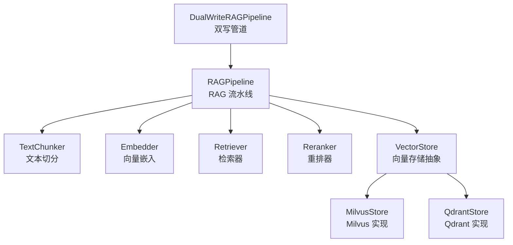
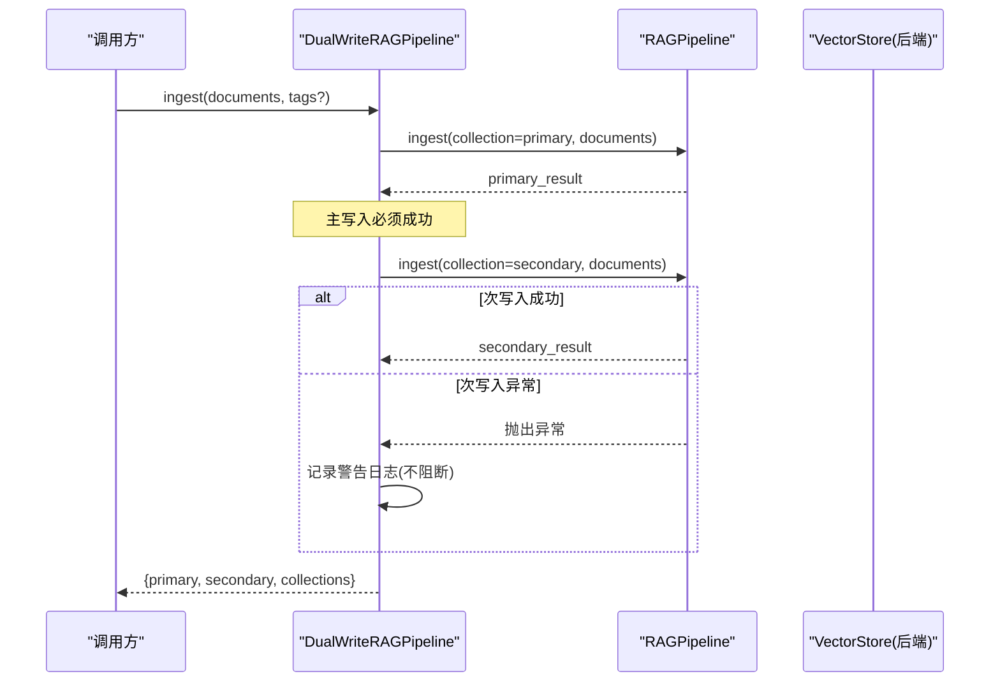
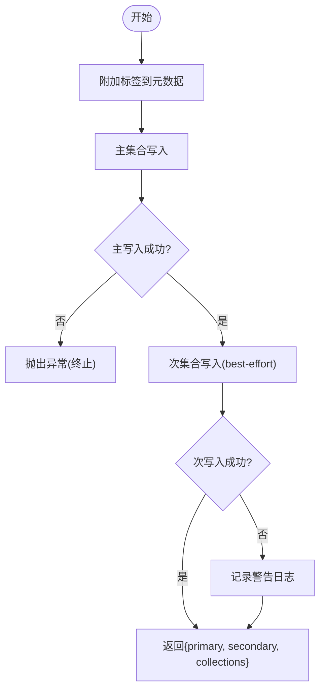
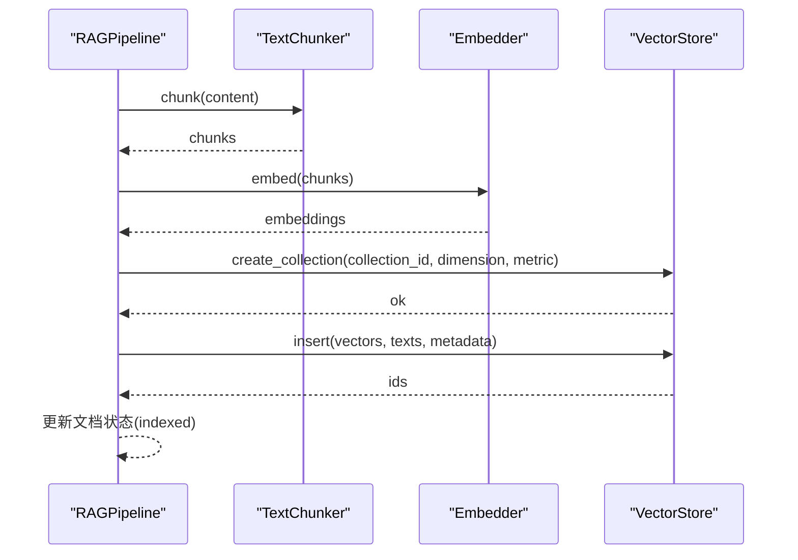
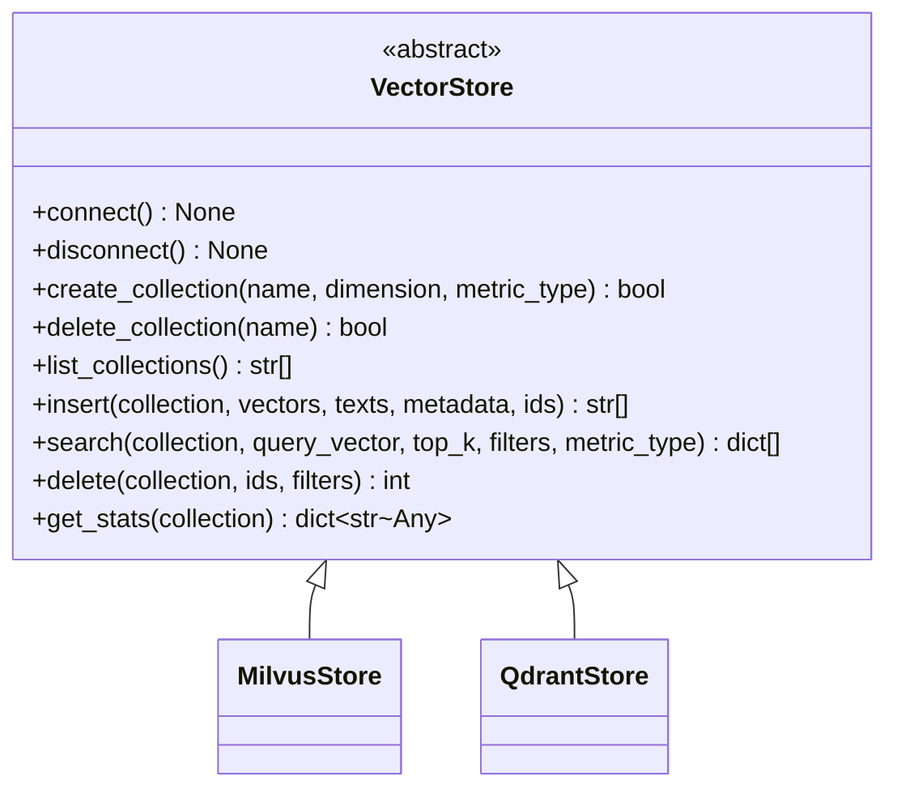
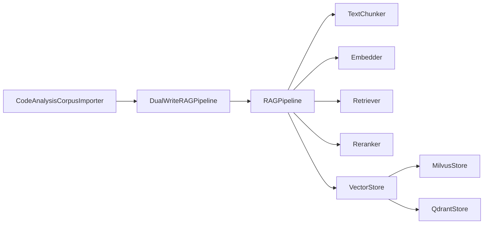

# 双写机制

<cite>
**本文引用的文件**
- [dual_writer.py](file://python/src/resolveagent/rag/dual_writer.py)
- [pipeline.py](file://python/src/resolveagent/rag/pipeline.py)
- [base.py](file://python/src/resolveagent/rag/index/base.py)
- [milvus.py](file://python/src/resolveagent/rag/index/milvus.py)
- [qdrant.py](file://python/src/resolveagent/rag/index/qdrant.py)
- [code_analysis_importer.py](file://python/src/resolveagent/corpus/code_analysis_importer.py)
- [configuration.md](file://docs/zh/configuration.md)
</cite>

## 目录
1. [简介](#简介)
2. [项目结构](#项目结构)
3. [核心组件](#核心组件)
4. [架构总览](#架构总览)
5. [详细组件分析](#详细组件分析)
6. [依赖关系分析](#依赖关系分析)
7. [性能考量与优化](#性能考量与优化)
8. [故障排查指南](#故障排查指南)
9. [结论](#结论)
10. [附录：配置示例与最佳实践](#附录：配置示例与最佳实践)

## 简介
本技术文档围绕 ResolveAgent 的 RAG 双写机制（DualWriter）展开，系统性阐述其如何同时向多个向量存储后端写入数据，以兼顾数据一致性与可靠性。文档涵盖双写策略的设计原理、冲突处理与回滚策略、完整的配置示例（后端选择、写入顺序、错误处理）、性能影响与优化策略（批量写入、并发控制、资源管理），以及实际使用场景、最佳实践、故障恢复和数据一致性验证方法。

## 项目结构
双写机制位于 Python 层的 RAG 模块中，核心由“双写管道”、“RAG 流水线”和“向量存储后端”三部分构成：
- 双写管道：封装对 RAGPipeline 的调用，实现主/次集合的双写。
- RAG 流水线：负责文档切分、嵌入生成、索引写入、检索与重排。
- 向量存储后端：通过抽象接口统一 Milvus 与 Qdrant 两种实现。

图表来源
- [dual_writer.py:22-95](file://python/src/resolveagent/rag/dual_writer.py#L22-L95)
- [pipeline.py:18-138](file://python/src/resolveagent/rag/pipeline.py#L18-L138)
- [base.py:9-144](file://python/src/resolveagent/rag/index/base.py#L9-L144)
- [milvus.py:29-168](file://python/src/resolveagent/rag/index/milvus.py#L29-L168)
- [qdrant.py:13-143](file://python/src/resolveagent/rag/index/qdrant.py#L13-L143)

章节来源
- [dual_writer.py:22-95](file://python/src/resolveagent/rag/dual_writer.py#L22-L95)
- [pipeline.py:18-138](file://python/src/resolveagent/rag/pipeline.py#L18-L138)
- [base.py:9-144](file://python/src/resolveagent/rag/index/base.py#L9-L144)
- [milvus.py:29-168](file://python/src/resolveagent/rag/index/milvus.py#L29-L168)
- [qdrant.py:13-143](file://python/src/resolveagent/rag/index/qdrant.py#L13-L143)

## 核心组件
- DualWriteRAGPipeline：提供 ingest/query/ingest_solutions/ingest_report 等能力，将同一份文档分别写入主集合与次集合。主写入必须成功；次写入为尽力而为（best-effort），失败仅记录日志不阻塞主流程。
- RAGPipeline：编排 ingest 流程（解析→切分→嵌入→索引），并支持 query（嵌入→检索→重排）。
- VectorStore 抽象与具体实现：MilvusStore、QdrantStore 提供统一的连接、集合管理、插入、搜索、删除、统计等能力。

章节来源
- [dual_writer.py:22-162](file://python/src/resolveagent/rag/dual_writer.py#L22-L162)
- [pipeline.py:18-255](file://python/src/resolveagent/rag/pipeline.py#L18-L255)
- [base.py:9-144](file://python/src/resolveagent/rag/index/base.py#L9-L144)
- [milvus.py:29-413](file://python/src/resolveagent/rag/index/milvus.py#L29-L413)
- [qdrant.py:13-395](file://python/src/resolveagent/rag/index/qdrant.py#L13-L395)

## 架构总览
双写机制采用“主-次”集合策略：
- 主集合（默认 code-analysis）：写入必须成功，作为权威数据源。
- 次集合（默认 kudig-rag）：写入为 best-effort，失败不影响主写入结果，便于现有查询也能受益于代码分析数据。

图表来源
- [dual_writer.py:45-95](file://python/src/resolveagent/rag/dual_writer.py#L45-L95)
- [pipeline.py:44-138](file://python/src/resolveagent/rag/pipeline.py#L44-L138)

章节来源
- [dual_writer.py:45-95](file://python/src/resolveagent/rag/dual_writer.py#L45-L95)
- [pipeline.py:44-138](file://python/src/resolveagent/rag/pipeline.py#L44-L138)

## 详细组件分析

### 双写管道（DualWriteRAGPipeline）
- 职责：包装 RAGPipeline，实现主/次集合双写；支持在元数据中追加标签；提供便捷入口用于导入解决方案与报告。
- 关键行为：
  - 主写入：调用 pipeline.ingest 到主集合，若失败则向上抛出异常。
  - 次写入：调用 pipeline.ingest 到次集合，捕获异常并记录警告，不中断主流程。
  - 返回结果：包含主/次写入结果及集合名称，便于上层监控与审计。
- 扩展点：可通过传入自定义 pipeline 实例或覆盖 chunker 进行定制。

图表来源
- [dual_writer.py:45-95](file://python/src/resolveagent/rag/dual_writer.py#L45-L95)

章节来源
- [dual_writer.py:22-162](file://python/src/resolveagent/rag/dual_writer.py#L22-L162)

### RAG 流水线（RAGPipeline）
- 职责：端到端编排 RAG 流程，包括文档切分、嵌入生成、索引写入、检索与重排。
- 写入流程：
  - 注册文档元数据（可选平台存储）。
  - 切分文档为 chunks。
  - 生成每个 chunk 的向量嵌入。
  - 调用向量存储后端创建集合（如不存在）并批量插入。
  - 更新文档状态为已索引。
- 查询流程：
  - 生成查询向量。
  - 检索候选片段。
  - 重排后返回 top_k。

图表来源
- [pipeline.py:44-138](file://python/src/resolveagent/rag/pipeline.py#L44-L138)
- [pipeline.py:140-190](file://python/src/resolveagent/rag/pipeline.py#L140-L190)

章节来源
- [pipeline.py:18-255](file://python/src/resolveagent/rag/pipeline.py#L18-L255)

### 向量存储后端（VectorStore 抽象与实现）
- 抽象接口：定义 connect/disconnect/create_collection/list_collections/insert/search/delete/get_stats 等异步方法，确保所有后端具备一致的能力集。
- MilvusStore：
  - 连接与认证：HTTP REST 方式，支持用户名/密码与数据库名。
  - 集合管理：自动校验集合名合法性，创建 schema（id/vector/text/metadata JSON），创建 IVF_FLAT 索引。
  - 写入：全量 insert，自动生成唯一 ID。
  - 检索：支持基于 JSON 路径的过滤表达式。
- QdrantStore：
  - 连接与认证：HTTP + gRPC，支持 API Key。
  - 集合管理：根据距离度量映射创建集合。
  - 写入：按批次 upsert（默认每批 100 条）。
  - 检索：支持结构化 Filter 条件。

图表来源
- [base.py:9-144](file://python/src/resolveagent/rag/index/base.py#L9-L144)
- [milvus.py:29-168](file://python/src/resolveagent/rag/index/milvus.py#L29-L168)
- [qdrant.py:13-143](file://python/src/resolveagent/rag/index/qdrant.py#L13-L143)

章节来源
- [base.py:9-144](file://python/src/resolveagent/rag/index/base.py#L9-L144)
- [milvus.py:29-413](file://python/src/resolveagent/rag/index/milvus.py#L29-L413)
- [qdrant.py:13-395](file://python/src/resolveagent/rag/index/qdrant.py#L13-L395)

### 使用方集成（CodeAnalysisCorpusImporter）
- 角色：将静态分析结果（解决方案、调用图摘要、调用链生成的 RAG 文档）通过双写管道导入到 RAG 集合。
- 行为：
  - 运行静态分析，生成解决方案与调用图。
  - 调用 dual_writer.ingest_solutions 与 ingest，将结果写入主/次集合。
  - 对导入过程进行进度跟踪与错误上报。

章节来源
- [code_analysis_importer.py:32-247](file://python/src/resolveagent/corpus/code_analysis_importer.py#L32-L247)

## 依赖关系分析
- DualWriteRAGPipeline 依赖 RAGPipeline，后者依赖 TextChunker、Embedder、Retriever、Reranker 与 VectorStore。
- VectorStore 为抽象层，MilvusStore 与 QdrantStore 为其具体实现，二者均遵循相同接口契约。
- CodeAnalysisCorpusImporter 依赖 DualWriteRAGPipeline，完成从分析引擎到 RAG 的数据桥接。

图表来源
- [code_analysis_importer.py:32-247](file://python/src/resolveagent/corpus/code_analysis_importer.py#L32-L247)
- [dual_writer.py:22-95](file://python/src/resolveagent/rag/dual_writer.py#L22-L95)
- [pipeline.py:18-138](file://python/src/resolveagent/rag/pipeline.py#L18-L138)
- [base.py:9-144](file://python/src/resolveagent/rag/index/base.py#L9-L144)
- [milvus.py:29-168](file://python/src/resolveagent/rag/index/milvus.py#L29-L168)
- [qdrant.py:13-143](file://python/src/resolveagent/rag/index/qdrant.py#L13-L143)

章节来源
- [code_analysis_importer.py:32-247](file://python/src/resolveagent/corpus/code_analysis_importer.py#L32-L247)
- [dual_writer.py:22-95](file://python/src/resolveagent/rag/dual_writer.py#L22-L95)
- [pipeline.py:18-138](file://python/src/resolveagent/rag/pipeline.py#L18-L138)
- [base.py:9-144](file://python/src/resolveagent/rag/index/base.py#L9-L144)
- [milvus.py:29-168](file://python/src/resolveagent/rag/index/milvus.py#L29-L168)
- [qdrant.py:13-143](file://python/src/resolveagent/rag/index/qdrant.py#L13-L143)

## 性能考量与优化
- 批量写入：
  - QdrantStore 内部采用分批 upsert（默认每批 100 条），降低单次请求开销，提升吞吐。
  - MilvusStore 使用一次性 insert 全量写入，适合中小规模数据；大规模时可考虑外部批处理或分片策略。
- 并发控制：
  - 当前实现为串行调用（先主后次），避免竞争与重复计算；在高并发场景可引入任务队列或限流器，限制并发度。
- 资源管理：
  - 每次索引写入时创建并关闭向量存储连接（pipeline._index_chunks），建议在高频写入场景下复用连接池以减少握手开销。
- 索引策略：
  - Milvus 默认 IVF_FLAT（nlist=128），可根据数据规模调整 nlist/nprobe 或切换 HNSW 以获得更好召回/延迟平衡。
  - Qdrant 使用内置 HNSW，可通过 hnsw_config 调优 m/ef_construct。
- 嵌入与重排：
  - 嵌入模型维度与指标类型需与后端一致；重排阶段可调整 top_k 以平衡召回与延迟。

[本节为通用性能指导，不直接分析具体文件]

## 故障排查指南
- 次写入失败：
  - 现象：主写入成功，次写入抛异常并被记录警告日志。
  - 处理：检查次集合后端连通性、权限与集合是否存在；确认网络与认证配置。
- 主写入失败：
  - 现象：主集合写入抛异常，调用方应收到错误并中止后续流程。
  - 处理：检查向量后端连接、集合创建、索引参数与数据格式。
- 集合名非法：
  - 现象：Milvus 要求集合名以字母或下划线开头且仅含字母/数字/下划线，长度不超过 255。
  - 处理：使用内部规范化函数处理集合名，避免非法字符。
- 连接问题：
  - Milvus：确认 host/port/user/password/database 正确，pymilvus 已安装。
  - Qdrant：确认 host/port/grpc_port/api_key/https 正确，qdrant-client 已安装。
- 统计与一致性验证：
  - 使用 get_stats 获取 row_count/points_count 等指标，对比主/次集合数量差异。
  - 抽样查询验证内容一致性与元数据完整性。

章节来源
- [dual_writer.py:76-88](file://python/src/resolveagent/rag/dual_writer.py#L76-L88)
- [milvus.py:14-26](file://python/src/resolveagent/rag/index/milvus.py#L14-L26)
- [milvus.py:67-88](file://python/src/resolveagent/rag/index/milvus.py#L67-L88)
- [qdrant.py:51-78](file://python/src/resolveagent/rag/index/qdrant.py#L51-L78)
- [milvus.py:386-408](file://python/src/resolveagent/rag/index/milvus.py#L386-L408)
- [qdrant.py:373-394](file://python/src/resolveagent/rag/index/qdrant.py#L373-L394)

## 结论
ResolveAgent 的双写机制通过“主-次”集合策略实现了高可用与可扩展的 RAG 数据写入：主集合保证强一致与权威性，次集合提供容错与兼容性收益。结合统一的向量存储抽象，系统可在 Milvus 与 Qdrant 之间灵活切换，并通过批量写入、索引调优与连接复用等手段提升性能。配合完善的错误处理与一致性验证方法，双写机制能够在生产环境中稳定运行。

[本节为总结性内容，不直接分析具体文件]

## 附录：配置示例与最佳实践

### 后端选择与连接配置
- Milvus：
  - 设置 backend 为 milvus，配置 host/port/user/password/database。
  - 索引类型可选择 IVF_FLAT/HNSW，metric 可选 COSINE/L2/IP。
  - 参考配置键：index_type、metric_type、nlist、nprobe、M、ef_construction、ef、pool_size。
- Qdrant：
  - 设置 backend 为 qdrant，配置 host/port/grpc_port/api_key/https。
  - 可启用 prefer_grpc，调整 hnsw_config（m、ef_construct）与 optimizer_config（memmap_threshold）。

章节来源
- [configuration.md:471-534](file://docs/zh/configuration.md#L471-L534)

### 写入顺序与错误处理
- 写入顺序：先主后次。主写入必须成功；次写入失败仅记录警告，不阻断主流程。
- 错误处理：
  - 主写入异常：向上抛出，调用方需重试或降级。
  - 次写入异常：捕获并记录警告，继续返回合并结果。
- 建议：
  - 在主写入成功后再触发次写入，减少不必要的网络开销。
  - 对次写入增加重试与退避策略（例如指数退避），提高最终一致性概率。

章节来源
- [dual_writer.py:69-95](file://python/src/resolveagent/rag/dual_writer.py#L69-L95)
- [pipeline.py:44-138](file://python/src/resolveagent/rag/pipeline.py#L44-L138)

### 批量写入与并发控制
- 批量写入：
  - QdrantStore 默认每批 100 条 upsert，适合中等规模数据。
  - MilvusStore 使用一次性 insert，适合小规模或离线批处理。
- 并发控制：
  - 当前为串行调用；在高并发场景建议引入任务队列（如 Celery/RQ）或限流器（令牌桶/漏桶）控制并发度。
- 资源管理：
  - 建议复用向量存储连接或使用连接池，减少频繁 connect/disconnect 的开销。

章节来源
- [qdrant.py:232-240](file://python/src/resolveagent/rag/index/qdrant.py#L232-L240)
- [milvus.py:256-258](file://python/src/resolveagent/rag/index/milvus.py#L256-L258)
- [pipeline.py:155-190](file://python/src/resolveagent/rag/pipeline.py#L155-L190)

### 实际使用场景与最佳实践
- 场景：
  - 代码分析结果（解决方案、调用图摘要）通过双写管道同时进入 code-analysis 与 kudig-rag 集合，使现有查询受益。
  - 流量分析报告也可通过 ingest_report 双写入库。
- 最佳实践：
  - 为不同来源数据添加标签（tags），便于过滤与溯源。
  - 定期执行一致性校验：比较主/次集合统计数据，抽样查询验证内容与元数据。
  - 监控与告警：对次写入失败率、主写入失败率、索引构建耗时等指标建立监控与告警。

章节来源
- [code_analysis_importer.py:133-161](file://python/src/resolveagent/corpus/code_analysis_importer.py#L133-L161)
- [code_analysis_importer.py:218-247](file://python/src/resolveagent/corpus/code_analysis_importer.py#L218-L247)
- [dual_writer.py:121-162](file://python/src/resolveagent/rag/dual_writer.py#L121-L162)

### 数据一致性验证方法
- 统计对比：
  - 使用 get_stats 获取主/次集合的行数/点数，评估一致性。
- 抽样查询：
  - 随机抽取若干文档 ID，分别在主/次集合查询，比对内容与元数据。
- 增量校验：
  - 对新增/更新数据，记录时间戳与版本号，定时比对差异。

章节来源
- [milvus.py:386-408](file://python/src/resolveagent/rag/index/milvus.py#L386-L408)
- [qdrant.py:373-394](file://python/src/resolveagent/rag/index/qdrant.py#L373-L394)