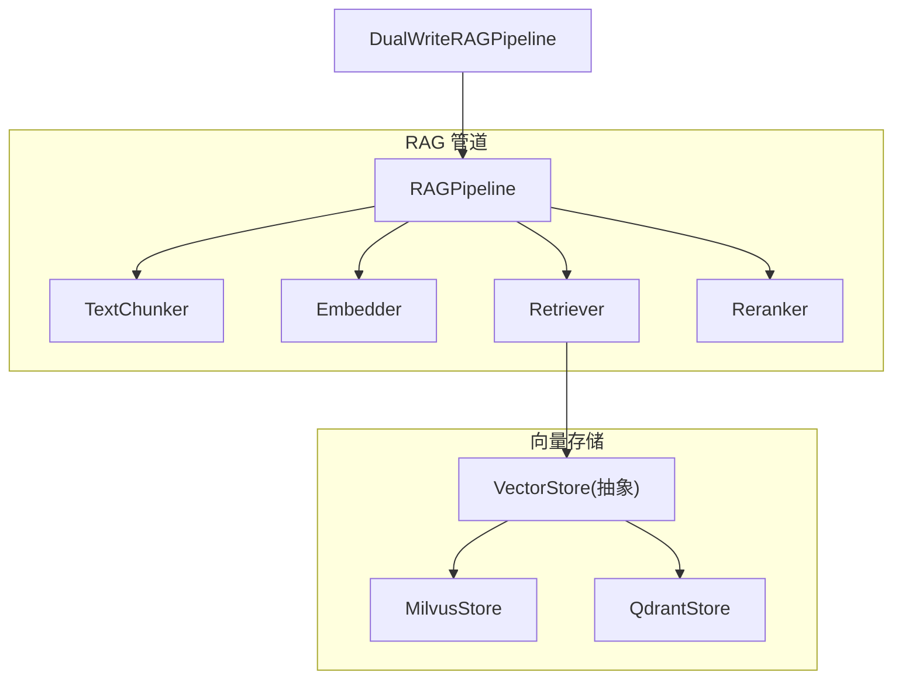
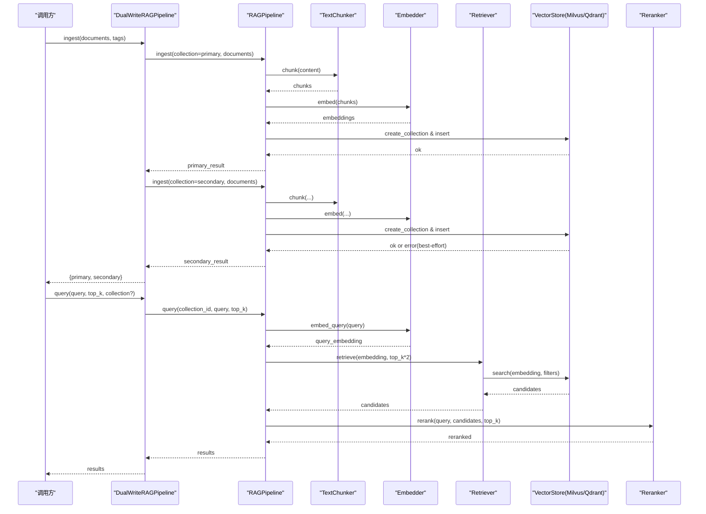
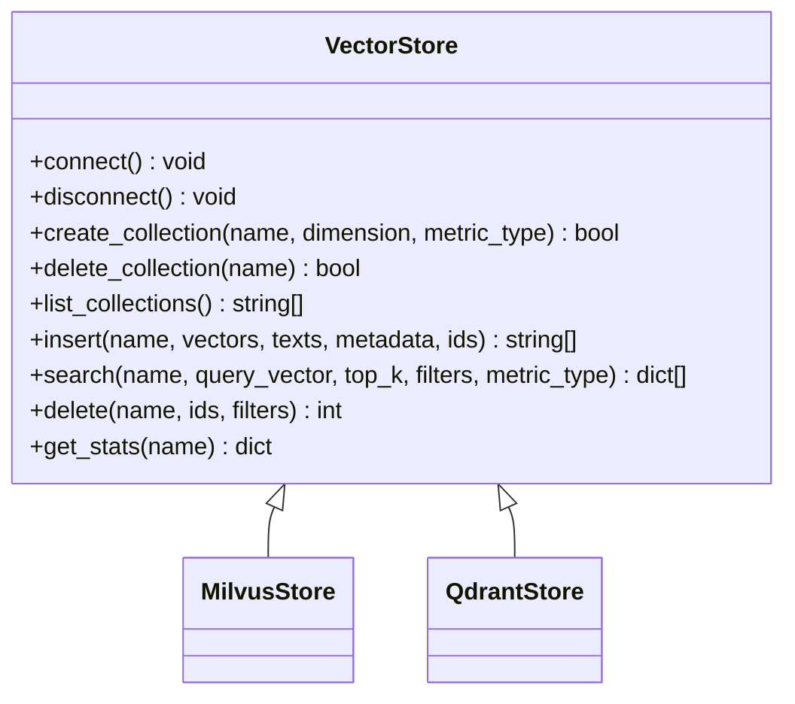
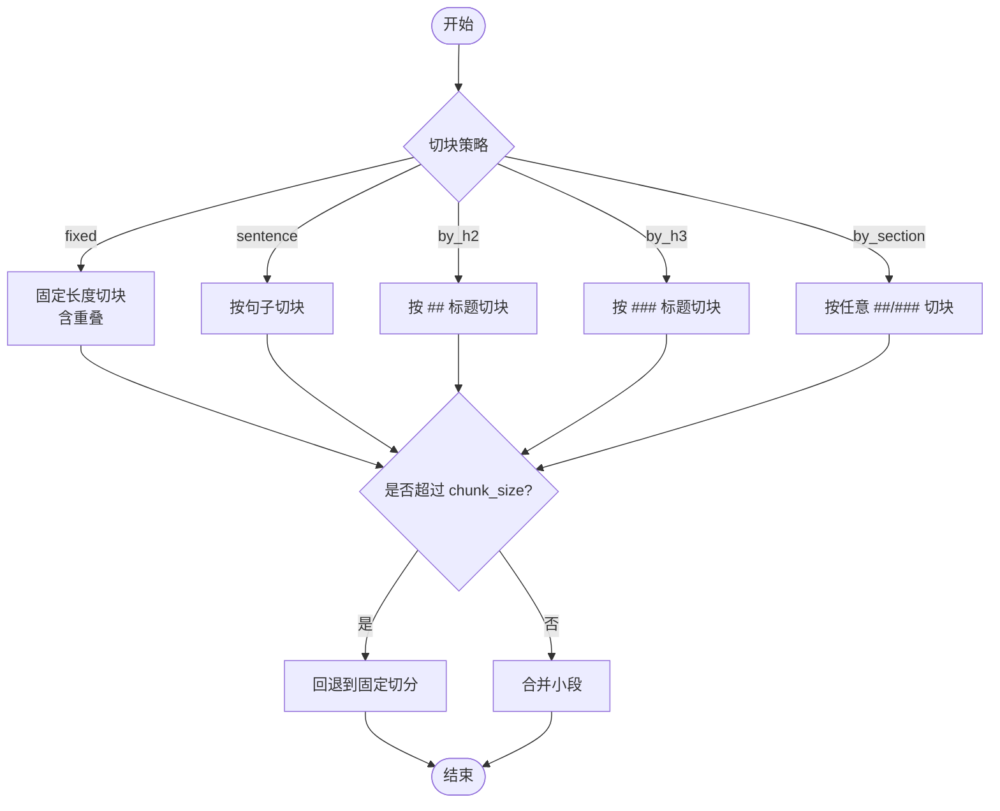
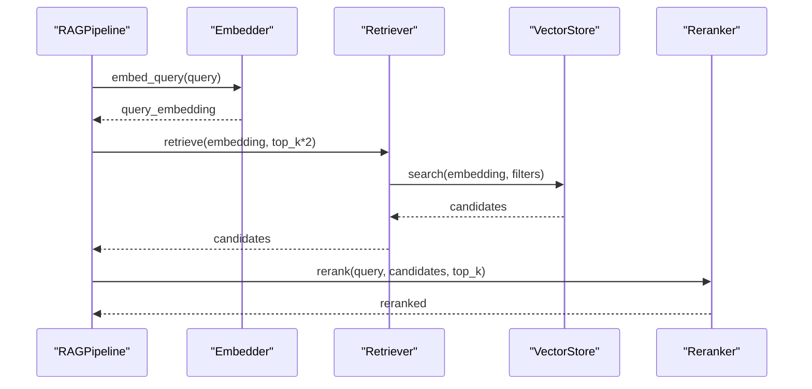
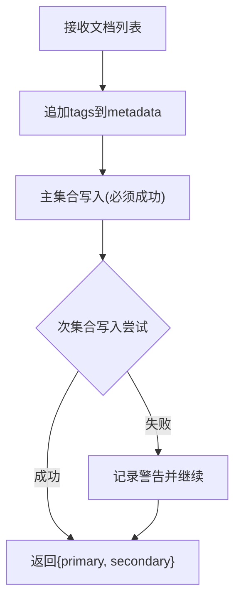
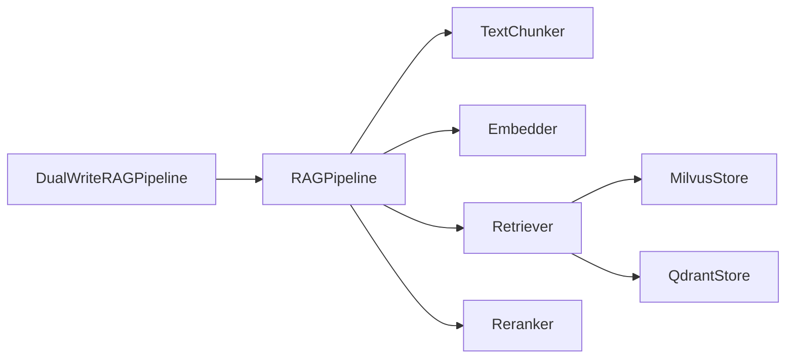

# 向量索引系统

<cite>
**本文引用的文件**
- [dual_writer.py](file://python/src/resolveagent/rag/dual_writer.py)
- [base.py](file://python/src/resolveagent/rag/index/base.py)
- [milvus.py](file://python/src/resolveagent/rag/index/milvus.py)
- [qdrant.py](file://python/src/resolveagent/rag/index/qdrant.py)
- [pipeline.py](file://python/src/resolveagent/rag/pipeline.py)
- [embedder.py](file://python/src/resolveagent/rag/ingest/embedder.py)
- [chunker.py](file://python/src/resolveagent/rag/ingest/chunker.py)
- [retriever.py](file://python/src/resolveagent/rag/retrieve/retriever.py)
- [reranker.py](file://python/src/resolveagent/rag/retrieve/reranker.py)
- [resolveagent.yaml](file://configs/resolveagent.yaml)
</cite>

## 目录
1. [简介](#简介)
2. [项目结构](#项目结构)
3. [核心组件](#核心组件)
4. [架构总览](#架构总览)
5. [详细组件分析](#详细组件分析)
6. [依赖关系分析](#依赖关系分析)
7. [性能考虑](#性能考虑)
8. [故障排除指南](#故障排除指南)
9. [结论](#结论)
10. [附录：配置与部署最佳实践](#附录：配置与部署最佳实践)

## 简介
本技术文档面向向量索引系统，聚焦检索增强生成（RAG）的端到端实现与运维。系统以统一的抽象接口对接两种主流向量存储后端：Milvus 与 Qdrant；通过管道化流程完成“分词切块→向量化→索引→检索→重排序”的完整链路；并提供 DualWriter 双写机制，确保在新增集合写入时同时兼顾既有集合的查询收益，提升数据一致性与可用性。文档涵盖架构设计、核心功能、性能调优、容量规划与故障排查，并给出可操作的配置示例与部署建议。

## 项目结构
RAG 子系统位于 Python 代码中，围绕“索引后端抽象 + 具体实现 + 管道编排 + 嵌入/分块/检索/重排序”组织。关键目录与职责如下：
- rag/index：向量存储抽象与 Milvus/Qdrant 实现
- rag/ingest：文本分块与向量化
- rag/retrieve：检索与重排序
- rag/pipeline：端到端编排（摄入/查询）
- dual_writer：双写封装，主集合优先、次集合尽力而为
- configs：平台配置（含服务、存储等）

**图示来源**
- [pipeline.py:18-42](file://python/src/resolveagent/rag/pipeline.py#L18-L42)
- [base.py:9-144](file://python/src/resolveagent/rag/index/base.py#L9-L144)
- [milvus.py:29-413](file://python/src/resolveagent/rag/index/milvus.py#L29-L413)
- [qdrant.py:13-395](file://python/src/resolveagent/rag/index/qdrant.py#L13-L395)
- [retriever.py:14-180](file://python/src/resolveagent/rag/retrieve/retriever.py#L14-L180)
- [reranker.py:28-406](file://python/src/resolveagent/rag/retrieve/reranker.py#L28-L406)
- [chunker.py:8-136](file://python/src/resolveagent/rag/ingest/chunker.py#L8-L136)
- [embedder.py:13-171](file://python/src/resolveagent/rag/ingest/embedder.py#L13-L171)

**章节来源**
- [pipeline.py:18-42](file://python/src/resolveagent/rag/pipeline.py#L18-L42)
- [base.py:9-144](file://python/src/resolveagent/rag/index/base.py#L9-L144)

## 核心组件
- 向量存储抽象 VectorStore：定义连接、集合管理、插入、搜索、删除、统计的统一接口，屏蔽底层差异。
- MilvusStore：基于 pymilvus 的实现，支持集合创建、IVF_FLAT 索引、相似度搜索、元数据过滤、统计信息。
- QdrantStore：基于 qdrant-client 的实现，支持集合创建、Upsert 批量插入、Payload 过滤、统计信息。
- TextChunker：多种切块策略（固定长度、按句子、按标题层级、按段落），控制 chunk_size 与重叠。
- Embedder：调用外部嵌入 API（如 DashScope），支持多模型维度映射与批处理。
- Retriever：根据后端类型选择 Milvus/Qdrant 进行向量检索，支持 top_k 与元数据过滤。
- Reranker：交叉编码器（可选）+ LLM 评分 + 回退策略（词频/Jaccard），提供多样性选择（MMR）。
- RAGPipeline：编排“切块→嵌入→索引→检索→重排序”，并可选持久化文档元数据。
- DualWriteRAGPipeline：主集合写入必须成功，次集合尽力而为，保障一致性同时复用既有集合能力。

**章节来源**
- [base.py:9-144](file://python/src/resolveagent/rag/index/base.py#L9-L144)
- [milvus.py:29-413](file://python/src/resolveagent/rag/index/milvus.py#L29-L413)
- [qdrant.py:13-395](file://python/src/resolveagent/rag/index/qdrant.py#L13-L395)
- [chunker.py:8-136](file://python/src/resolveagent/rag/ingest/chunker.py#L8-L136)
- [embedder.py:13-171](file://python/src/resolveagent/rag/ingest/embedder.py#L13-L171)
- [retriever.py:14-180](file://python/src/resolveagent/rag/retrieve/retriever.py#L14-L180)
- [reranker.py:28-406](file://python/src/resolveagent/rag/retrieve/reranker.py#L28-L406)
- [pipeline.py:18-255](file://python/src/resolveagent/rag/pipeline.py#L18-L255)
- [dual_writer.py:22-162](file://python/src/resolveagent/rag/dual_writer.py#L22-L162)

## 架构总览
系统采用“管道 + 插件式后端”的架构：上层通过统一接口发起摄入与查询，底层由不同向量库实现；检索后通过重排序提升相关性；双写机制在不阻塞主流程的前提下扩展数据覆盖范围。

**图示来源**
- [dual_writer.py:45-119](file://python/src/resolveagent/rag/dual_writer.py#L45-L119)
- [pipeline.py:44-255](file://python/src/resolveagent/rag/pipeline.py#L44-L255)
- [retriever.py:53-112](file://python/src/resolveagent/rag/retrieve/retriever.py#L53-L112)
- [milvus.py:97-168](file://python/src/resolveagent/rag/index/milvus.py#L97-L168)
- [qdrant.py:87-143](file://python/src/resolveagent/rag/index/qdrant.py#L87-L143)
- [reranker.py:97-134](file://python/src/resolveagent/rag/retrieve/reranker.py#L97-L134)

## 详细组件分析

### 向量存储抽象与实现
- VectorStore 抽象方法包括 connect/disconnect、create/delete/list collections、insert/search/delete/get_stats，保证各后端行为一致。
- MilvusStore：
  - 集合名规范化，避免非法字符与数字开头问题。
  - 使用 IVF_FLAT 索引，nlist=128 作为默认参数。
  - 支持 JSON 元数据字段与 COSINE/L2/IP 距离度量。
  - 搜索前自动加载集合，返回 id/text/metadata/score。
- QdrantStore：
  - 支持 Distance.COSINE/EUCLID/DOT 映射。
  - Upsert 批量插入（batch_size=100），Payload 包含 text 与元数据。
  - 支持按 payload 字段过滤与删除。

**图示来源**
- [base.py:9-144](file://python/src/resolveagent/rag/index/base.py#L9-L144)
- [milvus.py:29-413](file://python/src/resolveagent/rag/index/milvus.py#L29-L413)
- [qdrant.py:13-395](file://python/src/resolveagent/rag/index/qdrant.py#L13-L395)

**章节来源**
- [base.py:9-144](file://python/src/resolveagent/rag/index/base.py#L9-L144)
- [milvus.py:97-168](file://python/src/resolveagent/rag/index/milvus.py#L97-L168)
- [milvus.py:207-268](file://python/src/resolveagent/rag/index/milvus.py#L207-L268)
- [milvus.py:270-341](file://python/src/resolveagent/rag/index/milvus.py#L270-L341)
- [qdrant.py:87-143](file://python/src/resolveagent/rag/index/qdrant.py#L87-L143)
- [qdrant.py:181-250](file://python/src/resolveagent/rag/index/qdrant.py#L181-L250)
- [qdrant.py:252-322](file://python/src/resolveagent/rag/index/qdrant.py#L252-L322)

### 文本切块与向量化
- TextChunker：
  - 支持 fixed/sentence/by_h2/by_h3/by_section 策略。
  - 对超长片段进行回退切分，保证不超过 chunk_size。
- Embedder：
  - 支持多模型维度映射（如 bge-large-zh 为 1024）。
  - 通过 HTTP 调用嵌入服务，失败时记录日志并抛出异常。
  - 提供单条与批量嵌入接口。

**图示来源**
- [chunker.py:8-136](file://python/src/resolveagent/rag/ingest/chunker.py#L8-L136)

**章节来源**
- [chunker.py:8-136](file://python/src/resolveagent/rag/ingest/chunker.py#L8-L136)
- [embedder.py:13-171](file://python/src/resolveagent/rag/ingest/embedder.py#L13-L171)

### 检索与重排序
- Retriever：
  - 根据 vector_backend 选择 Milvus/Qdrant，懒初始化连接。
  - 支持 top_k 与元数据过滤，返回带 score 的结果。
- Reranker：
  - 首选交叉编码器（若可用），否则回退至 LLM 评分或词频/Jaccard。
  - 支持多样性选择（MMR），平衡相关性与多样性。

**图示来源**
- [pipeline.py:192-255](file://python/src/resolveagent/rag/pipeline.py#L192-L255)
- [retriever.py:53-112](file://python/src/resolveagent/rag/retrieve/retriever.py#L53-L112)
- [reranker.py:97-134](file://python/src/resolveagent/rag/retrieve/reranker.py#L97-L134)

**章节来源**
- [retriever.py:14-180](file://python/src/resolveagent/rag/retrieve/retriever.py#L14-L180)
- [reranker.py:28-406](file://python/src/resolveagent/rag/retrieve/reranker.py#L28-L406)

### DualWriter 双写机制
- 主集合写入必须成功，次集合写入尽力而为（失败仅记录警告不阻塞主流程）。
- 自动为文档附加 tags，便于后续过滤与溯源。
- 提供便捷方法将解决方案/分析报告转换为 RAG 文档并双写。

**图示来源**
- [dual_writer.py:22-162](file://python/src/resolveagent/rag/dual_writer.py#L22-L162)

**章节来源**
- [dual_writer.py:45-119](file://python/src/resolveagent/rag/dual_writer.py#L45-L119)
- [dual_writer.py:121-162](file://python/src/resolveagent/rag/dual_writer.py#L121-L162)

## 依赖关系分析
- pipeline 依赖 chunker、embedder、retriever、reranker，并在摄入阶段直接实例化 MilvusStore（当前实现）。
- retriever 根据配置动态选择 MilvusStore 或 QdrantStore。
- reranker 依赖 sentence-transformers（可选），否则回退到 LLM 或简单打分。
- dual_writer 包装 pipeline，实现主/次集合双写。

**图示来源**
- [pipeline.py:18-42](file://python/src/resolveagent/rag/pipeline.py#L18-L42)
- [retriever.py:21-51](file://python/src/resolveagent/rag/retrieve/retriever.py#L21-L51)
- [reranker.py:14-23](file://python/src/resolveagent/rag/retrieve/reranker.py#L14-L23)
- [dual_writer.py:22-43](file://python/src/resolveagent/rag/dual_writer.py#L22-L43)

**章节来源**
- [pipeline.py:18-42](file://python/src/resolveagent/rag/pipeline.py#L18-L42)
- [retriever.py:21-51](file://python/src/resolveagent/rag/retrieve/retriever.py#L21-L51)
- [reranker.py:14-23](file://python/src/resolveagent/rag/retrieve/reranker.py#L14-L23)
- [dual_writer.py:22-43](file://python/src/resolveagent/rag/dual_writer.py#L22-L43)

## 性能考虑
- 向量索引与检索
  - Milvus：默认 IVF_FLAT，nlist=128；可根据数据规模增大 nlist 以提升召回率但增加构建时间。
  - Qdrant：Upsert 批量大小 100；可通过调整 batch size 与并发优化吞吐。
  - 搜索前加载集合（Milvus）会引入冷启动开销，建议在应用启动时预热常用集合。
- 嵌入服务
  - 使用批处理减少请求次数；合理设置超时与重试。
  - 无 API Key 时返回零向量，需确保生产环境正确配置密钥。
- 重排序
  - 交叉编码器精度更高但延迟较大；可在高 QPS 场景下降低 top_k 候选数或启用降级策略。
  - 多样性选择（MMR）可减少重复结果，适合需要广覆盖的场景。
- 资源与容量
  - 向量维度与数据量决定存储与内存占用；建议按业务预估峰值数据量与查询 QPS 规划节点与副本。
  - 元数据字段过多会影响 IO；建议精简高频过滤字段。

[本节为通用性能指导，不直接分析具体文件]

## 故障排除指南
- 无法连接到向量库
  - 检查 host/port/认证信息是否正确；确认服务已启动且网络可达。
  - 查看日志中的连接错误与堆栈信息。
- 集合不存在或名称非法
  - 集合名会被规范化；若仍失败，检查命名规则与权限。
  - 首次写入会自动创建集合与索引；若失败，检查磁盘空间与权限。
- 嵌入 API 失败
  - 确认 API Key 与 base_url 配置；检查网络与限流。
  - 失败时会抛出异常并记录状态码与响应体。
- 检索结果为空
  - 检查是否已正确索引；确认 top_k 与过滤条件；验证向量维度匹配。
- 重排序失败
  - 若未安装 sentence-transformers，将回退到 LLM 或简单打分；按需安装依赖或切换策略。

**章节来源**
- [milvus.py:67-88](file://python/src/resolveagent/rag/index/milvus.py#L67-L88)
- [qdrant.py:51-78](file://python/src/resolveagent/rag/index/qdrant.py#L51-L78)
- [embedder.py:61-119](file://python/src/resolveagent/rag/ingest/embedder.py#L61-L119)
- [reranker.py:58-95](file://python/src/resolveagent/rag/retrieve/reranker.py#L58-L95)

## 结论
本向量索引系统通过统一抽象与模块化设计，实现了 Milvus 与 Qdrant 的双后端支持与端到端 RAG 流程。DualWriter 在保证主集合写入可靠性的同时，最大化复用既有集合能力。结合合理的索引参数、嵌入批处理与重排序策略，可在精度与延迟之间取得良好平衡。建议在生产环境中完善监控告警、容量规划与回滚预案，确保系统稳定运行。

[本节为总结性内容，不直接分析具体文件]

## 附录：配置与部署最佳实践
- 向量库配置
  - Milvus：host/port 默认值；如需鉴权，传入 user/password；数据库名可配置。
  - Qdrant：host/port/grpc_port；可选 api_key 与 https；prefer_grpc=True。
- 嵌入服务配置
  - 通过环境变量或构造参数设置 API Key 与 base_url；模型维度自动映射。
- 平台配置
  - 参考 resolveagent.yaml 中的 server/database/redis/nats/gateway/telemetry/store 等键，按需调整。
- 部署建议
  - 容器化部署向量库与服务，使用健康检查与滚动更新。
  - 预创建集合与索引，缩短冷启动时间。
  - 对关键路径（嵌入、检索、重排序）添加超时与重试策略。
  - 开启日志与指标采集，建立告警阈值（如失败率、延迟、队列积压）。

**章节来源**
- [milvus.py:42-66](file://python/src/resolveagent/rag/index/milvus.py#L42-L66)
- [qdrant.py:26-49](file://python/src/resolveagent/rag/index/qdrant.py#L26-L49)
- [embedder.py:32-48](file://python/src/resolveagent/rag/ingest/embedder.py#L32-L48)
- [resolveagent.yaml:5-156](file://configs/resolveagent.yaml#L5-L156)