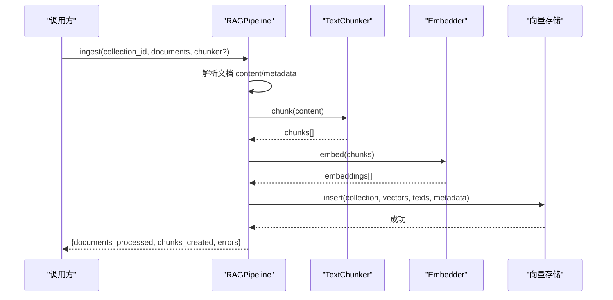
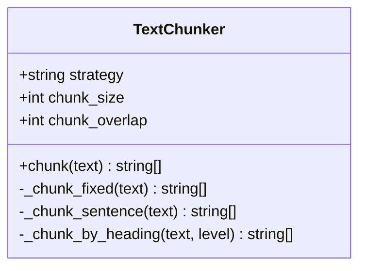
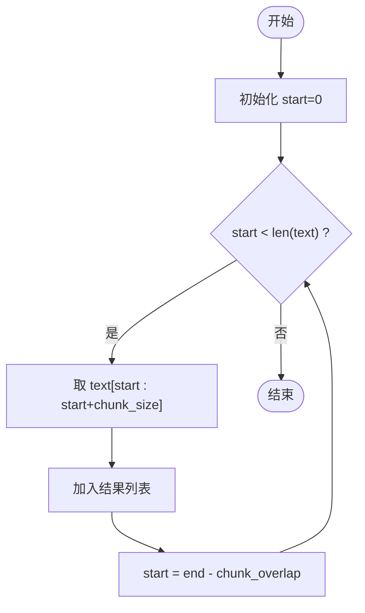
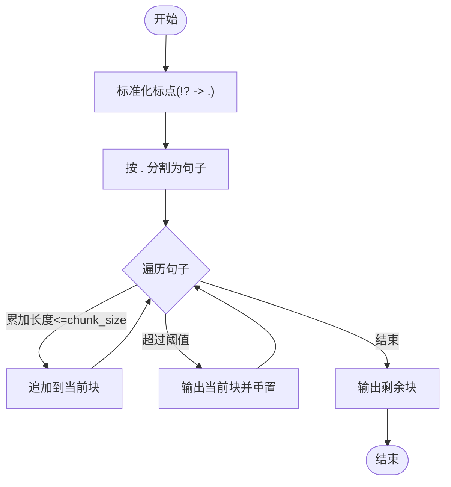
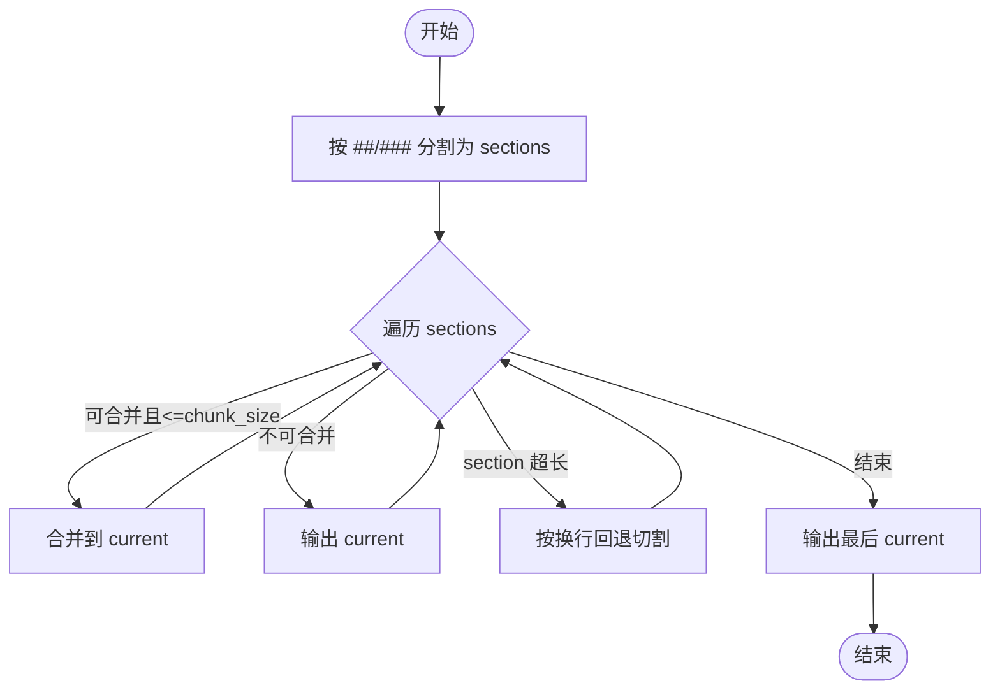
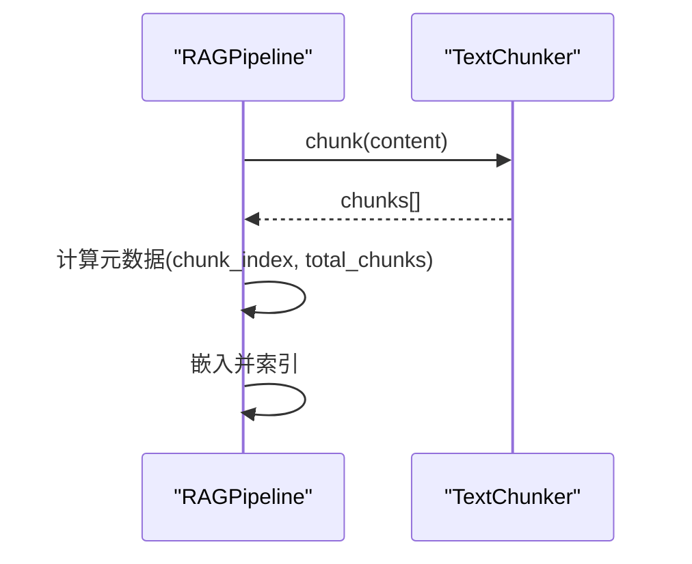
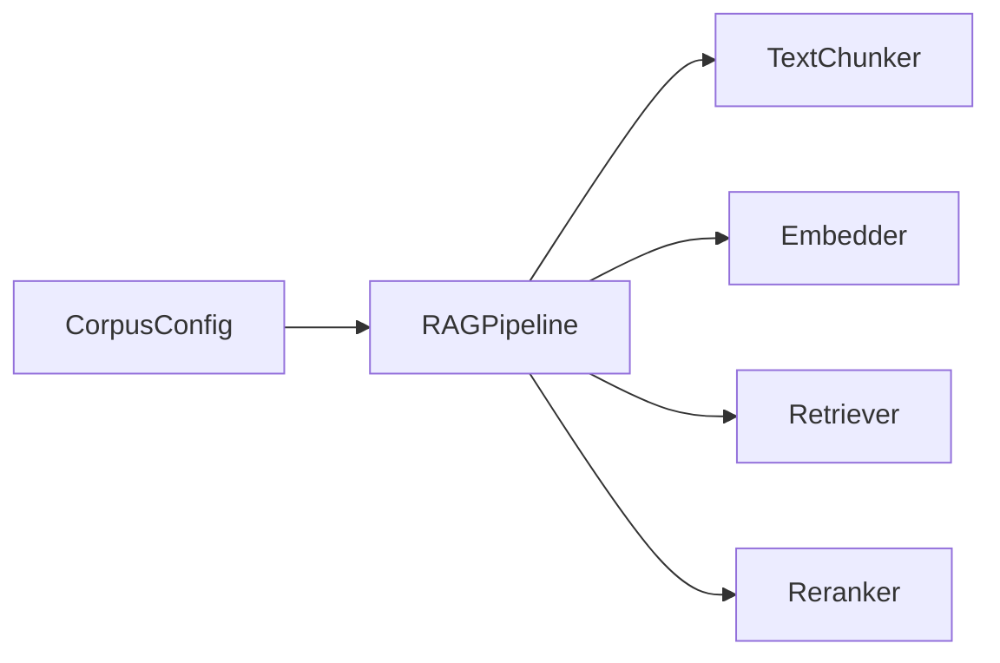

# 分块器组件

<cite>
**本文引用的文件**
- [chunker.py](file://python/src/resolveagent/rag/ingest/chunker.py)
- [pipeline.py](file://python/src/resolveagent/rag/pipeline.py)
- [config.py](file://python/src/resolveagent/corpus/config.py)
- [test_chunker_headings.py](file://python/tests/unit/test_chunker_headings.py)
</cite>

## 目录
1. [简介](#简介)
2. [项目结构](#项目结构)
3. [核心组件](#核心组件)
4. [架构总览](#架构总览)
5. [详细组件分析](#详细组件分析)
6. [依赖关系分析](#依赖关系分析)
7. [性能与调优](#性能与调优)
8. [故障排查指南](#故障排查指南)
9. [结论](#结论)
10. [附录](#附录)

## 简介
本技术文档聚焦于分块器组件 TextChunker，系统阐述其分块策略实现、参数配置、在 RAG 流水线中的集成方式，以及针对不同文档类型的最佳实践。当前仓库实现了固定大小分块、句子级分块、基于 Markdown 标题的分块（按 ##、### 或混合），并提供了默认策略路由与回退机制。语义级分块在类注释中提及，但当前未提供具体实现；如需使用，可参考“扩展建议”进行二次开发。

## 项目结构
与分块器直接相关的代码位于 Python 模块 rag/ingest 下，并通过 RAGPipeline 在摄取阶段调用；语料配置模块 corpus/config.py 提供按路径匹配的策略与默认 chunk_size 映射。测试用例覆盖标题分块的边界行为。

```mermaid
graph TB
A["RAGPipeline<br/>pipeline.py"] --> B["TextChunker<br/>chunker.py"]
A --> C["Embedder<br/>pipeline.py"]
A --> D["Retriever/Reranker<br/>pipeline.py"]
E["CorpusConfig<br/>config.py"] --> |返回 (strategy, chunk_size)| A
```

图表来源
- [pipeline.py:18-42](file://python/src/resolveagent/rag/pipeline.py#L18-L42)
- [chunker.py:8-50](file://python/src/resolveagent/rag/ingest/chunker.py#L8-L50)
- [config.py:46-70](file://python/src/resolveagent/corpus/config.py#L46-L70)

章节来源
- [pipeline.py:18-42](file://python/src/resolveagent/rag/pipeline.py#L18-L42)
- [chunker.py:8-50](file://python/src/resolveagent/rag/ingest/chunker.py#L8-L50)
- [config.py:46-70](file://python/src/resolveagent/corpus/config.py#L46-L70)

## 核心组件
- TextChunker：提供多种分块策略，统一入口为 chunk(text)，内部根据 strategy 路由到不同实现。
- RAGPipeline：在 ingest 流程中调用 TextChunker 对文档内容进行分块，随后嵌入并索引。
- CorpusConfig：根据文件路径选择策略与默认 chunk_size，便于批量导入时自动适配。

章节来源
- [chunker.py:8-50](file://python/src/resolveagent/rag/ingest/chunker.py#L8-L50)
- [pipeline.py:44-138](file://python/src/resolveagent/rag/pipeline.py#L44-L138)
- [config.py:46-70](file://python/src/resolveagent/corpus/config.py#L46-L70)

## 架构总览
下图展示从文档摄入到检索的端到端流程，突出分块器在其中的位置与作用。



图表来源
- [pipeline.py:44-138](file://python/src/resolveagent/rag/pipeline.py#L44-L138)
- [chunker.py:30-50](file://python/src/resolveagent/rag/ingest/chunker.py#L30-L50)

## 详细组件分析

### TextChunker 类与策略路由
- 支持策略：fixed、sentence、by_h2、by_h3、by_section；语义级（semantic）在注释中声明但未实现。
- 参数：
  - strategy：分块策略名，未知值会降级为 fixed。
  - chunk_size：目标块大小（字符数）。
  - chunk_overlap：重叠窗口大小（仅 fixed 策略生效）。
- 路由逻辑：chunk() 根据 strategy 分发到对应私有方法，保证健壮性。



图表来源
- [chunker.py:8-50](file://python/src/resolveagent/rag/ingest/chunker.py#L8-L50)

章节来源
- [chunker.py:8-50](file://python/src/resolveagent/rag/ingest/chunker.py#L8-L50)

### 固定大小分块（fixed）
- 算法要点：以 chunk_size 为窗口宽度、chunk_overlap 为回退步长滑动切割，确保跨块边界的上下文不丢失。
- 适用场景：无明确结构的纯文本、日志、长段落等。
- 复杂度：时间 O(n)，空间 O(k)（k 为块数量）。
- 注意：chunk_overlap 仅在 fixed 策略中生效。



图表来源
- [chunker.py:52-60](file://python/src/resolveagent/rag/ingest/chunker.py#L52-L60)

章节来源
- [chunker.py:52-60](file://python/src/resolveagent/rag/ingest/chunker.py#L52-L60)

### 句子级分块（sentence）
- 算法要点：将 !? 替换为 . 后按 . 切分为句子，再贪心拼接至不超过 chunk_size 的块。
- 适用场景：自然语言文档，希望尽量保持句子完整性。
- 复杂度：时间 O(n)，空间 O(k)。
- 注意：该实现简单，未考虑缩写、引号等复杂标点场景。



图表来源
- [chunker.py:62-83](file://python/src/resolveagent/rag/ingest/chunker.py#L62-L83)

章节来源
- [chunker.py:62-83](file://python/src/resolveagent/rag/ingest/chunker.py#L62-L83)

### 标题级分块（by_h2 / by_h3 / by_section）
- 算法要点：
  - 使用正则按 ## 或 ### 行首标记分割为 section。
  - 优先合并小 section 至 chunk_size 以内；若单个 section 过大，则在换行处回退切割，避免单块过长。
- 适用场景：Markdown 文档，尤其是结构化知识文档、手册、FAQ。
- 复杂度：时间 O(n)，空间 O(k)。
- 边界处理：空文本返回空列表；无标题时返回原文本作为单块。



图表来源
- [chunker.py:85-135](file://python/src/resolveagent/rag/ingest/chunker.py#L85-L135)

章节来源
- [chunker.py:85-135](file://python/src/resolveagent/rag/ingest/chunker.py#L85-L135)

### 在 RAG 流水线中的集成
- RAGPipeline 在 ingest 中调用 TextChunker 对每个文档进行分块，随后生成嵌入并写入向量库。
- 支持传入自定义 chunker 以覆盖默认配置，便于实验对比。



图表来源
- [pipeline.py:101-110](file://python/src/resolveagent/rag/pipeline.py#L101-L110)

章节来源
- [pipeline.py:101-110](file://python/src/resolveagent/rag/pipeline.py#L101-L110)

### 配置与策略选择
- CorpusConfig.get_chunking_strategy 根据文件路径返回 (strategy, chunk_size) 的默认组合，便于批量导入时自动选择。
- 默认映射示例：by_h2→2000、by_h3→1500、by_section→3000、full_doc→50000、sentence→512。

章节来源
- [config.py:46-70](file://python/src/resolveagent/corpus/config.py#L46-L70)

### 单元测试与行为验证
- 覆盖 by_h2/by_h3/by_section 的分割行为、小段合并、超大段回退切割、空文本与无标题边界情况。
- 通过断言验证各策略在不同 chunk_size 下的输出结构与长度约束。

章节来源
- [test_chunker_headings.py:24-210](file://python/tests/unit/test_chunker_headings.py#L24-L210)

## 依赖关系分析
- TextChunker 无外部依赖，仅使用标准库 re。
- RAGPipeline 依赖 TextChunker、Embedder、Retriever、Reranker。
- CorpusConfig 提供策略与尺寸映射，供上层导入流程使用。



图表来源
- [pipeline.py:18-42](file://python/src/resolveagent/rag/pipeline.py#L18-L42)
- [config.py:46-70](file://python/src/resolveagent/corpus/config.py#L46-L70)

章节来源
- [pipeline.py:18-42](file://python/src/resolveagent/rag/pipeline.py#L18-L42)
- [config.py:46-70](file://python/src/resolveagent/corpus/config.py#L46-L70)

## 性能与调优
- 策略选择建议
  - 结构化 Markdown 文档：优先 by_h2 或 by_section，结合较大 chunk_size（如 2000–3000）以获得更好的主题内聚性。
  - 自然语言长文：sentence 策略更稳妥，chunk_size 建议贴近嵌入模型输入上限（例如 512 字符附近）。
  - 无结构文本/日志：fixed 策略配合合理 overlap（如 50–100）提升召回连续性。
- 关键参数
  - chunk_size：控制块大小，需兼顾嵌入模型上下文窗口与检索粒度。
  - chunk_overlap：仅 fixed 策略生效，用于保留跨块边界信息。
- 复杂度与内存
  - 所有策略均为线性时间复杂度 O(n)，空间复杂度与输出块数量相关。
- 质量评估指标（建议）
  - 块大小分布：统计块长度均值/方差，避免过大或过小。
  - 语义连贯性：抽样检查块是否跨越句意断裂点。
  - 检索命中率：在评测集上比较不同策略的 top-k 准确率/NDCG。
  - 重排增益：对比 rerank 前后得分变化，评估分块对排序的影响。
- 调优步骤
  - 先选定策略（由文档类型决定），再微调 chunk_size；必要时调整 overlap。
  - 对 by_* 标题策略，关注超大 section 的回退切割是否合理。
  - 在 RAGPipeline 中通过传入自定义 chunker 进行 A/B 对比。

[本节为通用指导，不直接分析具体文件]

## 故障排查指南
- 症状：未知 strategy 导致意外行为
  - 现象：chunk() 会降级为 fixed，可能产生不符合预期的块。
  - 排查：确认传入的 strategy 是否在支持列表中。
- 症状：标题分块未按预期分割
  - 现象：by_h2/by_h3/by_section 未按标题行分割。
  - 排查：检查文档是否包含正确格式的 Markdown 标题（行首 ## 或 ###）。
- 症状：块过大或过小
  - 现象：检索效果差或重复过多。
  - 排查：调整 chunk_size；对 fixed 策略增加 chunk_overlap；对标题策略检查是否有超大 section 需要拆分。
- 症状：空文档或无标题文档
  - 现象：返回空列表或单块全文。
  - 排查：这是预期行为；如需强制拆分，可在 pipeline 层增加兜底逻辑。

章节来源
- [chunker.py:30-50](file://python/src/resolveagent/rag/ingest/chunker.py#L30-L50)
- [chunker.py:85-135](file://python/src/resolveagent/rag/ingest/chunker.py#L85-L135)
- [test_chunker_headings.py:165-210](file://python/tests/unit/test_chunker_headings.py#L165-L210)

## 结论
TextChunker 在当前仓库中提供了实用的多策略分块能力，涵盖固定大小、句子级与标题级三种主要模式，并通过 RAGPipeline 无缝集成到检索增强流程中。对于结构化 Markdown 文档，标题级策略能更好地保持主题内聚；对于自然语言文本，句子级策略更稳健；对于无结构文本，固定大小策略配合重叠窗口可提升召回连续性。建议在工程实践中结合 CorpusConfig 的路径策略映射与单元测试覆盖，持续评估不同策略在业务数据集上的表现，并据此调优 chunk_size 与 overlap。

[本节为总结性内容，不直接分析具体文件]

## 附录
- 扩展建议
  - 语义级分块（semantic）：可在现有接口基础上引入语义相似度检测（如句子嵌入聚类或主题边界识别），并在 chunk() 中新增分支路由。
  - 更多标题层级：可扩展 _chunk_by_heading 以支持 # 或 #### 等层级。
  - 质量度量：在 pipeline 层记录块长度分布、重复率、检索命中率等指标，形成可视化看板。

[本节为概念性内容，不直接分析具体文件]