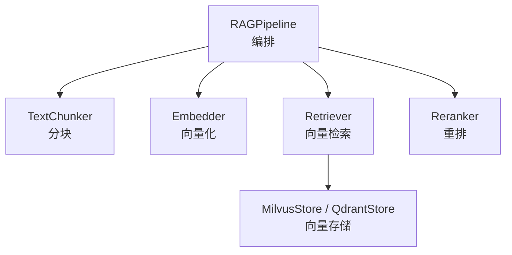
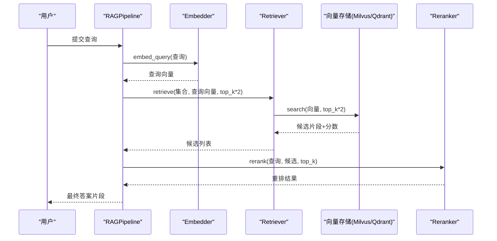
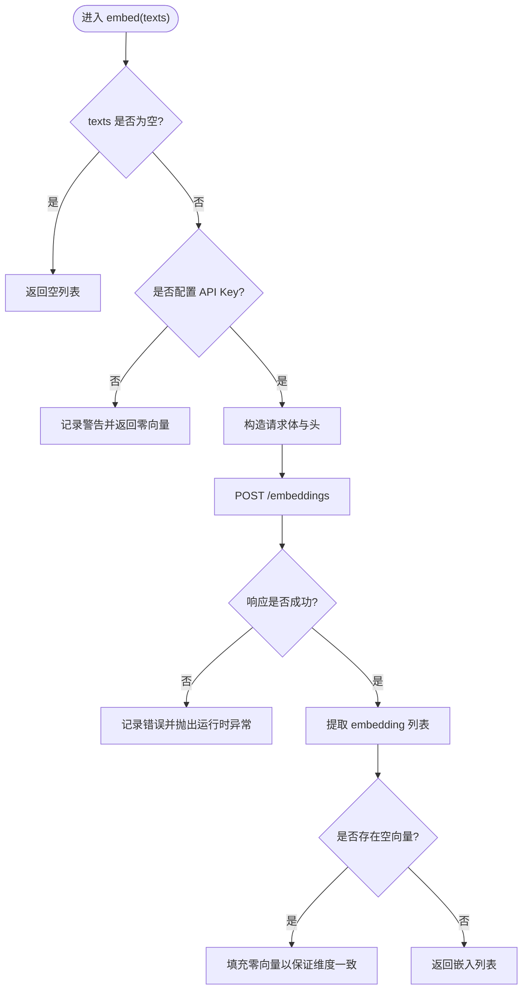
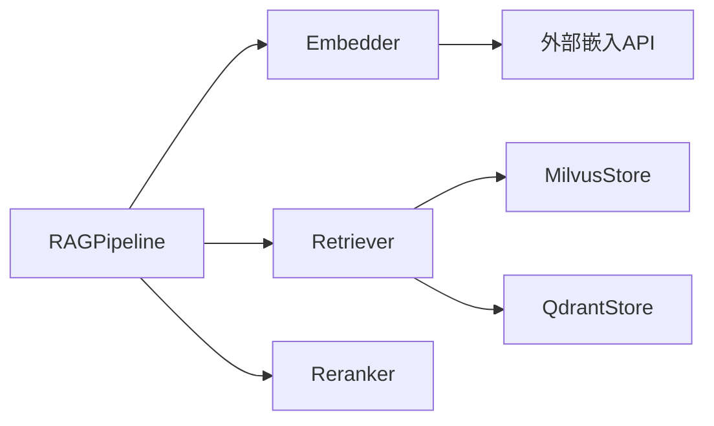

# 嵌入器组件

<cite>
**本文引用的文件**
- [embedder.py](file://python/src/resolveagent/rag/ingest/embedder.py)
- [pipeline.py](file://python/src/resolveagent/rag/pipeline.py)
- [retriever.py](file://python/src/resolveagent/rag/retrieve/retriever.py)
- [reranker.py](file://python/src/resolveagent/rag/retrieve/reranker.py)
- [base.py](file://python/src/resolveagent/rag/index/base.py)
- [milvus.py](file://python/src/resolveagent/rag/index/milvus.py)
- [qdrant.py](file://python/src/resolveagent/rag/index/qdrant.py)
- [configuration.md](file://docs/zh/configuration.md)
</cite>

## 目录
1. [简介](#简介)
2. [项目结构](#项目结构)
3. [核心组件](#核心组件)
4. [架构总览](#架构总览)
5. [详细组件分析](#详细组件分析)
6. [依赖关系分析](#依赖关系分析)
7. [性能与批量优化](#性能与批量优化)
8. [嵌入质量评估与相似度计算](#嵌入质量评估与相似度计算)
9. [模型选择指南](#模型选择指南)
10. [故障排查](#故障排查)
11. [结论](#结论)
12. [附录：可视化示例](#附录可视化示例)

## 简介
本技术文档聚焦于 RAG 管线中的“嵌入器组件”，系统性说明其向量化实现、支持的嵌入模型、维度配置、批量处理策略，以及与检索、重排、向量存储的协作方式。同时给出嵌入质量评估方法、相似度计算公式、性能基准建议、以及面向实践的模型选择指南和可视化示例。

## 项目结构
嵌入器位于 RAG 的“摄取（ingest）”阶段，配合分块器生成文本片段并调用外部嵌入服务；随后由检索器在向量存储中执行相似性搜索，并由重排器进行二次精排。整体流程通过 RAGPipeline 编排。

图表来源
- [pipeline.py:18-42](file://python/src/resolveagent/rag/pipeline.py#L18-L42)
- [retriever.py:14-51](file://python/src/resolveagent/rag/retrieve/retriever.py#L14-L51)
- [milvus.py:29-168](file://python/src/resolveagent/rag/index/milvus.py#L29-L168)
- [qdrant.py:96-133](file://python/src/resolveagent/rag/index/qdrant.py#L96-L133)

章节来源
- [pipeline.py:18-42](file://python/src/resolveagent/rag/pipeline.py#L18-L42)
- [retriever.py:14-51](file://python/src/resolveagent/rag/retrieve/retriever.py#L14-L51)
- [milvus.py:29-168](file://python/src/resolveagent/rag/index/milvus.py#L29-L168)
- [qdrant.py:96-133](file://python/src/resolveagent/rag/index/qdrant.py#L96-L133)

## 核心组件
- Embedder：负责将文本或查询转换为向量，支持多种嵌入模型与统一 API 格式，提供批量与单条接口。
- Retriever：封装向量检索逻辑，支持 Milvus/Qdrant 后端，并提供基于文本的便捷检索入口。
- Reranker：对候选结果进行交叉编码器或 LLM 重排，提升相关性。
- VectorStore（Milvus/Qdrant）：统一的向量存储抽象与具体实现，管理集合、索引与检索。
- RAGPipeline：端到端编排“解析→分块→嵌入→索引→检索→重排”。

章节来源
- [embedder.py:13-171](file://python/src/resolveagent/rag/ingest/embedder.py#L13-L171)
- [retriever.py:14-180](file://python/src/resolveagent/rag/retrieve/retriever.py#L14-L180)
- [reranker.py:28-406](file://python/src/resolveagent/rag/retrieve/reranker.py#L28-L406)
- [base.py:9-144](file://python/src/resolveagent/rag/index/base.py#L9-L144)
- [milvus.py:29-200](file://python/src/resolveagent/rag/index/milvus.py#L29-L200)
- [qdrant.py:96-133](file://python/src/resolveagent/rag/index/qdrant.py#L96-L133)
- [pipeline.py:18-255](file://python/src/resolveagent/rag/pipeline.py#L18-L255)

## 架构总览
下图展示从输入到输出的完整数据流：文档被分块后送入 Embedder 生成向量，写入向量存储；查询时先嵌入再检索，最后经 Reranker 重排输出。

图表来源
- [pipeline.py:192-255](file://python/src/resolveagent/rag/pipeline.py#L192-L255)
- [retriever.py:53-143](file://python/src/resolveagent/rag/retrieve/retriever.py#L53-L143)
- [milvus.py:97-168](file://python/src/resolveagent/rag/index/milvus.py#L97-L168)
- [qdrant.py:96-133](file://python/src/resolveagent/rag/index/qdrant.py#L96-L133)
- [reranker.py:97-188](file://python/src/resolveagent/rag/retrieve/reranker.py#L97-L188)

## 详细组件分析

### Embedder（嵌入器）
- 支持的嵌入模型与维度映射：内置常见模型的维度表，便于自动推断向量维度。
- 批量与单条接口：embed() 支持批量，embed_batch() 按批次切分调用，embed_query() 用于查询。
- 错误与降级：未配置密钥或网络异常时记录日志并返回零向量，避免中断下游流程。
- 集成点：通过 HTTP 客户端调用兼容 OpenAI 格式的嵌入 API，便于接入不同厂商服务。

图表来源
- [embedder.py:50-119](file://python/src/resolveagent/rag/ingest/embedder.py#L50-L119)

章节来源
- [embedder.py:13-171](file://python/src/resolveagent/rag/ingest/embedder.py#L13-L171)

### Retriever（检索器）
- 后端抽象：根据配置选择 Milvus 或 Qdrant，延迟建立连接并在首次使用时初始化。
- 检索接口：retrieve() 接收查询向量、top_k、过滤条件与度量类型；retrieve_by_text() 提供便捷入口。
- 统计与关闭：支持获取集合统计信息，并提供关闭连接的清理方法。

章节来源
- [retriever.py:14-180](file://python/src/resolveagent/rag/retrieve/retriever.py#L14-L180)

### Reranker（重排器）
- 多策略重排：优先使用交叉编码器（如 BGE-Reranker），回退至 LLM 评分或词频/Jaccard 简单打分。
- 多样性重排：支持 MMR 风格的多样性选择，平衡相关性与重复度。
- 分数融合：将原始相似度与重排分数加权组合，得到最终排序依据。

章节来源
- [reranker.py:28-406](file://python/src/resolveagent/rag/retrieve/reranker.py#L28-L406)

### VectorStore（向量存储）
- 抽象接口：定义连接、集合管理、插入、搜索、删除与统计等异步方法。
- Milvus 实现：创建集合时自动构建 IVF_FLAT 索引，字段包含 id、vector、text、metadata。
- Qdrant 实现：支持 gRPC 通信、距离度量映射（COSINE/L2/IP）、Payload 灵活元数据。

章节来源
- [base.py:9-144](file://python/src/resolveagent/rag/index/base.py#L9-L144)
- [milvus.py:29-200](file://python/src/resolveagent/rag/index/milvus.py#L29-L200)
- [qdrant.py:96-133](file://python/src/resolveagent/rag/index/qdrant.py#L96-L133)

### RAGPipeline（端到端编排）
- 摄取流程：文档注册 → 分块 → 嵌入 → 索引（自动创建集合与索引）。
- 查询流程：嵌入查询 → 检索候选 → 重排 → 返回结果。
- 可插拔：支持自定义分块器、可选持久化客户端以记录文档状态。

章节来源
- [pipeline.py:18-255](file://python/src/resolveagent/rag/pipeline.py#L18-L255)

## 依赖关系分析
- Embedder 依赖外部嵌入 API（兼容 OpenAI 格式），通过 httpx 发起异步请求。
- Retriever 依赖 MilvusStore/QdrantStore 的具体实现。
- Reranker 可选依赖 sentence-transformers（CrossEncoder）或 LLMProvider。
- Pipeline 聚合上述组件，形成完整的 RAG 链路。

图表来源
- [embedder.py:50-119](file://python/src/resolveagent/rag/ingest/embedder.py#L50-L119)
- [retriever.py:14-51](file://python/src/resolveagent/rag/retrieve/retriever.py#L14-L51)
- [milvus.py:29-168](file://python/src/resolveagent/rag/index/milvus.py#L29-L168)
- [qdrant.py:96-133](file://python/src/resolveagent/rag/index/qdrant.py#L96-L133)
- [reranker.py:28-188](file://python/src/resolveagent/rag/retrieve/reranker.py#L28-L188)
- [pipeline.py:18-42](file://python/src/resolveagent/rag/pipeline.py#L18-L42)

章节来源
- [embedder.py:50-119](file://python/src/resolveagent/rag/ingest/embedder.py#L50-L119)
- [retriever.py:14-51](file://python/src/resolveagent/rag/retrieve/retriever.py#L14-L51)
- [milvus.py:29-168](file://python/src/resolveagent/rag/index/milvus.py#L29-L168)
- [qdrant.py:96-133](file://python/src/resolveagent/rag/index/qdrant.py#L96-L133)
- [reranker.py:28-188](file://python/src/resolveagent/rag/retrieve/reranker.py#L28-L188)
- [pipeline.py:18-42](file://python/src/resolveagent/rag/pipeline.py#L18-L42)

## 性能与批量优化
- 批量嵌入：使用 embed_batch() 将大批量文本切分为固定大小的批次，降低单次请求开销并提高吞吐。
- 超时与重试：HTTP 客户端设置合理超时；可在上层增加重试与熔断策略以增强鲁棒性。
- 向量索引：Milvus 默认使用 IVF_FLAT 索引，可通过配置调整 nlist/nprobe 等参数；Qdrant 支持 HNSW 参数调优。
- 检索规模：检索时 top_k 通常放大后再重排，兼顾召回与精度。
- 资源利用：跨编码器重排在本地 GPU/CPU 上运行，注意显存与批大小；LLM 重排需控制并发与 token 预算。

章节来源
- [embedder.py:133-154](file://python/src/resolveagent/rag/ingest/embedder.py#L133-L154)
- [milvus.py:146-158](file://python/src/resolveagent/rag/index/milvus.py#L146-L158)
- [configuration.md:471-534](file://docs/zh/configuration.md#L471-L534)
- [reranker.py:97-188](file://python/src/resolveagent/rag/retrieve/reranker.py#L97-L188)

## 嵌入质量评估与相似度计算
- 相似度度量：
  - 余弦相似度（COSINE）：适用于归一化后的向量，关注方向一致性。
  - 欧几里得距离（L2/EUCLID）：衡量绝对距离，适合对尺度敏感的场景。
  - 内积（IP/DOT）：在未归一化向量下等价于带偏置的相似度。
- 评估指标建议：
  - 检索准确率（Recall@K、Precision@K、NDCG@K）：衡量候选集质量。
  - 重排增益（Delta NDCG）：对比仅向量检索与加入重排的改进幅度。
  - 延迟与吞吐：端到端 P95 延迟、每秒请求数、向量维度与索引参数对性能的影响。
- 实验设计：
  - 固定测试集与随机种子，保证可比性。
  - 对不同模型（如 bge-large-zh、text-embedding-v1/v2）进行横向对比。
  - 结合业务语料做领域微调或提示工程，观察效果变化。

章节来源
- [retriever.py:53-112](file://python/src/resolveagent/rag/retrieve/retriever.py#L53-L112)
- [milvus.py:97-168](file://python/src/resolveagent/rag/index/milvus.py#L97-L168)
- [qdrant.py:96-133](file://python/src/resolveagent/rag/index/qdrant.py#L96-L133)
- [reranker.py:97-188](file://python/src/resolveagent/rag/retrieve/reranker.py#L97-L188)

## 模型选择指南
- 中文场景：bge-large-zh/bge-base-zh 具备较好的中文语义表征能力，维度分别为 1024/768。
- 通用英文/多语言：text-embedding-v1/v2 维度为 1536，生态兼容性好。
- 选择原则：
  - 任务匹配：问答/检索优先选语义强模型；短文本可考虑轻量模型。
  - 成本与延迟：大模型精度高但成本高，小模型更快更省。
  - 部署环境：本地推理可用 CrossEncoder 重排；云端 API 需考虑配额与稳定性。
- 实践建议：
  - 先用小模型快速验证流程，再切换到大模型提升效果。
  - 结合重排器（交叉编码器）进一步提升精度。
  - 定期回归评测，监控漂移与退化。

章节来源
- [embedder.py:24-48](file://python/src/resolveagent/rag/ingest/embedder.py#L24-L48)
- [reranker.py:62-95](file://python/src/resolveagent/rag/retrieve/reranker.py#L62-L95)

## 故障排查
- 无 API Key：会记录警告并返回零向量，检查环境变量或注入密钥。
- HTTP 错误：捕获状态码与响应体，定位服务商限流或鉴权失败。
- 向量维度不一致：确保模型与集合维度一致；若为空向量则填充零向量。
- 向量存储不可用：检查 Milvus/Qdrant 连接与集合存在性；必要时重建索引。
- 重排失败：交叉编码器加载失败会回退到 LLM 或简单打分，查看日志确认路径。

章节来源
- [embedder.py:65-119](file://python/src/resolveagent/rag/ingest/embedder.py#L65-L119)
- [retriever.py:85-112](file://python/src/resolveagent/rag/retrieve/retriever.py#L85-L112)
- [milvus.py:67-88](file://python/src/resolveagent/rag/index/milvus.py#L67-L88)
- [qdrant.py:96-133](file://python/src/resolveagent/rag/index/qdrant.py#L96-L133)
- [reranker.py:62-95](file://python/src/resolveagent/rag/retrieve/reranker.py#L62-L95)

## 结论
嵌入器组件在 RAG 管线中承担关键的语义表示职责。通过灵活的模型支持与批量优化、稳健的错误降级、以及与检索/重排/向量存储的深度集成，系统能够在不同场景下取得良好的召回与精度表现。建议结合业务语料持续评估与调优，选择合适的模型与索引参数，以获得最佳性价比。

## 附录：可视化示例
- 相似度分布可视化：绘制查询向量与各候选片段向量的余弦相似度直方图，识别阈值与长尾。
- 降维投影：使用 t-SNE/UMAP 将高维向量降至二维，观察聚类与重叠情况，辅助理解模型区分度。
- 重排前后对比：对比仅向量检索与加入重排的结果顺序变化，标注关键片段位置。
- 性能曲线：横轴为 top_k 或 batch_size，纵轴为延迟/吞吐/NDCG，指导参数选择。

[本节为概念性内容，不直接分析具体代码文件]