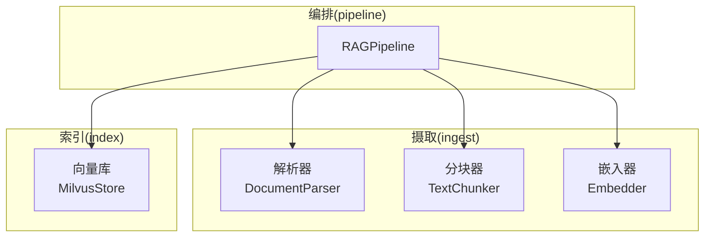
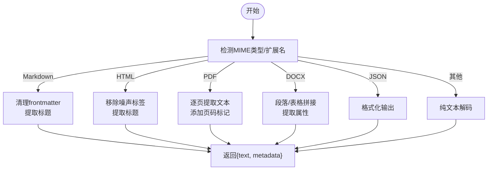
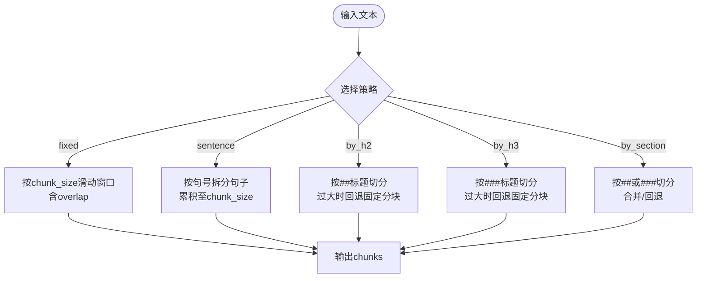
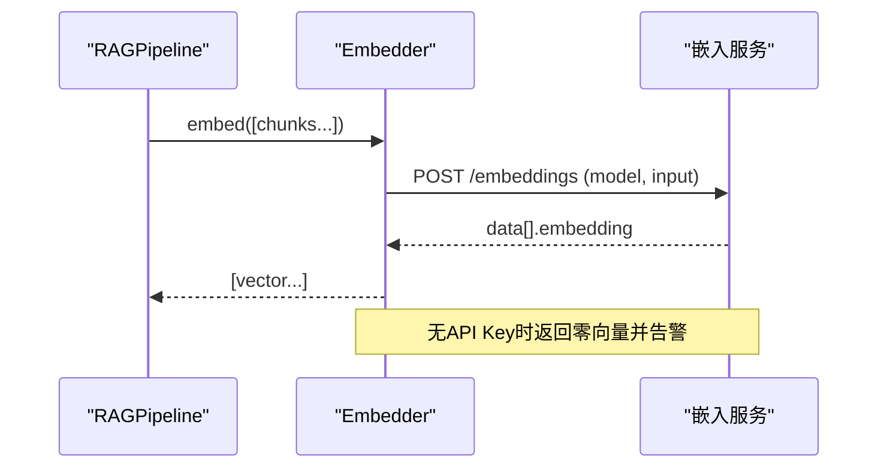
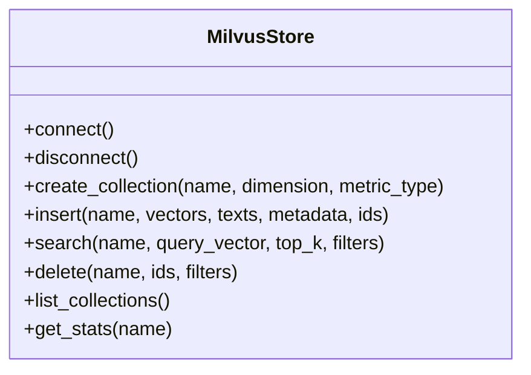
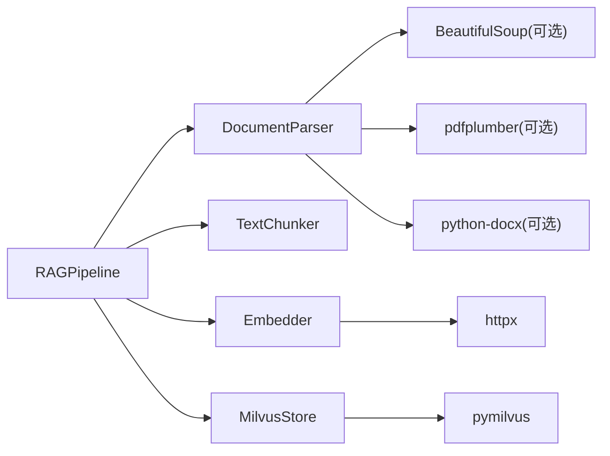

# 文档摄取流程

<cite>
**本文引用的文件**
- [pipeline.py](file://python/src/resolveagent/rag/pipeline.py)
- [parser.py](file://python/src/resolveagent/rag/ingest/parser.py)
- [chunker.py](file://python/src/resolveagent/rag/ingest/chunker.py)
- [embedder.py](file://python/src/resolveagent/rag/ingest/embedder.py)
- [milvus.py](file://python/src/resolveagent/rag/index/milvus.py)
- [config.py](file://python/src/resolveagent/corpus/config.py)
- [config.yaml](file://docs/demo/demo/rag/config.yaml)
</cite>

## 目录
1. [简介](#简介)
2. [项目结构](#项目结构)
3. [核心组件](#核心组件)
4. [架构总览](#架构总览)
5. [详细组件分析](#详细组件分析)
6. [依赖关系分析](#依赖关系分析)
7. [性能考量](#性能考量)
8. [故障排查指南](#故障排查指南)
9. [结论](#结论)
10. [附录：配置与最佳实践](#附录配置与最佳实践)

## 简介
本技术文档聚焦于RAG管道中的“文档摄取”阶段，系统阐述三个核心处理环节：解析器（Parser）如何识别并解析多种格式文档、分块器（TextChunker）的分块策略与参数配置、嵌入器（Embedder）如何将文本转换为向量表示。同时给出完整配置示例与最佳实践建议，帮助读者在不同场景下选择合适的解析、分块与嵌入方案，提升检索质量与系统性能。

## 项目结构
RAG摄取相关代码位于Python模块的rag子系统中，关键目录与职责如下：
- ingest：包含解析器、分块器、嵌入器三大组件
- index：向量存储实现（Milvus等）
- pipeline：端到端编排入口，串联解析、分块、嵌入、索引、检索与重排



图表来源
- [pipeline.py:18-42](file://python/src/resolveagent/rag/pipeline.py#L18-L42)
- [parser.py:24-71](file://python/src/resolveagent/rag/ingest/parser.py#L24-L71)
- [chunker.py:8-50](file://python/src/resolveagent/rag/ingest/chunker.py#L8-L50)
- [embedder.py:13-49](file://python/src/resolveagent/rag/ingest/embedder.py#L13-L49)
- [milvus.py:29-66](file://python/src/resolveagent/rag/index/milvus.py#L29-L66)

章节来源
- [pipeline.py:18-42](file://python/src/resolveagent/rag/pipeline.py#L18-L42)
- [parser.py:24-71](file://python/src/resolveagent/rag/ingest/parser.py#L24-L71)
- [chunker.py:8-50](file://python/src/resolveagent/rag/ingest/chunker.py#L8-L50)
- [embedder.py:13-49](file://python/src/resolveagent/rag/ingest/embedder.py#L13-L49)
- [milvus.py:29-66](file://python/src/resolveagent/rag/index/milvus.py#L29-L66)

## 核心组件
- 解析器（DocumentParser）
  - 支持格式：纯文本、Markdown、HTML、PDF、Word（docx）、JSON
  - 自动检测MIME类型或基于扩展名选择解析器
  - 输出统一为“文本+元数据”，便于后续分块与嵌入
- 分块器（TextChunker）
  - 策略：固定大小、句子级、按标题（H2/H3/任意Section）、可扩展语义分块
  - 参数：chunk_size、chunk_overlap，控制重叠与粒度
- 嵌入器（Embedder）
  - 模型：BGE系列（bge-large-zh/bge-base-zh）、OpenAI兼容接口
  - 批量嵌入、查询嵌入、维度映射与错误降级
- 向量存储（MilvusStore）
  - 集合管理、索引创建（IVF_FLAT）、插入与搜索
  - 元数据字段与动态字段支持

章节来源
- [parser.py:24-71](file://python/src/resolveagent/rag/ingest/parser.py#L24-L71)
- [chunker.py:8-50](file://python/src/resolveagent/rag/ingest/chunker.py#L8-L50)
- [embedder.py:13-49](file://python/src/resolveagent/rag/ingest/embedder.py#L13-L49)
- [milvus.py:29-66](file://python/src/resolveagent/rag/index/milvus.py#L29-L66)

## 架构总览
下图展示从原始文档到可检索向量的端到端流程，以及查询时的检索与重排路径。

```mermaid
sequenceDiagram
participant U as "调用方"
participant RP as "RAGPipeline"
participant PAR as "DocumentParser"
participant CH as "TextChunker"
participant EM as "Embedder"
participant VS as "MilvusStore"
U->>RP : ingest(collection_id, documents)
loop 遍历每个文档
RP->>PAR : parse(content, file_path)
PAR-->>RP : {text, metadata}
RP->>CH : chunk(text)
CH-->>RP : [chunks]
RP->>EM : embed(chunks)
EM-->>RP : [vectors]
RP->>VS : create_collection + insert(vectors,texts,metadata)
VS-->>RP : 成功
end
RP-->>U : 统计结果(文档数/分块数/错误)
```

图表来源
- [pipeline.py:44-138](file://python/src/resolveagent/rag/pipeline.py#L44-L138)
- [parser.py:38-71](file://python/src/resolveagent/rag/ingest/parser.py#L38-L71)
- [chunker.py:30-50](file://python/src/resolveagent/rag/ingest/chunker.py#L30-L50)
- [embedder.py:50-119](file://python/src/resolveagent/rag/ingest/embedder.py#L50-L119)
- [milvus.py:97-168](file://python/src/resolveagent/rag/index/milvus.py#L97-L168)

## 详细组件分析

### 解析器（DocumentParser）
- 格式识别
  - 通过文件扩展名或内容特征（如PDF魔数、HTML标签、JSON起始字符）推断MIME类型
  - 若无法识别则回退为纯文本
- 各格式处理要点
  - Markdown：去除frontmatter，保留标题信息
  - HTML：移除script/style/nav/footer等噪声，提取title/h1作为标题
  - PDF：逐页提取文本，附加页码分隔标记；缺失依赖时返回空文本并记录错误
  - DOCX：段落与表格文本拼接，提取文档属性（标题/作者）
  - JSON：格式化输出以便分块与嵌入
- 输出规范
  - 统一返回{text, metadata}，metadata包含source、format及可选title/author等



图表来源
- [parser.py:38-71](file://python/src/resolveagent/rag/ingest/parser.py#L38-L71)
- [parser.py:114-148](file://python/src/resolveagent/rag/ingest/parser.py#L114-L148)
- [parser.py:150-199](file://python/src/resolveagent/rag/ingest/parser.py#L150-L199)
- [parser.py:201-247](file://python/src/resolveagent/rag/ingest/parser.py#L201-L247)
- [parser.py:249-309](file://python/src/resolveagent/rag/ingest/parser.py#L249-L309)
- [parser.py:311-336](file://python/src/resolveagent/rag/ingest/parser.py#L311-L336)

章节来源
- [parser.py:24-71](file://python/src/resolveagent/rag/ingest/parser.py#L24-L71)
- [parser.py:114-148](file://python/src/resolveagent/rag/ingest/parser.py#L114-L148)
- [parser.py:150-199](file://python/src/resolveagent/rag/ingest/parser.py#L150-L199)
- [parser.py:201-247](file://python/src/resolveagent/rag/ingest/parser.py#L201-L247)
- [parser.py:249-309](file://python/src/resolveagent/rag/ingest/parser.py#L249-L309)
- [parser.py:311-336](file://python/src/resolveagent/rag/ingest/parser.py#L311-L336)

### 分块器（TextChunker）
- 策略说明
  - fixed：固定字符长度分块，支持重叠
  - sentence：按句号切分句子，再合并至目标长度
  - by_h2/by_section：按Markdown二级标题切分，大段自动回退到固定分块
  - by_h3：按三级标题切分
- 参数配置
  - chunk_size：目标分块大小（字符/近似句长）
  - chunk_overlap：相邻分块重叠字符数，提升上下文连续性
- 复杂度与行为
  - 固定分块时间复杂度O(n)，句子分块需扫描句子边界
  - 标题分块在超大section内会进行二次分割以保证不超过chunk_size



图表来源
- [chunker.py:8-50](file://python/src/resolveagent/rag/ingest/chunker.py#L8-L50)
- [chunker.py:52-83](file://python/src/resolveagent/rag/ingest/chunker.py#L52-L83)
- [chunker.py:85-135](file://python/src/resolveagent/rag/ingest/chunker.py#L85-L135)

章节来源
- [chunker.py:8-50](file://python/src/resolveagent/rag/ingest/chunker.py#L8-L50)
- [chunker.py:52-83](file://python/src/resolveagent/rag/ingest/chunker.py#L52-L83)
- [chunker.py:85-135](file://python/src/resolveagent/rag/ingest/chunker.py#L85-L135)

### 嵌入器（Embedder）
- 模型与维度
  - bge-large-zh（1024维）、bge-base-zh（768维）、OpenAI兼容接口（1536维）
- 调用方式
  - 批量嵌入embed(texts)、查询嵌入embed_query(query)、分批嵌入embed_batch(texts, batch_size)
  - 通过HTTP客户端调用远程API，超时与状态码错误均捕获并抛出异常
- 降级策略
  - 未配置API Key时返回零向量（带日志警告），避免阻塞流水线
- 性能优化
  - 使用batch_size控制请求大小，减少网络往返
  - 合理设置timeout，避免长时间阻塞



图表来源
- [embedder.py:13-49](file://python/src/resolveagent/rag/ingest/embedder.py#L13-L49)
- [embedder.py:50-119](file://python/src/resolveagent/rag/ingest/embedder.py#L50-L119)
- [embedder.py:121-154](file://python/src/resolveagent/rag/ingest/embedder.py#L121-L154)

章节来源
- [embedder.py:13-49](file://python/src/resolveagent/rag/ingest/embedder.py#L13-L49)
- [embedder.py:50-119](file://python/src/resolveagent/rag/ingest/embedder.py#L50-L119)
- [embedder.py:121-154](file://python/src/resolveagent/rag/ingest/embedder.py#L121-L154)

### 向量存储（MilvusStore）
- 集合管理
  - 自动清洗集合名，确保符合命名规范
  - 创建集合时定义schema（id、vector、text、metadata），并建立IVF_FLAT索引
- 数据写入
  - 支持自定义ID或自动生成UUID，附带文本与元数据
- 检索
  - 支持过滤表达式（基于metadata字段），加载集合后执行相似性搜索
- 运维
  - 提供删除、列表、统计等常用操作



图表来源
- [milvus.py:29-66](file://python/src/resolveagent/rag/index/milvus.py#L29-L66)
- [milvus.py:97-168](file://python/src/resolveagent/rag/index/milvus.py#L97-L168)
- [milvus.py:207-268](file://python/src/resolveagent/rag/index/milvus.py#L207-L268)
- [milvus.py:270-341](file://python/src/resolveagent/rag/index/milvus.py#L270-L341)

章节来源
- [milvus.py:29-66](file://python/src/resolveagent/rag/index/milvus.py#L29-L66)
- [milvus.py:97-168](file://python/src/resolveagent/rag/index/milvus.py#L97-L168)
- [milvus.py:207-268](file://python/src/resolveagent/rag/index/milvus.py#L207-L268)
- [milvus.py:270-341](file://python/src/resolveagent/rag/index/milvus.py#L270-L341)

## 依赖关系分析
- 组件耦合
  - RAGPipeline聚合Parser、Chunker、Embedder、Retriever/Reranker与VectorStore
  - Embedder依赖外部嵌入服务（HTTP），MilvusStore依赖pymilvus
- 外部依赖
  - BeautifulSoup（HTML解析，可选）
  - pdfplumber（PDF解析，可选）
  - python-docx（DOCX解析，可选）
  - httpx（HTTP客户端）
  - pymilvus（向量数据库客户端）



图表来源
- [pipeline.py:18-42](file://python/src/resolveagent/rag/pipeline.py#L18-L42)
- [parser.py:150-199](file://python/src/resolveagent/rag/ingest/parser.py#L150-L199)
- [parser.py:201-247](file://python/src/resolveagent/rag/ingest/parser.py#L201-L247)
- [parser.py:249-309](file://python/src/resolveagent/rag/ingest/parser.py#L249-L309)
- [embedder.py:50-119](file://python/src/resolveagent/rag/ingest/embedder.py#L50-L119)
- [milvus.py:67-88](file://python/src/resolveagent/rag/index/milvus.py#L67-L88)

章节来源
- [pipeline.py:18-42](file://python/src/resolveagent/rag/pipeline.py#L18-L42)
- [parser.py:150-199](file://python/src/resolveagent/rag/ingest/parser.py#L150-L199)
- [parser.py:201-247](file://python/src/resolveagent/rag/ingest/parser.py#L201-L247)
- [parser.py:249-309](file://python/src/resolveagent/rag/ingest/parser.py#L249-L309)
- [embedder.py:50-119](file://python/src/resolveagent/rag/ingest/embedder.py#L50-L119)
- [milvus.py:67-88](file://python/src/resolveagent/rag/index/milvus.py#L67-L88)

## 性能考量
- 分块策略选择
  - 技术手册/FAQ：优先使用by_h2/by_section，保持语义完整性；短小条目可用sentence
  - 超长文档：结合by_section与fixed回退，避免单块过大影响检索精度
- 嵌入批处理
  - 使用embed_batch调整batch_size以平衡吞吐与延迟
  - 合理设置HTTP超时，避免慢请求拖垮整体吞吐
- 向量索引
  - IVF_FLAT nlist=128适用于中等规模数据集；大规模可考虑调优nlist/nprobe
  - 使用COSINE相似度匹配中文语义更稳健
- 资源与成本
  - 嵌入API调用次数与token量直接影响成本，可通过分块策略与缓存降低重复计算
  - 对相同content_hash的文档去重入库，减少冗余

[本节为通用性能指导，不直接分析具体文件]

## 故障排查指南
- 解析失败
  - PDF/DOCX缺少依赖：检查是否安装pdfplumber/python-docx；否则将返回空文本并记录错误
  - HTML解析：若未安装BeautifulSoup，将回退正则去标签，可能丢失部分结构
- 嵌入失败
  - 未配置API Key：返回零向量并告警，需配置DASHSCOPE_API_KEY或传入api_key
  - HTTP错误：记录状态码与响应体，定位服务侧问题
- 向量库连接
  - 未安装pymilvus：抛出导入错误，需安装依赖
  - 集合名非法：自动清洗，但仍需保证唯一性与长度限制
- 常见问题定位
  - 查看日志中“Failed to parse ...”、“Embedding API error”、“Failed to connect to Milvus”等关键字快速定位

章节来源
- [parser.py:201-247](file://python/src/resolveagent/rag/ingest/parser.py#L201-L247)
- [parser.py:249-309](file://python/src/resolveagent/rag/ingest/parser.py#L249-L309)
- [embedder.py:65-68](file://python/src/resolveagent/rag/ingest/embedder.py#L65-L68)
- [embedder.py:111-119](file://python/src/resolveagent/rag/ingest/embedder.py#L111-L119)
- [milvus.py:67-88](file://python/src/resolveagent/rag/index/milvus.py#L67-L88)

## 结论
该RAG摄取管线通过统一的解析、灵活的分块与稳定的嵌入/索引能力，覆盖了常见文档格式与多场景分块需求。配合合理的配置与优化策略，可在准确性、性能与成本之间取得良好平衡。建议在工程实践中：
- 根据文档类型选择合适分块策略
- 使用批处理与合适的batch_size提升吞吐
- 监控嵌入与向量库健康度，及时扩容与调优

[本节为总结性内容，不直接分析具体文件]

## 附录：配置与最佳实践

### 配置示例
- 演示配置（collection、embedding、chunking、retrieval、sources）
  - 参考路径：[config.yaml](file://docs/demo/demo/rag/config.yaml)
  - 关键点：
    - embedding.model与dimension需与Embedder一致
    - chunking.strategy可选择semantic/fixed/sentence，并设置chunk_size与chunk_overlap
    - retrieval.rerank_enabled开启重排以提升相关性
    - sources.type=directory，patterns指定要摄入的文件类型

章节来源
- [config.yaml:1-38](file://docs/demo/demo/rag/config.yaml#L1-L38)

### 默认策略与路径匹配
- 不同目录模式对应默认分块策略与尺寸
  - 参考路径：[config.py](file://python/src/resolveagent/corpus/config.py)
  - 例如：domain-使用by_h2，topic-fta/list使用by_h3，topic-skills使用by_section等

章节来源
- [config.py:14-21](file://python/src/resolveagent/corpus/config.py#L14-L21)
- [config.py:46-70](file://python/src/resolveagent/corpus/config.py#L46-L70)

### 最佳实践建议
- 解析阶段
  - 优先使用结构化格式（Markdown/HTML）以获得更好的标题与段落信息
  - PDF/DOCX依赖可选，生产环境建议预装以避免运行时缺失
- 分块阶段
  - 技术文档推荐by_h2/by_section；短句/术语集用sentence
  - 合理设置chunk_overlap（如50）以保持上下文连贯
- 嵌入阶段
  - 中文场景优先bge-large-zh；英文或通用场景可使用OpenAI兼容接口
  - 使用embed_batch控制批次大小，平衡延迟与吞吐
- 索引阶段
  - 使用COSINE度量；根据数据规模调整IVF_FLAT参数
  - 为metadata建立合适的过滤条件，提升检索精准度
- 运维与成本
  - 对content_hash去重入库，避免重复计算
  - 监控API调用量与向量库指标，按需扩缩容

[本节为通用实践建议，不直接分析具体文件]