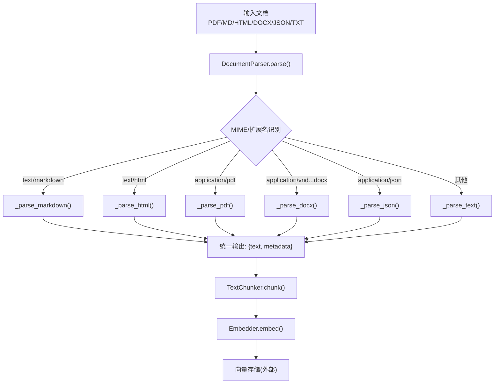
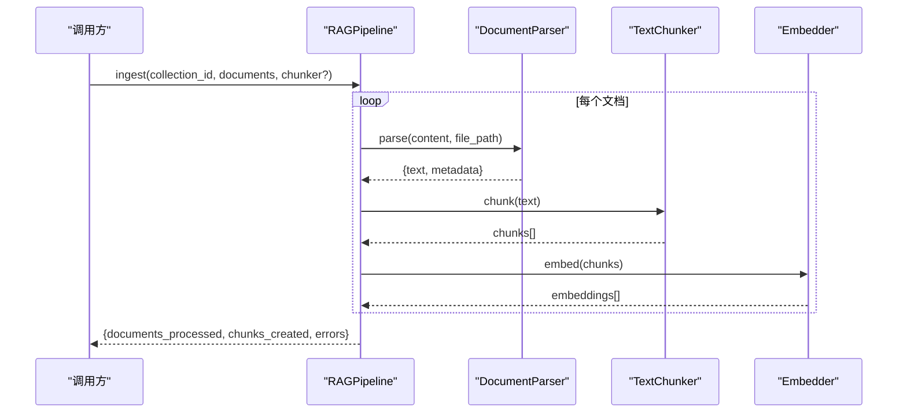
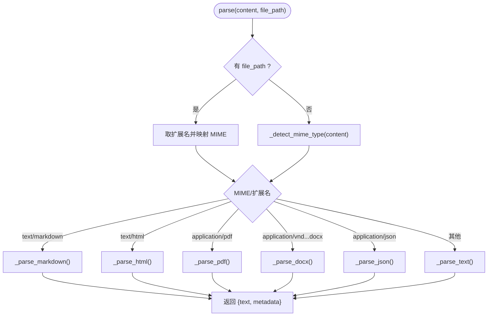
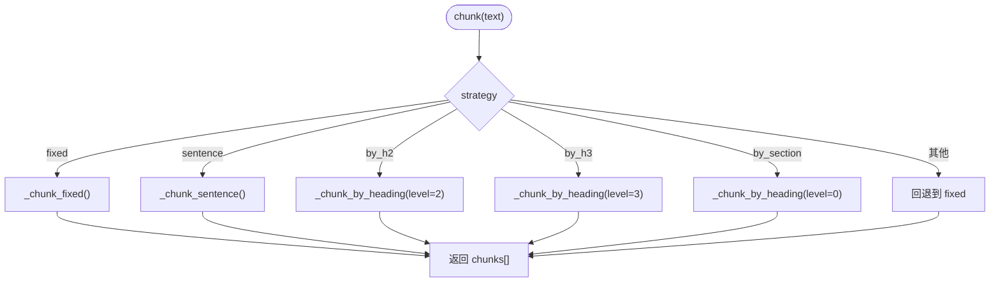
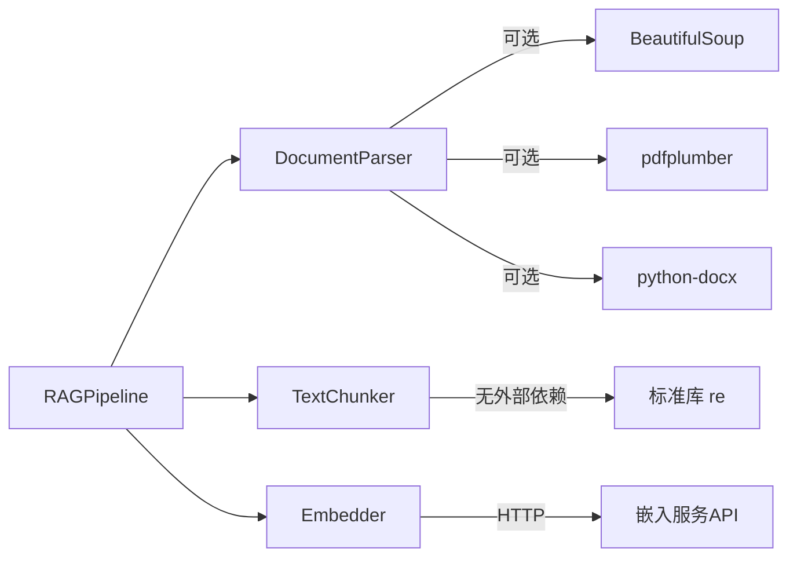

# 解析器组件

<cite>
**本文引用的文件**
- [parser.py](file://python/src/resolveagent/rag/ingest/parser.py)
- [chunker.py](file://python/src/resolveagent/rag/ingest/chunker.py)
- [embedder.py](file://python/src/resolveagent/rag/ingest/embedder.py)
- [pipeline.py](file://python/src/resolveagent/rag/pipeline.py)
- [config.py](file://python/src/resolveagent/corpus/config.py)
- [test_rag_pipeline.py](file://python/tests/unit/test_rag_pipeline.py)
</cite>

## 目录
1. [简介](#简介)
2. [项目结构](#项目结构)
3. [核心组件](#核心组件)
4. [架构总览](#架构总览)
5. [详细组件分析](#详细组件分析)
6. [依赖关系分析](#依赖关系分析)
7. [性能考量](#性能考量)
8. [故障排查指南](#故障排查指南)
9. [结论](#结论)
10. [附录](#附录)

## 简介
本技术文档聚焦于 RAG 摄取管线中的“解析器组件”，围绕 DocumentParser 类展开，系统阐述其多格式文档支持（PDF、Markdown、HTML、Word、JSON、纯文本）的解析策略、MIME 类型检测机制、格式自动识别算法、各格式的特定解析逻辑、错误处理机制与性能优化建议。同时给出配置选项说明与最佳实践，帮助读者在生产环境中稳定高效地接入各类文档。

## 项目结构
解析器组件位于 Python 侧 RAG 摄取模块中，主要包含：
- 文档解析：DocumentParser（多格式解析与 MIME 检测）
- 文本分块：TextChunker（多种分块策略）
- 向量嵌入：Embedder（多模型嵌入生成）
- 管道编排：RAGPipeline（解析→分块→嵌入→索引）
- 语料配置：CorpusConfig（按路径模式选择分块策略）

图表来源
- [parser.py:24-112](file://python/src/resolveagent/rag/ingest/parser.py#L24-L112)
- [chunker.py:8-50](file://python/src/resolveagent/rag/ingest/chunker.py#L8-L50)
- [embedder.py:13-49](file://python/src/resolveagent/rag/ingest/embedder.py#L13-L49)

章节来源
- [parser.py:1-394](file://python/src/resolveagent/rag/ingest/parser.py#L1-L394)
- [chunker.py:1-136](file://python/src/resolveagent/rag/ingest/chunker.py#L1-L136)
- [embedder.py:1-171](file://python/src/resolveagent/rag/ingest/embedder.py#L1-L171)
- [pipeline.py:18-81](file://python/src/resolveagent/rag/pipeline.py#L18-L81)
- [config.py:46-70](file://python/src/resolveagent/corpus/config.py#L46-L70)

## 核心组件
- DocumentParser：负责从内容或文件路径推断格式并调用对应解析器，输出标准化文本与元数据。
- TextChunker：将解析后的文本切分为适合嵌入的片段，提供固定窗口、句子边界、标题边界等策略。
- Embedder：调用外部嵌入服务生成向量，支持批量与查询单条嵌入。
- RAGPipeline：编排解析、分块、嵌入、检索与重排序流程。
- CorpusConfig：根据文件路径模式自动选择分块策略与大小。

章节来源
- [parser.py:24-112](file://python/src/resolveagent/rag/ingest/parser.py#L24-L112)
- [chunker.py:8-50](file://python/src/resolveagent/rag/ingest/chunker.py#L8-L50)
- [embedder.py:13-49](file://python/src/resolveagent/rag/ingest/embedder.py#L13-L49)
- [pipeline.py:18-81](file://python/src/resolveagent/rag/pipeline.py#L18-L81)
- [config.py:46-70](file://python/src/resolveagent/corpus/config.py#L46-L70)

## 架构总览
解析器组件在 RAG 摄取管线中的角色如下：
- 入口：RAGPipeline.ingest() 接收文档列表，内部使用默认或传入的 TextChunker。
- 解析：DocumentParser.parse() 基于扩展名或内容特征进行 MIME 检测，路由到具体解析方法。
- 分块：TextChunker.chunk() 按策略产出片段。
- 嵌入：Embedder.embed() 批量生成向量。
- 索引：由上层向量后端完成（不在本组件范围内）。

图表来源
- [pipeline.py:44-81](file://python/src/resolveagent/rag/pipeline.py#L44-L81)
- [parser.py:38-71](file://python/src/resolveagent/rag/ingest/parser.py#L38-L71)
- [chunker.py:30-50](file://python/src/resolveagent/rag/ingest/chunker.py#L30-L50)
- [embedder.py:50-119](file://python/src/resolveagent/rag/ingest/embedder.py#L50-L119)

## 详细组件分析

### DocumentParser：多格式解析与 MIME 检测
- 支持的扩展名：txt、md、markdown、html、htm、pdf、docx、json。
- 解析入口 parse(content, file_path=None)：
  - 若提供 file_path，则通过扩展名映射 MIME；否则对内容进行 MIME 检测。
  - 根据 MIME/扩展名路由到具体解析方法。
- MIME 检测 _detect_mime_type(content)：
  - PDF：检测字节头 %PDF。
  - HTML：正则匹配常见标签开头。
  - JSON：尝试以 { 或 [ 开头并解析成功。
  - 否则回退为 text/plain。
- 各格式解析要点：
  - Markdown：去除 frontmatter，保留标题信息。
  - HTML：优先使用 BeautifulSoup 清理脚本/样式/导航/页脚，提取正文与标题；若无依赖则回退正则去标签。
  - PDF：使用 pdfplumber 逐页提取文本，附带页面分隔标记与元数据；缺失依赖时返回空文本并记录错误。
  - Word：使用 python-docx 提取段落与表格行文本，附加文档属性；缺失依赖时返回空文本并记录错误。
  - JSON：格式化输出；解析失败时保留原始文本并记录错误。
  - 纯文本：直接解码并返回。
- 辅助函数：
  - parse_file(file_path)：按二进制/文本模式读取后交由 parser 解析。
  - parse_directory(directory, extensions)：递归扫描目录，过滤支持扩展名，逐个解析并收集结果。

图表来源
- [parser.py:38-112](file://python/src/resolveagent/rag/ingest/parser.py#L38-L112)

章节来源
- [parser.py:24-112](file://python/src/resolveagent/rag/ingest/parser.py#L24-L112)
- [parser.py:114-148](file://python/src/resolveagent/rag/ingest/parser.py#L114-L148)
- [parser.py:150-199](file://python/src/resolveagent/rag/ingest/parser.py#L150-L199)
- [parser.py:201-247](file://python/src/resolveagent/rag/ingest/parser.py#L201-L247)
- [parser.py:249-309](file://python/src/resolveagent/rag/ingest/parser.py#L249-L309)
- [parser.py:311-336](file://python/src/resolveagent/rag/ingest/parser.py#L311-L336)
- [parser.py:339-394](file://python/src/resolveagent/rag/ingest/parser.py#L339-L394)

### TextChunker：分块策略与语义保持
- 策略：
  - fixed：固定窗口滑动，带重叠，适合无结构文本。
  - sentence：按句号拆分重组，尽量保持句子完整。
  - by_h2 / by_h3 / by_section：按 Markdown 标题层级分割，适合结构化文档。
- 关键行为：
  - 未知策略安全降级为 fixed。
  - 标题分块会合并小段并在超限时回退到固定切分，避免过大片段。
- 适用场景：
  - 领域知识文档常用 by_h2，FTA 条目常用 by_h3，技能手册常用 by_section。

图表来源
- [chunker.py:30-50](file://python/src/resolveagent/rag/ingest/chunker.py#L30-L50)
- [chunker.py:52-136](file://python/src/resolveagent/rag/ingest/chunker.py#L52-L136)

章节来源
- [chunker.py:8-50](file://python/src/resolveagent/rag/ingest/chunker.py#L8-L50)
- [chunker.py:52-136](file://python/src/resolveagent/rag/ingest/chunker.py#L52-L136)
- [test_rag_pipeline.py:6-18](file://python/tests/unit/test_rag_pipeline.py#L6-L18)

### Embedder：嵌入生成与批处理
- 支持模型维度：bge-large-zh、bge-base-zh、text-embedding-v1/v2 等。
- 能力：
  - embed(texts[])：批量生成向量，未配置 API Key 时返回零向量并告警。
  - embed_query(query)：单条查询嵌入。
  - embed_batch(texts[], batch_size)：分批调用以降低单次负载。
- 错误处理：
  - HTTP 状态异常抛出运行时错误并记录详细信息。
  - 网络或解析异常统一捕获并记录。

章节来源
- [embedder.py:13-49](file://python/src/resolveagent/rag/ingest/embedder.py#L13-L49)
- [embedder.py:50-119](file://python/src/resolveagent/rag/ingest/embedder.py#L50-L119)
- [embedder.py:121-171](file://python/src/resolveagent/rag/ingest/embedder.py#L121-L171)

### RAGPipeline：端到端编排
- 默认参数：embedding_model="bge-large-zh"，vector_backend="milvus"，默认 chunker 为 sentence 策略、512 字符、50 重叠。
- ingest(collection_id, documents, chunker?)：
  - 遍历文档，计算哈希与 ID，注册元数据。
  - 调用分块、嵌入、索引（索引部分由上层实现）。
  - 汇总统计与错误。

章节来源
- [pipeline.py:18-81](file://python/src/resolveagent/rag/pipeline.py#L18-L81)

### CorpusConfig：按路径模式自动选择分块策略
- get_chunking_strategy(file_path)：
  - 优先匹配 YAML profile 中显式配置的 source 条目。
  - 未匹配则按路径模式映射默认策略与大小。
  - 最终兜底返回 ("by_h2", 2000)。
- 典型映射：
  - domain-* → by_h2, 2000
  - topic-fta/list → by_h3, 1500
  - topic-skills → by_section, 3000
  - topic-cheat-sheet → sentence, 50000
  - topic-dictionary → sentence, 500

章节来源
- [config.py:46-70](file://python/src/resolveagent/corpus/config.py#L46-L70)

## 依赖关系分析
- DocumentParser 依赖：
  - 可选依赖：beautifulsoup4（HTML）、pdfplumber（PDF）、python-docx（DOCX）。缺失时回退或返回空文本并记录警告/错误。
  - 标准库：re、json、pathlib、io.BytesIO。
- TextChunker 依赖：仅标准库 re。
- Embedder 依赖：httpx 异步客户端调用外部嵌入服务。
- RAGPipeline 组合上述组件，并通过 rag_document_client 与平台存储交互（元数据持久化）。

图表来源
- [parser.py:150-166](file://python/src/resolveagent/rag/ingest/parser.py#L150-L166)
- [parser.py:201-214](file://python/src/resolveagent/rag/ingest/parser.py#L201-L214)
- [parser.py:249-262](file://python/src/resolveagent/rag/ingest/parser.py#L249-L262)
- [embedder.py:8-10](file://python/src/resolveagent/rag/ingest/embedder.py#L8-L10)
- [embedder.py:82-88](file://python/src/resolveagent/rag/ingest/embedder.py#L82-L88)

章节来源
- [parser.py:150-166](file://python/src/resolveagent/rag/ingest/parser.py#L150-L166)
- [parser.py:201-214](file://python/src/resolveagent/rag/ingest/parser.py#L201-L214)
- [parser.py:249-262](file://python/src/resolveagent/rag/ingest/parser.py#L249-L262)
- [embedder.py:8-10](file://python/src/resolveagent/rag/ingest/embedder.py#L8-L10)
- [embedder.py:82-88](file://python/src/resolveagent/rag/ingest/embedder.py#L82-L88)

## 性能考量
- 解析阶段
  - HTML：优先使用 BeautifulSoup 以获得更准确的正文提取；若环境受限，回退正则去标签以减少依赖开销。
  - PDF/DOCX：仅在需要时引入重型依赖；缺失时快速失败并记录，避免阻塞整体流程。
  - JSON：格式化输出便于后续阅读与调试，但大对象会增加内存占用，建议在入库前评估体积。
- 分块阶段
  - fixed：简单高效，适合日志与无结构文本；注意重叠比例影响召回与冗余。
  - sentence：保持句子完整性，减少跨句语义断裂。
  - by_h2/by_h3/by_section：最大化语义完整性，适合结构化文档；超大段会在内部回退到固定切分以避免超限。
- 嵌入阶段
  - 使用 embed_batch 控制批次大小，平衡吞吐与延迟。
  - 未配置 API Key 时返回零向量，避免阻塞；生产环境务必配置有效密钥。
  - 超时与重试：当前实现设置 httpx 超时，可在上层增加重试与熔断策略。
- 管道层面
  - RAGPipeline 允许每次 ingest 覆盖默认 chunker，便于针对不同语料定制策略。
  - 通过 CorpusConfig 的路径模式自动选择策略，减少人工配置成本。

[本节为通用性能指导，不直接分析具体文件]

## 故障排查指南
- 依赖缺失
  - HTML：未安装 beautifulsoup4 时会记录警告并使用正则回退。
  - PDF：未安装 pdfplumber 时返回空文本并在元数据中标记错误。
  - DOCX：未安装 python-docx 时返回空文本并在元数据中标记错误。
- 解析异常
  - PDF/DOCX：捕获异常并记录错误信息，返回空文本与错误元数据，便于上层统计与重试。
  - JSON：解析失败时保留原始文本并记录错误，避免中断流水线。
- 嵌入异常
  - HTTP 状态异常：记录状态码与响应体，抛出运行时错误供上层处理。
  - 网络/解析异常：统一捕获并记录，避免静默失败。
- 分块异常
  - 未知策略：自动降级为 fixed，确保流程不断裂。
- 目录批量解析
  - 单个文件解析失败不影响其他文件；错误被记录，结果列表继续累积。

章节来源
- [parser.py:150-166](file://python/src/resolveagent/rag/ingest/parser.py#L150-L166)
- [parser.py:201-247](file://python/src/resolveagent/rag/ingest/parser.py#L201-L247)
- [parser.py:249-309](file://python/src/resolveagent/rag/ingest/parser.py#L249-L309)
- [parser.py:311-336](file://python/src/resolveagent/rag/ingest/parser.py#L311-L336)
- [embedder.py:111-119](file://python/src/resolveagent/rag/ingest/embedder.py#L111-L119)
- [chunker.py:30-50](file://python/src/resolveagent/rag/ingest/chunker.py#L30-L50)
- [parser.py:364-394](file://python/src/resolveagent/rag/ingest/parser.py#L364-L394)

## 结论
DocumentParser 提供了稳健的多格式文档解析能力，结合 MIME 检测与扩展名判断，能够适配常见的文档类型。配合 TextChunker 的多种分块策略与 Embedder 的批量嵌入能力，形成完整的 RAG 摄取链路。通过 CorpusConfig 的路径模式自动选型，进一步降低了配置复杂度。生产部署时应关注依赖安装、API Key 配置、错误日志与性能调优，以确保高可用与高质量的知识入库。

[本节为总结性内容，不直接分析具体文件]

## 附录

### 配置选项与最佳实践
- 解析器
  - 推荐安装 optional 依赖以提升解析质量：beautifulsoup4、pdfplumber、python-docx。
  - 对于 HTML 文档，优先使用 BeautifulSoup；若资源受限，可接受正则回退。
  - 对于 PDF/DOCX，确保依赖可用；缺失时将快速失败并记录错误。
- 分块器
  - 结构化文档：优先使用 by_h2/by_h3/by_section；非结构化文本使用 sentence 或 fixed。
  - 调整 chunk_size 与 overlap 以平衡召回率与冗余度。
- 嵌入器
  - 配置有效的 API Key 与 base_url；未配置时返回零向量并告警。
  - 使用 embed_batch 控制批次大小，避免单次请求过大。
- 管道
  - 通过 RAGPipeline.ingest 的 chunker 参数覆盖默认策略，针对特定语料优化。
  - 利用 CorpusConfig 的路径模式自动选择策略，减少手工配置。

[本节为通用配置指导，不直接分析具体文件]