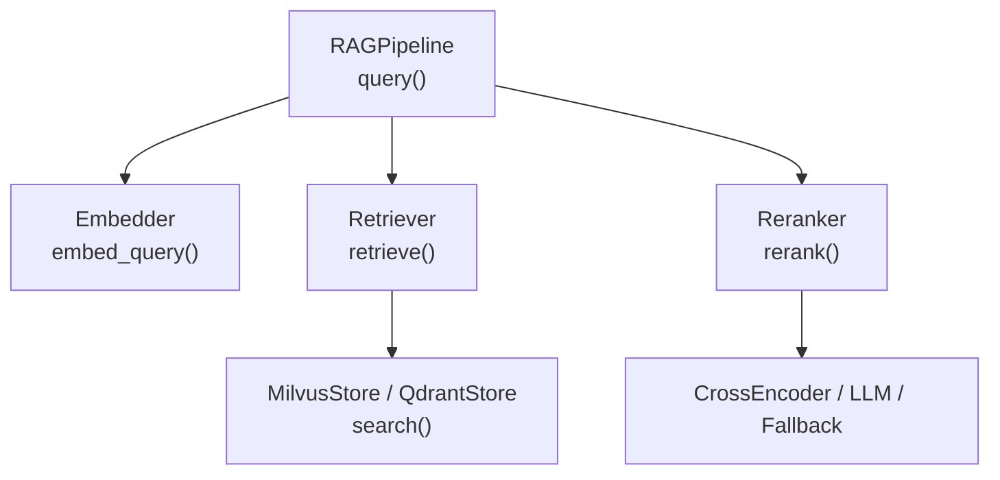
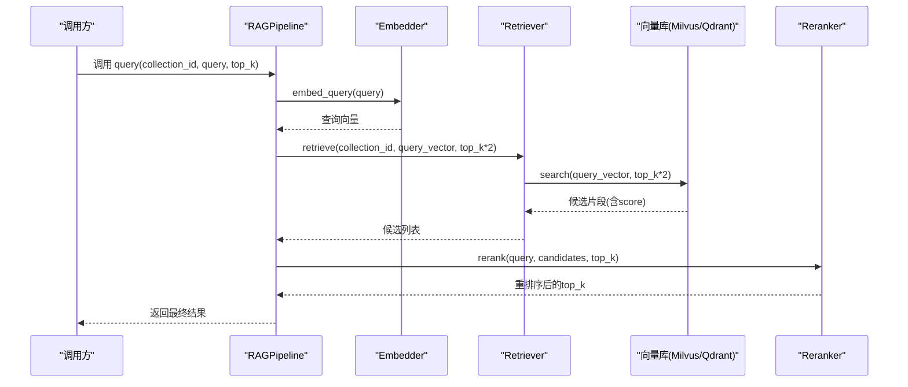
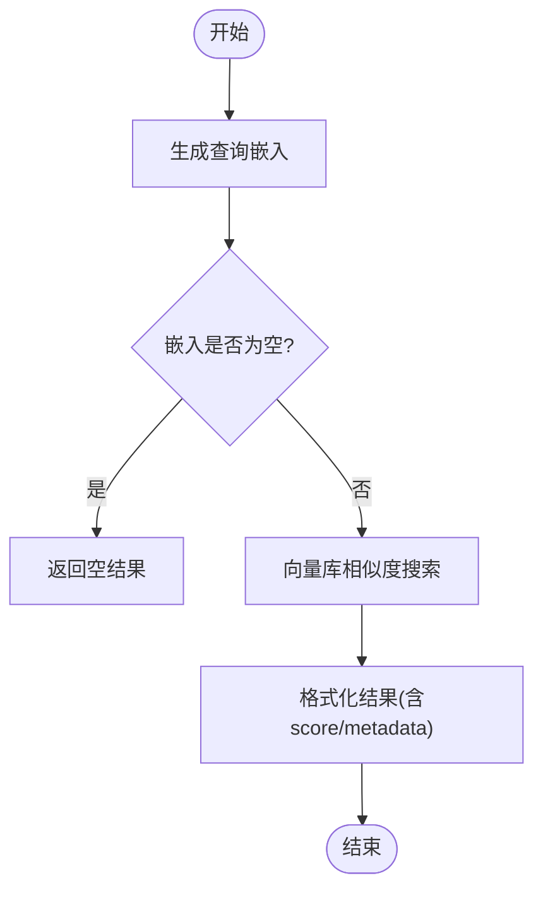
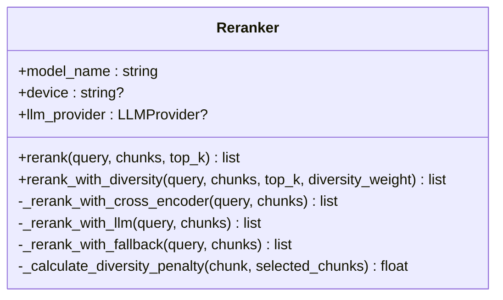
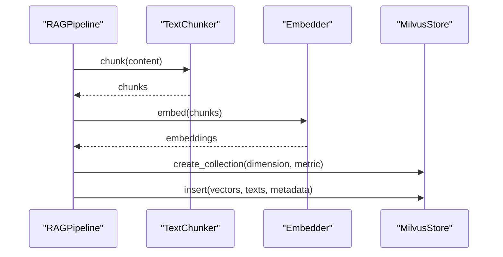
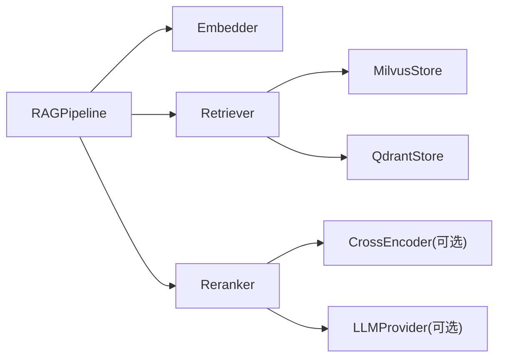

# 检索与重排序

<cite>
**本文引用的文件**
- [pipeline.py](file://python/src/resolveagent/rag/pipeline.py)
- [retriever.py](file://python/src/resolveagent/rag/retrieve/retriever.py)
- [reranker.py](file://python/src/resolveagent/rag/retrieve/reranker.py)
- [embedder.py](file://python/src/resolveagent/rag/ingest/embedder.py)
- [milvus.py](file://python/src/resolveagent/rag/index/milvus.py)
- [qdrant.py](file://python/src/resolveagent/rag/index/qdrant.py)
- [resolveagent.yaml](file://configs/resolveagent.yaml)
</cite>

## 目录
1. [简介](#简介)
2. [项目结构](#项目结构)
3. [核心组件](#核心组件)
4. [架构总览](#架构总览)
5. [详细组件分析](#详细组件分析)
6. [依赖关系分析](#依赖关系分析)
7. [性能考量](#性能考量)
8. [故障排查指南](#故障排查指南)
9. [结论](#结论)
10. [附录](#附录)

## 简介
本技术文档聚焦于检索与重排序模块，系统阐述语义检索的工作原理（查询嵌入生成、向量相似度计算、候选文档检索机制）以及Reranker重排序器的算法实现（交叉编码器、LLM评分、回退策略、多样性优化）。同时提供检索参数调优指南、性能监控方法与常见问题解决方案，并给出基于代码实现的检索效果对比和优化案例。

## 项目结构
检索与重排序能力位于Python RAG子系统中，关键路径如下：
- 管道编排：RAGPipeline 负责端到端流程（嵌入、检索、重排序）
- 检索器：Retriever 抽象向量后端（Milvus/Qdrant），统一检索接口
- 重排序器：Reranker 支持交叉编码器、LLM评分与简单回退策略
- 嵌入器：Embedder 调用外部嵌入API生成向量
- 向量存储：MilvusStore / QdrantStore 提供索引、插入、搜索等能力

图表来源
- [pipeline.py:192-255](file://python/src/resolveagent/rag/pipeline.py#L192-L255)
- [retriever.py:53-143](file://python/src/resolveagent/rag/retrieve/retriever.py#L53-L143)
- [milvus.py:270-341](file://python/src/resolveagent/rag/index/milvus.py#L270-L341)
- [qdrant.py:252-322](file://python/src/resolveagent/rag/index/qdrant.py#L252-L322)
- [reranker.py:97-134](file://python/src/resolveagent/rag/retrieve/reranker.py#L97-L134)
- [embedder.py:121-131](file://python/src/resolveagent/rag/ingest/embedder.py#L121-L131)

章节来源
- [pipeline.py:18-43](file://python/src/resolveagent/rag/pipeline.py#L18-L43)
- [retriever.py:14-51](file://python/src/resolveagent/rag/retrieve/retriever.py#L14-L51)
- [reranker.py:28-60](file://python/src/resolveagent/rag/retrieve/reranker.py#L28-L60)
- [embedder.py:13-49](file://python/src/resolveagent/rag/ingest/embedder.py#L13-L49)
- [milvus.py:29-66](file://python/src/resolveagent/rag/index/milvus.py#L29-L66)
- [qdrant.py:13-49](file://python/src/resolveagent/rag/index/qdrant.py#L13-L49)

## 核心组件
- RAGPipeline：编排“嵌入→检索→重排序”的完整链路，对外暴露 query() 和 ingest()
- Retriever：封装向量库操作，支持 Milvus 与 Qdrant 两种后端，提供 retrieve() 与 retrieve_by_text()
- Reranker：多策略重排序，优先使用交叉编码器，其次LLM评分，最后回退到词频/Jaccard
- Embedder：通过HTTP调用外部嵌入服务，支持批量与单条查询
- MilvusStore / QdrantStore：具体向量库实现，包含集合管理、索引创建、插入、搜索、统计

章节来源
- [pipeline.py:18-43](file://python/src/resolveagent/rag/pipeline.py#L18-L43)
- [retriever.py:14-51](file://python/src/resolveagent/rag/retrieve/retriever.py#L14-L51)
- [reranker.py:28-60](file://python/src/resolveagent/rag/retrieve/reranker.py#L28-L60)
- [embedder.py:13-49](file://python/src/resolveagent/rag/ingest/embedder.py#L13-L49)
- [milvus.py:29-66](file://python/src/resolveagent/rag/index/milvus.py#L29-L66)
- [qdrant.py:13-49](file://python/src/resolveagent/rag/index/qdrant.py#L13-L49)

## 架构总览
下图展示从用户查询到最终结果的完整数据流与控制流，包括嵌入生成、向量检索、重排序与结果返回。

图表来源
- [pipeline.py:192-255](file://python/src/resolveagent/rag/pipeline.py#L192-L255)
- [retriever.py:53-143](file://python/src/resolveagent/rag/retrieve/retriever.py#L53-L143)
- [milvus.py:270-341](file://python/src/resolveagent/rag/index/milvus.py#L270-L341)
- [qdrant.py:252-322](file://python/src/resolveagent/rag/index/qdrant.py#L252-L322)
- [reranker.py:97-134](file://python/src/resolveagent/rag/retrieve/reranker.py#L97-L134)
- [embedder.py:121-131](file://python/src/resolveagent/rag/ingest/embedder.py#L121-L131)

## 详细组件分析

### 语义检索工作原理
- 查询嵌入生成：Embedder.embed_query() 将查询文本转换为向量；若未配置API Key则返回零向量并记录告警日志
- 向量相似度计算：向量库根据配置的度量类型（默认COSINE）计算查询向量与库中向量的相似度
- 候选文档检索机制：Retriever.retrieve() 调用底层向量库的 search()，返回带分数与元数据的候选片段；支持可选的元数据过滤

图表来源
- [embedder.py:121-131](file://python/src/resolveagent/rag/ingest/embedder.py#L121-L131)
- [retriever.py:53-143](file://python/src/resolveagent/rag/retrieve/retriever.py#L53-L143)
- [milvus.py:270-341](file://python/src/resolveagent/rag/index/milvus.py#L270-L341)
- [qdrant.py:252-322](file://python/src/resolveagent/rag/index/qdrant.py#L252-L322)

章节来源
- [embedder.py:50-131](file://python/src/resolveagent/rag/ingest/embedder.py#L50-L131)
- [retriever.py:53-143](file://python/src/resolveagent/rag/retrieve/retriever.py#L53-L143)
- [milvus.py:270-341](file://python/src/resolveagent/rag/index/milvus.py#L270-L341)
- [qdrant.py:252-322](file://python/src/resolveagent/rag/index/qdrant.py#L252-L322)

### Reranker重排序器算法实现
- 交叉编码器策略：优先尝试加载 CrossEncoder（如 bge-reranker-large），对每对(query, chunk)打分，得到 rerank_score；最终 score 为原始向量分与交叉编码器分的加权融合（默认0.3/0.7）
- LLM评分策略：当无交叉编码器时，使用LLM对每个chunk进行相关性评分（0-10归一化至0-1），并与原始分融合（默认0.4/0.6）
- 回退策略：若无可用模型或LLM失败，采用Jaccard相似度与词频统计结合的分值作为回退方案
- 多样性优化：支持 MMR（最大边际相关性）选择，结合相关性得分与内容重复度惩罚，避免冗余结果

图表来源
- [reranker.py:28-60](file://python/src/resolveagent/rag/retrieve/reranker.py#L28-L60)
- [reranker.py:97-134](file://python/src/resolveagent/rag/retrieve/reranker.py#L97-L134)
- [reranker.py:136-188](file://python/src/resolveagent/rag/retrieve/reranker.py#L136-L188)
- [reranker.py:190-270](file://python/src/resolveagent/rag/retrieve/reranker.py#L190-L270)
- [reranker.py:272-319](file://python/src/resolveagent/rag/retrieve/reranker.py#L272-L319)
- [reranker.py:321-405](file://python/src/resolveagent/rag/retrieve/reranker.py#L321-L405)

章节来源
- [reranker.py:97-134](file://python/src/resolveagent/rag/retrieve/reranker.py#L97-L134)
- [reranker.py:136-188](file://python/src/resolveagent/rag/retrieve/reranker.py#L136-L188)
- [reranker.py:190-270](file://python/src/resolveagent/rag/retrieve/reranker.py#L190-L270)
- [reranker.py:272-319](file://python/src/resolveagent/rag/retrieve/reranker.py#L272-L319)
- [reranker.py:321-405](file://python/src/resolveagent/rag/retrieve/reranker.py#L321-L405)

### 管道编排与数据流
- 查询流程：RAGPipeline.query() 先调用 Embedder 生成查询向量，再调用 Retriever 检索候选（top_k*2以留出重排序空间），最后调用 Reranker 重排序并返回top_k
- 索引流程：RAGPipeline.ingest() 将文档切块、生成嵌入、写入向量库，并维护文档元数据与状态

图表来源
- [pipeline.py:44-138](file://python/src/resolveagent/rag/pipeline.py#L44-L138)
- [pipeline.py:140-190](file://python/src/resolveagent/rag/pipeline.py#L140-L190)
- [milvus.py:97-168](file://python/src/resolveagent/rag/index/milvus.py#L97-L168)

章节来源
- [pipeline.py:44-138](file://python/src/resolveagent/rag/pipeline.py#L44-L138)
- [pipeline.py:140-190](file://python/src/resolveagent/rag/pipeline.py#L140-L190)
- [milvus.py:97-168](file://python/src/resolveagent/rag/index/milvus.py#L97-L168)

### 检索参数调优指南
- top_k 设置：检索阶段建议检索 top_k*2 个候选，为重排序留出空间；最终返回 top_k 个结果
- 向量度量类型：默认 COSINE，可根据数据分布与模型特性调整（如 L2/IP）
- 重排序策略选择：
  - 有交叉编码器时优先使用，精度更高但延迟较高
  - 无交叉编码器时使用LLM评分，注意并发与限流
  - 回退策略用于降级保障可用性
- 多样性权重：在 rerank_with_diversity() 中可通过 diversity_weight 调节相关性与多样性的平衡
- 元数据过滤：在检索阶段可传入 filters 限制范围（如按来源、时间等）

章节来源
- [pipeline.py:192-255](file://python/src/resolveagent/rag/pipeline.py#L192-L255)
- [retriever.py:53-143](file://python/src/resolveagent/rag/retrieve/retriever.py#L53-L143)
- [reranker.py:353-405](file://python/src/resolveagent/rag/retrieve/reranker.py#L353-L405)
- [milvus.py:270-341](file://python/src/resolveagent/rag/index/milvus.py#L270-L341)
- [qdrant.py:252-322](file://python/src/resolveagent/rag/index/qdrant.py#L252-L322)

### 性能监控方法
- 日志埋点：各组件均输出关键步骤的日志（如检索完成、重排序完成、错误信息），便于追踪耗时与异常
- 指标采集：平台级遥测配置（telemetry）可开启 metrics_enabled，结合OTLP导出指标
- 向量库统计：通过 get_stats() 获取集合行数、向量数等统计信息，辅助容量与性能评估

章节来源
- [retriever.py:76-112](file://python/src/resolveagent/rag/retrieve/retriever.py#L76-L112)
- [reranker.py:116-134](file://python/src/resolveagent/rag/retrieve/reranker.py#L116-L134)
- [milvus.py:386-408](file://python/src/resolveagent/rag/index/milvus.py#L386-L408)
- [qdrant.py:373-394](file://python/src/resolveagent/rag/index/qdrant.py#L373-L394)
- [resolveagent.yaml:65-70](file://configs/resolveagent.yaml#L65-L70)

### 常见问题解决方案
- 未配置嵌入API Key：Embedder会返回零向量并记录警告，需配置环境变量或显式传入api_key
- 向量库连接失败：检查host/port/认证信息，确保pymilvus或qdrant-client已安装并可连通
- 重排序模型加载失败：自动降级至LLM或回退策略，关注日志中的错误信息
- 检索结果为空：检查collection是否存在、向量维度是否匹配、filters是否正确

章节来源
- [embedder.py:65-68](file://python/src/resolveagent/rag/ingest/embedder.py#L65-L68)
- [milvus.py:67-88](file://python/src/resolveagent/rag/index/milvus.py#L67-L88)
- [qdrant.py:51-78](file://python/src/resolveagent/rag/index/qdrant.py#L51-L78)
- [reranker.py:90-95](file://python/src/resolveagent/rag/retrieve/reranker.py#L90-L95)
- [retriever.py:107-112](file://python/src/resolveagent/rag/retrieve/retriever.py#L107-L112)

## 依赖关系分析
检索与重排序模块的依赖关系如下：
- RAGPipeline 依赖 Embedder、Retriever、Reranker
- Retriever 依赖 MilvusStore 或 QdrantStore
- Reranker 依赖 sentence-transformers（可选）、LLMProvider（可选）
- Embedder 依赖外部嵌入API（DashScope兼容模式）

图表来源
- [pipeline.py:18-43](file://python/src/resolveagent/rag/pipeline.py#L18-L43)
- [retriever.py:14-51](file://python/src/resolveagent/rag/retrieve/retriever.py#L14-L51)
- [reranker.py:14-22](file://python/src/resolveagent/rag/retrieve/reranker.py#L14-L22)
- [embedder.py:13-49](file://python/src/resolveagent/rag/ingest/embedder.py#L13-L49)
- [milvus.py:29-66](file://python/src/resolveagent/rag/index/milvus.py#L29-L66)
- [qdrant.py:13-49](file://python/src/resolveagent/rag/index/qdrant.py#L13-L49)

章节来源
- [pipeline.py:18-43](file://python/src/resolveagent/rag/pipeline.py#L18-L43)
- [retriever.py:14-51](file://python/src/resolveagent/rag/retrieve/retriever.py#L14-L51)
- [reranker.py:14-22](file://python/src/resolveagent/rag/retrieve/reranker.py#L14-L22)
- [embedder.py:13-49](file://python/src/resolveagent/rag/ingest/embedder.py#L13-L49)

## 性能考量
- 嵌入批处理：Embedder 支持 batch_size 控制，合理设置可减少API调用次数与网络开销
- 向量库索引：Milvus 使用 IVF_FLAT 索引，nlist=128 为默认值，可根据数据规模调整以提升检索速度
- 重排序成本：交叉编码器精度高但延迟高，建议在大规模候选集上仅对top_n进行重排序
- 多样性权衡：MMR 的 diversity_weight 越大，结果越多样但可能牺牲部分相关性，需按场景调参
- 监控与告警：启用 telemetry 与 observability_loop，收集关键指标并设置阈值告警

[本节为通用性能讨论，不直接分析具体文件]

## 故障排查指南
- 嵌入失败：检查API Key与base_url，确认网络可达；查看日志中的HTTP状态码与响应体
- 向量库不可用：确认服务地址、端口、认证信息正确；检查客户端库是否安装
- 重排序异常：关注交叉编码器加载失败与LLM调用异常，必要时切换回退策略
- 结果质量不佳：调整top_k、filters、metric_type与重排序策略；考虑引入更多元数据或改进切块策略

章节来源
- [embedder.py:111-119](file://python/src/resolveagent/rag/ingest/embedder.py#L111-L119)
- [milvus.py:67-88](file://python/src/resolveagent/rag/index/milvus.py#L67-L88)
- [qdrant.py:51-78](file://python/src/resolveagent/rag/index/qdrant.py#L51-L78)
- [reranker.py:90-95](file://python/src/resolveagent/rag/retrieve/reranker.py#L90-L95)
- [retriever.py:107-112](file://python/src/resolveagent/rag/retrieve/retriever.py#L107-L112)

## 结论
本模块通过“嵌入→检索→重排序”的三段式架构，实现了高精度、可扩展的语义检索能力。Reranker 的多策略设计兼顾了精度与鲁棒性，配合向量库的高效检索与管道编排，可满足多样化业务需求。通过合理的参数调优与性能监控，可进一步提升检索效果与系统稳定性。

[本节为总结性内容，不直接分析具体文件]

## 附录
- 配置项参考：平台级遥测与反馈循环配置见 resolveagent.yaml
- 测试用例：基础切块逻辑测试见 test_rag_pipeline.py

章节来源
- [resolveagent.yaml:65-156](file://configs/resolveagent.yaml#L65-L156)
- [test_rag_pipeline.py:6-18](file://python/tests/unit/test_rag_pipeline.py#L6-L18)