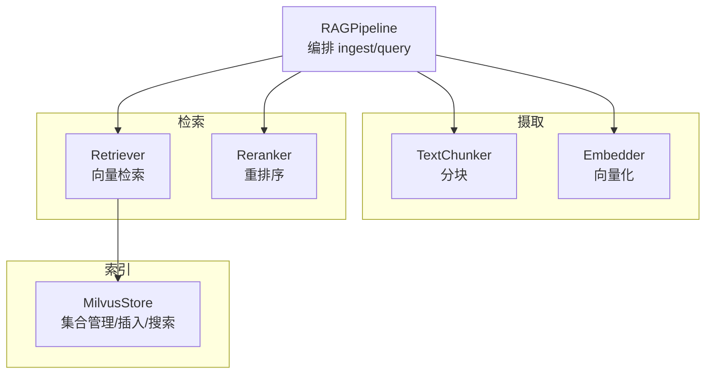
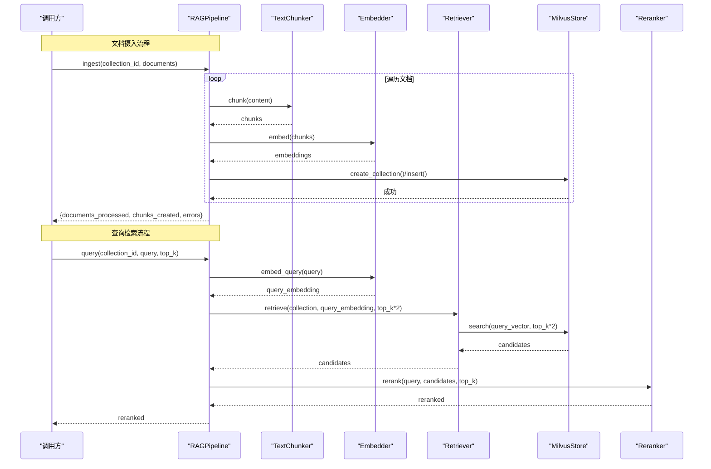
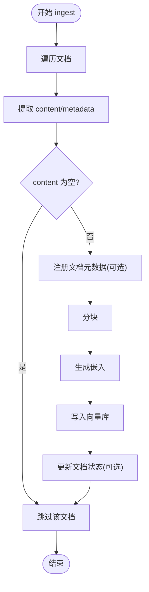
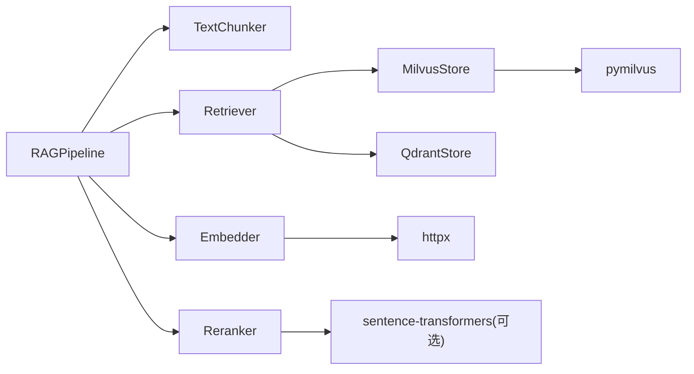

# 管道编排与管理

<cite>
**本文引用的文件**
- [pipeline.py](file://python/src/resolveagent/rag/pipeline.py)
- [milvus.py](file://python/src/resolveagent/rag/index/milvus.py)
- [chunker.py](file://python/src/resolveagent/rag/ingest/chunker.py)
- [embedder.py](file://python/src/resolveagent/rag/ingest/embedder.py)
- [retriever.py](file://python/src/resolveagent/rag/retrieve/retriever.py)
- [reranker.py](file://python/src/resolveagent/rag/retrieve/reranker.py)
- [config.yaml](file://docs/demo/demo/rag/config.yaml)
- [test_rag_pipeline.py](file://python/tests/unit/test_rag_pipeline.py)
</cite>

## 目录
1. [简介](#简介)
2. [项目结构](#项目结构)
3. [核心组件](#核心组件)
4. [架构总览](#架构总览)
5. [详细组件分析](#详细组件分析)
6. [依赖关系分析](#依赖关系分析)
7. [性能考虑](#性能考虑)
8. [故障排除指南](#故障排除指南)
9. [结论](#结论)
10. [附录：API使用示例与最佳实践](#附录api使用示例与最佳实践)

## 简介
本技术文档围绕 RAGPipeline 类，系统阐述其在文档摄取、向量索引、查询检索与结果返回的完整编排流程。内容涵盖初始化配置、异步处理机制、错误处理策略、API 使用示例、性能监控指标以及扩展与自定义的最佳实践建议，帮助读者快速掌握并高效使用该 RAG 管道。

## 项目结构
RAG 相关代码位于 Python 模块中，采用分层组织：
- 摄取（ingest）：文本分块与嵌入生成
- 索引（index）：向量存储后端（Milvus/Qdrant）
- 检索（retrieve）：向量检索与重排序
- 编排（pipeline）：端到端流程编排

图表来源
- [pipeline.py:18-42](file://python/src/resolveagent/rag/pipeline.py#L18-L42)
- [milvus.py:29-168](file://python/src/resolveagent/rag/index/milvus.py#L29-L168)
- [chunker.py:8-50](file://python/src/resolveagent/rag/ingest/chunker.py#L8-L50)
- [embedder.py:13-49](file://python/src/resolveagent/rag/ingest/embedder.py#L13-L49)
- [retriever.py:14-51](file://python/src/resolveagent/rag/retrieve/retriever.py#L14-L51)
- [reranker.py:28-134](file://python/src/resolveagent/rag/retrieve/reranker.py#L28-L134)

章节来源
- [pipeline.py:18-42](file://python/src/resolveagent/rag/pipeline.py#L18-L42)

## 核心组件
- RAGPipeline：端到端编排，负责文档摄取与查询检索的流程控制、日志记录与错误收集。
- TextChunker：多策略文本分块（固定长度、句子、标题等）。
- Embedder：调用外部嵌入服务或本地模型生成向量，支持批量与查询嵌入。
- MilvusStore：向量数据库客户端，提供集合创建、插入、搜索、统计等能力。
- Retriever：封装向量检索逻辑，支持不同后端与过滤条件。
- Reranker：交叉编码器/LLM/回退策略进行二次重排序，提升相关性。

章节来源
- [pipeline.py:18-42](file://python/src/resolveagent/rag/pipeline.py#L18-L42)
- [chunker.py:8-50](file://python/src/resolveagent/rag/ingest/chunker.py#L8-L50)
- [embedder.py:13-49](file://python/src/resolveagent/rag/ingest/embedder.py#L13-L49)
- [milvus.py:29-168](file://python/src/resolveagent/rag/index/milvus.py#L29-L168)
- [retriever.py:14-51](file://python/src/resolveagent/rag/retrieve/retriever.py#L14-L51)
- [reranker.py:28-134](file://python/src/resolveagent/rag/retrieve/reranker.py#L28-L134)

## 架构总览
下图展示从文档摄入到查询检索的完整数据流与控制流。

图表来源
- [pipeline.py:44-138](file://python/src/resolveagent/rag/pipeline.py#L44-L138)
- [pipeline.py:192-254](file://python/src/resolveagent/rag/pipeline.py#L192-L254)
- [milvus.py:97-168](file://python/src/resolveagent/rag/index/milvus.py#L97-L168)
- [milvus.py:207-341](file://python/src/resolveagent/rag/index/milvus.py#L207-L341)
- [retriever.py:53-112](file://python/src/resolveagent/rag/retrieve/retriever.py#L53-L112)
- [reranker.py:97-134](file://python/src/resolveagent/rag/retrieve/reranker.py#L97-L134)

## 详细组件分析

### RAGPipeline：端到端编排
- 职责
  - 文档摄入：解析→分块→嵌入→索引；可选持久化文档元数据与状态更新。
  - 查询检索：嵌入查询→向量检索→重排序→返回结果。
- 关键方法
  - ingest：逐文档处理，统计分块数与错误列表，异步调用嵌入与索引。
  - _index_chunks：连接向量库，确保集合存在并插入向量与元数据。
  - query：生成查询向量，检索候选，执行重排序并返回 Top-K。
- 错误处理
  - 单文档异常捕获并记录，不影响其他文档处理。
  - 向量库操作异常抛出，由上层统一处理。
- 异步机制
  - 使用 async/await 调用嵌入与检索，避免阻塞。

图表来源
- [pipeline.py:44-138](file://python/src/resolveagent/rag/pipeline.py#L44-L138)

章节来源
- [pipeline.py:44-138](file://python/src/resolveagent/rag/pipeline.py#L44-L138)
- [pipeline.py:192-254](file://python/src/resolveagent/rag/pipeline.py#L192-L254)

### TextChunker：文本分块
- 策略
  - fixed：固定长度+重叠
  - sentence：按句子边界合并
  - by_h2/by_h3/by_section：按 Markdown 标题切分，自动合并/拆分以遵守 chunk_size
- 复杂度
  - 时间复杂度 O(n)，空间复杂度 O(n)（n 为文本长度）
- 适用场景
  - 长文档需要保持语义连贯性与可检索性

章节来源
- [chunker.py:8-136](file://python/src/resolveagent/rag/ingest/chunker.py#L8-L136)

### Embedder：向量化
- 功能
  - 批量嵌入与查询嵌入
  - 通过 HTTP 调用外部嵌入服务，支持模型维度映射
  - 无 API Key 时返回零向量（降级）
- 错误处理
  - HTTP 状态码错误抛出运行时异常
  - 网络/解析异常统一捕获并记录
- 性能
  - 支持批处理，减少请求次数

章节来源
- [embedder.py:13-171](file://python/src/resolveagent/rag/ingest/embedder.py#L13-L171)

### MilvusStore：向量存储
- 能力
  - 连接/断开、集合创建（含 schema 与索引）、插入、搜索、删除、统计
  - 集合名规范化，保证命名合法性
- 索引
  - 默认 IVF_FLAT，nlist=128，COSINE 相似度
- 错误处理
  - 未连接时抛异常；具体操作异常记录并抛出

章节来源
- [milvus.py:29-413](file://python/src/resolveagent/rag/index/milvus.py#L29-L413)

### Retriever：向量检索
- 功能
  - 根据后端类型（Milvus/Qdrant）建立连接并执行相似性搜索
  - 支持元数据过滤与度量类型选择
- 错误处理
  - 检索失败抛出运行时异常，包含上下文信息

章节来源
- [retriever.py:14-180](file://python/src/resolveagent/rag/retrieve/retriever.py#L14-L180)

### Reranker：重排序
- 策略优先级
  - 交叉编码器（优先）
  - LLM 评分（可选）
  - 回退策略（词频/Jaccard）
- 多样性增强
  - 提供 MMR 风格的选择，平衡相关性与多样性
- 错误处理
  - 模型加载失败自动回退；LLM 调用失败保留原分数

章节来源
- [reranker.py:28-406](file://python/src/resolveagent/rag/retrieve/reranker.py#L28-L406)

## 依赖关系分析
- RAGPipeline 依赖
  - TextChunker、Embedder、Retriever、Reranker
  - 通过 Retriever 间接依赖 MilvusStore/QdrantStore
- 外部依赖
  - httpx（嵌入服务调用）
  - pymilvus（向量库客户端）
  - sentence-transformers（可选，用于交叉编码器）

图表来源
- [pipeline.py:18-42](file://python/src/resolveagent/rag/pipeline.py#L18-L42)
- [retriever.py:14-51](file://python/src/resolveagent/rag/retrieve/retriever.py#L14-L51)
- [milvus.py:29-89](file://python/src/resolveagent/rag/index/milvus.py#L29-L89)
- [embedder.py:13-49](file://python/src/resolveagent/rag/ingest/embedder.py#L13-L49)
- [reranker.py:14-22](file://python/src/resolveagent/rag/retrieve/reranker.py#L14-L22)

章节来源
- [pipeline.py:18-42](file://python/src/resolveagent/rag/pipeline.py#L18-L42)
- [retriever.py:14-51](file://python/src/resolveagent/rag/retrieve/retriever.py#L14-L51)
- [milvus.py:29-89](file://python/src/resolveagent/rag/index/milvus.py#L29-L89)
- [embedder.py:13-49](file://python/src/resolveagent/rag/ingest/embedder.py#L13-L49)
- [reranker.py:14-22](file://python/src/resolveagent/rag/retrieve/reranker.py#L14-L22)

## 性能考虑
- 分块策略
  - 句子/标题切分有助于保持语义完整性；固定长度适合通用场景
- 嵌入批处理
  - 使用 batch_size 降低网络开销，提高吞吐
- 向量检索
  - 适当增大 top_k 以配合重排序；合理设置相似度阈值
- 重排序
  - 交叉编码器精度高但耗时；在大规模召回后可显著改善精度
- 资源与连接
  - 复用向量库连接；避免频繁 connect/disconnect
- 监控指标建议
  - 摄取：documents_processed、chunks_created、errors
  - 检索：candidates、results、top_k、延迟
  - 重排序：rerank_score 分布、命中率

[本节为通用指导，不直接分析具体文件]

## 故障排除指南
- 无法连接向量库
  - 检查 host/port 与认证信息；确认服务可用
  - 参考连接与集合创建流程定位问题
- 嵌入服务不可用
  - 检查 API Key 与 base_url；关注 HTTP 状态码与响应体
  - 无 Key 时会返回零向量，需配置正确凭据
- 重排序失败
  - 交叉编码器加载失败将自动回退；LLM 调用失败会保留原分数
- 集合名非法
  - 使用内置规范化函数；避免特殊字符与过长名称
- 检索结果为空
  - 检查是否已插入数据；调整 top_k 与相似度阈值

章节来源
- [milvus.py:67-89](file://python/src/resolveagent/rag/index/milvus.py#L67-L89)
- [embedder.py:62-119](file://python/src/resolveagent/rag/ingest/embedder.py#L62-L119)
- [reranker.py:58-95](file://python/src/resolveagent/rag/retrieve/reranker.py#L58-L95)
- [milvus.py:14-26](file://python/src/resolveagent/rag/index/milvus.py#L14-L26)

## 结论
RAGPipeline 提供了清晰、可扩展的 RAG 编排能力，覆盖从文档摄入到查询检索的全链路。通过模块化设计，可在分块、嵌入、检索与重排序各阶段灵活替换与优化。结合合理的配置与监控，可在生产环境中获得稳定且高效的检索增强生成体验。

[本节为总结，不直接分析具体文件]

## 附录：API使用示例与最佳实践

### 初始化与配置
- 基本初始化
  - 指定 embedding_model、vector_backend，可选 rag_document_client
- 配置文件
  - 使用 config.yaml 定义 collection、embedding、chunking、retrieval、sources 等参数

章节来源
- [pipeline.py:30-42](file://python/src/resolveagent/rag/pipeline.py#L30-L42)
- [config.yaml:1-38](file://docs/demo/demo/rag/config.yaml#L1-L38)

### 文档摄入
- 调用 ingest(collection_id, documents)
- 文档结构要求
  - 至少包含 content；metadata 可选（title、source_uri、content_type 等）
- 结果字段
  - documents_processed、chunks_created、errors

章节来源
- [pipeline.py:44-138](file://python/src/resolveagent/rag/pipeline.py#L44-L138)

### 查询检索
- 调用 query(collection_id, query, top_k)
- 返回格式
  - 包含 text、metadata、score、rerank_score 等字段的结果列表

章节来源
- [pipeline.py:192-254](file://python/src/resolveagent/rag/pipeline.py#L192-L254)

### 单元测试参考
- 验证分块策略行为（固定长度、句子切分）

章节来源
- [test_rag_pipeline.py:6-19](file://python/tests/unit/test_rag_pipeline.py#L6-L19)

### 最佳实践建议
- 分块
  - 优先使用句子/标题切分，兼顾可读性与检索效果
- 嵌入
  - 合理设置 batch_size；确保 API Key 有效
- 检索
  - 初始 top_k 可设为期望结果的 2 倍，交由重排序筛选
- 重排序
  - 启用交叉编码器以提升精度；必要时开启多样性选择
- 扩展与自定义
  - 替换 Retriever 后端（Milvus/Qdrant）
  - 自定义分块策略（继承 TextChunker）
  - 接入自有 LLM Provider 进行重排序
  - 集成平台存储以持久化文档元数据与状态

[本节为实践建议，不直接分析具体文件]