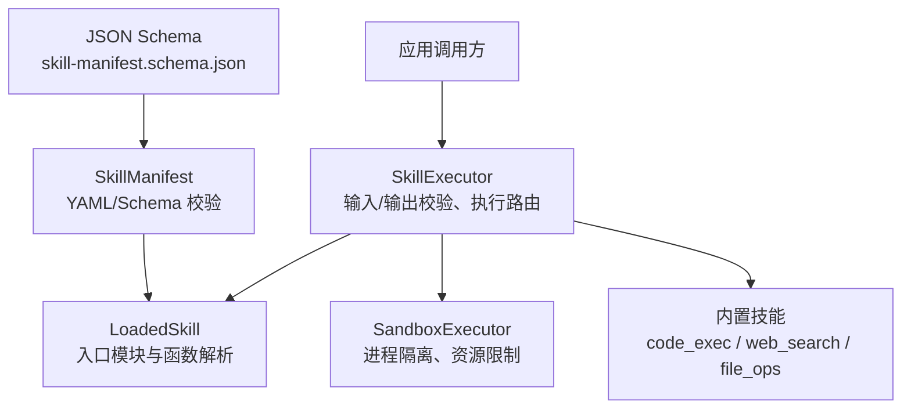
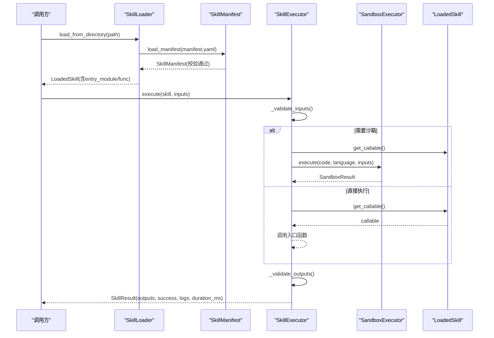
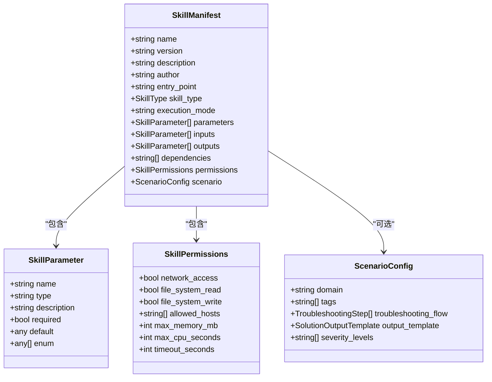
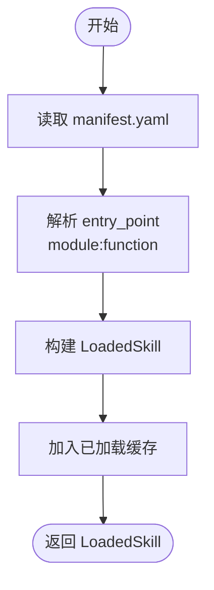
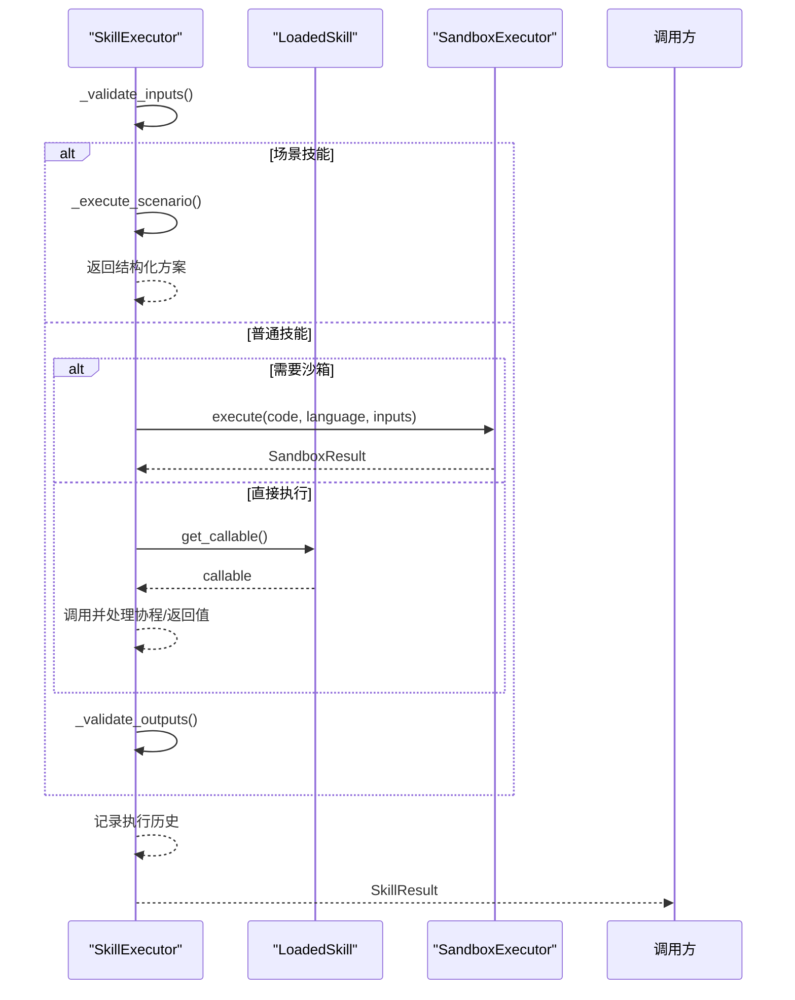
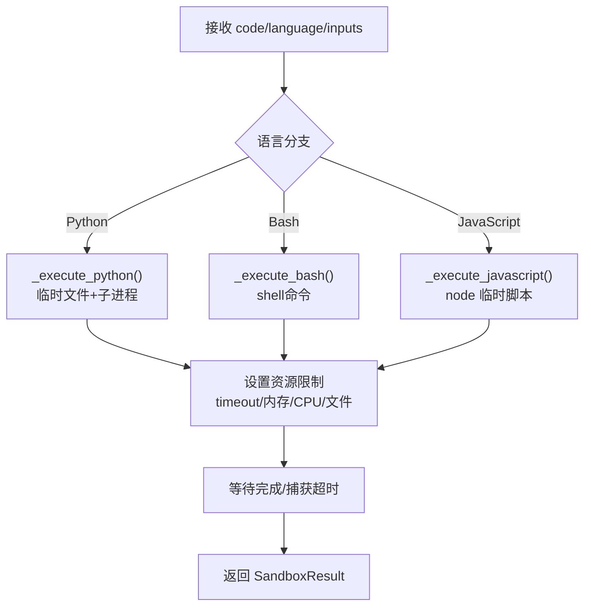
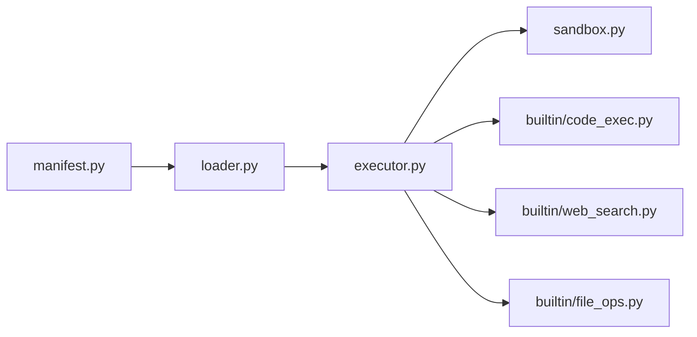

# 专家技能系统

<cite>
**本文引用的文件**
- [loader.py](file://python/src/resolveagent/skills/loader.py)
- [executor.py](file://python/src/resolveagent/skills/executor.py)
- [sandbox.py](file://python/src/resolveagent/skills/sandbox.py)
- [manifest.py](file://python/src/resolveagent/skills/manifest.py)
- [skill-manifest.schema.json](file://api/jsonschema/skill-manifest.schema.json)
- [code_exec.py](file://python/src/resolveagent/skills/builtin/code_exec.py)
- [web_search.py](file://python/src/resolveagent/skills/builtin/web_search.py)
- [file_ops.py](file://python/src/resolveagent/skills/builtin/file_ops.py)
- [hello-world manifest.yaml](file://skills/examples/hello-world/manifest.yaml)
- [hello-world skill.py](file://skills/examples/hello-world/skill.py)
- [skill-example.yaml](file://configs/examples/skill-example.yaml)
- [skill-system.md](file://docs/zh/skill-system.md)
</cite>

## 目录
1. [简介](#简介)
2. [项目结构](#项目结构)
3. [核心组件](#核心组件)
4. [架构总览](#架构总览)
5. [详细组件分析](#详细组件分析)
6. [依赖关系分析](#依赖关系分析)
7. [性能考量](#性能考量)
8. [故障排查指南](#故障排查指南)
9. [结论](#结论)
10. [附录](#附录)

## 简介
本技术文档围绕 ResolveAgent 的插件化“技能（Skill）”体系展开，系统性阐述技能清单（Manifest）、技能加载器（Loader）、执行器（Executor）、沙箱环境（Sandbox）以及内置技能的实现与使用方式。文档面向希望理解或扩展该系统的工程师与使用者，既提供高层架构视图，也深入到关键模块的实现细节、数据流与安全边界。

## 项目结构
ResolveAgent 的技能子系统位于 Python 侧，核心由以下模块组成：
- 清单解析与校验：manifest.py + JSON Schema
- 技能发现与加载：loader.py
- 安全执行与验证：executor.py
- 隔离执行环境：sandbox.py
- 内置能力：builtin/*（代码执行、网络搜索、文件操作等）
- 示例与配置：skills/examples/*、configs/examples/*

图表来源
- [executor.py:20-147](file://python/src/resolveagent/skills/executor.py#L20-L147)
- [loader.py:15-90](file://python/src/resolveagent/skills/loader.py#L15-L90)
- [sandbox.py:76-127](file://python/src/resolveagent/skills/sandbox.py#L76-L127)
- [manifest.py:95-131](file://python/src/resolveagent/skills/manifest.py#L95-L131)
- [skill-manifest.schema.json:1-128](file://api/jsonschema/skill-manifest.schema.json#L1-L128)

章节来源
- [loader.py:15-90](file://python/src/resolveagent/skills/loader.py#L15-L90)
- [executor.py:20-147](file://python/src/resolveagent/skills/executor.py#L20-L147)
- [sandbox.py:76-127](file://python/src/resolveagent/skills/sandbox.py#L76-L127)
- [manifest.py:95-131](file://python/src/resolveagent/skills/manifest.py#L95-L131)
- [skill-manifest.schema.json:1-128](file://api/jsonschema/skill-manifest.schema.json#L1-L128)

## 核心组件
- 技能清单（Skill Manifest）：描述技能元数据、参数定义、权限控制、依赖关系与执行模式；支持通用技能与场景型技能两类。
- 技能加载器（Skill Loader）：从本地目录发现并加载技能，解析 entry_point，缓存已加载技能。
- 技能执行器（Skill Executor）：负责输入/输出校验、按执行模式选择直接执行或沙箱执行、记录执行历史与统计。
- 沙箱执行器（Sandbox Executor）：通过子进程隔离运行代码，设置 CPU/内存/文件/网络等资源限制，支持 Python/Bash/JavaScript。
- 内置技能：代码执行、网络搜索、文件操作等，提供开箱即用的能力。

章节来源
- [manifest.py:16-131](file://python/src/resolveagent/skills/manifest.py#L16-L131)
- [loader.py:15-90](file://python/src/resolveagent/skills/loader.py#L15-L90)
- [executor.py:20-147](file://python/src/resolveagent/skills/executor.py#L20-L147)
- [sandbox.py:76-127](file://python/src/resolveagent/skills/sandbox.py#L76-L127)
- [code_exec.py:16-85](file://python/src/resolveagent/skills/builtin/code_exec.py#L16-L85)
- [web_search.py:32-101](file://python/src/resolveagent/skills/builtin/web_search.py#L32-L101)
- [file_ops.py:21-76](file://python/src/resolveagent/skills/builtin/file_ops.py#L21-L76)

## 架构总览
技能生命周期包括：清单声明与校验 → 加载与注册 → 输入校验 → 执行（直连或沙箱）→ 输出校验 → 结果返回与记录。

图表来源
- [loader.py:27-57](file://python/src/resolveagent/skills/loader.py#L27-L57)
- [manifest.py:119-131](file://python/src/resolveagent/skills/manifest.py#L119-L131)
- [executor.py:52-147](file://python/src/resolveagent/skills/executor.py#L52-L147)
- [sandbox.py:96-127](file://python/src/resolveagent/skills/sandbox.py#L96-L127)

## 详细组件分析

### 技能清单（Skill Manifest）
- 作用：以 YAML 形式声明技能元数据、入口点、输入/输出参数、权限、依赖、执行模式，以及场景型技能的流程配置。
- 关键字段
  - name/version/description/author：基本信息
  - entry_point：模块路径:函数名（如 module:function），默认函数名为 run
  - parameters/inputs/outputs：参数类型、是否必填、枚举、默认值
  - dependencies：外部依赖列表
  - permissions：网络访问、文件系统读写、允许主机、资源上限、超时
  - execution_mode：direct | sandbox | mcp
  - scenario：仅当 skill_type=scenario 时必需，包含领域、标签、排障步骤、输出模板、严重级别等
- 校验机制：Pydantic 模型 + JSON Schema 双重约束，确保清单合法且一致。

图表来源
- [manifest.py:28-116](file://python/src/resolveagent/skills/manifest.py#L28-L116)
- [skill-manifest.schema.json:1-128](file://api/jsonschema/skill-manifest.schema.json#L1-L128)

章节来源
- [manifest.py:16-131](file://python/src/resolveagent/skills/manifest.py#L16-L131)
- [skill-manifest.schema.json:1-128](file://api/jsonschema/skill-manifest.schema.json#L1-L128)

### 技能加载器（Skill Loader）
- 职责：从指定目录读取 manifest.yaml，解析 entry_point，构造 LoadedSkill 并缓存。
- 关键点：
  - 支持从本地目录加载
  - 延迟导入模块：仅在需要时通过 importlib 动态加载入口模块与函数
  - 维护已加载技能集合，便于查询与列举

图表来源
- [loader.py:27-57](file://python/src/resolveagent/skills/loader.py#L27-L57)
- [loader.py:68-90](file://python/src/resolveagent/skills/loader.py#L68-L90)

章节来源
- [loader.py:15-90](file://python/src/resolveagent/skills/loader.py#L15-L90)

### 技能执行器（Skill Executor）
- 职责：统一编排输入校验、执行路由（直接/沙箱/场景）、输出校验、执行记录与统计。
- 关键流程
  - 输入校验：依据清单中的参数定义进行类型、必填、枚举检查
  - 执行模式：根据 manifest.execution_mode 或全局 use_sandbox 决定直连或沙箱
  - 场景技能：通过 TroubleshootingEngine 执行结构化排障流程
  - 输出校验：依据清单中的输出定义进行类型与必填检查
  - 历史记录：保留最近 N 条执行记录，提供成功率、平均耗时等统计

图表来源
- [executor.py:52-147](file://python/src/resolveagent/skills/executor.py#L52-L147)
- [executor.py:246-374](file://python/src/resolveagent/skills/executor.py#L246-L374)

章节来源
- [executor.py:20-147](file://python/src/resolveagent/skills/executor.py#L20-L147)
- [executor.py:246-374](file://python/src/resolveagent/skills/executor.py#L246-L374)

### 沙箱执行环境（Sandbox）
- 目标：为不受信任的代码提供进程级隔离与资源限制，防止滥用与越权。
- 能力
  - 语言支持：Python、Bash、JavaScript（Node.js）
  - 资源限制：CPU 时间、内存、栈大小、文件大小、打开文件数、超时
  - 环境变量白名单：最小化暴露的环境变量，可配置额外变量
  - 错误与超时：捕获异常与超时，返回标准化结果
- 安全增强：SecureSandbox 预留了 chroot/网络命名空间/seccomp-bpf 等扩展点（当前基础版未启用）。

图表来源
- [sandbox.py:96-127](file://python/src/resolveagent/skills/sandbox.py#L96-L127)
- [sandbox.py:129-210](file://python/src/resolveagent/skills/sandbox.py#L129-L210)
- [sandbox.py:211-273](file://python/src/resolveagent/skills/sandbox.py#L211-L273)
- [sandbox.py:275-344](file://python/src/resolveagent/skills/sandbox.py#L275-L344)
- [sandbox.py:346-395](file://python/src/resolveagent/skills/sandbox.py#L346-L395)

章节来源
- [sandbox.py:39-74](file://python/src/resolveagent/skills/sandbox.py#L39-L74)
- [sandbox.py:76-127](file://python/src/resolveagent/skills/sandbox.py#L76-L127)
- [sandbox.py:129-395](file://python/src/resolveagent/skills/sandbox.py#L129-L395)

### 内置技能
- 代码执行（Code Execution）
  - 支持 Python、Bash、JavaScript 的安全执行
  - 提供表达式求值、数学计算、函数调用等便捷方法
  - 通过 SandboxExecutor 限制资源与超时
- 网络搜索（Web Search）
  - 多提供商：Bing、Google Custom Search、Searx、DuckDuckGo
  - 统一 SearchResult 结构，支持格式化输出
  - 通过环境变量注入 API Key/Base URL
- 文件操作（File Ops）
  - 受限路径白名单、最大文件大小限制
  - 支持 read/write/list/delete/exists/mkdir/append
  - 严格的路径校验与异常封装

章节来源
- [code_exec.py:16-85](file://python/src/resolveagent/skills/builtin/code_exec.py#L16-L85)
- [code_exec.py:157-255](file://python/src/resolveagent/skills/builtin/code_exec.py#L157-L255)
- [web_search.py:32-101](file://python/src/resolveagent/skills/builtin/web_search.py#L32-L101)
- [web_search.py:103-305](file://python/src/resolveagent/skills/builtin/web_search.py#L103-L305)
- [file_ops.py:21-76](file://python/src/resolveagent/skills/builtin/file_ops.py#L21-L76)
- [file_ops.py:79-352](file://python/src/resolveagent/skills/builtin/file_ops.py#L79-L352)

### 自定义技能开发指南
- 基本结构
  - manifest.yaml：声明名称、版本、入口点、输入输出、权限、依赖、执行模式
  - skill.py：实现入口函数（默认 run），返回字典形式的输出
- 最佳实践
  - 明确输入输出类型与必填项，避免过度权限
  - 对网络请求设置超时与重试策略
  - 在沙箱模式下尽量无副作用，幂等性优先
  - 使用日志记录关键路径，便于调试
- 调试技巧
  - 使用 CLI 测试技能：传入不同参数观察输出与错误
  - 在沙箱中打印中间结果，结合执行日志定位问题
  - 逐步放宽权限与资源限制，定位瓶颈

章节来源
- [hello-world manifest.yaml:1-21](file://skills/examples/hello-world/manifest.yaml#L1-L21)
- [hello-world skill.py:1-14](file://skills/examples/hello-world/skill.py#L1-L14)
- [skill-example.yaml:1-23](file://configs/examples/skill-example.yaml#L1-L23)
- [skill-system.md:319-523](file://docs/zh/skill-system.md#L319-L523)

## 依赖关系分析
- 模块耦合
  - executor 依赖 loader（LoadedSkill）、manifest（参数/权限/类型）、sandbox（隔离执行）
  - loader 依赖 manifest（清单解析）
  - builtin 技能复用 sandbox（代码执行）与网络库（搜索）
- 外部依赖
  - PyYAML、Pydantic 用于清单解析与校验
  - httpx 用于网络请求
  - Node.js（可选）用于 JavaScript 沙箱执行
- 潜在风险
  - 动态导入需确保模块路径正确
  - 沙箱执行依赖系统资源限制能力（Linux/Unix）
  - 网络搜索依赖第三方服务可用性

图表来源
- [manifest.py:95-131](file://python/src/resolveagent/skills/manifest.py#L95-L131)
- [loader.py:15-90](file://python/src/resolveagent/skills/loader.py#L15-L90)
- [executor.py:20-147](file://python/src/resolveagent/skills/executor.py#L20-L147)
- [sandbox.py:76-127](file://python/src/resolveagent/skills/sandbox.py#L76-L127)
- [code_exec.py:16-85](file://python/src/resolveagent/skills/builtin/code_exec.py#L16-L85)
- [web_search.py:32-101](file://python/src/resolveagent/skills/builtin/web_search.py#L32-L101)
- [file_ops.py:21-76](file://python/src/resolveagent/skills/builtin/file_ops.py#L21-L76)

章节来源
- [executor.py:20-147](file://python/src/resolveagent/skills/executor.py#L20-L147)
- [loader.py:15-90](file://python/src/resolveagent/skills/loader.py#L15-L90)
- [manifest.py:95-131](file://python/src/resolveagent/skills/manifest.py#L95-L131)
- [sandbox.py:76-127](file://python/src/resolveagent/skills/sandbox.py#L76-L127)

## 性能考量
- 执行模式选择
  - direct：适合可信、轻量、无副作用的技能，减少进程开销
  - sandbox：适合不可信或可能消耗资源的技能，增加隔离与限制
- 资源限制
  - 合理设置 timeout_seconds、max_memory_mb、cpu_time_limit，避免长时间占用
- I/O 优化
  - 网络请求使用连接池与超时控制
  - 大文件读写限制大小，避免 OOM
- 缓存与复用
  - 对重复计算结果进行缓存（如搜索结果、解析结果）
  - 复用 HTTP 客户端与数据库连接

[本节为通用指导，不直接分析具体文件]

## 故障排查指南
- 清单校验失败
  - 现象：加载清单时报错或缺少必填字段
  - 排查：核对 manifest.yaml 结构与 schema 要求，确认 name/version/entry_point 必填
  - 参考
    - [manifest.py:112-116](file://python/src/resolveagent/skills/manifest.py#L112-L116)
    - [skill-manifest.schema.json:1-128](file://api/jsonschema/skill-manifest.schema.json#L1-L128)
- 输入/输出校验失败
  - 现象：执行前提示缺少必填参数或类型不符
  - 排查：检查 inputs/outputs 定义与实际传参，修正类型或补充默认值
  - 参考
    - [executor.py:149-202](file://python/src/resolveagent/skills/executor.py#L149-L202)
    - [executor.py:204-244](file://python/src/resolveagent/skills/executor.py#L204-L244)
- 沙箱执行超时或崩溃
  - 现象：执行被终止，返回超时或错误信息
  - 排查：调整 timeout_seconds、max_memory_mb、cpu_time_limit；检查代码是否存在死循环或过大对象
  - 参考
    - [sandbox.py:156-192](file://python/src/resolveagent/skills/sandbox.py#L156-L192)
    - [sandbox.py:234-261](file://python/src/resolveagent/skills/sandbox.py#L234-L261)
    - [sandbox.py:302-329](file://python/src/resolveagent/skills/sandbox.py#L302-L329)
- 网络搜索失败
  - 现象：返回空结果或报错
  - 排查：检查 API Key、Base URL、网络连通性与限流；查看日志中的 provider 与错误信息
  - 参考
    - [web_search.py:61-69](file://python/src/resolveagent/skills/builtin/web_search.py#L61-L69)
    - [web_search.py:103-143](file://python/src/resolveagent/skills/builtin/web_search.py#L103-L143)
    - [web_search.py:145-190](file://python/src/resolveagent/skills/builtin/web_search.py#L145-L190)
    - [web_search.py:192-229](file://python/src/resolveagent/skills/builtin/web_search.py#L192-L229)
    - [web_search.py:231-305](file://python/src/resolveagent/skills/builtin/web_search.py#L231-L305)
- 文件操作权限拒绝
  - 现象：路径不在白名单或超出大小限制
  - 排查：确认 ALLOWED_BASE_DIRS 与 MAX_FILE_SIZE；检查路径拼接与绝对路径转换
  - 参考
    - [file_ops.py:11-18](file://python/src/resolveagent/skills/builtin/file_ops.py#L11-L18)
    - [file_ops.py:79-97](file://python/src/resolveagent/skills/builtin/file_ops.py#L79-L97)
    - [file_ops.py:112-149](file://python/src/resolveagent/skills/builtin/file_ops.py#L112-L149)

章节来源
- [manifest.py:112-116](file://python/src/resolveagent/skills/manifest.py#L112-L116)
- [skill-manifest.schema.json:1-128](file://api/jsonschema/skill-manifest.schema.json#L1-L128)
- [executor.py:149-244](file://python/src/resolveagent/skills/executor.py#L149-L244)
- [sandbox.py:156-192](file://python/src/resolveagent/skills/sandbox.py#L156-L192)
- [sandbox.py:234-261](file://python/src/resolveagent/skills/sandbox.py#L234-L261)
- [sandbox.py:302-329](file://python/src/resolveagent/skills/sandbox.py#L302-L329)
- [web_search.py:61-69](file://python/src/resolveagent/skills/builtin/web_search.py#L61-L69)
- [web_search.py:103-305](file://python/src/resolveagent/skills/builtin/web_search.py#L103-L305)
- [file_ops.py:11-18](file://python/src/resolveagent/skills/builtin/file_ops.py#L11-L18)
- [file_ops.py:79-97](file://python/src/resolveagent/skills/builtin/file_ops.py#L79-L97)
- [file_ops.py:112-149](file://python/src/resolveagent/skills/builtin/file_ops.py#L112-L149)

## 结论
ResolveAgent 的技能系统通过清晰的清单声明、严格的加载与执行流程、以及强大的沙箱隔离机制，实现了安全、可扩展、可组合的能力生态。内置技能覆盖了常见场景，开发者可基于模板快速构建自定义技能，并通过权限与资源限制保障系统稳定性与安全性。建议在生产环境中始终采用沙箱执行模式，并对网络与文件访问实施最小权限原则。

[本节为总结性内容，不直接分析具体文件]

## 附录
- 清单示例与配置参考
  - 示例清单：见 skills/examples/hello-world/manifest.yaml
  - 示例配置：见 configs/examples/skill-example.yaml
  - 中文文档：见 docs/zh/skill-system.md

章节来源
- [hello-world manifest.yaml:1-21](file://skills/examples/hello-world/manifest.yaml#L1-L21)
- [skill-example.yaml:1-23](file://configs/examples/skill-example.yaml#L1-L23)
- [skill-system.md:1-780](file://docs/zh/skill-system.md#L1-L780)