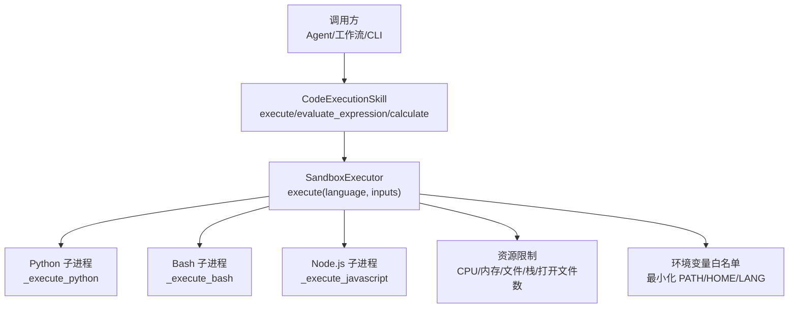
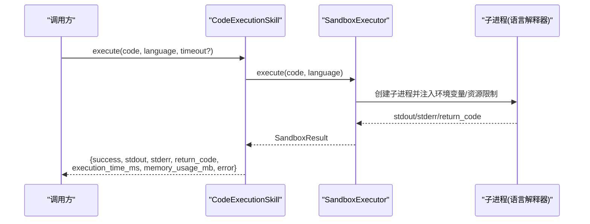
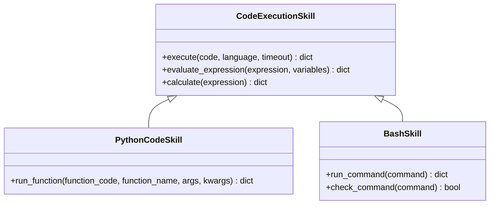
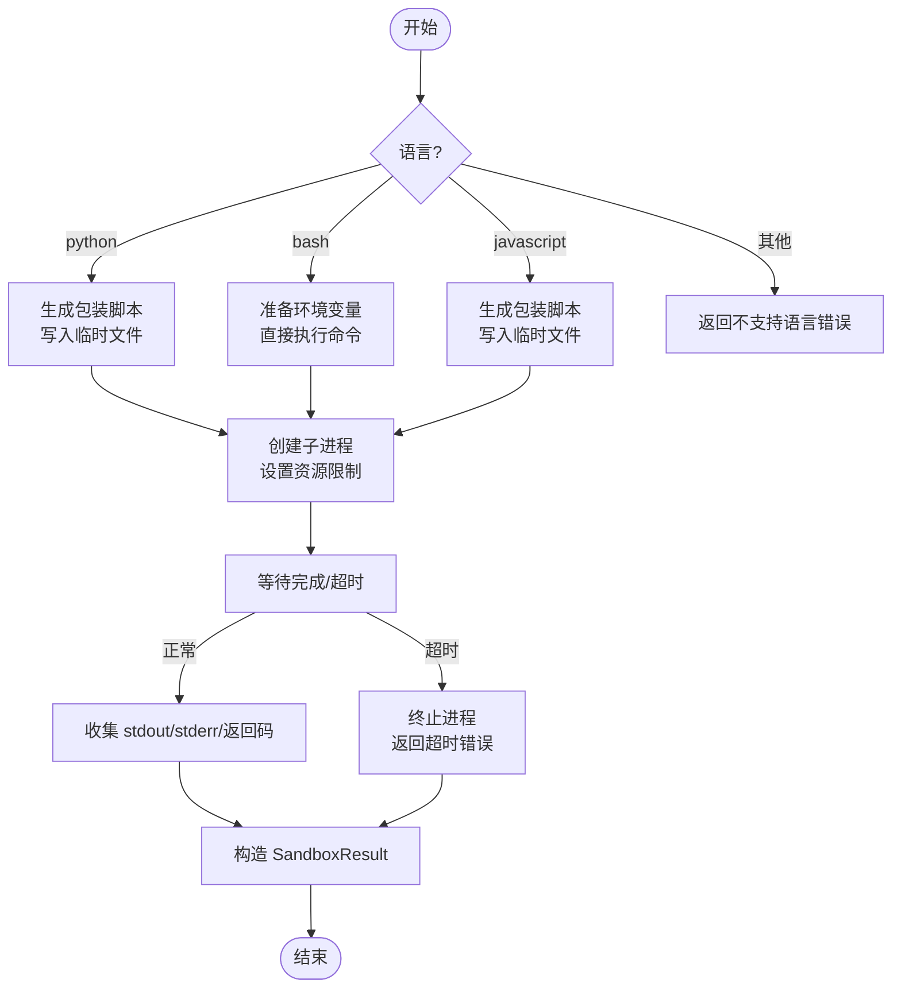
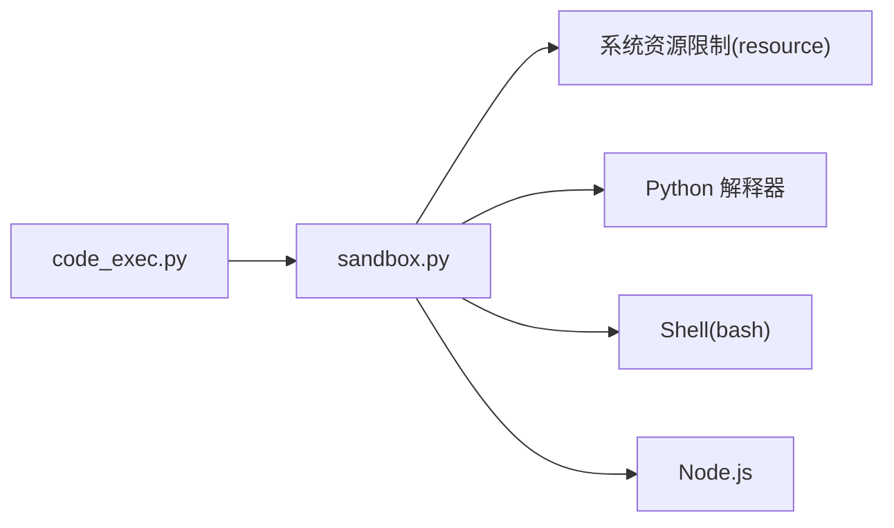

# 代码执行技能

<cite>
**本文引用的文件**
- [python/src/resolveagent/skills/builtin/code_exec.py](file://python/src/resolveagent/skills/builtin/code_exec.py)
- [python/src/resolveagent/skills/sandbox.py](file://python/src/resolveagent/skills/sandbox.py)
- [api/jsonschema/skill-manifest.schema.json](file://api/jsonschema/skill-manifest.schema.json)
- [skills/examples/hello-world/manifest.yaml](file://skills/examples/hello-world/manifest.yaml)
- [skills/examples/hello-world/skill.py](file://skills/examples/hello-world/skill.py)
- [docs/demo/demo/skills/log-analyzer/skill.py](file://docs/demo/demo/skills/log-analyzer/skill.py)
- [docs/demo/demo/skills/metrics-checker/skill.py](file://docs/demo/demo/skills/metrics-checker/skill.py)
- [skills/examples/k8s-pod-crash/skill.py](file://skills/examples/k8s-pod-crash/skill.py)
</cite>

## 目录
1. [简介](#简介)
2. [项目结构](#项目结构)
3. [核心组件](#核心组件)
4. [架构总览](#架构总览)
5. [详细组件分析](#详细组件分析)
6. [依赖关系分析](#依赖关系分析)
7. [性能与资源限制](#性能与资源限制)
8. [故障排查指南](#故障排查指南)
9. [结论](#结论)
10. [附录：API 参考](#附录api-参考)

## 简介
本文件为“代码执行技能”提供完整的功能文档，聚焦于内置的 code_exec.py 实现。内容涵盖支持的编程语言、执行环境配置、沙箱隔离机制、输入输出格式、安全策略（资源限制、时间限制、权限控制）、错误处理机制，以及在 AIOps 场景下的使用示例（诊断脚本与自动化任务）。同时提供完整的 API 参考，包括函数签名、参数类型与返回值格式。

## 项目结构
围绕代码执行能力的相关文件组织如下：
- 代码执行入口与封装：python/src/resolveagent/skills/builtin/code_exec.py
- 沙箱执行器与安全约束：python/src/resolveagent/skills/sandbox.py
- 技能清单规范（权限、超时等）：api/jsonschema/skill-manifest.schema.json
- 示例技能与清单：skills/examples/hello-world/*、docs/demo/demo/skills/*、skills/examples/k8s-pod-crash/skill.py

图表来源
- [python/src/resolveagent/skills/builtin/code_exec.py:16-85](file://python/src/resolveagent/skills/builtin/code_exec.py#L16-L85)
- [python/src/resolveagent/skills/sandbox.py:76-127](file://python/src/resolveagent/skills/sandbox.py#L76-L127)
- [python/src/resolveagent/skills/sandbox.py:129-344](file://python/src/resolveagent/skills/sandbox.py#L129-L344)
- [python/src/resolveagent/skills/sandbox.py:346-395](file://python/src/resolveagent/skills/sandbox.py#L346-L395)

章节来源
- [python/src/resolveagent/skills/builtin/code_exec.py:16-85](file://python/src/resolveagent/skills/builtin/code_exec.py#L16-L85)
- [python/src/resolveagent/skills/sandbox.py:76-127](file://python/src/resolveagent/skills/sandbox.py#L76-L127)

## 核心组件
- CodeExecutionSkill：对外暴露统一接口，支持 Python/Bash/JavaScript 三种语言的安全执行；提供表达式求值与数学计算便捷方法。
- SandboxConfig：定义沙箱的资源限制与环境变量策略。
- SandboxExecutor：基于子进程隔离执行，设置 CPU/内存/文件/栈/打开文件数等系统级限制，并捕获标准输出/错误、返回码、执行时间与内存占用。
- SecureSandbox：扩展的沙箱类（当前回退到基础沙箱），预留 chroot/网络命名空间/seccomp-bpf 等增强能力。

章节来源
- [python/src/resolveagent/skills/builtin/code_exec.py:16-154](file://python/src/resolveagent/skills/builtin/code_exec.py#L16-L154)
- [python/src/resolveagent/skills/sandbox.py:39-74](file://python/src/resolveagent/skills/sandbox.py#L39-L74)
- [python/src/resolveagent/skills/sandbox.py:76-127](file://python/src/resolveagent/skills/sandbox.py#L76-L127)
- [python/src/resolveagent/skills/sandbox.py:439-462](file://python/src/resolveagent/skills/sandbox.py#L439-L462)

## 架构总览
代码执行技能通过“技能层 + 沙箱层”的分层设计，将业务逻辑与执行隔离解耦。调用方仅需传入代码与语言，由沙箱负责在受限环境中运行，并返回结构化结果。

图表来源
- [python/src/resolveagent/skills/builtin/code_exec.py:45-85](file://python/src/resolveagent/skills/builtin/code_exec.py#L45-L85)
- [python/src/resolveagent/skills/sandbox.py:96-127](file://python/src/resolveagent/skills/sandbox.py#L96-L127)
- [python/src/resolveagent/skills/sandbox.py:129-210](file://python/src/resolveagent/skills/sandbox.py#L129-L210)

## 详细组件分析

### 代码执行入口（CodeExecutionSkill）
- 支持语言：Python 3、Bash、JavaScript（Node.js）
- 默认安全策略：进程隔离、CPU 时间限制、内存限制、文件大小限制、可选网络隔离
- 关键方法：
  - execute：通用代码执行，返回统一的结果字典
  - evaluate_expression：在受限 Python 环境中求值表达式
  - calculate：安全的数学表达式计算
  - run_function（PythonCodeSkill）：在沙箱中运行指定函数并传参
  - run_command/check_command（BashSkill）：执行 shell 命令与可用性检查

图表来源
- [python/src/resolveagent/skills/builtin/code_exec.py:16-255](file://python/src/resolveagent/skills/builtin/code_exec.py#L16-L255)

章节来源
- [python/src/resolveagent/skills/builtin/code_exec.py:16-255](file://python/src/resolveagent/skills/builtin/code_exec.py#L16-L255)

### 沙箱执行器（SandboxExecutor）
- 执行流程：根据语言选择对应执行路径，写入临时脚本（Python/JS）或直接执行 Shell 命令
- 资源限制：通过 preexec_fn 设置 CPU 时间、虚拟内存、栈大小、文件大小、打开文件数、禁止 core dump
- 环境变量：默认最小化 PATH/HOME/LANG，支持白名单与额外变量注入
- 超时控制：对子进程通信设置超时，超时时终止进程并返回错误信息
- 结果对象：包含成功标志、标准输出/错误、返回码、执行时间、内存占用、错误消息

图表来源
- [python/src/resolveagent/skills/sandbox.py:96-127](file://python/src/resolveagent/skills/sandbox.py#L96-L127)
- [python/src/resolveagent/skills/sandbox.py:129-210](file://python/src/resolveagent/skills/sandbox.py#L129-L210)
- [python/src/resolveagent/skills/sandbox.py:211-273](file://python/src/resolveagent/skills/sandbox.py#L211-L273)
- [python/src/resolveagent/skills/sandbox.py:275-344](file://python/src/resolveagent/skills/sandbox.py#L275-L344)
- [python/src/resolveagent/skills/sandbox.py:346-395](file://python/src/resolveagent/skills/sandbox.py#L346-L395)

章节来源
- [python/src/resolveagent/skills/sandbox.py:76-127](file://python/src/resolveagent/skills/sandbox.py#L76-L127)
- [python/src/resolveagent/skills/sandbox.py:129-344](file://python/src/resolveagent/skills/sandbox.py#L129-L344)
- [python/src/resolveagent/skills/sandbox.py:346-395](file://python/src/resolveagent/skills/sandbox.py#L346-L395)

### 安全策略与权限控制
- 进程隔离：每个执行均在独立子进程中运行，避免共享状态
- 资源限制：
  - CPU 时间限制：防止无限循环或高负载
  - 内存限制：防止 OOM 影响宿主
  - 文件与栈限制：限制磁盘写入与递归深度
  - 打开文件数限制：防止句柄耗尽
- 网络访问：默认关闭，可通过清单声明开启（需配合运行时策略）
- 环境变量：默认最小化，仅允许白名单变量，降低信息泄露风险
- 清单契约：通过 skill-manifest.schema.json 声明权限、超时、最大内存/CPU 等，作为网关校验与执行约束的依据

章节来源
- [python/src/resolveagent/skills/sandbox.py:39-74](file://python/src/resolveagent/skills/sandbox.py#L39-L74)
- [python/src/resolveagent/skills/sandbox.py:346-395](file://python/src/resolveagent/skills/sandbox.py#L346-L395)
- [api/jsonschema/skill-manifest.schema.json:70-80](file://api/jsonschema/skill-manifest.schema.json#L70-L80)
- [skills/examples/hello-world/manifest.yaml:16-20](file://skills/examples/hello-world/manifest.yaml#L16-L20)

### 输入参数与输出结果
- 输入参数：
  - code：待执行的源代码字符串
  - language：语言标识（python/bash/javascript）
  - timeout：可选覆盖默认超时
  - expression/variables：用于表达式求值
- 输出结果（统一结构）：
  - success：布尔，是否成功
  - stdout/stderr：标准输出/错误文本
  - return_code：进程返回码
  - execution_time_ms：执行耗时（毫秒）
  - memory_usage_mb：子进程最大驻留内存（MB）
  - error：错误描述（失败时）

章节来源
- [python/src/resolveagent/skills/builtin/code_exec.py:45-85](file://python/src/resolveagent/skills/builtin/code_exec.py#L45-L85)
- [python/src/resolveagent/skills/sandbox.py:63-74](file://python/src/resolveagent/skills/sandbox.py#L63-L74)

### AIOps 使用示例
- 日志分析：通过自定义技能读取与分析日志，识别错误模式并给出建议
  - 参考：[docs/demo/demo/skills/log-analyzer/skill.py:90-169](file://docs/demo/demo/skills/log-analyzer/skill.py#L90-L169)
- 指标检查：检查系统指标是否超过阈值，返回趋势与告警信息
  - 参考：[docs/demo/demo/skills/metrics-checker/skill.py:36-76](file://docs/demo/demo/skills/metrics-checker/skill.py#L36-L76)
- Kubernetes Pod CrashLoopBackOff 排查：结构化输出症状、证据、步骤与解决方案
  - 参考：[skills/examples/k8s-pod-crash/skill.py:139-190](file://skills/examples/k8s-pod-crash/skill.py#L139-L190)
- 简单问候技能：演示最小可用技能结构与清单
  - 参考：[skills/examples/hello-world/skill.py:4-13](file://skills/examples/hello-world/skill.py#L4-L13)、[skills/examples/hello-world/manifest.yaml:1-20](file://skills/examples/hello-world/manifest.yaml#L1-L20)

章节来源
- [docs/demo/demo/skills/log-analyzer/skill.py:90-169](file://docs/demo/demo/skills/log-analyzer/skill.py#L90-L169)
- [docs/demo/demo/skills/metrics-checker/skill.py:36-76](file://docs/demo/demo/skills/metrics-checker/skill.py#L36-L76)
- [skills/examples/k8s-pod-crash/skill.py:139-190](file://skills/examples/k8s-pod-crash/skill.py#L139-L190)
- [skills/examples/hello-world/skill.py:4-13](file://skills/examples/hello-world/skill.py#L4-L13)
- [skills/examples/hello-world/manifest.yaml:1-20](file://skills/examples/hello-world/manifest.yaml#L1-L20)

## 依赖关系分析
- 模块耦合：
  - code_exec.py 依赖 sandbox.py 提供的沙箱能力
  - 沙箱层不反向依赖上层技能，保持低耦合
- 外部依赖：
  - Python 子进程：sys.executable
  - Node.js：需要 node 可执行文件存在
  - 操作系统资源限制：resource 模块（Linux/macOS）
- 潜在循环依赖：无
- 集成点：
  - 技能清单（manifest）决定权限与超时，驱动执行策略
  - 事件/日志：通过 logger 记录执行上下文与错误

图表来源
- [python/src/resolveagent/skills/builtin/code_exec.py:11-13](file://python/src/resolveagent/skills/builtin/code_exec.py#L11-L13)
- [python/src/resolveagent/skills/sandbox.py:129-344](file://python/src/resolveagent/skills/sandbox.py#L129-L344)

章节来源
- [python/src/resolveagent/skills/builtin/code_exec.py:11-13](file://python/src/resolveagent/skills/builtin/code_exec.py#L11-L13)
- [python/src/resolveagent/skills/sandbox.py:129-344](file://python/src/resolveagent/skills/sandbox.py#L129-L344)

## 性能与资源限制
- 超时控制：默认 30 秒，可按请求覆盖；超时后强制终止子进程
- CPU 时间限制：通过 RLIMIT_CPU 限制 CPU 时间，避免长时间占用
- 内存限制：RLIMIT_AS 限制虚拟内存，防止内存泄漏导致宿主异常
- 文件与栈限制：RLIMIT_FSIZE/RLIMIT_STACK 限制文件写入与递归深度
- 打开文件数：RLIMIT_NOFILE 限制并发文件句柄
- 内存统计：通过 RUSAGE_CHILDREN 获取子进程最大驻留内存（MB）
- 建议：
  - 合理设置超时与内存上限，结合清单声明
  - 对长耗时任务采用异步队列与重试策略
  - 监控执行时间与内存峰值，优化脚本复杂度

章节来源
- [python/src/resolveagent/skills/sandbox.py:39-74](file://python/src/resolveagent/skills/sandbox.py#L39-L74)
- [python/src/resolveagent/skills/sandbox.py:346-378](file://python/src/resolveagent/skills/sandbox.py#L346-L378)
- [python/src/resolveagent/skills/sandbox.py:26-37](file://python/src/resolveagent/skills/sandbox.py#L26-L37)

## 故障排查指南
- 常见错误：
  - 超时：子进程通信等待超时，返回错误并终止进程
  - 语言不支持：返回不支持语言错误
  - Node.js 缺失：JavaScript 执行时报 FileNotFoundError
  - 资源限制触发：CPU/内存/文件/栈限制被触发，进程异常退出
- 定位方法：
  - 查看 stderr 与 error 字段，确认具体错误原因
  - 检查执行时间与内存占用，评估是否需要放宽限制
  - 验证环境变量白名单与 PATH，确保所需工具可达
- 修复建议：
  - 调整 SandboxConfig 中的超时与资源限制
  - 精简脚本逻辑，减少 I/O 与计算复杂度
  - 在清单中声明必要权限（如网络访问），并确保运行时策略允许

章节来源
- [python/src/resolveagent/skills/sandbox.py:181-192](file://python/src/resolveagent/skills/sandbox.py#L181-L192)
- [python/src/resolveagent/skills/sandbox.py:250-261](file://python/src/resolveagent/skills/sandbox.py#L250-L261)
- [python/src/resolveagent/skills/sandbox.py:318-340](file://python/src/resolveagent/skills/sandbox.py#L318-L340)
- [python/src/resolveagent/skills/sandbox.py:376-378](file://python/src/resolveagent/skills/sandbox.py#L376-L378)

## 结论
代码执行技能通过分层设计与严格的沙箱隔离，提供了安全、可控的多语言执行能力。其统一的输入输出格式、完善的资源限制与环境变量控制，使其适用于 AIOps 中的诊断脚本与自动化任务。结合技能清单的权限声明，可在多租户与生产环境中安全落地。

## 附录：API 参考

### CodeExecutionSkill
- 构造函数
  - __init__(config: SandboxConfig | None = None)
- 方法
  - execute(code: str, language: str = "python", timeout: float | None = None) -> dict[str, Any]
  - evaluate_expression(expression: str, variables: dict[str, Any] | None = None) -> dict[str, Any]
  - calculate(expression: str) -> dict[str, Any]

### PythonCodeSkill
- 构造函数
  - __init__()
- 方法
  - run_function(function_code: str, function_name: str, args: list[Any] | None = None, kwargs: dict[str, Any] | None = None) -> dict[str, Any]

### BashSkill
- 构造函数
  - __init__()
- 方法
  - run_command(command: str) -> dict[str, Any]
  - check_command(command: str) -> bool

### SandboxConfig
- 字段
  - timeout_seconds: float
  - cpu_time_limit: float
  - max_memory_mb: int
  - max_stack_mb: int
  - max_file_size_mb: int
  - max_open_files: int
  - allow_network: bool
  - allowed_env_vars: list[str] | None
  - extra_env_vars: dict[str, str] | None

### SandboxResult
- 字段
  - success: bool
  - stdout: str
  - stderr: str
  - return_code: int | None
  - execution_time_ms: float
  - memory_usage_mb: float
  - error: str | None

章节来源
- [python/src/resolveagent/skills/builtin/code_exec.py:16-292](file://python/src/resolveagent/skills/builtin/code_exec.py#L16-L292)
- [python/src/resolveagent/skills/sandbox.py:39-74](file://python/src/resolveagent/skills/sandbox.py#L39-L74)
- [python/src/resolveagent/skills/sandbox.py:76-127](file://python/src/resolveagent/skills/sandbox.py#L76-L127)