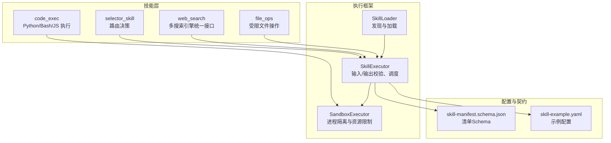
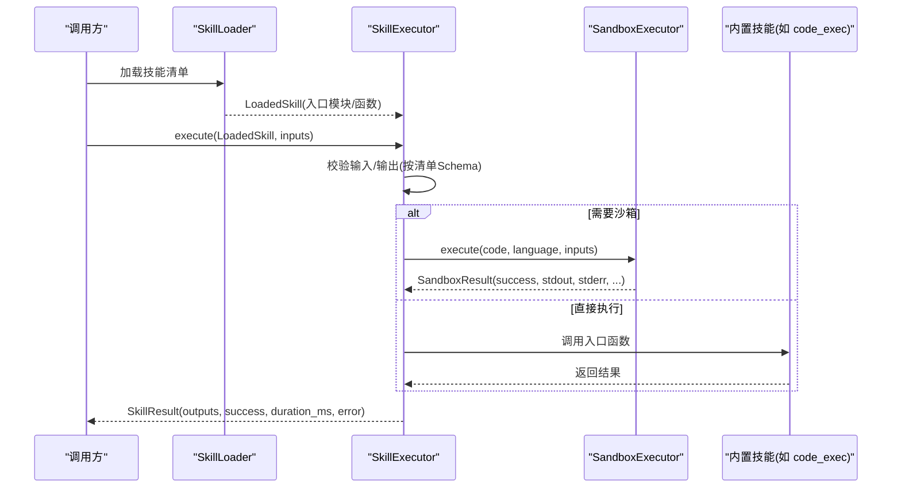
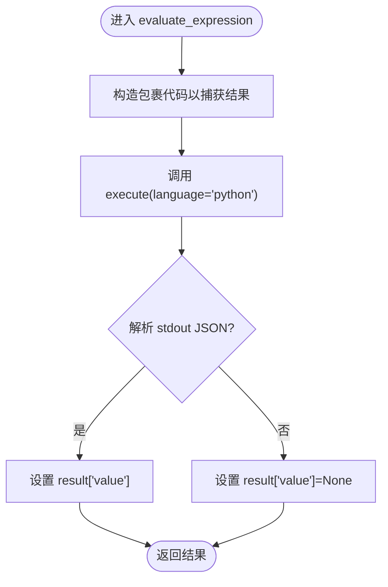
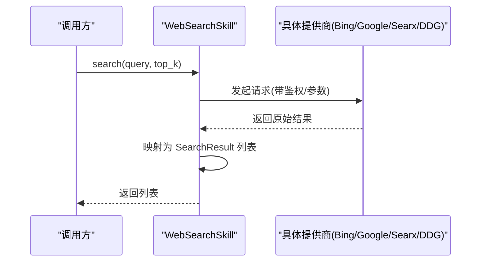
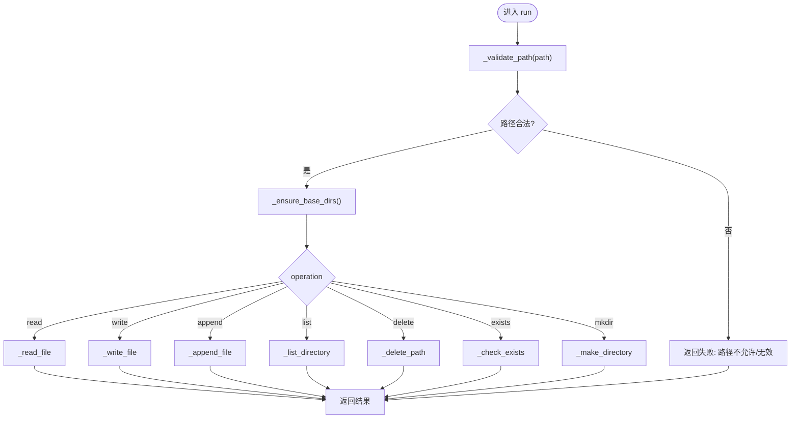
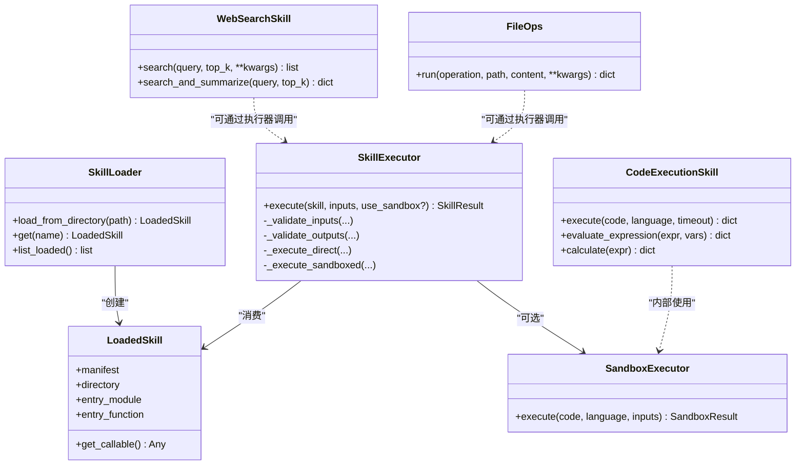

# 内置技能

<cite>
**本文引用的文件**
- [python/src/resolveagent/skills/builtin/code_exec.py](file://python/src/resolveagent/skills/builtin/code_exec.py)
- [python/src/resolveagent/skills/builtin/web_search.py](file://python/src/resolveagent/skills/builtin/web_search.py)
- [python/src/resolveagent/skills/builtin/file_ops.py](file://python/src/resolveagent/skills/builtin/file_ops.py)
- [python/src/resolveagent/skills/builtin/selector_skill.py](file://python/src/resolveagent/skills/builtin/selector_skill.py)
- [python/src/resolveagent/skills/sandbox.py](file://python/src/resolveagent/skills/sandbox.py)
- [python/src/resolveagent/skills/loader.py](file://python/src/resolveagent/skills/loader.py)
- [python/src/resolveagent/skills/executor.py](file://python/src/resolveagent/skills/executor.py)
- [configs/examples/skill-example.yaml](file://configs/examples/skill-example.yaml)
- [api/jsonschema/skill-manifest.schema.json](file://api/jsonschema/skill-manifest.schema.json)
- [skills/examples/hello-world/manifest.yaml](file://skills/examples/hello-world/manifest.yaml)
- [skills/examples/hello-world/skill.py](file://skills/examples/hello-world/skill.py)
</cite>

## 目录
1. [简介](#简介)
2. [项目结构](#项目结构)
3. [核心组件](#核心组件)
4. [架构总览](#架构总览)
5. [详细组件分析](#详细组件分析)
6. [依赖关系分析](#依赖关系分析)
7. [性能考量](#性能考量)
8. [故障排查指南](#故障排查指南)
9. [结论](#结论)
10. [附录](#附录)

## 简介
本参考文档面向 ResolveAgent 的内置技能系统，聚焦以下标准实现：
- 代码执行技能 code_exec：在沙箱中安全执行 Python、Bash、JavaScript 代码，提供表达式求值与函数调用能力。
- 网络搜索技能 web_search：统一封装 Bing、Google、Searx、DuckDuckGo 等搜索后端，支持结果格式化与快速查询。
- 文件操作技能 file_ops：受限路径下的读写、列表、删除、存在性检查与目录创建，具备大小限制与权限校验。
- 选择器技能 selector_skill：将智能选择器作为技能暴露，用于路由决策。

文档涵盖每个技能的功能特性、输入参数、输出格式、使用场景、配置选项（环境变量与运行时参数）、API 参考、最佳实践以及扩展机制与自定义开发指南。

## 项目结构
内置技能位于 Python 模块下，通过统一的加载器与执行器进行发现、验证与执行；底层沙箱提供进程隔离与资源限制；清单 Schema 定义技能的元数据与权限约束。

图表来源
- [python/src/resolveagent/skills/builtin/code_exec.py:16-85](file://python/src/resolveagent/skills/builtin/code_exec.py#L16-L85)
- [python/src/resolveagent/skills/builtin/web_search.py:32-101](file://python/src/resolveagent/skills/builtin/web_search.py#L32-L101)
- [python/src/resolveagent/skills/builtin/file_ops.py:21-76](file://python/src/resolveagent/skills/builtin/file_ops.py#L21-L76)
- [python/src/resolveagent/skills/builtin/selector_skill.py:12-33](file://python/src/resolveagent/skills/builtin/selector_skill.py#L12-L33)
- [python/src/resolveagent/skills/loader.py:15-90](file://python/src/resolveagent/skills/loader.py#L15-L90)
- [python/src/resolveagent/skills/executor.py:20-147](file://python/src/resolveagent/skills/executor.py#L20-L147)
- [python/src/resolveagent/skills/sandbox.py:39-74](file://python/src/resolveagent/skills/sandbox.py#L39-L74)
- [api/jsonschema/skill-manifest.schema.json:1-128](file://api/jsonschema/skill-manifest.schema.json#L1-L128)
- [configs/examples/skill-example.yaml:1-23](file://configs/examples/skill-example.yaml#L1-L23)

章节来源
- [python/src/resolveagent/skills/builtin/code_exec.py:16-85](file://python/src/resolveagent/skills/builtin/code_exec.py#L16-L85)
- [python/src/resolveagent/skills/builtin/web_search.py:32-101](file://python/src/resolveagent/skills/builtin/web_search.py#L32-L101)
- [python/src/resolveagent/skills/builtin/file_ops.py:21-76](file://python/src/resolveagent/skills/builtin/file_ops.py#L21-L76)
- [python/src/resolveagent/skills/builtin/selector_skill.py:12-33](file://python/src/resolveagent/skills/builtin/selector_skill.py#L12-L33)
- [python/src/resolveagent/skills/loader.py:15-90](file://python/src/resolveagent/skills/loader.py#L15-L90)
- [python/src/resolveagent/skills/executor.py:20-147](file://python/src/resolveagent/skills/executor.py#L20-L147)
- [python/src/resolveagent/skills/sandbox.py:39-74](file://python/src/resolveagent/skills/sandbox.py#L39-L74)
- [api/jsonschema/skill-manifest.schema.json:1-128](file://api/jsonschema/skill-manifest.schema.json#L1-L128)
- [configs/examples/skill-example.yaml:1-23](file://configs/examples/skill-example.yaml#L1-L23)

## 核心组件
- 代码执行技能（code_exec）
  - 功能：在沙箱中执行 Python、Bash、JavaScript；提供表达式求值与函数调用便捷方法。
  - 关键类与方法：CodeExecutionSkill.execute、evaluate_expression、calculate；PythonCodeSkill.run_function；BashSkill.run_command、check_command。
  - 安全：进程隔离、CPU/内存/文件大小限制、可选网络隔离。
  - 典型输出：success、stdout、stderr、return_code、execution_time_ms、memory_usage_mb、error、value（针对表达式/计算）。
- 网络搜索技能（web_search）
  - 功能：统一搜索接口，支持 Bing、Google、Searx、DuckDuckGo；提供 search 与 search_and_summarize。
  - 配置：provider、api_key、base_url；环境变量 BING_SEARCH_API_KEY、GOOGLE_SEARCH_API_KEY、GOOGLE_SEARCH_CX、SEARX_URL。
  - 典型输出：SearchResult 列表或格式化摘要。
- 文件操作技能（file_ops）
  - 功能：read、write、append、list、delete、exists、mkdir；路径白名单与大小限制。
  - 安全：仅允许基础目录写入/读取；最大文件大小限制。
  - 典型输出：operation、path、success、message/content/entries/size 等。
- 选择器技能（selector_skill）
  - 功能：将 IntelligentSelector 包装为技能入口，返回路由决策字典。
  - 参数：input_text、agent_id、context、strategy、enrich_context。

章节来源
- [python/src/resolveagent/skills/builtin/code_exec.py:16-292](file://python/src/resolveagent/skills/builtin/code_exec.py#L16-L292)
- [python/src/resolveagent/skills/builtin/web_search.py:22-383](file://python/src/resolveagent/skills/builtin/web_search.py#L22-L383)
- [python/src/resolveagent/skills/builtin/file_ops.py:11-352](file://python/src/resolveagent/skills/builtin/file_ops.py#L11-L352)
- [python/src/resolveagent/skills/builtin/selector_skill.py:12-33](file://python/src/resolveagent/skills/builtin/selector_skill.py#L12-L33)

## 架构总览
技能通过 SkillLoader 发现并加载，由 SkillExecutor 负责输入/输出校验与执行调度；对于需要隔离的代码执行，走 SandboxExecutor 提供的进程级隔离与资源限制。清单 Schema 约束技能元数据与权限。

图表来源
- [python/src/resolveagent/skills/loader.py:15-90](file://python/src/resolveagent/skills/loader.py#L15-L90)
- [python/src/resolveagent/skills/executor.py:52-147](file://python/src/resolveagent/skills/executor.py#L52-L147)
- [python/src/resolveagent/skills/sandbox.py:96-127](file://python/src/resolveagent/skills/sandbox.py#L96-L127)
- [python/src/resolveagent/skills/builtin/code_exec.py:45-85](file://python/src/resolveagent/skills/builtin/code_exec.py#L45-L85)
- [api/jsonschema/skill-manifest.schema.json:1-128](file://api/jsonschema/skill-manifest.schema.json#L1-L128)

## 详细组件分析

### 代码执行技能（code_exec）
- 能力概览
  - 支持语言：Python、Bash、JavaScript。
  - 安全边界：进程隔离、CPU/内存/文件大小限制、可选网络隔离。
  - 便捷方法：表达式求值 evaluate_expression、数学计算 calculate、函数运行 run_function、命令执行 run_command。
- API 参考
  - CodeExecutionSkill.execute(code, language="python", timeout=None) -> dict
    - 必填：code
    - 可选：language（默认 python）、timeout（覆盖默认超时）
    - 输出字段：success、stdout、stderr、return_code、execution_time_ms、memory_usage_mb、error
  - CodeExecutionSkill.evaluate_expression(expression, variables=None) -> dict
    - 输出新增 value 字段
  - CodeExecutionSkill.calculate(expression) -> dict
    - 输出新增 value 字段，错误时 success=false
  - PythonCodeSkill.run_function(function_code, function_name, args=[], kwargs={}) -> dict
    - 输出新增 value 字段
  - BashSkill.run_command(command) -> dict
  - BashSkill.check_command(command) -> bool
- 使用场景
  - 临时脚本执行、数据处理、表达式求值、命令探测。
- 配置与定制
  - 通过 SandboxConfig 设置超时、内存、网络访问等；可在实例化时传入或使用默认值。
- 流程图（表达式求值）

图表来源
- [python/src/resolveagent/skills/builtin/code_exec.py:87-117](file://python/src/resolveagent/skills/builtin/code_exec.py#L87-L117)
- [python/src/resolveagent/skills/sandbox.py:96-127](file://python/src/resolveagent/skills/sandbox.py#L96-L127)

章节来源
- [python/src/resolveagent/skills/builtin/code_exec.py:16-292](file://python/src/resolveagent/skills/builtin/code_exec.py#L16-L292)
- [python/src/resolveagent/skills/sandbox.py:39-74](file://python/src/resolveagent/skills/sandbox.py#L39-L74)

### 网络搜索技能（web_search）
- 能力概览
  - 提供商：Bing、Google、Searx、DuckDuckGo（HTML 抓取回退）。
  - 统一接口：search(query, top_k=5, **kwargs) -> list[SearchResult]
  - 快捷方法：search_and_summarize(query, top_k=5) -> 格式化摘要
- 配置与环境变量
  - provider：搜索后端（默认 duckduckgo）
  - api_key：根据 provider 从环境变量读取
    - BING_SEARCH_API_KEY
    - GOOGLE_SEARCH_API_KEY
    - GOOGLE_SEARCH_CX（Google 引擎 ID）
  - base_url：Searx 实例地址，可来自 SEARX_URL
- 输出模型
  - SearchResult(title, url, snippet, source)
  - 格式化摘要包含 success、query、results、formatted
- 序列图（搜索流程）

图表来源
- [python/src/resolveagent/skills/builtin/web_search.py:71-101](file://python/src/resolveagent/skills/builtin/web_search.py#L71-L101)
- [python/src/resolveagent/skills/builtin/web_search.py:103-305](file://python/src/resolveagent/skills/builtin/web_search.py#L103-L305)

章节来源
- [python/src/resolveagent/skills/builtin/web_search.py:22-383](file://python/src/resolveagent/skills/builtin/web_search.py#L22-L383)

### 文件操作技能（file_ops）
- 能力概览
  - 操作类型：read、write、append、list、delete、exists、mkdir
  - 安全策略：路径白名单（/tmp/resolveagent、~/.resolveagent/workspace），最大文件大小限制（10MB）
- API 参考
  - run(operation, path, content="", **kwargs) -> dict
    - 必填：operation、path
    - 可选：content（写/追加时使用）
    - 输出：operation、path、success、message/content/entries/size 等
- 流程图（路径校验与操作分发）

图表来源
- [python/src/resolveagent/skills/builtin/file_ops.py:21-76](file://python/src/resolveagent/skills/builtin/file_ops.py#L21-L76)
- [python/src/resolveagent/skills/builtin/file_ops.py:79-110](file://python/src/resolveagent/skills/builtin/file_ops.py#L79-L110)

章节来源
- [python/src/resolveagent/skills/builtin/file_ops.py:11-352](file://python/src/resolveagent/skills/builtin/file_ops.py#L11-L352)

### 选择器技能（selector_skill）
- 能力概览
  - 将 IntelligentSelector 作为技能入口，返回路由决策字典。
- API 参考
  - run(input_text, agent_id="", context=None, strategy="hybrid", enrich_context=True) -> dict
- 使用场景
  - 在多 Agent/策略之间进行意图识别与路由。

章节来源
- [python/src/resolveagent/skills/builtin/selector_skill.py:12-33](file://python/src/resolveagent/skills/builtin/selector_skill.py#L12-L33)

## 依赖关系分析
- 技能与执行框架
  - 所有内置技能通过 SkillExecutor 统一执行，支持输入/输出校验与历史记录统计。
  - 代码执行技能依赖 SandboxExecutor 提供进程隔离与资源限制。
- 清单与权限
  - skill-manifest.schema.json 定义了技能元数据、输入输出、权限与场景配置。
  - 示例配置展示如何声明 entry_point、inputs、permissions 等。
- 加载与发现
  - SkillLoader 从本地目录加载 manifest.yaml，解析 entry_point 并缓存 LoadedSkill。

图表来源
- [python/src/resolveagent/skills/loader.py:15-90](file://python/src/resolveagent/skills/loader.py#L15-L90)
- [python/src/resolveagent/skills/executor.py:20-147](file://python/src/resolveagent/skills/executor.py#L20-L147)
- [python/src/resolveagent/skills/sandbox.py:76-127](file://python/src/resolveagent/skills/sandbox.py#L76-L127)
- [python/src/resolveagent/skills/builtin/web_search.py:32-101](file://python/src/resolveagent/skills/builtin/web_search.py#L32-L101)
- [python/src/resolveagent/skills/builtin/code_exec.py:16-85](file://python/src/resolveagent/skills/builtin/code_exec.py#L16-L85)
- [python/src/resolveagent/skills/builtin/file_ops.py:21-76](file://python/src/resolveagent/skills/builtin/file_ops.py#L21-L76)

章节来源
- [python/src/resolveagent/skills/loader.py:15-90](file://python/src/resolveagent/skills/loader.py#L15-L90)
- [python/src/resolveagent/skills/executor.py:20-147](file://python/src/resolveagent/skills/executor.py#L20-L147)
- [python/src/resolveagent/skills/sandbox.py:76-127](file://python/src/resolveagent/skills/sandbox.py#L76-L127)
- [api/jsonschema/skill-manifest.schema.json:1-128](file://api/jsonschema/skill-manifest.schema.json#L1-L128)
- [configs/examples/skill-example.yaml:1-23](file://configs/examples/skill-example.yaml#L1-L23)

## 性能考量
- 代码执行
  - 沙箱超时与 CPU/内存限制避免长时间占用；建议合理设置 timeout_seconds、max_memory_mb。
  - JavaScript 执行依赖 Node.js 环境；缺失时会返回错误。
- 网络搜索
  - 各提供商请求超时默认 30s；可根据网络状况调整；DuckDuckGo 回退可能较慢。
- 文件操作
  - 大文件读取/写入受 MAX_FILE_SIZE 限制；批量操作建议分片处理。
- 执行器统计
  - SkillExecutor 维护最近 1000 条执行记录，可用于成功率与平均耗时统计。

## 故障排查指南
- 代码执行失败
  - 检查 sandbox 超时与内存限制是否过低；查看 stderr 与 return_code。
  - JavaScript 执行需确保 Node.js 可用。
- 网络搜索无结果
  - 确认 provider 与 api_key 配置正确；Google 需设置 GOOGLE_SEARCH_CX；Searx 需配置 SEARX_URL。
  - DuckDuckGo 回退依赖 beautifulsoup4；未安装将无法解析 HTML。
- 文件操作被拒绝
  - 路径不在允许的基础目录内会被拒绝；检查相对路径解析与绝对路径转换。
  - 写入内容过大将被拒绝；注意 MAX_FILE_SIZE。
- 输入/输出校验失败
  - 依据清单 Schema 检查参数类型、必填项与枚举值；未知参数会记录警告。

章节来源
- [python/src/resolveagent/skills/sandbox.py:129-344](file://python/src/resolveagent/skills/sandbox.py#L129-L344)
- [python/src/resolveagent/skills/builtin/web_search.py:103-305](file://python/src/resolveagent/skills/builtin/web_search.py#L103-L305)
- [python/src/resolveagent/skills/builtin/file_ops.py:79-110](file://python/src/resolveagent/skills/builtin/file_ops.py#L79-L110)
- [python/src/resolveagent/skills/executor.py:149-244](file://python/src/resolveagent/skills/executor.py#L149-L244)

## 结论
ResolveAgent 的内置技能提供了安全、可扩展的能力集：代码执行、网络搜索、文件操作与选择器路由。通过统一的加载与执行框架、严格的清单 Schema 与沙箱隔离，既保证了安全性，又便于扩展与定制。建议在业务场景中结合清单权限与运行时参数，按需启用网络访问、调整超时与内存限制，以获得稳定高效的执行体验。

## 附录

### API 参考速查
- 代码执行
  - CodeExecutionSkill.execute(code, language="python", timeout=None)
  - CodeExecutionSkill.evaluate_expression(expression, variables=None)
  - CodeExecutionSkill.calculate(expression)
  - PythonCodeSkill.run_function(function_code, function_name, args=[], kwargs={})
  - BashSkill.run_command(command), check_command(command)
- 网络搜索
  - WebSearchSkill.search(query, top_k=5, **kwargs)
  - WebSearchSkill.search_and_summarize(query, top_k=5)
- 文件操作
  - file_ops.run(operation, path, content="", **kwargs)
- 选择器
  - selector_skill.run(input_text, agent_id="", context=None, strategy="hybrid", enrich_context=True)

章节来源
- [python/src/resolveagent/skills/builtin/code_exec.py:45-255](file://python/src/resolveagent/skills/builtin/code_exec.py#L45-L255)
- [python/src/resolveagent/skills/builtin/web_search.py:71-351](file://python/src/resolveagent/skills/builtin/web_search.py#L71-L351)
- [python/src/resolveagent/skills/builtin/file_ops.py:21-76](file://python/src/resolveagent/skills/builtin/file_ops.py#L21-L76)
- [python/src/resolveagent/skills/builtin/selector_skill.py:12-33](file://python/src/resolveagent/skills/builtin/selector_skill.py#L12-L33)

### 清单与权限配置
- 清单字段
  - name、version、description、author、entry_point、inputs、outputs、dependencies、permissions、skill_type、scenario
- 权限字段
  - network_access、file_system_read、file_system_write、allowed_hosts、max_memory_mb、max_cpu_seconds、timeout_seconds
- 示例
  - 参见示例清单与示例技能清单

章节来源
- [api/jsonschema/skill-manifest.schema.json:1-128](file://api/jsonschema/skill-manifest.schema.json#L1-L128)
- [configs/examples/skill-example.yaml:1-23](file://configs/examples/skill-example.yaml#L1-L23)
- [skills/examples/hello-world/manifest.yaml:1-21](file://skills/examples/hello-world/manifest.yaml#L1-L21)

### 环境与运行时配置
- 环境变量
  - BING_SEARCH_API_KEY、GOOGLE_SEARCH_API_KEY、GOOGLE_SEARCH_CX、SEARX_URL
- 运行时参数
  - 通过 SandboxConfig 设置超时、内存、网络访问等；SkillExecutor 支持 use_sandbox 开关与执行历史统计。

章节来源
- [python/src/resolveagent/skills/builtin/web_search.py:61-69](file://python/src/resolveagent/skills/builtin/web_search.py#L61-L69)
- [python/src/resolveagent/skills/sandbox.py:39-61](file://python/src/resolveagent/skills/sandbox.py#L39-L61)
- [python/src/resolveagent/skills/executor.py:36-50](file://python/src/resolveagent/skills/executor.py#L36-L50)

### 实际使用示例与最佳实践
- 代码执行
  - 使用 evaluate_expression 进行表达式求值；使用 calculate 进行数学计算；使用 run_function 调用指定函数。
  - 最佳实践：为长任务设置更长超时；对敏感环境关闭网络访问。
- 网络搜索
  - 优先配置官方 API（Bing/Google）以获得稳定结果；Searx 适合私有化部署；DuckDuckGo 作为无需密钥的回退。
  - 最佳实践：限制 top_k，避免过多结果；对第三方库缺失做兼容处理。
- 文件操作
  - 始终使用相对路径或明确的基础目录；控制写入内容大小；批量操作时分片。
  - 最佳实践：先 exists 再 read/write；删除前确认路径类型。
- 选择器
  - 根据业务场景选择合适的 strategy（如 hybrid）；必要时开启 enrich_context 增强上下文。

章节来源
- [python/src/resolveagent/skills/builtin/code_exec.py:87-255](file://python/src/resolveagent/skills/builtin/code_exec.py#L87-L255)
- [python/src/resolveagent/skills/builtin/web_search.py:71-351](file://python/src/resolveagent/skills/builtin/web_search.py#L71-L351)
- [python/src/resolveagent/skills/builtin/file_ops.py:21-352](file://python/src/resolveagent/skills/builtin/file_ops.py#L21-L352)
- [python/src/resolveagent/skills/builtin/selector_skill.py:12-33](file://python/src/resolveagent/skills/builtin/selector_skill.py#L12-L33)

### 扩展机制与自定义开发指南
- 自定义技能结构
  - 目录包含 manifest.yaml 与入口模块（如 skill.py），manifest 中声明 entry_point、inputs、outputs、permissions。
- 加载与执行
  - 使用 SkillLoader 从本地目录加载；通过 SkillExecutor 执行，支持沙箱或直接模式。
- 清单 Schema 约束
  - 遵循 schema 定义的类型、必填项与权限；可使用 scenario 配置复杂工作流。
- 示例参考
  - hello-world 示例展示了最小化的技能结构与入口函数。

章节来源
- [python/src/resolveagent/skills/loader.py:15-90](file://python/src/resolveagent/skills/loader.py#L15-L90)
- [python/src/resolveagent/skills/executor.py:52-147](file://python/src/resolveagent/skills/executor.py#L52-L147)
- [api/jsonschema/skill-manifest.schema.json:1-128](file://api/jsonschema/skill-manifest.schema.json#L1-L128)
- [skills/examples/hello-world/manifest.yaml:1-21](file://skills/examples/hello-world/manifest.yaml#L1-L21)
- [skills/examples/hello-world/skill.py:1-14](file://skills/examples/hello-world/skill.py#L1-L14)