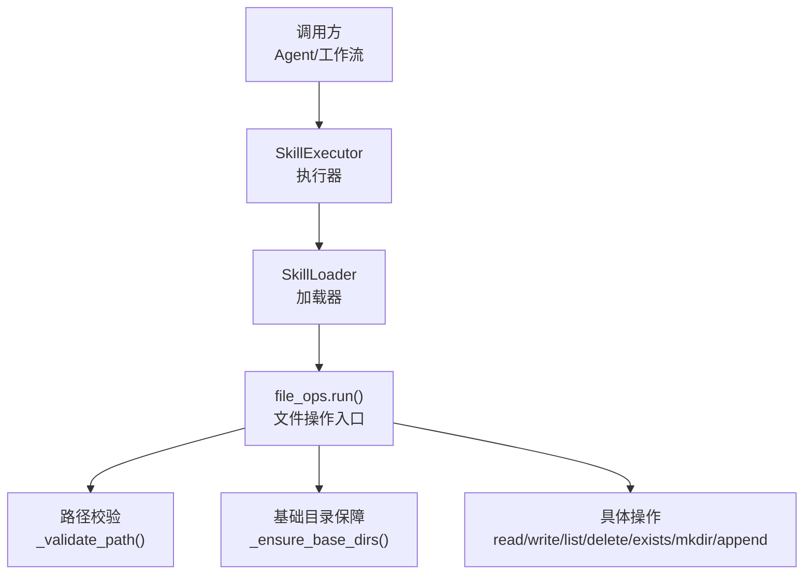
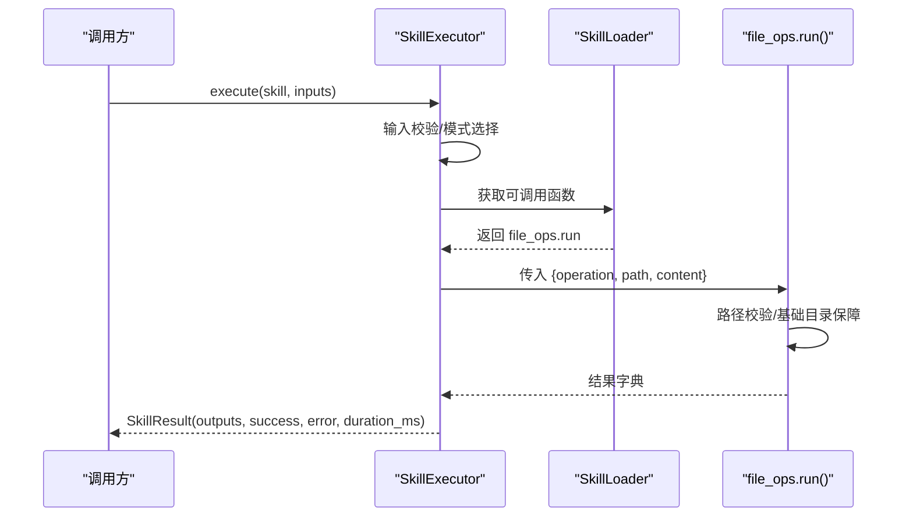
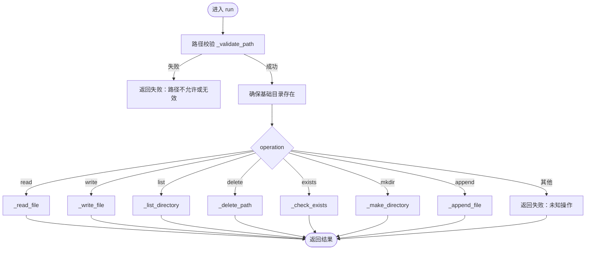
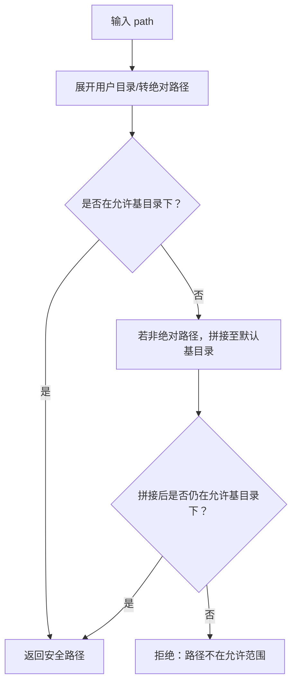
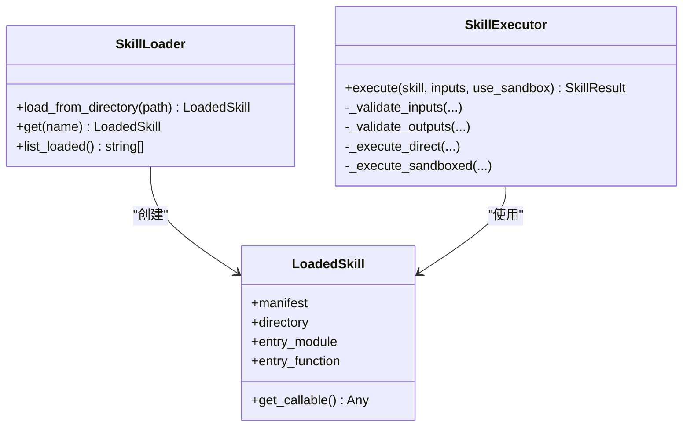
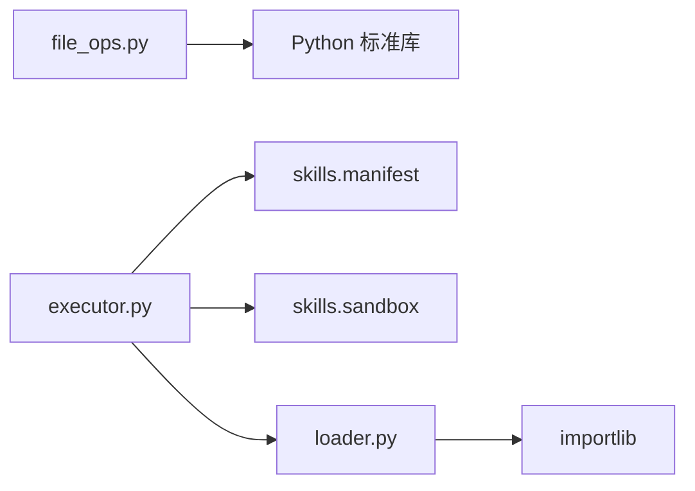

# 文件操作技能

<cite>
**本文引用的文件**
- [file_ops.py](file://python/src/resolveagent/skills/builtin/file_ops.py)
- [executor.py](file://python/src/resolveagent/skills/executor.py)
- [loader.py](file://python/src/resolveagent/skills/loader.py)
- [skill-system.md](file://docs/zh/skill-system.md)
</cite>

## 目录
1. [简介](#简介)
2. [项目结构](#项目结构)
3. [核心组件](#核心组件)
4. [架构总览](#架构总览)
5. [详细组件分析](#详细组件分析)
6. [依赖关系分析](#依赖关系分析)
7. [性能与并发](#性能与并发)
8. [故障排查指南](#故障排查指南)
9. [结论](#结论)
10. [附录：API 参考与示例](#附录api-参考与示例)

## 简介
本文件为“文件操作技能”的完整功能文档，聚焦于内置文件操作能力（读写、目录管理、存在性检查、删除、追加等），并说明其在 ResolveAgent 技能系统中的加载、执行与安全机制。文档覆盖：
- API 接口与参数/返回值规范
- 路径验证、权限控制与恶意文件防护策略
- 运维场景下的使用示例
- 性能优化与并发处理建议
- 常见问题与排错方法

## 项目结构
文件操作技能以 Python 模块形式提供，并通过技能系统统一加载和执行。关键位置如下：
- 文件操作实现：python/src/resolveagent/skills/builtin/file_ops.py
- 技能执行器（含沙箱与输入输出校验）：python/src/resolveagent/skills/executor.py
- 技能发现与加载：python/src/resolveagent/skills/loader.py
- 技能清单与权限模型参考：docs/zh/skill-system.md

图表来源
- [executor.py:52-147](file://python/src/resolveagent/skills/executor.py#L52-L147)
- [loader.py:27-57](file://python/src/resolveagent/skills/loader.py#L27-L57)
- [file_ops.py:21-76](file://python/src/resolveagent/skills/builtin/file_ops.py#L21-L76)

章节来源
- [file_ops.py:1-352](file://python/src/resolveagent/skills/builtin/file_ops.py#L1-L352)
- [executor.py:1-477](file://python/src/resolveagent/skills/executor.py#L1-L477)
- [loader.py:1-90](file://python/src/resolveagent/skills/loader.py#L1-L90)
- [skill-system.md:44-108](file://docs/zh/skill-system.md#L44-L108)

## 核心组件
- 文件操作入口 run(operation, path, content="", **kwargs)
  - 支持操作：read、write、list、delete、exists、mkdir、append
  - 统一返回结构：包含 operation、path、success、message（及操作相关字段）
- 路径校验 _validate_path(path)
  - 限制在允许的基础目录内，拒绝越界路径
- 基础目录保障 _ensure_base_dirs()
  - 自动创建允许的根目录，确保后续操作可用
- 具体操作实现
  - read：读取文件内容，带大小限制
  - write：写入文件，自动创建父目录，带大小限制
  - append：追加内容，带大小限制
  - list：列出目录条目，区分文件/目录，附带文件大小
  - delete：删除文件或目录
  - exists：检查路径是否存在，并返回类型和大小（如适用）
  - mkdir：创建目录

章节来源
- [file_ops.py:21-76](file://python/src/resolveagent/skills/builtin/file_ops.py#L21-L76)
- [file_ops.py:79-97](file://python/src/resolveagent/skills/builtin/file_ops.py#L79-L97)
- [file_ops.py:100-110](file://python/src/resolveagent/skills/builtin/file_ops.py#L100-L110)
- [file_ops.py:112-352](file://python/src/resolveagent/skills/builtin/file_ops.py#L112-L352)

## 架构总览
文件操作技能通过 SkillExecutor 统一调度，支持直接执行或沙箱执行；内部对路径进行严格校验，并在受限目录内进行文件系统操作，避免任意路径访问风险。

图表来源
- [executor.py:52-147](file://python/src/resolveagent/skills/executor.py#L52-L147)
- [loader.py:27-57](file://python/src/resolveagent/skills/loader.py#L27-L57)
- [file_ops.py:21-76](file://python/src/resolveagent/skills/builtin/file_ops.py#L21-L76)

## 详细组件分析

### 文件操作入口与路由
- 入口函数 run 接收 operation、path、content 等参数，根据 operation 分发到对应实现
- 所有异常被捕获并记录日志，统一返回失败结构与错误信息
- 支持未知操作的快速失败

图表来源
- [file_ops.py:21-76](file://python/src/resolveagent/skills/builtin/file_ops.py#L21-L76)
- [file_ops.py:112-352](file://python/src/resolveagent/skills/builtin/file_ops.py#L112-L352)

章节来源
- [file_ops.py:21-76](file://python/src/resolveagent/skills/builtin/file_ops.py#L21-L76)

### 路径验证与安全边界
- 仅允许在配置的基础目录集合内操作，防止越权访问
- 支持用户主目录展开与相对路径拼接，最终均转为绝对路径校验
- 非绝对路径会默认拼接至首个允许的基础目录，再行校验

图表来源
- [file_ops.py:79-97](file://python/src/resolveagent/skills/builtin/file_ops.py#L79-L97)

章节来源
- [file_ops.py:79-97](file://python/src/resolveagent/skills/builtin/file_ops.py#L79-L97)

### 目录与文件操作实现要点
- read：检查是否为文件、大小限制（最大 10MB）、UTF-8 编码读取
- write：自动创建父目录、大小限制、UTF-8 编码写入
- append：先估算追加后大小，避免超限；追加写入
- list：列出目录项，区分文件/目录，文件附带 size
- delete：判断文件/目录分别删除；不存在时返回失败
- exists：返回是否存在、类型、文件大小（如为文件）
- mkdir：若已存在则失败；否则创建目录

章节来源
- [file_ops.py:112-352](file://python/src/resolveagent/skills/builtin/file_ops.py#L112-L352)

### 技能加载与执行流程
- SkillLoader 从 manifest.yaml 解析 entry_point，动态导入模块并缓存可调用对象
- SkillExecutor 负责输入/输出校验、执行模式选择（直接/沙箱）、执行计时与历史记录
- 对于文件操作技能，通常采用直接执行模式（受限于路径白名单）

图表来源
- [loader.py:15-90](file://python/src/resolveagent/skills/loader.py#L15-L90)
- [executor.py:20-147](file://python/src/resolveagent/skills/executor.py#L20-L147)

章节来源
- [loader.py:15-90](file://python/src/resolveagent/skills/loader.py#L15-L90)
- [executor.py:20-147](file://python/src/resolveagent/skills/executor.py#L20-L147)

## 依赖关系分析
- file_ops.py 依赖标准库 os、logging、typing
- executor.py 依赖 skills.manifest、skills.sandbox，用于输入输出校验与可选沙箱执行
- loader.py 依赖 importlib 动态导入模块，基于 manifest.yaml 定位入口函数

图表来源
- [file_ops.py:1-10](file://python/src/resolveagent/skills/builtin/file_ops.py#L1-L10)
- [executor.py:1-16](file://python/src/resolveagent/skills/executor.py#L1-L16)
- [loader.py:1-11](file://python/src/resolveagent/skills/loader.py#L1-L11)

章节来源
- [file_ops.py:1-10](file://python/src/resolveagent/skills/builtin/file_ops.py#L1-L10)
- [executor.py:1-16](file://python/src/resolveagent/skills/executor.py#L1-L16)
- [loader.py:1-11](file://python/src/resolveagent/skills/loader.py#L1-L11)

## 性能与并发
- 单进程同步 I/O：当前实现为同步文件 I/O，适合小批量、低并发场景
- 大文件限制：读/写/追加均受 10MB 上限约束，避免内存占用过高
- 目录遍历：list 操作一次性列举目录项，目录过大时可能影响响应时间
- 并发建议：
  - 外部并发：由上层调用方控制并发度（例如线程池/协程池）
  - 批处理：将多个独立文件操作合并为批次，减少重复开销
  - 分块处理：对超大文件（未来扩展）可采用分块读写
- 监控与限流：结合 SkillExecutor 的执行时长统计，设置超时与重试策略

[本节为通用指导，不直接分析具体代码]

## 故障排查指南
- 路径不在允许范围
  - 现象：返回 success=False，message 提示路径不允许或无效
  - 排查：确认 path 是否位于允许的基础目录或其子目录
- 文件不存在或不是文件
  - 现象：read 失败，message 提示文件不存在或不是文件
  - 排查：使用 exists 操作确认路径类型与存在性
- 文件过大
  - 现象：read/write/append 失败，message 提示超出大小限制
  - 排查：拆分文件或降低单次写入量
- 目录不存在
  - 现象：list 失败，message 提示路径不存在或不是目录
  - 排查：先使用 mkdir 创建目录，或使用上级目录的 list 查看结构
- 删除失败
  - 现象：delete 失败，message 提示路径不存在或非文件/目录
  - 排查：使用 exists 确认目标类型与存在性
- 权限问题
  - 现象：写入/删除失败，操作系统级权限不足
  - 排查：检查运行用户对目标目录的读写权限

章节来源
- [file_ops.py:112-352](file://python/src/resolveagent/skills/builtin/file_ops.py#L112-L352)

## 结论
文件操作技能提供了安全的、受控的文件系统访问能力，通过严格的白名单路径校验与大小限制，满足常见运维场景中的文件读写、目录管理与基础监控需求。配合技能系统的加载与执行框架，可在 Agent/工作流中稳定复用。对于高并发与大文件场景，建议在上层引入批处理与并发控制策略。

[本节为总结，不直接分析具体代码]

## 附录：API 参考与示例

### 统一入口
- 函数：run(operation, path, content="", **kwargs)
- 参数：
  - operation：字符串，取值 read/write/list/delete/exists/mkdir/append
  - path：字符串，文件/目录路径（将被校验并转换为安全绝对路径）
  - content：字符串，仅 write/append 需要
- 返回：字典，至少包含 operation、path、success、message；各操作附加字段见下

### 操作与返回字段
- read
  - 成功：success=True，content（字符串），size（整数）
  - 失败：success=False，message（错误描述）
- write
  - 成功：success=True，message（成功信息），size（整数）
  - 失败：success=False，message（错误描述）
- append
  - 成功：success=True，message（成功信息），size（整数）
  - 失败：success=False，message（错误描述）
- list
  - 成功：success=True，entries（列表，每项含 name、path、type、可选 size），count（整数）
  - 失败：success=False，message（错误描述）
- delete
  - 成功：success=True，message（成功信息）
  - 失败：success=False，message（错误描述）
- exists
  - 成功：success=True，exists（布尔），type（file/directory），size（当为文件时）
  - 失败：success=False，message（错误描述）
- mkdir
  - 成功：success=True，message（成功信息）
  - 失败：success=False，message（错误描述）

章节来源
- [file_ops.py:21-76](file://python/src/resolveagent/skills/builtin/file_ops.py#L21-L76)
- [file_ops.py:112-352](file://python/src/resolveagent/skills/builtin/file_ops.py#L112-L352)

### 安全机制
- 路径白名单：仅允许在配置的基础目录及其子目录操作
- 大小限制：读/写/追加均限制最大 10MB，防止资源耗尽
- 自动目录创建：write 时自动创建父目录；mkdir 仅在不存在时创建
- 异常捕获：所有操作异常被捕获并记录日志，返回结构化失败信息

章节来源
- [file_ops.py:11-18](file://python/src/resolveagent/skills/builtin/file_ops.py#L11-L18)
- [file_ops.py:79-110](file://python/src/resolveagent/skills/builtin/file_ops.py#L79-L110)
- [file_ops.py:112-352](file://python/src/resolveagent/skills/builtin/file_ops.py#L112-L352)

### 集成与执行
- 加载：通过 SkillLoader 从 manifest.yaml 解析 entry_point，动态导入模块
- 执行：SkillExecutor 负责输入/输出校验、执行模式选择（直接/沙箱）、计时与记录
- 典型用法：在 Agent/工作流中调用 skill 的 run 函数，传入 operation/path/content

章节来源
- [loader.py:27-57](file://python/src/resolveagent/skills/loader.py#L27-L57)
- [executor.py:52-147](file://python/src/resolveagent/skills/executor.py#L52-L147)

### 运维场景示例（概念性）
- 日志轮转：定期读取日志文件，按大小/时间切分，归档旧日志并清理
- 配置下发：向指定工作区写入配置文件，校验路径与大小限制
- 数据收集：批量列出目录，收集文件元数据（名称、类型、大小）
- 健康检查：检查关键文件/目录是否存在，作为服务就绪标志

[本节为概念性示例，不直接分析具体代码]