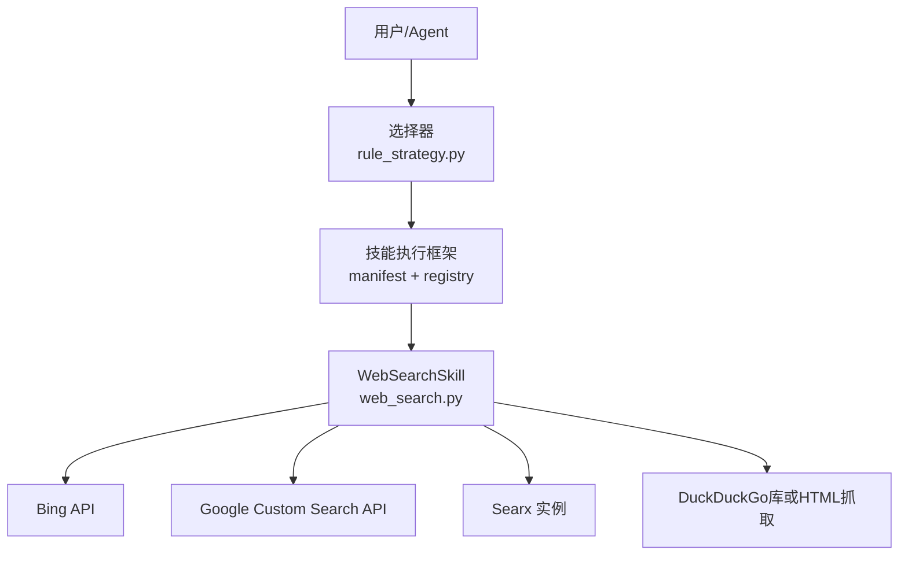
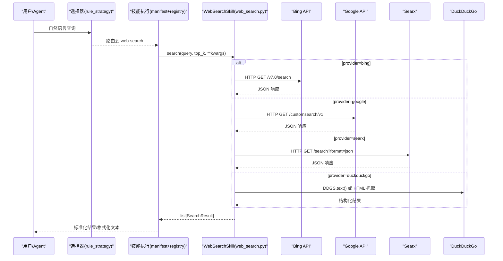
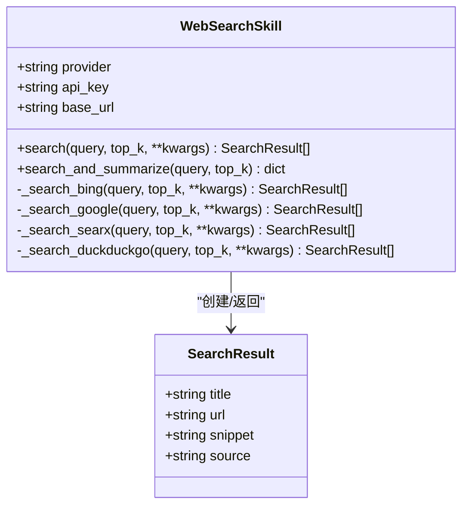
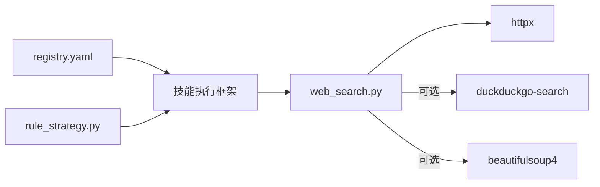

# 网络搜索技能

<cite>
**本文引用的文件**
- [web_search.py](file://python/src/resolveagent/skills/builtin/web_search.py)
- [manifest.yaml（演示版）](file://docs/demo/demo/skills/web-search/manifest.yaml)
- [skill.py（演示版）](file://docs/demo/demo/skills/web-search/skill.py)
- [skill-example.yaml](file://configs/examples/skill-example.yaml)
- [registry.yaml](file://skills/registry.yaml)
- [rule_strategy.py](file://python/src/resolveagent/selector/strategies/rule_strategy.py)
</cite>

## 目录
1. [简介](#简介)
2. [项目结构](#项目结构)
3. [核心组件](#核心组件)
4. [架构总览](#架构总览)
5. [详细组件分析](#详细组件分析)
6. [依赖关系分析](#依赖关系分析)
7. [性能与可靠性](#性能与可靠性)
8. [故障排查指南](#故障排查指南)
9. [结论](#结论)
10. [附录：API 参考与配置](#附录api-参考与配置)

## 简介
本文件为“网络搜索技能”的完整功能文档，聚焦于内置实现 web_search.py 所集成的搜索引擎能力。内容涵盖支持的搜索源、搜索算法与结果处理流程、输入输出格式、参数配置、使用示例、质量评估与去重机制说明等，帮助开发者快速集成并正确使用该技能获取最新技术信息与解决方案。

## 项目结构
围绕网络搜索技能的关键位置如下：
- 内置实现：python/src/resolveagent/skills/builtin/web_search.py
- 演示用清单与入口：docs/demo/demo/skills/web-search/manifest.yaml 与 skill.py
- 技能注册与路由：skills/registry.yaml、python/src/resolveagent/selector/strategies/rule_strategy.py
- 示例配置：configs/examples/skill-example.yaml

图表来源
- [web_search.py:32-101](file://python/src/resolveagent/skills/builtin/web_search.py#L32-L101)
- [rule_strategy.py:99-109](file://python/src/resolveagent/selector/strategies/rule_strategy.py#L99-L109)
- [registry.yaml:20-23](file://skills/registry.yaml#L20-L23)

章节来源
- [web_search.py:1-101](file://python/src/resolveagent/skills/builtin/web_search.py#L1-L101)
- [manifest.yaml（演示版）:1-51](file://docs/demo/demo/skills/web-search/manifest.yaml#L1-L51)
- [skill.py（演示版）:1-159](file://docs/demo/demo/skills/web-search/skill.py#L1-L159)
- [skill-example.yaml:1-22](file://configs/examples/skill-example.yaml#L1-L22)
- [registry.yaml:1-34](file://skills/registry.yaml#L1-L34)
- [rule_strategy.py:93-128](file://python/src/resolveagent/selector/strategies/rule_strategy.py#L93-L128)

## 核心组件
- WebSearchSkill：统一封装多搜索引擎调用，提供 search()、search_and_summarize() 等方法，支持 Bing、Google、Searx、DuckDuckGo。
- SearchResult：搜索结果数据模型，包含标题、链接、摘要、来源等字段。
- 便捷函数：web_search()、quick_search() 用于快速调用。
- 演示版 manifest 与 skill：定义输入/输出契约、权限与元数据，便于在平台中注册与展示。

章节来源
- [web_search.py:22-101](file://python/src/resolveagent/skills/builtin/web_search.py#L22-L101)
- [web_search.py:307-382](file://python/src/resolveagent/skills/builtin/web_search.py#L307-L382)
- [manifest.yaml（演示版）:7-32](file://docs/demo/demo/skills/web-search/manifest.yaml#L7-L32)
- [skill.py（演示版）:25-92](file://docs/demo/demo/skills/web-search/skill.py#L25-L92)

## 架构总览
网络搜索技能的调用链路：
- 用户或 Agent 发起请求，由选择器根据规则匹配到 web-search 技能。
- 技能执行框架加载 manifest 与入口，调用 WebSearchSkill.search()。
- 根据 provider 分派到具体搜索引擎实现，返回标准化 SearchResult。
- 可进一步通过 search_and_summarize() 生成格式化文本结果。

图表来源
- [web_search.py:71-101](file://python/src/resolveagent/skills/builtin/web_search.py#L71-L101)
- [web_search.py:103-143](file://python/src/resolveagent/skills/builtin/web_search.py#L103-L143)
- [web_search.py:145-190](file://python/src/resolveagent/skills/builtin/web_search.py#L145-L190)
- [web_search.py:192-229](file://python/src/resolveagent/skills/builtin/web_search.py#L192-L229)
- [web_search.py:231-305](file://python/src/resolveagent/skills/builtin/web_search.py#L231-L305)
- [rule_strategy.py:99-109](file://python/src/resolveagent/selector/strategies/rule_strategy.py#L99-L109)

## 详细组件分析

### WebSearchSkill 类
- 职责：统一抽象多搜索引擎调用，屏蔽差异，返回统一的 SearchResult 列表。
- 关键方法：
  - __init__(provider, api_key, base_url)：初始化提供商、密钥与基础地址。
  - search(query, top_k, **kwargs)：按 provider 分发到对应私有方法。
  - _search_bing/_search_google/_search_searx/_search_duckduckgo：各引擎的具体实现。
  - search_and_summarize(query, top_k)：将结果格式化为可读文本。
- 错误处理：每个搜索引擎方法均捕获异常并记录日志，失败时返回空列表以保证健壮性。
- 超时与并发：使用异步客户端 httpx，设置超时；对 DuckDuckGo 提供可选第三方库加速与 HTML 解析回退。

图表来源
- [web_search.py:22-30](file://python/src/resolveagent/skills/builtin/web_search.py#L22-L30)
- [web_search.py:32-101](file://python/src/resolveagent/skills/builtin/web_search.py#L32-L101)
- [web_search.py:103-305](file://python/src/resolveagent/skills/builtin/web_search.py#L103-L305)

章节来源
- [web_search.py:32-101](file://python/src/resolveagent/skills/builtin/web_search.py#L32-L101)
- [web_search.py:103-305](file://python/src/resolveagent/skills/builtin/web_search.py#L103-L305)

### 搜索引擎实现要点
- Bing：需要 API Key，市场参数 market 默认 zh-CN，限制 count=top_k。
- Google：需要 API Key 与 CX（搜索引擎 ID），num 上限 10。
- Searx：自托管实例，base_url 可配置，language 参数控制语言。
- DuckDuckGo：优先使用 duckduckgo-search 库；若未安装则回退到 HTML 抓取并使用 BeautifulSoup 解析。

章节来源
- [web_search.py:103-143](file://python/src/resolveagent/skills/builtin/web_search.py#L103-L143)
- [web_search.py:145-190](file://python/src/resolveagent/skills/builtin/web_search.py#L145-L190)
- [web_search.py:192-229](file://python/src/resolveagent/skills/builtin/web_search.py#L192-L229)
- [web_search.py:231-305](file://python/src/resolveagent/skills/builtin/web_search.py#L231-L305)

### 演示版 Skill（manifest + skill.py）
- manifest.yaml：定义输入（query、num_results、language）、输出（results、total_found、search_time_ms）、权限（网络访问、允许主机、超时、内存限制）与元数据。
- skill.py：演示入口 run()，包含参数校验、模拟结果生成、耗时统计与结构化返回。生产环境应替换为真实搜索 API 调用。

章节来源
- [manifest.yaml（演示版）:7-51](file://docs/demo/demo/skills/web-search/manifest.yaml#L7-L51)
- [skill.py（演示版）:25-92](file://docs/demo/demo/skills/web-search/skill.py#L25-L92)
- [skill.py（演示版）:95-148](file://docs/demo/demo/skills/web-search/skill.py#L95-L148)

## 依赖关系分析
- 运行时依赖：httpx（HTTP 客户端）、可选 duckduckgo-search、beautifulsoup4（HTML 解析）。
- 平台集成：
  - skills/registry.yaml 将 web-search 标记为内置技能。
  - rule_strategy.py 通过规则将“搜索/查找/检索”意图路由到 web-search。
  - configs/examples/skill-example.yaml 给出技能注册与入口点示例。

图表来源
- [registry.yaml:20-23](file://skills/registry.yaml#L20-L23)
- [rule_strategy.py:99-109](file://python/src/resolveagent/selector/strategies/rule_strategy.py#L99-L109)
- [web_search.py:12-18](file://python/src/resolveagent/skills/builtin/web_search.py#L12-L18)
- [web_search.py:231-305](file://python/src/resolveagent/skills/builtin/web_search.py#L231-L305)

章节来源
- [registry.yaml:1-34](file://skills/registry.yaml#L1-L34)
- [rule_strategy.py:93-128](file://python/src/resolveagent/selector/strategies/rule_strategy.py#L93-L128)
- [web_search.py:12-18](file://python/src/resolveagent/skills/builtin/web_search.py#L12-L18)

## 性能与可靠性
- 超时控制：所有外部 HTTP 调用设置 30 秒超时，避免长时间阻塞。
- 降级策略：DuckDuckGo 优先使用专用库，缺失时回退到 HTML 抓取；任一搜索引擎失败返回空列表并记录日志，保证整体可用性。
- 结果数量限制：Google 限制 num<=10；其他引擎按 top_k 截断。
- 并发与资源：异步 I/O 提升吞吐；manifest 中可配置 max_memory_mb 与 timeout_seconds 以约束沙箱资源。

章节来源
- [web_search.py:122-143](file://python/src/resolveagent/skills/builtin/web_search.py#L122-L143)
- [web_search.py:169-190](file://python/src/resolveagent/skills/builtin/web_search.py#L169-L190)
- [web_search.py:208-229](file://python/src/resolveagent/skills/builtin/web_search.py#L208-L229)
- [web_search.py:269-305](file://python/src/resolveagent/skills/builtin/web_search.py#L269-L305)
- [manifest.yaml（演示版）:34-43](file://docs/demo/demo/skills/web-search/manifest.yaml#L34-L43)

## 故障排查指南
- 未配置 API Key：
  - Bing：检查环境变量 BING_SEARCH_API_KEY。
  - Google：检查 GOOGLE_SEARCH_API_KEY 与 GOOGLE_SEARCH_CX。
- 网络不可达或超时：确认防火墙/代理设置，确保允许访问 *.google.com、*.bing.com、自建 Searx 地址。
- DuckDuckGo 解析失败：
  - 安装 duckduckgo-search 以获得更好体验。
  - 安装 beautifulsoup4 以启用 HTML 回退解析。
- 结果为空：查看日志中的错误信息，确认 provider 与参数（如 language、cx）是否正确。

章节来源
- [web_search.py:61-69](file://python/src/resolveagent/skills/builtin/web_search.py#L61-L69)
- [web_search.py:110-113](file://python/src/resolveagent/skills/builtin/web_search.py#L110-L113)
- [web_search.py:152-159](file://python/src/resolveagent/skills/builtin/web_search.py#L152-L159)
- [web_search.py:299-301](file://python/src/resolveagent/skills/builtin/web_search.py#L299-L301)
- [manifest.yaml（演示版）:34-43](file://docs/demo/demo/skills/web-search/manifest.yaml#L34-L43)

## 结论
WebSearchSkill 提供了统一、可扩展的网络搜索能力，覆盖主流搜索引擎与自托管方案，具备完善的错误处理与降级策略。结合平台的技能注册与路由机制，可在 Agent 工作流中无缝集成，快速获取最新技术与解决方案信息。建议在生产环境中配置合适的 provider、API Key、语言与结果数量限制，并通过 manifest 进行安全与资源约束。

## 附录：API 参考与配置

### 输入参数
- query：搜索查询字符串（必填）
- top_k：返回结果数量（默认 5）
- kwargs（按 provider 扩展）：
  - bing：market（默认 zh-CN）
  - google：cx（搜索引擎 ID，可从环境变量读取）
  - searx：language（默认 zh-CN）
  - duckduckgo：无额外参数

章节来源
- [web_search.py:71-101](file://python/src/resolveagent/skills/builtin/web_search.py#L71-L101)
- [web_search.py:116-120](file://python/src/resolveagent/skills/builtin/web_search.py#L116-L120)
- [web_search.py:161-167](file://python/src/resolveagent/skills/builtin/web_search.py#L161-L167)
- [web_search.py:202-206](file://python/src/resolveagent/skills/builtin/web_search.py#L202-L206)

### 输出字段
- results：数组，每项包含
  - title：标题
  - url：链接
  - snippet：摘要
  - source：来源（Bing/Google/Searx/DuckDuckGo）
- formatted：格式化后的文本（search_and_summarize 返回）
- success：布尔值（search_and_summarize 返回）

章节来源
- [web_search.py:22-30](file://python/src/resolveagent/skills/builtin/web_search.py#L22-L30)
- [web_search.py:307-351](file://python/src/resolveagent/skills/builtin/web_search.py#L307-L351)

### 便捷函数
- web_search(query, top_k)：返回 SearchResult 列表
- quick_search(query)：返回格式化文本

章节来源
- [web_search.py:357-382](file://python/src/resolveagent/skills/builtin/web_search.py#L357-L382)

### 配置选项
- provider：搜索引擎选择（bing/google/searx/duckduckgo）
- api_key：对应 provider 的 API Key（从参数或环境变量注入）
- base_url：自托管 Searx 的基础地址
- 权限与资源（manifest）：
  - network_access：true
  - allowed_hosts：*.google.com、*.bing.com、*.baidu.com（可按需调整）
  - timeout_seconds：30
  - max_memory_mb：256

章节来源
- [web_search.py:44-69](file://python/src/resolveagent/skills/builtin/web_search.py#L44-L69)
- [manifest.yaml（演示版）:34-43](file://docs/demo/demo/skills/web-search/manifest.yaml#L34-L43)
- [skill-example.yaml:4-22](file://configs/examples/skill-example.yaml#L4-L22)

### 使用示例
- 通过选择器路由：当用户输入包含“搜索/查找/检索”等关键词时，系统自动路由至 web-search 技能。
- 直接调用：
  - 使用 web_search(query, top_k) 获取结构化结果。
  - 使用 quick_search(query) 获取格式化文本。
- 在 Agent 工作流中：
  - 配置 manifest 的 inputs/outputs 与 permissions。
  - 在 workflow 中引用 web-search 技能，传入 query、num_results、language 等参数。

章节来源
- [rule_strategy.py:99-109](file://python/src/resolveagent/selector/strategies/rule_strategy.py#L99-L109)
- [web_search.py:357-382](file://python/src/resolveagent/skills/builtin/web_search.py#L357-L382)
- [manifest.yaml（演示版）:7-32](file://docs/demo/demo/skills/web-search/manifest.yaml#L7-L32)

### 搜索结果的质量评估与去重机制
- 质量评估：
  - 当前实现未内置相关性评分或重排序逻辑。
  - 可通过上层 LLM 或 reranker 对 results 进行二次打分与排序（建议在调用方实现）。
- 去重机制：
  - 当前实现未内置 URL 去重。
  - 建议在调用方基于 url 字段进行去重，或在聚合多个 provider 的结果时合并重复项。

章节来源
- [web_search.py:22-30](file://python/src/resolveagent/skills/builtin/web_search.py#L22-L30)
- [web_search.py:307-351](file://python/src/resolveagent/skills/builtin/web_search.py#L307-L351)