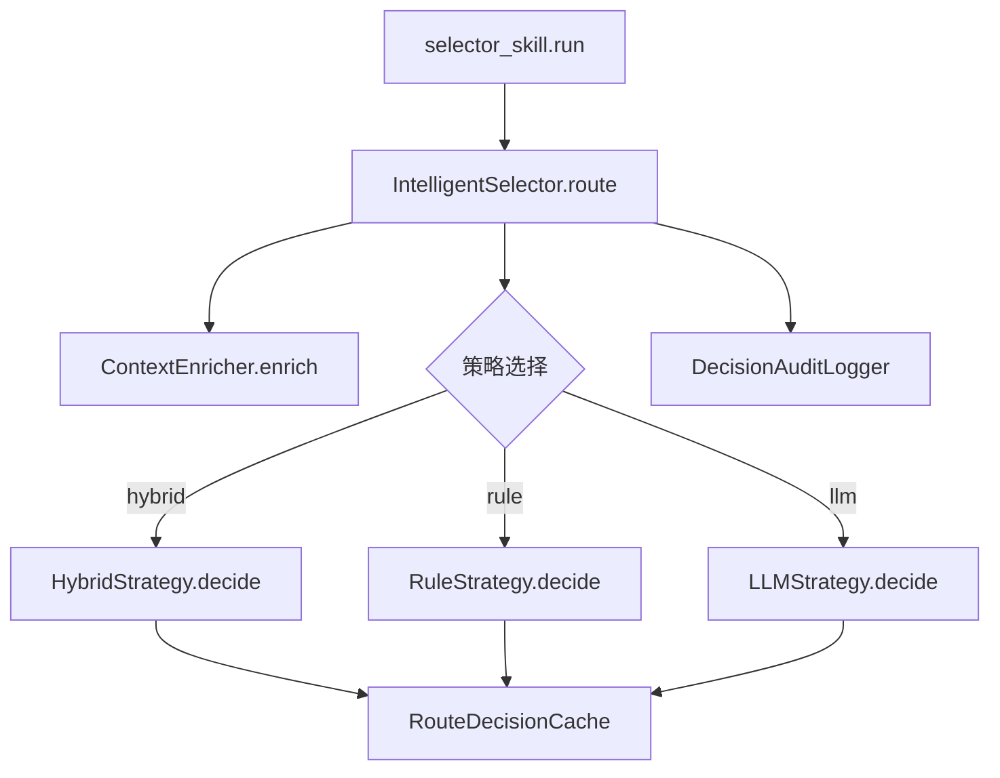
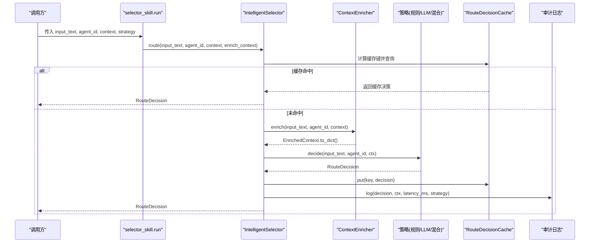
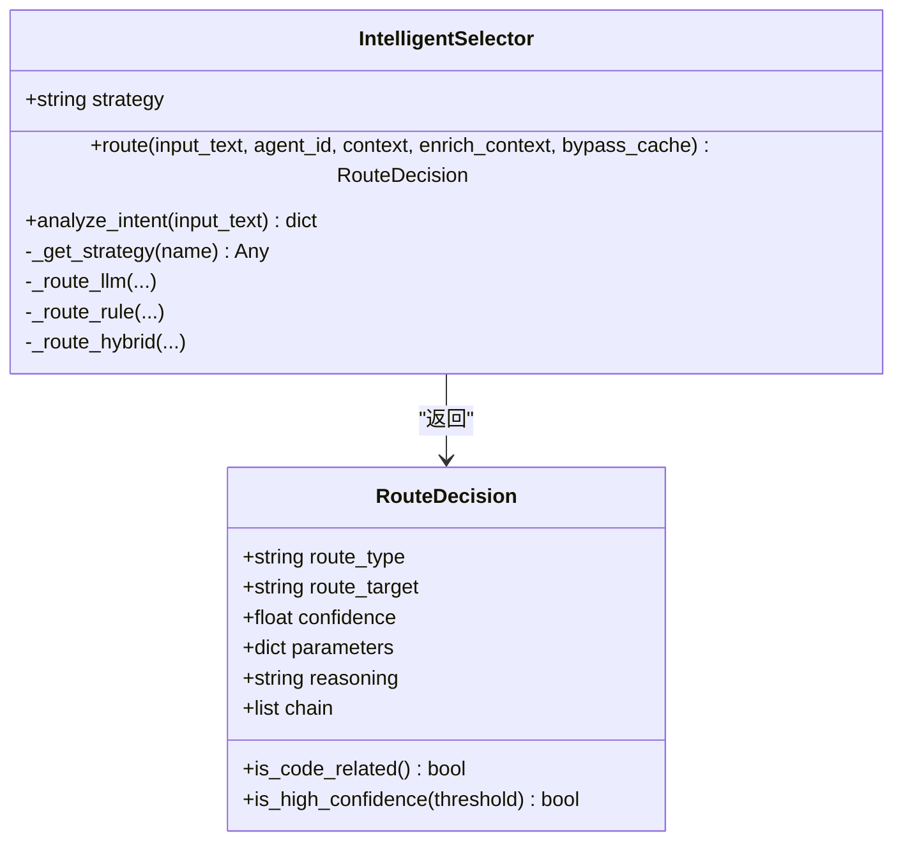
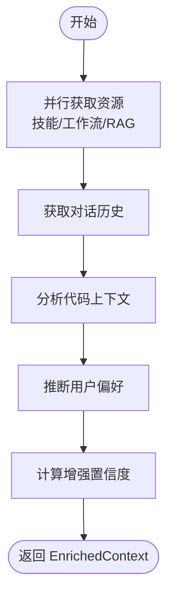
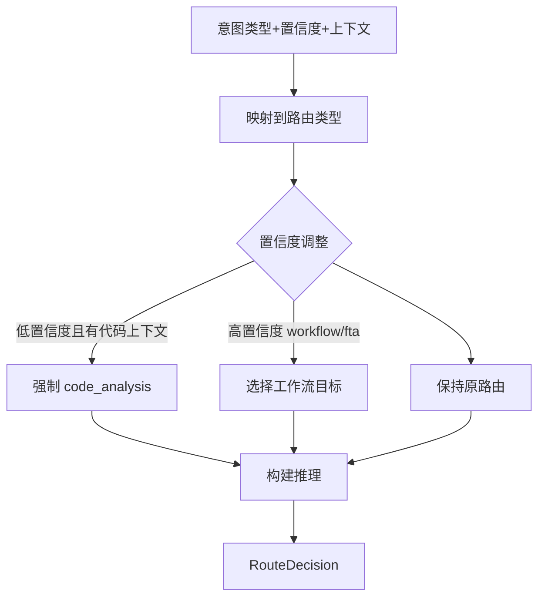
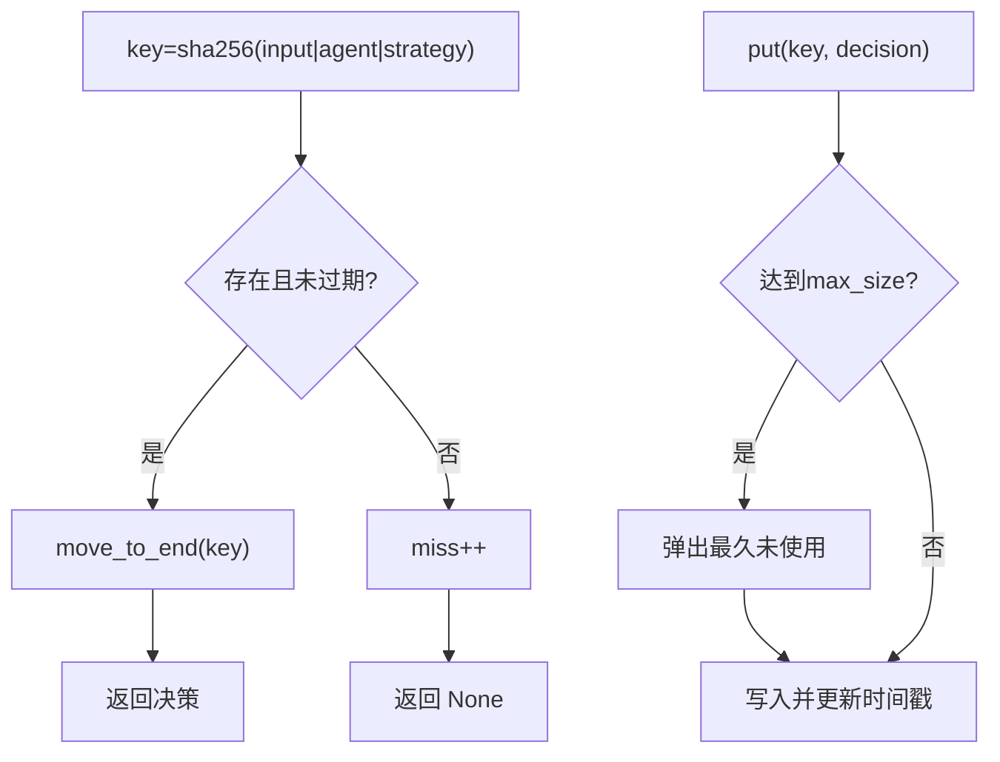
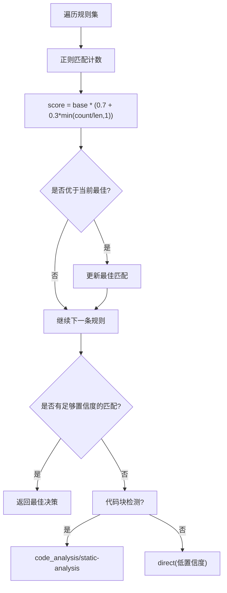
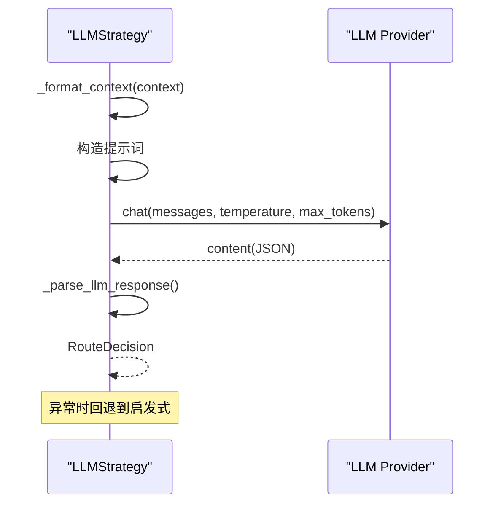
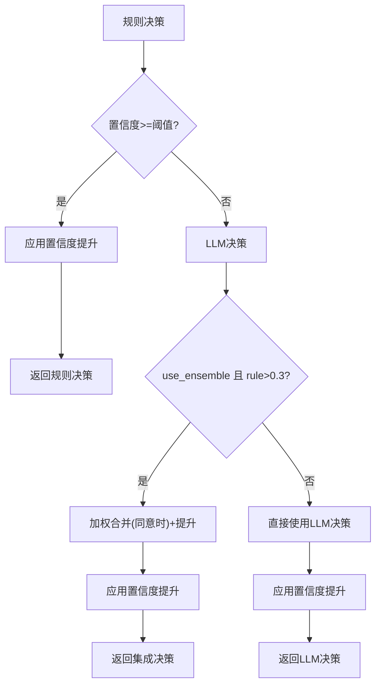
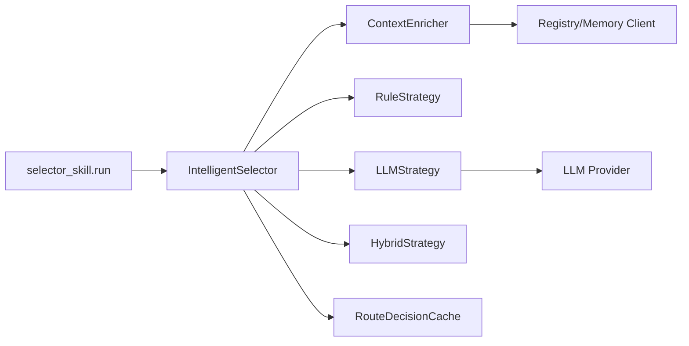

# 选择器技能

<cite>
**本文引用的文件**
- [selector_skill.py](file://python/src/resolveagent/skills/builtin/selector_skill.py)
- [selector.py](file://python/src/resolveagent/selector/selector.py)
- [router.py](file://python/src/resolveagent/selector/router.py)
- [cache.py](file://python/src/resolveagent/selector/cache.py)
- [hybrid_strategy.py](file://python/src/resolveagent/selector/strategies/hybrid_strategy.py)
- [rule_strategy.py](file://python/src/resolveagent/selector/strategies/rule_strategy.py)
- [llm_strategy.py](file://python/src/resolveagent/selector/strategies/llm_strategy.py)
- [context_enricher.py](file://python/src/resolveagent/selector/context_enricher.py)
- [test_selector.py](file://python/tests/unit/test_selector.py)
- [test_skill_selector.py](file://python/tests/unit/test_skill_selector.py)
</cite>

## 目录
1. [简介](#简介)
2. [项目结构](#项目结构)
3. [核心组件](#核心组件)
4. [架构总览](#架构总览)
5. [详细组件分析](#详细组件分析)
6. [依赖关系分析](#依赖关系分析)
7. [性能考量](#性能考量)
8. [故障排查指南](#故障排查指南)
9. [结论](#结论)
10. [附录：API参考与示例](#附录api参考与示例)

## 简介
本文件为“选择器技能”提供完整的功能文档，聚焦于 selector_skill.py 暴露的入口及其背后的 IntelligentSelector 智能路由系统。内容涵盖：
- 智能路由决策：混合策略（规则优先 + LLM 回退）、纯规则、纯 LLM 三种模式
- 条件判断与动态选择：基于置信度阈值、上下文增强、代码块检测等
- 配置语法与表达式规则：规则策略的正则匹配、LLM 提示词与输出约束、混合策略可调参数
- 执行逻辑：缓存命中、上下文增强、策略调度、审计日志
- API 参考：输入参数、条件语句、输出结果
- 性能优化：TTL-LRU 缓存、预编译正则、惰性加载策略实例
- 使用示例：复杂场景下的智能路由与决策
- 扩展性：自定义函数、第三方集成点

## 项目结构
选择器技能位于 Python 层，通过内置 skill 入口对外暴露 run 接口，内部由 IntelligentSelector 编排意图识别、上下文增强、策略路由与缓存审计。

图表来源
- [selector_skill.py:12-33](file://python/src/resolveagent/skills/builtin/selector_skill.py#L12-L33)
- [selector.py:121-229](file://python/src/resolveagent/selector/selector.py#L121-L229)
- [cache.py:20-97](file://python/src/resolveagent/selector/cache.py#L20-L97)

章节来源
- [selector_skill.py:1-33](file://python/src/resolveagent/skills/builtin/selector_skill.py#L1-L33)
- [selector.py:1-317](file://python/src/resolveagent/selector/selector.py#L1-L317)

## 核心组件
- 技能入口：selector_skill.run
  - 将 IntelligentSelector 包装为标准 Skill 调用，返回 RouteDecision 的字典形式以便通过技能输出校验层
- 智能选择器：IntelligentSelector
  - 统一入口 route()，负责缓存检查、上下文增强、策略分发、计时与审计
  - 支持三种策略：hybrid（默认）、rule、llm
- 上下文增强：ContextEnricher
  - 并行拉取可用技能、工作流、RAG 集合；对话历史；代码上下文提取与复杂度估计；用户偏好推断
- 路由决策引擎：RouteDecider
  - 将意图类型映射到具体路由目标，依据置信度与上下文进行修正，生成可读推理
- 缓存：RouteDecisionCache
  - TTL-LRU 缓存，支持全局或实例级作用域，统计命中率
- 策略实现
  - RuleStrategy：预编译正则的多模式匹配，按匹配数加权评分
  - LLMStrategy：结构化提示词 + JSON 解析，失败时回退启发式
  - HybridStrategy：规则快速路径 + LLM 慢路径 + 加权集成 + 置信度提升

章节来源
- [selector_skill.py:12-33](file://python/src/resolveagent/skills/builtin/selector_skill.py#L12-L33)
- [selector.py:22-317](file://python/src/resolveagent/selector/selector.py#L22-L317)
- [context_enricher.py:17-271](file://python/src/resolveagent/selector/context_enricher.py#L17-L271)
- [router.py:17-145](file://python/src/resolveagent/selector/router.py#L17-L145)
- [cache.py:20-112](file://python/src/resolveagent/selector/cache.py#L20-L112)
- [rule_strategy.py:17-290](file://python/src/resolveagent/selector/strategies/rule_strategy.py#L17-L290)
- [llm_strategy.py:19-402](file://python/src/resolveagent/selector/strategies/llm_strategy.py#L19-L402)
- [hybrid_strategy.py:21-224](file://python/src/resolveagent/selector/strategies/hybrid_strategy.py#L21-L224)

## 架构总览
选择器采用“意图分析 + 上下文增强 + 策略路由 + 缓存审计”的分层架构。Hybrid 策略在默认模式下兼顾速度与准确性：先走规则快速路径，若置信度不足再交由 LLM 分类，必要时对两者结果进行加权集成并应用置信度提升。

图表来源
- [selector_skill.py:12-33](file://python/src/resolveagent/skills/builtin/selector_skill.py#L12-L33)
- [selector.py:165-229](file://python/src/resolveagent/selector/selector.py#L165-L229)
- [context_enricher.py:206-271](file://python/src/resolveagent/selector/context_enricher.py#L206-L271)
- [cache.py:36-69](file://python/src/resolveagent/selector/cache.py#L36-L69)

## 详细组件分析

### 智能选择器 IntelligentSelector
- 职责
  - 统一路由入口 route()，支持 bypass_cache、enrich_context 控制
  - 策略实例懒加载与缓存，避免重复初始化
  - 计时、日志与审计
- 关键流程
  - 缓存键 = sha256(input_text|agent_id|strategy)
  - 可选上下文增强后进入策略决策
  - 写入缓存并记录审计信息
- 数据模型
  - RouteDecision：包含 route_type、route_target、confidence、parameters、reasoning、chain

图表来源
- [selector.py:22-317](file://python/src/resolveagent/selector/selector.py#L22-L317)

章节来源
- [selector.py:121-317](file://python/src/resolveagent/selector/selector.py#L121-L317)

### 上下文增强 ContextEnricher
- 能力
  - 并行获取可用技能、活跃工作流、RAG 集合
  - 对话历史读取（可接入 MemoryClient）
  - 代码上下文提取：语言检测、代码片段、潜在问题、复杂度估计
  - 用户偏好推断（详细程度、是否偏好代码示例、语言）
- 输出
  - EnrichedContext.to_dict() 兼容旧字段（resilient_feedback 扁平化）

图表来源
- [context_enricher.py:206-271](file://python/src/resolveagent/selector/context_enricher.py#L206-L271)
- [context_enricher.py:523-583](file://python/src/resolveagent/selector/context_enricher.py#L523-L583)

章节来源
- [context_enricher.py:17-271](file://python/src/resolveagent/selector/context_enricher.py#L17-L271)
- [context_enricher.py:523-633](file://python/src/resolveagent/selector/context_enricher.py#L523-L633)

### 路由决策引擎 RouteDecider
- 功能
  - 意图类型到路由类型的映射
  - 低置信度且含代码上下文时强制 code_analysis
  - 高置信度 workflow/fta 时选择具体工作流目标
  - 构建人类可读的推理说明
- 关键点
  - 置信度阈值：HIGH=0.75，MEDIUM=0.5
  - 目标选择：skill→web-search；fta→incident-diagnosis；rag→product-docs；code_analysis→static-analysis/security-scan

图表来源
- [router.py:17-145](file://python/src/resolveagent/selector/router.py#L17-L145)

章节来源
- [router.py:17-145](file://python/src/resolveagent/selector/router.py#L17-L145)

### 缓存机制 RouteDecisionCache
- 特性
  - TTL-LRU：过期自动淘汰，LRU 顺序维护
  - 线程安全：读写加锁
  - 全局单例：模块级 get_global_cache
  - 统计：命中/未命中/命中率/大小/TTL
- 使用
  - 以 input_text|agent_id|strategy 生成哈希键
  - 命中直接返回，未命中写入并更新最近使用

图表来源
- [cache.py:20-97](file://python/src/resolveagent/selector/cache.py#L20-L97)

章节来源
- [cache.py:20-112](file://python/src/resolveagent/selector/cache.py#L20-L112)

### 策略实现

#### 规则策略 RuleStrategy
- 特点
  - 预编译正则，按规则优先级与匹配数量加权评分
  - 支持代码块检测作为 fallback
  - 返回 matched_patterns 便于审计
- 典型规则
  - 代码分析：静态分析、安全扫描、AST/调用图相关
  - 工作流/FTA：诊断、根因分析、故障树
  - 技能：搜索、执行代码、文件操作、API 调用、计算器
  - RAG：文档查询、操作手册、历史事件

图表来源
- [rule_strategy.py:194-264](file://python/src/resolveagent/selector/strategies/rule_strategy.py#L194-L264)

章节来源
- [rule_strategy.py:17-290](file://python/src/resolveagent/selector/strategies/rule_strategy.py#L17-L290)

#### LLM 策略 LLMStrategy
- 特点
  - 结构化提示词，要求返回 JSON，包含 route_type、route_target、confidence、reasoning
  - 失败时回退到启发式模拟响应
  - 支持 model_id 指定模型
- 处理流程
  - 格式化上下文 → 构造提示词 → 调用 LLM → 解析 JSON → 校验与规范化 → 返回决策

图表来源
- [llm_strategy.py:129-170](file://python/src/resolveagent/selector/strategies/llm_strategy.py#L129-L170)
- [llm_strategy.py:205-231](file://python/src/resolveagent/selector/strategies/llm_strategy.py#L205-L231)
- [llm_strategy.py:338-402](file://python/src/resolveagent/selector/strategies/llm_strategy.py#L338-L402)

章节来源
- [llm_strategy.py:19-402](file://python/src/resolveagent/selector/strategies/llm_strategy.py#L19-L402)

#### 混合策略 HybridStrategy
- 特点
  - 三阶段：规则快速路径 → LLM 慢路径 → 集成（当两者一致时加权合并）
  - 置信度提升：代码块、诊断关键词、对话历史长度、每路由类型额外提升
  - 可配置：规则/LLM 阈值、是否集成、权重、代码提升、每路由提升
- 决策流程

图表来源
- [hybrid_strategy.py:79-123](file://python/src/resolveagent/selector/strategies/hybrid_strategy.py#L79-L123)
- [hybrid_strategy.py:125-175](file://python/src/resolveagent/selector/strategies/hybrid_strategy.py#L125-L175)
- [hybrid_strategy.py:177-211](file://python/src/resolveagent/selector/strategies/hybrid_strategy.py#L177-L211)

章节来源
- [hybrid_strategy.py:21-224](file://python/src/resolveagent/selector/strategies/hybrid_strategy.py#L21-L224)

## 依赖关系分析
- 组件耦合
  - selector_skill.run 仅依赖 IntelligentSelector，解耦良好
  - IntelligentSelector 依赖 ContextEnricher、策略实现、缓存与审计
  - 策略之间相互独立，通过统一 RouteDecision 接口协作
- 外部依赖
  - LLMStrategy 依赖 LLM 提供者（HigressProvider），失败时回退
  - ContextEnricher 可选依赖 registry_client 与 memory_client
- 循环依赖
  - 无直接循环导入；策略按需 import 以避免启动开销

图表来源
- [selector_skill.py:12-33](file://python/src/resolveagent/skills/builtin/selector_skill.py#L12-L33)
- [selector.py:143-163](file://python/src/resolveagent/selector/selector.py#L143-L163)
- [llm_strategy.py:205-231](file://python/src/resolveagent/selector/strategies/llm_strategy.py#L205-L231)
- [context_enricher.py:273-418](file://python/src/resolveagent/selector/context_enricher.py#L273-L418)

章节来源
- [selector.py:143-163](file://python/src/resolveagent/selector/selector.py#L143-L163)
- [llm_strategy.py:205-231](file://python/src/resolveagent/selector/strategies/llm_strategy.py#L205-L231)
- [context_enricher.py:273-418](file://python/src/resolveagent/selector/context_enricher.py#L273-L418)

## 性能考量
- 缓存
  - TTL-LRU 减少重复计算，全局/实例级作用域灵活切换
  - 建议在高并发场景使用全局缓存，合理设置 max_size 与 ttl_seconds
- 预计算
  - 规则策略预编译正则，降低匹配开销
  - 策略实例懒加载，避免不必要的初始化成本
- 并行 I/O
  - 上下文增强中并行获取技能、工作流、RAG 集合，缩短延迟
- 审计与观测
  - 记录策略、路由类型、目标、置信度、耗时，便于定位瓶颈

[本节为通用性能指导，不直接分析具体文件]

## 故障排查指南
- 常见问题
  - LLM 调用失败：LLMStrategy 会回退到启发式，检查日志中的错误信息与回退原因
  - 规则未命中：查看 RuleStrategy 的 attempted_matches 与 matched_patterns
  - 缓存未命中：确认 key 生成是否正确（input_text、agent_id、strategy）
  - 上下文为空：检查 registry_client/memory_client 连接与可用性
- 调试建议
  - 开启日志观察策略选择与耗时
  - 使用 analyze_intent 单独验证意图分类
  - 通过 get_strategy_info 确认当前策略与有效策略列表

章节来源
- [llm_strategy.py:167-170](file://python/src/resolveagent/selector/strategies/llm_strategy.py#L167-L170)
- [rule_strategy.py:247-264](file://python/src/resolveagent/selector/strategies/rule_strategy.py#L247-L264)
- [cache.py:36-69](file://python/src/resolveagent/selector/cache.py#L36-L69)
- [context_enricher.py:273-418](file://python/src/resolveagent/selector/context_enricher.py#L273-L418)

## 结论
选择器技能通过 IntelligentSelector 提供了稳定、可扩展的智能路由能力。默认混合策略在保证速度的同时提升了准确率；规则策略适合高确定性场景；LLM 策略适用于开放与模糊需求。结合上下文增强与缓存机制，可在复杂场景中实现高效、可观测的智能路由与决策。

[本节为总结性内容，不直接分析具体文件]

## 附录：API参考与示例

### 技能入口 API
- 函数：selector_skill.run
- 输入参数
  - input_text: str，用户输入文本
  - agent_id: str，处理该请求的代理标识
  - context: dict[str, Any] | None，附加上下文
  - strategy: str，路由策略（"hybrid"|"rule"|"llm"）
  - enrich_context: bool，是否启用上下文增强
- 输出结果
  - dict，对应 RouteDecision 的序列化结果，包含 route_type、route_target、confidence、parameters、reasoning、chain

章节来源
- [selector_skill.py:12-33](file://python/src/resolveagent/skills/builtin/selector_skill.py#L12-L33)

### 智能选择器 API
- 方法：IntelligentSelector.route
- 输入参数
  - input_text: str
  - agent_id: str
  - context: dict[str, Any] | None
  - enrich_context: bool
  - bypass_cache: bool，跳过缓存
- 输出结果
  - RouteDecision，包含路由类型、目标、置信度、参数、推理、链式子决策

章节来源
- [selector.py:165-229](file://python/src/resolveagent/selector/selector.py#L165-L229)

### 上下文增强 API
- 方法：ContextEnricher.enrich
- 输入参数
  - input_text: str
  - agent_id: str
  - context: dict[str, Any]
- 输出结果
  - EnrichedContext，to_dict() 后可用于下游策略与路由

章节来源
- [context_enricher.py:206-271](file://python/src/resolveagent/selector/context_enricher.py#L206-L271)

### 路由决策引擎 API
- 方法：RouteDecider.decide
- 输入参数
  - intent_type: str
  - confidence: float
  - context: dict[str, Any]
- 输出结果
  - RouteDecision

章节来源
- [router.py:34-87](file://python/src/resolveagent/selector/router.py#L34-L87)

### 缓存 API
- 类：RouteDecisionCache
- 方法
  - make_key(input_text, agent_id, strategy): str
  - get(key): RouteDecision | None
  - put(key, decision): void
  - invalidate(key): bool
  - clear(): void
  - cache_stats(): dict

章节来源
- [cache.py:36-97](file://python/src/resolveagent/selector/cache.py#L36-L97)

### 策略配置与行为
- RuleStrategy
  - 预编译正则，按匹配数量加权评分，支持代码块检测 fallback
- LLMStrategy
  - 结构化提示词，JSON 输出，失败回退到启发式
- HybridStrategy
  - 可配置阈值、集成开关、权重、代码提升、每路由提升

章节来源
- [rule_strategy.py:194-264](file://python/src/resolveagent/selector/strategies/rule_strategy.py#L194-L264)
- [llm_strategy.py:129-170](file://python/src/resolveagent/selector/strategies/llm_strategy.py#L129-L170)
- [hybrid_strategy.py:21-78](file://python/src/resolveagent/selector/strategies/hybrid_strategy.py#L21-L78)

### 实际使用示例（来自测试）
- 代码分析路由
  - 输入包含代码块与审查/分析关键词，期望路由到 code_analysis
- 工作流/FTA 路由
  - 输入包含诊断、根因分析等关键词，期望路由到 fta/workflow
- RAG 路由
  - 输入为知识/文档查询，期望路由到 rag
- 技能路由
  - 输入为搜索、执行代码、文件操作等，期望路由到 skill

章节来源
- [test_selector.py:40-98](file://python/tests/unit/test_selector.py#L40-L98)
- [test_selector.py:196-245](file://python/tests/unit/test_selector.py#L196-L245)
- [test_selector.py:265-289](file://python/tests/unit/test_selector.py#L265-L289)
- [test_selector.py:469-504](file://python/tests/unit/test_selector.py#L469-L504)

### 扩展性与自定义
- 自定义函数
  - 可通过 SkillSelectorAdapter 适配自定义技能 callable，并在错误时回退到 direct
- 第三方集成
  - LLMStrategy 集成 LLM 提供者，支持 model_id 指定
  - ContextEnricher 可选集成 registry_client 与 memory_client，拉取资源与对话历史

章节来源
- [test_skill_selector.py:17-79](file://python/tests/unit/test_skill_selector.py#L17-L79)
- [llm_strategy.py:205-231](file://python/src/resolveagent/selector/strategies/llm_strategy.py#L205-L231)
- [context_enricher.py:273-418](file://python/src/resolveagent/selector/context_enricher.py#L273-L418)