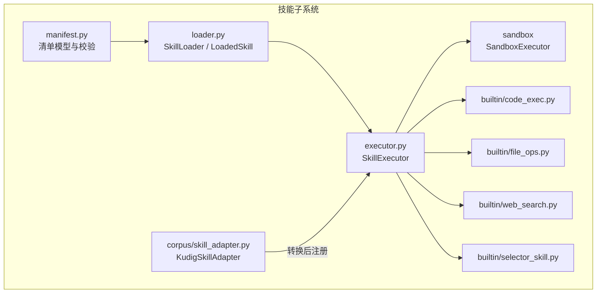
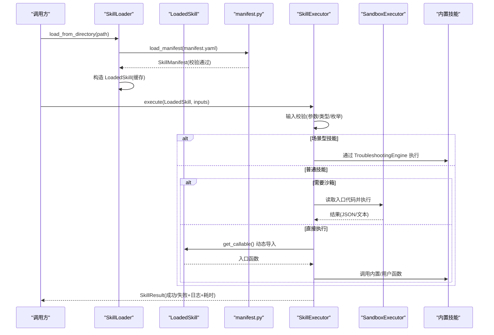
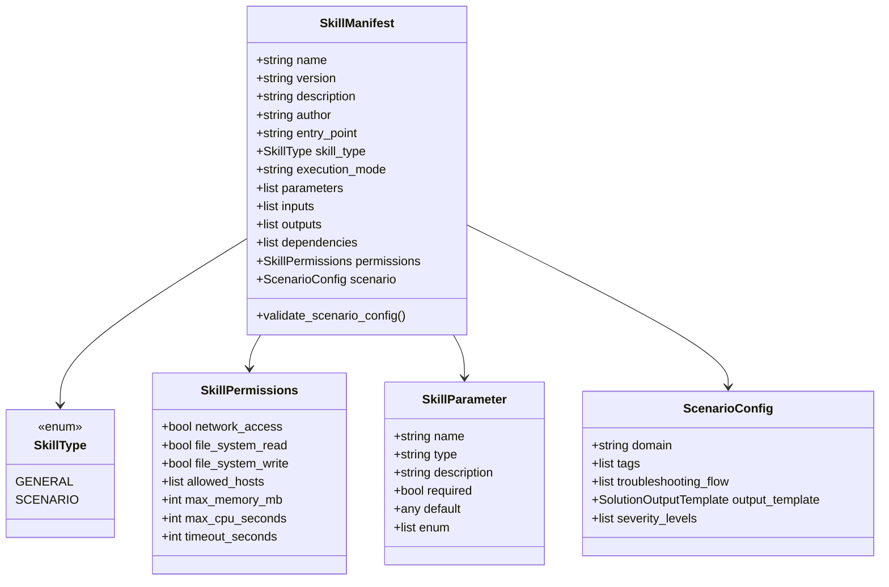
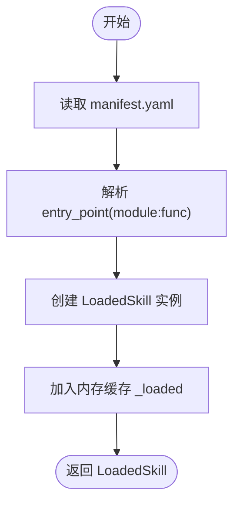
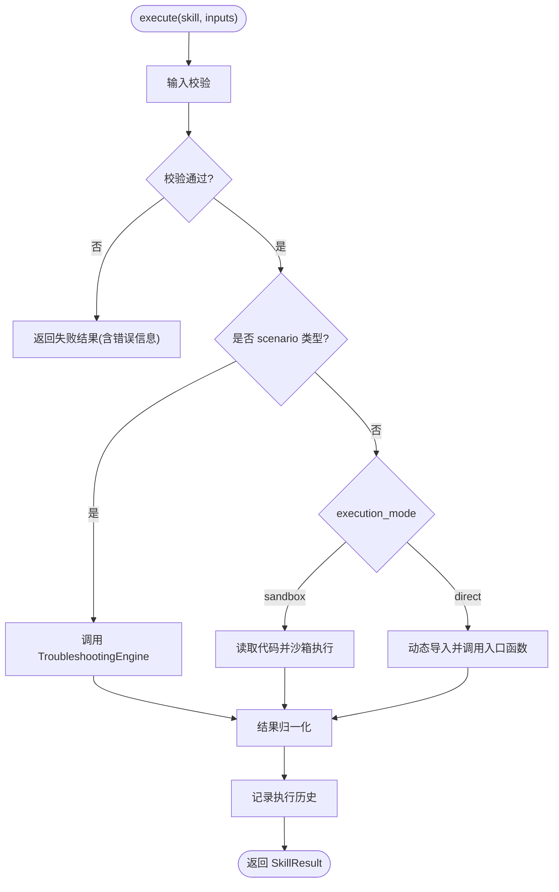
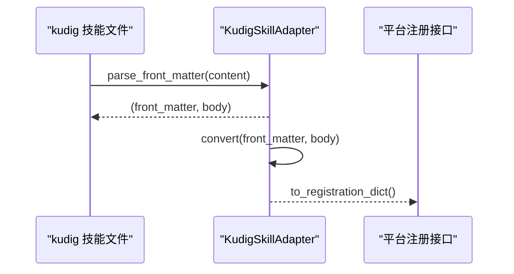
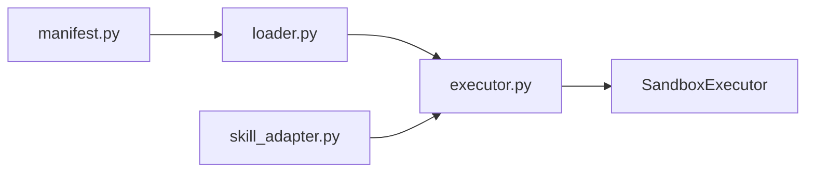

# 技能加载器

<cite>
**本文引用的文件**
- [loader.py](file://python/src/resolveagent/skills/loader.py)
- [manifest.py](file://python/src/resolveagent/skills/manifest.py)
- [executor.py](file://python/src/resolveagent/skills/executor.py)
- [skill_adapter.py](file://python/src/resolveagent/corpus/skill_adapter.py)
- [code_exec.py](file://python/src/resolveagent/skills/builtin/code_exec.py)
- [file_ops.py](file://python/src/resolveagent/skills/builtin/file_ops.py)
- [web_search.py](file://python/src/resolveagent/skills/builtin/web_search.py)
- [selector_skill.py](file://python/src/resolveagent/skills/builtin/selector_skill.py)
- [skill-manifest.schema.json](file://api/jsonschema/skill-manifest.schema.json)
</cite>

## 目录
1. [简介](#简介)
2. [项目结构](#项目结构)
3. [核心组件](#核心组件)
4. [架构总览](#架构总览)
5. [详细组件分析](#详细组件分析)
6. [依赖关系分析](#依赖关系分析)
7. [性能考量](#性能考量)
8. [故障排查指南](#故障排查指南)
9. [结论](#结论)
10. [附录](#附录)

## 简介
本技术文档围绕“技能加载器系统”展开，重点说明 LoadedSkill 类的设计与实现、技能文件系统组织、动态导入机制、依赖解析流程、清单验证、代码加载与缓存管理；阐述 SkillAdapter（技能适配器）在统一接口封装中的作用；介绍内置技能的自动发现与加载方式，以及第三方技能的安装与集成流程；并提供错误处理策略与调试方法，帮助快速定位常见加载失败原因。

## 项目结构
技能子系统位于 Python 包 resolveagent.skills 下，核心由“清单定义—加载器—执行器—沙箱—内置技能—适配器”构成：
- 清单定义：manifest.py 提供 SkillManifest、权限、参数、场景配置等模型，并负责 YAML 清单的加载与校验。
- 加载器：loader.py 提供 SkillLoader 与 LoadedSkill，负责从本地目录扫描、解析 manifest.yaml、动态导入入口模块与函数，并对已加载技能进行内存缓存。
- 执行器：executor.py 提供 SkillExecutor，负责输入/输出校验、按类型路由到直接执行或沙箱执行、记录执行历史与统计。
- 沙箱：通过 SandboxExecutor 对不可信代码进行隔离执行（超时、内存、网络限制）。
- 内置技能：builtin 目录下提供代码执行、文件操作、Web 搜索、选择器桥接等能力。
- 适配器：corpus/skill_adapter.py 将外部格式（如 kudig）的技能转换为平台内部注册所需的结构。

图表来源
- [manifest.py:95-131](file://python/src/resolveagent/skills/manifest.py#L95-L131)
- [loader.py:15-90](file://python/src/resolveagent/skills/loader.py#L15-L90)
- [executor.py:20-147](file://python/src/resolveagent/skills/executor.py#L20-L147)
- [skill_adapter.py:71-157](file://python/src/resolveagent/corpus/skill_adapter.py#L71-L157)

章节来源
- [manifest.py:95-131](file://python/src/resolveagent/skills/manifest.py#L95-L131)
- [loader.py:15-90](file://python/src/resolveagent/skills/loader.py#L15-L90)
- [executor.py:20-147](file://python/src/resolveagent/skills/executor.py#L20-L147)
- [skill_adapter.py:71-157](file://python/src/resolveagent/corpus/skill_adapter.py#L71-L157)

## 核心组件
- 清单模型与校验
  - 使用 Pydantic 模型描述技能元数据、权限、参数、场景配置等，支持 general/scenario 两类技能。
  - 提供 load_manifest 读取 YAML 并返回校验后的 SkillManifest。
- 加载器与已加载技能
  - SkillLoader：维护已加载技能的内存缓存，支持从本地目录加载单个技能。
  - LoadedSkill：持有清单、目录、入口模块与函数名；懒加载入口可调用对象，避免重复 import。
- 执行器
  - SkillExecutor：统一入口，负责输入/输出校验、按技能类型与执行模式路由到直接执行或沙箱执行、记录执行历史与统计。
  - 支持 scenario 类型通过 TroubleshootingEngine 执行结构化排障流程。
- 适配器
  - KudigSkillAdapter：将 kudig 风格的 Markdown + Front Matter 技能转换为平台注册所需的数据结构。

章节来源
- [manifest.py:16-131](file://python/src/resolveagent/skills/manifest.py#L16-L131)
- [loader.py:15-90](file://python/src/resolveagent/skills/loader.py#L15-L90)
- [executor.py:20-147](file://python/src/resolveagent/skills/executor.py#L20-L147)
- [skill_adapter.py:71-157](file://python/src/resolveagent/corpus/skill_adapter.py#L71-L157)

## 架构总览
下图展示从清单到执行的端到端流程，包括动态导入、校验、路由与沙箱隔离。

图表来源
- [loader.py:27-57](file://python/src/resolveagent/skills/loader.py#L27-L57)
- [loader.py:68-90](file://python/src/resolveagent/skills/loader.py#L68-L90)
- [manifest.py:119-131](file://python/src/resolveagent/skills/manifest.py#L119-L131)
- [executor.py:52-147](file://python/src/resolveagent/skills/executor.py#L52-L147)

## 详细组件分析

### 清单模型与校验（manifest.py）
- 关键模型
  - SkillType：general 与 scenario 两种分类。
  - SkillPermissions：网络、文件系统读写、允许主机、资源上限与超时。
  - SkillParameter：输入/输出参数声明（名称、类型、是否必填、默认值、枚举）。
  - ScenarioConfig：场景技能专属配置（领域、标签、排障步骤、输出模板、严重级别）。
  - SkillManifest：聚合上述字段，并在 after 校验中强制 scenario 类型必须包含 scenario 块。
- 清单加载
  - load_manifest 读取 YAML 并实例化 SkillManifest，利用 Pydantic 完成类型与约束校验。

图表来源
- [manifest.py:16-116](file://python/src/resolveagent/skills/manifest.py#L16-L116)

章节来源
- [manifest.py:16-131](file://python/src/resolveagent/skills/manifest.py#L16-L131)

### 加载器与已加载技能（loader.py）
- SkillLoader
  - 维护 _loaded 字典，键为技能名，值为 LoadedSkill 实例，实现简单内存缓存。
  - load_from_directory：读取 manifest.yaml，解析 entry_point 为 module:function，构造 LoadedSkill 并缓存。
- LoadedSkill
  - 保存 manifest、目录、入口模块与函数名。
  - get_callable：首次调用时通过 importlib 动态导入模块并获取函数，后续复用，避免重复导入开销。

图表来源
- [loader.py:27-57](file://python/src/resolveagent/skills/loader.py#L27-L57)
- [loader.py:68-90](file://python/src/resolveagent/skills/loader.py#L68-L90)

章节来源
- [loader.py:15-90](file://python/src/resolveagent/skills/loader.py#L15-L90)

### 执行器与执行流程（executor.py）
- 输入/输出校验
  - 依据 manifest.parameters/outputs 检查必填项、类型与枚举，未知参数告警。
- 路由策略
  - scenario 类型：通过 TroubleshootingEngine 执行结构化排障流程。
  - 非 scenario：根据 execution_mode 决定 direct 或 sandbox。
- 执行路径
  - direct：调用 LoadedSkill.get_callable() 获取入口函数，支持同步/异步返回值归一化。
  - sandbox：读取入口 .py 文件内容，交由 SandboxExecutor 执行，解析 stdout JSON 或原始文本。
- 执行历史与统计
  - 记录最近 1000 条执行记录，提供成功率、平均耗时等指标。

图表来源
- [executor.py:52-147](file://python/src/resolveagent/skills/executor.py#L52-L147)
- [executor.py:246-374](file://python/src/resolveagent/skills/executor.py#L246-L374)

章节来源
- [executor.py:52-147](file://python/src/resolveagent/skills/executor.py#L52-L147)
- [executor.py:246-374](file://python/src/resolveagent/skills/executor.py#L246-L374)

### 技能适配器（skill_adapter.py）
- KudigSkillAdapter
  - 解析 Markdown 的 YAML front matter 与正文，提取技能标识、版本、描述、作者、领域、标签、触发词等。
  - 将 runbook 正文按二级标题切分为结构化段落，合并到 manifest 中。
  - to_registration_dict 生成平台注册接口所需的数据结构。

图表来源
- [skill_adapter.py:183-204](file://python/src/resolveagent/corpus/skill_adapter.py#L183-L204)
- [skill_adapter.py:71-157](file://python/src/resolveagent/corpus/skill_adapter.py#L71-L157)

章节来源
- [skill_adapter.py:71-157](file://python/src/resolveagent/corpus/skill_adapter.py#L71-L157)
- [skill_adapter.py:183-204](file://python/src/resolveagent/corpus/skill_adapter.py#L183-L204)

### 内置技能与自动发现
- 代码执行（code_exec.py）
  - CodeExecutionSkill 基于 SandboxExecutor 提供多语言安全执行（Python/Bash/JavaScript），支持表达式求值与计算。
  - BashSkill 提供命令执行与可用性检查。
- 文件操作（file_ops.py）
  - 受限路径白名单、大小限制、原子写入与追加、目录列举、删除与存在性检查。
- Web 搜索（web_search.py）
  - 支持 Bing、Google Custom Search、Searx、DuckDuckGo（可选库或 HTML 回退），统一 SearchResult 结构。
- 选择器桥接（selector_skill.py）
  - 将 IntelligentSelector 包装为标准技能入口 run，便于通过 SkillExecutor 调用。

自动发现与加载建议
- 启动时扫描 builtin 目录，按约定命名或清单注册内置技能。
- 对外部技能目录进行递归扫描，查找 manifest.yaml，使用 SkillLoader.load_from_directory 加载并缓存。

章节来源
- [code_exec.py:16-292](file://python/src/resolveagent/skills/builtin/code_exec.py#L16-L292)
- [file_ops.py:21-352](file://python/src/resolveagent/skills/builtin/file_ops.py#L21-L352)
- [web_search.py:32-383](file://python/src/resolveagent/skills/builtin/web_search.py#L32-L383)
- [selector_skill.py:12-34](file://python/src/resolveagent/skills/builtin/selector_skill.py#L12-L34)

## 依赖关系分析
- 清单与加载器
  - loader.py 依赖 manifest.py 的 load_manifest 与 SkillManifest。
- 执行器与加载器
  - executor.py 依赖 loader.py 的 LoadedSkill，并通过其 get_callable 获取入口函数。
- 执行器与沙箱
  - executor.py 通过 SandboxExecutor 执行不可信代码，确保资源与网络隔离。
- 适配器与平台
  - skill_adapter.py 产出平台注册所需数据结构，供上层服务调用注册接口。

图表来源
- [manifest.py:119-131](file://python/src/resolveagent/skills/manifest.py#L119-L131)
- [loader.py:27-57](file://python/src/resolveagent/skills/loader.py#L27-L57)
- [executor.py:52-147](file://python/src/resolveagent/skills/executor.py#L52-L147)
- [skill_adapter.py:71-157](file://python/src/resolveagent/corpus/skill_adapter.py#L71-L157)

章节来源
- [manifest.py:119-131](file://python/src/resolveagent/skills/manifest.py#L119-L131)
- [loader.py:27-57](file://python/src/resolveagent/skills/loader.py#L27-L57)
- [executor.py:52-147](file://python/src/resolveagent/skills/executor.py#L52-L147)
- [skill_adapter.py:71-157](file://python/src/resolveagent/corpus/skill_adapter.py#L71-L157)

## 性能考量
- 动态导入缓存：LoadedSkill.get_callable 仅在首次调用时导入模块并缓存引用，减少重复 import 成本。
- 执行历史限长：SkillExecutor 仅保留最近 1000 条记录，控制内存占用。
- 沙箱资源限制：通过 SandboxConfig 设置超时、内存与网络访问策略，避免恶意或低效代码影响宿主。
- 清单校验前置：Pydantic 校验在加载阶段完成，尽早暴露配置错误，降低运行时异常概率。

[本节为通用指导，不直接分析具体文件]

## 故障排查指南
常见问题与定位要点
- 清单校验失败
  - 现象：加载 manifest.yaml 时报错或缺少必填字段。
  - 排查：核对 name/version/entry_point 必填项；scenario 类型需包含 scenario 配置块；参数类型与枚举是否符合 schema。
  - 参考：清单模型与校验逻辑。
- 入口模块或函数不存在
  - 现象：get_callable 动态导入失败或找不到函数。
  - 排查：确认 entry_point 的 module:function 格式正确；模块文件路径与入口函数名一致。
- 输入/输出校验失败
  - 现象：执行前报缺少必填参数或类型不符；执行后输出不符合声明。
  - 排查：对照 manifest 中的 parameters/outputs 定义修正调用方传参或技能实现。
- 沙箱执行失败
  - 现象：超时、内存超限、网络被拒、stdout 非 JSON。
  - 排查：调整 SandboxConfig；检查技能是否打印合法 JSON；查看 stderr 与日志。
- 第三方技能安装与集成
  - 现象：无法被发现或加载。
  - 排查：确保技能目录包含 manifest.yaml；路径可访问；名称唯一；若通过适配器导入，确认 front matter 与正文结构符合预期。

章节来源
- [manifest.py:95-131](file://python/src/resolveagent/skills/manifest.py#L95-L131)
- [loader.py:68-90](file://python/src/resolveagent/skills/loader.py#L68-L90)
- [executor.py:149-244](file://python/src/resolveagent/skills/executor.py#L149-L244)
- [executor.py:321-374](file://python/src/resolveagent/skills/executor.py#L321-L374)
- [skill_adapter.py:183-204](file://python/src/resolveagent/corpus/skill_adapter.py#L183-L204)

## 结论
技能加载器以“清单即契约”为核心，结合动态导入与沙箱隔离，实现了安全、可扩展的技能生态。LoadedSkill 提供轻量级缓存与懒加载，SkillExecutor 统一了不同执行模式的调用体验，KudigSkillAdapter 打通了外部知识资产到平台的集成路径。配合严格的清单校验与完善的错误处理，系统可在保证稳定性的同时快速扩展新技能。

## 附录
- 清单 Schema 参考
  - 字段约束、类型与示例参见 JSON Schema 定义，用于静态校验与 IDE 提示。

章节来源
- [skill-manifest.schema.json:1-128](file://api/jsonschema/skill-manifest.schema.json#L1-L128)