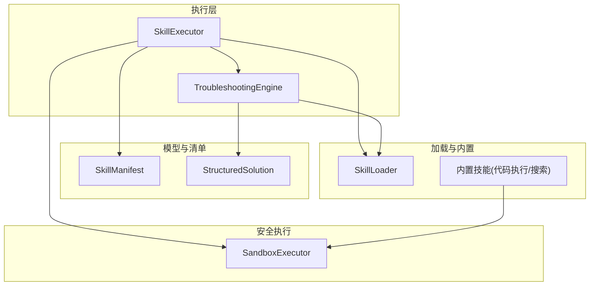
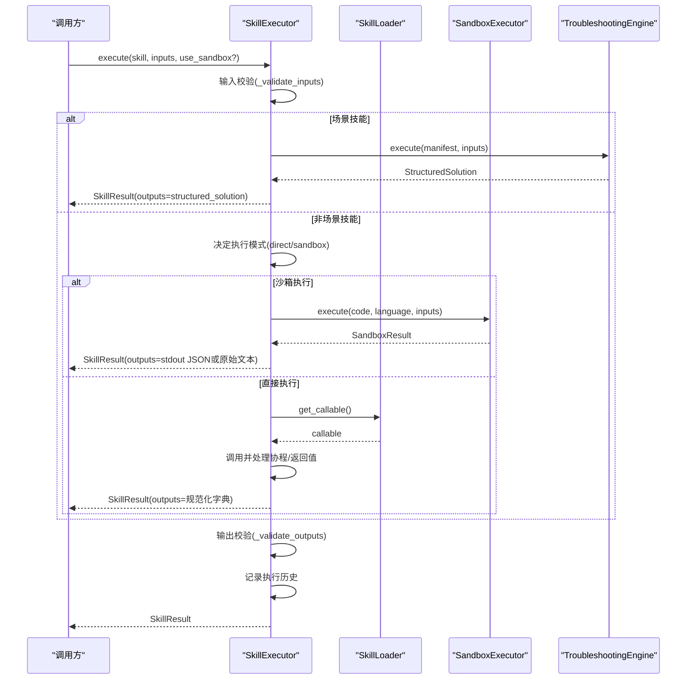
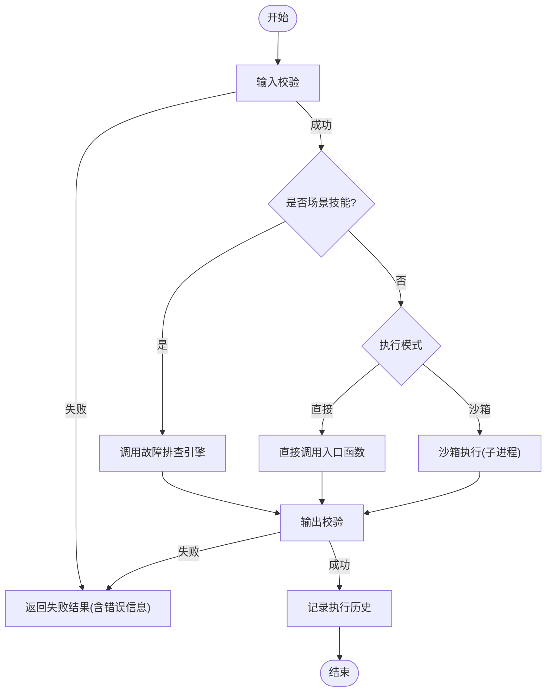
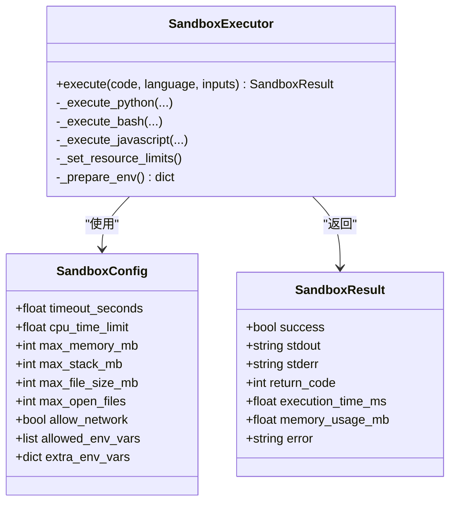
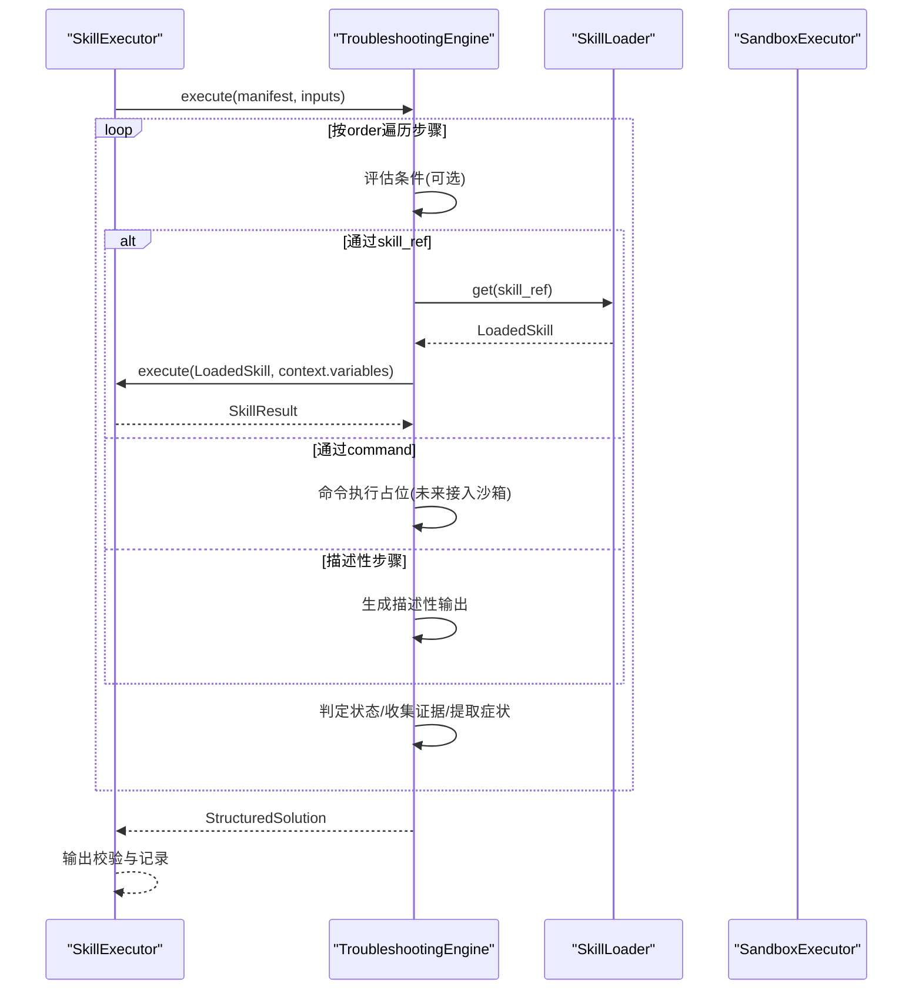
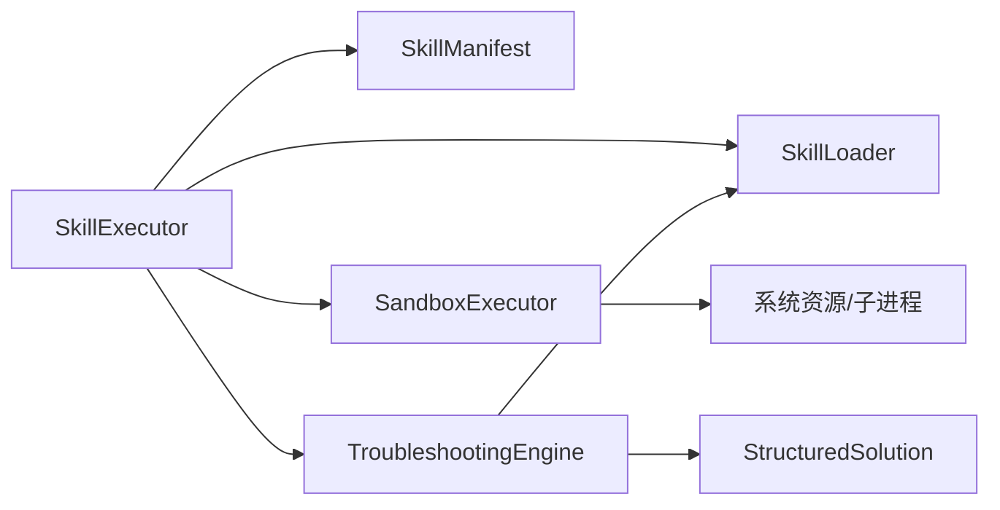

# 技能执行器

<cite>
**本文引用的文件**
- [executor.py](file://python/src/resolveagent/skills/executor.py)
- [sandbox.py](file://python/src/resolveagent/skills/sandbox.py)
- [manifest.py](file://python/src/resolveagent/skills/manifest.py)
- [loader.py](file://python/src/resolveagent/skills/loader.py)
- [solution.py](file://python/src/resolveagent/skills/solution.py)
- [troubleshoot.py](file://python/src/resolveagent/skills/troubleshoot.py)
- [code_exec.py](file://python/src/resolveagent/skills/builtin/code_exec.py)
- [web_search.py](file://python/src/resolveagent/skills/builtin/web_search.py)
- [k8s-pod-crash/manifest.yaml](file://skills/examples/k8s-pod-crash/manifest.yaml)
</cite>

## 目录
1. [简介](#简介)
2. [项目结构](#项目结构)
3. [核心组件](#核心组件)
4. [架构总览](#架构总览)
5. [详细组件分析](#详细组件分析)
6. [依赖关系分析](#依赖关系分析)
7. [性能与安全考量](#性能与安全考量)
8. [故障排查指南](#故障排查指南)
9. [结论](#结论)
10. [附录：使用与监控指南](#附录使用与监控指南)

## 简介
本技术文档围绕“技能执行器系统”展开，重点解析 SkillExecutor 的核心架构与执行流程，覆盖输入验证、输出验证、执行记录管理；对比直接执行与沙箱执行两种模式及其适用场景、性能与安全权衡；说明技能结果标准化处理、异常捕获与错误恢复机制；阐述场景技能（Scenario Skills）的特殊处理流程及与故障排查引擎的集成；并提供执行统计与监控功能的使用指南，包括成功率计算、平均执行时间与历史记录查询；最后介绍 SkillResult 的数据结构与使用方法。

## 项目结构
技能执行相关代码位于 Python 模块中，关键文件职责如下：
- executor.py：SkillExecutor 主入口，负责调度执行、输入/输出校验、执行历史与统计。
- sandbox.py：SandboxExecutor 提供进程隔离、资源限制、超时控制的安全执行环境。
- manifest.py：技能清单模型定义，包含通用技能与场景技能的元数据、参数、权限、执行模式等。
- loader.py：技能发现与加载，将 manifest 与入口函数装配为 LoadedSkill。
- solution.py：结构化解决方案模型（四要素），用于场景技能输出标准化。
- troubleshoot.py：轻量级故障排查引擎，按步骤顺序/条件执行并汇总结构化输出。
- builtin/*：内置技能示例（代码执行、网络搜索），展示如何复用沙箱能力。
- examples/*/manifest.yaml：示例技能清单，演示场景技能配置。

图表来源
- [executor.py:20-147](file://python/src/resolveagent/skills/executor.py#L20-L147)
- [sandbox.py:76-127](file://python/src/resolveagent/skills/sandbox.py#L76-L127)
- [manifest.py:95-116](file://python/src/resolveagent/skills/manifest.py#L95-L116)
- [solution.py:31-49](file://python/src/resolveagent/skills/solution.py#L31-L49)
- [troubleshoot.py:52-141](file://python/src/resolveagent/skills/troubleshoot.py#L52-L141)
- [loader.py:15-66](file://python/src/resolveagent/skills/loader.py#L15-L66)

章节来源
- [executor.py:20-147](file://python/src/resolveagent/skills/executor.py#L20-L147)
- [sandbox.py:76-127](file://python/src/resolveagent/skills/sandbox.py#L76-L127)
- [manifest.py:95-116](file://python/src/resolveagent/skills/manifest.py#L95-L116)
- [loader.py:15-66](file://python/src/resolveagent/skills/loader.py#L15-L66)

## 核心组件
- SkillExecutor：统一入口，负责输入校验、路由到直接/沙箱/场景执行、输出校验、执行记录与统计。
- SandboxExecutor：子进程隔离执行，支持 Python/Bash/JavaScript，具备 CPU/内存/文件/超时等限制。
- SkillManifest：描述技能类型、执行模式、参数/输出、权限、场景配置等。
- TroubleshootingEngine：按清单定义的步骤顺序/条件执行，收集证据并生成结构化解决方案。
- StructuredSolution：四要素标准化输出（问题现象、关键信息、排查步骤、解决方案）。
- SkillLoader：从目录加载 manifest 并动态导入入口函数，形成可执行单元。
- 内置技能：如代码执行、网络搜索，复用沙箱能力或外部 API。

章节来源
- [executor.py:20-147](file://python/src/resolveagent/skills/executor.py#L20-L147)
- [sandbox.py:76-127](file://python/src/resolveagent/skills/sandbox.py#L76-L127)
- [manifest.py:95-116](file://python/src/resolveagent/skills/manifest.py#L95-L116)
- [troubleshoot.py:52-141](file://python/src/resolveagent/skills/troubleshoot.py#L52-L141)
- [solution.py:31-49](file://python/src/resolveagent/skills/solution.py#L31-L49)
- [loader.py:15-66](file://python/src/resolveagent/skills/loader.py#L15-L66)

## 架构总览
SkillExecutor 作为编排中心，根据技能清单的类型与执行模式选择执行路径：
- 若为场景技能，则交由 TroubleshootingEngine 按步骤执行，最终产出 StructuredSolution。
- 否则根据 execution_mode 或默认策略选择直接执行或沙箱执行。
- 所有执行均进行输入/输出校验，并记录执行历史与耗时，便于统计与审计。

图表来源
- [executor.py:52-147](file://python/src/resolveagent/skills/executor.py#L52-L147)
- [sandbox.py:96-127](file://python/src/resolveagent/skills/sandbox.py#L96-L127)
- [troubleshoot.py:69-141](file://python/src/resolveagent/skills/troubleshoot.py#L69-L141)
- [loader.py:84-89](file://python/src/resolveagent/skills/loader.py#L84-L89)

## 详细组件分析

### SkillExecutor：执行编排与校验
- 输入校验：依据 manifest.parameters 检查必填项、类型、枚举值，并记录未知参数警告。
- 执行路由：
  - 场景技能：转交 TroubleshootingEngine，返回包含结构化解决方案的结果。
  - 直接执行：通过 LoadedSkill.get_callable 获取入口函数，支持同步/异步，自动规范化输出为字典。
  - 沙箱执行：读取入口文件代码，封装后在子进程中执行，解析 stdout JSON 或回退为原始文本。
- 输出校验：依据 manifest.outputs 校验必填项与类型。
- 执行记录：维护最近 1000 条记录，包含成功与否、耗时、时间戳与错误信息。
- 统计接口：get_execution_stats 返回总次数、成功率、平均耗时。

图表来源
- [executor.py:52-147](file://python/src/resolveagent/skills/executor.py#L52-L147)
- [executor.py:149-244](file://python/src/resolveagent/skills/executor.py#L149-L244)
- [executor.py:246-374](file://python/src/resolveagent/skills/executor.py#L246-L374)

章节来源
- [executor.py:52-147](file://python/src/resolveagent/skills/executor.py#L52-L147)
- [executor.py:149-244](file://python/src/resolveagent/skills/executor.py#L149-L244)
- [executor.py:246-374](file://python/src/resolveagent/skills/executor.py#L246-L374)

### 沙箱执行：进程隔离与资源限制
- 多语言支持：Python、Bash、JavaScript（Node.js）。
- 资源限制：CPU 时间、内存、栈大小、文件大小、打开文件数、可选网络隔离。
- 超时控制：基于 asyncio.wait_for 的超时，超时会终止子进程并返回超时错误。
- 环境变量：最小化默认环境，支持白名单与额外变量注入。
- 结果封装：SandboxResult 包含成功标志、标准输出/错误、返回码、耗时、内存占用与错误信息。

图表来源
- [sandbox.py:39-74](file://python/src/resolveagent/skills/sandbox.py#L39-L74)
- [sandbox.py:76-127](file://python/src/resolveagent/skills/sandbox.py#L76-L127)
- [sandbox.py:129-210](file://python/src/resolveagent/skills/sandbox.py#L129-L210)
- [sandbox.py:211-273](file://python/src/resolveagent/skills/sandbox.py#L211-L273)
- [sandbox.py:275-344](file://python/src/resolveagent/skills/sandbox.py#L275-L344)
- [sandbox.py:346-395](file://python/src/resolveagent/skills/sandbox.py#L346-L395)

章节来源
- [sandbox.py:39-74](file://python/src/resolveagent/skills/sandbox.py#L39-L74)
- [sandbox.py:76-127](file://python/src/resolveagent/skills/sandbox.py#L76-L127)
- [sandbox.py:129-210](file://python/src/resolveagent/skills/sandbox.py#L129-L210)
- [sandbox.py:211-273](file://python/src/resolveagent/skills/sandbox.py#L211-L273)
- [sandbox.py:275-344](file://python/src/resolveagent/skills/sandbox.py#L275-L344)
- [sandbox.py:346-395](file://python/src/resolveagent/skills/sandbox.py#L346-L395)

### 场景技能与故障排查引擎
- 触发条件：当 manifest.skill_type 为 SCENARIO 时，由 SkillExecutor 路由至 TroubleshootingEngine。
- 执行流程：
  - 按 order 排序步骤，依次执行 collect/diagnose/verify/action。
  - 支持条件分支（如 step_id.status == 'failed'），不满足则跳过并记录 skipped。
  - 每个步骤收集证据（DiagnosticEvidence），诊断失败时提取症状。
  - 最终综合为 StructuredSolution（四要素），并附带置信度、严重级别与元数据。
- 与 SkillExecutor 集成：SkillExecutor 将 StructuredSolution 序列化为 outputs 中的 structured_solution，并附带 Markdown 日志。

图表来源
- [executor.py:96-98](file://python/src/resolveagent/skills/executor.py#L96-L98)
- [executor.py:246-273](file://python/src/resolveagent/skills/executor.py#L246-L273)
- [troubleshoot.py:69-141](file://python/src/resolveagent/skills/troubleshoot.py#L69-L141)
- [troubleshoot.py:143-209](file://python/src/resolveagent/skills/troubleshoot.py#L143-L209)
- [troubleshoot.py:211-266](file://python/src/resolveagent/skills/troubleshoot.py#L211-L266)
- [troubleshoot.py:308-359](file://python/src/resolveagent/skills/troubleshoot.py#L308-L359)

章节来源
- [executor.py:96-98](file://python/src/resolveagent/skills/executor.py#L96-L98)
- [executor.py:246-273](file://python/src/resolveagent/skills/executor.py#L246-L273)
- [troubleshoot.py:69-141](file://python/src/resolveagent/skills/troubleshoot.py#L69-L141)
- [troubleshoot.py:143-209](file://python/src/resolveagent/skills/troubleshoot.py#L143-L209)
- [troubleshoot.py:211-266](file://python/src/resolveagent/skills/troubleshoot.py#L211-L266)
- [troubleshoot.py:308-359](file://python/src/resolveagent/skills/troubleshoot.py#L308-L359)

### 技能清单与加载
- SkillManifest：定义 name/version/entry_point/skill_type/execution_mode/parameters/outputs/permissions/scenario 等字段，并对场景技能进行约束校验。
- SkillLoader：从目录读取 manifest.yaml，解析 entry_point 为模块与函数名，动态导入得到可调用对象，缓存 LoadedSkill。

章节来源
- [manifest.py:16-116](file://python/src/resolveagent/skills/manifest.py#L16-L116)
- [loader.py:15-66](file://python/src/resolveagent/skills/loader.py#L15-L66)
- [loader.py:68-89](file://python/src/resolveagent/skills/loader.py#L68-L89)

### 内置技能示例
- 代码执行技能：封装 SandboxExecutor，支持 Python/Bash/JS 代码执行、表达式求值、函数调用等。
- 网络搜索技能：支持 Bing/Google/Searx/DuckDuckGo 多种后端，统一返回搜索结果列表或格式化摘要。

章节来源
- [code_exec.py:16-85](file://python/src/resolveagent/skills/builtin/code_exec.py#L16-L85)
- [code_exec.py:157-255](file://python/src/resolveagent/skills/builtin/code_exec.py#L157-L255)
- [web_search.py:32-101](file://python/src/resolveagent/skills/builtin/web_search.py#L32-L101)
- [web_search.py:103-305](file://python/src/resolveagent/skills/builtin/web_search.py#L103-L305)

## 依赖关系分析
- SkillExecutor 依赖：
  - manifest：读取 skill_type、execution_mode、parameters/outputs。
  - loader：获取入口函数（直接执行）。
  - sandbox：沙箱执行。
  - troubleshoot：场景技能执行。
  - solution：结构化输出模型。
- SandboxExecutor 依赖：
  - 系统资源限制（resource）、异步子进程（asyncio）、临时文件、JSON 序列化。
- TroubleshootingEngine 依赖：
  - manifest：读取 scenario.troubleshooting_flow。
  - loader：按需加载被引用的技能。
  - solution：构建 StructuredSolution。

图表来源
- [executor.py:52-147](file://python/src/resolveagent/skills/executor.py#L52-L147)
- [sandbox.py:96-127](file://python/src/resolveagent/skills/sandbox.py#L96-L127)
- [troubleshoot.py:69-141](file://python/src/resolveagent/skills/troubleshoot.py#L69-L141)
- [manifest.py:95-116](file://python/src/resolveagent/skills/manifest.py#L95-L116)

章节来源
- [executor.py:52-147](file://python/src/resolveagent/skills/executor.py#L52-L147)
- [sandbox.py:96-127](file://python/src/resolveagent/skills/sandbox.py#L96-L127)
- [troubleshoot.py:69-141](file://python/src/resolveagent/skills/troubleshoot.py#L69-L141)
- [manifest.py:95-116](file://python/src/resolveagent/skills/manifest.py#L95-L116)

## 性能与安全考量
- 直接执行 vs 沙箱执行
  - 直接执行：无进程创建开销，延迟低，适合可信、稳定的内部技能；需确保入口函数健壮且无副作用。
  - 沙箱执行：进程隔离、资源限制、超时控制，安全性高，但存在子进程启动与通信开销；适合不可信或第三方技能。
- 资源限制建议
  - 根据技能复杂度设置 timeout_seconds、cpu_time_limit、max_memory_mb。
  - 对网络敏感的技能，关闭 allow_network 或使用白名单域名。
- 性能优化
  - 批量执行时复用 SandboxExecutor 实例以减少重复初始化。
  - 合理拆分步骤，避免单步过长导致超时。
  - 对高频小任务优先采用直接执行。

[本节为通用指导，不直接分析具体文件]

## 故障排查指南
- 输入校验失败
  - 现象：返回 success=false，error 提示缺失必填参数或类型不符。
  - 排查：核对 manifest.parameters 的 required/type/enum，确认传入键名与类型一致。
- 输出校验失败
  - 现象：执行成功但输出校验失败，success=false。
  - 排查：核对 manifest.outputs 的 required/type，确保返回键名与类型匹配。
- 沙箱执行超时
  - 现象：stderr 显示 Execution timed out。
  - 排查：提高 timeout_seconds，或优化代码逻辑；检查是否存在死循环或阻塞 I/O。
- 沙箱执行内存超限
  - 现象：子进程被系统杀死或返回错误。
  - 排查：降低 max_memory_mb 或优化算法；避免大对象驻留。
- 场景技能步骤跳过
  - 现象：某步骤 status=skipped。
  - 排查：检查 condition 表达式是否正确引用前序步骤状态。
- 场景技能步骤失败
  - 现象：status=failed 或 error。
  - 排查：查看步骤输出与证据，定位外部依赖（API/命令）可用性。

章节来源
- [executor.py:80-93](file://python/src/resolveagent/skills/executor.py#L80-L93)
- [executor.py:114-120](file://python/src/resolveagent/skills/executor.py#L114-L120)
- [sandbox.py:181-192](file://python/src/resolveagent/skills/sandbox.py#L181-L192)
- [sandbox.py:250-261](file://python/src/resolveagent/skills/sandbox.py#L250-L261)
- [troubleshoot.py:113-130](file://python/src/resolveagent/skills/troubleshoot.py#L113-L130)
- [troubleshoot.py:196-209](file://python/src/resolveagent/skills/troubleshoot.py#L196-L209)

## 结论
SkillExecutor 提供了统一的技能执行框架，结合输入/输出校验、执行模式路由、沙箱隔离与场景技能编排，实现了安全、可控、可扩展的技能执行体系。通过结构化输出与执行统计，便于监控与运维。建议在可信环境下优先使用直接执行以获得更低延迟，在不可信或高风险场景下启用沙箱执行以保障系统安全。

[本节为总结性内容，不直接分析具体文件]

## 附录：使用与监控指南

### 执行统计与监控
- 成功率计算：get_execution_stats 返回 success_rate = 成功次数 / 总次数。
- 平均执行时间：average_duration_ms = 所有记录的 duration_ms 总和 / 总次数。
- 历史记录查询：内部维护最近 1000 条记录，可按需扩展持久化存储以便长期分析。

章节来源
- [executor.py:376-397](file://python/src/resolveagent/skills/executor.py#L376-L397)

### SkillResult 数据结构与使用
- 字段说明：
  - outputs：技能输出字典（场景技能时为结构化解决方案的字典形式）。
  - success：执行是否成功。
  - error：失败时的错误消息。
  - logs：执行日志或标准输出。
  - duration_ms：执行耗时（毫秒）。
  - solution：仅场景技能返回的 StructuredSolution 对象。
- 常用方法：
  - to_dict()：将结果序列化为字典，便于传输与存储。
- 使用建议：
  - 始终检查 success 与 error，再消费 outputs。
  - 对于场景技能，可通过 result.solution.to_markdown() 快速生成可读报告。

章节来源
- [executor.py:400-446](file://python/src/resolveagent/skills/executor.py#L400-L446)
- [solution.py:31-52](file://python/src/resolveagent/skills/solution.py#L31-L52)

### 场景技能清单示例
- k8s-pod-crash 清单展示了场景技能的典型配置：领域、标签、严重级别、排查步骤（collect/diagnose/verify/action）、输出模板等。
- 通过该清单，故障排查引擎会按顺序执行步骤，收集证据并生成四要素结构化方案。

章节来源
- [k8s-pod-crash/manifest.yaml:1-114](file://skills/examples/k8s-pod-crash/manifest.yaml#L1-L114)