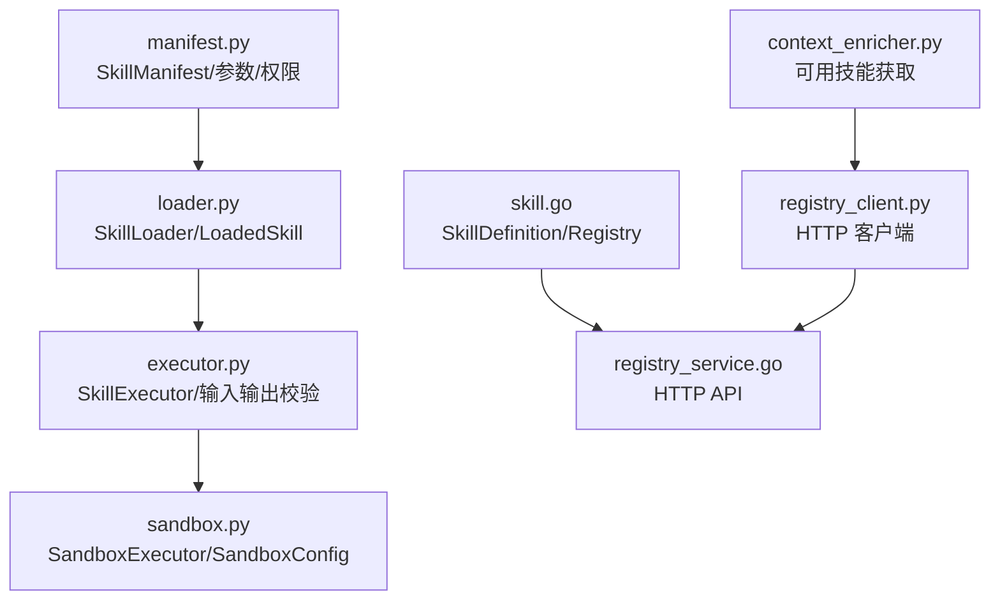
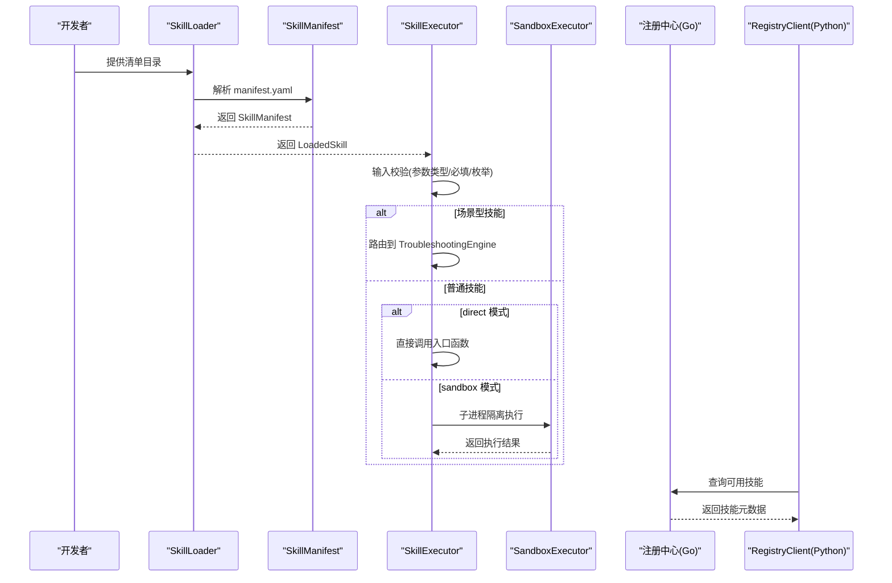
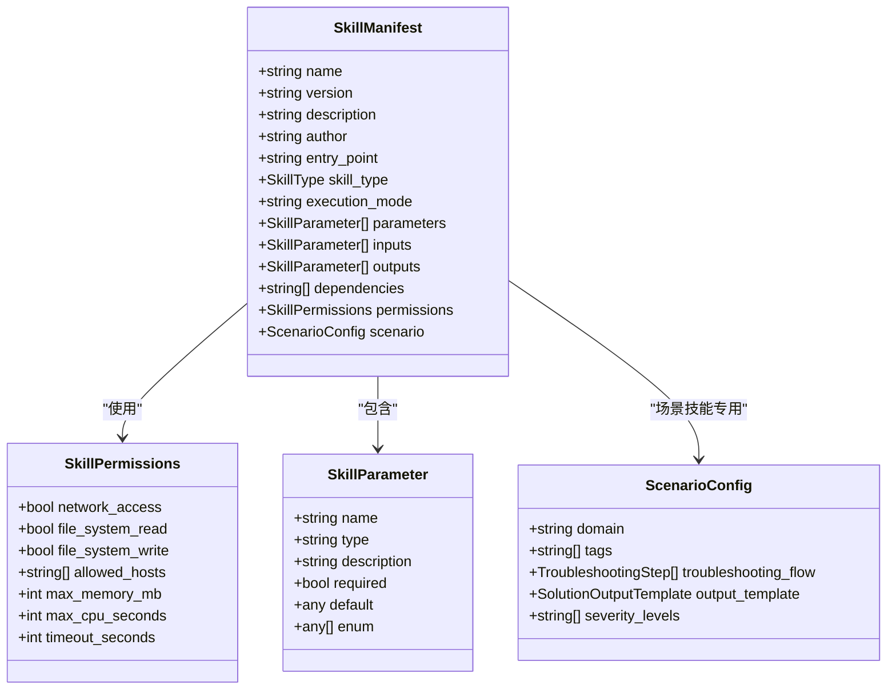
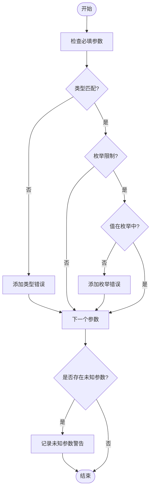
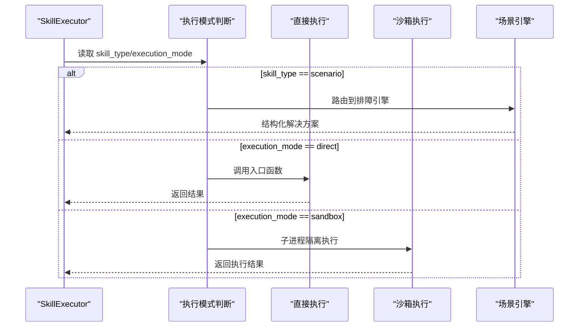
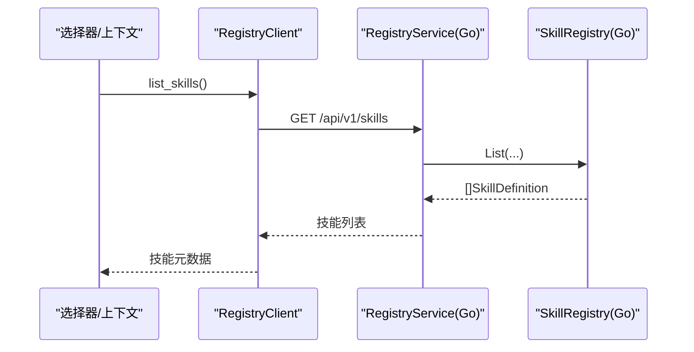
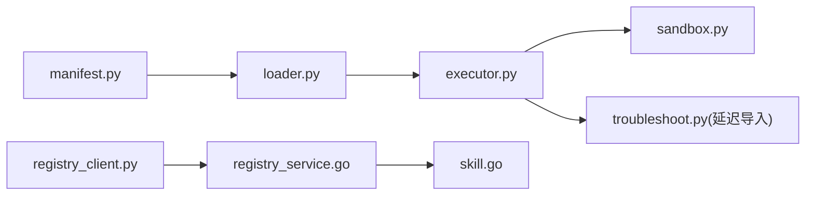

# 技能清单管理

<cite>
**本文引用的文件**
- [manifest.py](file://python/src/resolveagent/skills/manifest.py)
- [skill-manifest.schema.json](file://api/jsonschema/skill-manifest.schema.json)
- [loader.py](file://python/src/resolveagent/skills/loader.py)
- [executor.py](file://python/src/resolveagent/skills/executor.py)
- [sandbox.py](file://python/src/resolveagent/skills/sandbox.py)
- [skill.go](file://pkg/registry/skill.go)
- [registry_service.go](file://pkg/service/registry_service.go)
- [registry_client.py](file://python/src/resolveagent/runtime/registry_client.py)
- [context_enricher.py](file://python/src/resolveagent/selector/context_enricher.py)
- [skill-example.yaml](file://configs/examples/skill-example.yaml)
- [log-analyzer manifest.yaml](file://docs/demo/demo/skills/log-analyzer/manifest.yaml)
- [hello-world manifest.yaml](file://skills/examples/hello-world/manifest.yaml)
- [skill-system.md](file://docs/zh/skill-system.md)
</cite>

## 目录
1. [简介](#简介)
2. [项目结构](#项目结构)
3. [核心组件](#核心组件)
4. [架构总览](#架构总览)
5. [详细组件分析](#详细组件分析)
6. [依赖关系分析](#依赖关系分析)
7. [性能考量](#性能考量)
8. [故障排查指南](#故障排查指南)
9. [结论](#结论)
10. [附录](#附录)

## 简介
本技术文档围绕 ResolveAgent 的“技能清单管理系统”，系统性阐述 SkillManifest 的设计与实现，包括：
- 技能元数据结构、参数定义系统、输出规范与权限控制机制
- 技能清单 YAML 配置格式（名称、版本、类型、描述、参数列表、输出定义、执行模式等）
- 技能类型分类（general/scenario）与执行模式（direct/sandbox/mcp）
- 完整清单示例与最佳实践（参数验证规则、枚举限制、必填项）
- 技能注册中心工作机制与发现流程

## 项目结构
与技能清单管理相关的代码主要分布在以下模块：
- Python 侧：清单解析与校验（manifest.py）、加载器（loader.py）、执行器（executor.py）、沙箱执行（sandbox.py）
- Go 侧：注册表模型与服务（skill.go、registry_service.go）
- HTTP 客户端：Python 通过 registry_client.py 查询 Go 平台服务进行技能发现
- 文档与示例：JSON Schema、示例清单、中文用户文档

图表来源
- [manifest.py:95-116](file://python/src/resolveagent/skills/manifest.py#L95-L116)
- [loader.py:15-90](file://python/src/resolveagent/skills/loader.py#L15-L90)
- [executor.py:20-147](file://python/src/resolveagent/skills/executor.py#L20-L147)
- [sandbox.py:39-127](file://python/src/resolveagent/skills/sandbox.py#L39-L127)
- [skill.go:9-32](file://pkg/registry/skill.go#L9-L32)
- [registry_service.go:146-151](file://pkg/service/registry_service.go#L146-L151)
- [registry_client.py:117-145](file://python/src/resolveagent/runtime/registry_client.py#L117-L145)
- [context_enricher.py:273-293](file://python/src/resolveagent/selector/context_enricher.py#L273-L293)

章节来源
- [manifest.py:1-131](file://python/src/resolveagent/skills/manifest.py#L1-L131)
- [skill-manifest.schema.json:1-128](file://api/jsonschema/skill-manifest.schema.json#L1-L128)
- [loader.py:1-90](file://python/src/resolveagent/skills/loader.py#L1-L90)
- [executor.py:1-477](file://python/src/resolveagent/skills/executor.py#L1-L477)
- [sandbox.py:1-462](file://python/src/resolveagent/skills/sandbox.py#L1-L462)
- [skill.go:1-96](file://pkg/registry/skill.go#L1-L96)
- [registry_service.go:100-151](file://pkg/service/registry_service.go#L100-L151)
- [registry_client.py:117-323](file://python/src/resolveagent/runtime/registry_client.py#L117-L323)
- [context_enricher.py:273-293](file://python/src/resolveagent/selector/context_enricher.py#L273-L293)

## 核心组件
- SkillManifest：声明式清单的运行时模型，承载技能身份、接口契约、安全契约与场景配置
- SkillParameter / SkillPermissions：参数与权限的数据模型
- SkillLoader：从本地目录或远程源加载并解析清单，构建可执行对象
- SkillExecutor：统一入口，负责输入/输出校验、执行路由（直接/沙箱/场景）、结果记录
- SandboxExecutor：进程隔离、资源限制、超时控制的受控执行环境
- 注册中心（Go）：SkillDefinition 与 InMemorySkillRegistry，提供注册/查询/按类型筛选能力
- 注册中心客户端（Python）：HTTP 客户端，缓存并拉取已注册技能信息

章节来源
- [manifest.py:28-116](file://python/src/resolveagent/skills/manifest.py#L28-L116)
- [loader.py:15-90](file://python/src/resolveagent/skills/loader.py#L15-L90)
- [executor.py:20-147](file://python/src/resolveagent/skills/executor.py#L20-L147)
- [sandbox.py:39-127](file://python/src/resolveagent/skills/sandbox.py#L39-L127)
- [skill.go:9-32](file://pkg/registry/skill.go#L9-L32)
- [registry_client.py:117-145](file://python/src/resolveagent/runtime/registry_client.py#L117-L145)

## 架构总览
技能清单在系统中的流转如下：
- 开发阶段：编写 manifest.yaml，定义 name/version/entry_point/inputs/outputs/permissions 等
- 加载阶段：SkillLoader 读取清单并解析为 SkillManifest，构造 LoadedSkill
- 执行阶段：SkillExecutor 根据 skill_type 与 execution_mode 选择执行路径（direct/sandbox/scenario），并进行输入/输出校验
- 注册与发现：Go 注册中心维护 SkillDefinition；Python 通过 RegistryClient 查询可用技能

图表来源
- [loader.py:27-57](file://python/src/resolveagent/skills/loader.py#L27-L57)
- [manifest.py:95-116](file://python/src/resolveagent/skills/manifest.py#L95-L116)
- [executor.py:52-147](file://python/src/resolveagent/skills/executor.py#L52-L147)
- [sandbox.py:96-127](file://python/src/resolveagent/skills/sandbox.py#L96-L127)
- [registry_client.py:285-323](file://python/src/resolveagent/runtime/registry_client.py#L285-L323)
- [registry_service.go:146-151](file://pkg/service/registry_service.go#L146-L151)

## 详细组件分析

### SkillManifest 设计
- 字段与约束
  - 必需字段：name、version、entry_point（由 JSON Schema 强制）
  - 可选字段：description、author、skill_type、execution_mode、parameters、inputs、outputs、dependencies、permissions、scenario
  - 名称正则：小写字母开头，仅允许小写字母/数字/连字符
  - 版本号：三段式语义化版本
- 类型与模式
  - skill_type：general（通用工具）或 scenario（排障场景）
  - execution_mode：direct（直接执行）、sandbox（沙箱执行）、mcp（通过 MCP 协议调用外部工具）
- 场景配置
  - scenario 块包含 domain、tags、troubleshooting_flow、output_template、severity_levels
  - 当 skill_type=scenario 时，必须提供 scenario 配置（Pydantic 校验）

图表来源
- [manifest.py:28-116](file://python/src/resolveagent/skills/manifest.py#L28-L116)
- [skill-manifest.schema.json:7-56](file://api/jsonschema/skill-manifest.schema.json#L7-L56)

章节来源
- [manifest.py:95-116](file://python/src/resolveagent/skills/manifest.py#L95-L116)
- [skill-manifest.schema.json:1-128](file://api/jsonschema/skill-manifest.schema.json#L1-L128)

### 参数定义系统与验证
- 参数类型支持：string、number、boolean、object、array
- 必填项：required=true 表示必须提供
- 默认值：default 用于未提供时的回退
- 枚举限制：enum 限定取值集合
- 输入校验：SkillExecutor._validate_inputs 检查必填、类型、枚举，并记录未知参数警告
- 输出校验：SkillExecutor._validate_outputs 检查必需输出与类型

图表来源
- [executor.py:149-202](file://python/src/resolveagent/skills/executor.py#L149-L202)

章节来源
- [executor.py:149-202](file://python/src/resolveagent/skills/executor.py#L149-L202)
- [skill-manifest.schema.json:58-68](file://api/jsonschema/skill-manifest.schema.json#L58-L68)

### 输出规范
- 输出参数定义：name、type、required、description
- 输出校验：确保必需输出存在且类型正确
- 结构化输出：对于场景型技能，执行器会返回 StructuredSolution（四要素：症状、关键信息、排障步骤、解决方案）

章节来源
- [executor.py:204-244](file://python/src/resolveagent/skills/executor.py#L204-L244)
- [executor.py:246-273](file://python/src/resolveagent/skills/executor.py#L246-L273)

### 权限控制机制
- 权限字段：network_access、file_system_read、file_system_write、allowed_hosts、max_memory_mb、max_cpu_seconds、timeout_seconds
- 默认策略：网络访问默认关闭，内存/CPU/超时均有合理默认值
- 沙箱映射：权限影响 SandboxConfig（如 allow_network、资源上限）
- 审核提示：安装/启用时会展示请求的权限，便于审计

章节来源
- [manifest.py:28-38](file://python/src/resolveagent/skills/manifest.py#L28-L38)
- [sandbox.py:39-60](file://python/src/resolveagent/skills/sandbox.py#L39-L60)
- [skill-system.md:161-218](file://docs/zh/skill-system.md#L161-L218)

### 执行模式与路由
- direct：直接调用入口函数（适用于可信/内部技能）
- sandbox：子进程隔离执行，限制 CPU/内存/文件/网络，支持 Python/Bash/JavaScript
- mcp：通过 Model Context Protocol 调用外部工具（需配置 MCP Server）
- 路由逻辑：
  - 若 skill_type=scenario，优先走 TroubleshootingEngine
  - 否则根据 execution_mode 决定 direct 或 sandbox
  - 可通过 use_sandbox 覆盖默认行为

图表来源
- [executor.py:52-147](file://python/src/resolveagent/skills/executor.py#L52-L147)
- [sandbox.py:96-127](file://python/src/resolveagent/skills/sandbox.py#L96-L127)

章节来源
- [executor.py:52-147](file://python/src/resolveagent/skills/executor.py#L52-L147)
- [sandbox.py:96-127](file://python/src/resolveagent/skills/sandbox.py#L96-L127)
- [skill-system.md:707-773](file://docs/zh/skill-system.md#L707-L773)

### 技能清单 YAML 配置格式
- 顶层字段
  - name：唯一标识（小写+连字符）
  - version：语义化版本
  - description：功能描述
  - author：作者
  - entry_point：模块:函数
  - skill_type：general 或 scenario
  - execution_mode：direct | sandbox | mcp
  - inputs/outputs：参数数组
  - dependencies：依赖包列表
  - permissions：权限块
  - scenario：场景配置（仅 scenario 类型）
- 参数项字段
  - name、type、description、required、default、enum
- 示例参考
  - 示例清单：[skill-example.yaml](file://configs/examples/skill-example.yaml)
  - 日志分析清单：[log-analyzer manifest.yaml](file://docs/demo/demo/skills/log-analyzer/manifest.yaml)
  - 最小清单：[hello-world manifest.yaml](file://skills/examples/hello-world/manifest.yaml)

章节来源
- [skill-manifest.schema.json:7-56](file://api/jsonschema/skill-manifest.schema.json#L7-L56)
- [skill-example.yaml:1-23](file://configs/examples/skill-example.yaml#L1-L23)
- [log-analyzer manifest.yaml:1-64](file://docs/demo/demo/skills/log-analyzer/manifest.yaml#L1-L64)
- [hello-world manifest.yaml:1-21](file://skills/examples/hello-world/manifest.yaml#L1-L21)

### 技能注册中心与发现流程
- 注册中心（Go）
  - SkillDefinition：存储 name、version、description、author、skill_type、domain、tags、manifest、source_type、source_uri、status、labels
  - InMemorySkillRegistry：内存实现，提供 Register/Get/List/Unregister/ListByType
- 服务层（Go）
  - RegistryService.GetSkill：按名称获取技能
- 客户端（Python）
  - RegistryClient：HTTP 客户端，连接 Go 平台服务，缓存技能信息，提供 list_skills/get_skill
- 发现流程
  - 上下文增强器通过 RegistryClient 查询可用技能，并转换为前端/选择器可用的结构

图表来源
- [context_enricher.py:273-293](file://python/src/resolveagent/selector/context_enricher.py#L273-L293)
- [registry_client.py:305-323](file://python/src/resolveagent/runtime/registry_client.py#L305-L323)
- [registry_service.go:146-151](file://pkg/service/registry_service.go#L146-L151)
- [skill.go:25-32](file://pkg/registry/skill.go#L25-L32)

章节来源
- [skill.go:9-96](file://pkg/registry/skill.go#L9-L96)
- [registry_service.go:146-151](file://pkg/service/registry_service.go#L146-L151)
- [registry_client.py:117-323](file://python/src/resolveagent/runtime/registry_client.py#L117-L323)
- [context_enricher.py:273-293](file://python/src/resolveagent/selector/context_enricher.py#L273-L293)

## 依赖关系分析
- 模块耦合
  - executor 强依赖 manifest（参数/权限/类型）与 sandbox（受控执行）
  - loader 依赖 manifest 解析并生成 LoadedSkill
  - 注册中心（Go）与客户端（Python）通过 HTTP 解耦
- 外部依赖
  - PyYAML：清单解析
  - Pydantic：运行时校验
  - asyncio/subprocess：沙箱进程隔离
- 潜在循环依赖
  - 无直接循环；场景技能执行通过延迟导入避免循环

图表来源
- [executor.py:246-273](file://python/src/resolveagent/skills/executor.py#L246-L273)
- [registry_client.py:117-145](file://python/src/resolveagent/runtime/registry_client.py#L117-L145)
- [registry_service.go:146-151](file://pkg/service/registry_service.go#L146-L151)
- [skill.go:9-32](file://pkg/registry/skill.go#L9-L32)

章节来源
- [executor.py:246-273](file://python/src/resolveagent/skills/executor.py#L246-L273)
- [registry_client.py:117-145](file://python/src/resolveagent/runtime/registry_client.py#L117-L145)

## 性能考量
- 输入/输出校验开销：在每次执行前进行，建议复用清单以减少重复解析
- 沙箱执行成本：子进程创建与资源限制带来额外开销，适合不可信代码
- 缓存策略：RegistryClient 对技能元数据进行 TTL 缓存，减少网络请求
- 超时与资源限制：通过 SandboxConfig 控制 CPU/内存/时间，防止资源耗尽

章节来源
- [executor.py:52-147](file://python/src/resolveagent/skills/executor.py#L52-L147)
- [sandbox.py:39-60](file://python/src/resolveagent/skills/sandbox.py#L39-L60)
- [registry_client.py:117-145](file://python/src/resolveagent/runtime/registry_client.py#L117-L145)

## 故障排查指南
- 清单校验失败
  - 检查 name/version/entry_point 是否满足 JSON Schema 要求
  - 确认 scenario 类型必须包含 scenario 配置块
- 输入校验失败
  - 核对必填参数是否提供
  - 检查类型与枚举是否匹配
- 输出校验失败
  - 确保所有 required 输出均返回且类型正确
- 沙箱执行异常
  - 检查超时、内存、CPU 限制是否过紧
  - 查看 stderr 与 error 字段定位问题
- 注册中心查询失败
  - 确认 RegistryClient 地址与超时配置
  - 检查 Go 服务是否正常运行

章节来源
- [manifest.py:112-116](file://python/src/resolveagent/skills/manifest.py#L112-L116)
- [executor.py:80-93](file://python/src/resolveagent/skills/executor.py#L80-L93)
- [executor.py:204-244](file://python/src/resolveagent/skills/executor.py#L204-L244)
- [sandbox.py:165-192](file://python/src/resolveagent/skills/sandbox.py#L165-L192)
- [registry_client.py:285-323](file://python/src/resolveagent/runtime/registry_client.py#L285-L323)

## 结论
SkillManifest 作为技能系统的契约核心，将身份、接口与安全策略集中声明，并通过严格的 JSON Schema 与 Pydantic 校验保障一致性。SkillExecutor 提供统一的执行入口，支持 direct/sandbox/mcp 多种模式，适配不同信任等级与运行环境。注册中心与客户端协作完成技能的注册与发现，使技能生态具备可扩展性与可治理性。遵循本文的最佳实践与配置规范，可有效提升技能的可维护性与安全性。

## 附录
- 最佳实践
  - 最小权限原则：仅申请必要的网络/文件访问
  - 明确输入输出：使用 enum 与 required 强化契约
  - 场景技能：完善 troubleshooting_flow 与 output_template
  - 沙箱执行：合理设置 timeout、max_memory_mb、max_cpu_seconds
- 参考示例
  - 网络搜索示例：[skill-example.yaml](file://configs/examples/skill-example.yaml)
  - 日志分析示例：[log-analyzer manifest.yaml](file://docs/demo/demo/skills/log-analyzer/manifest.yaml)
  - 最小示例：[hello-world manifest.yaml](file://skills/examples/hello-world/manifest.yaml)
- 相关文档
  - 中文技能系统文档：[skill-system.md](file://docs/zh/skill-system.md)