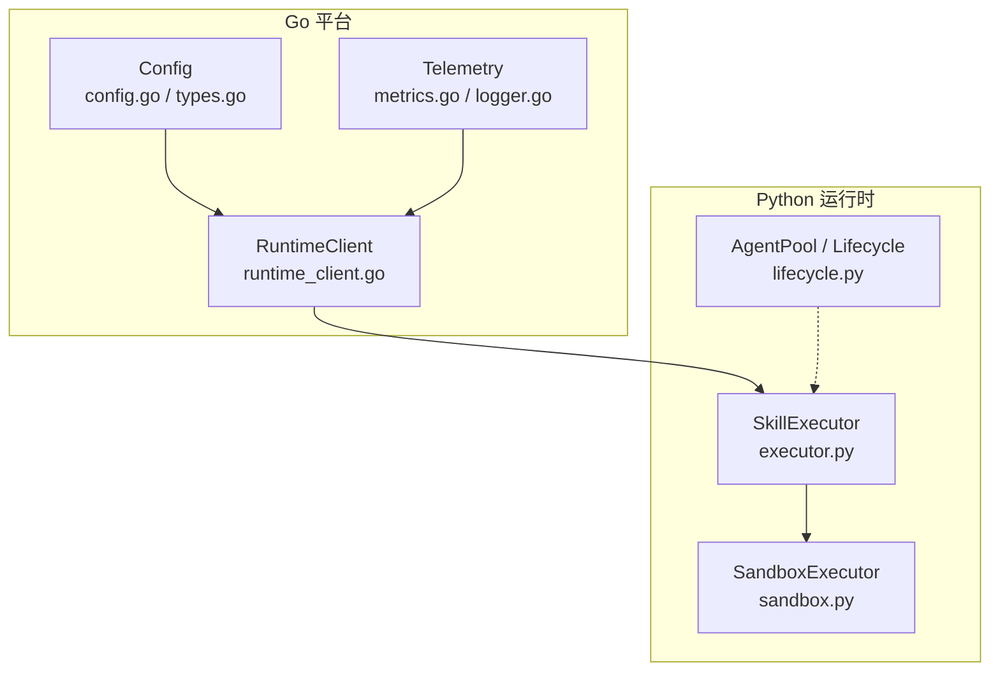
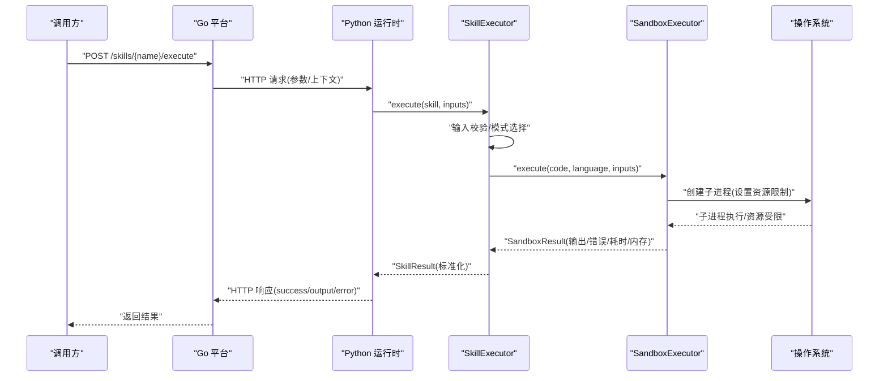
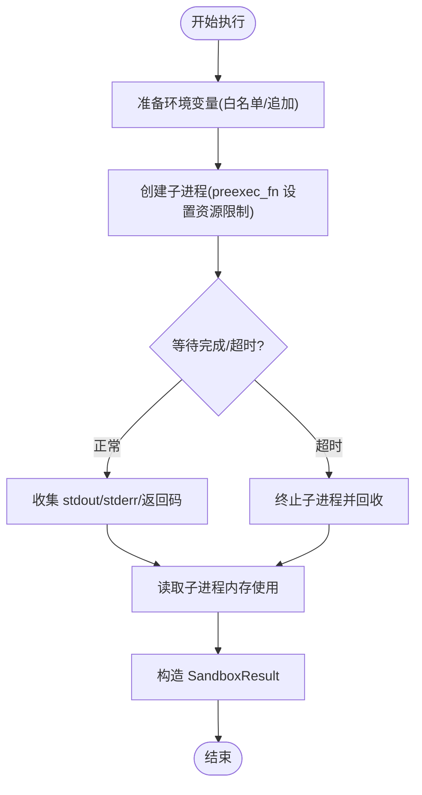
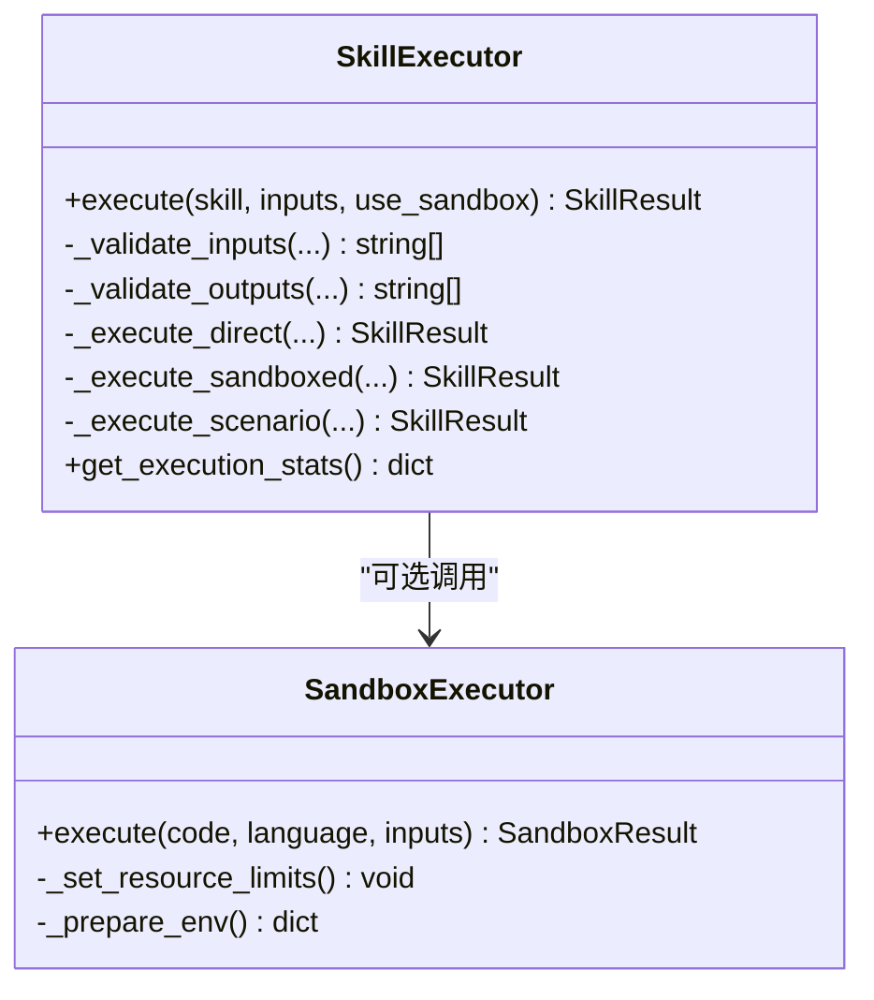
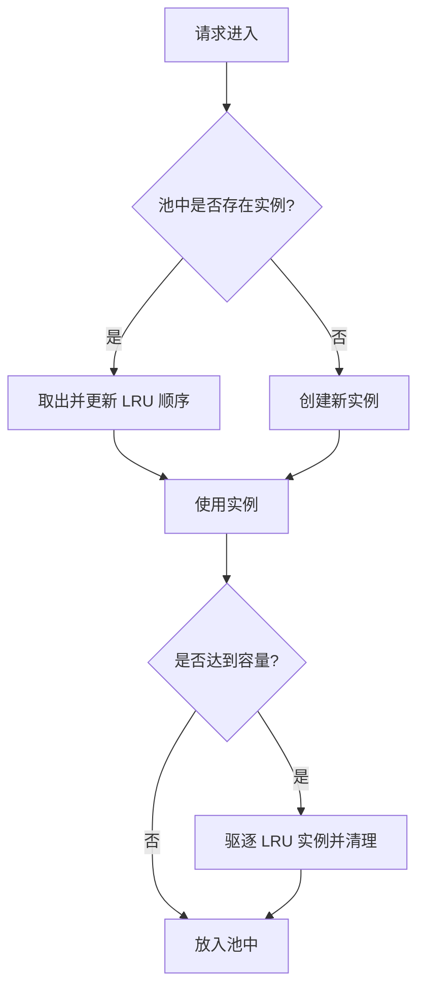
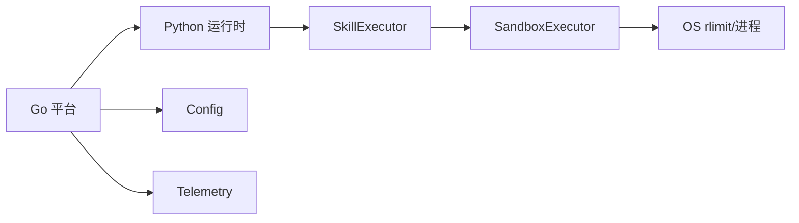

# 沙箱执行环境

<cite>
**本文引用的文件**
- [sandbox.py](file://python/src/resolveagent/skills/sandbox.py)
- [executor.py](file://python/src/resolveagent/skills/executor.py)
- [lifecycle.py](file://python/src/resolveagent/runtime/lifecycle.py)
- [runtime_client.go](file://pkg/server/runtime_client.go)
- [config.go](file://pkg/config/config.go)
- [types.go](file://pkg/config/types.go)
- [metrics.go](file://pkg/telemetry/metrics.go)
- [logger.go](file://pkg/telemetry/logger.go)
</cite>

## 目录
1. [简介](#简介)
2. [项目结构](#项目结构)
3. [核心组件](#核心组件)
4. [架构总览](#架构总览)
5. [详细组件分析](#详细组件分析)
6. [依赖关系分析](#依赖关系分析)
7. [性能考量](#性能考量)
8. [故障排查指南](#故障排查指南)
9. [结论](#结论)
10. [附录](#附录)

## 简介
本技术文档围绕“沙箱执行环境”展开，聚焦于不可信代码的安全隔离执行。文档重点说明：
- SandboxExecutor 的设计原理与实现架构（进程隔离、资源限制、安全策略）
- SandboxConfig 配置项（内存、CPU、时间、文件系统、网络、环境变量）
- 从代码注入到结果提取的完整执行流程
- 沙箱启动与销毁机制、多实例管理与资源池化策略
- 监控与调试方法（日志、指标、诊断）
- 安全策略与最佳实践（恶意代码防护、资源滥用防范）

## 项目结构
与沙箱执行相关的关键位置如下：
- Python 侧提供沙箱执行器与技能执行编排：
  - python/src/resolveagent/skills/sandbox.py：SandboxConfig、SandboxResult、SandboxExecutor、SecureSandbox
  - python/src/resolveagent/skills/executor.py：SkillExecutor（输入输出校验、直接执行或沙箱执行、统计记录）
  - python/src/resolveagent/runtime/lifecycle.py：AgentPool/LifecycleManager（LRU 池与生命周期管理）
- Go 侧提供运行时客户端与平台配置、遥测：
  - pkg/server/runtime_client.go：调用 Python 运行时的技能执行接口
  - pkg/config/config.go、types.go：平台配置加载与类型定义
  - pkg/telemetry/metrics.go、logger.go：指标与结构化日志

图表来源
- [sandbox.py:76-461](file://python/src/resolveagent/skills/sandbox.py#L76-L461)
- [executor.py:20-374](file://python/src/resolveagent/skills/executor.py#L20-L374)
- [lifecycle.py:12-93](file://python/src/resolveagent/runtime/lifecycle.py#L12-L93)
- [runtime_client.go:341-384](file://pkg/server/runtime_client.go#L341-L384)
- [config.go:11-96](file://pkg/config/config.go#L11-L96)
- [types.go:5-36](file://pkg/config/types.go#L5-L36)
- [metrics.go:94-189](file://pkg/telemetry/metrics.go#L94-L189)
- [logger.go:8-35](file://pkg/telemetry/logger.go#L8-L35)

章节来源
- [sandbox.py:76-461](file://python/src/resolveagent/skills/sandbox.py#L76-L461)
- [executor.py:20-374](file://python/src/resolveagent/skills/executor.py#L20-L374)
- [lifecycle.py:12-93](file://python/src/resolveagent/runtime/lifecycle.py#L12-L93)
- [runtime_client.go:341-384](file://pkg/server/runtime_client.go#L341-L384)
- [config.go:11-96](file://pkg/config/config.go#L11-L96)
- [types.go:5-36](file://pkg/config/types.go#L5-L36)
- [metrics.go:94-189](file://pkg/telemetry/metrics.go#L94-L189)
- [logger.go:8-35](file://pkg/telemetry/logger.go#L8-L35)

## 核心组件
- SandboxConfig：定义沙箱的资源与安全边界（超时、CPU、内存、栈、文件大小、打开文件数、网络访问、环境变量白名单/附加变量）。
- SandboxResult：封装执行结果（成功标志、标准输出/错误、返回码、耗时、内存使用、错误信息）。
- SandboxExecutor：基于子进程隔离执行 Python/Bash/JavaScript 代码；在子进程中设置系统级资源限制；支持超时控制与环境裁剪。
- SecureSandbox：扩展的沙箱类，预留 chroot/网络命名空间/seccomp-bpf 等增强能力（当前默认委托基础沙箱）。
- SkillExecutor：技能执行编排层，负责输入/输出校验、选择直接执行或沙箱执行、结果归一化与执行历史统计。
- AgentPool/LifecycleManager：LRU 缓存与生命周期管理，用于多实例复用与清理。
- RuntimeClient：Go 平台通过 HTTP 调用 Python 运行时执行技能。
- Telemetry：结构化日志与 Prometheus 指标采集，支撑可观测性。

章节来源
- [sandbox.py:39-74](file://python/src/resolveagent/skills/sandbox.py#L39-L74)
- [sandbox.py:76-461](file://python/src/resolveagent/skills/sandbox.py#L76-L461)
- [executor.py:20-374](file://python/src/resolveagent/skills/executor.py#L20-L374)
- [lifecycle.py:12-93](file://python/src/resolveagent/runtime/lifecycle.py#L12-L93)
- [runtime_client.go:341-384](file://pkg/server/runtime_client.go#L341-L384)
- [metrics.go:94-189](file://pkg/telemetry/metrics.go#L94-L189)
- [logger.go:8-35](file://pkg/telemetry/logger.go#L8-L35)

## 架构总览
下图展示了从平台发起技能执行到沙箱内代码执行的端到端流程，以及资源限制、超时、日志与指标的落点。

图表来源
- [runtime_client.go:341-384](file://pkg/server/runtime_client.go#L341-L384)
- [executor.py:52-147](file://python/src/resolveagent/skills/executor.py#L52-L147)
- [sandbox.py:96-204](file://python/src/resolveagent/skills/sandbox.py#L96-L204)

## 详细组件分析

### SandboxConfig 与 SandboxResult
- SandboxConfig 关键参数
  - 时间限制：timeout_seconds（整体超时）、cpu_time_limit（CPU 时间上限）
  - 内存限制：max_memory_mb（地址空间限制）、max_stack_mb（栈大小）
  - 文件系统限制：max_file_size_mb（单文件大小）、max_open_files（最大打开文件描述符）
  - 网络访问：allow_network（默认关闭）
  - 环境变量：allowed_env_vars（白名单）、extra_env_vars（追加变量）
- SandboxResult 关键字段
  - success、stdout、stderr、return_code、execution_time_ms、memory_usage_mb、error

章节来源
- [sandbox.py:39-74](file://python/src/resolveagent/skills/sandbox.py#L39-L74)

### SandboxExecutor：进程隔离与资源限制
- 语言支持：Python、Bash、JavaScript（Node.js）
- 执行路径
  - Python：将用户代码包装为临时脚本，传入 inputs 并执行
  - Bash：将 inputs 导出为环境变量后执行 shell 命令
  - JavaScript：生成临时 JS 文件并通过 node 执行
- 资源限制（子进程 preexec_fn）
  - CPU 时间限制（RLIMIT_CPU）
  - 地址空间限制（RLIMIT_AS）
  - 栈大小限制（RLIMIT_STACK）
  - 文件大小限制（RLIMIT_FSIZE）
  - 打开文件数限制（RLIMIT_NOFILE）
  - 禁止 core dump（RLIMIT_CORE）
- 超时控制：asyncio.wait_for(proc.communicate(), timeout=...)
- 环境准备：最小化 PATH/HOME/LANG，按白名单过滤环境变量，并可追加额外变量
- 内存使用度量：读取子进程最大驻留内存（跨平台差异处理）

图表来源
- [sandbox.py:96-204](file://python/src/resolveagent/skills/sandbox.py#L96-L204)
- [sandbox.py:346-378](file://python/src/resolveagent/skills/sandbox.py#L346-L378)
- [sandbox.py:379-395](file://python/src/resolveagent/skills/sandbox.py#L379-L395)

章节来源
- [sandbox.py:96-204](file://python/src/resolveagent/skills/sandbox.py#L96-L204)
- [sandbox.py:211-273](file://python/src/resolveagent/skills/sandbox.py#L211-L273)
- [sandbox.py:275-344](file://python/src/resolveagent/skills/sandbox.py#L275-L344)
- [sandbox.py:346-395](file://python/src/resolveagent/skills/sandbox.py#L346-L395)

### SkillExecutor：编排与校验
- 输入/输出校验：依据技能清单中的参数/输出定义进行类型与枚举校验
- 执行模式：根据清单 execution_mode 或全局 use_sandbox 决定直接执行或沙箱执行
- 场景技能：走 TroubleshootingEngine 生成结构化解决方案
- 结果归一化：统一为 SkillResult（包含 outputs、success、error、duration_ms、logs）
- 执行历史：维护最近 N 条记录，提供统计查询

图表来源
- [executor.py:20-374](file://python/src/resolveagent/skills/executor.py#L20-L374)
- [sandbox.py:76-461](file://python/src/resolveagent/skills/sandbox.py#L76-L461)

章节来源
- [executor.py:52-147](file://python/src/resolveagent/skills/executor.py#L52-L147)
- [executor.py:149-244](file://python/src/resolveagent/skills/executor.py#L149-L244)
- [executor.py:246-374](file://python/src/resolveagent/skills/executor.py#L246-L374)

### 安全增强：SecureSandbox
- 设计目标：在基础沙箱之上增加文件系统隔离（chroot）、网络命名空间隔离、seccomp-bpf 系统调用过滤
- 当前实现：默认委托给基础沙箱执行，预留扩展入口

章节来源
- [sandbox.py:439-461](file://python/src/resolveagent/skills/sandbox.py#L439-L461)

### 多实例管理与资源池化
- AgentPool：LRU 缓存，容量达到上限时驱逐最久未使用的实例，并在驱逐时尝试调用 cleanup
- AgentLifecycleManager：统一管理实例的创建、获取、移除与生命周期钩子

图表来源
- [lifecycle.py:12-93](file://python/src/resolveagent/runtime/lifecycle.py#L12-L93)

章节来源
- [lifecycle.py:12-93](file://python/src/resolveagent/runtime/lifecycle.py#L12-L93)

### 平台集成与配置
- RuntimeClient：通过 HTTP 调用 Python 运行时的 /skills/{name}/execute 接口，序列化请求体并解析响应
- Config：集中式配置加载（YAML/环境变量），含服务端口、数据库、Redis、NATS、网关、遥测等默认值与敏感字段校验

章节来源
- [runtime_client.go:341-384](file://pkg/server/runtime_client.go#L341-L384)
- [config.go:11-96](file://pkg/config/config.go#L11-L96)
- [types.go:5-36](file://pkg/config/types.go#L5-L36)

## 依赖关系分析
- SkillExecutor 依赖 SandboxExecutor 以执行不可信代码；同时依赖技能清单进行输入/输出校验
- SandboxExecutor 依赖操作系统资源限制能力（rlimit）与异步子进程管理
- Go 平台通过 RuntimeClient 与 Python 运行时通信；配置由 Config 统一加载
- Telemetry 提供结构化日志与 Prometheus 指标，便于监控与排障

图表来源
- [executor.py:20-374](file://python/src/resolveagent/skills/executor.py#L20-L374)
- [sandbox.py:76-461](file://python/src/resolveagent/skills/sandbox.py#L76-L461)
- [runtime_client.go:341-384](file://pkg/server/runtime_client.go#L341-L384)
- [config.go:11-96](file://pkg/config/config.go#L11-L96)
- [metrics.go:94-189](file://pkg/telemetry/metrics.go#L94-L189)

章节来源
- [executor.py:20-374](file://python/src/resolveagent/skills/executor.py#L20-L374)
- [sandbox.py:76-461](file://python/src/resolveagent/skills/sandbox.py#L76-L461)
- [runtime_client.go:341-384](file://pkg/server/runtime_client.go#L341-L384)
- [config.go:11-96](file://pkg/config/config.go#L11-L96)
- [metrics.go:94-189](file://pkg/telemetry/metrics.go#L94-L189)

## 性能考量
- 子进程开销：每次执行都会创建子进程，适合短时任务；高频调用建议结合池化与预热
- 资源限制：合理设置 RLIMIT_* 避免 OOM/CPU 耗尽；注意不同平台的单位差异（如 macOS 与 Linux 的内存单位）
- 超时控制：设置合理的 timeout_seconds，防止长尾任务阻塞
- 环境变量裁剪：仅暴露必要变量，减少污染与安全风险
- 指标观测：利用 Prometheus 指标与结构化日志跟踪延迟、成功率与资源使用

[本节为通用指导，不直接分析具体文件]

## 故障排查指南
- 常见失败原因
  - 超时：检查 timeout_seconds 与 cpu_time_limit 是否过小；查看 stderr 中是否有“Execution timed out”
  - 资源限制触发：检查 max_memory_mb、max_stack_mb、max_file_size_mb、max_open_files 是否过紧
  - 环境变量缺失：确认 allowed_env_vars 与 extra_env_vars 是否正确配置
  - Node.js 缺失：JavaScript 执行会因找不到 node 而失败
- 定位手段
  - 日志：启用结构化日志（JSON 格式），关注执行阶段与异常堆栈
  - 指标：通过 Prometheus 端点抓取请求时长、成功率、活跃请求数等
  - 执行历史：通过 SkillExecutor 的执行统计了解成功率与平均耗时
- 恢复建议
  - 调整资源限制与超时
  - 对频繁调用的技能进行池化与预热
  - 对高风险操作启用更严格的网络与文件系统限制

章节来源
- [sandbox.py:156-204](file://python/src/resolveagent/skills/sandbox.py#L156-L204)
- [sandbox.py:223-273](file://python/src/resolveagent/skills/sandbox.py#L223-L273)
- [sandbox.py:275-344](file://python/src/resolveagent/skills/sandbox.py#L275-L344)
- [executor.py:52-147](file://python/src/resolveagent/skills/executor.py#L52-L147)
- [logger.go:8-35](file://pkg/telemetry/logger.go#L8-L35)
- [metrics.go:94-189](file://pkg/telemetry/metrics.go#L94-L189)

## 结论
本项目提供了轻量但实用的沙箱执行环境，通过进程隔离与系统级资源限制保障不可信代码的安全执行。SkillExecutor 将输入/输出校验与执行模式选择纳入统一编排，配合 AgentPool 的生命周期管理实现多实例复用。Go 平台通过 RuntimeClient 与 Python 运行时解耦，并以 Telemetry 提供可观测性。建议在生产环境中结合 SecureSandbox 的增强能力（chroot、命名空间、seccomp）进一步提升安全性，并持续优化资源限制与超时策略。

[本节为总结性内容，不直接分析具体文件]

## 附录
- 配置要点
  - 超时与 CPU：timeout_seconds、cpu_time_limit
  - 内存与栈：max_memory_mb、max_stack_mb
  - 文件系统：max_file_size_mb、max_open_files
  - 网络：allow_network（默认关闭）
  - 环境变量：allowed_env_vars、extra_env_vars
- 监控与调试
  - 结构化日志：JSON 输出，便于聚合与分析
  - Prometheus 指标：请求计数、延迟直方图、活跃请求数、goroutine 数量
- 安全最佳实践
  - 最小权限原则：仅开放必要的环境变量与文件系统访问
  - 网络隔离：默认禁用网络，必要时按需放开
  - 资源限制：严格设置 RLIMIT_*，防止资源滥用
  - 审计与告警：对失败率、超时、OOM 等事件建立告警

[本节为补充信息，不直接分析具体文件]