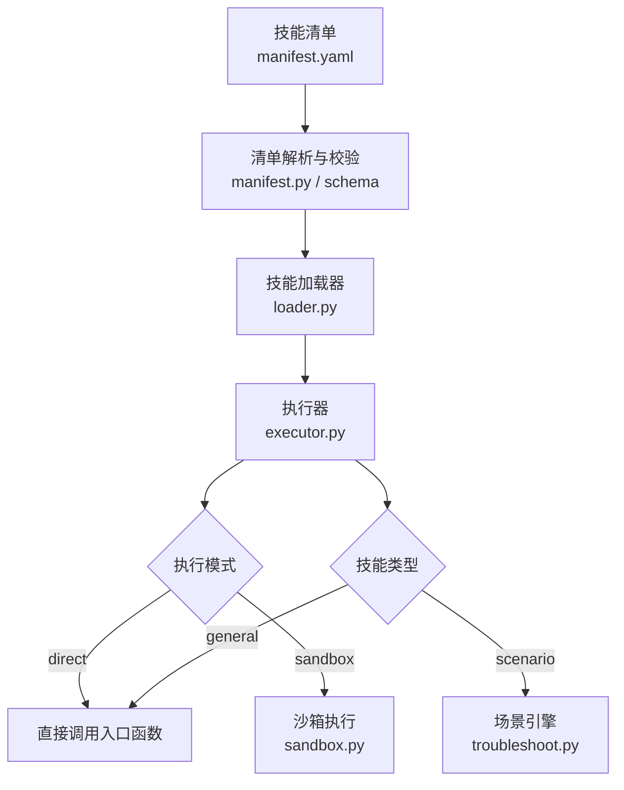
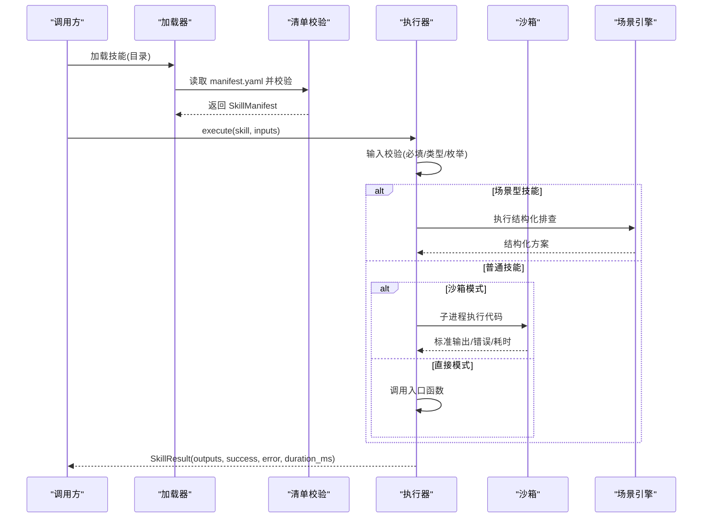
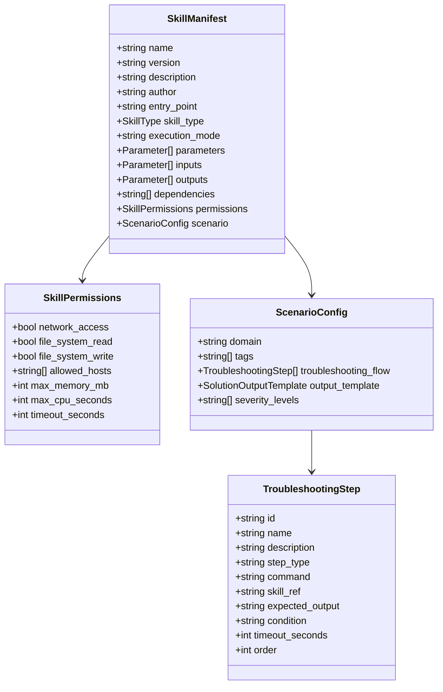
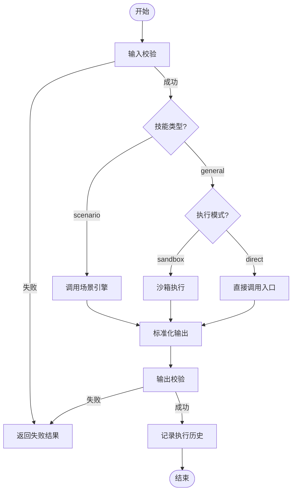
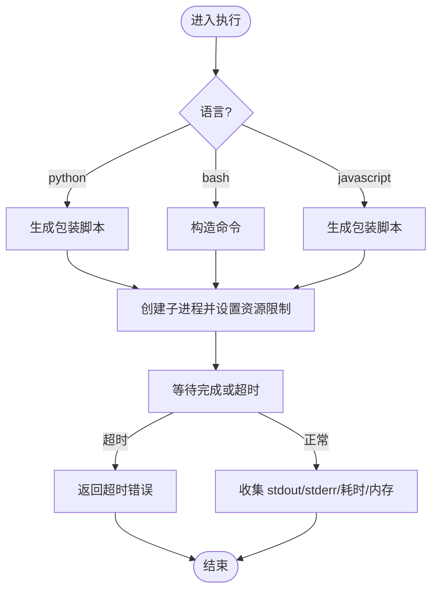
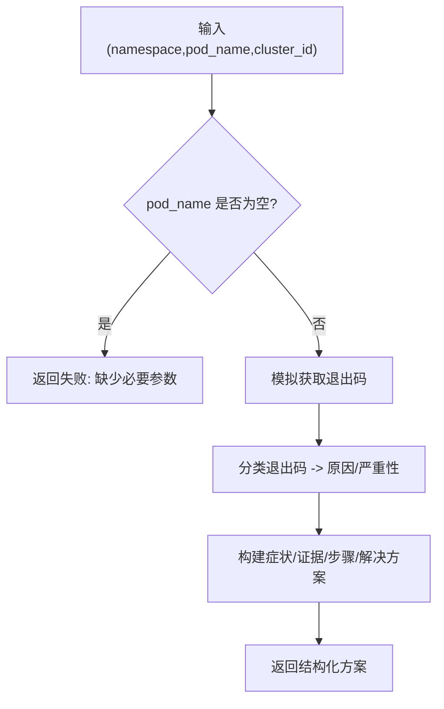
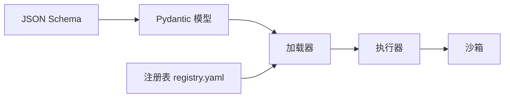

# 自定义技能开发

<cite>
**本文引用的文件**
- [README.md](file://README.md)
- [skills/registry.yaml](file://skills/registry.yaml)
- [api/jsonschema/skill-manifest.schema.json](file://api/jsonschema/skill-manifest.schema.json)
- [python/src/resolveagent/skills/manifest.py](file://python/src/resolveagent/skills/manifest.py)
- [python/src/resolveagent/skills/loader.py](file://python/src/resolveagent/skills/loader.py)
- [python/src/resolveagent/skills/executor.py](file://python/src/resolveagent/skills/executor.py)
- [python/src/resolveagent/skills/sandbox.py](file://python/src/resolveagent/skills/sandbox.py)
- [skills/examples/hello-world/manifest.yaml](file://skills/examples/hello-world/manifest.yaml)
- [skills/examples/hello-world/skill.py](file://skills/examples/hello-world/skill.py)
- [skills/examples/k8s-pod-crash/manifest.yaml](file://skills/examples/k8s-pod-crash/manifest.yaml)
- [skills/examples/k8s-pod-crash/skill.py](file://skills/examples/k8s-pod-crash/skill.py)
- [python/tests/unit/test_skill_loader.py](file://python/tests/unit/test_skill_loader.py)
- [python/tests/unit/test_skill_selector.py](file://python/tests/unit/test_skill_selector.py)
</cite>

## 目录
1. [简介](#简介)
2. [项目结构](#项目结构)
3. [核心组件](#核心组件)
4. [架构总览](#架构总览)
5. [详细组件分析](#详细组件分析)
6. [依赖关系分析](#依赖关系分析)
7. [性能与可靠性](#性能与可靠性)
8. [测试与调试](#测试与调试)
9. [打包、发布与版本管理](#打包发布与版本管理)
10. [故障排查](#故障排查)
11. [结论](#结论)

## 简介
本指南面向希望为 ResolveAgent 平台开发“自定义技能”的工程师，覆盖从模板选择、清单编写、主程序实现、沙箱执行到测试、打包、发布与生产部署的全流程。内容基于仓库内现有技能系统实现（Python 运行时）与示例技能，确保可操作性与一致性。

## 项目结构
技能系统的核心位于 Python 运行时中，围绕“清单—加载—执行—沙箱”的主线组织：
- 清单定义与校验：JSON Schema + Pydantic 模型
- 技能发现与加载：按清单动态导入入口函数
- 执行编排：输入输出校验、场景化工作流路由、直接/沙箱执行
- 安全隔离：进程级资源限制、超时控制、网络/文件系统权限约束
- 示例技能：简单函数型与复杂场景型两类参考实现

图示来源
- [python/src/resolveagent/skills/manifest.py:95-131](file://python/src/resolveagent/skills/manifest.py#L95-L131)
- [api/jsonschema/skill-manifest.schema.json:1-128](file://api/jsonschema/skill-manifest.schema.json#L1-L128)
- [python/src/resolveagent/skills/loader.py:15-90](file://python/src/resolveagent/skills/loader.py#L15-L90)
- [python/src/resolveagent/skills/executor.py:20-147](file://python/src/resolveagent/skills/executor.py#L20-L147)
- [python/src/resolveagent/skills/sandbox.py:76-127](file://python/src/resolveagent/skills/sandbox.py#L76-L127)

章节来源
- [README.md:614-677](file://README.md#L614-L677)

## 核心组件
- 清单模型与校验：定义技能元数据、参数、权限、场景配置等，并提供 YAML 加载与验证能力
- 加载器：从本地目录读取清单并动态导入入口模块与函数
- 执行器：统一入口，负责输入/输出校验、场景路由、直接/沙箱执行、结果标准化与记录
- 沙箱：子进程隔离执行，支持 Python/Bash/JS，具备 CPU/内存/文件/网络/超时等多维限制
- 示例技能：hello-world（简单函数）、k8s-pod-crash（场景型排查）

章节来源
- [python/src/resolveagent/skills/manifest.py:1-131](file://python/src/resolveagent/skills/manifest.py#L1-L131)
- [python/src/resolveagent/skills/loader.py:1-90](file://python/src/resolveagent/skills/loader.py#L1-L90)
- [python/src/resolveagent/skills/executor.py:1-477](file://python/src/resolveagent/skills/executor.py#L1-L477)
- [python/src/resolveagent/skills/sandbox.py:1-462](file://python/src/resolveagent/skills/sandbox.py#L1-L462)
- [skills/examples/hello-world/manifest.yaml:1-21](file://skills/examples/hello-world/manifest.yaml#L1-L21)
- [skills/examples/hello-world/skill.py:1-14](file://skills/examples/hello-world/skill.py#L1-L14)
- [skills/examples/k8s-pod-crash/manifest.yaml:1-114](file://skills/examples/k8s-pod-crash/manifest.yaml#L1-L114)
- [skills/examples/k8s-pod-crash/skill.py:1-191](file://skills/examples/k8s-pod-crash/skill.py#L1-L191)

## 架构总览
技能在平台中的生命周期如下：
- 注册：通过 skills/registry.yaml 登记可用技能（含内置与外部）
- 加载：运行时根据清单定位并导入入口函数
- 执行：执行器进行参数校验、类型检查、枚举校验；场景型技能走结构化排查流程
- 隔离：默认或按需启用沙箱，限制资源与访问面
- 结果：标准化返回 success/error/logs/duration_ms，并记录执行历史

图示来源
- [skills/registry.yaml:1-34](file://skills/registry.yaml#L1-L34)
- [python/src/resolveagent/skills/loader.py:27-57](file://python/src/resolveagent/skills/loader.py#L27-L57)
- [python/src/resolveagent/skills/manifest.py:119-131](file://python/src/resolveagent/skills/manifest.py#L119-L131)
- [python/src/resolveagent/skills/executor.py:52-147](file://python/src/resolveagent/skills/executor.py#L52-L147)
- [python/src/resolveagent/skills/sandbox.py:96-127](file://python/src/resolveagent/skills/sandbox.py#L96-L127)

## 详细组件分析

### 清单模型与校验
- 支持两种技能类型：general（通用工具）与 scenario（场景化排查）
- 声明式权限：网络访问、文件系统读写、最大内存/CPU/超时等
- 场景配置：领域、标签、故障树步骤、输出模板、严重级别
- JSON Schema 提供强约束，Pydantic 模型提供运行时校验

图示来源
- [python/src/resolveagent/skills/manifest.py:16-116](file://python/src/resolveagent/skills/manifest.py#L16-L116)
- [api/jsonschema/skill-manifest.schema.json:1-128](file://api/jsonschema/skill-manifest.schema.json#L1-L128)

章节来源
- [python/src/resolveagent/skills/manifest.py:1-131](file://python/src/resolveagent/skills/manifest.py#L1-L131)
- [api/jsonschema/skill-manifest.schema.json:1-128](file://api/jsonschema/skill-manifest.schema.json#L1-L128)

### 技能加载器
- 从指定目录读取 manifest.yaml，解析 entry_point（module:function），动态导入模块并缓存可调用对象
- 提供已加载技能的查询与列表能力

章节来源
- [python/src/resolveagent/skills/loader.py:15-90](file://python/src/resolveagent/skills/loader.py#L15-L90)

### 执行器
- 输入校验：必填字段、类型、枚举、未知参数告警
- 场景路由：当技能类型为 scenario 时，交由场景引擎执行结构化排查
- 执行模式：根据清单 execution_mode 或全局开关决定 direct 或 sandbox
- 输出校验：按清单 outputs 声明进行类型校验
- 执行记录：维护最近 1000 条执行历史，便于统计与回溯

图示来源
- [python/src/resolveagent/skills/executor.py:52-147](file://python/src/resolveagent/skills/executor.py#L52-L147)
- [python/src/resolveagent/skills/executor.py:149-244](file://python/src/resolveagent/skills/executor.py#L149-L244)
- [python/src/resolveagent/skills/executor.py:246-374](file://python/src/resolveagent/skills/executor.py#L246-L374)

章节来源
- [python/src/resolveagent/skills/executor.py:1-477](file://python/src/resolveagent/skills/executor.py#L1-L477)

### 沙箱执行器
- 进程隔离：使用子进程运行用户代码，避免污染主进程
- 资源限制：CPU 时间、内存、栈大小、文件大小、打开文件数、禁用 core dump
- 超时控制：对 Python/Bash/JS 均支持超时中断
- 环境控制：最小化环境变量，可选白名单与额外变量注入
- 多语言：Python、Bash、JavaScript（Node.js）

图示来源
- [python/src/resolveagent/skills/sandbox.py:96-127](file://python/src/resolveagent/skills/sandbox.py#L96-L127)
- [python/src/resolveagent/skills/sandbox.py:129-204](file://python/src/resolveagent/skills/sandbox.py#L129-L204)
- [python/src/resolveagent/skills/sandbox.py:211-273](file://python/src/resolveagent/skills/sandbox.py#L211-L273)
- [python/src/resolveagent/skills/sandbox.py:275-344](file://python/src/resolveagent/skills/sandbox.py#L275-L344)
- [python/src/resolveagent/skills/sandbox.py:346-395](file://python/src/resolveagent/skills/sandbox.py#L346-L395)

章节来源
- [python/src/resolveagent/skills/sandbox.py:1-462](file://python/src/resolveagent/skills/sandbox.py#L1-L462)

### 示例技能

#### 简单函数型技能（hello-world）
- 清单：声明名称、版本、入口、输入输出、权限与超时
- 主程序：实现入口函数，接收参数并返回结构化结果

章节来源
- [skills/examples/hello-world/manifest.yaml:1-21](file://skills/examples/hello-world/manifest.yaml#L1-L21)
- [skills/examples/hello-world/skill.py:1-14](file://skills/examples/hello-world/skill.py#L1-L14)

#### 复杂工作流技能（k8s-pod-crash）
- 清单：声明场景型技能、领域、标签、严重级别、排查步骤与输出模板
- 主程序：实现 run() 作为回退逻辑，结合退出码分类、症状/证据/步骤/解决方案四要素输出

图示来源
- [skills/examples/k8s-pod-crash/manifest.yaml:1-114](file://skills/examples/k8s-pod-crash/manifest.yaml#L1-L114)
- [skills/examples/k8s-pod-crash/skill.py:139-191](file://skills/examples/k8s-pod-crash/skill.py#L139-L191)

章节来源
- [skills/examples/k8s-pod-crash/manifest.yaml:1-114](file://skills/examples/k8s-pod-crash/manifest.yaml#L1-L114)
- [skills/examples/k8s-pod-crash/skill.py:1-191](file://skills/examples/k8s-pod-crash/skill.py#L1-L191)

## 依赖关系分析
- 清单层：JSON Schema 定义契约，Pydantic 模型负责运行时校验
- 加载层：依赖清单解析与模块动态导入
- 执行层：依赖加载器提供的 LoadedSkill，以及沙箱与环境控制
- 示例与注册表：skills/registry.yaml 汇总可用技能，便于平台发现

图示来源
- [api/jsonschema/skill-manifest.schema.json:1-128](file://api/jsonschema/skill-manifest.schema.json#L1-L128)
- [python/src/resolveagent/skills/manifest.py:95-131](file://python/src/resolveagent/skills/manifest.py#L95-L131)
- [python/src/resolveagent/skills/loader.py:15-90](file://python/src/resolveagent/skills/loader.py#L15-L90)
- [python/src/resolveagent/skills/executor.py:20-147](file://python/src/resolveagent/skills/executor.py#L20-L147)
- [python/src/resolveagent/skills/sandbox.py:76-127](file://python/src/resolveagent/skills/sandbox.py#L76-L127)
- [skills/registry.yaml:1-34](file://skills/registry.yaml#L1-L34)

章节来源
- [skills/registry.yaml:1-34](file://skills/registry.yaml#L1-L34)

## 性能与可靠性
- 输入/输出校验前置，减少无效执行
- 场景型技能通过结构化流程提升可解释性与稳定性
- 沙箱提供资源上限与超时保护，防止恶意或低质量代码影响主进程
- 执行历史保留最近 1000 条，便于统计成功率与平均耗时

优化建议
- 合理设置清单中的 timeout_seconds、max_memory_mb、max_cpu_seconds
- 对高频调用的通用技能优先采用 direct 模式以减少进程开销
- 对不可信第三方技能强制 sandbox 模式

章节来源
- [python/src/resolveagent/skills/executor.py:121-147](file://python/src/resolveagent/skills/executor.py#L121-L147)
- [python/src/resolveagent/skills/sandbox.py:39-73](file://python/src/resolveagent/skills/sandbox.py#L39-L73)

## 测试与调试
单元测试
- 清单与权限默认值断言
- 技能选择器适配器的路由行为与降级策略

集成测试思路
- 以本地目录方式加载示例技能，验证清单解析、入口导入、执行结果与日志
- 针对场景型技能，验证结构化输出四要素完整性

调试技巧
- 开启执行器日志，关注输入校验失败与异常堆栈
- 沙箱模式下查看 stderr 与执行耗时，定位超时或资源超限问题
- 通过执行历史快速复盘失败用例

章节来源
- [python/tests/unit/test_skill_loader.py:1-24](file://python/tests/unit/test_skill_loader.py#L1-L24)
- [python/tests/unit/test_skill_selector.py:1-79](file://python/tests/unit/test_skill_selector.py#L1-L79)

## 打包、发布与版本管理
- 清单版本：遵循语义化版本（major.minor.patch），并在清单中声明
- 技能注册：将新技能加入 skills/registry.yaml，便于平台发现
- 依赖声明：在清单 dependencies 中列出外部依赖，确保运行时满足
- 权限最小化：仅开放必要的网络与文件系统权限
- 发布前自检：运行单元测试与集成测试，确认清单校验与执行路径正确

章节来源
- [api/jsonschema/skill-manifest.schema.json:1-128](file://api/jsonschema/skill-manifest.schema.json#L1-L128)
- [skills/registry.yaml:1-34](file://skills/registry.yaml#L1-L34)

## 故障排查
常见问题与处理
- 输入校验失败：检查必填字段、类型与枚举是否匹配清单定义
- 入口文件未找到：核对 entry_point 指向的模块与函数名
- 沙箱超时/内存超限：调整清单中的 timeout_seconds、max_memory_mb、max_cpu_seconds
- 场景型技能无输出：确认 troubleshooting_flow 步骤顺序与条件分支

章节来源
- [python/src/resolveagent/skills/executor.py:149-244](file://python/src/resolveagent/skills/executor.py#L149-L244)
- [python/src/resolveagent/skills/sandbox.py:165-192](file://python/src/resolveagent/skills/sandbox.py#L165-L192)

## 结论
ResolveAgent 的技能体系以“清单驱动、加载解耦、执行可控、沙箱隔离”为核心设计，既支持轻量函数型技能，也支持复杂场景型工作流。通过严格的清单校验、安全的执行环境与完善的测试实践，开发者可以快速构建稳定可靠的技能，并在生产环境中安全运行。