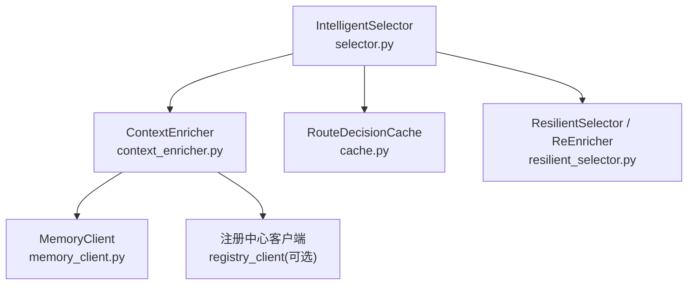
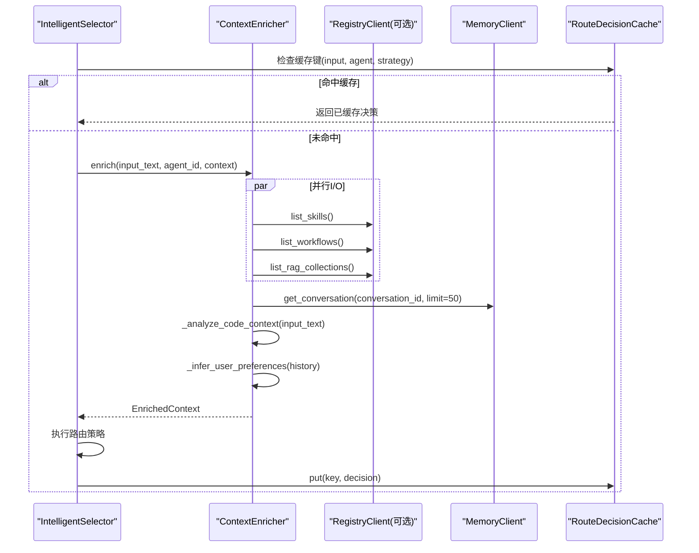
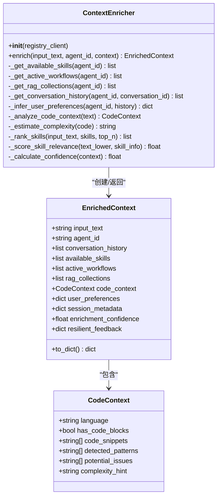
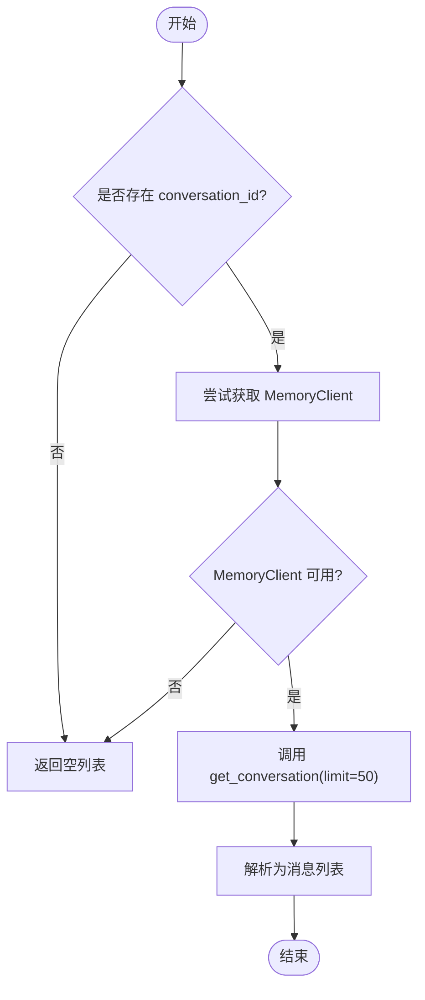
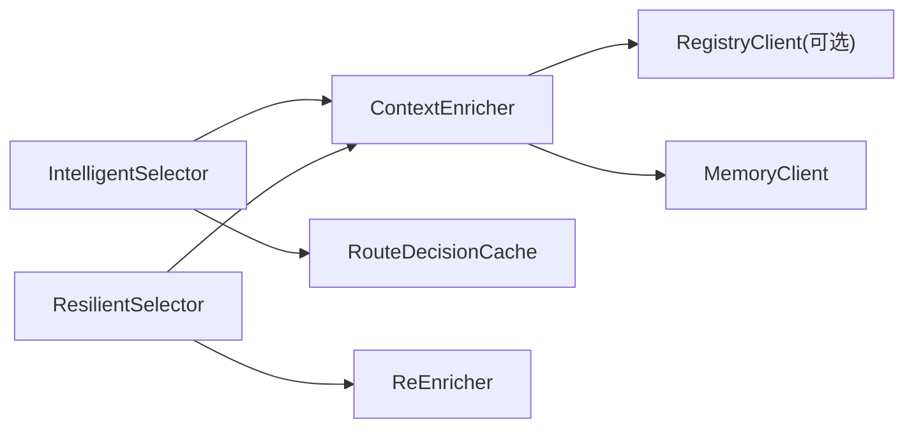

# 上下文增强器

<cite>
**本文引用的文件**
- [context_enricher.py](file://python/src/resolveagent/selector/context_enricher.py)
- [selector.py](file://python/src/resolveagent/selector/selector.py)
- [cache.py](file://python/src/resolveagent/selector/cache.py)
- [memory_client.py](file://python/src/resolveagent/store/memory_client.py)
- [resilient_selector.py](file://python/src/resolveagent/selector/resilient_selector.py)
</cite>

## 目录
1. [简介](#简介)
2. [项目结构](#项目结构)
3. [核心组件](#核心组件)
4. [架构总览](#架构总览)
5. [详细组件分析](#详细组件分析)
6. [依赖关系分析](#依赖关系分析)
7. [性能考虑](#性能考虑)
8. [故障排查指南](#故障排查指南)
9. [结论](#结论)
10. [附录：配置与使用示例](#附录：配置与使用示例)

## 简介
本技术文档聚焦于“上下文增强器”（ContextEnricher），解释其如何为路由决策整合并丰富上下文信息，包括记忆检索、能力查询、历史记录与外部资源集成。文档深入剖析 ContextEnricher 的数据结构、增强策略、查询优化与缓存机制，并提供配置与使用示例，涵盖自定义增强规则、外部数据源集成以及上下文传播方式。同时说明与注册中心的交互方式和性能考量。

## 项目结构
上下文增强器位于选择器子系统内，围绕 IntelligentSelector 的“意图分析—上下文增强—路由决策”流水线工作。关键文件与职责如下：
- context_enricher.py：定义 EnrichedContext、CodeContext 及 ContextEnricher，负责并行拉取技能、工作流、RAG 集合，获取对话历史，分析代码上下文，推断用户偏好，计算增强置信度。
- selector.py：IntelligentSelector 编排路由流程，调用上下文增强器，并结合缓存与审计。
- cache.py：RouteDecisionCache 提供带 TTL 的 LRU 缓存，用于加速重复路由决策。
- memory_client.py：通过平台 REST API 访问短期/长期记忆，支持会话消息读取与长时知识检索。
- resilient_selector.py：在失败重试场景下对上下文进行增量再增强（ReEnricher），注入失败反馈并调整后续路由策略。



图表来源
- [selector.py:86-200](file://python/src/resolveagent/selector/selector.py#L86-L200)
- [context_enricher.py:81-271](file://python/src/resolveagent/selector/context_enricher.py#L81-L271)
- [memory_client.py:43-74](file://python/src/resolveagent/store/memory_client.py#L43-L74)
- [cache.py:20-97](file://python/src/resolveagent/selector/cache.py#L20-L97)
- [resilient_selector.py:106-172](file://python/src/resolveagent/selector/resilient_selector.py#L106-L172)

章节来源
- [selector.py:86-200](file://python/src/resolveagent/selector/selector.py#L86-L200)
- [context_enricher.py:81-271](file://python/src/resolveagent/selector/context_enricher.py#L81-L271)
- [cache.py:20-97](file://python/src/resolveagent/selector/cache.py#L20-L97)
- [memory_client.py:43-74](file://python/src/resolveagent/store/memory_client.py#L43-L74)
- [resilient_selector.py:106-172](file://python/src/resolveagent/selector/resilient_selector.py#L106-L172)

## 核心组件
- EnrichedContext：承载最终增强后的上下文，包含输入文本、Agent ID、对话历史、可用技能、活跃工作流、RAG 集合、代码上下文、用户偏好、会话元数据、增强置信度与弹性反馈字段。
- CodeContext：描述代码相关上下文，如语言、是否含代码块、片段、检测到的模式、潜在问题与复杂度提示。
- ContextEnricher：核心增强器，负责并行拉取资源、获取对话历史、分析代码、推断用户偏好、计算置信度，并在重试链路中保持弹性反馈。
- RouteDecisionCache：TTL-aware LRU 缓存，减少重复路由决策开销。
- MemoryClient：通过平台 REST API 获取会话消息与长时记忆。
- ReEnricher：在失败重试时向上下文注入失败信息，降低增强置信度并生成路由偏好调整。

章节来源
- [context_enricher.py:17-78](file://python/src/resolveagent/selector/context_enricher.py#L17-L78)
- [context_enricher.py:81-271](file://python/src/resolveagent/selector/context_enricher.py#L81-L271)
- [cache.py:20-97](file://python/src/resolveagent/selector/cache.py#L20-L97)
- [memory_client.py:43-74](file://python/src/resolveagent/store/memory_client.py#L43-L74)
- [resilient_selector.py:106-172](file://python/src/resolveagent/selector/resilient_selector.py#L106-L172)

## 架构总览
上下文增强器在 IntelligentSelector 的流水线中被调用，作为“上下文增强”阶段的核心。其典型流程如下：
- 初始化 EnrichedContext，记录输入哈希与长度等元数据。
- 并行拉取可用技能、活跃工作流、RAG 集合（通过 registry_client 或默认回退）。
- 按输入相关性对技能排序，保留 Top-N。
- 获取对话历史（基于 conversation_id 与 MemoryClient）。
- 分析输入中的代码片段，识别语言、模式与潜在问题，估算复杂度。
- 从历史推断用户偏好（详细程度、是否偏好代码示例、语言等）。
- 继承上一轮重试的弹性反馈字段，计算增强置信度。
- 返回 EnrichedContext 供后续路由决策使用。



图表来源
- [selector.py:165-200](file://python/src/resolveagent/selector/selector.py#L165-L200)
- [context_enricher.py:206-271](file://python/src/resolveagent/selector/context_enricher.py#L206-L271)
- [memory_client.py:55-74](file://python/src/resolveagent/store/memory_client.py#L55-L74)
- [cache.py:36-69](file://python/src/resolveagent/selector/cache.py#L36-L69)

## 详细组件分析

### ContextEnricher 类与数据结构
- 数据结构
  - EnrichedContext：聚合所有增强后的上下文，提供 to_dict 序列化方法，兼容旧版直接读取 resilient_feedback 字段。
  - CodeContext：封装代码相关上下文，包括语言、代码块、检测模式、潜在问题与复杂度提示。
- 增强策略
  - 资源拉取：优先通过 registry_client 查询技能、工作流、RAG 集合；异常时降级到内置默认列表。
  - 对话历史：通过 MemoryClient 获取最近消息（limit=50），无 conversation_id 或不可用时返回空列表。
  - 代码分析：提取代码块与内联代码，识别语言、模式与潜在安全问题（如 eval/exec、硬编码凭据、空 except/catch、SQL 全量选择等），估算复杂度。
  - 用户偏好推断：基于最近消息统计，推断详细程度、是否偏好代码示例、语言（en/zh）等。
  - 弹性反馈：继承 attempt_count、last_failure、route_preferences、attempted_routes 等字段，并在重试链路中衰减 enrichment_confidence。
- 查询优化
  - 并发 I/O：使用 asyncio.gather 并行拉取技能、工作流、RAG 集合，降低延迟。
  - 正则预编译：在初始化时预编译语言与问题匹配的正则，提升匹配效率。
  - 技能相关性评分：基于能力词、名称与描述分词匹配，输出 0-1 分数并按分数降序取 Top-N。
- 缓存机制
  - 增强器本身不缓存结果，但 IntelligentSelector 使用 RouteDecisionCache 缓存路由决策；ReEnricher 在重试时注入失败信息，避免重复无效路径。



图表来源
- [context_enricher.py:17-78](file://python/src/resolveagent/selector/context_enricher.py#L17-L78)
- [context_enricher.py:81-271](file://python/src/resolveagent/selector/context_enricher.py#L81-L271)

章节来源
- [context_enricher.py:17-78](file://python/src/resolveagent/selector/context_enricher.py#L17-L78)
- [context_enricher.py:81-271](file://python/src/resolveagent/selector/context_enricher.py#L81-L271)

### 记忆检索与对话历史
- 通过 MemoryClient 的 get_conversation 接口，按 conversation_id 获取最近消息（limit=50），转换为角色、内容、序列号与元数据的列表。
- 若无 conversation_id 或 MemoryClient 不可用，返回空列表，确保增强流程健壮性。
- 结合对话历史推断用户偏好，如详细程度、是否偏好代码示例、语言等。



图表来源
- [context_enricher.py:420-460](file://python/src/resolveagent/selector/context_enricher.py#L420-L460)
- [memory_client.py:55-74](file://python/src/resolveagent/store/memory_client.py#L55-L74)

章节来源
- [context_enricher.py:420-460](file://python/src/resolveagent/selector/context_enricher.py#L420-L460)
- [memory_client.py:55-74](file://python/src/resolveagent/store/memory_client.py#L55-L74)

### 能力查询与资源集成
- 技能查询：优先通过 registry_client.list_skills 获取，失败时回退到内置默认技能列表（web-search、code-exec、file-ops、static-analysis、security-scan）。
- 工作流查询：优先通过 registry_client.list_workflows 获取活跃工作流，失败时回退到内置默认工作流（FTA/DAG 类型）。
- RAG 集合查询：优先通过 registry_client.list_rag_collections 获取集合摘要，失败时回退到内置默认集合（产品文档、运维手册、事故历史、编码规范）。
- 技能相关性评分：根据能力词、名称与描述分词匹配输入文本，计算 0-1 分数并排序取 Top-N。

章节来源
- [context_enricher.py:273-418](file://python/src/resolveagent/selector/context_enricher.py#L273-L418)
- [context_enricher.py:585-612](file://python/src/resolveagent/selector/context_enricher.py#L585-L612)

### 代码上下文分析与复杂度估算
- 代码块提取：使用正则提取 ```lang ... ``` 形式的代码块，记录语言提示与片段。
- 内联代码检测：若未检测到代码块，则扫描输入文本以识别语言特征（Python、JS、TS、Go、Java、Rust、SQL、YAML、JSON）。
- 潜在问题识别：匹配常见安全问题与不良实践（eval/exec、硬编码凭据、空 except/catch、SQL 全量选择等）。
- 复杂度估算：基于行数与最大缩进层级，给出 low/medium/high 提示。

章节来源
- [context_enricher.py:523-583](file://python/src/resolveagent/selector/context_enricher.py#L523-L583)

### 用户偏好推断
- 基于最近消息统计：
  - 代码提及次数 → 是否偏好代码示例。
  - 平均消息长度 → 详细程度（low/medium/high）。
  - 中文字符比例 → 语言偏好（en/zh）。
- 默认值：当无历史时，设置中等详细程度、偏好代码示例、英文语言。

章节来源
- [context_enricher.py:462-521](file://python/src/resolveagent/selector/context_enricher.py#L462-L521)

### 增强置信度与弹性反馈
- 置信度计算：基础 0.5，随可用资源数量、代码上下文存在与否增加；上限 1.0。
- 弹性反馈：在重试链路中，ReEnricher 注入 attempted_routes、last_failure、route_preferences、attempt_count，并线性衰减 enrichment_confidence（以首轮基线为准），避免复合放大导致的过度衰减。

章节来源
- [context_enricher.py:254-270](file://python/src/resolveagent/selector/context_enricher.py#L254-L270)
- [context_enricher.py:614-633](file://python/src/resolveagent/selector/context_enricher.py#L614-L633)
- [resilient_selector.py:106-172](file://python/src/resolveagent/selector/resilient_selector.py#L106-L172)

## 依赖关系分析
- ContextEnricher 依赖：
  - registry_client（可选）：用于查询技能、工作流、RAG 集合。
  - MemoryClient：用于获取对话历史。
  - 正则表达式库：用于语言与问题模式匹配。
  - asyncio：用于并发 I/O。
- 与 IntelligentSelector 的关系：
  - IntelligentSelector 在路由前调用 ContextEnricher.enrich，并将 EnrichedContext 传入后续策略。
  - RouteDecisionCache 缓存路由决策，减少重复增强与路由开销。
- 与 ResilientSelector 的关系：
  - ReEnricher 在失败重试时向上下文注入失败信息，影响后续路由决策与增强置信度。



图表来源
- [context_enricher.py:81-271](file://python/src/resolveagent/selector/context_enricher.py#L81-L271)
- [selector.py:86-200](file://python/src/resolveagent/selector/selector.py#L86-L200)
- [cache.py:20-97](file://python/src/resolveagent/selector/cache.py#L20-L97)
- [resilient_selector.py:106-172](file://python/src/resolveagent/selector/resilient_selector.py#L106-L172)

章节来源
- [context_enricher.py:81-271](file://python/src/resolveagent/selector/context_enricher.py#L81-L271)
- [selector.py:86-200](file://python/src/resolveagent/selector/selector.py#L86-L200)
- [cache.py:20-97](file://python/src/resolveagent/selector/cache.py#L20-L97)
- [resilient_selector.py:106-172](file://python/src/resolveagent/selector/resilient_selector.py#L106-L172)

## 性能考虑
- 并发 I/O：使用 asyncio.gather 并行拉取技能、工作流、RAG 集合，显著降低网络等待时间。
- 正则预编译：在初始化时预编译语言与问题匹配的正则，避免每次匹配的编译开销。
- 缓存策略：
  - RouteDecisionCache 提供 TTL-aware LRU 缓存，减少重复路由决策的计算成本。
  - 可配置实例级或全局共享缓存，平衡内存占用与命中率。
- 降级与容错：
  - 注册中心不可用时回退到内置默认资源列表，保证系统可用性。
  - MemoryClient 不可用时返回空历史，不影响整体增强流程。
- 复杂度估算与 Top-N 限制：
  - 代码复杂度估算基于启发式规则，避免复杂 AST 解析带来的高开销。
  - 技能相关性评分后仅保留 Top-N，控制下游处理规模。

[本节为通用性能讨论，无需特定文件引用]

## 故障排查指南
- 注册中心查询失败：
  - 现象：技能、工作流或 RAG 集合为空或不完整。
  - 处理：检查 registry_client 连接与权限；确认服务端返回格式；查看日志警告。
  - 参考：[context_enricher.py:273-418](file://python/src/resolveagent/selector/context_enricher.py#L273-L418)
- 对话历史为空：
  - 现象：conversation_id 缺失或 MemoryClient 不可用。
  - 处理：确认传入 conversation_id；检查 MemoryClient 地址与连接；查看日志警告。
  - 参考：[context_enricher.py:420-460](file://python/src/resolveagent/selector/context_enricher.py#L420-L460)
- 代码分析误判：
  - 现象：语言识别错误或潜在问题过多。
  - 处理：检查输入文本格式；调整正则模式；关注复杂度估算逻辑。
  - 参考：[context_enricher.py:523-583](file://python/src/resolveagent/selector/context_enricher.py#L523-L583)
- 增强置信度过低：
  - 现象：多次重试后 confidence 下降明显。
  - 处理：检查 ReEnricher 的衰减逻辑；确认首轮基线是否正确；评估失败原因分类。
  - 参考：[resilient_selector.py:106-172](file://python/src/resolveagent/selector/resilient_selector.py#L106-L172)
- 缓存命中率低：
  - 现象：频繁重新计算路由决策。
  - 处理：调整 TTL 与 max_size；检查 key 生成是否稳定；观察缓存统计。
  - 参考：[cache.py:20-97](file://python/src/resolveagent/selector/cache.py#L20-L97)

章节来源
- [context_enricher.py:273-418](file://python/src/resolveagent/selector/context_enricher.py#L273-L418)
- [context_enricher.py:420-460](file://python/src/resolveagent/selector/context_enricher.py#L420-L460)
- [context_enricher.py:523-583](file://python/src/resolveagent/selector/context_enricher.py#L523-L583)
- [resilient_selector.py:106-172](file://python/src/resolveagent/selector/resilient_selector.py#L106-L172)
- [cache.py:20-97](file://python/src/resolveagent/selector/cache.py#L20-L97)

## 结论
上下文增强器通过并行 I/O、正则预编译、资源回退与对话历史检索，为路由决策提供了全面且健壮的上下文信息。其在重试链路中与 ReEnricher 协作，实现失败感知与自适应降级。配合 RouteDecisionCache 的 TTL-aware LRU 缓存，系统在性能与可靠性之间取得良好平衡。通过合理配置与扩展，可进一步集成更多外部数据源与自定义增强规则，满足多样化路由需求。

[本节为总结性内容，无需特定文件引用]

## 附录：配置与使用示例
以下示例展示如何配置和使用上下文增强器，包括自定义增强规则、集成外部数据源与上下文传播。为避免泄露具体代码内容，此处仅提供路径指引与步骤说明。

- 基本使用
  - 在 IntelligentSelector 中启用上下文增强，并传入 registry_client 与缓存配置。
  - 参考路径：[selector.py:121-163](file://python/src/resolveagent/selector/selector.py#L121-L163)
- 自定义增强规则
  - 扩展 ContextEnricher._score_skill_relevance 以加入业务关键词权重。
  - 参考路径：[context_enricher.py:595-612](file://python/src/resolveagent/selector/context_enricher.py#L595-L612)
- 集成外部数据源
  - 在 _get_available_skills/_get_active_workflows/_get_rag_collections 中替换 registry_client 调用为自定义数据源。
  - 参考路径：[context_enricher.py:273-418](file://python/src/resolveagent/selector/context_enricher.py#L273-L418)
- 上下文传播
  - 在重试链路中，ReEnricher 将失败信息注入 context，确保后续增强感知历史失败。
  - 参考路径：[resilient_selector.py:106-172](file://python/src/resolveagent/selector/resilient_selector.py#L106-L172)
- 记忆检索配置
  - 配置 MemoryClient 地址与连接参数，确保对话历史可正常获取。
  - 参考路径：[memory_client.py:43-74](file://python/src/resolveagent/store/memory_client.py#L43-L74)
- 缓存策略调优
  - 调整 RouteDecisionCache 的 max_size 与 ttl_seconds，平衡命中率与内存占用。
  - 参考路径：[cache.py:20-97](file://python/src/resolveagent/selector/cache.py#L20-L97)

章节来源
- [selector.py:121-163](file://python/src/resolveagent/selector/selector.py#L121-L163)
- [context_enricher.py:273-418](file://python/src/resolveagent/selector/context_enricher.py#L273-L418)
- [context_enricher.py:595-612](file://python/src/resolveagent/selector/context_enricher.py#L595-L612)
- [resilient_selector.py:106-172](file://python/src/resolveagent/selector/resilient_selector.py#L106-L172)
- [memory_client.py:43-74](file://python/src/resolveagent/store/memory_client.py#L43-L74)
- [cache.py:20-97](file://python/src/resolveagent/selector/cache.py#L20-L97)