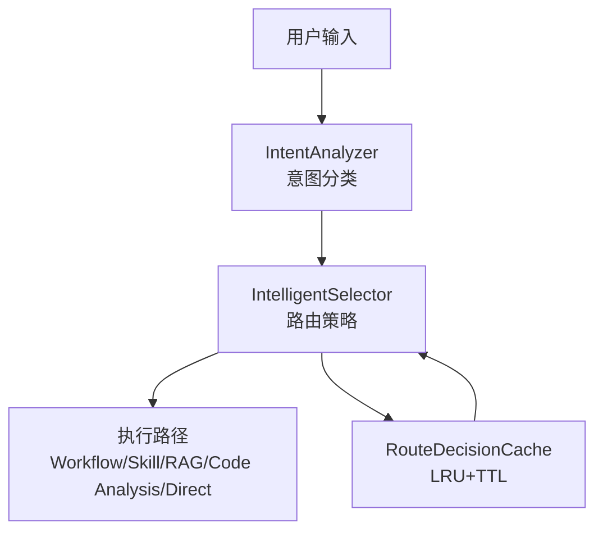
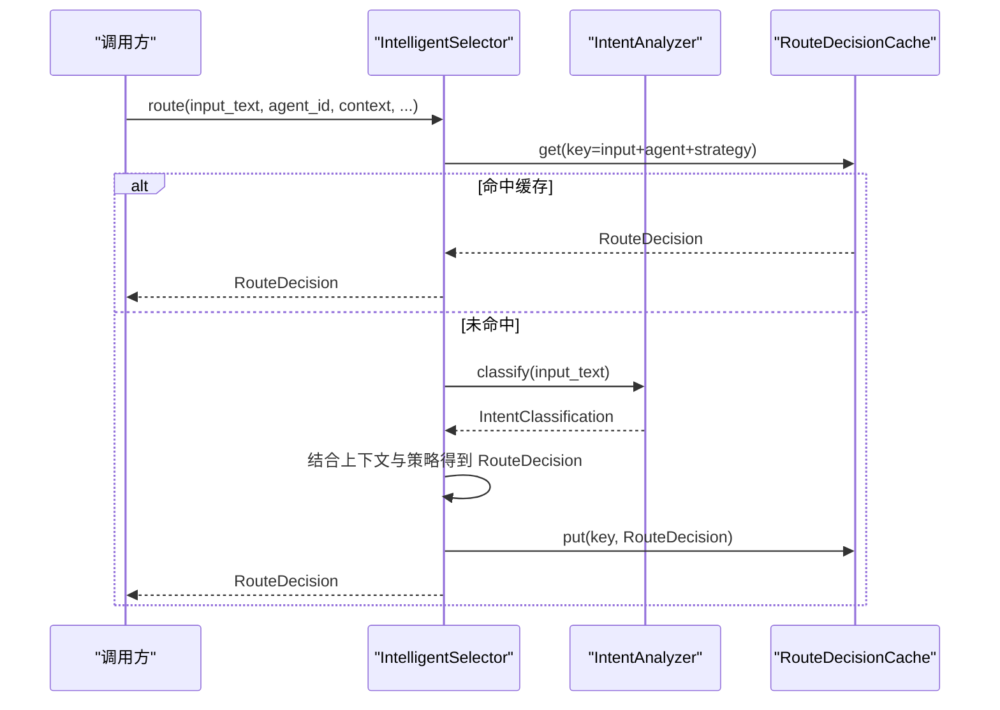
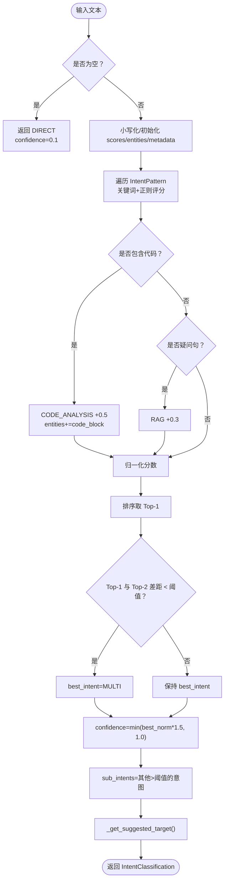
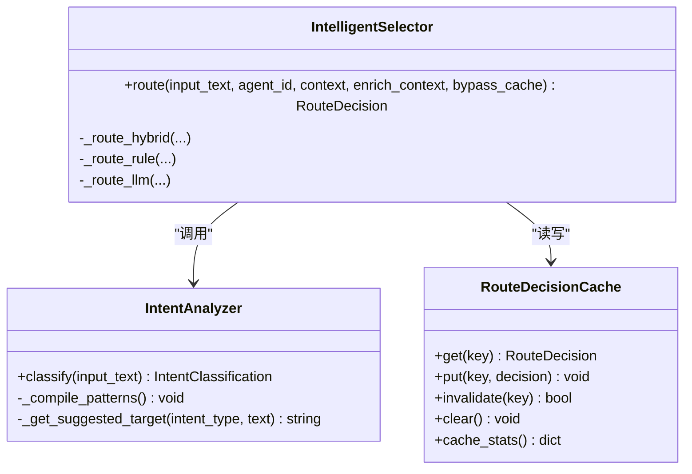
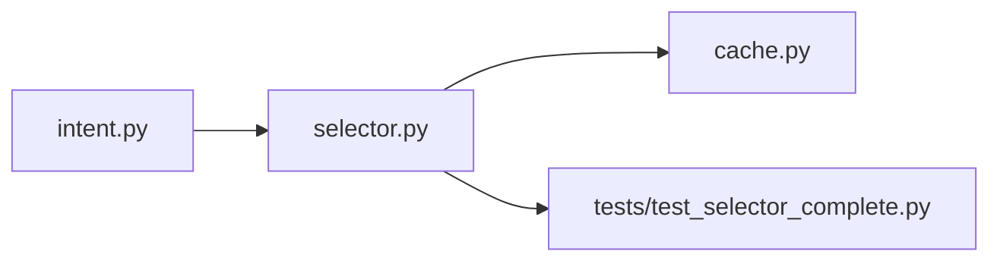

# 意图分析器

<cite>
**本文引用的文件**
- [intent.py](file://python/src/resolveagent/selector/intent.py)
- [__init__.py](file://python/src/resolveagent/selector/__init__.py)
- [selector.py](file://python/src/resolveagent/selector/selector.py)
- [cache.py](file://python/src/resolveagent/selector/cache.py)
- [test_selector_complete.py](file://python/tests/unit/test_selector_complete.py)
</cite>

## 目录
1. [简介](#简介)
2. [项目结构](#项目结构)
3. [核心组件](#核心组件)
4. [架构总览](#架构总览)
5. [详细组件分析](#详细组件分析)
6. [依赖关系分析](#依赖关系分析)
7. [性能考虑](#性能考虑)
8. [故障排查指南](#故障排查指南)
9. [结论](#结论)
10. [附录：使用示例与最佳实践](#附录使用示例与最佳实践)

## 简介
本技术文档围绕“意图分析器”展开，聚焦于如何理解用户输入并提取语义信息，包括意图分类、实体识别与元数据提取。重点解析 IntentAnalyzer 类的实现原理，涵盖文本预处理、意图类型定义、置信度评分机制与实体抽取算法；并提供具体用法示例，展示如何自定义意图类型、配置实体识别规则以及处理多意图场景。同时说明与其他组件的集成方式与性能优化策略。

## 项目结构
意图分析能力位于 Python 侧的 selector 子系统中，核心由意图分析器与智能选择器组成，并通过缓存提升路由性能。关键文件职责如下：
- intent.py：定义意图类型、模式、分析器与分类结果模型，提供单遍评分与多意图检测逻辑。
- __init__.py：对外暴露 IntentAnalyzer、IntentClassification、IntentPattern、IntentType 等符号。
- selector.py：IntelligentSelector 将意图分析与上下文增强、路由策略组合，形成端到端路由流程。
- cache.py：基于 LRU + TTL 的路由决策缓存，降低重复请求的处理成本。
- test_selector_complete.py：覆盖典型路由与意图分析用例，验证行为与边界条件。

**图表来源**
- [intent.py:50-341](file://python/src/resolveagent/selector/intent.py#L50-L341)
- [selector.py:86-174](file://python/src/resolveagent/selector/selector.py#L86-L174)
- [cache.py:42-111](file://python/src/resolveagent/selector/cache.py#L42-L111)

**章节来源**
- [intent.py:1-406](file://python/src/resolveagent/selector/intent.py#L1-L406)
- [__init__.py:1-93](file://python/src/resolveagent/selector/__init__.py#L1-L93)
- [selector.py:86-174](file://python/src/resolveagent/selector/selector.py#L86-L174)
- [cache.py:42-111](file://python/src/resolveagent/selector/cache.py#L42-L111)
- [test_selector_complete.py:1-200](file://python/tests/unit/test_selector_complete.py#L1-L200)

## 核心组件
- IntentType：枚举型意图类型，包含 workflow、skill、rag、code_analysis、direct、multi。
- IntentPattern：描述某类意图的正则模式、关键词、权重与目标提示。
- IntentAnalyzer：实现文本预处理、单遍评分、代码块/疑问句检测、归一化与多意图判定、建议目标生成。
- IntentClassification：分类结果模型，包含意图类型、置信度、实体列表、元数据、子意图与建议目标。
- IntelligentSelector：将意图分析、上下文增强与路由策略组合，输出 RouteDecision。
- RouteDecisionCache：LRU + TTL 缓存，加速重复路由决策。

**章节来源**
- [intent.py:17-37](file://python/src/resolveagent/selector/intent.py#L17-L37)
- [intent.py:39-48](file://python/src/resolveagent/selector/intent.py#L39-L48)
- [intent.py:50-341](file://python/src/resolveagent/selector/intent.py#L50-L341)
- [selector.py:86-174](file://python/src/resolveagent/selector/selector.py#L86-L174)
- [cache.py:42-111](file://python/src/resolveagent/selector/cache.py#L42-L111)

## 架构总览
意图分析器作为智能选择器的前置模块，负责快速、精确地判断用户意图，并为后续路由提供结构化信号（意图类型、置信度、实体、元数据、子意图、建议目标）。整体流程如下：

**图表来源**
- [selector.py:165-174](file://python/src/resolveagent/selector/selector.py#L165-L174)
- [intent.py:251-341](file://python/src/resolveagent/selector/intent.py#L251-L341)
- [cache.py:42-111](file://python/src/resolveagent/selector/cache.py#L42-L111)

## 详细组件分析

### IntentAnalyzer 类与分类流程
- 文本预处理：空输入快速返回 direct；统一小写以进行不区分大小写的匹配；记录输入长度等元数据。
- 单遍评分：对每种 IntentPattern 同时计算关键词命中数与正则命中次数，按权重累加原始分数。
- 特殊特征检测：
  - 代码块/行内代码/代码语法片段检测，命中后为 code_analysis 加分并标记实体 code_block。
  - 疑问句检测（首词在预设集合或结尾为问号），命中后为 rag 加分。
- 归一化与多意图判定：将所有意图分数归一化到 [0,1]，取最高分作为候选；若 Top-1 与 Top-2 差距小于阈值且次高分大于阈值，则标记为 multi。
- 置信度放大：最终置信度 = min(归一化值 × 1.5, 1.0)。
- 子意图与建议目标：收集其他超过阈值的意图作为 sub_intents；根据意图与文本内容给出 suggested_target。

**图表来源**
- [intent.py:251-341](file://python/src/resolveagent/selector/intent.py#L251-L341)

**章节来源**
- [intent.py:251-341](file://python/src/resolveagent/selector/intent.py#L251-L341)

### 意图类型与模式定义
- 支持的意图类型：workflow、skill、rag、code_analysis、direct、multi。
- 每种意图由一组正则模式与关键词共同定义，并带有权重与可选的目标提示。例如：
  - workflow：诊断、故障树、工作流相关词汇与模式。
  - skill：搜索、执行、文件操作、API 调用等工具型指令。
  - rag：知识检索、问答、文档查询。
  - code_analysis：代码审查、静态分析、AST、依赖图、流量分析等。
- 预编译正则：初始化时对所有模式进行 re.compile，避免重复编译开销。

**章节来源**
- [intent.py:17-26](file://python/src/resolveagent/selector/intent.py#L17-L26)
- [intent.py:64-196](file://python/src/resolveagent/selector/intent.py#L64-L196)
- [intent.py:246-249](file://python/src/resolveagent/selector/intent.py#L246-L249)

### 实体识别与元数据提取
- 实体抽取：当前实现通过特征检测产出轻量实体，如检测到代码块时添加 code_block。
- 元数据：记录 matched_patterns、contains_code、is_question、input_length 等，便于可观测性与调试。
- 扩展点：可在 classify 中增加更多实体抽取逻辑（如命名实体、参数键值对）并写入 entities 与 metadata。

**章节来源**
- [intent.py:287-304](file://python/src/resolveagent/selector/intent.py#L287-L304)
- [intent.py:266-270](file://python/src/resolveagent/selector/intent.py#L266-L270)

### 多意图场景处理
- 当 Top-1 与 Top-2 的归一化分数差距低于 split_threshold（默认 0.15）且次高分大于 0.2 时，将 best_intent 设为 MULTI。
- sub_intents 收集所有高于阈值的非最佳意图，供上层进行多路径协同处理。

**章节来源**
- [intent.py:315-330](file://python/src/resolveagent/selector/intent.py#L315-L330)

### 建议目标生成
- 根据意图与文本关键词推断具体执行目标，例如：
  - skill：web-search、code-exec、file-ops。
  - code_analysis：security-scan、linter、refactor、traffic-analysis、static-analysis。
- 该逻辑有助于下游直接定位具体技能或工具。

**章节来源**
- [intent.py:382-405](file://python/src/resolveagent/selector/intent.py#L382-L405)

### 与智能选择器的集成
- IntelligentSelector 在 route 流程中调用 IntentAnalyzer.classify，并结合上下文与策略得到 RouteDecision。
- 支持 rule、llm、hybrid 多种策略，内部维护策略实例缓存以避免重复构建。
- 通过 RouteDecisionCache 对相同输入、Agent、策略的组合进行缓存，减少重复计算。

**图表来源**
- [intent.py:50-341](file://python/src/resolveagent/selector/intent.py#L50-L341)
- [selector.py:86-174](file://python/src/resolveagent/selector/selector.py#L86-L174)
- [cache.py:42-111](file://python/src/resolveagent/selector/cache.py#L42-L111)

**章节来源**
- [selector.py:86-174](file://python/src/resolveagent/selector/selector.py#L86-L174)
- [cache.py:42-111](file://python/src/resolveagent/selector/cache.py#L42-L111)

## 依赖关系分析
- 模块内聚性：IntentAnalyzer 自包含意图匹配与评分逻辑；IntelligentSelector 聚合意图分析、上下文增强与路由策略；缓存模块独立提供高性能存储。
- 外部依赖：Python 标准库 re、enum、dataclasses、typing；Pydantic 用于数据模型校验。
- 耦合点：
  - selector 依赖 intent 提供的分类结果。
  - 缓存 key 由 input、agent_id、strategy 组合生成，保证一致性。
- 循环依赖规避：__init__.py 使用延迟导入避免循环引用。

**图表来源**
- [intent.py:1-406](file://python/src/resolveagent/selector/intent.py#L1-L406)
- [selector.py:86-174](file://python/src/resolveagent/selector/selector.py#L86-L174)
- [cache.py:42-111](file://python/src/resolveagent/selector/cache.py#L42-L111)
- [test_selector_complete.py:1-200](file://python/tests/unit/test_selector_complete.py#L1-L200)

**章节来源**
- [__init__.py:21-39](file://python/src/resolveagent/selector/__init__.py#L21-L39)
- [selector.py:86-174](file://python/src/resolveagent/selector/selector.py#L86-L174)
- [cache.py:42-111](file://python/src/resolveagent/selector/cache.py#L42-L111)

## 性能考虑
- 正则预编译：初始化时编译所有模式，避免每次调用重复编译。
- 单遍评分：在一次遍历中完成关键词与正则匹配，减少扫描次数。
- 轻量实体与元数据：仅做必要检测（代码块、疑问句），控制额外开销。
- 缓存：LRU + TTL 的路由决策缓存，显著降低重复请求的 CPU 与时间消耗。
- 建议：
  - 合理设置 split_threshold 以平衡多意图敏感度与误判率。
  - 针对高频意图可增加关键词或调整权重以提升准确率。
  - 在高并发场景下启用全局缓存并监控命中率。

[本节为通用性能指导，无需特定文件来源]

## 故障排查指南
- 空输入处理：空字符串会返回 direct 且低置信度，检查上游输入清洗逻辑。
- 无匹配意图：若无任何评分，返回 direct 并附带基础元数据，需检查意图模式与关键词是否覆盖业务场景。
- 多意图误判：若频繁出现 MULTI，可适当提高 split_threshold 或调整权重。
- 缓存未命中：确认 key 生成包含足够区分维度（input、agent、strategy），并检查 TTL 设置。
- 建议目标为空：检查 _get_suggested_target 中的关键词分支是否覆盖实际用语。

**章节来源**
- [intent.py:259-264](file://python/src/resolveagent/selector/intent.py#L259-L264)
- [intent.py:307-313](file://python/src/resolveagent/selector/intent.py#L307-L313)
- [intent.py:315-330](file://python/src/resolveagent/selector/intent.py#L315-L330)
- [cache.py:42-111](file://python/src/resolveagent/selector/cache.py#L42-L111)

## 结论
意图分析器通过关键词与正则的单遍评分、代码块与疑问句的特征检测、归一化与多意图判定，提供了高效且可扩展的用户意图理解能力。与智能选择器和缓存模块集成后，能够在复杂路由场景中稳定输出高质量决策。通过合理的模式配置与阈值调优，可进一步提升准确率与性能。

[本节为总结性内容，无需特定文件来源]

## 附录：使用示例与最佳实践

### 基本用法
- 直接调用意图分析器进行分类：
  - 构造 IntentAnalyzer，调用 classify 获取 IntentClassification。
  - 参考路径：[intent.py:251-341](file://python/src/resolveagent/selector/intent.py#L251-L341)
- 通过智能选择器进行端到端路由：
  - 构造 IntelligentSelector，调用 route 获取 RouteDecision。
  - 参考路径：[selector.py:165-174](file://python/src/resolveagent/selector/selector.py#L165-L174)

**章节来源**
- [intent.py:251-341](file://python/src/resolveagent/selector/intent.py#L251-L341)
- [selector.py:165-174](file://python/src/resolveagent/selector/selector.py#L165-L174)

### 自定义意图类型与模式
- 新增意图类型：在 IntentType 中添加新枚举值。
- 定义 IntentPattern：为新意图补充 patterns、keywords、weight、target_hint。
- 更新预编译：确保 __init__ 中已调用 _compile_patterns。
- 参考路径：
  - 意图类型定义：[intent.py:17-26](file://python/src/resolveagent/selector/intent.py#L17-L26)
  - 模式定义与权重：[intent.py:64-196](file://python/src/resolveagent/selector/intent.py#L64-L196)
  - 预编译：[intent.py:246-249](file://python/src/resolveagent/selector/intent.py#L246-L249)

**章节来源**
- [intent.py:17-26](file://python/src/resolveagent/selector/intent.py#L17-L26)
- [intent.py:64-196](file://python/src/resolveagent/selector/intent.py#L64-L196)
- [intent.py:246-249](file://python/src/resolveagent/selector/intent.py#L246-L249)

### 配置实体识别规则
- 在 classify 中扩展实体抽取逻辑，例如：
  - 检测文件名、URL、版本号等，追加至 entities。
  - 将匹配到的规则名称、命中位置等写入 metadata。
- 参考路径：
  - 实体与元数据写入点：[intent.py:266-270](file://python/src/resolveagent/selector/intent.py#L266-L270)
  - 代码块检测与实体添加：[intent.py:287-296](file://python/src/resolveagent/selector/intent.py#L287-L296)

**章节来源**
- [intent.py:266-270](file://python/src/resolveagent/selector/intent.py#L266-L270)
- [intent.py:287-296](file://python/src/resolveagent/selector/intent.py#L287-L296)

### 处理多意图场景
- 调整 split_threshold 以改变多意图判定敏感度。
- 利用 sub_intents 进行多路径并行或串行处理。
- 参考路径：
  - 多意图判定与置信度放大：[intent.py:315-330](file://python/src/resolveagent/selector/intent.py#L315-L330)

**章节来源**
- [intent.py:315-330](file://python/src/resolveagent/selector/intent.py#L315-L330)

### 集成与测试要点
- 单元测试覆盖典型路由与意图分析用例，验证不同输入下的路由类型与置信度范围。
- 参考路径：
  - 完整路由测试：[test_selector_complete.py:33-196](file://python/tests/unit/test_selector_complete.py#L33-L196)

**章节来源**
- [test_selector_complete.py:33-196](file://python/tests/unit/test_selector_complete.py#L33-L196)