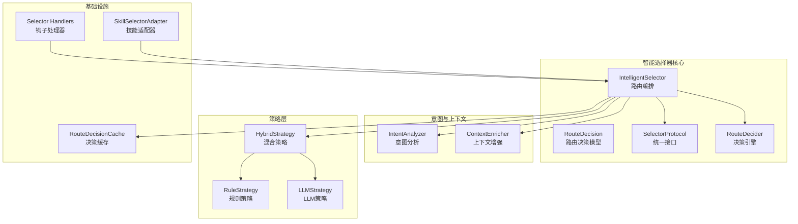
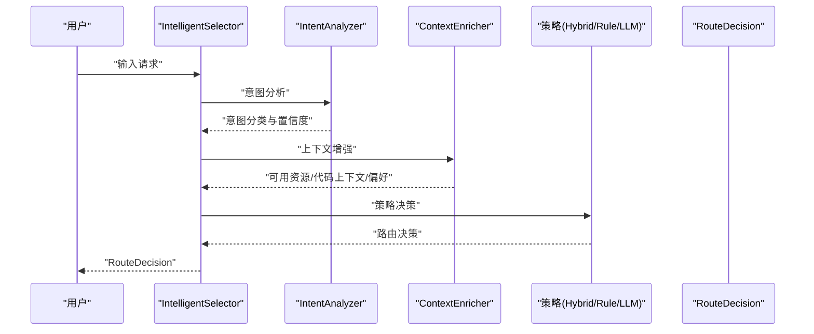
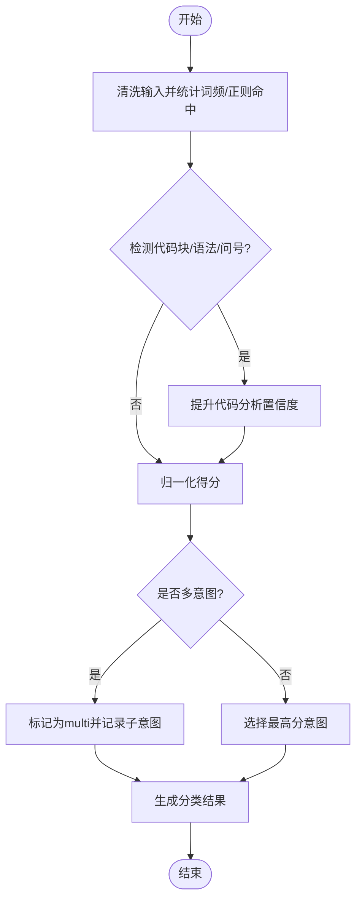
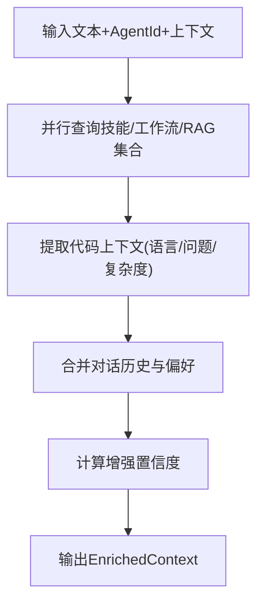
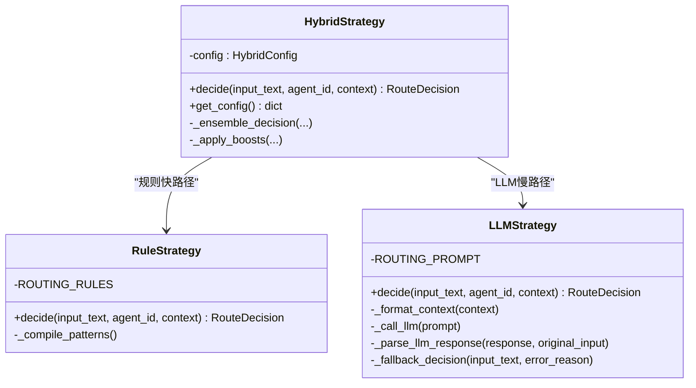
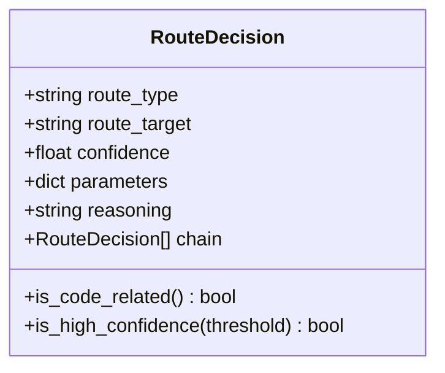
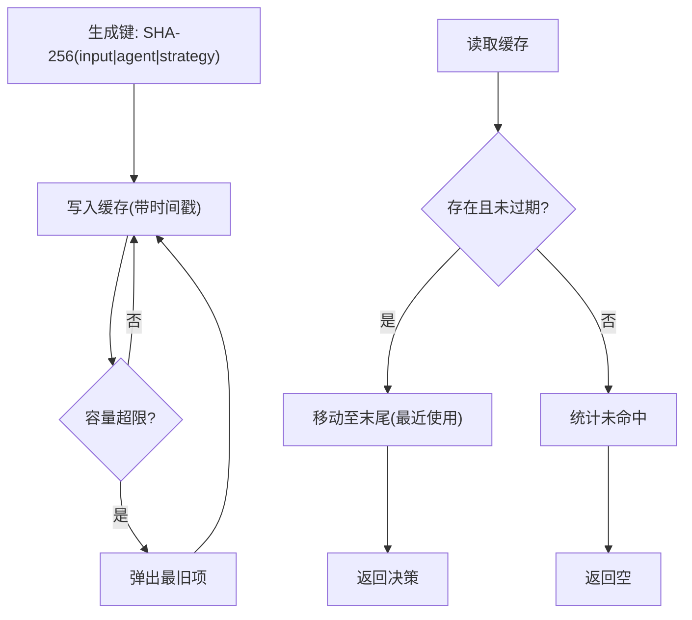
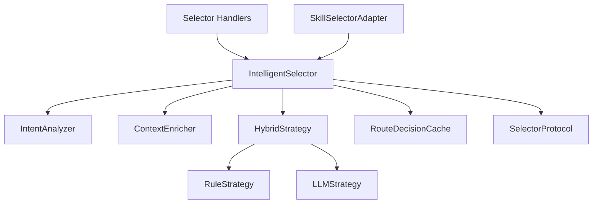

# 智能选择器系统

<cite>
**本文引用的文件**
- [python/src/resolveagent/selector/__init__.py](file://python/src/resolveagent/selector/__init__.py)
- [python/src/resolveagent/selector/selector.py](file://python/src/resolveagent/selector/selector.py)
- [python/src/resolveagent/selector/intent.py](file://python/src/resolveagent/selector/intent.py)
- [python/src/resolveagent/selector/context_enricher.py](file://python/src/resolveagent/selector/context_enricher.py)
- [python/src/resolveagent/selector/strategies/hybrid_strategy.py](file://python/src/resolveagent/selector/strategies/hybrid_strategy.py)
- [python/src/resolveagent/selector/strategies/llm_strategy.py](file://python/src/resolveagent/selector/strategies/llm_strategy.py)
- [python/src/resolveagent/selector/strategies/rule_strategy.py](file://python/src/resolveagent/selector/strategies/rule_strategy.py)
- [python/src/resolveagent/selector/cache.py](file://python/src/resolveagent/selector/cache.py)
- [python/src/resolveagent/selector/protocol.py](file://python/src/resolveagent/selector/protocol.py)
- [python/src/resolveagent/selector/router.py](file://python/src/resolveagent/selector/router.py)
- [python/src/resolveagent/selector/skill_selector.py](file://python/src/resolveagent/selector/skill_selector.py)
- [python/src/resolveagent/hooks/selector_handlers.py](file://python/src/resolveagent/hooks/selector_handlers.py)
- [python/tests/unit/test_selector.py](file://python/tests/unit/test_selector.py)
- [python/tests/unit/test_selector_cache.py](file://python/tests/unit/test_selector_cache.py)
- [python/skills/intelligent-selector/manifest.yaml](file://python/skills/intelligent-selector/manifest.yaml)
</cite>

## 目录
1. [简介](#简介)
2. [项目结构](#项目结构)
3. [核心组件](#核心组件)
4. [架构总览](#架构总览)
5. [详细组件分析](#详细组件分析)
6. [依赖分析](#依赖分析)
7. [性能考虑](#性能考虑)
8. [故障排查指南](#故障排查指南)
9. [结论](#结论)
10. [附录](#附录)

## 简介
本技术文档围绕智能选择器系统展开，系统以 ResolveAgent 的路由“大脑”为核心，负责在多条执行路径之间进行高置信度决策。智能选择器通过三层流水线完成任务：
- 意图分析器（Intent Analyzer）：理解用户需求，识别工作流、技能、RAG、代码分析等意图类别，并给出置信度与实体信息。
- 上下文增强器（Context Enricher）：整合可用资源、会话历史、代码上下文与偏好，形成丰富的路由决策依据。
- 路由策略（三种策略）：规则策略（Rule）、LLM 策略（LLM）、混合策略（Hybrid），分别提供确定性快速路径、语义理解能力与两者的协同。

最终输出路由决策模型（RouteDecision），包含路由类型、目标、置信度、推理说明与链式子决策等字段，支撑统一的可观测与可审计的路由体系。

## 项目结构
智能选择器相关代码集中在 Python 包 resolveagent.selector 下，采用按功能分层组织：
- 核心编排与模型：selector.py、protocol.py、router.py
- 意图分析：intent.py
- 上下文增强：context_enricher.py
- 缓存：cache.py
- 策略实现：strategies/rule_strategy.py、strategies/llm_strategy.py、strategies/hybrid_strategy.py
- 适配器与钩子：skill_selector.py、hooks/selector_handlers.py
- 入口导出：__init__.py
- 单元测试：tests/unit/test_selector.py、tests/unit/test_selector_cache.py
- 技能清单：python/skills/intelligent-selector/manifest.yaml

图表来源
- [python/src/resolveagent/selector/selector.py:80-308](file://python/src/resolveagent/selector/selector.py#L80-L308)
- [python/src/resolveagent/selector/intent.py:50-361](file://python/src/resolveagent/selector/intent.py#L50-L361)
- [python/src/resolveagent/selector/context_enricher.py:71-543](file://python/src/resolveagent/selector/context_enricher.py#L71-L543)
- [python/src/resolveagent/selector/strategies/rule_strategy.py:28-287](file://python/src/resolveagent/selector/strategies/rule_strategy.py#L28-L287)
- [python/src/resolveagent/selector/strategies/llm_strategy.py:19-371](file://python/src/resolveagent/selector/strategies/llm_strategy.py#L19-L371)
- [python/src/resolveagent/selector/strategies/hybrid_strategy.py:41-243](file://python/src/resolveagent/selector/strategies/hybrid_strategy.py#L41-L243)
- [python/src/resolveagent/selector/cache.py:20-116](file://python/src/resolveagent/selector/cache.py#L20-L116)
- [python/src/resolveagent/selector/protocol.py:15-37](file://python/src/resolveagent/selector/protocol.py#L15-L37)
- [python/src/resolveagent/selector/router.py:10-40](file://python/src/resolveagent/selector/router.py#L10-L40)
- [python/src/resolveagent/selector/skill_selector.py:18-68](file://python/src/resolveagent/selector/skill_selector.py#L18-L68)
- [python/src/resolveagent/hooks/selector_handlers.py:18-87](file://python/src/resolveagent/hooks/selector_handlers.py#L18-L87)

章节来源
- [python/src/resolveagent/selector/__init__.py:1-80](file://python/src/resolveagent/selector/__init__.py#L1-L80)
- [python/src/resolveagent/selector/selector.py:1-308](file://python/src/resolveagent/selector/selector.py#L1-L308)

## 核心组件
- 智能选择器（IntelligentSelector）
  - 提供统一路由入口，支持三种策略切换与缓存。
  - 支持仅意图分析、上下文增强与完整路由。
- 路由决策模型（RouteDecision）
  - 字段：route_type、route_target、confidence、parameters、reasoning、chain。
  - 工具方法：is_code_related、is_high_confidence。
- 统一协议（SelectorProtocol）
  - 定义 route 与 get_strategy_info 的结构化接口，便于适配器扩展。
- 决策引擎（RouteDecider）
  - 基于意图与上下文生成最终路由决策（当前为占位实现，预留扩展空间）。

章节来源
- [python/src/resolveagent/selector/selector.py:20-78](file://python/src/resolveagent/selector/selector.py#L20-L78)
- [python/src/resolveagent/selector/protocol.py:15-37](file://python/src/resolveagent/selector/protocol.py#L15-L37)
- [python/src/resolveagent/selector/router.py:10-40](file://python/src/resolveagent/selector/router.py#L10-L40)

## 架构总览
智能选择器的端到端流程如下：

图表来源
- [python/src/resolveagent/selector/selector.py:162-215](file://python/src/resolveagent/selector/selector.py#L162-L215)
- [python/src/resolveagent/selector/intent.py:186-282](file://python/src/resolveagent/selector/intent.py#L186-L282)
- [python/src/resolveagent/selector/context_enricher.py:201-256](file://python/src/resolveagent/selector/context_enricher.py#L201-L256)
- [python/src/resolveagent/selector/strategies/hybrid_strategy.py:79-135](file://python/src/resolveagent/selector/strategies/hybrid_strategy.py#L79-L135)

## 详细组件分析

### 意图分析器（Intent Analyzer）
- 设计理念
  - 多层融合：关键词匹配、正则模式、代码/问题检测与可选语义分析。
  - 针对性强：覆盖工作流（FTA）、技能、RAG、代码分析与直接对话。
- 关键能力
  - 意图类型枚举：workflow、skill、rag、code_analysis、direct、multi。
  - 分类结果：intent_type、confidence、entities、metadata、sub_intents、suggested_target。
  - 代码块/语法/问号检测提升准确性。
- 性能与稳定性
  - 预编译正则，单次遍历打分，避免重复编译开销。
  - 多意图阈值（split_threshold）用于判定 multi 意图。

图表来源
- [python/src/resolveagent/selector/intent.py:186-282](file://python/src/resolveagent/selector/intent.py#L186-L282)

章节来源
- [python/src/resolveagent/selector/intent.py:17-361](file://python/src/resolveagent/selector/intent.py#L17-L361)

### 上下文增强器（Context Enricher）
- 设计理念
  - 将对话历史、可用技能、活动工作流、RAG 集合、代码上下文与用户偏好整合为统一的 EnrichedContext。
- 关键能力
  - 并行获取资源列表，按相关性排序（技能）。
  - 代码上下文提取：语言检测、潜在问题识别、复杂度估算。
  - 偏好与会话元数据推断。
  - 增强质量置信度评估。
- 可观测性
  - 记录输入摘要（哈希/长度）辅助追踪。

图表来源
- [python/src/resolveagent/selector/context_enricher.py:201-256](file://python/src/resolveagent/selector/context_enricher.py#L201-L256)
- [python/src/resolveagent/selector/context_enricher.py:431-470](file://python/src/resolveagent/selector/context_enricher.py#L431-L470)

章节来源
- [python/src/resolveagent/selector/context_enricher.py:71-543](file://python/src/resolveagent/selector/context_enricher.py#L71-L543)

### 路由策略（三种策略）
- 规则策略（RuleStrategy）
  - 高优先级规则：代码分析、工作流（FTA）、技能、RAG。
  - 基于预编译正则，按命中数量与默认置信度加权，输出 RouteDecision。
  - 对未命中的场景提供低置信度兜底。
- LLM 策略（LLMStrategy）
  - 使用结构化提示词引导 LLM 输出 JSON，解析为 RouteDecision。
  - 支持上下文格式化、模拟响应与解析失败的回退。
- 混合策略（HybridStrategy）
  - 快速路径：规则策略高置信直接返回。
  - 慢速路径：LLM 策略兜底；若两者均给出结果，按权重融合。
  - 特殊提升：代码块、高复杂度代码、诊断关键词、长历史对话等。

图表来源
- [python/src/resolveagent/selector/strategies/rule_strategy.py:28-287](file://python/src/resolveagent/selector/strategies/rule_strategy.py#L28-L287)
- [python/src/resolveagent/selector/strategies/llm_strategy.py:19-371](file://python/src/resolveagent/selector/strategies/llm_strategy.py#L19-L371)
- [python/src/resolveagent/selector/strategies/hybrid_strategy.py:41-243](file://python/src/resolveagent/selector/strategies/hybrid_strategy.py#L41-L243)

章节来源
- [python/src/resolveagent/selector/strategies/rule_strategy.py:28-287](file://python/src/resolveagent/selector/strategies/rule_strategy.py#L28-L287)
- [python/src/resolveagent/selector/strategies/llm_strategy.py:19-371](file://python/src/resolveagent/selector/strategies/llm_strategy.py#L19-L371)
- [python/src/resolveagent/selector/strategies/hybrid_strategy.py:41-243](file://python/src/resolveagent/selector/strategies/hybrid_strategy.py#L41-L243)

### 路由决策模型（RouteDecision）
- 字段说明
  - route_type：路由类型（workflow、skill、rag、code_analysis、direct、multi）。
  - route_target：具体目标（如技能名、工作流ID、知识库ID）。
  - confidence：置信度（0~1）。
  - parameters：附加参数（如 ensemble、规则匹配模式、代码块检测来源等）。
  - reasoning：人类可读的决策解释。
  - chain：多路由场景下的有序子决策序列。
- 实用方法
  - is_code_related：判断是否与代码相关。
  - is_high_confidence：基于阈值判断高置信度。

图表来源
- [python/src/resolveagent/selector/selector.py:20-78](file://python/src/resolveagent/selector/selector.py#L20-L78)

章节来源
- [python/src/resolveagent/selector/selector.py:20-78](file://python/src/resolveagent/selector/selector.py#L20-L78)

### 缓存机制（RouteDecisionCache）
- 设计要点
  - TTL 过期 + LRU 淘汰，线程安全。
  - 支持实例级与全局共享两种作用域。
  - 提供命中/未命中统计与失效/清理能力。
- 键生成
  - 基于输入文本、AgentId、策略组合的 SHA-256 哈希，确保稳定与去重。

图表来源
- [python/src/resolveagent/selector/cache.py:20-116](file://python/src/resolveagent/selector/cache.py#L20-L116)

章节来源
- [python/src/resolveagent/selector/cache.py:20-116](file://python/src/resolveagent/selector/cache.py#L20-L116)

### 协议与适配器
- SelectorProtocol
  - 通过结构化子类型满足路由接口，无需继承。
- SkillSelectorAdapter
  - 将智能选择器包装为内置技能，便于在技能管线中调用。
- 钩子处理器（selector_handlers）
  - pre/post 钩子：意图分析、决策审计、置信度调整等。

章节来源
- [python/src/resolveagent/selector/protocol.py:15-37](file://python/src/resolveagent/selector/protocol.py#L15-L37)
- [python/src/resolveagent/selector/skill_selector.py:18-68](file://python/src/resolveagent/selector/skill_selector.py#L18-L68)
- [python/src/resolveagent/hooks/selector_handlers.py:18-87](file://python/src/resolveagent/hooks/selector_handlers.py#L18-L87)

## 依赖分析
- 组件耦合
  - IntelligentSelector 依赖 IntentAnalyzer、ContextEnricher 与策略实例；策略间通过统一接口解耦。
  - 缓存独立于策略，既可实例级也可全局共享。
  - 钩子与适配器通过协议与回调扩展系统行为。
- 外部集成点
  - LLMStrategy 通过 LLM Provider 发起调用（演示中包含模拟响应）。
  - 注册中心客户端用于资源发现（技能、工作流、RAG 集合）。

图表来源
- [python/src/resolveagent/selector/selector.py:140-161](file://python/src/resolveagent/selector/selector.py#L140-L161)
- [python/src/resolveagent/selector/strategies/hybrid_strategy.py:69-78](file://python/src/resolveagent/selector/strategies/hybrid_strategy.py#L69-L78)

章节来源
- [python/src/resolveagent/selector/selector.py:113-161](file://python/src/resolveagent/selector/selector.py#L113-L161)

## 性能考虑
- 正则预编译与单次扫描：减少重复编译与多次遍历。
- 并行 I/O：上下文增强阶段并行查询资源列表。
- 缓存命中率：合理设置 TTL 与容量，结合实例/全局作用域平衡一致性与吞吐。
- 策略选择：高频明确场景优先规则策略，模糊场景使用混合策略。
- LLM 调用：降低温度、限制最大令牌数，必要时启用模拟响应保障可用性。

## 故障排查指南
- LLM 解析失败
  - 现象：JSON 解析异常或模型不可用。
  - 处理：回退到启发式响应或直接兜底决策。
  - 参考：[LLMStrategy._parse_llm_response:303-341](file://python/src/resolveagent/selector/strategies/llm_strategy.py#L303-L341)、[LLMStrategy._fallback_decision:342-371](file://python/src/resolveagent/selector/strategies/llm_strategy.py#L342-L371)
- 缓存命中异常
  - 现象：命中率低或过期频繁。
  - 处理：检查键生成一致性、TTL 设置与并发访问。
  - 参考：[RouteDecisionCache.make_key:36-40](file://python/src/resolveagent/selector/cache.py#L36-L40)、[RouteDecisionCache.get:42-58](file://python/src/resolveagent/selector/cache.py#L42-L58)
- 规则误判
  - 现象：特定领域请求被错误路由。
  - 处理：扩展规则集或提高阈值；必要时启用混合策略。
  - 参考：[RuleStrategy.ROUTING_RULES:44-183](file://python/src/resolveagent/selector/strategies/rule_strategy.py#L44-L183)
- 钩子修改决策
  - 现象：后置钩子调整置信度或覆盖目标。
  - 处理：检查钩子元数据与覆盖逻辑。
  - 参考：[confidence_override_handler:67-87](file://python/src/resolveagent/hooks/selector_handlers.py#L67-L87)

章节来源
- [python/src/resolveagent/selector/strategies/llm_strategy.py:129-173](file://python/src/resolveagent/selector/strategies/llm_strategy.py#L129-L173)
- [python/src/resolveagent/selector/cache.py:42-58](file://python/src/resolveagent/selector/cache.py#L42-L58)
- [python/src/resolveagent/selector/strategies/rule_strategy.py:199-261](file://python/src/resolveagent/selector/strategies/rule_strategy.py#L199-L261)
- [python/src/resolveagent/hooks/selector_handlers.py:67-87](file://python/src/resolveagent/hooks/selector_handlers.py#L67-L87)

## 结论
智能选择器通过“意图分析 + 上下文增强 + 多策略协同”的设计，在准确性与性能之间取得平衡。其模块化结构便于扩展与演进，配合缓存、钩子与适配器，能够满足生产环境的可观测、可审计与可维护性要求。

## 附录

### 配置与使用示例（路径引用）
- 初始化与路由
  - [IntelligentSelector.__init__:115-161](file://python/src/resolveagent/selector/selector.py#L115-L161)
  - [IntelligentSelector.route:162-215](file://python/src/resolveagent/selector/selector.py#L162-L215)
- 仅意图分析
  - [IntelligentSelector.analyze_intent:217-243](file://python/src/resolveagent/selector/selector.py#L217-L243)
- 缓存配置
  - [RouteDecisionCache.__init__:28-35](file://python/src/resolveagent/selector/cache.py#L28-L35)
  - [get_global_cache:105-116](file://python/src/resolveagent/selector/cache.py#L105-L116)
- 混合策略配置
  - [HybridStrategy.__init__:69-78](file://python/src/resolveagent/selector/strategies/hybrid_strategy.py#L69-L78)
  - [HybridConfig:21-39](file://python/src/resolveagent/selector/strategies/hybrid_strategy.py#L21-L39)
- 技能适配器
  - [SkillSelectorAdapter.route:37-61](file://python/src/resolveagent/selector/skill_selector.py#L37-L61)
- 钩子处理器
  - [intent_analysis_handler:18-40](file://python/src/resolveagent/hooks/selector_handlers.py#L18-L40)
  - [decision_audit_handler:43-64](file://python/src/resolveagent/hooks/selector_handlers.py#L43-L64)
  - [confidence_override_handler:67-87](file://python/src/resolveagent/hooks/selector_handlers.py#L67-L87)
- 技能清单
  - [python/skills/intelligent-selector/manifest.yaml](file://python/skills/intelligent-selector/manifest.yaml)

### 测试参考（路径引用）
- 意图分析测试
  - [test_selector.py::TestIntentAnalyzer:34-121](file://python/tests/unit/test_selector.py#L34-L121)
- 上下文增强测试
  - [test_selector.py::TestContextEnricher:125-195](file://python/tests/unit/test_selector.py#L125-L195)
- 规则策略测试
  - [test_selector.py::TestRuleStrategy:200-268](file://python/tests/unit/test_selector.py#L200-L268)
- LLM 策略测试
  - [test_selector.py::TestLLMStrategy:273-307](file://python/tests/unit/test_selector.py#L273-L307)
- 混合策略测试
  - [test_selector.py::TestHybridStrategy:312-356](file://python/tests/unit/test_selector.py#L312-L356)
- 缓存测试
  - [test_selector_cache.py:11-164](file://python/tests/unit/test_selector_cache.py#L11-L164)