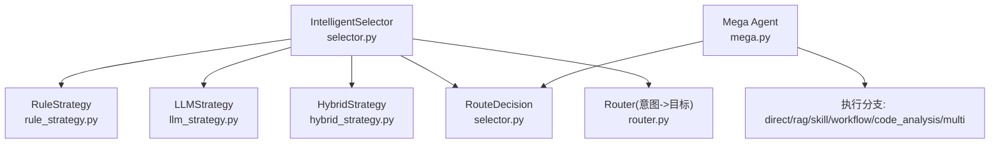
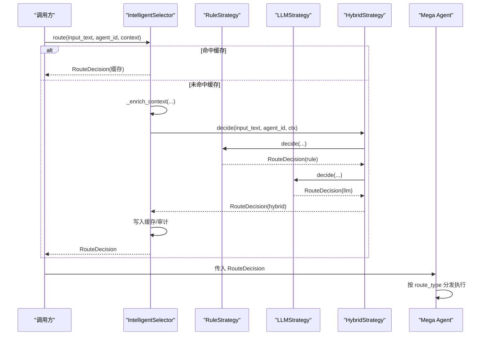
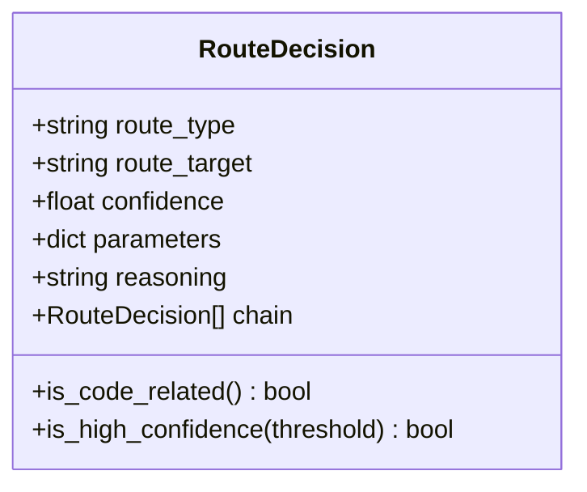
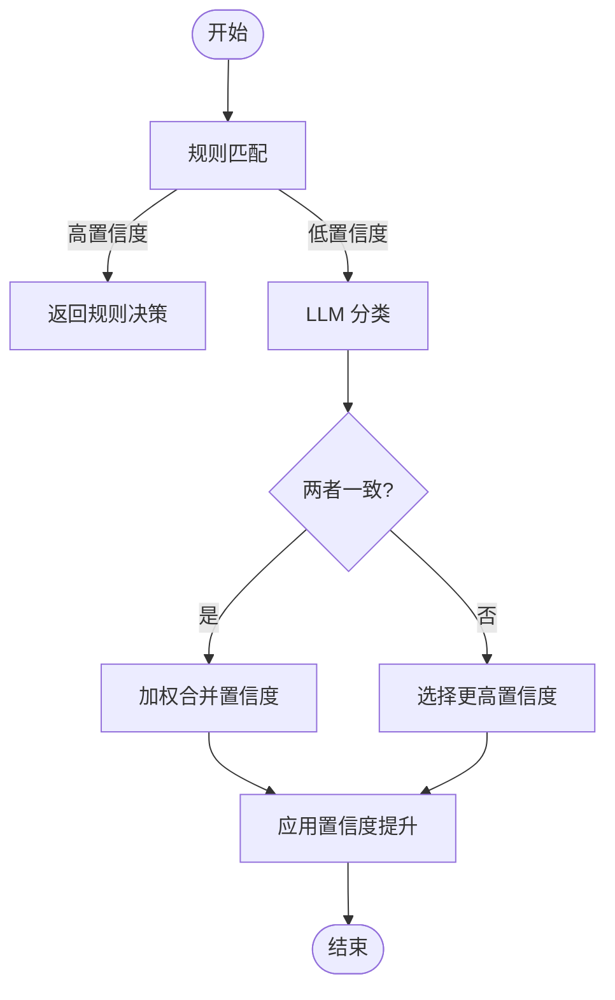
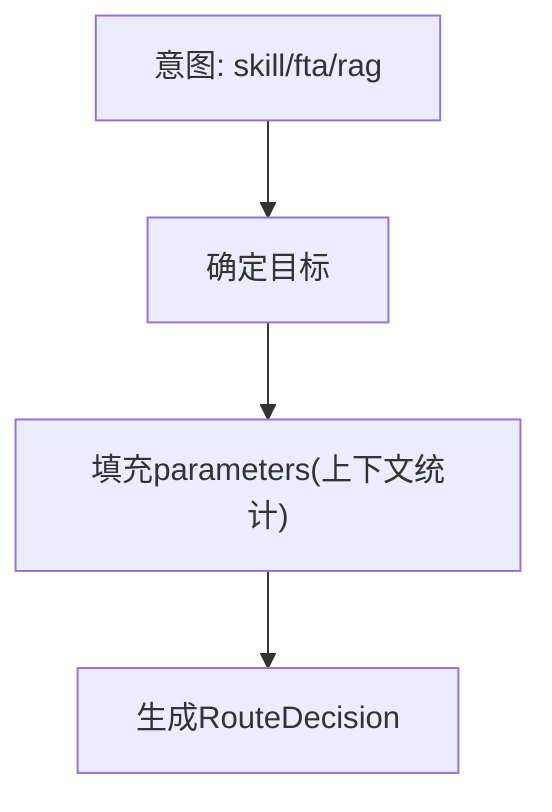
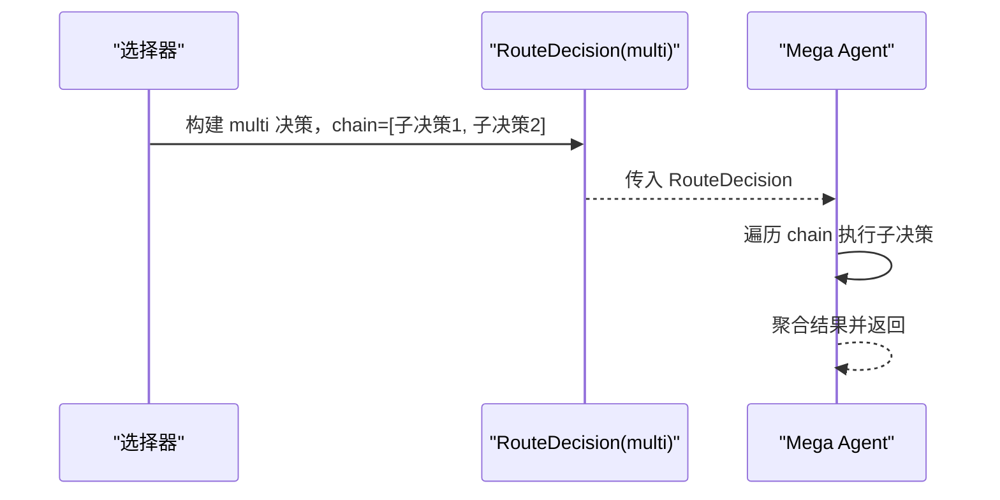
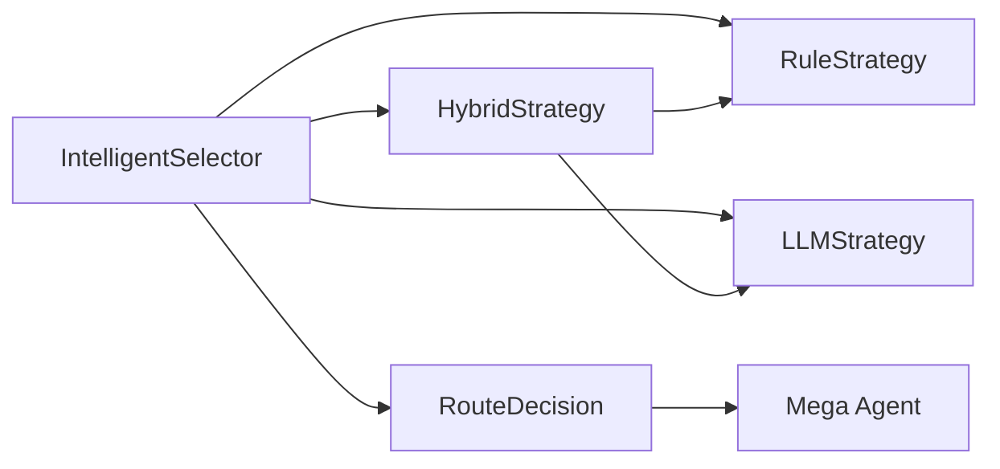

# 路由决策模型

<cite>
**本文引用的文件**
- [selector.py](file://python/src/resolveagent/selector/selector.py)
- [hybrid_strategy.py](file://python/src/resolveagent/selector/strategies/hybrid_strategy.py)
- [rule_strategy.py](file://python/src/resolveagent/selector/strategies/rule_strategy.py)
- [llm_strategy.py](file://python/src/resolveagent/selector/strategies/llm_strategy.py)
- [router.py](file://python/src/resolveagent/selector/router.py)
- [mega.py](file://python/src/resolveagent/agent/mega.py)
- [test_selector_complete.py](file://python/tests/unit/test_selector_complete.py)
- [test_router.py](file://python/tests/integration/test_router.py)
</cite>

## 目录
1. [简介](#简介)
2. [项目结构](#项目结构)
3. [核心组件](#核心组件)
4. [架构总览](#架构总览)
5. [详细组件分析](#详细组件分析)
6. [依赖关系分析](#依赖关系分析)
7. [性能考量](#性能考量)
8. [故障排查指南](#故障排查指南)
9. [结论](#结论)
10. [附录：使用示例与最佳实践](#附录使用示例与最佳实践)

## 简介
本技术文档聚焦于 ResolveAgent 的路由决策模型 RouteDecision，系统通过该模型统一表达“将请求路由到哪个执行路径”的决策结果。RouteDecision 承载了路由类型、目标标识、置信度评分、参数传递以及链式决策等关键信息，并提供了 is_code_related() 与 is_high_confidence() 两个便捷方法用于快速判断。

在系统中，IntelligentSelector 作为路由中枢，结合规则策略（RuleStrategy）、大模型策略（LLMStrategy）和混合策略（HybridStrategy），对输入进行意图识别与上下文增强后输出统一的 RouteDecision；随后由上层执行器（如 Mega Agent）根据 route_type 分发到 direct、rag、skill、workflow、code_analysis、multi 等具体处理流程。

## 项目结构
围绕路由决策的核心代码位于 Python 层的 selector 子包中，包含数据模型、策略实现、缓存与审计、以及路由器适配层；执行侧在 agent.mega 中根据决策结果进行分发。

图表来源
- [selector.py:22-84](file://python/src/resolveagent/selector/selector.py#L22-L84)
- [hybrid_strategy.py:41-123](file://python/src/resolveagent/selector/strategies/hybrid_strategy.py#L41-L123)
- [rule_strategy.py:28-264](file://python/src/resolveagent/selector/strategies/rule_strategy.py#L28-L264)
- [llm_strategy.py:19-170](file://python/src/resolveagent/selector/strategies/llm_strategy.py#L19-L170)
- [router.py:76-108](file://python/src/resolveagent/selector/router.py#L76-L108)
- [mega.py:125-164](file://python/src/resolveagent/agent/mega.py#L125-L164)

章节来源
- [selector.py:22-84](file://python/src/resolveagent/selector/selector.py#L22-L84)
- [hybrid_strategy.py:41-123](file://python/src/resolveagent/selector/strategies/hybrid_strategy.py#L41-L123)
- [rule_strategy.py:28-264](file://python/src/resolveagent/selector/strategies/rule_strategy.py#L28-L264)
- [llm_strategy.py:19-170](file://python/src/resolveagent/selector/strategies/llm_strategy.py#L19-L170)
- [router.py:76-108](file://python/src/resolveagent/selector/router.py#L76-L108)
- [mega.py:125-164](file://python/src/resolveagent/agent/mega.py#L125-L164)

## 核心组件
- RouteDecision：基于 Pydantic BaseModel 的统一决策模型，字段包括 route_type、route_target、confidence、parameters、reasoning、chain；提供 is_code_related() 与 is_high_confidence() 方法。
- IntelligentSelector：路由编排器，负责上下文增强、策略选择、缓存、审计与最终决策返回。
- RuleStrategy：基于正则的模式匹配策略，适合高确定性场景。
- LLMStrategy：基于大模型的意图分类与路由，适合模糊或复杂请求。
- HybridStrategy：组合规则与 LLM 的混合策略，具备加权集成与置信度提升机制。
- Router：将高层意图映射为具体目标（如 skill 默认 web-search，fta 默认 incident-diagnosis）。
- Mega Agent：根据 RouteDecision 的分发执行器，支持 multi 链式执行。

章节来源
- [selector.py:22-84](file://python/src/resolveagent/selector/selector.py#L22-L84)
- [selector.py:86-229](file://python/src/resolveagent/selector/selector.py#L86-L229)
- [rule_strategy.py:28-264](file://python/src/resolveagent/selector/strategies/rule_strategy.py#L28-L264)
- [llm_strategy.py:19-170](file://python/src/resolveagent/selector/strategies/llm_strategy.py#L19-L170)
- [hybrid_strategy.py:41-123](file://python/src/resolveagent/selector/strategies/hybrid_strategy.py#L41-L123)
- [router.py:76-108](file://python/src/resolveagent/selector/router.py#L76-L108)
- [mega.py:125-164](file://python/src/resolveagent/agent/mega.py#L125-L164)

## 架构总览
下图展示了从用户输入到路由决策再到执行的完整链路，强调 RouteDecision 在各阶段的流转与作用。

图表来源
- [selector.py:165-229](file://python/src/resolveagent/selector/selector.py#L165-L229)
- [hybrid_strategy.py:79-123](file://python/src/resolveagent/selector/strategies/hybrid_strategy.py#L79-L123)
- [rule_strategy.py:205-264](file://python/src/resolveagent/selector/strategies/rule_strategy.py#L205-L264)
- [llm_strategy.py:129-170](file://python/src/resolveagent/selector/strategies/llm_strategy.py#L129-L170)
- [mega.py:125-164](file://python/src/resolveagent/agent/mega.py#L125-L164)

## 详细组件分析

### RouteDecision 数据模型
- 字段含义
  - route_type：路由类型，取值 workflow、skill、rag、code_analysis、direct、multi。
  - route_target：具体目标标识，例如技能名、工作流名、RAG 集合名等。
  - confidence：置信度分数，范围 0.0–1.0，用于混合策略的权重与阈值判断。
  - parameters：附加参数，如 collection、top_k、sub_type、repo_path 等，供下游执行器使用。
  - reasoning：人类可读的决策理由，便于可观测性与调试。
  - chain：多路由场景下的有序子决策列表，表示需要依次执行的多个子任务。
- 方法
  - is_code_related()：当 route_type 为 code_analysis 时直接返回 True；若为 skill，则检查 route_target 是否命中代码相关目标集合或名称中包含 code/lint/security/analysis 等关键词。
  - is_high_confidence(threshold=0.7)：判断 confidence 是否达到指定阈值，默认 0.7。

图表来源
- [selector.py:22-84](file://python/src/resolveagent/selector/selector.py#L22-L84)

章节来源
- [selector.py:22-84](file://python/src/resolveagent/selector/selector.py#L22-L84)
- [test_selector_complete.py:201-256](file://python/tests/unit/test_selector_complete.py#L201-L256)

### 路由策略与决策流程
- RuleStrategy：预编译的正则规则集，按优先级匹配，计算匹配数量与基础置信度，必要时回退到 code_analysis（检测到代码块）或直接直答（direct）。
- LLMStrategy：构造提示词，结合上下文（可用技能、工作流、RAG 集合、代码上下文等），调用大模型进行分类与路由，解析 JSON 输出为 RouteDecision，异常时降级为兜底决策。
- HybridStrategy：三阶段决策
  - 阶段一：规则快速路径，若置信度超过阈值直接返回。
  - 阶段二：LLM 慢速路径，用于模糊或复杂请求。
  - 阶段三：集成加权，当两者一致时合并置信度并提升；不一致时取更高置信者，并在 parameters 中记录对方建议。
  - 额外提升：代码块检测提升 code_analysis 置信度；诊断关键词提升 workflow；对话历史长度提升 rag。

图表来源
- [hybrid_strategy.py:79-123](file://python/src/resolveagent/selector/strategies/hybrid_strategy.py#L79-L123)
- [hybrid_strategy.py:177-211](file://python/src/resolveagent/selector/strategies/hybrid_strategy.py#L177-L211)
- [rule_strategy.py:205-264](file://python/src/resolveagent/selector/strategies/rule_strategy.py#L205-L264)
- [llm_strategy.py:129-170](file://python/src/resolveagent/selector/strategies/llm_strategy.py#L129-L170)

章节来源
- [hybrid_strategy.py:41-123](file://python/src/resolveagent/selector/strategies/hybrid_strategy.py#L41-L123)
- [hybrid_strategy.py:177-211](file://python/src/resolveagent/selector/strategies/hybrid_strategy.py#L177-L211)
- [rule_strategy.py:28-264](file://python/src/resolveagent/selector/strategies/rule_strategy.py#L28-L264)
- [llm_strategy.py:19-170](file://python/src/resolveagent/selector/strategies/llm_strategy.py#L19-L170)

### 目标确定与参数传递
- Router 将高层意图映射到具体目标：
  - skill：优先选择 available_skills 中的第一个，否则默认 web-search。
  - fta/workflow：优先选择 active_workflows 中的 FTA 类型或 incident-diagnosis。
  - rag：优先选择 rag_collections 中的第一个，否则默认 product-docs。
- parameters 中会携带上下文统计信息（如可用技能数、活跃工作流数），便于下游执行器感知环境。

图表来源
- [router.py:76-108](file://python/src/resolveagent/selector/router.py#L76-L108)

章节来源
- [router.py:76-108](file://python/src/resolveagent/selector/router.py#L76-L108)
- [test_router.py:21-106](file://python/tests/integration/test_router.py#L21-L106)

### 链式决策机制（multi）
- RouteDecision.chain 字段用于表达“需要顺序执行的多个子决策”，适用于 multi 路由类型。
- 执行器 Mega Agent 支持 multi 分支，可根据 chain 中的子决策逐一执行，形成链式处理流水线。
- 典型用法：上游策略生成一个 multi 决策，其 chain 内包含若干子决策（如先 RAG 检索再 Skill 执行），下游执行器按序消费。

图表来源
- [selector.py:22-84](file://python/src/resolveagent/selector/selector.py#L22-L84)
- [mega.py:125-164](file://python/src/resolveagent/agent/mega.py#L125-L164)

章节来源
- [selector.py:22-84](file://python/src/resolveagent/selector/selector.py#L22-L84)
- [mega.py:125-164](file://python/src/resolveagent/agent/mega.py#L125-L164)

## 依赖关系分析
- IntelligentSelector 依赖三种策略（Rule/LLM/Hybrid），并通过缓存与审计增强可观测性。
- 策略之间无循环依赖，HybridStrategy 组合 RuleStrategy 与 LLMStrategy。
- Router 与 Mega Agent 分别承担“目标映射”和“执行分发”职责，与 Selector 解耦。

图表来源
- [selector.py:86-229](file://python/src/resolveagent/selector/selector.py#L86-L229)
- [hybrid_strategy.py:41-123](file://python/src/resolveagent/selector/strategies/hybrid_strategy.py#L41-L123)
- [mega.py:125-164](file://python/src/resolveagent/agent/mega.py#L125-L164)

章节来源
- [selector.py:86-229](file://python/src/resolveagent/selector/selector.py#L86-L229)
- [hybrid_strategy.py:41-123](file://python/src/resolveagent/selector/strategies/hybrid_strategy.py#L41-L123)
- [mega.py:125-164](file://python/src/resolveagent/agent/mega.py#L125-L164)

## 性能考量
- 缓存：IntelligentSelector 使用 TTL-aware LRU 缓存，键由 input_text、agent_id、strategy 组成，避免重复计算。可通过 bypass_cache 强制刷新。
- 规则策略：预编译正则，匹配速度快，适合高确定性场景。
- LLM 策略：存在网络与推理延迟，建议在混合策略中作为慢速路径使用。
- 置信度提升：HybridStrategy 对代码块、诊断关键词、对话历史等进行置信度微调，提高准确率。

[本节为通用性能讨论，不直接分析具体文件]

## 故障排查指南
- 未知策略：IntelligentSelector 初始化时若传入无效 strategy，会降级为 hybrid 并记录警告。
- LLM 异常：LLMStrategy 捕获异常并返回兜底决策，确保系统鲁棒性。
- 低置信度+代码上下文：当置信度低于中等阈值且存在代码上下文时，路由可能覆盖为 code_analysis，目标为 static-analysis 或 security-scan（视潜在问题而定）。
- 目标缺失：当 skill 无可用技能时默认 web-search；fta 默认 incident-diagnosis；rag 默认 product-docs。

章节来源
- [selector.py:121-141](file://python/src/resolveagent/selector/selector.py#L121-L141)
- [llm_strategy.py:167-170](file://python/src/resolveagent/selector/strategies/llm_strategy.py#L167-L170)
- [test_router.py:52-68](file://python/tests/integration/test_router.py#L52-L68)
- [router.py:89-108](file://python/src/resolveagent/selector/router.py#L89-L108)

## 结论
RouteDecision 作为 ResolveAgent 路由系统的核心数据模型，统一表达了路由类型、目标、置信度、参数与链式决策等信息。IntelligentSelector 通过规则、大模型与混合策略的组合，在保证性能的同时提升了复杂场景下的路由准确性。Mega Agent 依据 RouteDecision 进行执行分发，支持 multi 链式处理，满足复杂业务需求。整体设计具备良好的可扩展性与可观测性。

[本节为总结性内容，不直接分析具体文件]

## 附录：使用示例与最佳实践
以下示例展示如何创建、验证和使用 RouteDecision，涵盖决策链构建、参数传递与错误处理。为避免直接粘贴源码，所有示例均指向对应测试或实现位置。

- 创建 RouteDecision 并设置自定义值
  - 参考：[test_selector_complete.py:212-227](file://python/tests/unit/test_selector_complete.py#L212-L227)
- 判断是否为代码相关路由
  - 参考：[test_selector_complete.py:228-246](file://python/tests/unit/test_selector_complete.py#L228-L246)
- 判断是否高置信度
  - 参考：[test_selector_complete.py:247-256](file://python/tests/unit/test_selector_complete.py#L247-L256)
- 使用 IntelligentSelector 进行路由
  - 参考：[test_selector_complete.py:33-184](file://python/tests/unit/test_selector_complete.py#L33-L184)
- 混合策略与置信度提升
  - 参考：[hybrid_strategy.py:79-123](file://python/src/resolveagent/selector/strategies/hybrid_strategy.py#L79-L123)
  - 参考：[hybrid_strategy.py:177-211](file://python/src/resolveagent/selector/strategies/hybrid_strategy.py#L177-L211)
- 目标确定与参数传递
  - 参考：[router.py:76-108](file://python/src/resolveagent/selector/router.py#L76-L108)
  - 参考：[test_router.py:21-106](file://python/tests/integration/test_router.py#L21-L106)
- 链式决策（multi）与执行
  - 参考：[mega.py:125-164](file://python/src/resolveagent/agent/mega.py#L125-L164)

最佳实践
- 使用混合策略以获得更好的准确率与性能平衡。
- 合理设置置信度阈值，结合业务需求调整 is_high_confidence 的判断标准。
- 利用 parameters 传递上下文信息，便于下游执行器做出更精准的决策。
- 对于复杂请求，考虑使用 chain 构建多步处理流程，提升可维护性与可观测性。

[本节为使用指导，不直接分析具体文件]