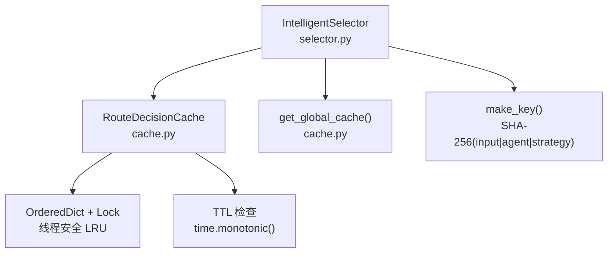
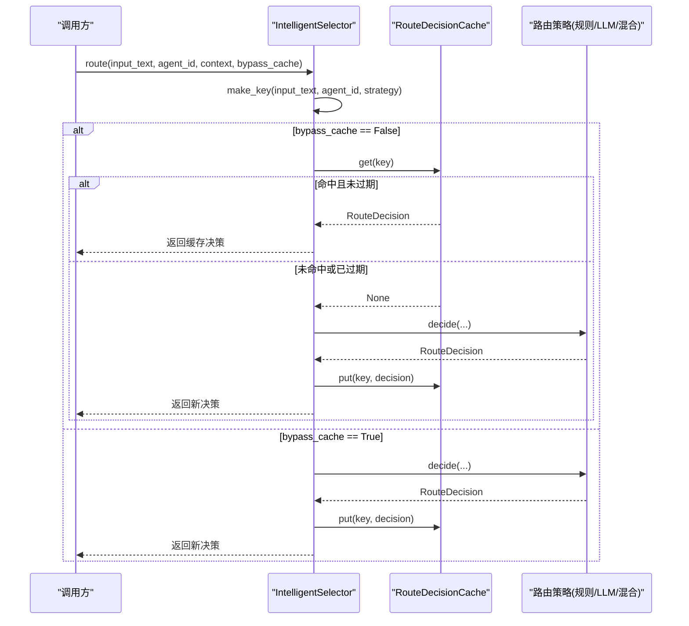
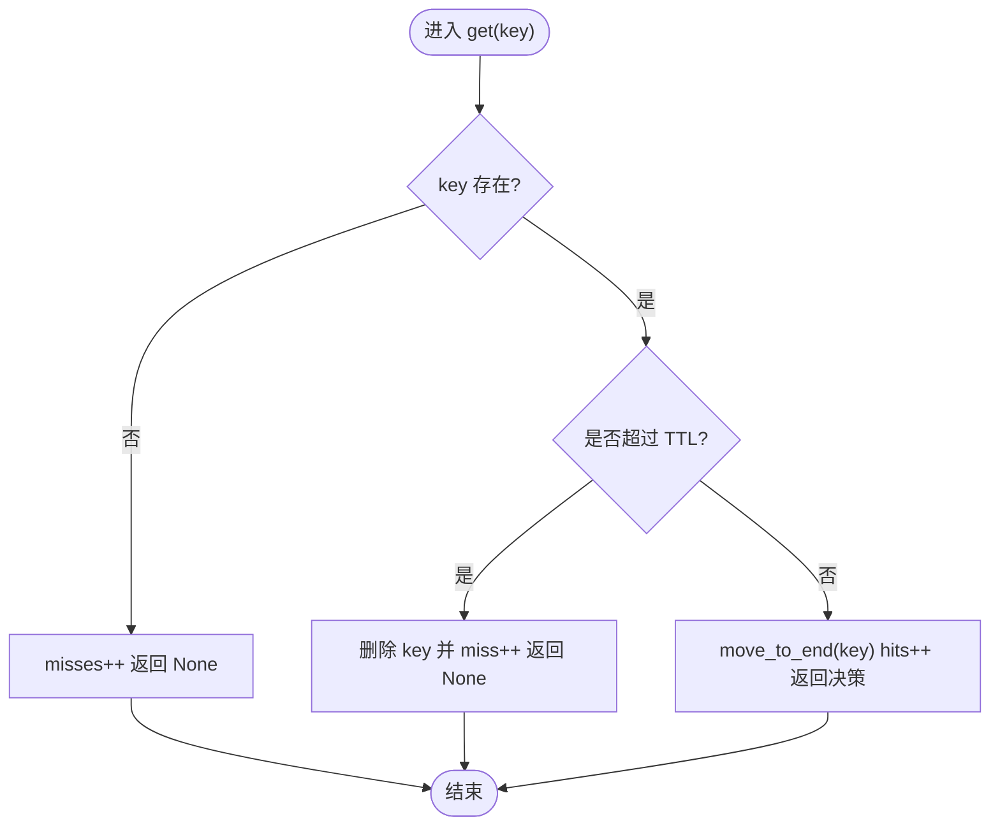
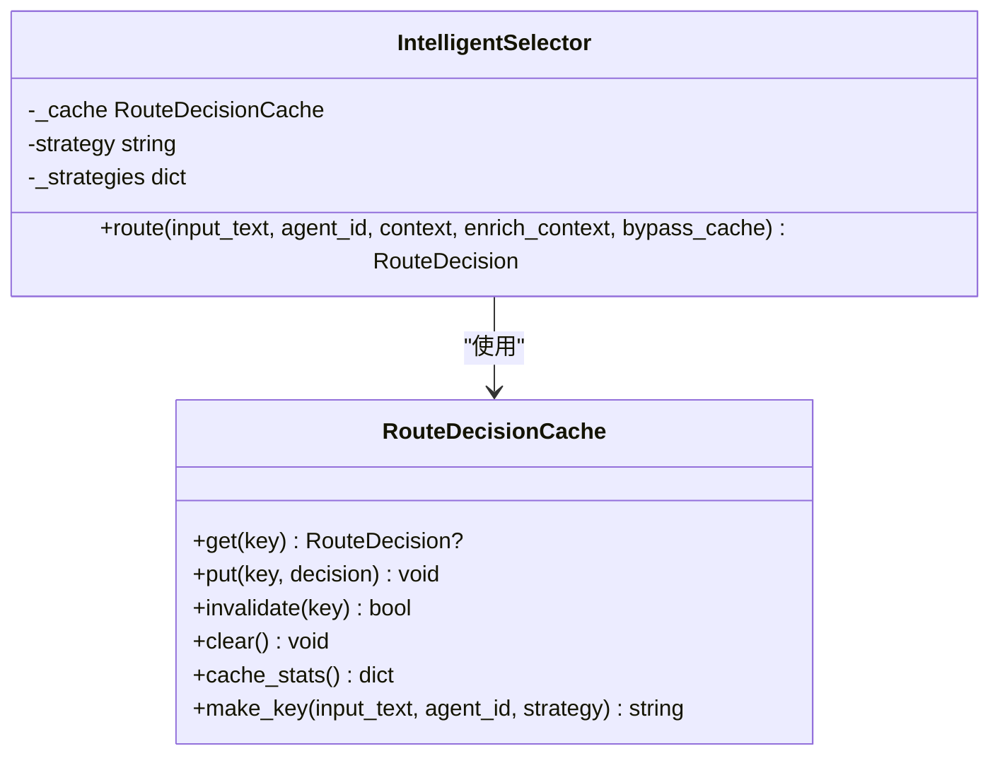
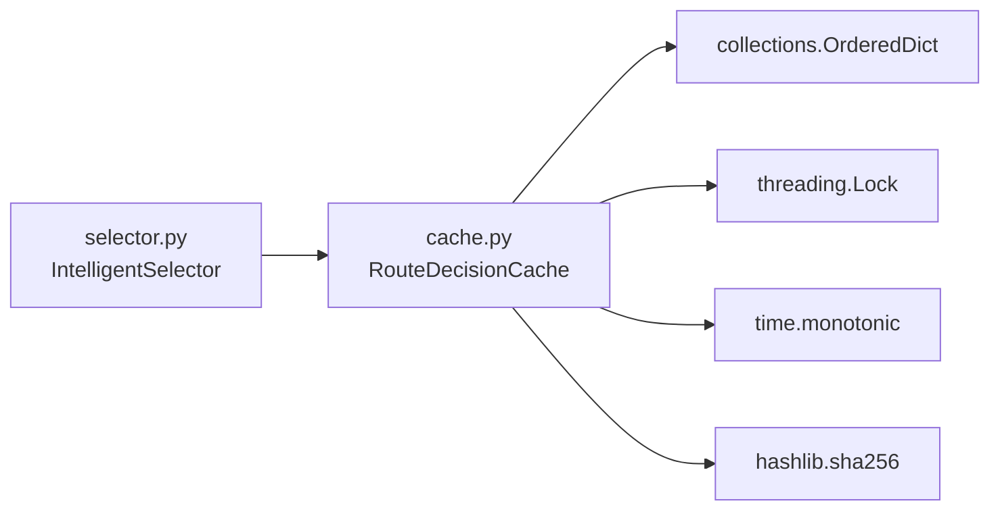

# 路由决策缓存

<cite>
**本文引用的文件**
- [python/src/resolveagent/selector/cache.py](file://python/src/resolveagent/selector/cache.py)
- [python/src/resolveagent/selector/selector.py](file://python/src/resolveagent/selector/selector.py)
- [python/tests/unit/test_selector_cache.py](file://python/tests/unit/test_selector_cache.py)
</cite>

## 目录
1. [简介](#简介)
2. [项目结构](#项目结构)
3. [核心组件](#核心组件)
4. [架构总览](#架构总览)
5. [详细组件分析](#详细组件分析)
6. [依赖关系分析](#依赖关系分析)
7. [性能考量](#性能考量)
8. [故障排查指南](#故障排查指南)
9. [结论](#结论)
10. [附录：配置与使用示例](#附录配置与使用示例)

## 简介
本技术文档聚焦于“路由决策缓存”系统，围绕 RouteDecisionCache 的设计原理与实现机制展开，涵盖缓存键生成、LRU 淘汰策略、TTL 过期管理、全局/实例级作用域模式，以及配置参数（最大容量、过期时间、作用域）对性能的影响。同时提供高并发场景下的性能优势与潜在问题说明，并给出配置与使用建议、命中率优化、内存管理与缓存失效处理的最佳实践。

## 项目结构
路由决策缓存位于选择器子系统内，核心由两个文件组成：
- 缓存实现：python/src/resolveagent/selector/cache.py
- 选择器集成：python/src/resolveagent/selector/selector.py
- 单元测试覆盖：python/tests/unit/test_selector_cache.py

图表来源
- [python/src/resolveagent/selector/selector.py:121-163](file://python/src/resolveagent/selector/selector.py#L121-L163)
- [python/src/resolveagent/selector/cache.py:20-111](file://python/src/resolveagent/selector/cache.py#L20-L111)

章节来源
- [python/src/resolveagent/selector/cache.py:1-112](file://python/src/resolveagent/selector/cache.py#L1-L112)
- [python/src/resolveagent/selector/selector.py:121-229](file://python/src/resolveagent/selector/selector.py#L121-L229)

## 核心组件
- RouteDecisionCache：基于 OrderedDict 的 TTL 感知 LRU 缓存，支持 get/put/invalidate/clear 及统计信息；内部使用 threading.Lock 保证线程安全。
- IntelligentSelector：在 route() 流程中集成缓存，通过 make_key 生成确定性键，并在命中时直接返回缓存结果；未命中则执行路由策略并将结果写入缓存。
- 全局缓存单例：get_global_cache 提供模块级共享缓存，便于跨实例复用。

章节来源
- [python/src/resolveagent/selector/cache.py:20-111](file://python/src/resolveagent/selector/cache.py#L20-L111)
- [python/src/resolveagent/selector/selector.py:121-229](file://python/src/resolveagent/selector/selector.py#L121-L229)

## 架构总览
路由决策缓存与选择器的交互时序如下：

图表来源
- [python/src/resolveagent/selector/selector.py:165-229](file://python/src/resolveagent/selector/selector.py#L165-L229)
- [python/src/resolveagent/selector/cache.py:36-69](file://python/src/resolveagent/selector/cache.py#L36-L69)

## 详细组件分析

### RouteDecisionCache：TTL 感知的 LRU 缓存
- 数据结构与复杂度
  - 使用 OrderedDict 维护插入顺序与访问顺序，get/put/move_to_end/popitem 均为 O(1)。
  - 空间复杂度 O(N)，N 为当前缓存条目数，受 max_size 限制。
- 缓存键生成
  - make_key 将 input_text、agent_id、strategy 拼接后做 SHA-256 哈希，确保相同输入在不同策略下不互相覆盖，且具备确定性。
- TTL 过期管理
  - 每个条目存储创建时间戳（time.monotonic()），get 时检查是否超过 ttl_seconds，若过期则删除并视为未命中。
- LRU 淘汰策略
  - put 时若达到 max_size，弹出最久未使用的条目（popitem(last=False)）。
  - get 命中会将键移动到末尾，体现“最近使用”。
- 线程安全
  - 所有读写操作均被 threading.Lock 保护，避免并发竞争。
- 统计与可观测性
  - cache_stats 返回 hits、misses、hit_rate、size、max_size、ttl_seconds，便于运行时监控。

图表来源
- [python/src/resolveagent/selector/cache.py:42-58](file://python/src/resolveagent/selector/cache.py#L42-L58)

章节来源
- [python/src/resolveagent/selector/cache.py:20-97](file://python/src/resolveagent/selector/cache.py#L20-L97)

### IntelligentSelector：缓存集成与路由流程
- 初始化与作用域
  - 支持 cache_scope="instance"（每实例独立缓存）与 "global"（模块级单例共享缓存）。
  - 通过 get_global_cache 获取全局缓存，否则创建实例级缓存。
- 路由流程
  - 计算缓存键：make_key(input_text, agent_id, strategy)。
  - 若 bypass_cache=False 且命中有效缓存，直接返回。
  - 否则执行路由策略（rule/llm/hybrid），得到 RouteDecision 后写入缓存。
  - 记录审计日志与延迟指标。
- 绕过缓存
  - 通过 bypass_cache=True 强制跳过缓存，用于调试或需要新鲜决策的场景。

图表来源
- [python/src/resolveagent/selector/selector.py:121-229](file://python/src/resolveagent/selector/selector.py#L121-L229)
- [python/src/resolveagent/selector/cache.py:20-111](file://python/src/resolveagent/selector/cache.py#L20-L111)

章节来源
- [python/src/resolveagent/selector/selector.py:121-229](file://python/src/resolveagent/selector/selector.py#L121-L229)

### 全局/实例级缓存模式
- 实例级（默认）：每个 IntelligentSelector 拥有独立缓存，隔离不同实例间的缓存状态，适合多租户或多进程隔离场景。
- 全局级：通过 get_global_cache 获取模块级单例，跨实例共享缓存，减少重复计算，但需注意作用域一致性与键冲突风险。

章节来源
- [python/src/resolveagent/selector/selector.py:157-160](file://python/src/resolveagent/selector/selector.py#L157-L160)
- [python/src/resolveagent/selector/cache.py:100-111](file://python/src/resolveagent/selector/cache.py#L100-L111)

## 依赖关系分析
- IntelligentSelector 依赖 RouteDecisionCache 进行缓存存取。
- RouteDecisionCache 依赖标准库 collections.OrderedDict、threading.Lock、time.monotonic、hashlib。
- 测试用例验证了 TTL 过期、LRU 淘汰、统计信息、键生成确定性与全局单例行为。

图表来源
- [python/src/resolveagent/selector/selector.py:121-229](file://python/src/resolveagent/selector/selector.py#L121-L229)
- [python/src/resolveagent/selector/cache.py:20-111](file://python/src/resolveagent/selector/cache.py#L20-L111)

章节来源
- [python/tests/unit/test_selector_cache.py:1-164](file://python/tests/unit/test_selector_cache.py#L1-L164)

## 性能考量
- 命中率优化
  - 合理设置 max_size：过小导致频繁淘汰，过大增加内存占用与锁竞争。
  - 合理设置 ttl_seconds：过短导致频繁失效，过长可能引入陈旧决策。
  - 使用全局缓存：在高并发、多实例共享相同策略与输入分布时，可显著提升命中率。
- 内存管理
  - LRU 淘汰保障内存上限，结合 TTL 自动清理过期条目，降低长期驻留风险。
  - 定期调用 clear() 或在业务边界重置缓存，避免长时间运行导致的累积压力。
- 高并发优势与潜在问题
  - 优势：命中路径仅涉及 O(1) 字典操作与锁，显著降低路由策略（尤其是 LLM）调用成本。
  - 潜在问题：热点键竞争可能导致锁成为瓶颈；全局缓存需关注键空间污染与跨实例一致性。
- 可观测性
  - 通过 cache_stats() 监控 hits、misses、hit_rate、size，结合日志中的 latency_ms 评估整体效果。

[本节为通用性能讨论，无需特定文件引用]

## 故障排查指南
- 缓存未命中
  - 检查 bypass_cache 是否意外设为 True。
  - 确认 make_key 的参数组合（input_text、agent_id、strategy）是否与预期一致。
  - 查看 cache_stats 的 misses 与 hit_rate，定位异常波动。
- TTL 过早失效
  - 调大 ttl_seconds，观察命中率变化。
  - 检查是否存在频繁更新同一 key 的行为导致 TTL 重置。
- LRU 淘汰过快
  - 增大 max_size，观察 size 与淘汰频率。
  - 分析热点键分布，必要时拆分作用域或使用更细粒度的键空间。
- 全局缓存污染
  - 确认全局单例仅在期望的作用域启用。
  - 在测试或部署环境中注意重置 _global_cache，避免状态泄漏。

章节来源
- [python/tests/unit/test_selector_cache.py:41-108](file://python/tests/unit/test_selector_cache.py#L41-L108)
- [python/src/resolveagent/selector/cache.py:42-97](file://python/src/resolveagent/selector/cache.py#L42-L97)

## 结论
RouteDecisionCache 以简洁高效的方式实现了 TTL 感知的 LRU 缓存，配合 IntelligentSelector 的路由流程，在高并发与复杂路由策略场景下显著降低计算开销。通过合理的配置（max_size、ttl_seconds、作用域）与可观测手段（cache_stats、日志），可在命中率、内存与延迟之间取得良好平衡。对于全局缓存模式，需谨慎设计键空间与作用域，以避免污染与一致性风险。

[本节为总结性内容，无需特定文件引用]

## 附录：配置与使用示例
以下示例展示如何配置和使用路由决策缓存，包括实例级与全局级两种模式，以及如何绕过缓存、获取统计信息与处理失效。

- 实例级缓存
  - 创建 IntelligentSelector 时指定 cache_scope="instance"，并配置 cache_max_size 与 cache_ttl_seconds。
  - 调用 route() 时，如希望强制重新计算，设置 bypass_cache=True。
  - 参考路径：[python/src/resolveagent/selector/selector.py:121-163](file://python/src/resolveagent/selector/selector.py#L121-L163)、[python/src/resolveagent/selector/selector.py:165-229](file://python/src/resolveagent/selector/selector.py#L165-L229)

- 全局级缓存
  - 通过 get_global_cache(max_size=..., ttl_seconds=...) 获取模块级单例，供多个选择器共享。
  - 注意首次调用时的参数会固定下来，后续调用忽略参数。
  - 参考路径：[python/src/resolveagent/selector/cache.py:100-111](file://python/src/resolveagent/selector/cache.py#L100-L111)

- 缓存键生成
  - 使用 RouteDecisionCache.make_key(input_text, agent_id, strategy) 生成确定性键。
  - 参考路径：[python/src/resolveagent/selector/cache.py:36-40](file://python/src/resolveagent/selector/cache.py#L36-L40)

- 统计与监控
  - 调用 cache.cache_stats() 获取 hits、misses、hit_rate、size、max_size、ttl_seconds。
  - 参考路径：[python/src/resolveagent/selector/cache.py:86-97](file://python/src/resolveagent/selector/cache.py#L86-L97)

- 失效与清理
  - 使用 invalidate(key) 移除单个条目，clear() 清空全部条目。
  - 参考路径：[python/src/resolveagent/selector/cache.py:71-84](file://python/src/resolveagent/selector/cache.py#L71-L84)

- 单元测试参考
  - 覆盖 TTL 过期、LRU 淘汰、统计信息、键生成确定性与全局单例行为。
  - 参考路径：[python/tests/unit/test_selector_cache.py:41-164](file://python/tests/unit/test_selector_cache.py#L41-L164)

[本节为使用指导，具体代码片段请参见上述文件路径]