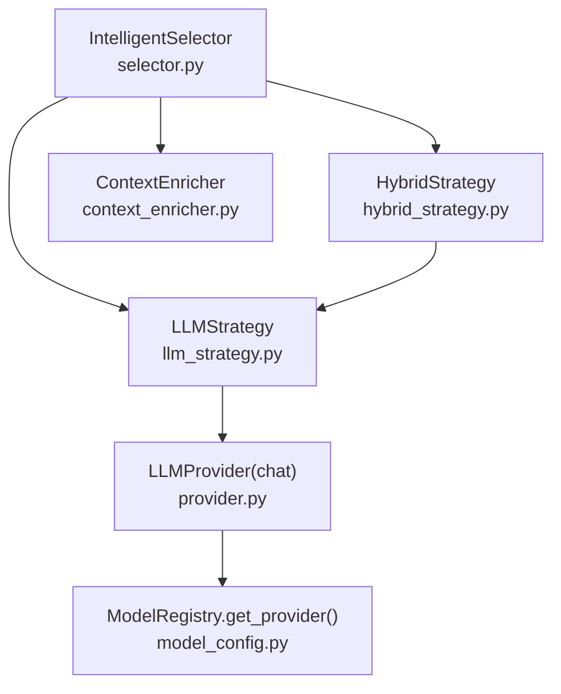
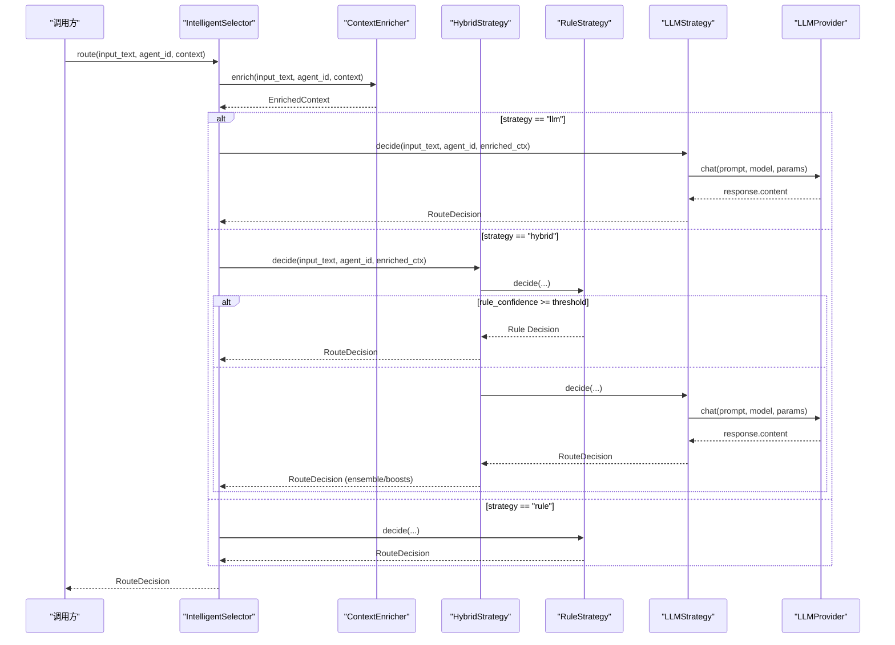
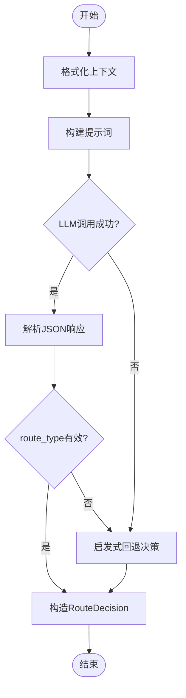
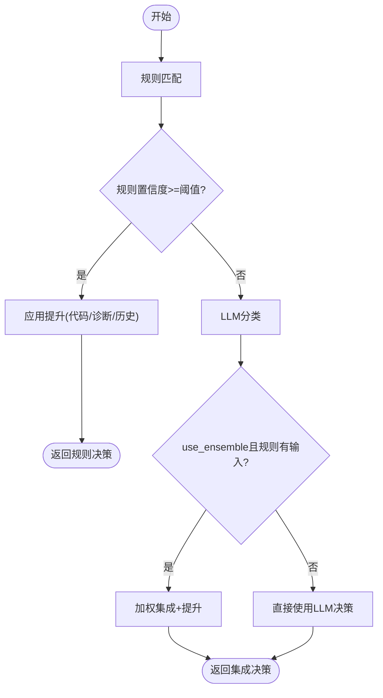
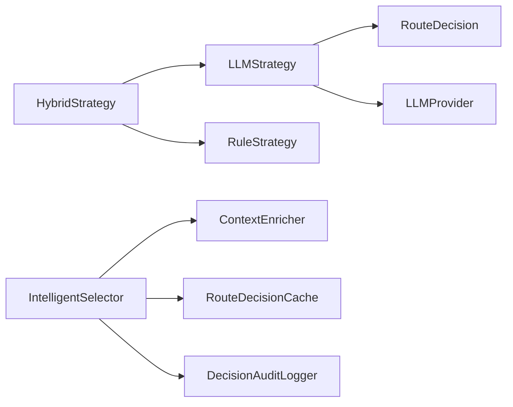

# LLM路由策略

<cite>
**本文引用的文件**
- [llm_strategy.py](file://python/src/resolveagent/selector/strategies/llm_strategy.py)
- [hybrid_strategy.py](file://python/src/resolveagent/selector/strategies/hybrid_strategy.py)
- [selector.py](file://python/src/resolveagent/selector/selector.py)
- [context_enricher.py](file://python/src/resolveagent/selector/context_enricher.py)
- [provider.py](file://python/src/resolveagent/llm/provider.py)
- [model_config.py](file://python/src/resolveagent/llm/model_config.py)
- [test_selector_complete.py](file://python/tests/unit/test_selector_complete.py)
</cite>

## 目录
1. [简介](#简介)
2. [项目结构](#项目结构)
3. [核心组件](#核心组件)
4. [架构总览](#架构总览)
5. [详细组件分析](#详细组件分析)
6. [依赖关系分析](#依赖关系分析)
7. [性能考量](#性能考量)
8. [故障排查指南](#故障排查指南)
9. [结论](#结论)
10. [附录：配置与调用示例](#附录配置与调用示例)

## 简介
本技术文档聚焦于“LLM路由策略”，即使用大语言模型进行意图分类与路由的纯LLM方案。该策略通过结构化提示词、上下文增强、置信度计算与回退机制，将用户请求智能地分发到工作流、技能执行、RAG检索、代码分析或直接对话等子系统。同时说明其在混合策略中的回退角色及与其他策略的协作方式，并提供配置、提示工程优化与性能监控的实践建议。

## 项目结构
围绕LLM路由策略的关键代码位于Python侧的selector与llm模块中：
- selector.strategies.llm_strategy：纯LLM路由策略实现
- selector.strategies.hybrid_strategy：规则+LLM混合策略（含回退）
- selector.selector：智能选择器编排与缓存、审计
- selector.context_enricher：上下文增强（会话历史、可用资源、代码上下文等）
- llm.provider / llm.model_config：LLM抽象接口与模型注册/提供者创建
- tests.unit.test_selector_complete：端到端用例验证路由行为

图表来源
- [selector.py:119-163](file://python/src/resolveagent/selector/selector.py#L119-L163)
- [llm_strategy.py:121-170](file://python/src/resolveagent/selector/strategies/llm_strategy.py#L121-L170)
- [hybrid_strategy.py:69-123](file://python/src/resolveagent/selector/strategies/hybrid_strategy.py#L69-L123)
- [context_enricher.py:206-271](file://python/src/resolveagent/selector/context_enricher.py#L206-L271)
- [provider.py:30-83](file://python/src/resolveagent/llm/provider.py#L30-L83)
- [model_config.py:24-91](file://python/src/resolveagent/llm/model_config.py#L24-L91)

章节来源
- [selector.py:86-163](file://python/src/resolveagent/selector/selector.py#L86-L163)
- [llm_strategy.py:19-170](file://python/src/resolveagent/selector/strategies/llm_strategy.py#L19-L170)
- [hybrid_strategy.py:21-123](file://python/src/resolveagent/selector/strategies/hybrid_strategy.py#L21-L123)
- [context_enricher.py:17-79](file://python/src/resolveagent/selector/context_enricher.py#L17-L79)
- [provider.py:14-83](file://python/src/resolveagent/llm/provider.py#L14-L83)
- [model_config.py:11-91](file://python/src/resolveagent/llm/model_config.py#L11-L91)

## 核心组件
- RouteDecision：统一的路由决策数据结构，包含route_type、route_target、confidence、parameters、reasoning、chain等字段，用于在系统内传递路由结果。
- IntelligentSelector：智能选择器，负责策略调度、上下文增强、缓存与审计；支持llm、rule、hybrid三种策略模式。
- LLMStrategy：纯LLM路由策略，基于结构化提示词与LLM输出解析，返回带置信度的路由决策。
- HybridStrategy：混合策略，先走规则快速路径，再回退到LLM；当两者一致时进行加权集成并应用额外置信度提升。
- ContextEnricher：为路由决策提供会话历史、可用技能/工作流/RAG集合、代码上下文、用户偏好等丰富信息。
- LLMProvider与ModelRegistry：统一的LLM抽象与模型注册/提供者创建，屏蔽不同后端差异。

章节来源
- [selector.py:22-84](file://python/src/resolveagent/selector/selector.py#L22-L84)
- [selector.py:86-163](file://python/src/resolveagent/selector/selector.py#L86-L163)
- [llm_strategy.py:19-170](file://python/src/resolveagent/selector/strategies/llm_strategy.py#L19-L170)
- [hybrid_strategy.py:21-123](file://python/src/resolveagent/selector/strategies/hybrid_strategy.py#L21-L123)
- [context_enricher.py:17-79](file://python/src/resolveagent/selector/context_enricher.py#L17-L79)
- [provider.py:14-83](file://python/src/resolveagent/llm/provider.py#L14-L83)
- [model_config.py:11-91](file://python/src/resolveagent/llm/model_config.py#L11-L91)

## 架构总览
下图展示了从输入到路由决策的完整流程，包括上下文增强、策略选择、LLM调用与回退、以及最终决策输出。

图表来源
- [selector.py:165-229](file://python/src/resolveagent/selector/selector.py#L165-L229)
- [context_enricher.py:206-271](file://python/src/resolveagent/selector/context_enricher.py#L206-L271)
- [hybrid_strategy.py:79-123](file://python/src/resolveagent/selector/strategies/hybrid_strategy.py#L79-L123)
- [llm_strategy.py:129-170](file://python/src/resolveagent/selector/strategies/llm_strategy.py#L129-L170)
- [provider.py:30-83](file://python/src/resolveagent/llm/provider.py#L30-L83)

## 详细组件分析

### LLMStrategy：纯LLM分类与路由
- 输入处理流程
  - 接收input_text、agent_id与context，构造结构化提示词，注入上下文摘要（可用技能、工作流、RAG集合、代码上下文）。
  - 调用LLMProvider.chat，设置较低temperature与合理max_tokens以稳定输出。
- 上下文增强机制
  - _format_context将上下文中可用资源与代码检测信息压缩为文本片段，便于LLM理解当前环境能力。
  - ContextEnricher在外部完成更全面的增强（会话历史、资源列表、代码块提取与复杂度估计），LLMStrategy仅消费其摘要。
- 置信度计算方法
  - 从LLM返回的JSON中读取confidence，并在解析阶段做范围裁剪与类型校验。
  - 若LLM返回非法route_type，则降级为direct并降低置信度。
  - 失败回退：当LLM调用或解析失败时，采用启发式回退（如检测到代码块、问号等）生成保守决策。
- 路由决策过程
  - 将LLM输出的JSON解析为RouteDecision，附加reasoning与原始响应片段参数，供后续审计与调试。
  - 支持fta到workflow的映射，保证与上层路由语义一致。

图表来源
- [llm_strategy.py:129-170](file://python/src/resolveagent/selector/strategies/llm_strategy.py#L129-L170)
- [llm_strategy.py:172-203](file://python/src/resolveagent/selector/strategies/llm_strategy.py#L172-L203)
- [llm_strategy.py:205-231](file://python/src/resolveagent/selector/strategies/llm_strategy.py#L205-L231)
- [llm_strategy.py:338-401](file://python/src/resolveagent/selector/strategies/llm_strategy.py#L338-L401)

章节来源
- [llm_strategy.py:19-401](file://python/src/resolveagent/selector/strategies/llm_strategy.py#L19-L401)
- [context_enricher.py:206-271](file://python/src/resolveagent/selector/context_enricher.py#L206-L271)

### HybridStrategy：规则+LLM的回退与集成
- 三阶段决策
  - Phase 1：规则匹配快速路径，若置信度达到阈值直接返回。
  - Phase 2：否则调用LLM进行分类。
  - Phase 3：当两者均给出输入且use_ensemble开启时，按权重组合置信度，并对一致结果进行小幅提升。
- 特殊提升
  - 代码块检测对code_analysis置信度提升。
  - 诊断关键词对workflow置信度提升。
  - 对话历史长度对rag置信度提升。
  - 可配置per-route-type额外提升。
- 回退角色
  - 在混合模式下，LLM作为复杂/模糊请求的最终仲裁者；当规则无法高置信命中时，LLM兜底。

图表来源
- [hybrid_strategy.py:79-123](file://python/src/resolveagent/selector/strategies/hybrid_strategy.py#L79-L123)
- [hybrid_strategy.py:125-175](file://python/src/resolveagent/selector/strategies/hybrid_strategy.py#L125-L175)
- [hybrid_strategy.py:177-211](file://python/src/resolveagent/selector/strategies/hybrid_strategy.py#L177-L211)

章节来源
- [hybrid_strategy.py:21-224](file://python/src/resolveagent/selector/strategies/hybrid_strategy.py#L21-L224)

### ContextEnricher：上下文增强
- 并行获取可用资源（技能、工作流、RAG集合），并按相关性排序前N项。
- 抽取会话历史，推断用户偏好（详细程度、是否偏好代码示例、语言倾向）。
- 代码上下文分析：提取代码块、识别语言、潜在问题、复杂度估计。
- 计算增强置信度，支持重试场景下的置信度衰减保持。

章节来源
- [context_enricher.py:17-79](file://python/src/resolveagent/selector/context_enricher.py#L17-L79)
- [context_enricher.py:206-271](file://python/src/resolveagent/selector/context_enricher.py#L206-L271)
- [context_enricher.py:523-633](file://python/src/resolveagent/selector/context_enricher.py#L523-L633)

### IntelligentSelector：策略编排与缓存
- 支持llm、rule、hybrid三种策略，默认hybrid。
- 路由前可选上下文增强；路由后记录延迟与审计日志。
- 内置RouteDecisionCache，可按实例或全局共享，减少重复计算。
- 提供analyze_intent辅助方法，用于轻量意图分析。

章节来源
- [selector.py:86-163](file://python/src/resolveagent/selector/selector.py#L86-L163)
- [selector.py:165-229](file://python/src/resolveagent/selector/selector.py#L165-L229)
- [selector.py:231-317](file://python/src/resolveagent/selector/selector.py#L231-L317)

### LLMProvider与ModelRegistry：模型选择与调用
- Provider定义统一的chat/chat_stream接口，屏蔽具体后端差异。
- ModelRegistry根据模型ID动态加载对应Provider（qwen、wenxin、zhipu、openai兼容等），支持base_url与api_key配置。
- LLMStrategy通过create_llm_provider(model=model_id)获取具体Provider实例进行调用。

章节来源
- [provider.py:14-83](file://python/src/resolveagent/llm/provider.py#L14-L83)
- [model_config.py:11-91](file://python/src/resolveagent/llm/model_config.py#L11-L91)
- [llm_strategy.py:205-231](file://python/src/resolveagent/selector/strategies/llm_strategy.py#L205-L231)

## 依赖关系分析
- LLMStrategy依赖：
  - selector.selector.RouteDecision（决策结构）
  - llm.provider.ChatMessage/ChatResponse（消息与响应模型）
  - llm.higress_provider.create_llm_provider（实际提供者工厂）
- HybridStrategy依赖：
  - RuleStrategy（规则匹配）
  - LLMStrategy（回退分类）
- IntelligentSelector依赖：
  - ContextEnricher（上下文增强）
  - RouteDecisionCache（缓存）
  - DecisionAuditLogger（审计）
- ContextEnricher依赖：
  - registry_client（可选，查询可用资源）
  - memory_client（可选，会话历史）

图表来源
- [llm_strategy.py:14-17](file://python/src/resolveagent/selector/strategies/llm_strategy.py#L14-L17)
- [llm_strategy.py:205-231](file://python/src/resolveagent/selector/strategies/llm_strategy.py#L205-L231)
- [hybrid_strategy.py:14-17](file://python/src/resolveagent/selector/strategies/hybrid_strategy.py#L14-L17)
- [selector.py:16-19](file://python/src/resolveagent/selector/selector.py#L16-L19)
- [selector.py:165-229](file://python/src/resolveagent/selector/selector.py#L165-L229)

章节来源
- [llm_strategy.py:14-17](file://python/src/resolveagent/selector/strategies/llm_strategy.py#L14-L17)
- [hybrid_strategy.py:14-17](file://python/src/resolveagent/selector/strategies/hybrid_strategy.py#L14-L17)
- [selector.py:16-19](file://python/src/resolveagent/selector/selector.py#L16-L19)

## 性能考量
- 低温度与有限token：LLMStrategy调用时设置较低temperature与合理的max_tokens，有助于提高稳定性与降低延迟。
- 规则优先：HybridStrategy先走规则快速路径，仅在必要时调用LLM，显著降低平均延迟与成本。
- 缓存命中：IntelligentSelector对路由决策进行缓存，避免重复计算。
- 上下文增强开销：ContextEnricher并行获取资源，但仍有I/O成本；在高吞吐场景下需评估registry/memory可用性。
- 回退路径：LLM调用失败时快速回退到启发式决策，保障服务可用性。

[本节为通用指导，不直接分析具体文件]

## 故障排查指南
- LLM调用失败
  - 现象：LLMStrategy._call_llm抛出异常，进入_simulate_llm_response或_fallback_decision。
  - 排查：检查模型配置、网络连通性、API Key与Base URL是否正确；确认create_llm_provider能正确返回Provider。
  - 参考位置：[llm_strategy.py:205-231](file://python/src/resolveagent/selector/strategies/llm_strategy.py#L205-L231)、[llm_strategy.py:375-401](file://python/src/resolveagent/selector/strategies/llm_strategy.py#L375-L401)
- JSON解析失败
  - 现象：_parse_llm_response捕获JSONDecodeError/KeyError/TypeError，触发回退。
  - 排查：检查提示词约束与模型输出格式；确保返回JSON能被正则提取并解析。
  - 参考位置：[llm_strategy.py:338-374](file://python/src/resolveagent/selector/strategies/llm_strategy.py#L338-L374)
- 规则未命中导致频繁回退
  - 现象：HybridStrategy中规则置信度低于阈值，总是进入LLM分支。
  - 排查：调整rule_confidence_threshold或优化规则集；观察日志中的decision与reasoning。
  - 参考位置：[hybrid_strategy.py:97-123](file://python/src/resolveagent/selector/strategies/hybrid_strategy.py#L97-L123)
- 上下文增强失败
  - 现象：ContextEnricher查询registry/memory失败，降级为默认数据。
  - 排查：检查registry_client与memory_client连接；关注警告日志。
  - 参考位置：[context_enricher.py:273-460](file://python/src/resolveagent/selector/context_enricher.py#L273-L460)

章节来源
- [llm_strategy.py:205-231](file://python/src/resolveagent/selector/strategies/llm_strategy.py#L205-L231)
- [llm_strategy.py:338-401](file://python/src/resolveagent/selector/strategies/llm_strategy.py#L338-L401)
- [hybrid_strategy.py:97-123](file://python/src/resolveagent/selector/strategies/hybrid_strategy.py#L97-L123)
- [context_enricher.py:273-460](file://python/src/resolveagent/selector/context_enricher.py#L273-L460)

## 结论
LLM路由策略通过结构化提示词与上下文增强，实现对复杂、模糊请求的高精度分类与路由；在混合策略中承担回退与仲裁角色，兼顾准确性与性能。结合缓存、规则优先与回退机制，可在生产环境中获得稳定、可观测、可扩展的路由能力。

[本节为总结，不直接分析具体文件]

## 附录：配置与调用示例
以下示例展示如何配置与调用LLM策略，包括模型选择、提示工程优化与性能监控技巧。为避免泄露实现细节，仅提供路径引用与步骤说明。

- 模型选择与注册
  - 使用ModelRegistry.register(ModelConfig(...))注册模型ID、provider、model_name、api_key、base_url等。
  - 通过ModelRegistry.get_provider(model_id)获取具体Provider实例。
  - 参考：[model_config.py:11-91](file://python/src/resolveagent/llm/model_config.py#L11-L91)

- 初始化LLMStrategy并指定模型
  - 通过LLMStrategy(model_id=...)传入已注册的模型ID，内部会调用create_llm_provider(model=model_id)。
  - 参考：[llm_strategy.py:121-127](file://python/src/resolveagent/selector/strategies/llm_strategy.py#L121-L127)、[llm_strategy.py:205-231](file://python/src/resolveagent/selector/strategies/llm_strategy.py#L205-L231)

- 调用IntelligentSelector使用纯LLM策略
  - 创建IntelligentSelector(strategy="llm")，调用route(input_text, agent_id, context)，即可得到RouteDecision。
  - 参考：[selector.py:119-163](file://python/src/resolveagent/selector/selector.py#L119-L163)、[selector.py:165-229](file://python/src/resolveagent/selector/selector.py#L165-L229)

- 提示工程优化
  - 在ROUTING_PROMPT中明确路由类别、目标、置信度与推理要求，限制输出为JSON。
  - 通过_format_context注入可用技能、工作流、RAG集合与代码上下文，提升分类质量。
  - 参考：[llm_strategy.py:36-110](file://python/src/resolveagent/selector/strategies/llm_strategy.py#L36-L110)、[llm_strategy.py:172-203](file://python/src/resolveagent/selector/strategies/llm_strategy.py#L172-L203)

- 性能监控技巧
  - 利用IntelligentSelector.route记录的latency_ms与strategy、route_type、confidence等字段进行指标采集。
  - 使用DecisionAuditLogger异步记录决策审计日志，便于回溯与分析。
  - 参考：[selector.py:199-229](file://python/src/resolveagent/selector/selector.py#L199-L229)

- 单元测试参考
  - 查看测试用例中对不同输入的路由预期与断言，帮助理解各策略的行为边界。
  - 参考：[test_selector_complete.py:33-155](file://python/tests/unit/test_selector_complete.py#L33-L155)

章节来源
- [model_config.py:11-91](file://python/src/resolveagent/llm/model_config.py#L11-L91)
- [llm_strategy.py:36-110](file://python/src/resolveagent/selector/strategies/llm_strategy.py#L36-L110)
- [llm_strategy.py:121-127](file://python/src/resolveagent/selector/strategies/llm_strategy.py#L121-L127)
- [llm_strategy.py:172-203](file://python/src/resolveagent/selector/strategies/llm_strategy.py#L172-L203)
- [llm_strategy.py:205-231](file://python/src/resolveagent/selector/strategies/llm_strategy.py#L205-L231)
- [selector.py:119-229](file://python/src/resolveagent/selector/selector.py#L119-L229)
- [test_selector_complete.py:33-155](file://python/tests/unit/test_selector_complete.py#L33-L155)