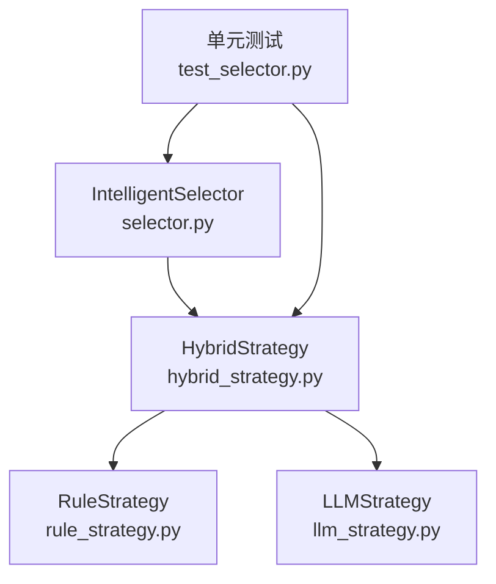
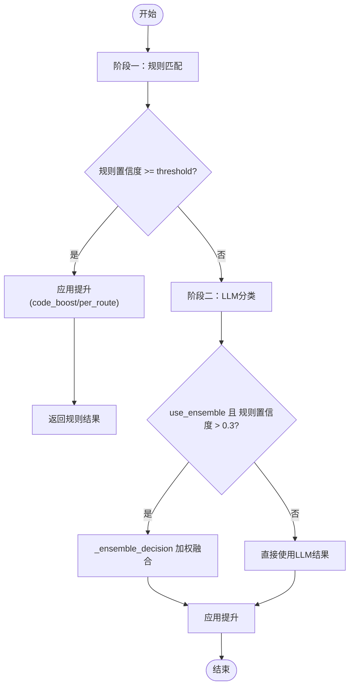
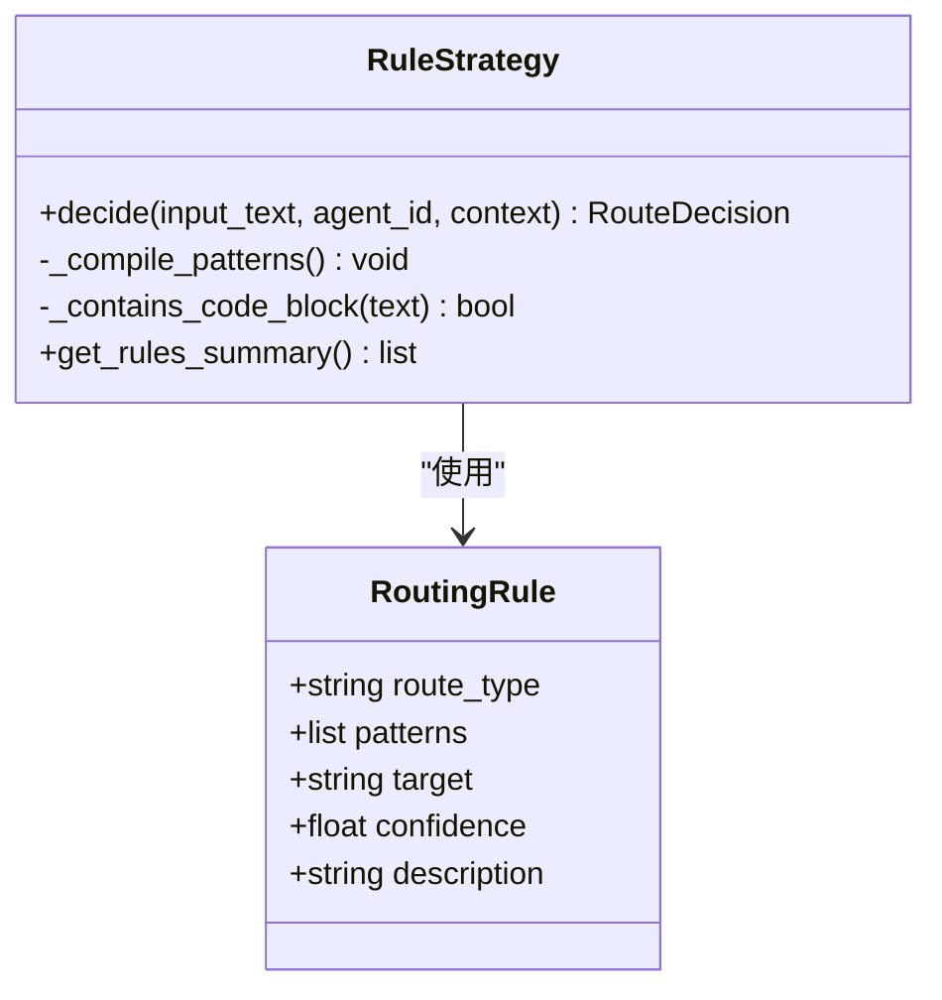
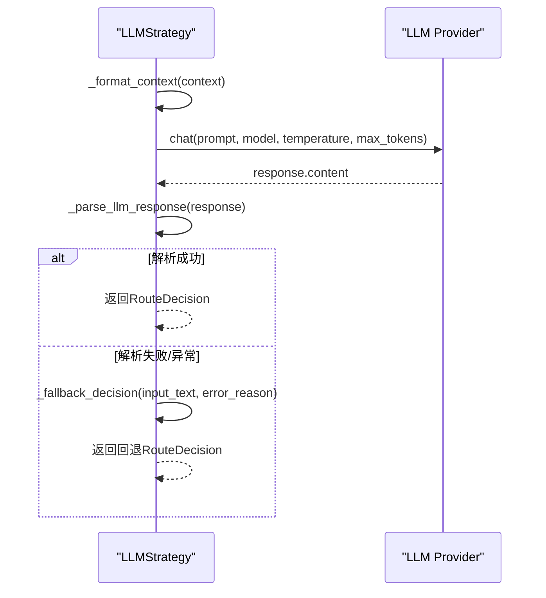
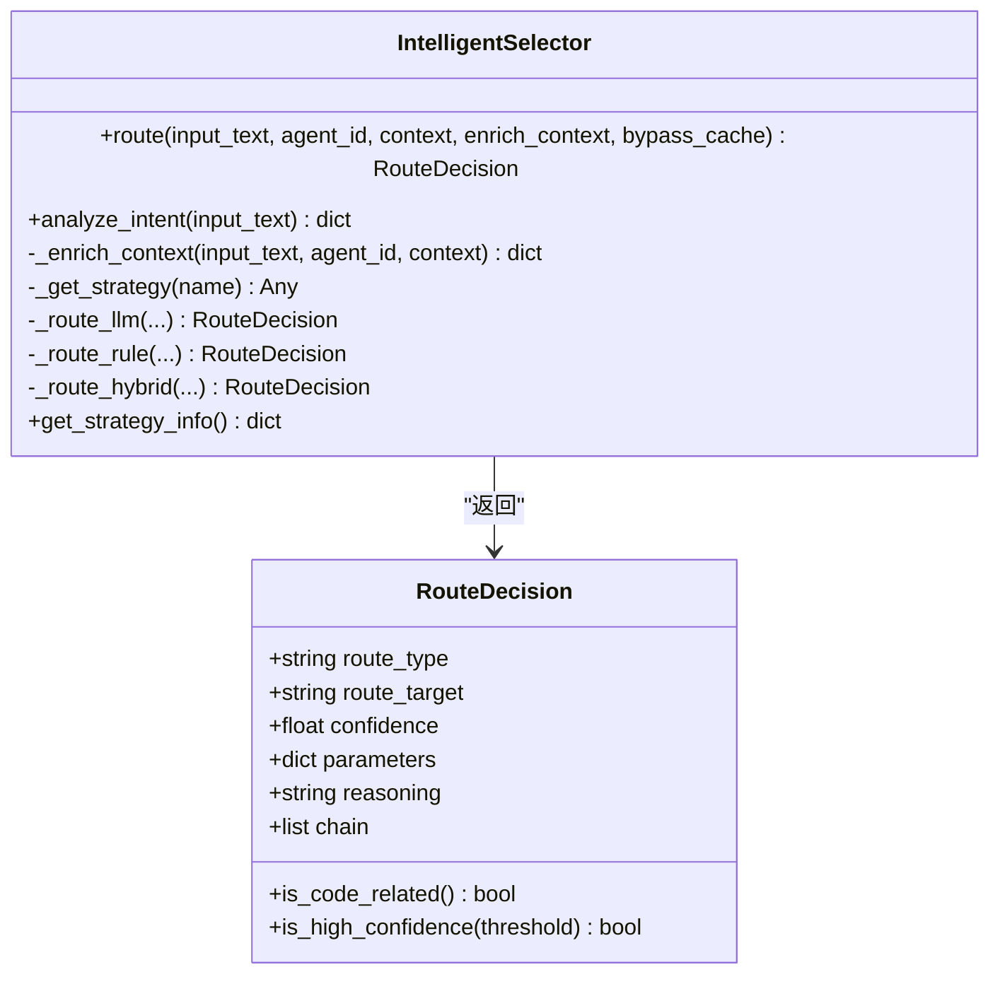
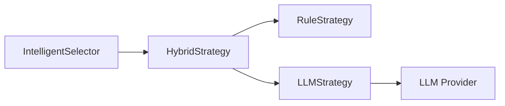

# 混合路由策略

<cite>
**本文引用的文件**
- [hybrid_strategy.py](file://python/src/resolveagent/selector/strategies/hybrid_strategy.py)
- [rule_strategy.py](file://python/src/resolveagent/selector/strategies/rule_strategy.py)
- [llm_strategy.py](file://python/src/resolveagent/selector/strategies/llm_strategy.py)
- [selector.py](file://python/src/resolveagent/selector/selector.py)
- [test_selector.py](file://python/tests/unit/test_selector.py)
</cite>

## 目录
1. [简介](#简介)
2. [项目结构](#项目结构)
3. [核心组件](#核心组件)
4. [架构总览](#架构总览)
5. [详细组件分析](#详细组件分析)
6. [依赖关系分析](#依赖关系分析)
7. [性能考量](#性能考量)
8. [故障排查指南](#故障排查指南)
9. [结论](#结论)
10. [附录：配置与使用示例](#附录配置与使用示例)

## 简介
本技术文档聚焦于“混合路由策略”（HybridStrategy）的设计与实现，系统性阐述其“三阶段决策流程”：
- 第一阶段：快速规则匹配（Rule-based Matching）
- 第二阶段：LLM分类（LLM Classification）
- 第三阶段：集成决策（Weighted Ensemble）

同时解释关键配置参数的作用机制（如 rule_confidence_threshold、llm_confidence_threshold、use_ensemble），说明“规则优先、LLM回退”的协作逻辑，以及当两种策略达成一致时的加权融合算法。最后提供具体代码路径与使用方式，涵盖特殊提升机制（code_boost、per_route_boosts）的应用场景与效果评估方法。

## 项目结构
围绕混合路由策略的相关代码位于 Python 选择器子系统中：
- 策略层：规则策略、LLM策略、混合策略
- 编排层：智能选择器（IntelligentSelector）负责调度策略并缓存结果
- 测试层：覆盖各策略与混合策略的行为验证



图表来源
- [selector.py:119-148](file://python/src/resolveagent/selector/selector.py#L119-L148)
- [hybrid_strategy.py:41-78](file://python/src/resolveagent/selector/strategies/hybrid_strategy.py#L41-L78)
- [rule_strategy.py:28-41](file://python/src/resolveagent/selector/strategies/rule_strategy.py#L28-L41)
- [llm_strategy.py:19-34](file://python/src/resolveagent/selector/strategies/llm_strategy.py#L19-L34)

章节来源
- [selector.py:119-148](file://python/src/resolveagent/selector/selector.py#L119-L148)
- [hybrid_strategy.py:41-78](file://python/src/resolveagent/selector/strategies/hybrid_strategy.py#L41-L78)

## 核心组件
- HybridConfig：定义混合策略的配置项，包括阈值、权重、提升参数等
- HybridStrategy：实现三阶段决策流程，协调规则与LLM策略，执行加权集成与特殊提升
- RuleStrategy：基于预定义正则模式进行快速、确定性匹配，返回高置信度结果
- LLMStrategy：通过大模型对复杂或模糊请求进行分类，具备上下文感知与容错回退
- IntelligentSelector：统一入口，支持 llm/rule/hybrid 三种策略，并提供缓存、审计与上下文增强

章节来源
- [hybrid_strategy.py:21-38](file://python/src/resolveagent/selector/strategies/hybrid_strategy.py#L21-L38)
- [hybrid_strategy.py:41-78](file://python/src/resolveagent/selector/strategies/hybrid_strategy.py#L41-L78)
- [rule_strategy.py:17-41](file://python/src/resolveagent/selector/strategies/rule_strategy.py#L17-L41)
- [llm_strategy.py:19-34](file://python/src/resolveagent/selector/strategies/llm_strategy.py#L19-L34)
- [selector.py:86-163](file://python/src/resolveagent/selector/selector.py#L86-L163)

## 架构总览
混合路由的整体调用链如下：
- 客户端调用 IntelligentSelector.route()
- 根据策略选择对应实现；默认 hybrid
- HybridStrategy.decide() 依次执行：
  - 阶段一：RuleStrategy.decide() 快速匹配
  - 阶段二：若未达阈值，则 LLMStrategy.decide() 分类
  - 阶段三：可选加权集成（当 use_ensemble 为真且规则置信度大于阈值）
- 最终应用特殊提升（code_boost、per_route_boosts）并返回 RouteDecision

```mermaid
sequenceDiagram
participant Client as "调用方"
participant Selector as "IntelligentSelector"
participant Hybrid as "HybridStrategy"
participant Rule as "RuleStrategy"
participant LLM as "LLMStrategy"
Client->>Selector : route(input_text, agent_id, context)
Selector->>Hybrid : decide(input_text, agent_id, context)
Hybrid->>Rule : decide(...)
Rule-->>Hybrid : RouteDecision(规则结果)
alt 规则置信度 >= rule_confidence_threshold
Hybrid-->>Selector : 直接返回(含提升后结果)
else 需要回退
Hybrid->>LLM : decide(...)
LLM-->>Hybrid : RouteDecision(LLM结果)
opt use_ensemble 且规则置信度 > 0.3
Hybrid->>Hybrid : _ensemble_decision(...)
Hybrid-->>Selector : 集成后的决策
else 不使用集成
Hybrid-->>Selector : LLM结果(含提升)
end
end
```

图表来源
- [selector.py:165-229](file://python/src/resolveagent/selector/selector.py#L165-L229)
- [hybrid_strategy.py:79-123](file://python/src/resolveagent/selector/strategies/hybrid_strategy.py#L79-L123)
- [rule_strategy.py:205-264](file://python/src/resolveagent/selector/strategies/rule_strategy.py#L205-L264)
- [llm_strategy.py:129-170](file://python/src/resolveagent/selector/strategies/llm_strategy.py#L129-L170)

## 详细组件分析

### 混合策略（HybridStrategy）
设计理念
- 规则优先：对可预测、明确的请求以极低延迟给出高置信度决策
- LLM回退：对模糊、复杂或多意图请求利用大模型的语义理解能力
- 集成决策：当两者一致时，通过加权融合提升整体准确性与鲁棒性

三阶段决策流程
- 阶段一：快速规则匹配
  - 调用 RuleStrategy.decide()
  - 若 confidence >= rule_confidence_threshold，立即返回（并应用提升）
- 阶段二：LLM分类
  - 调用 LLMStrategy.decide()
  - 处理上下文、调用LLM或模拟响应、解析JSON输出
- 阶段三：集成决策
  - 若 use_ensemble 为真且规则置信度 > 0.3，进入加权融合
  - 若两者一致：按 rule_weight 与 llm_weight 组合置信度，并采用更高置信度的目标与参数
  - 若不一致：选择置信度更高的策略结果，并在参数中记录对方建议

特殊提升机制
- code_boost：当判定为 code_analysis 且上下文检测到代码块时，提升置信度；复杂度提示为 high 时额外提升
- per_route_boosts：针对特定路由类型（如 workflow、rag）的可配置额外提升
- 其他内置提升：诊断关键词对 workflow 的提升、对话历史长度对 rag 的提升

配置参数与作用机制
- rule_confidence_threshold：规则路径的触发阈值，高于该值即短路返回
- llm_confidence_threshold：用于控制LLM路径的置信度门槛（在混合策略中主要用于日志与后续扩展）
- use_ensemble：是否启用加权集成
- rule_weight / llm_weight：集成时两者的权重分配
- code_boost：代码相关请求的额外置信度提升
- per_route_boosts：按路由类型的额外提升字典



图表来源
- [hybrid_strategy.py:79-123](file://python/src/resolveagent/selector/strategies/hybrid_strategy.py#L79-L123)
- [hybrid_strategy.py:125-175](file://python/src/resolveagent/selector/strategies/hybrid_strategy.py#L125-L175)
- [hybrid_strategy.py:177-211](file://python/src/resolveagent/selector/strategies/hybrid_strategy.py#L177-L211)

章节来源
- [hybrid_strategy.py:21-38](file://python/src/resolveagent/selector/strategies/hybrid_strategy.py#L21-L38)
- [hybrid_strategy.py:41-78](file://python/src/resolveagent/selector/strategies/hybrid_strategy.py#L41-L78)
- [hybrid_strategy.py:79-123](file://python/src/resolveagent/selector/strategies/hybrid_strategy.py#L79-L123)
- [hybrid_strategy.py:125-175](file://python/src/resolveagent/selector/strategies/hybrid_strategy.py#L125-L175)
- [hybrid_strategy.py:177-211](file://python/src/resolveagent/selector/strategies/hybrid_strategy.py#L177-L211)

### 规则策略（RuleStrategy）
- 基于预编译的正则模式进行匹配，命中数越多得分越高
- 对代码块进行兜底检测，确保代码类请求被正确识别
- 若无足够置信度匹配，返回低置信度的 direct 结果，交由上层回退



图表来源
- [rule_strategy.py:17-41](file://python/src/resolveagent/selector/strategies/rule_strategy.py#L17-L41)
- [rule_strategy.py:194-264](file://python/src/resolveagent/selector/strategies/rule_strategy.py#L194-L264)

章节来源
- [rule_strategy.py:17-41](file://python/src/resolveagent/selector/strategies/rule_strategy.py#L17-L41)
- [rule_strategy.py:194-264](file://python/src/resolveagent/selector/strategies/rule_strategy.py#L194-L264)

### LLM策略（LLMStrategy）
- 构建包含可用技能、工作流、知识库、代码上下文的提示词
- 调用LLM提供商（失败时回退到模拟响应）
- 解析JSON输出，校验路由类型，必要时将 fta 映射为 workflow
- 提供多种回退逻辑（解析失败、异常、启发式判断）



图表来源
- [llm_strategy.py:129-170](file://python/src/resolveagent/selector/strategies/llm_strategy.py#L129-L170)
- [llm_strategy.py:172-203](file://python/src/resolveagent/selector/strategies/llm_strategy.py#L172-L203)
- [llm_strategy.py:205-230](file://python/src/resolveagent/selector/strategies/llm_strategy.py#L205-L230)
- [llm_strategy.py:338-401](file://python/src/resolveagent/selector/strategies/llm_strategy.py#L338-L401)

章节来源
- [llm_strategy.py:19-34](file://python/src/resolveagent/selector/strategies/llm_strategy.py#L19-L34)
- [llm_strategy.py:129-170](file://python/src/resolveagent/selector/strategies/llm_strategy.py#L129-L170)
- [llm_strategy.py:205-230](file://python/src/resolveagent/selector/strategies/llm_strategy.py#L205-L230)
- [llm_strategy.py:338-401](file://python/src/resolveagent/selector/strategies/llm_strategy.py#L338-L401)

### 智能选择器（IntelligentSelector）
- 支持 llm/rule/hybrid 三种策略，默认 hybrid
- 提供上下文增强、缓存、审计日志
- 通过路由函数分发到具体策略实例



图表来源
- [selector.py:22-84](file://python/src/resolveagent/selector/selector.py#L22-L84)
- [selector.py:86-163](file://python/src/resolveagent/selector/selector.py#L86-L163)
- [selector.py:165-229](file://python/src/resolveagent/selector/selector.py#L165-L229)
- [selector.py:274-304](file://python/src/resolveagent/selector/selector.py#L274-L304)

章节来源
- [selector.py:22-84](file://python/src/resolveagent/selector/selector.py#L22-L84)
- [selector.py:86-163](file://python/src/resolveagent/selector/selector.py#L86-L163)
- [selector.py:165-229](file://python/src/resolveagent/selector/selector.py#L165-L229)
- [selector.py:274-304](file://python/src/resolveagent/selector/selector.py#L274-L304)

## 依赖关系分析
- HybridStrategy 依赖 RuleStrategy 与 LLMStrategy
- RuleStrategy 依赖正则匹配与代码块检测
- LLMStrategy 依赖外部LLM提供商（失败时回退）
- IntelligentSelector 统一管理策略实例与缓存、审计



图表来源
- [selector.py:119-148](file://python/src/resolveagent/selector/selector.py#L119-L148)
- [hybrid_strategy.py:41-78](file://python/src/resolveagent/selector/strategies/hybrid_strategy.py#L41-L78)
- [llm_strategy.py:205-230](file://python/src/resolveagent/selector/strategies/llm_strategy.py#L205-L230)

章节来源
- [selector.py:119-148](file://python/src/resolveagent/selector/selector.py#L119-L148)
- [hybrid_strategy.py:41-78](file://python/src/resolveagent/selector/strategies/hybrid_strategy.py#L41-L78)
- [llm_strategy.py:205-230](file://python/src/resolveagent/selector/strategies/llm_strategy.py#L205-L230)

## 性能考量
- 规则路径为O(n)正则扫描，但模式数量固定且预编译，延迟极低
- LLM路径存在网络与推理开销，应尽量避免不必要的调用（通过高阈值短路）
- 集成决策仅在规则置信度>0.3且启用use_ensemble时发生，避免无意义计算
- 缓存策略可减少重复决策成本（IntelligentSelector内部缓存）
- 特殊提升（code_boost、per_route_boosts）为常数时间操作

[本节为通用指导，不直接分析具体文件]

## 故障排查指南
- LLM调用失败：LLMStrategy会记录警告并使用模拟响应或启发式回退；检查日志中的错误信息与回退决策
- 解析失败：LLM返回非JSON或格式错误时，尝试放宽提示词约束或增加重试
- 规则误判：调整ROUTING_RULES的模式与优先级，或通过提高rule_confidence_threshold减少误用
- 集成偏差：调整rule_weight与llm_weight，观察一致性场景下的综合置信度变化
- 提升过度：降低code_boost或per_route_boosts，避免对非目标路由的过拟合

章节来源
- [llm_strategy.py:205-230](file://python/src/resolveagent/selector/strategies/llm_strategy.py#L205-L230)
- [llm_strategy.py:338-401](file://python/src/resolveagent/selector/strategies/llm_strategy.py#L338-L401)
- [rule_strategy.py:194-264](file://python/src/resolveagent/selector/strategies/rule_strategy.py#L194-L264)
- [hybrid_strategy.py:125-175](file://python/src/resolveagent/selector/strategies/hybrid_strategy.py#L125-L175)

## 结论
混合路由策略通过“规则优先、LLM回退、集成决策”的组合，兼顾了速度与准确性：
- 明确、可预测的请求由规则快速处理
- 模糊、复杂请求由LLM进行深度理解
- 两者一致时通过加权融合进一步提升可靠性
- 特殊提升机制针对常见场景（代码、诊断、知识检索）进行微调
- 通过合理配置阈值与权重，可在不同业务场景下取得最佳平衡

[本节为总结，不直接分析具体文件]

## 附录：配置与使用示例

### 配置参数说明
- rule_confidence_threshold：规则路径的触发阈值，高于该值即短路返回
- llm_confidence_threshold：LLM路径的置信度门槛（当前主要用于日志与扩展点）
- use_ensemble：是否启用加权集成
- rule_weight / llm_weight：集成时两者的权重分配
- code_boost：代码相关请求的额外置信度提升
- per_route_boosts：按路由类型的额外提升字典（例如 {"workflow": 0.05}）

章节来源
- [hybrid_strategy.py:21-38](file://python/src/resolveagent/selector/strategies/hybrid_strategy.py#L21-L38)
- [hybrid_strategy.py:213-223](file://python/src/resolveagent/selector/strategies/hybrid_strategy.py#L213-L223)

### 使用方式（代码路径参考）
- 创建混合策略实例并传入自定义配置：
  - 参考路径：[hybrid_strategy.py:69-77](file://python/src/resolveagent/selector/strategies/hybrid_strategy.py#L69-L77)
- 通过智能选择器路由请求（默认使用 hybrid）：
  - 参考路径：[selector.py:165-229](file://python/src/resolveagent/selector/selector.py#L165-L229)
- 单元测试展示混合策略行为与自定义配置：
  - 参考路径：[test_selector.py:296-340](file://python/tests/unit/test_selector.py#L296-L340)

### 特殊提升机制应用场景
- code_boost：当输入包含代码块且判定为 code_analysis 时，提升置信度；复杂度提示为 high 时额外提升
  - 参考路径：[hybrid_strategy.py:177-193](file://python/src/resolveagent/selector/strategies/hybrid_strategy.py#L177-L193)
- per_route_boosts：对特定路由类型（如 workflow、rag）进行额外提升
  - 参考路径：[hybrid_strategy.py:206-210](file://python/src/resolveagent/selector/strategies/hybrid_strategy.py#L206-L210)

### 效果评估方法
- 观察决策的 reasoning 字段，确认是否走规则路径、LLM回退或集成路径
- 对比 rule_confidence 与 llm_confidence，评估一致性场景下的融合效果
- 监控 latency_ms（由 IntelligentSelector 记录），评估规则短路与LLM调用的影响
- 通过单元测试断言路由类型与置信度范围，验证策略稳定性
  - 参考路径：[test_selector.py:304-340](file://python/tests/unit/test_selector.py#L304-L340)

章节来源
- [hybrid_strategy.py:177-211](file://python/src/resolveagent/selector/strategies/hybrid_strategy.py#L177-L211)
- [selector.py:199-227](file://python/src/resolveagent/selector/selector.py#L199-L227)
- [test_selector.py:304-340](file://python/tests/unit/test_selector.py#L304-L340)