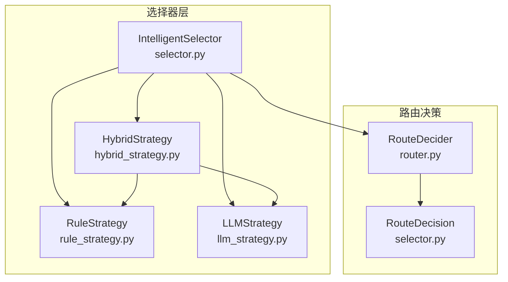
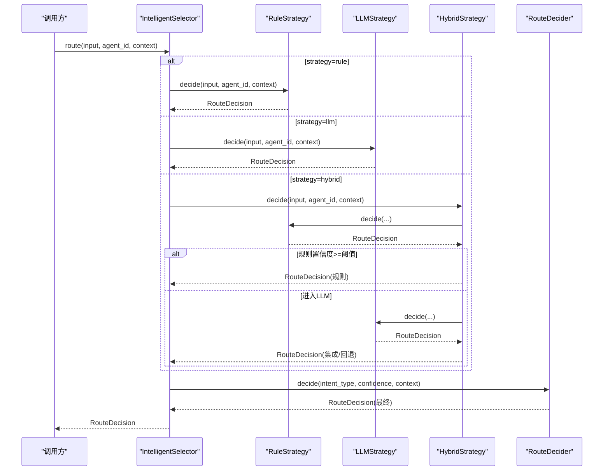
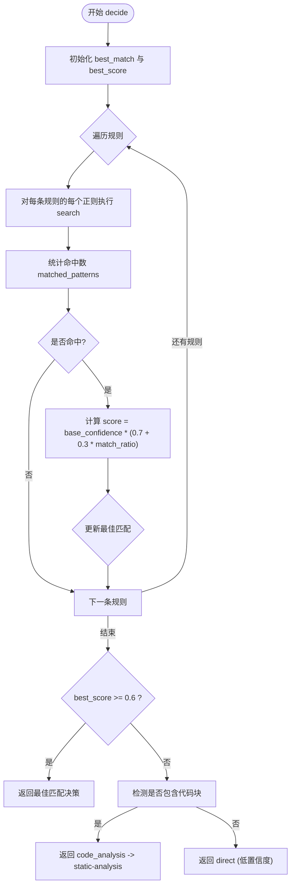
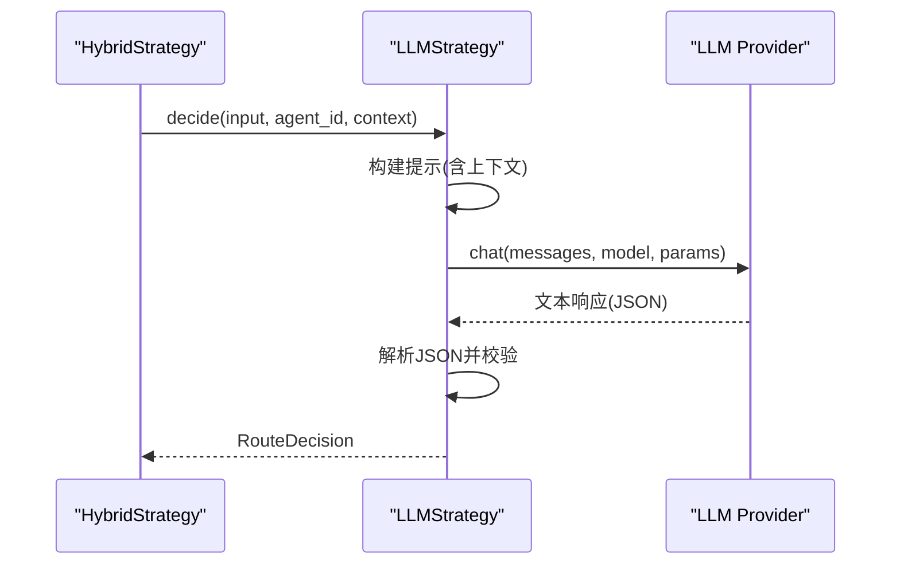
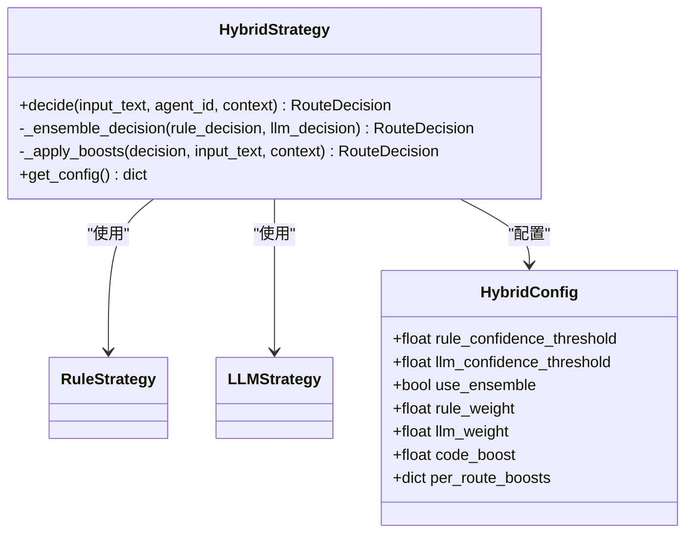
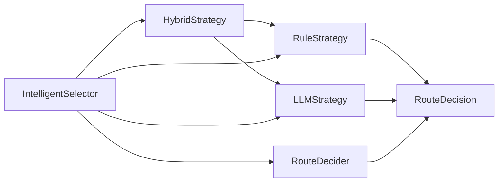

# 规则路由策略

<cite>
**本文引用的文件**
- [rule_strategy.py](file://python/src/resolveagent/selector/strategies/rule_strategy.py)
- [llm_strategy.py](file://python/src/resolveagent/selector/strategies/llm_strategy.py)
- [hybrid_strategy.py](file://python/src/resolveagent/selector/strategies/hybrid_strategy.py)
- [selector.py](file://python/src/resolveagent/selector/selector.py)
- [router.py](file://python/src/resolveagent/selector/router.py)
- [test_selector.py](file://python/tests/unit/test_selector.py)
</cite>

## 目录
1. [简介](#简介)
2. [项目结构](#项目结构)
3. [核心组件](#核心组件)
4. [架构总览](#架构总览)
5. [详细组件分析](#详细组件分析)
6. [依赖关系分析](#依赖关系分析)
7. [性能考量](#性能考量)
8. [故障排查指南](#故障排查指南)
9. [结论](#结论)
10. [附录：配置与示例路径](#附录：配置与示例路径)

## 简介
本技术文档聚焦于“规则路由策略”（RuleStrategy）及其在整体智能选择器中的角色。规则路由基于预定义的模式匹配规则，对输入文本进行快速、确定性的意图识别与路由决策，适用于高置信度、可审计、低延迟的场景。它与 LLM 策略形成互补：规则路由负责“快路径”，LLM 负责“慢路径”的复杂/歧义场景；混合策略将两者结合，实现高精度与高性能的平衡。

## 项目结构
围绕规则路由的核心代码位于 Python 选择器模块中，关键文件如下：
- 规则策略实现：rule_strategy.py
- LLM 策略实现：llm_strategy.py
- 混合策略编排：hybrid_strategy.py
- 统一选择器与决策模型：selector.py
- 最终路由决策引擎：router.py
- 单元测试覆盖：test_selector.py

图表来源
- [selector.py:86-317](file://python/src/resolveagent/selector/selector.py#L86-L317)
- [rule_strategy.py:28-290](file://python/src/resolveagent/selector/strategies/rule_strategy.py#L28-L290)
- [llm_strategy.py:19-402](file://python/src/resolveagent/selector/strategies/llm_strategy.py#L19-L402)
- [hybrid_strategy.py:41-224](file://python/src/resolveagent/selector/strategies/hybrid_strategy.py#L41-L224)
- [router.py:17-145](file://python/src/resolveagent/selector/router.py#L17-L145)

章节来源
- [selector.py:86-317](file://python/src/resolveagent/selector/selector.py#L86-L317)
- [rule_strategy.py:28-290](file://python/src/resolveagent/selector/strategies/rule_strategy.py#L28-L290)
- [llm_strategy.py:19-402](file://python/src/resolveagent/selector/strategies/llm_strategy.py#L19-L402)
- [hybrid_strategy.py:41-224](file://python/src/resolveagent/selector/strategies/hybrid_strategy.py#L41-L224)
- [router.py:17-145](file://python/src/resolveagent/selector/router.py#L17-L145)

## 核心组件
- RouteDecision：统一的决策输出模型，包含路由类型、目标、置信度、参数与推理说明。
- RuleStrategy：基于正则模式匹配的规则路由，提供高确定性、低延迟的路由能力。
- LLMStrategy：基于大模型的语义理解与分类，处理复杂/歧义请求。
- HybridStrategy：组合规则与 LLM，按阶段执行并支持加权集成与置信度提升。
- RouteDecider：根据意图类型与上下文做最终路由映射与目标选择。

章节来源
- [selector.py:22-84](file://python/src/resolveagent/selector/selector.py#L22-L84)
- [rule_strategy.py:17-290](file://python/src/resolveagent/selector/strategies/rule_strategy.py#L17-L290)
- [llm_strategy.py:19-402](file://python/src/resolveagent/selector/strategies/llm_strategy.py#L19-L402)
- [hybrid_strategy.py:21-224](file://python/src/resolveagent/selector/strategies/hybrid_strategy.py#L21-L224)
- [router.py:17-145](file://python/src/resolveagent/selector/router.py#L17-L145)

## 架构总览
规则路由策略在整体架构中的位置与交互如下：
- IntelligentSelector 作为入口，根据策略选择调用 RuleStrategy、LLMStrategy 或 HybridStrategy。
- RuleStrategy 通过预编译的正则表达式对输入进行匹配，计算匹配数量与基础置信度，生成 RouteDecision。
- HybridStrategy 先走规则快路径，若未达阈值再走 LLM 慢路径，并在两者一致时进行加权集成与置信度提升。
- RouteDecider 将意图类型映射到具体路由类型与目标，并结合上下文进行微调。

图表来源
- [selector.py:165-304](file://python/src/resolveagent/selector/selector.py#L165-L304)
- [rule_strategy.py:205-264](file://python/src/resolveagent/selector/strategies/rule_strategy.py#L205-L264)
- [llm_strategy.py:129-170](file://python/src/resolveagent/selector/strategies/llm_strategy.py#L129-L170)
- [hybrid_strategy.py:79-123](file://python/src/resolveagent/selector/strategies/hybrid_strategy.py#L79-L123)
- [router.py:34-87](file://python/src/resolveagent/selector/router.py#L34-L87)

## 详细组件分析

### RuleStrategy：基于模式匹配的规则路由
- 数据结构
  - RoutingRule：包含路由类型、多个正则模式、目标、默认置信度与描述。
  - 预编译缓存：初始化时将所有规则的正则预编译为 re.Pattern，避免重复编译开销。
- 匹配算法流程
  - 遍历规则列表，逐条对输入文本执行正则搜索。
  - 统计命中模式数，计算得分：score = base_confidence * (0.7 + 0.3 * min(match_count / max(patterns_len, 1), 1.0))。
  - 记录匹配到的模式片段用于可解释性。
  - 若最高分达到阈值（默认 0.6），返回该决策；否则尝试代码块检测作为 code_analysis 兜底；若无高置信度匹配，返回低置信度的 direct。
- 关键词与正则
  - 覆盖代码分析、工作流/FTA、技能工具、RAG 知识检索等场景的多语言关键词与语法特征。
  - 使用大小写不敏感与多行模式，提高匹配鲁棒性。
- 路由类型与目标
  - route_type：workflow/skill/rag/code_analysis/direct 等。
  - route_target：如 static-analysis、incident-diagnosis、web-search、product-docs 等。
- 复杂度与性能
  - 时间复杂度近似 O(R × P)，其中 R 为规则数，P 为每条规则的正则数量；由于正则预编译且输入规模有限，实际耗时极低。
  - 空间复杂度主要在于预编译的正则对象集合，内存占用稳定。
- 错误处理与边界
  - 无匹配或低置信度时返回 direct，便于上层降级。
  - 代码块检测作为 fallback，增强对含代码输入的识别。

图表来源
- [rule_strategy.py:205-264](file://python/src/resolveagent/selector/strategies/rule_strategy.py#L205-L264)
- [rule_strategy.py:266-276](file://python/src/resolveagent/selector/strategies/rule_strategy.py#L266-L276)

章节来源
- [rule_strategy.py:17-290](file://python/src/resolveagent/selector/strategies/rule_strategy.py#L17-L290)

### LLMStrategy：语义理解与分类
- 作用：当规则无法给出高置信度匹配时，使用 LLM 进行意图分类与目标建议。
- 提示工程：内置结构化路由提示，明确各路由类型的适用场景与示例，要求输出 JSON。
- 调用与解析：调用 LLM 提供商，解析响应中的 route_type、route_target、confidence、reasoning；失败时回退到启发式模拟响应。
- 与规则的关系：在混合策略中作为慢路径补充，提升复杂/歧义请求的处理能力。

图表来源
- [llm_strategy.py:129-170](file://python/src/resolveagent/selector/strategies/llm_strategy.py#L129-L170)
- [llm_strategy.py:205-230](file://python/src/resolveagent/selector/strategies/llm_strategy.py#L205-L230)
- [llm_strategy.py:338-373](file://python/src/resolveagent/selector/strategies/llm_strategy.py#L338-L373)

章节来源
- [llm_strategy.py:19-402](file://python/src/resolveagent/selector/strategies/llm_strategy.py#L19-L402)

### HybridStrategy：规则+LLM 混合编排
- 三阶段流程：
  - 阶段一（快路径）：规则匹配，若置信度达到阈值直接返回。
  - 阶段二（慢路径）：调用 LLM 进行分类。
  - 阶段三（集成）：当两者一致时，按权重合并置信度并提升；不一致时选择更高置信度的一方。
- 置信度提升：
  - 检测到代码块时提升 code_analysis 置信度。
  - 诊断关键词提升 workflow 置信度。
  - 对话历史长度影响 rag 置信度。
  - 支持 per-route-type 的可配置提升。
- 配置项：规则/LLM 阈值、是否启用集成、权重、代码提升、每路由额外提升。

图表来源
- [hybrid_strategy.py:21-224](file://python/src/resolveagent/selector/strategies/hybrid_strategy.py#L21-L224)

章节来源
- [hybrid_strategy.py:21-224](file://python/src/resolveagent/selector/strategies/hybrid_strategy.py#L21-L224)

### RouteDecider：最终路由决策
- 意图到路由映射：将 intent_type 映射到 route_type（如 workflow/fta -> fta）。
- 置信度调整：低置信度但存在代码上下文时，强制切换到 code_analysis。
- 目标选择：根据可用技能、工作流、知识库集合选择具体 target。
- 推理构建：综合意图、置信度、代码上下文、增强置信度等信息生成可读推理。

章节来源
- [router.py:17-145](file://python/src/resolveagent/selector/router.py#L17-L145)

## 依赖关系分析
- RuleStrategy 依赖标准库 re 与数据类 dataclasses，无外部运行时依赖，保证轻量与稳定。
- LLMStrategy 依赖 LLM 提供商接口，具备异常回退机制。
- HybridStrategy 组合 RuleStrategy 与 LLMStrategy，并通过配置控制行为。
- IntelligentSelector 统一管理策略实例与缓存，降低重复创建成本。
- RouteDecision 作为跨组件契约，确保类型安全与一致性。

图表来源
- [selector.py:86-317](file://python/src/resolveagent/selector/selector.py#L86-L317)
- [rule_strategy.py:28-290](file://python/src/resolveagent/selector/strategies/rule_strategy.py#L28-L290)
- [llm_strategy.py:19-402](file://python/src/resolveagent/selector/strategies/llm_strategy.py#L19-L402)
- [hybrid_strategy.py:41-224](file://python/src/resolveagent/selector/strategies/hybrid_strategy.py#L41-L224)
- [router.py:17-145](file://python/src/resolveagent/selector/router.py#L17-L145)

章节来源
- [selector.py:86-317](file://python/src/resolveagent/selector/selector.py#L86-L317)
- [rule_strategy.py:28-290](file://python/src/resolveagent/selector/strategies/rule_strategy.py#L28-L290)
- [llm_strategy.py:19-402](file://python/src/resolveagent/selector/strategies/llm_strategy.py#L19-L402)
- [hybrid_strategy.py:41-224](file://python/src/resolveagent/selector/strategies/hybrid_strategy.py#L41-L224)
- [router.py:17-145](file://python/src/resolveagent/selector/router.py#L17-L145)

## 性能考量
- 规则路由的高性能特性
  - 正则预编译：启动时一次性编译，避免每次匹配的重载开销。
  - 确定性匹配：无网络 IO，毫秒级决策，适合高吞吐场景。
  - 置信度公式：基于命中比例平滑放大，减少误判。
- 混合策略的性能优化
  - 快路径优先：高置信度规则直接返回，跳过 LLM 调用。
  - 集成加权：在一致时提升置信度，减少后续重试与降级。
  - 上下文增强：利用代码块、对话历史等信号进行微调，提高准确率。
- 缓存与审计
  - IntelligentSelector 内置决策缓存，减少重复计算。
  - 审计日志记录策略、路由类型、置信度与延迟，便于监控与调优。

[本节为通用性能讨论，无需特定文件引用]

## 故障排查指南
- 规则未命中或置信度过低
  - 检查 ROUTING_RULES 中正则是否覆盖新场景，必要时增加模式或调整权重。
  - 查看 get_rules_summary 输出，确认规则生效情况。
- LLM 调用失败
  - 检查 LLM 提供商配置与网络连通性。
  - 观察 _simulate_llm_response 的启发式回退结果，验证基本路由逻辑。
- 混合策略未触发集成
  - 调整 rule_confidence_threshold 与 llm_confidence_threshold，使快路径更敏感或更严格。
  - 检查 use_ensemble 与权重设置，确保集成生效。
- 目标选择不正确
  - 检查 RouteDecider._determine_target 的逻辑与上下文字段（available_skills、active_workflows、rag_collections）。
  - 确认上下文中提供的资源信息是否完整。

章节来源
- [rule_strategy.py:278-290](file://python/src/resolveagent/selector/strategies/rule_strategy.py#L278-L290)
- [llm_strategy.py:205-230](file://python/src/resolveagent/selector/strategies/llm_strategy.py#L205-L230)
- [hybrid_strategy.py:177-211](file://python/src/resolveagent/selector/strategies/hybrid_strategy.py#L177-L211)
- [router.py:89-118](file://python/src/resolveagent/selector/router.py#L89-L118)

## 结论
规则路由策略以预定义的正则模式为基础，提供快速、确定、可审计的路由能力，特别适合已知模式的高置信度场景。与 LLM 策略互补，混合策略在保证性能的同时提升了复杂/歧义请求的处理质量。通过合理的规则维护、上下文增强与配置调优，可在生产环境中获得稳定高效的智能路由体验。

[本节为总结性内容，无需特定文件引用]

## 附录：配置与示例路径
- 规则定义与匹配条件
  - 规则结构与模式：参考 [rule_strategy.py:44-192](file://python/src/resolveagent/selector/strategies/rule_strategy.py#L44-L192)
  - 置信度与阈值：参考 [rule_strategy.py:205-264](file://python/src/resolveagent/selector/strategies/rule_strategy.py#L205-L264)
- 路由配置方法
  - 选择器策略切换：参考 [selector.py:119-163](file://python/src/resolveagent/selector/selector.py#L119-L163)
  - 混合策略配置：参考 [hybrid_strategy.py:21-38](file://python/src/resolveagent/selector/strategies/hybrid_strategy.py#L21-L38)
- 测试用例与用法示例
  - 规则路由测试：参考 [test_selector.py:185-252](file://python/tests/unit/test_selector.py#L185-L252)
  - 混合策略测试：参考 [test_selector.py:293-340](file://python/tests/unit/test_selector.py#L293-L340)
  - 全链路测试：参考 [test_selector.py:466-505](file://python/tests/unit/test_selector.py#L466-L505)

章节来源
- [rule_strategy.py:44-192](file://python/src/resolveagent/selector/strategies/rule_strategy.py#L44-L192)
- [rule_strategy.py:205-264](file://python/src/resolveagent/selector/strategies/rule_strategy.py#L205-L264)
- [selector.py:119-163](file://python/src/resolveagent/selector/selector.py#L119-L163)
- [hybrid_strategy.py:21-38](file://python/src/resolveagent/selector/strategies/hybrid_strategy.py#L21-L38)
- [test_selector.py:185-252](file://python/tests/unit/test_selector.py#L185-L252)
- [test_selector.py:293-340](file://python/tests/unit/test_selector.py#L293-L340)
- [test_selector.py:466-505](file://python/tests/unit/test_selector.py#L466-L505)