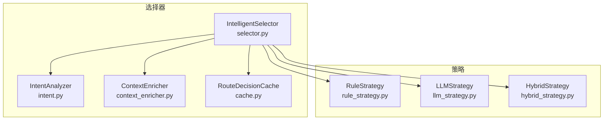
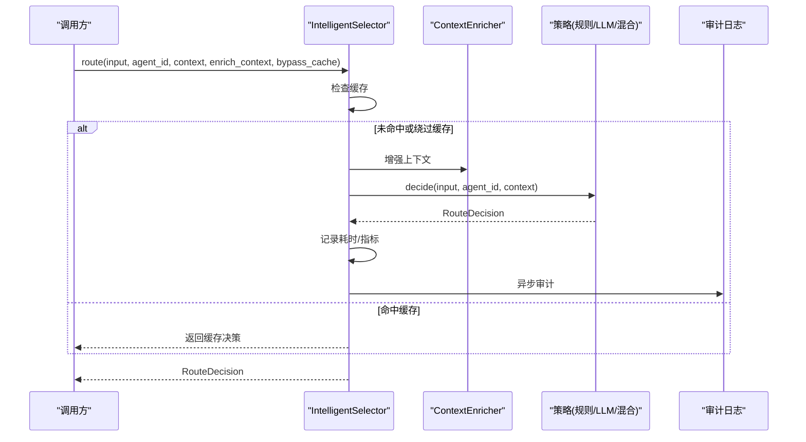
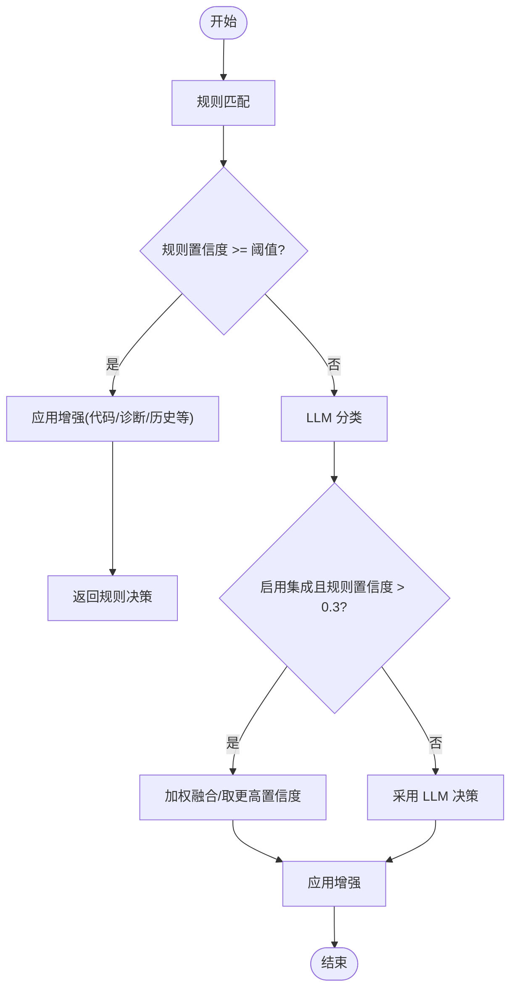
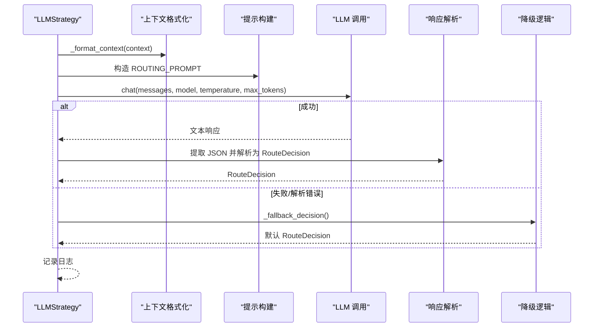
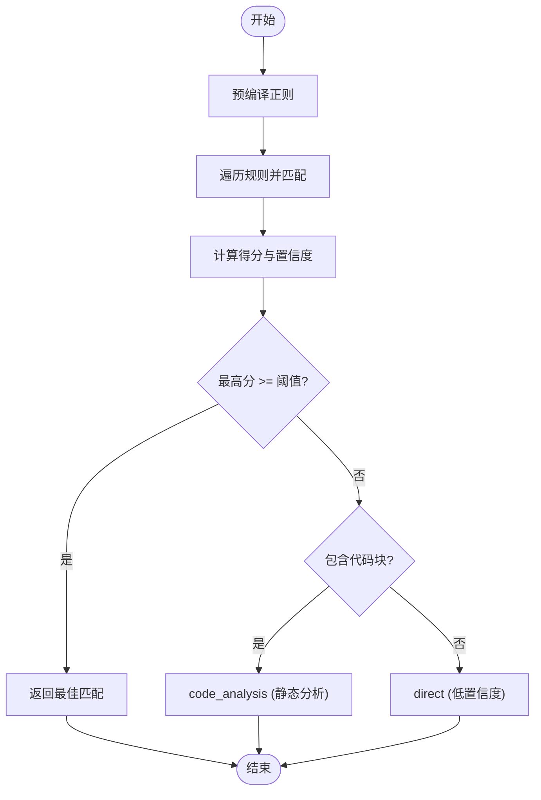
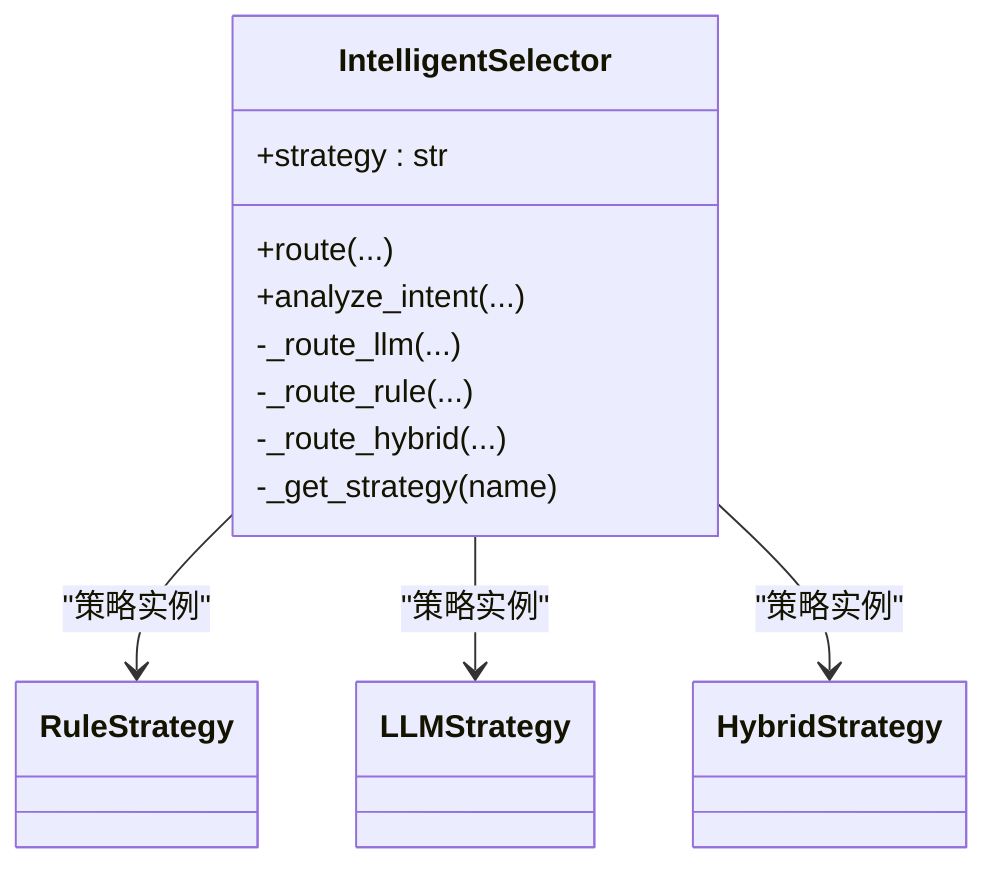
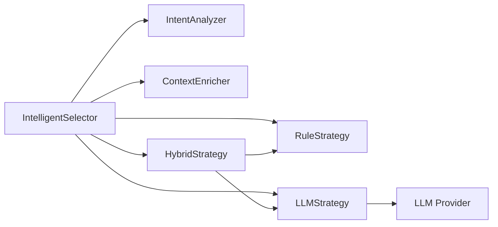

# 路由策略系统

<cite>
**本文引用的文件**
- [selector.py](file://python/src/resolveagent/selector/selector.py)
- [intent.py](file://python/src/resolveagent/selector/intent.py)
- [strategies/__init__.py](file://python/src/resolveagent/selector/strategies/__init__.py)
- [hybrid_strategy.py](file://python/src/resolveagent/selector/strategies/hybrid_strategy.py)
- [llm_strategy.py](file://python/src/resolveagent/selector/strategies/llm_strategy.py)
- [rule_strategy.py](file://python/src/resolveagent/selector/strategies/rule_strategy.py)
- [test_selector.py](file://python/tests/unit/test_selector.py)
</cite>

## 目录
1. [简介](#简介)
2. [项目结构](#项目结构)
3. [核心组件](#核心组件)
4. [架构总览](#架构总览)
5. [详细组件分析](#详细组件分析)
6. [依赖关系分析](#依赖关系分析)
7. [性能考量](#性能考量)
8. [故障排查指南](#故障排查指南)
9. [结论](#结论)
10. [附录](#附录)

## 简介
本技术文档围绕 ResolveAgent 的智能选择器（Intelligent Selector）与三种路由策略展开，系统性阐述混合策略（HybridStrategy）、LLM 策略（LLMStrategy）和规则策略（RuleStrategy）的设计理念、实现差异、适用场景、配置参数与调优方法。同时提供策略切换、性能监控与效果评估的实践建议，并解释策略间的协作机制与最佳实践。

## 项目结构
智能选择器位于 Python 模块 selector 下，包含意图分析、上下文增强、缓存、审计以及可插拔的路由策略。三种策略统一通过策略接口进行决策，并由 IntelligentSelector 编排调用。

图表来源
- [selector.py:86-304](file://python/src/resolveagent/selector/selector.py#L86-L304)
- [intent.py:50-210](file://python/src/resolveagent/selector/intent.py#L50-L210)

章节来源
- [selector.py:1-317](file://python/src/resolveagent/selector/selector.py#L1-L317)
- [strategies/__init__.py:1-37](file://python/src/resolveagent/selector/strategies/__init__.py#L1-L37)

## 核心组件
- RouteDecision：统一的决策输出模型，包含路由类型、目标、置信度、参数、推理说明及多步链式子决策。
- IntelligentSelector：入口编排器，负责意图分析、上下文增强、策略路由、缓存与审计日志。
- IntentAnalyzer：意图分类器，基于关键词、正则与语义启发式识别用户意图，支持多意图判定。
- RuleStrategy：基于预定义规则的快速匹配，高确定性、低延迟。
- LLMStrategy：基于大模型的意图理解与分类，适合模糊、复杂请求。
- HybridStrategy：先走规则快速路径，再回退到 LLM；当两者一致时进行加权集成，提升准确性。

章节来源
- [selector.py:22-84](file://python/src/resolveagent/selector/selector.py#L22-L84)
- [intent.py:17-48](file://python/src/resolveagent/selector/intent.py#L17-L48)
- [rule_strategy.py:17-41](file://python/src/resolveagent/selector/strategies/rule_strategy.py#L17-L41)
- [llm_strategy.py:19-34](file://python/src/resolveagent/selector/strategies/llm_strategy.py#L19-L34)
- [hybrid_strategy.py:21-67](file://python/src/resolveagent/selector/strategies/hybrid_strategy.py#L21-L67)

## 架构总览
IntelligentSelector 在每次路由前可选择性地增强上下文（如可用技能、工作流、RAG 集合、代码上下文），然后按所选策略执行决策，并将结果写入缓存与审计日志。三种策略均返回 RouteDecision，便于上层统一处理。

图表来源
- [selector.py:165-229](file://python/src/resolveagent/selector/selector.py#L165-L229)

## 详细组件分析

### 混合策略（HybridStrategy）
设计理念
- 快速规则路径：优先使用规则匹配，若置信度超过阈值则直接返回，保证低延迟与高确定性。
- LLM 回退：当规则置信度不足时，调用 LLM 进行分类，覆盖复杂/模糊场景。
- 集成打分：当规则与 LLM 达成一致时，对置信度进行加权融合，并适度提升一致性奖励。
- 特殊增强：检测到代码块时对 code_analysis 增加置信度；诊断类关键词对 workflow 增加置信度；对话历史较长时对 rag 增加置信度；支持 per-route-type 的额外置信度提升。

关键流程

图表来源
- [hybrid_strategy.py:79-123](file://python/src/resolveagent/selector/strategies/hybrid_strategy.py#L79-L123)
- [hybrid_strategy.py:125-175](file://python/src/resolveagent/selector/strategies/hybrid_strategy.py#L125-L175)
- [hybrid_strategy.py:177-211](file://python/src/resolveagent/selector/strategies/hybrid_strategy.py#L177-L211)

配置参数（HybridConfig）
- rule_confidence_threshold：规则路径触发阈值（默认 0.7）。
- llm_confidence_threshold：LLM 路径阈值（默认 0.6）。
- use_ensemble：是否启用集成融合（默认 True）。
- rule_weight / llm_weight：集成权重（默认 0.6 / 0.4）。
- code_boost：检测到代码块时对 code_analysis 的置信度提升（默认 0.1）。
- per_route_boosts：针对特定路由类型的额外置信度提升字典。

适用场景
- 生产环境推荐：兼顾速度与准确率，既能在常见场景快速返回，又能在复杂场景利用 LLM 提升鲁棒性。

调优建议
- 提高 rule_confidence_threshold 可减少 LLM 调用，但可能降低召回；适当降低可提升覆盖率。
- 调整 rule_weight/llm_weight 以平衡确定性与泛化能力。
- 根据业务词频与特征，设置 per_route_boosts，例如对诊断关键词提升 workflow 的置信度。
- 结合上下文（如 conversation_history）增强 rag 的倾向性。

章节来源
- [hybrid_strategy.py:21-38](file://python/src/resolveagent/selector/strategies/hybrid_strategy.py#L21-L38)
- [hybrid_strategy.py:79-123](file://python/src/resolveagent/selector/strategies/hybrid_strategy.py#L79-L123)
- [hybrid_strategy.py:125-175](file://python/src/resolveagent/selector/strategies/hybrid_strategy.py#L125-L175)
- [hybrid_strategy.py:177-211](file://python/src/resolveagent/selector/strategies/hybrid_strategy.py#L177-L211)

### LLM 策略（LLMStrategy）
设计理念
- 纯大模型分类：通过结构化提示词将上下文与输入组合，要求模型输出 JSON 形式的路由决策。
- 上下文感知：将可用技能、活跃工作流、RAG 集合、代码上下文等信息注入提示，辅助模型做出更准确的判断。
- 容错与降级：当 LLM 调用失败或解析异常时，回退到启发式默认策略，确保可用性。

关键流程

图表来源
- [llm_strategy.py:129-170](file://python/src/resolveagent/selector/strategies/llm_strategy.py#L129-L170)
- [llm_strategy.py:172-203](file://python/src/resolveagent/selector/strategies/llm_strategy.py#L172-L203)
- [llm_strategy.py:205-230](file://python/src/resolveagent/selector/strategies/llm_strategy.py#L205-L230)
- [llm_strategy.py:338-373](file://python/src/resolveagent/selector/strategies/llm_strategy.py#L338-L373)
- [llm_strategy.py:375-401](file://python/src/resolveagent/selector/strategies/llm_strategy.py#L375-L401)

配置与行为
- 提示词包含路由类别说明、示例与约束，要求仅返回 JSON。
- 温度较低（0.3）以降低随机性，最大 token 限制控制成本。
- 支持模型 ID 指定；若未配置，使用默认提供者。
- 解析失败时回退到启发式规则（检测代码块、问号、通用默认）。

适用场景
- 开放域、模糊或多意图请求；需要语义理解与上下文感知的场景。
- 规则难以覆盖的新领域或长尾需求。

调优建议
- 优化提示词与上下文字段，提升分类质量。
- 根据业务调整 fallback 逻辑，减少误判。
- 监控 LLM 调用成功率与解析成功率，必要时引入重试或降级策略。

章节来源
- [llm_strategy.py:36-119](file://python/src/resolveagent/selector/strategies/llm_strategy.py#L36-L119)
- [llm_strategy.py:129-170](file://python/src/resolveagent/selector/strategies/llm_strategy.py#L129-L170)
- [llm_strategy.py:205-230](file://python/src/resolveagent/selector/strategies/llm_strategy.py#L205-L230)
- [llm_strategy.py:338-401](file://python/src/resolveagent/selector/strategies/llm_strategy.py#L338-L401)

### 规则策略（RuleStrategy）
设计理念
- 模式匹配路由：通过预定义的规则与正则表达式进行快速匹配，适用于已知模式的高置信度路由。
- 置信度评分：基于匹配到的模式数量与规则基础置信度计算最终分数，并对最高分匹配进行小幅提升。
- 代码块兜底：若无高置信度匹配，检测到代码块时回退到 code_analysis。

关键流程

图表来源
- [rule_strategy.py:194-203](file://python/src/resolveagent/selector/strategies/rule_strategy.py#L194-L203)
- [rule_strategy.py:205-264](file://python/src/resolveagent/selector/strategies/rule_strategy.py#L205-L264)
- [rule_strategy.py:266-276](file://python/src/resolveagent/selector/strategies/rule_strategy.py#L266-L276)

配置与扩展
- RoutingRule：包含路由类型、多个模式、目标、基础置信度与描述。
- 可通过新增规则与模式扩展路由能力，注意优先级与特异性。

适用场景
- 高吞吐、低延迟、可审计的场景；对稳定性与确定性要求高的业务。
- 已知模式明确、边界清晰的请求。

调优建议
- 细化规则与模式，避免过宽导致误判；提高特异性可降低冲突。
- 合理设置基础置信度与阈值，平衡召回与精确率。
- 定期评估规则命中率与误判案例，持续迭代。

章节来源
- [rule_strategy.py:17-41](file://python/src/resolveagent/selector/strategies/rule_strategy.py#L17-L41)
- [rule_strategy.py:43-192](file://python/src/resolveagent/selector/strategies/rule_strategy.py#L43-L192)
- [rule_strategy.py:194-276](file://python/src/resolveagent/selector/strategies/rule_strategy.py#L194-L276)

### 策略选择与切换
IntelligentSelector 支持三种策略：llm、rule、hybrid。通过构造函数指定策略，内部维护策略实例缓存，避免重复初始化。route 方法会先查缓存，再可选增强上下文，最后调用对应策略并记录审计日志。

图表来源
- [selector.py:119-163](file://python/src/resolveagent/selector/selector.py#L119-L163)
- [selector.py:274-304](file://python/src/resolveagent/selector/selector.py#L274-L304)

章节来源
- [selector.py:119-163](file://python/src/resolveagent/selector/selector.py#L119-L163)
- [selector.py:274-304](file://python/src/resolveagent/selector/selector.py#L274-L304)

## 依赖关系分析
- IntelligentSelector 依赖 IntentAnalyzer 与 ContextEnricher 进行预处理，依赖策略进行决策，依赖缓存与审计进行观测。
- 三种策略相互独立，HybridStrategy 组合 RuleStrategy 与 LLMStrategy。
- LLMStrategy 依赖外部 LLM 提供者（HigressProvider），具备降级与模拟响应能力。
- RuleStrategy 依赖预编译的正则与规则集，无外部依赖。

图表来源
- [selector.py:149-163](file://python/src/resolveagent/selector/selector.py#L149-L163)
- [hybrid_strategy.py:69-77](file://python/src/resolveagent/selector/strategies/hybrid_strategy.py#L69-L77)
- [llm_strategy.py:205-230](file://python/src/resolveagent/selector/strategies/llm_strategy.py#L205-L230)

章节来源
- [selector.py:149-163](file://python/src/resolveagent/selector/selector.py#L149-L163)
- [hybrid_strategy.py:69-77](file://python/src/resolveagent/selector/strategies/hybrid_strategy.py#L69-L77)
- [llm_strategy.py:205-230](file://python/src/resolveagent/selector/strategies/llm_strategy.py#L205-L230)

## 性能考量
- 规则策略：O(R×P) 复杂度（R 为规则数，P 为每个规则的模式数），由于正则预编译，实际匹配开销低，适合高吞吐。
- LLM 策略：受网络与模型推理影响，延迟较高；通过缓存与降级保障可用性。
- 混合策略：在规则高置信度时短路返回，显著降低平均延迟；仅在必要时调用 LLM。
- 缓存：IntelligentSelector 内置 RouteDecisionCache，可按实例或全局作用域共享，减少重复计算。
- 审计与指标：记录策略、路由类型、目标、置信度、延迟等，便于监控与评估。

[本节为通用性能讨论，不直接分析具体文件]

## 故障排查指南
- LLM 调用失败：LLMStrategy 捕获异常并降级到启发式默认决策；检查模型配置与网络连通性。
- 解析失败：LLM 返回非 JSON 或格式不正确时，尝试提取 JSON 片段；失败则进入降级逻辑。
- 规则误判：检查规则优先级与模式特异性；必要时拆分或细化规则，调整置信度阈值。
- 缓存命中异常：确认缓存键生成逻辑（input_text、agent_id、strategy），必要时绕过缓存验证。
- 审计缺失：确认 DecisionAuditLogger 是否异步写入；检查日志通道与权限。

章节来源
- [llm_strategy.py:167-170](file://python/src/resolveagent/selector/strategies/llm_strategy.py#L167-L170)
- [llm_strategy.py:338-373](file://python/src/resolveagent/selector/strategies/llm_strategy.py#L338-L373)
- [rule_strategy.py:244-264](file://python/src/resolveagent/selector/strategies/rule_strategy.py#L244-L264)
- [selector.py:185-229](file://python/src/resolveagent/selector/selector.py#L185-L229)

## 结论
- 混合策略在生产环境中推荐：兼顾速度与准确性，具备完善的回退与增强机制。
- LLM 策略适合复杂与模糊场景，需关注成本与延迟，并完善降级策略。
- 规则策略适合高确定性、高吞吐场景，应持续迭代规则以提升覆盖与精度。
- 通过缓存、审计与指标监控，可实现策略的可观测性与可运维性。

[本节为总结性内容，不直接分析具体文件]

## 附录

### 使用示例与最佳实践
- 选择策略：通过 IntelligentSelector(strategy="hybrid|llm|rule") 指定策略；默认 hybrid。
- 上下文增强：开启 enrich_context 以注入可用技能、工作流、RAG 集合与代码上下文。
- 缓存控制：bypass_cache 用于强制刷新；合理设置 cache_max_size 与 ttl_seconds。
- 效果评估：基于审计日志统计各策略命中率、延迟分布与置信度分布；结合业务反馈持续调优。
- 策略切换：可在运行时动态切换策略，观察指标变化；建议在灰度环境中逐步放量。

章节来源
- [selector.py:121-163](file://python/src/resolveagent/selector/selector.py#L121-L163)
- [selector.py:165-229](file://python/src/resolveagent/selector/selector.py#L165-L229)
- [test_selector.py:185-200](file://python/tests/unit/test_selector.py#L185-L200)