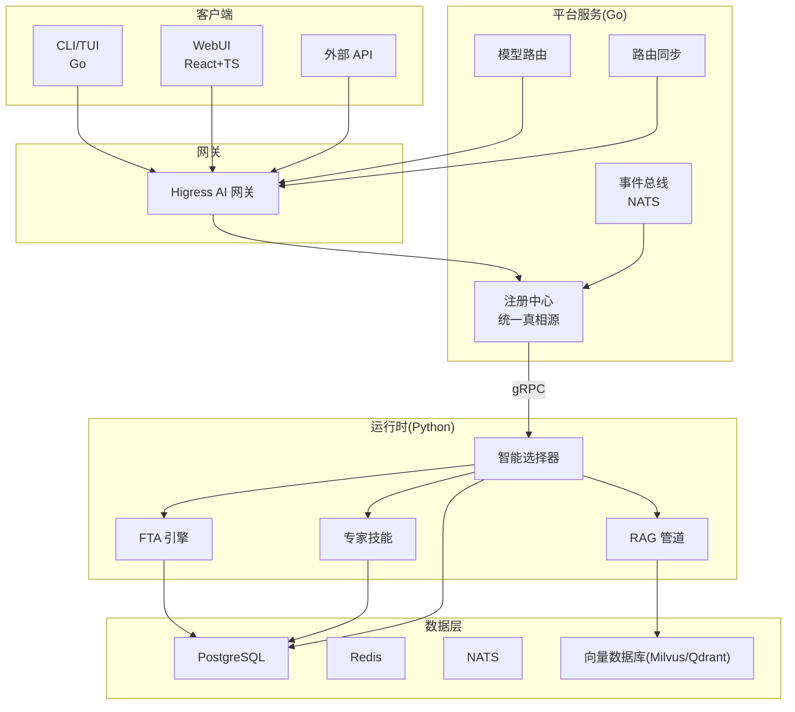
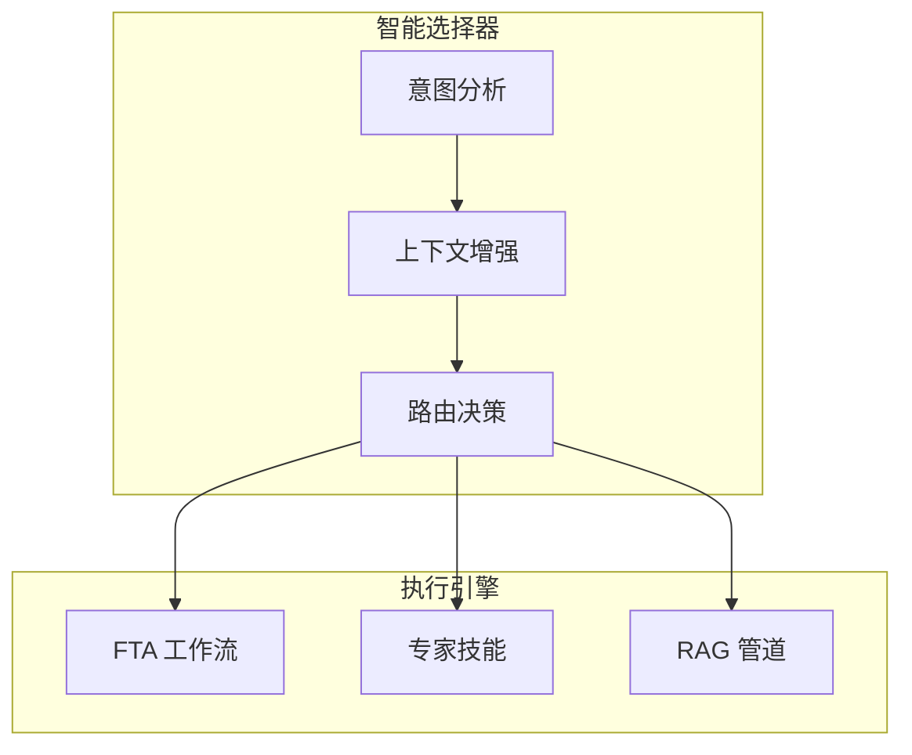
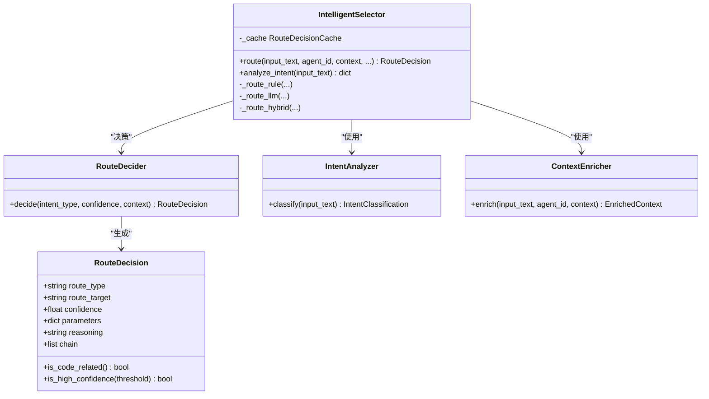
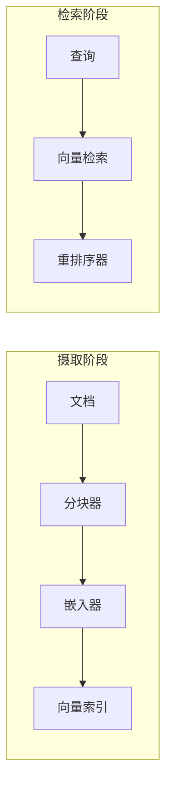
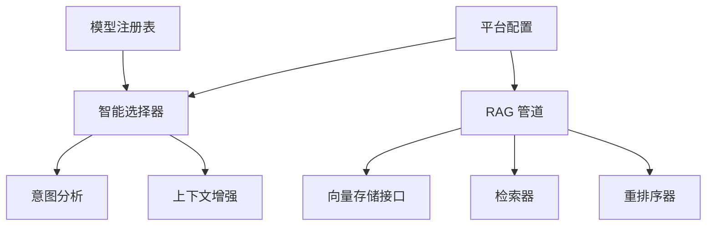

# 核心功能模块

<cite>
**本文引用的文件**
- [README.md](file://README.md)
- [python/src/resolveagent/__init__.py](file://python/src/resolveagent/__init__.py)
- [configs/resolveagent.yaml](file://configs/resolveagent.yaml)
- [configs/models.yaml](file://configs/models.yaml)
- [python/src/resolveagent/selector/__init__.py](file://python/src/resolveagent/selector/__init__.py)
- [python/src/resolveagent/selector/selector.py](file://python/src/resolveagent/selector/selector.py)
- [python/src/resolveagent/selector/router.py](file://python/src/resolveagent/selector/router.py)
- [python/src/resolveagent/selector/intent.py](file://python/src/resolveagent/selector/intent.py)
- [python/src/resolveagent/selector/context_enricher.py](file://python/src/resolveagent/selector/context_enricher.py)
- [python/src/resolveagent/rag/__init__.py](file://python/src/resolveagent/rag/__init__.py)
- [python/src/resolveagent/rag/pipeline.py](file://python/src/resolveagent/rag/pipeline.py)
- [python/src/resolveagent/rag/index/base.py](file://python/src/resolveagent/rag/index/base.py)
- [python/src/resolveagent/rag/retrieve/retriever.py](file://python/src/resolveagent/rag/retrieve/retriever.py)
- [python/src/resolveagent/rag/retrieve/reranker.py](file://python/src/resolveagent/rag/retrieve/reranker.py)
- [python/src/resolveagent/fta/__init__.py](file://python/src/resolveagent/fta/__init__.py)
- [python/src/resolveagent/skills/__init__.py](file://python/src/resolveagent/skills/__init__.py)
</cite>

## 目录
1. [简介](#简介)
2. [项目结构](#项目结构)
3. [核心组件](#核心组件)
4. [架构总览](#架构总览)
5. [详细组件分析](#详细组件分析)
6. [依赖分析](#依赖分析)
7. [性能考虑](#性能考虑)
8. [故障排查指南](#故障排查指南)
9. [结论](#结论)
10. [附录](#附录)

## 简介
ResolveAgent 是一个面向问题解决的 AIOps 智能体平台，围绕四大核心能力构建：
- 智能选择器系统：意图分析、多策略路由、上下文增强、置信度评分
- FTA 工作流引擎：故障树分析原理、门类型实现、割集计算算法
- RAG 管道系统：文档摄取、向量索引、检索重排序
- 专家技能系统：清单机制、沙箱执行、多来源支持

该文档聚焦于上述四大模块的实现原理、配置选项、使用模式与相互关系，并提供可定位的代码示例路径与实际应用场景。

## 项目结构
ResolveAgent 采用“Go 平台服务 + Python Agent 运行时”的分层架构，前端 WebUI 与 CLI/TUI 作为入口，Higress 网关承担外部鉴权与模型路由，内部通过智能选择器进行路由决策，驱动 FTA、技能与 RAG 执行引擎。

图表来源
- [README.md:442-510](file://README.md#L442-L510)

章节来源
- [README.md:438-510](file://README.md#L438-L510)

## 核心组件
- 智能选择器系统：意图分析 + 上下文增强 + 多策略路由 + 置信度评分
- FTA 工作流引擎：基于门类型的故障树分析与评估
- RAG 管道系统：文档分块、嵌入、向量索引、相似搜索、交叉编码重排序
- 专家技能系统：清单声明、沙箱隔离、多来源安装与执行

章节来源
- [README.md:219-370](file://README.md#L219-L370)

## 架构总览
ResolveAgent 的核心是“智能选择器”作为元路由中枢，将用户请求动态分流至 FTA、技能或 RAG 等执行引擎；同时通过平台服务与 Higress 网关实现统一注册、路由同步、鉴权与模型路由。

图表来源
- [README.md:227-254](file://README.md#L227-L254)
- [python/src/resolveagent/selector/selector.py:80-308](file://python/src/resolveagent/selector/selector.py#L80-L308)

章节来源
- [README.md:227-254](file://README.md#L227-L254)
- [python/src/resolveagent/selector/selector.py:80-308](file://python/src/resolveagent/selector/selector.py#L80-L308)

## 详细组件分析

### 智能选择器系统
智能选择器是 ResolveAgent 的“大脑”，负责对用户输入进行意图分类、上下文增强与路由决策，并输出带置信度的决策结果。

- 意图分析（Intent Analyzer）
  - 多层匹配：关键词 + 正则 + 代码/问号特征 + 可选语义（可配置）
  - 支持多意图检测与目标建议
  - 输出包含意图类型、置信度、实体、子意图与建议目标
  - 示例路径：[python/src/resolveagent/selector/intent.py:50-361](file://python/src/resolveagent/selector/intent.py#L50-L361)

- 上下文增强（Context Enricher）
  - 并行拉取可用技能、活动工作流、RAG 集合
  - 代码内容提取、语言识别、潜在问题标记、复杂度估算
  - 用户偏好推断、会话元数据、增强置信度计算
  - 示例路径：[python/src/resolveagent/selector/context_enricher.py:71-543](file://python/src/resolveagent/selector/context_enricher.py#L71-L543)

- 路由决策（Route Decider）
  - 基于意图与上下文做出最终路由决策
  - 当前默认返回直连 LLM 响应（预留扩展空间）
  - 示例路径：[python/src/resolveagent/selector/router.py:10-40](file://python/src/resolveagent/selector/router.py#L10-L40)

- 路由主控（IntelligentSelector）
  - 支持策略：纯规则、纯 LLM、混合策略（推荐）
  - 决策缓存（实例/全局），支持键生成与 TTL
  - 提供意图分析独立接口
  - 示例路径：[python/src/resolveagent/selector/selector.py:80-308](file://python/src/resolveagent/selector/selector.py#L80-L308)

图表来源
- [python/src/resolveagent/selector/selector.py:80-308](file://python/src/resolveagent/selector/selector.py#L80-L308)
- [python/src/resolveagent/selector/router.py:10-40](file://python/src/resolveagent/selector/router.py#L10-L40)
- [python/src/resolveagent/selector/intent.py:50-361](file://python/src/resolveagent/selector/intent.py#L50-L361)
- [python/src/resolveagent/selector/context_enricher.py:71-543](file://python/src/resolveagent/selector/context_enricher.py#L71-L543)

章节来源
- [python/src/resolveagent/selector/selector.py:80-308](file://python/src/resolveagent/selector/selector.py#L80-L308)
- [python/src/resolveagent/selector/router.py:10-40](file://python/src/resolveagent/selector/router.py#L10-L40)
- [python/src/resolveagent/selector/intent.py:50-361](file://python/src/resolveagent/selector/intent.py#L50-L361)
- [python/src/resolveagent/selector/context_enricher.py:71-543](file://python/src/resolveagent/selector/context_enricher.py#L71-L543)

### FTA 工作流引擎
FTA（故障树分析）引擎提供故障树建模与评估能力，支持多种门类型与割集计算。

- 门类型与逻辑
  - AND/OR/VOTING/PRIORITY-AND/INHIBIT 等门类型
  - 门节点组合形成复杂故障传播路径
  - 示例路径：[README.md:263-301](file://README.md#L263-L301)

- 割集计算与评估
  - 通过解析门结构与基础事件，计算最小割集
  - 评估根事件发生概率与影响范围
  - 示例路径：[python/src/resolveagent/fta/__init__.py:1-2](file://python/src/resolveagent/fta/__init__.py#L1-L2)

章节来源
- [README.md:263-301](file://README.md#L263-L301)
- [python/src/resolveagent/fta/__init__.py:1-2](file://python/src/resolveagent/fta/__init__.py#L1-L2)

### RAG 管道系统
RAG 管道提供从文档摄取到检索重排序的完整链路，支持 Milvus/Qdrant 向量存储与交叉编码重排序。

- 管道编排（RAGPipeline）
  - 文档分块 → 嵌入 → 向量索引 → 查询检索 → 重排序
  - 可选持久化文档元数据到平台存储
  - 示例路径：[python/src/resolveagent/rag/pipeline.py:18-258](file://python/src/resolveagent/rag/pipeline.py#L18-L258)

- 向量存储抽象（VectorStore）
  - 定义统一接口：连接、集合管理、插入、检索、删除、统计
  - 示例路径：[python/src/resolveagent/rag/index/base.py:9-144](file://python/src/resolveagent/rag/index/base.py#L9-L144)

- 检索器（Retriever）
  - 支持 Milvus/Qdrant 后端，提供文本/向量检索与统计查询
  - 示例路径：[python/src/resolveagent/rag/retrieve/retriever.py:14-180](file://python/src/resolveagent/rag/retrieve/retriever.py#L14-L180)

- 重排序器（Reranker）
  - 优先使用 CrossEncoder（如 BGE-Reranker）进行相关性重排
  - 支持 LLM 与词频等降级策略
  - 示例路径：[python/src/resolveagent/rag/retrieve/reranker.py:28-405](file://python/src/resolveagent/rag/retrieve/reranker.py#L28-L405)

图表来源
- [README.md:312-335](file://README.md#L312-L335)
- [python/src/resolveagent/rag/pipeline.py:18-258](file://python/src/resolveagent/rag/pipeline.py#L18-L258)
- [python/src/resolveagent/rag/retrieve/retriever.py:14-180](file://python/src/resolveagent/rag/retrieve/retriever.py#L14-L180)
- [python/src/resolveagent/rag/retrieve/reranker.py:28-405](file://python/src/resolveagent/rag/retrieve/reranker.py#L28-L405)

章节来源
- [README.md:303-335](file://README.md#L303-L335)
- [python/src/resolveagent/rag/pipeline.py:18-258](file://python/src/resolveagent/rag/pipeline.py#L18-L258)
- [python/src/resolveagent/rag/index/base.py:9-144](file://python/src/resolveagent/rag/index/base.py#L9-L144)
- [python/src/resolveagent/rag/retrieve/retriever.py:14-180](file://python/src/resolveagent/rag/retrieve/retriever.py#L14-L180)
- [python/src/resolveagent/rag/retrieve/reranker.py:28-405](file://python/src/resolveagent/rag/retrieve/reranker.py#L28-L405)

### 专家技能系统
专家技能系统提供声明式清单、沙箱执行与多来源安装能力，支持本地、Git、OCI 与市场等多种来源。

- 清单机制（Manifest）
  - 声明式输入/输出与权限，便于安全与审计
  - 示例路径：[python/src/resolveagent/skills/__init__.py:1-2](file://python/src/resolveagent/skills/__init__.py#L1-L2)

- 沙箱执行
  - 资源限制与网络隔离，确保执行安全
  - 示例路径：[README.md:337-369](file://README.md#L337-L369)

- 多来源支持
  - 本地目录、Git 仓库、OCI 注册表、市场
  - 示例路径：[README.md:345-369](file://README.md#L345-L369)

章节来源
- [README.md:337-369](file://README.md#L337-L369)
- [python/src/resolveagent/skills/__init__.py:1-2](file://python/src/resolveagent/skills/__init__.py#L1-L2)

## 依赖分析
- 智能选择器依赖意图分析与上下文增强模块，通过策略工厂按需加载 LLM/规则/混合策略
- RAG 管道依赖向量存储抽象与检索器，重排序器提供跨模型与降级策略
- 平台服务配置文件提供数据库、Redis、NATS、网关与遥测等基础设施参数
- LLM 模型注册表提供模型清单与默认参数

图表来源
- [python/src/resolveagent/selector/selector.py:80-308](file://python/src/resolveagent/selector/selector.py#L80-L308)
- [python/src/resolveagent/rag/pipeline.py:18-258](file://python/src/resolveagent/rag/pipeline.py#L18-L258)
- [configs/resolveagent.yaml:1-90](file://configs/resolveagent.yaml#L1-L90)
- [configs/models.yaml:1-31](file://configs/models.yaml#L1-L31)

章节来源
- [python/src/resolveagent/selector/selector.py:80-308](file://python/src/resolveagent/selector/selector.py#L80-L308)
- [python/src/resolveagent/rag/pipeline.py:18-258](file://python/src/resolveagent/rag/pipeline.py#L18-L258)
- [configs/resolveagent.yaml:1-90](file://configs/resolveagent.yaml#L1-L90)
- [configs/models.yaml:1-31](file://configs/models.yaml#L1-L31)

## 性能考虑
- 智能选择器
  - 策略实例缓存避免重复编译正则
  - 决策缓存（实例/全局）降低重复计算
  - 上下文增强并行拉取资源
  - 示例路径：[python/src/resolveagent/selector/selector.py:140-161](file://python/src/resolveagent/selector/selector.py#L140-L161)

- RAG 管道
  - 向量检索后扩大候选再重排，提升召回质量
  - 交叉编码重排序在精度与性能间平衡
  - 向量存储连接复用与集合预创建
  - 示例路径：[python/src/resolveagent/rag/pipeline.py:140-194](file://python/src/resolveagent/rag/pipeline.py#L140-L194)

- 平台配置
  - 数据库连接池、Redis 连接池参数
  - 网关模型路由与负载均衡策略
  - 示例路径：[configs/resolveagent.yaml:1-90](file://configs/resolveagent.yaml#L1-L90)

章节来源
- [python/src/resolveagent/selector/selector.py:140-161](file://python/src/resolveagent/selector/selector.py#L140-L161)
- [python/src/resolveagent/rag/pipeline.py:140-194](file://python/src/resolveagent/rag/pipeline.py#L140-L194)
- [configs/resolveagent.yaml:1-90](file://configs/resolveagent.yaml#L1-L90)

## 故障排查指南
- 智能选择器
  - 缓存命中/未命中日志、策略信息查询接口
  - 示例路径：[python/src/resolveagent/selector/selector.py:182-215](file://python/src/resolveagent/selector/selector.py#L182-L215)

- RAG 管道
  - 摄取错误记录、向量索引失败、检索异常
  - 示例路径：[python/src/resolveagent/rag/pipeline.py:122-126](file://python/src/resolveagent/rag/pipeline.py#L122-L126)

- 网关与平台
  - 网关鉴权、模型路由、负载均衡配置
  - 示例路径：[configs/resolveagent.yaml:27-63](file://configs/resolveagent.yaml#L27-L63)

章节来源
- [python/src/resolveagent/selector/selector.py:182-215](file://python/src/resolveagent/selector/selector.py#L182-L215)
- [python/src/resolveagent/rag/pipeline.py:122-126](file://python/src/resolveagent/rag/pipeline.py#L122-L126)
- [configs/resolveagent.yaml:27-63](file://configs/resolveagent.yaml#L27-L63)

## 结论
ResolveAgent 的四大核心模块协同工作：智能选择器负责“如何走”，FTA 提供“系统性诊断”，RAG 提供“知识支撑”，技能系统提供“工具执行”。通过清晰的模块边界、可插拔的策略与抽象接口，平台实现了高扩展性与生产可用性。

## 附录
- 快速开始与部署参考：[README.md:76-216](file://README.md#L76-L216)
- 平台配置参考：[configs/resolveagent.yaml:1-90](file://configs/resolveagent.yaml#L1-L90)
- 模型注册表参考：[configs/models.yaml:1-31](file://configs/models.yaml#L1-L31)
- 运行时版本信息：[python/src/resolveagent/__init__.py:1-4](file://python/src/resolveagent/__init__.py#L1-L4)