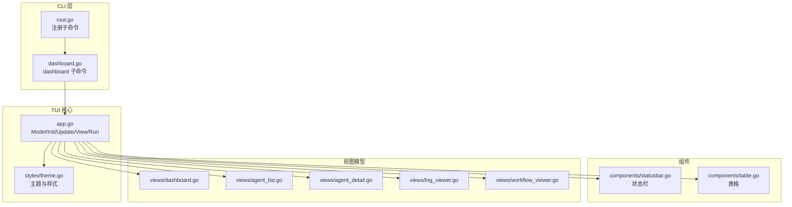
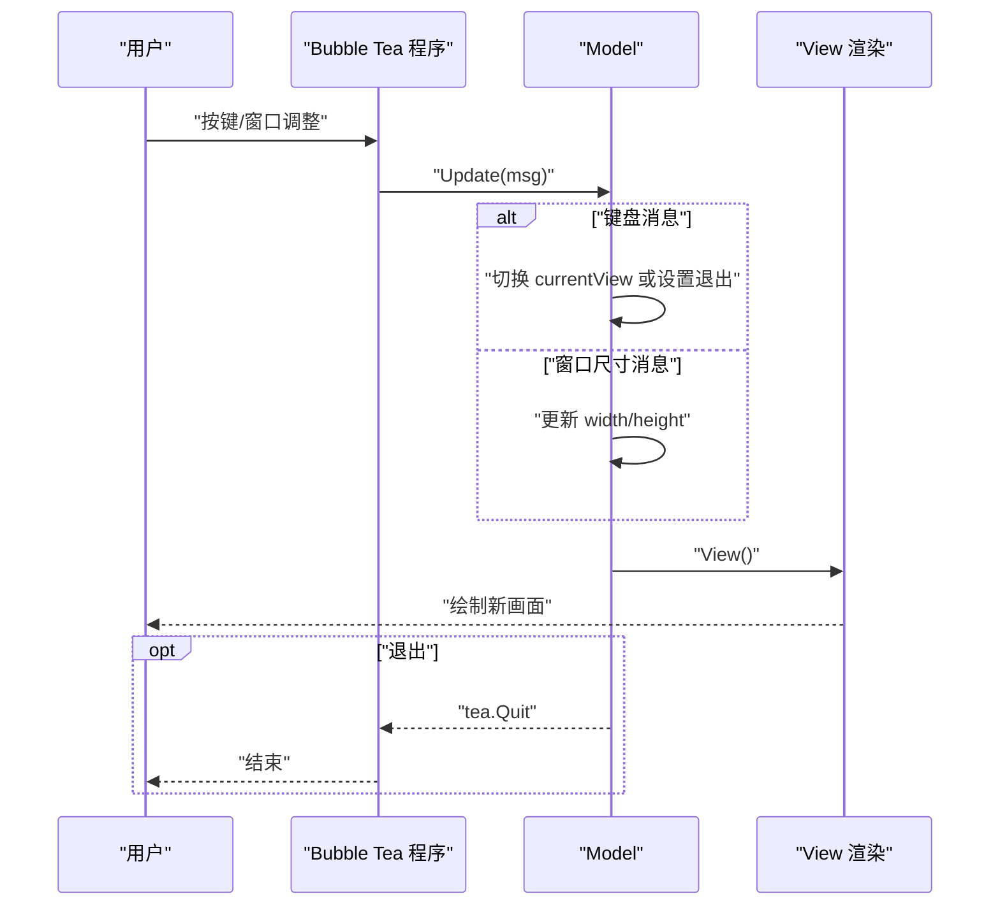
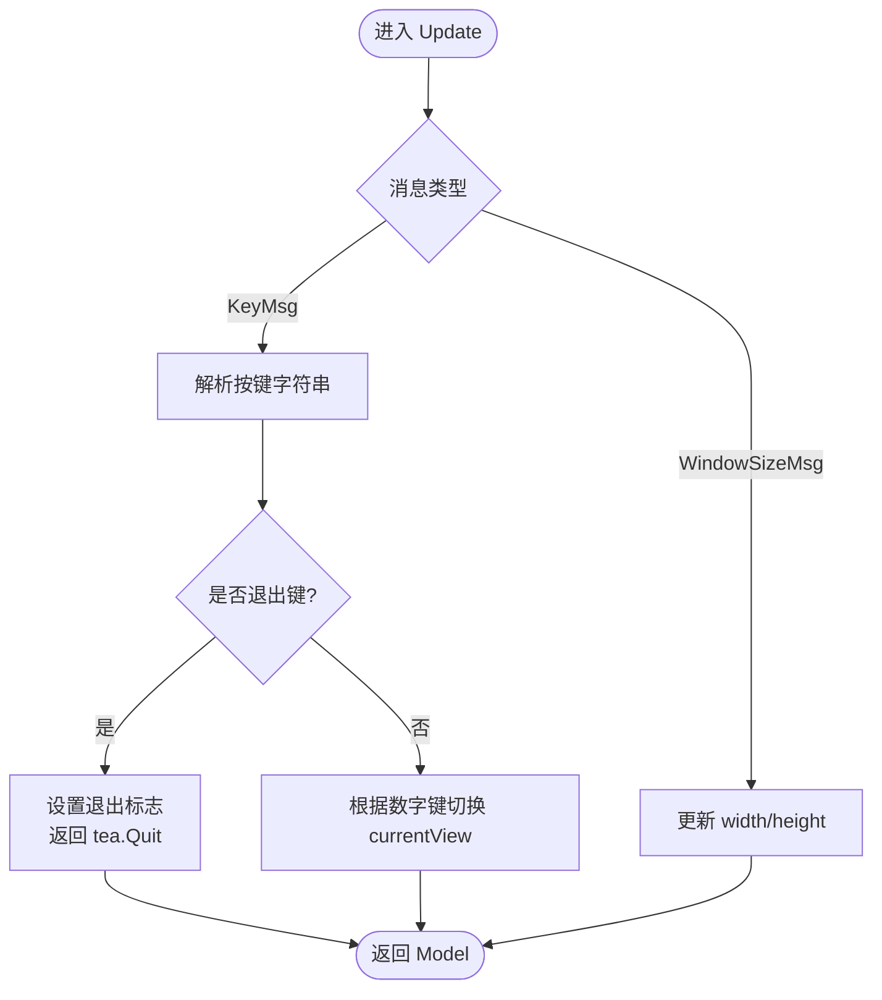
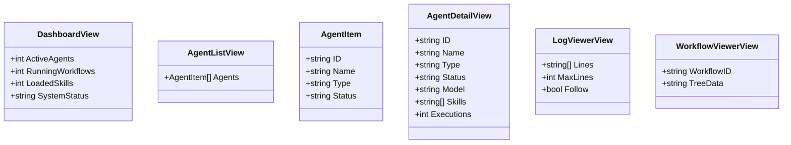
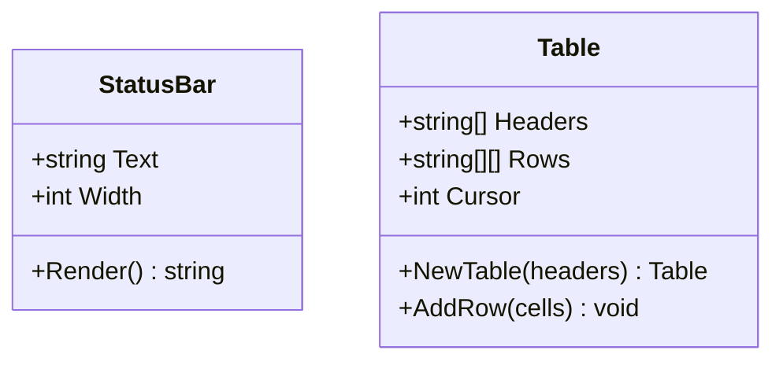
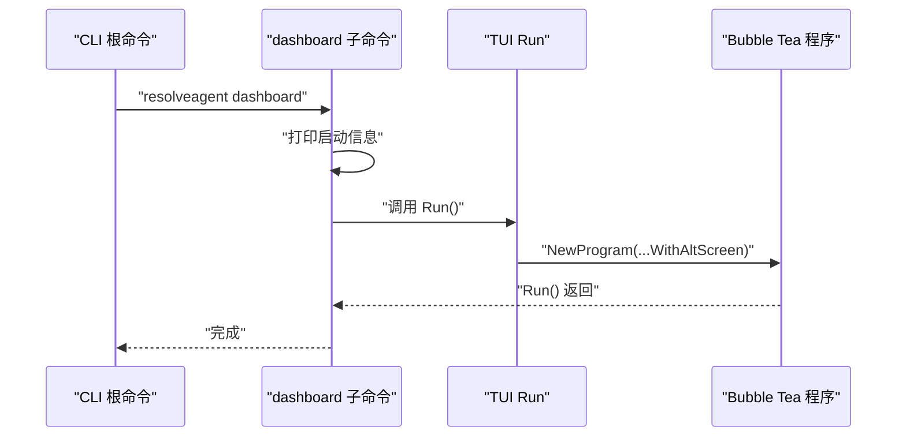
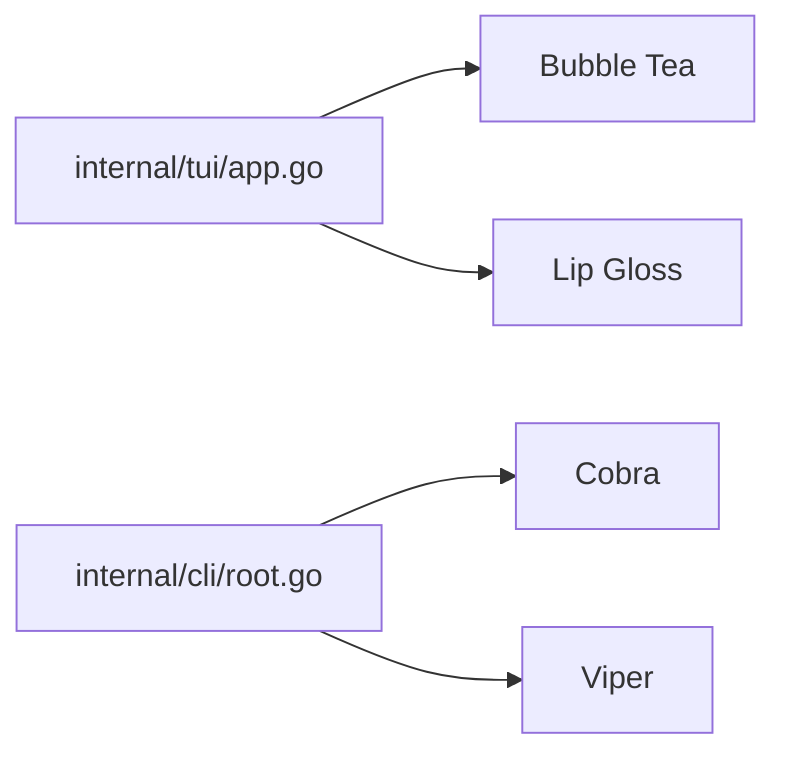

# TUI 终端界面

<cite>
**本文引用的文件**
- [internal/tui/app.go](file://internal/tui/app.go)
- [internal/tui/styles/theme.go](file://internal/tui/styles/theme.go)
- [internal/tui/components/statusbar.go](file://internal/tui/components/statusbar.go)
- [internal/tui/components/table.go](file://internal/tui/components/table.go)
- [internal/tui/views/dashboard.go](file://internal/tui/views/dashboard.go)
- [internal/tui/views/agent_list.go](file://internal/tui/views/agent_list.go)
- [internal/tui/views/agent_detail.go](file://internal/tui/views/agent_detail.go)
- [internal/tui/views/log_viewer.go](file://internal/tui/views/log_viewer.go)
- [internal/tui/views/workflow_viewer.go](file://internal/tui/views/workflow_viewer.go)
- [internal/cli/root.go](file://internal/cli/root.go)
- [internal/cli/dashboard.go](file://internal/cli/dashboard.go)
- [go.mod](file://go.mod)
</cite>

## 目录
1. [简介](#简介)
2. [项目结构](#项目结构)
3. [核心组件](#核心组件)
4. [架构总览](#架构总览)
5. [详细组件分析](#详细组件分析)
6. [依赖分析](#依赖分析)
7. [性能考虑](#性能考虑)
8. [故障排查指南](#故障排查指南)
9. [结论](#结论)
10. [附录](#附录)

## 简介
本文件面向 ResolveAgent 的 TUI（文本用户界面）实现，围绕基于 Go 语言与 Bubble Tea 框架构建的终端界面进行系统化说明。内容涵盖应用启动流程、视图管理、组件渲染、用户交互处理、终端布局与样式主题、键盘事件处理以及实时数据展示等。同时给出架构模式、状态管理机制与性能优化策略，并提供可定位到源码路径的示例与调试建议。

## 项目结构
TUI 相关代码集中在 internal/tui 目录下，采用按功能域分层的组织方式：
- app.go：TUI 主模型与生命周期（初始化、更新、渲染、运行）
- styles/theme.go：主题与样式定义（颜色、文本样式、边框、布局）
- components/：可复用 UI 组件（状态栏、表格）
- views/：视图模型（仪表盘、代理列表/详情、日志查看器、工作流查看器）
- CLI 集成：通过 CLI 子命令触发 TUI 启动（占位待实现）

图表来源
- [internal/cli/root.go:1-74](file://internal/cli/root.go#L1-L74)
- [internal/cli/dashboard.go:1-21](file://internal/cli/dashboard.go#L1-L21)
- [internal/tui/app.go:1-102](file://internal/tui/app.go#L1-L102)
- [internal/tui/styles/theme.go:1-47](file://internal/tui/styles/theme.go#L1-L47)
- [internal/tui/components/statusbar.go:1-22](file://internal/tui/components/statusbar.go#L1-L22)
- [internal/tui/components/table.go:1-21](file://internal/tui/components/table.go#L1-L21)
- [internal/tui/views/dashboard.go:1-17](file://internal/tui/views/dashboard.go#L1-L17)
- [internal/tui/views/agent_list.go:1-15](file://internal/tui/views/agent_list.go#L1-L15)
- [internal/tui/views/agent_detail.go:1-13](file://internal/tui/views/agent_detail.go#L1-L13)
- [internal/tui/views/log_viewer.go:1-17](file://internal/tui/views/log_viewer.go#L1-L17)
- [internal/tui/views/workflow_viewer.go:1-8](file://internal/tui/views/workflow_viewer.go#L1-L8)

章节来源
- [internal/tui/app.go:1-102](file://internal/tui/app.go#L1-L102)
- [internal/tui/styles/theme.go:1-47](file://internal/tui/styles/theme.go#L1-L47)
- [internal/tui/components/statusbar.go:1-22](file://internal/tui/components/statusbar.go#L1-L22)
- [internal/tui/components/table.go:1-21](file://internal/tui/components/table.go#L1-L21)
- [internal/tui/views/dashboard.go:1-17](file://internal/tui/views/dashboard.go#L1-L17)
- [internal/tui/views/agent_list.go:1-15](file://internal/tui/views/agent_list.go#L1-L15)
- [internal/tui/views/agent_detail.go:1-13](file://internal/tui/views/agent_detail.go#L1-L13)
- [internal/tui/views/log_viewer.go:1-17](file://internal/tui/views/log_viewer.go#L1-L17)
- [internal/tui/views/workflow_viewer.go:1-8](file://internal/tui/views/workflow_viewer.go#L1-L8)
- [internal/cli/root.go:1-74](file://internal/cli/root.go#L1-L74)
- [internal/cli/dashboard.go:1-21](file://internal/cli/dashboard.go#L1-L21)

## 核心组件
- 主模型 Model：持有当前视图标识、窗口尺寸与退出标志；实现 Bubble Tea 的 Init/Update/View 接口；负责键盘切换视图与窗口大小变更响应。
- 视图模型 Views：以结构体形式承载各页面所需的数据（如仪表盘指标、代理列表项、日志行、工作流树数据）。
- 组件 Components：提供可复用 UI 元素（状态栏、表格），封装样式与渲染逻辑。
- 主题 Styles：集中定义颜色、文本样式、状态样式与边框布局，确保界面风格一致。
- CLI 集成：在 CLI 中注册 dashboard 子命令，用于启动 TUI（当前为占位，后续可直接调用 TUI Run）。

章节来源
- [internal/tui/app.go:20-63](file://internal/tui/app.go#L20-L63)
- [internal/tui/views/dashboard.go:3-16](file://internal/tui/views/dashboard.go#L3-L16)
- [internal/tui/views/agent_list.go:3-14](file://internal/tui/views/agent_list.go#L3-L14)
- [internal/tui/views/agent_detail.go:3-12](file://internal/tui/views/agent_detail.go#L3-L12)
- [internal/tui/views/log_viewer.go:3-16](file://internal/tui/views/log_viewer.go#L3-L16)
- [internal/tui/views/workflow_viewer.go:3-7](file://internal/tui/views/workflow_viewer.go#L3-L7)
- [internal/tui/styles/theme.go:7-46](file://internal/tui/styles/theme.go#L7-L46)
- [internal/tui/components/statusbar.go:12-21](file://internal/tui/components/statusbar.go#L12-L21)
- [internal/tui/components/table.go:3-20](file://internal/tui/components/table.go#L3-L20)
- [internal/cli/dashboard.go:9-20](file://internal/cli/dashboard.go#L9-L20)

## 架构总览
TUI 采用 Bubble Tea 的函数式响应式模型：消息驱动状态更新，状态决定渲染输出。主模型接收键盘与窗口尺寸消息，切换 currentView 并更新宽高；View 根据 currentView 渲染对应内容与状态栏提示；主题与组件提供统一的视觉与交互能力。

图表来源
- [internal/tui/app.go:40-94](file://internal/tui/app.go#L40-L94)

## 详细组件分析

### 主模型与生命周期（Model）
- 初始化：Init 返回空命令，表示无需立即执行额外动作。
- 更新：Update 处理 tea.KeyMsg 与 tea.WindowSizeMsg，支持“1/2/3/4”切换视图、“q/ctrl+c”退出；窗口尺寸变化时更新 Model 宽高。
- 渲染：View 在退出时返回“Goodbye”，否则渲染标题、状态行、当前视图内容与底部快捷键提示。
- 运行：Run 创建带备用屏幕的程序并启动。

图表来源
- [internal/tui/app.go:40-63](file://internal/tui/app.go#L40-L63)

章节来源
- [internal/tui/app.go:28-94](file://internal/tui/app.go#L28-L94)

### 视图模型（Views）
- 仪表盘视图：包含系统状态、活跃代理数、运行中工作流数、已加载技能数等指标字段。
- 代理列表视图：包含代理数组，每项含 ID、名称、类型、状态。
- 代理详情视图：包含 ID、名称、类型、状态、模型、技能列表、执行次数等。
- 日志查看器视图：包含日志行集合、最大行数、跟随模式等。
- 工作流查看器视图：包含工作流 ID 与树形数据字符串。

图表来源
- [internal/tui/views/dashboard.go:3-16](file://internal/tui/views/dashboard.go#L3-L16)
- [internal/tui/views/agent_list.go:3-14](file://internal/tui/views/agent_list.go#L3-L14)
- [internal/tui/views/agent_detail.go:3-12](file://internal/tui/views/agent_detail.go#L3-L12)
- [internal/tui/views/log_viewer.go:3-16](file://internal/tui/views/log_viewer.go#L3-L16)
- [internal/tui/views/workflow_viewer.go:3-7](file://internal/tui/views/workflow_viewer.go#L3-L7)

章节来源
- [internal/tui/views/dashboard.go:1-17](file://internal/tui/views/dashboard.go#L1-L17)
- [internal/tui/views/agent_list.go:1-15](file://internal/tui/views/agent_list.go#L1-L15)
- [internal/tui/views/agent_detail.go:1-13](file://internal/tui/views/agent_detail.go#L1-L13)
- [internal/tui/views/log_viewer.go:1-17](file://internal/tui/views/log_viewer.go#L1-L17)
- [internal/tui/views/workflow_viewer.go:1-8](file://internal/tui/views/workflow_viewer.go#L1-L8)

### 组件（Components）
- 状态栏 StatusBar：提供背景色、前景色与内边距的样式，按给定宽度渲染文本。
- 表格 Table：支持设置表头、追加行、维护光标位置，便于在终端中呈现结构化数据。

图表来源
- [internal/tui/components/statusbar.go:12-21](file://internal/tui/components/statusbar.go#L12-L21)
- [internal/tui/components/table.go:3-20](file://internal/tui/components/table.go#L3-L20)

章节来源
- [internal/tui/components/statusbar.go:1-22](file://internal/tui/components/statusbar.go#L1-L22)
- [internal/tui/components/table.go:1-21](file://internal/tui/components/table.go#L1-L21)

### 主题与样式（Styles）
- 颜色体系：定义主色、辅色、成功、警告、错误、柔和色与背景色。
- 文本样式：标题、副标题、标签等常用样式。
- 状态样式：健康、错误、警告状态文本样式。
- 边框与布局：圆角边框、边框前景色、内边距等。

章节来源
- [internal/tui/styles/theme.go:7-46](file://internal/tui/styles/theme.go#L7-L46)

### CLI 集成与启动流程
- CLI 根命令注册了 dashboard 子命令，当前实现为占位，打印启动信息。
- 建议后续直接调用 TUI 的 Run 方法启动 Bubble Tea 程序，并启用备用屏。

图表来源
- [internal/cli/root.go:44-53](file://internal/cli/root.go#L44-L53)
- [internal/cli/dashboard.go:14-19](file://internal/cli/dashboard.go#L14-L19)
- [internal/tui/app.go:96-101](file://internal/tui/app.go#L96-L101)

章节来源
- [internal/cli/root.go:1-74](file://internal/cli/root.go#L1-L74)
- [internal/cli/dashboard.go:1-21](file://internal/cli/dashboard.go#L1-L21)
- [internal/tui/app.go:96-101](file://internal/tui/app.go#L96-L101)

## 依赖分析
- Bubble Tea：提供 TUI 框架、消息循环与渲染管线。
- Lip Gloss：提供终端样式与布局工具，统一主题与组件外观。
- Cobra/Viper：CLI 命令与配置管理，为 TUI 提供入口与环境配置。

图表来源
- [go.mod:5-14](file://go.mod#L5-L14)
- [internal/tui/app.go:3-8](file://internal/tui/app.go#L3-L8)
- [internal/cli/root.go:3-16](file://internal/cli/root.go#L3-L16)

章节来源
- [go.mod:1-90](file://go.mod#L1-L90)
- [internal/tui/app.go:1-102](file://internal/tui/app.go#L1-L102)
- [internal/cli/root.go:1-74](file://internal/cli/root.go#L1-L74)

## 性能考虑
- 渲染最小化：仅在状态变化或收到窗口尺寸消息时重新计算 View，避免不必要的重绘。
- 数据结构选择：视图模型使用简单结构体，便于快速序列化与渲染；表格组件按需扩展，避免过深嵌套。
- 主题与样式：集中定义样式变量，减少重复计算与内存分配。
- I/O 优化：日志查看器支持跟随模式与最大行数限制，防止无限增长导致渲染卡顿。
- 组件复用：StatusBar/表格等组件可被多视图复用，降低耦合与维护成本。

## 故障排查指南
- 无法启动 TUI：检查 CLI dashboard 子命令是否正确调用 TUI Run；确认终端支持备用屏。
- 键盘无响应：确认 Bubble Tea 程序已正确接收 KeyMsg；检查 Update 分支是否覆盖目标按键。
- 窗口尺寸异常：确认 WindowSizeMsg 是否被正确处理；检查 View 中对 width/height 的使用。
- 样式不生效：核对主题常量与样式组合是否正确；确保 Lip Gloss 版本兼容。
- 调试技巧：在 Update 中打印消息类型与值，逐步定位分支；在 View 中分段拼接字符串，验证各部分渲染结果。

章节来源
- [internal/tui/app.go:40-94](file://internal/tui/app.go#L40-L94)
- [internal/tui/styles/theme.go:7-46](file://internal/tui/styles/theme.go#L7-L46)
- [internal/tui/components/statusbar.go:12-21](file://internal/tui/components/statusbar.go#L12-L21)
- [internal/tui/components/table.go:3-20](file://internal/tui/components/table.go#L3-L20)

## 结论
ResolveAgent 的 TUI 采用清晰的分层架构：CLI 作为入口、Model 负责状态与交互、Views 承载数据、Components 与 Styles 提供可复用的渲染能力。该设计具备良好的可扩展性与可维护性，适合进一步集成真实数据源与交互行为，逐步完善仪表盘、代理管理、工作流与日志等核心功能模块。

## 附录
- 使用指南
  - 启动：执行 resolveagent dashboard（当前为占位，后续将直接启动 TUI）
  - 导航：按 1/2/3/4 切换视图，按 q 或 Ctrl+C 退出
  - 实时数据：日志查看器支持跟随模式，工作流查看器展示树形结构
- 开发建议
  - 将 CLI dashboard 子命令与 TUI Run 解耦，便于测试与替换
  - 为各视图模型增加数据填充逻辑，逐步替换当前静态内容
  - 引入异步数据源与定时刷新，结合组件复用提升用户体验