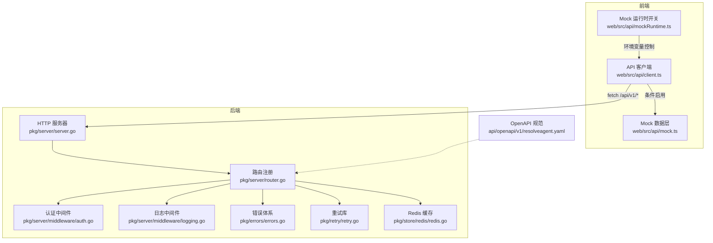
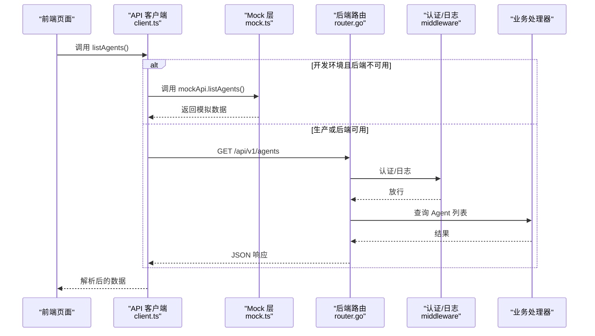
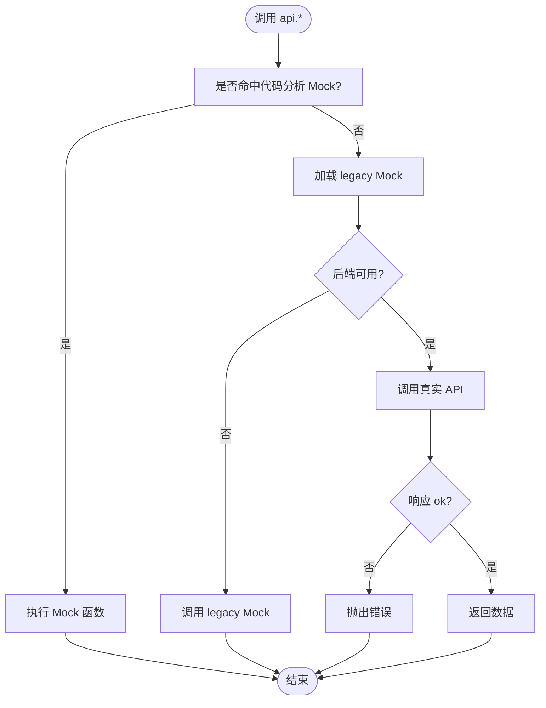
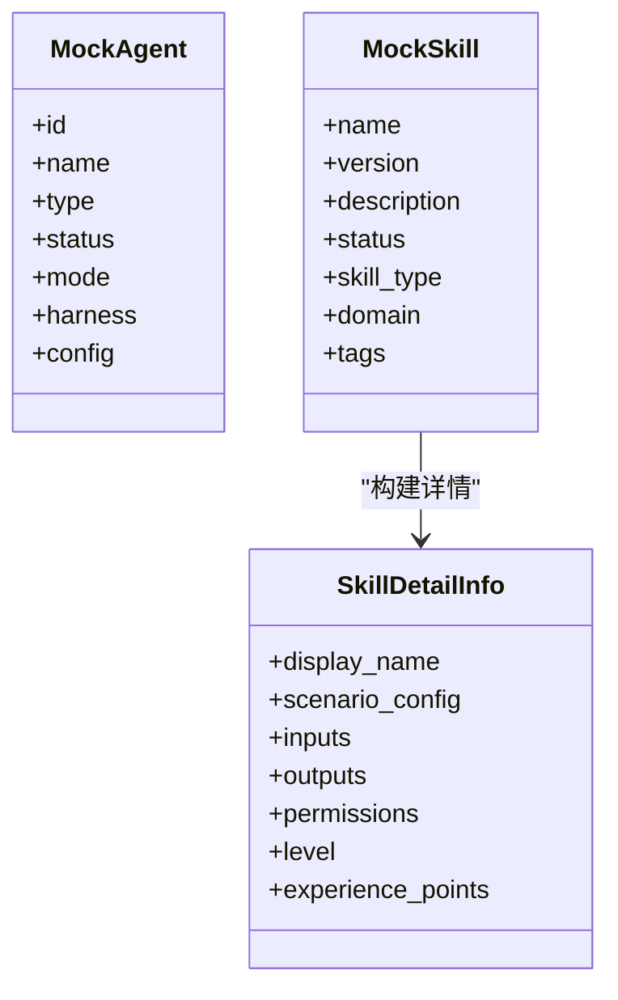
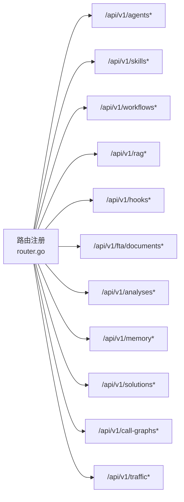
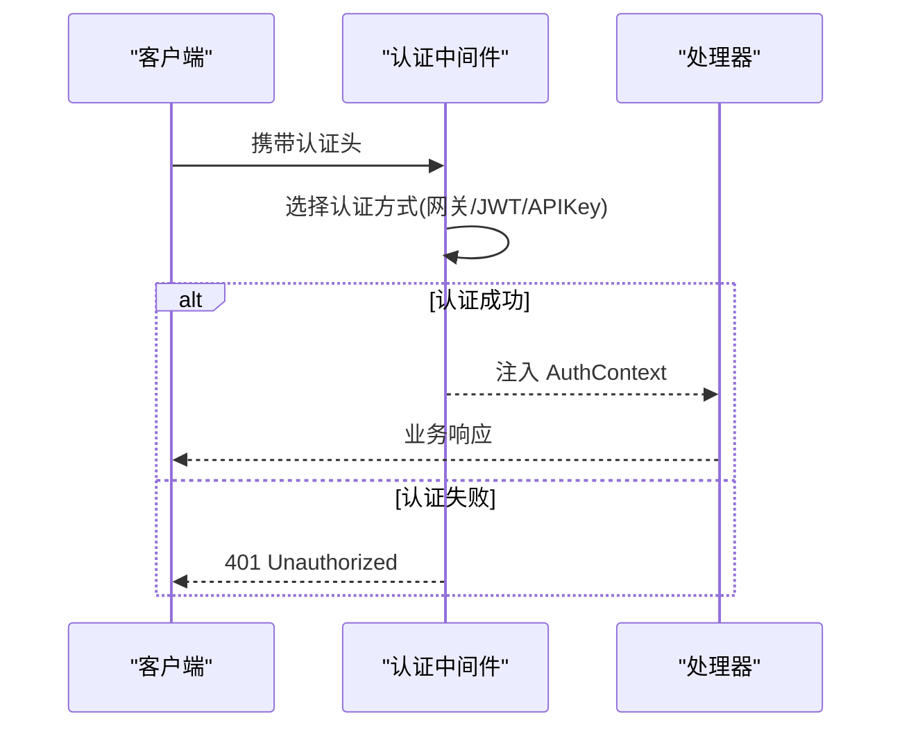
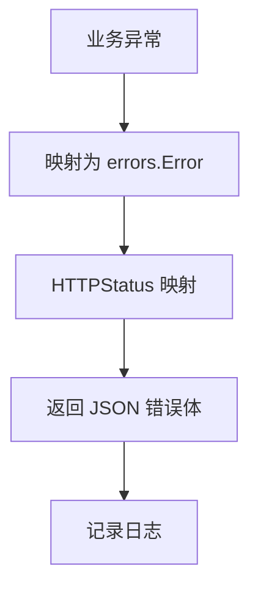
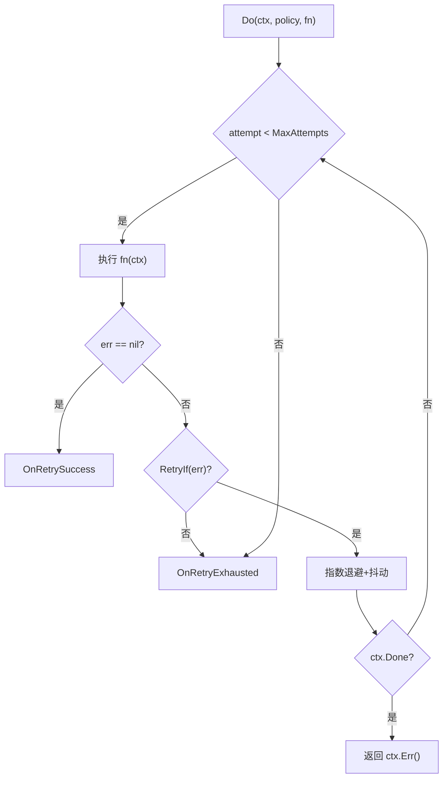
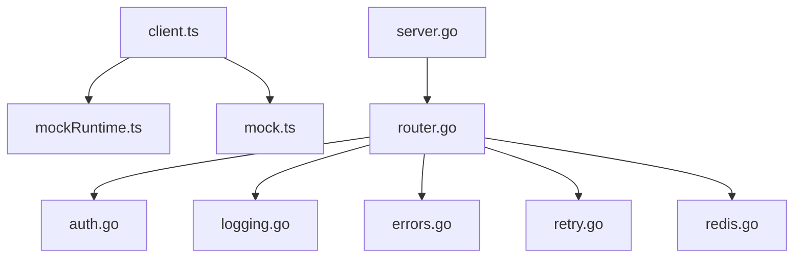

# API 集成

<cite>
**本文引用的文件**
- [resolveagent.yaml](file://api/openapi/v1/resolveagent.yaml)
- [client.ts](file://web/src/api/client.ts)
- [mock.ts](file://web/src/api/mock.ts)
- [mockRuntime.ts](file://web/src/api/mockRuntime.ts)
- [router.go](file://pkg/server/router.go)
- [server.go](file://pkg/server/server.go)
- [auth.go](file://pkg/server/middleware/auth.go)
- [logging.go](file://pkg/server/middleware/logging.go)
- [errors.go](file://pkg/errors/errors.go)
- [retry.go](file://pkg/retry/retry.go)
- [redis.go](file://pkg/store/redis/redis.go)
- [shared.ts](file://web/src/mocks/codeAnalysis/shared.ts)
- [mock.skills.test.ts](file://web/src/api/mock.skills.test.ts)
</cite>

## 目录
1. [简介](#简介)
2. [项目结构](#项目结构)
3. [核心组件](#核心组件)
4. [架构总览](#架构总览)
5. [详细组件分析](#详细组件分析)
6. [依赖关系分析](#依赖关系分析)
7. [性能考量](#性能考量)
8. [故障排查指南](#故障排查指南)
9. [结论](#结论)
10. [附录](#附录)

## 简介
本技术文档面向 ResolveAgent 平台的 API 集成，覆盖前端与后端的完整交互链路：API 客户端设计、请求拦截与响应处理、错误处理机制、Mock 数据系统、测试策略与开发调试方法、API 版本管理、认证与安全策略，以及调用示例、错误模式与性能优化建议。目标是帮助开发者快速理解并稳定集成平台 REST API。

## 项目结构
ResolveAgent 的 API 集成由以下关键部分组成：
- OpenAPI 规范定义后端接口契约（REST）
- 前端 API 客户端封装统一请求、类型与 Mock 切换
- 后端路由注册与处理器实现具体业务
- 中间件提供认证、日志等横切能力
- 错误体系与重试机制保障稳定性
- Redis 缓存用于性能优化
- Mock 数据与测试支撑开发与联调

图表来源
- [client.ts:45-90](file://web/src/api/client.ts#L45-L90)
- [mock.ts:1-120](file://web/src/api/mock.ts#L1-L120)
- [mockRuntime.ts:1-23](file://web/src/api/mockRuntime.ts#L1-L23)
- [server.go:108-120](file://pkg/server/server.go#L108-L120)
- [router.go:6-136](file://pkg/server/router.go#L6-L136)
- [auth.go:77-103](file://pkg/server/middleware/auth.go#L77-L103)
- [logging.go:19-37](file://pkg/server/middleware/logging.go#L19-L37)
- [errors.go:26-47](file://pkg/errors/errors.go#L26-L47)
- [retry.go:22-55](file://pkg/retry/retry.go#L22-L55)
- [redis.go:13-37](file://pkg/store/redis/redis.go#L13-L37)
- [resolveagent.yaml:1-31](file://api/openapi/v1/resolveagent.yaml#L1-L31)

章节来源
- [resolveagent.yaml:1-31](file://api/openapi/v1/resolveagent.yaml#L1-L31)
- [server.go:108-120](file://pkg/server/server.go#L108-L120)
- [router.go:6-136](file://pkg/server/router.go#L6-L136)

## 核心组件
- 前端 API 客户端：统一基地址、请求封装、真实/模拟回退、代理拦截、类型导出
- Mock 数据系统：基于场景的静态数据、延迟模拟、动态详情生成、单元测试覆盖
- 后端路由：按领域划分 REST 端点（Agents/Skills/Workflows/RAG/Hooks/FTA/Code Analysis/Memory/Solutions/Call Graph/Traffic）
- 认证中间件：支持网关头、JWT、API Key 三种方式，可配置跳过路径
- 日志中间件：记录请求方法、路径、状态码、耗时、远端地址
- 错误体系：结构化错误码与 HTTP 状态映射
- 重试机制：指数退避、抖动、上下文取消、观察者回调
- 缓存：Redis 连接与健康检查，为上层服务提供缓存能力

章节来源
- [client.ts:45-90](file://web/src/api/client.ts#L45-L90)
- [mock.ts:47-120](file://web/src/api/mock.ts#L47-L120)
- [router.go:6-136](file://pkg/server/router.go#L6-L136)
- [auth.go:15-32](file://pkg/server/middleware/auth.go#L15-L32)
- [logging.go:19-37](file://pkg/server/middleware/logging.go#L19-L37)
- [errors.go:26-47](file://pkg/errors/errors.go#L26-L47)
- [retry.go:22-55](file://pkg/retry/retry.go#L22-L55)
- [redis.go:13-37](file://pkg/store/redis/redis.go#L13-L37)

## 架构总览
前端通过统一的 API 客户端发起请求，客户端根据运行环境决定是否使用 Mock；后端以 Go HTTP 服务暴露 REST API，路由将请求分发到对应处理器，中间件负责认证与日志，错误体系与重试保证健壮性，缓存提升性能。

图表来源
- [client.ts:45-90](file://web/src/api/client.ts#L45-L90)
- [client.ts:296-393](file://web/src/api/client.ts#L296-L393)
- [mock.ts:64-120](file://web/src/api/mock.ts#L64-L120)
- [router.go:14-20](file://pkg/server/router.go#L14-L20)
- [auth.go:77-103](file://pkg/server/middleware/auth.go#L77-L103)
- [logging.go:19-37](file://pkg/server/middleware/logging.go#L19-L37)

## 详细组件分析

### 前端 API 客户端设计与请求流程
- 基地址与请求封装：统一设置 Content-Type，非 2xx 响应抛出错误，错误体优先解析 JSON
- 后端可用性探测：启动时探测 /health，缓存结果并在 30 秒内复用
- 代理拦截与回退：对特定方法优先尝试代码分析 Mock，否则在开发环境加载 legacy Mock；若后端不可用则直接走 Mock，失败时再回退
- 方法集合：涵盖 Agents、Skills、Workflows、RAG、Memory、Solutions、Call Graph、Traffic 等

图表来源
- [client.ts:45-90](file://web/src/api/client.ts#L45-L90)
- [client.ts:296-393](file://web/src/api/client.ts#L296-L393)
- [mockRuntime.ts:15-23](file://web/src/api/mockRuntime.ts#L15-L23)

章节来源
- [client.ts:45-90](file://web/src/api/client.ts#L45-L90)
- [client.ts:296-393](file://web/src/api/client.ts#L296-L393)
- [mockRuntime.ts:1-23](file://web/src/api/mockRuntime.ts#L1-L23)

### Mock 数据系统与测试策略
- 数据构造：包含多类 Agent、Skill、Workflow 等，模拟真实运维场景
- 延迟模拟：随机延迟增强体验真实性
- 动态详情：从列表数据推导技能详情，包括场景化配置、输入输出、权限、经验值等
- 测试覆盖：针对技能详情生成逻辑编写单元测试，验证字段与计算规则

图表来源
- [mock.ts:64-120](file://web/src/api/mock.ts#L64-L120)
- [mock.ts:241-443](file://web/src/api/mock.ts#L241-L443)

章节来源
- [mock.ts:47-120](file://web/src/api/mock.ts#L47-L120)
- [mock.ts:241-443](file://web/src/api/mock.ts#L241-L443)
- [mock.skills.test.ts:1-16](file://web/src/api/mock.skills.test.ts#L1-L16)

### 后端路由与处理器
- 路由注册：集中式注册所有 REST 端点，按领域分组（Agents/Skills/Workflows/RAG/Hooks/FTA/Analyses/Corpus/Memory/Solutions/Call Graph/Traffic）
- 健康检查：/healthz 与 /api/v1/health 均指向同一处理器
- 生命周期：HTTP 服务器与 gRPC 服务器并行启动，优雅关闭

图表来源
- [router.go:6-136](file://pkg/server/router.go#L6-L136)

章节来源
- [router.go:6-136](file://pkg/server/router.go#L6-L136)
- [server.go:108-120](file://pkg/server/server.go#L108-L120)

### 认证机制与安全策略
- 支持三种认证方式：
  - 网关透传：X-Auth-User/X-Auth-Roles
  - JWT：Authorization: Bearer <token>，校验签名、签发者、过期时间
  - API Key：X-API-Key 或 Authorization 中的密钥，支持过期时间
- 可配置跳过路径：健康检查、指标等无需鉴权
- 上下文注入：认证信息写入请求上下文，供后续处理器使用

图表来源
- [auth.go:77-103](file://pkg/server/middleware/auth.go#L77-L103)
- [auth.go:114-132](file://pkg/server/middleware/auth.go#L114-L132)
- [auth.go:153-207](file://pkg/server/middleware/auth.go#L153-L207)
- [auth.go:209-228](file://pkg/server/middleware/auth.go#L209-L228)

章节来源
- [auth.go:15-32](file://pkg/server/middleware/auth.go#L15-L32)
- [auth.go:77-103](file://pkg/server/middleware/auth.go#L77-L103)
- [auth.go:114-132](file://pkg/server/middleware/auth.go#L114-L132)
- [auth.go:153-207](file://pkg/server/middleware/auth.go#L153-L207)
- [auth.go:209-228](file://pkg/server/middleware/auth.go#L209-L228)

### 错误处理与响应格式
- 统一错误结构：包含机器可读 Code、人类可读 Message、可选 Cause
- HTTP 状态映射：NOT_FOUND→404、ALREADY_EXISTS→409、INVALID_ARGUMENT→400、UNAUTHORIZED→401、FORBIDDEN→403、INTERNAL→500、UNAVAILABLE→503、TIMEOUT→504、CONFLICT→409、RATE_LIMITED→429
- Handler 层常见错误：参数缺失、JSON 解析失败、资源不存在、服务不可用、超时、运行时不可达等

图表来源
- [errors.go:26-47](file://pkg/errors/errors.go#L26-L47)
- [errors.go:82-86](file://pkg/errors/errors.go#L82-L86)

章节来源
- [errors.go:26-47](file://pkg/errors/errors.go#L26-L47)
- [errors.go:82-86](file://pkg/errors/errors.go#L82-L86)

### 重试机制与容错
- 指数退避与抖动：避免雪崩，提高成功率
- 上下文感知：支持取消信号
- 观察者回调：成功或耗尽时上报，便于反馈闭环

图表来源
- [retry.go:22-55](file://pkg/retry/retry.go#L22-L55)
- [retry.go:55-121](file://pkg/retry/retry.go#L55-L121)

章节来源
- [retry.go:22-55](file://pkg/retry/retry.go#L22-L55)
- [retry.go:55-121](file://pkg/retry/retry.go#L55-L121)

### 缓存与性能优化
- Redis 缓存：连接池、健康检查，适合热点数据与限流场景
- Python 侧决策缓存：LRU 策略、TTL、命中率统计，降低重复计算开销
- 前端可用性探测：减少无效请求，提升用户体验

章节来源
- [redis.go:13-37](file://pkg/store/redis/redis.go#L13-L37)
- [redis.go:40-68](file://pkg/store/redis/redis.go#L40-L68)

## 依赖关系分析
- 前端 client.ts 依赖 mockRuntime 控制 Mock 开关，依赖 mock.ts 提供模拟数据
- 后端 server.go 初始化 HTTP/gRPC 服务，router.go 注册路由，middleware 提供横切能力
- 错误体系 errors.go 被各层引用，确保一致的错误语义
- 重试 retry.go 可被任意需要容错的调用方使用
- Redis 缓存 redis.go 作为外部存储依赖

图表来源
- [client.ts:45-90](file://web/src/api/client.ts#L45-L90)
- [client.ts:296-393](file://web/src/api/client.ts#L296-L393)
- [server.go:108-120](file://pkg/server/server.go#L108-L120)
- [router.go:6-136](file://pkg/server/router.go#L6-L136)
- [auth.go:77-103](file://pkg/server/middleware/auth.go#L77-L103)
- [logging.go:19-37](file://pkg/server/middleware/logging.go#L19-L37)
- [errors.go:26-47](file://pkg/errors/errors.go#L26-L47)
- [retry.go:22-55](file://pkg/retry/retry.go#L22-L55)
- [redis.go:13-37](file://pkg/store/redis/redis.go#L13-L37)

章节来源
- [client.ts:45-90](file://web/src/api/client.ts#L45-L90)
- [server.go:108-120](file://pkg/server/server.go#L108-L120)
- [router.go:6-136](file://pkg/server/router.go#L6-L136)

## 性能考量
- 前端
  - 后端可用性探测缓存，避免频繁探测
  - 开发环境优先 Mock，减少网络开销
  - 合理分页与增量更新（参考路由中 detail=true 等参数）
- 后端
  - 使用 Redis 缓存热点数据，降低数据库压力
  - 使用重试与指数退避应对瞬时失败
  - 日志中间件记录耗时，辅助定位瓶颈
- Python 侧
  - 决策缓存 LRU+TTL，提升选择器性能
  - 统计命中率，指导容量规划

[本节为通用性能建议，不直接分析具体文件]

## 故障排查指南
- 认证失败
  - 检查请求头是否包含正确的认证信息（网关头、JWT、API Key）
  - 确认跳过的路径是否正确配置
  - 查看认证中间件日志
- 请求超时
  - 检查后端处理器耗时与重试策略
  - 结合日志中间件的耗时字段定位慢请求
- 资源不存在/参数错误
  - 对照 OpenAPI 规范检查路径与参数
  - 查看错误响应中的 code 与 message
- Mock 相关
  - 确认环境变量控制开关生效
  - 使用共享工具类进行场景切换与断言

章节来源
- [auth.go:77-103](file://pkg/server/middleware/auth.go#L77-L103)
- [logging.go:19-37](file://pkg/server/middleware/logging.go#L19-L37)
- [errors.go:26-47](file://pkg/errors/errors.go#L26-L47)
- [shared.ts:1-111](file://web/src/mocks/codeAnalysis/shared.ts#L1-L111)

## 结论
ResolveAgent 的 API 集成采用前后端解耦、契约驱动的设计：前端通过统一客户端屏蔽差异与回退，后端以清晰的路由与中间件提供稳定可靠的 REST 服务。配合结构化错误、重试与缓存机制，系统在开发与生产环境中均具备良好的可维护性与可扩展性。建议在生产部署中启用认证与日志，并结合监控指标持续优化性能。

[本节为总结性内容，不直接分析具体文件]

## 附录

### API 版本管理与端点清单
- 版本：OpenAPI 文档声明版本 0.3.0，服务端统一以 /api/v1 前缀暴露
- 健康检查：/healthz、/api/v1/health
- 主要端点：
  - Agents：列表、详情、创建、更新、删除、执行、状态
  - Skills：列表、详情、注册、注销
  - Workflows：CRUD、校验、执行
  - RAG：集合与文档管理、入库、查询
  - Hooks：CRUD、执行记录
  - FTA 文档：CRUD、结果管理
  - 代码分析：分析任务与发现项
  - Memory：会话与长期记忆
  - Solutions：解决方案 CRUD、搜索、批量创建、执行记录
  - Call Graph/Traffic：调用图与流量捕获/图的 CRUD 与分析

章节来源
- [resolveagent.yaml:1-31](file://api/openapi/v1/resolveagent.yaml#L1-L31)
- [resolveagent.yaml:32-163](file://api/openapi/v1/resolveagent.yaml#L32-L163)
- [router.go:6-136](file://pkg/server/router.go#L6-L136)

### 认证与安全最佳实践
- 生产环境务必启用认证，仅开放必要路径
- 使用强密钥与合理的 Token 过期策略
- 通过网关透传用户身份时，确保上游安全边界
- 定期轮换 API Key，限制最小权限

章节来源
- [auth.go:15-32](file://pkg/server/middleware/auth.go#L15-L32)
- [auth.go:77-103](file://pkg/server/middleware/auth.go#L77-L103)
- [auth.go:153-207](file://pkg/server/middleware/auth.go#L153-L207)
- [auth.go:209-228](file://pkg/server/middleware/auth.go#L209-L228)

### 前端调用示例（路径引用）
- 获取健康状态：/api/v1/health
- 列出 Agent：GET /api/v1/agents
- 获取 Agent 详情：GET /api/v1/agents/{id}
- 执行 Agent：POST /api/v1/agents/{id}/execute
- 列出 Skills：GET /api/v1/skills
- 列出 Workflows：GET /api/v1/workflows
- 列出 RAG 集合：GET /api/v1/rag/collections
- 列出解决方案：GET /api/v1/solutions
- 搜索解决方案：POST /api/v1/solutions/search
- 列出调用图：GET /api/v1/call-graphs
- 列出流量捕获：GET /api/v1/traffic/captures

章节来源
- [client.ts:93-289](file://web/src/api/client.ts#L93-L289)
- [router.go:6-136](file://pkg/server/router.go#L6-L136)

### 错误处理模式（路径引用）
- 参数校验失败：返回 INVALID_ARGUMENT
- 资源不存在：返回 NOT_FOUND
- 未认证：返回 UNAUTHORIZED
- 无权限：返回 FORBIDDEN
- 内部错误：返回 INTERNAL
- 服务不可用：返回 UNAVAILABLE
- 超时：返回 TIMEOUT
- 冲突：返回 CONFLICT
- 限流：返回 RATE_LIMITED

章节来源
- [errors.go:26-47](file://pkg/errors/errors.go#L26-L47)
- [errors.go:82-86](file://pkg/errors/errors.go#L82-L86)

### 测试与调试
- 使用 Mock 数据快速验证 UI 与流程
- 通过环境变量控制 Mock 开关与代码分析 Mock
- 使用共享工具类切换 Mock 场景（default/empty/error/invalid）
- 编写单元测试覆盖关键逻辑（如技能详情生成）

章节来源
- [mockRuntime.ts:15-23](file://web/src/api/mockRuntime.ts#L15-L23)
- [shared.ts:1-111](file://web/src/mocks/codeAnalysis/shared.ts#L1-L111)
- [mock.skills.test.ts:1-16](file://web/src/api/mock.skills.test.ts#L1-L16)