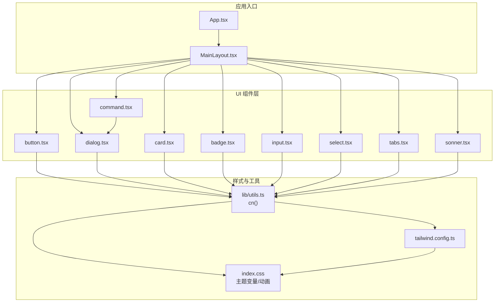
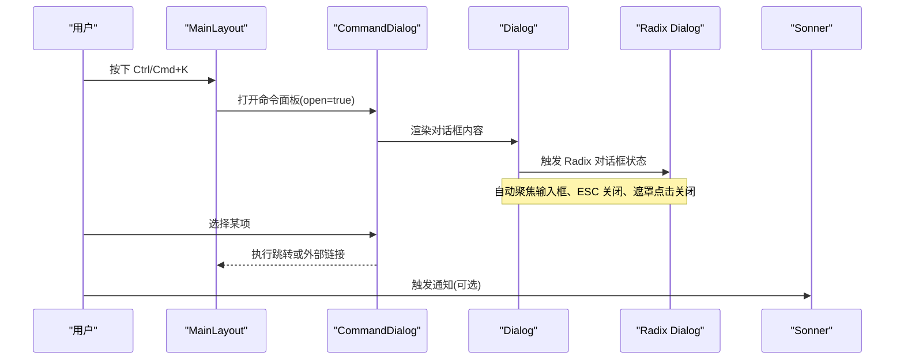
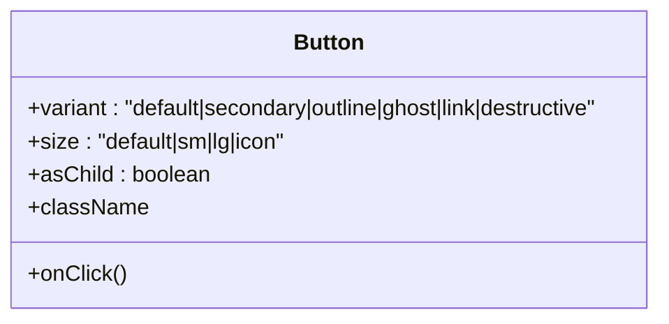
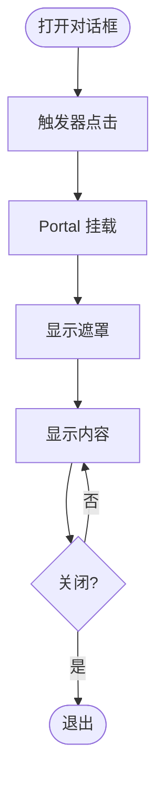
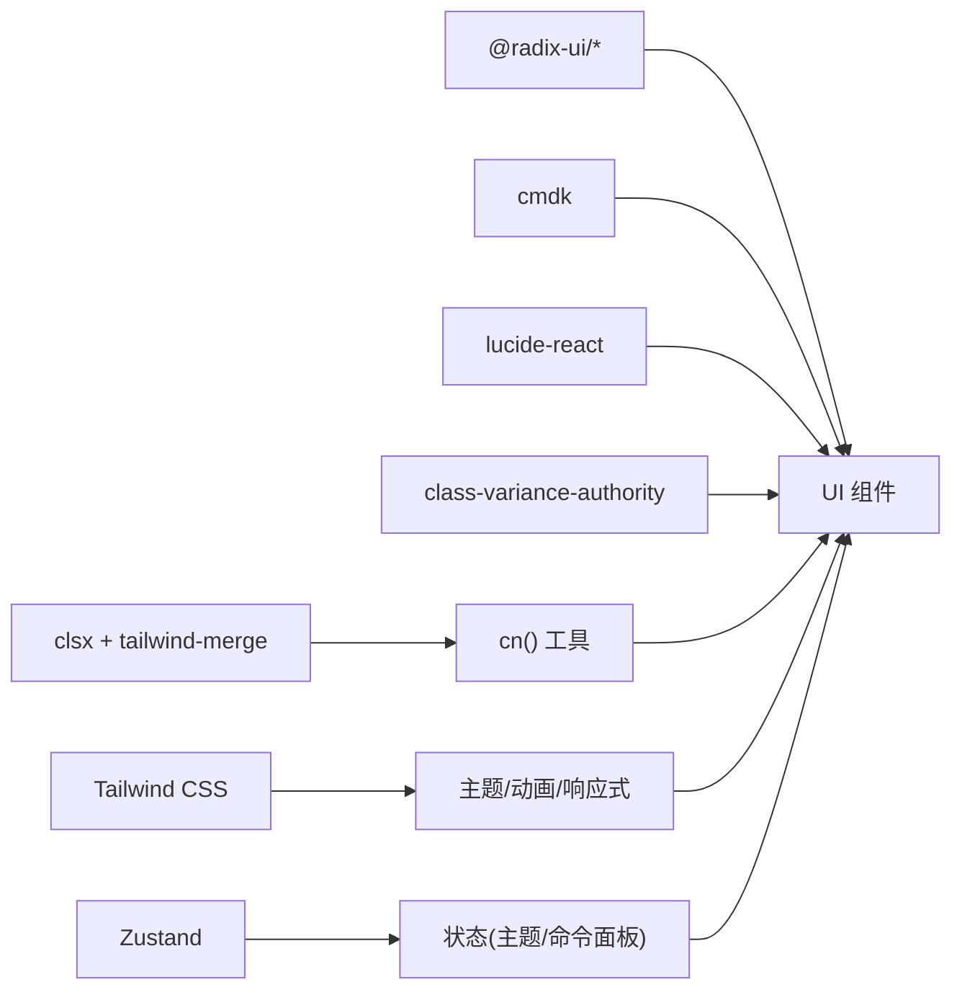

# UI 组件库

<cite>
**本文引用的文件**
- [web/package.json](file://web/package.json)
- [web/src/index.css](file://web/src/index.css)
- [web/tailwind.config.ts](file://web/tailwind.config.ts)
- [web/src/lib/utils.ts](file://web/src/lib/utils.ts)
- [web/src/App.tsx](file://web/src/App.tsx)
- [web/src/components/Layout/MainLayout.tsx](file://web/src/components/Layout/MainLayout.tsx)
- [web/src/components/ui/button.tsx](file://web/src/components/ui/button.tsx)
- [web/src/components/ui/dialog.tsx](file://web/src/components/ui/dialog.tsx)
- [web/src/components/ui/card.tsx](file://web/src/components/ui/card.tsx)
- [web/src/components/ui/badge.tsx](file://web/src/components/ui/badge.tsx)
- [web/src/components/ui/input.tsx](file://web/src/components/ui/input.tsx)
- [web/src/components/ui/select.tsx](file://web/src/components/ui/select.tsx)
- [web/src/components/ui/tabs.tsx](file://web/src/components/ui/tabs.tsx)
- [web/src/components/ui/command.tsx](file://web/src/components/ui/command.tsx)
- [web/src/components/ui/sonner.tsx](file://web/src/components/ui/sonner.tsx)
</cite>

## 目录
1. [简介](#简介)
2. [项目结构](#项目结构)
3. [核心组件](#核心组件)
4. [架构总览](#架构总览)
5. [详细组件分析](#详细组件分析)
6. [依赖关系分析](#依赖关系分析)
7. [性能与可访问性](#性能与可访问性)
8. [样式定制与主题](#样式定制与主题)
9. [使用示例与扩展指南](#使用示例与扩展指南)
10. [故障排查](#故障排查)
11. [结论](#结论)

## 简介
本技术文档面向 ResolveAgent Web 端的 UI 组件库，系统梳理基于 Radix UI 的无样式基础组件与自定义封装组件的组合方式，覆盖基础组件、业务组件与复合组件的分类、属性接口、事件处理、样式覆盖、主题支持、可访问性设计、响应式布局与动画效果。文档同时提供具体使用示例、样式覆盖方法与扩展指南，帮助开发者快速上手并安全地扩展组件能力。

## 项目结构
UI 组件库位于 web 子工程内，采用 Vite + React + TypeScript 构建，样式体系基于 Tailwind CSS，并通过 class-variance-authority（cva）实现变体化样式管理。Radix UI 提供无障碍的基础交互原语，组件层在其之上进行语义化封装与样式统一。

图表来源
- [web/src/App.tsx:57-108](file://web/src/App.tsx#L57-L108)
- [web/src/components/Layout/MainLayout.tsx:68-122](file://web/src/components/Layout/MainLayout.tsx#L68-L122)
- [web/src/components/ui/button.tsx:1-47](file://web/src/components/ui/button.tsx#L1-L47)
- [web/src/components/ui/dialog.tsx:1-92](file://web/src/components/ui/dialog.tsx#L1-L92)
- [web/src/components/ui/card.tsx:1-45](file://web/src/components/ui/card.tsx#L1-L45)
- [web/src/components/ui/badge.tsx:1-29](file://web/src/components/ui/badge.tsx#L1-L29)
- [web/src/components/ui/input.tsx:1-22](file://web/src/components/ui/input.tsx#L1-L22)
- [web/src/components/ui/select.tsx:1-136](file://web/src/components/ui/select.tsx#L1-L136)
- [web/src/components/ui/tabs.tsx:1-53](file://web/src/components/ui/tabs.tsx#L1-L53)
- [web/src/components/ui/command.tsx:1-125](file://web/src/components/ui/command.tsx#L1-L125)
- [web/src/components/ui/sonner.tsx:1-28](file://web/src/components/ui/sonner.tsx#L1-L28)
- [web/src/lib/utils.ts:1-7](file://web/src/lib/utils.ts#L1-L7)
- [web/tailwind.config.ts:1-94](file://web/tailwind.config.ts#L1-L94)
- [web/src/index.css:1-152](file://web/src/index.css#L1-L152)

章节来源
- [web/package.json:1-66](file://web/package.json#L1-L66)
- [web/src/App.tsx:1-111](file://web/src/App.tsx#L1-L111)
- [web/src/components/Layout/MainLayout.tsx:1-123](file://web/src/components/Layout/MainLayout.tsx#L1-L123)
- [web/src/lib/utils.ts:1-7](file://web/src/lib/utils.ts#L1-L7)
- [web/tailwind.config.ts:1-94](file://web/tailwind.config.ts#L1-L94)
- [web/src/index.css:1-152](file://web/src/index.css#L1-L152)

## 核心组件
- 基础组件：Button、Input、Badge、Card、Tabs、Select、Dialog、Command、Sonner（通知）。这些组件以 Radix UI 为底层，提供一致的交互行为与可访问性保证，并通过 cva 与 Tailwind 实现变体与主题适配。
- 业务/复合组件：MainLayout（页面骨架与全局命令面板）、Toaster（通知容器），组合多个基础组件完成复杂交互。

关键特性
- 变体与尺寸：通过 cva 定义 variant/size 等变体，配合 Tailwind 原子类实现一致风格。
- 主题与暗色模式：CSS 变量驱动，Tailwind 配置映射到 HSL 变量，支持 class 切换暗色模式。
- 可访问性：Radix 提供键盘导航、焦点管理与语义标签；组件内部保留 sr-only 提示与 focus-visible 环。
- 动画：Tailwind 动画与自定义 keyframes 结合，提供平滑过渡与微动效。

章节来源
- [web/src/components/ui/button.tsx:6-46](file://web/src/components/ui/button.tsx#L6-L46)
- [web/src/components/ui/dialog.tsx:6-91](file://web/src/components/ui/dialog.tsx#L6-L91)
- [web/src/components/ui/card.tsx:4-44](file://web/src/components/ui/card.tsx#L4-L44)
- [web/src/components/ui/badge.tsx:5-28](file://web/src/components/ui/badge.tsx#L5-L28)
- [web/src/components/ui/input.tsx:4-21](file://web/src/components/ui/input.tsx#L4-L21)
- [web/src/components/ui/select.tsx:6-135](file://web/src/components/ui/select.tsx#L6-L135)
- [web/src/components/ui/tabs.tsx:5-52](file://web/src/components/ui/tabs.tsx#L5-L52)
- [web/src/components/ui/command.tsx:8-124](file://web/src/components/ui/command.tsx#L8-L124)
- [web/src/components/ui/sonner.tsx:6-27](file://web/src/components/ui/sonner.tsx#L6-L27)
- [web/src/index.css:5-152](file://web/src/index.css#L5-L152)
- [web/tailwind.config.ts:4-90](file://web/tailwind.config.ts#L4-L90)

## 架构总览
组件库采用“基础组件 + 复合组件”的分层架构：
- 基础组件层：封装 Radix 原语，暴露稳定 API，负责可访问性与默认样式。
- 复合组件层：组合基础组件，提供业务场景下的开箱即用能力（如命令面板、对话框、卡片等）。
- 样式层：Tailwind + CSS 变量 + 动画，集中管理主题与视觉规范。
- 工具层：统一的 className 合并函数 cn()，确保样式优先级可控。

图表来源
- [web/src/components/Layout/MainLayout.tsx:73-117](file://web/src/components/Layout/MainLayout.tsx#L73-L117)
- [web/src/components/ui/command.tsx:23-33](file://web/src/components/ui/command.tsx#L23-L33)
- [web/src/components/ui/dialog.tsx:6-48](file://web/src/components/ui/dialog.tsx#L6-L48)
- [web/src/components/ui/sonner.tsx:6-27](file://web/src/components/ui/sonner.tsx#L6-L27)

## 详细组件分析

### Button（按钮）
- 职责：提供多种变体与尺寸的按钮，支持 asChild 透传至原生元素。
- 属性接口：variant（default/secondary/outline/ghost/link/destructive）、size（default/sm/lg/icon）、asChild、以及所有 HTMLButtonElement 属性。
- 事件处理：透传 onClick 等原生事件；focus-visible 提供键盘可达性。
- 样式定制：通过 cva 变体与 Tailwind 类名组合；可使用 className 覆盖。
- 可访问性：禁用态与焦点环；适合表单与导航操作。

图表来源
- [web/src/components/ui/button.tsx:6-46](file://web/src/components/ui/button.tsx#L6-L46)

章节来源
- [web/src/components/ui/button.tsx:1-47](file://web/src/components/ui/button.tsx#L1-L47)

### Dialog（对话框）
- 职责：基于 Radix Dialog 的完整对话框组件集合，包含 Overlay、Content、Header/Footer、Title、Description 等。
- 属性接口：继承 Radix 各子组件 props；Content 支持 Portal 定位与入场动画。
- 事件处理：Trigger 打开、Close 关闭、ESC 关闭、遮罩点击关闭；Focus 管理由 Radix 负责。
- 样式定制：Overlay 与 Content 使用 Tailwind 类；可通过 className 覆盖。
- 可访问性：ARIA 角色、键盘导航、sr-only 关闭提示。

图表来源
- [web/src/components/ui/dialog.tsx:6-48](file://web/src/components/ui/dialog.tsx#L6-L48)

章节来源
- [web/src/components/ui/dialog.tsx:1-92](file://web/src/components/ui/dialog.tsx#L1-L92)

### Card（卡片）
- 职责：结构化展示内容的容器，包含 Header/Title/Description/Content/Footer。
- 属性接口：标准 HTMLAttributes；各子组件均支持 className。
- 样式定制：边框、背景、前景色通过 CSS 变量；圆角与间距由 Tailwind 控制。
- 可访问性：语义化标题与段落，便于屏幕阅读器识别。

章节来源
- [web/src/components/ui/card.tsx:1-45](file://web/src/components/ui/card.tsx#L1-L45)

### Badge（标签）
- 职责：用于状态、分类或轻量信息展示。
- 属性接口：variant（default/secondary/destructive/outline）及 HTMLAttributes。
- 样式定制：通过 cva 变体与 Tailwind 类名；支持自定义 className。
- 可访问性：非交互元素，适合辅助说明。

章节来源
- [web/src/components/ui/badge.tsx:1-29](file://web/src/components/ui/badge.tsx#L1-L29)

### Input（输入框）
- 职责：文本输入控件，支持类型与禁用态。
- 属性接口：所有 InputHTMLAttributes；支持 type、placeholder、disabled 等。
- 样式定制：边框、背景、占位符颜色、焦点环；可通过 className 覆盖。
- 可访问性：禁用态与焦点环；可与 Label 组合提升可访问性。

章节来源
- [web/src/components/ui/input.tsx:1-22](file://web/src/components/ui/input.tsx#L1-L22)

### Select（下拉选择）
- 职责：可搜索/分组的选择控件，基于 Radix Select。
- 属性接口：Root/Group/Value/Trigger/Content/Label/Item/Separator 等子组件 props。
- 事件处理：打开/关闭、选项选中、滚动按钮；键盘导航与筛选。
- 样式定制：弹出位置 popper、滚动区域、选中指示器；可通过 className 覆盖。
- 可访问性：ARIA 角色、键盘操作、焦点管理。

章节来源
- [web/src/components/ui/select.tsx:1-136](file://web/src/components/ui/select.tsx#L1-L136)

### Tabs（标签页）
- 职责：多视图切换，基于 Radix Tabs。
- 属性接口：List/Trigger/Content 子组件 props。
- 事件处理：激活态切换、键盘导航。
- 样式定制：激活态高亮、阴影与过渡；可通过 className 覆盖。
- 可访问性：ARIA 角色、Tab 键切换、焦点管理。

章节来源
- [web/src/components/ui/tabs.tsx:1-53](file://web/src/components/ui/tabs.tsx#L1-L53)

### Command（命令面板）
- 职责：全局快捷键调起的命令面板，组合 Dialog 与 cmdk。
- 属性接口：Input/List/Empty/Group/Item/Shortcut/Separator 等。
- 事件处理：Ctrl/Cmd+K 打开、输入过滤、选择项回调。
- 样式定制：列表高度、分组标题样式、选中态；可通过 className 覆盖。
- 可访问性：键盘优先、语义分组、空状态提示。

章节来源
- [web/src/components/ui/command.tsx:1-125](file://web/src/components/ui/command.tsx#L1-L125)

### Toaster（通知）
- 职责：全局通知容器，基于 sonner，跟随主题。
- 属性接口：继承 Sonner 的 Toaster props；支持 toastOptions 自定义类名。
- 事件处理：调用方通过 toast.success/info/warning/error 触发。
- 样式定制：背景、边框、文字颜色跟随主题变量；可自定义 action/cancel 按钮样式。
- 可访问性：屏幕阅读器友好，自动聚焦与朗读。

章节来源
- [web/src/components/ui/sonner.tsx:1-28](file://web/src/components/ui/sonner.tsx#L1-L28)

## 依赖关系分析
- 运行时依赖：React、Radix UI 系列（dialog/select/tabs/tooltip/scroll-area/label/slot/dropdown-menu）、cmdk、lucide-react、zustand、react-router-dom、tanstack/react-query、xyflow/react、sonner。
- 样式依赖：Tailwind CSS、tailwindcss-animate、class-variance-authority、clsx、tailwind-merge。
- 构建与开发：Vite、TypeScript、ESLint、Prettier、Vitest。

图表来源
- [web/package.json:15-37](file://web/package.json#L15-L37)
- [web/src/lib/utils.ts:1-7](file://web/src/lib/utils.ts#L1-L7)
- [web/tailwind.config.ts:1-94](file://web/tailwind.config.ts#L1-L94)
- [web/src/components/ui/command.tsx:1-125](file://web/src/components/ui/command.tsx#L1-L125)
- [web/src/components/ui/dialog.tsx:1-92](file://web/src/components/ui/dialog.tsx#L1-L92)
- [web/src/components/ui/select.tsx:1-136](file://web/src/components/ui/select.tsx#L1-L136)
- [web/src/components/ui/tabs.tsx:1-53](file://web/src/components/ui/tabs.tsx#L1-L53)
- [web/src/components/ui/button.tsx:1-47](file://web/src/components/ui/button.tsx#L1-L47)

章节来源
- [web/package.json:1-66](file://web/package.json#L1-L66)

## 性能与可访问性
- 性能
  - 懒加载路由：App 中使用 Suspense 与动态 import，减少首屏体积。
  - 动画优化：Tailwind 动画与 transform/opacity 为主，避免重排重绘。
  - 条件渲染：命令面板仅在需要时挂载，降低常驻开销。
- 可访问性
  - Radix 提供键盘导航、焦点管理、ARIA 语义。
  - 组件内置 focus-visible 环与禁用态，确保键盘可达。
  - 使用 sr-only 隐藏仅对屏幕阅读器可见的文本。
  - 主题切换不影响语义结构，保持对比度与可读性。

章节来源
- [web/src/App.tsx:57-108](file://web/src/App.tsx#L57-L108)
- [web/src/components/ui/dialog.tsx:40-44](file://web/src/components/ui/dialog.tsx#L40-L44)
- [web/src/components/ui/button.tsx:7-8](file://web/src/components/ui/button.tsx#L7-L8)
- [web/src/components/ui/input.tsx:10](file://web/src/components/ui/input.tsx#L10-L10)
- [web/src/components/ui/select.tsx:17-18](file://web/src/components/ui/select.tsx#L17-L18)
- [web/src/components/ui/tabs.tsx:29](file://web/src/components/ui/tabs.tsx#L29-L29)

## 样式定制与主题
- 主题变量
  - 在 index.css 中定义 light/dark 两套 CSS 变量，涵盖背景、前景、主色、次色、破坏色、边框、输入、环、圆角与状态色。
  - Tailwind 配置将语义化颜色映射到 HSL 变量，支持 darkMode: 'class' 切换。
- 动画
  - Tailwind 中定义 accordion-down/up、pulse-dot 等动画；index.css 补充 slide-up-fade、flow-dash、data-pulse、shimmer、node-pulse、confidence-fill、scan-line 等关键帧。
- 样式覆盖
  - 使用 cn() 合并 className，确保优先级可控。
  - 通过组件的 className 参数覆盖默认样式；必要时可在 Tailwind 配置中扩展颜色、圆角、字体族。
- 响应式
  - 使用 Tailwind 断点与容器配置；对话框与选择器在移动端自适应宽度与定位。

章节来源
- [web/src/index.css:5-152](file://web/src/index.css#L5-L152)
- [web/tailwind.config.ts:4-90](file://web/tailwind.config.ts#L4-L90)
- [web/src/lib/utils.ts:1-7](file://web/src/lib/utils.ts#L1-L7)

## 使用示例与扩展指南
- 使用示例
  - 按钮：设置 variant 与 size，传入 onClick 与 disabled；如需作为其他元素渲染，启用 asChild。
  - 对话框：使用 Dialog/Trigger/Content/Title/Description/Close 组合；在 Content 中放置表单或内容。
  - 选择器：Select/Trigger/Content/Item 组合，支持分组与分隔线。
  - 标签页：Tabs/List/Trigger/Content 组合，切换不同视图。
  - 命令面板：在 MainLayout 中监听快捷键打开，使用 Command/Input/List/Group/Item 构建导航。
  - 通知：通过 Sonner 的 toast API 触发成功/错误等通知。
- 样式覆盖方法
  - 通过 className 覆盖默认样式；使用 cn() 合并多个类名。
  - 在 Tailwind 配置中扩展颜色、圆角、字体族；在 index.css 中调整 CSS 变量。
- 扩展指南
  - 新增基础组件：参考 button.tsx 使用 cva 定义变体，封装 Radix 原语，导出组件与变体函数。
  - 新增复合组件：组合多个基础组件，遵循命名约定与可访问性最佳实践。
  - 主题扩展：在 index.css 中添加新变量，并在 Tailwind 配置中映射到语义化颜色。
  - 动画扩展：在 Tailwind 配置中注册 keyframes 与 animation，或在 index.css 中补充关键帧。

章节来源
- [web/src/components/ui/button.tsx:6-46](file://web/src/components/ui/button.tsx#L6-L46)
- [web/src/components/ui/dialog.tsx:6-91](file://web/src/components/ui/dialog.tsx#L6-L91)
- [web/src/components/ui/select.tsx:6-135](file://web/src/components/ui/select.tsx#L6-L135)
- [web/src/components/ui/tabs.tsx:5-52](file://web/src/components/ui/tabs.tsx#L5-L52)
- [web/src/components/ui/command.tsx:8-124](file://web/src/components/ui/command.tsx#L8-L124)
- [web/src/components/ui/sonner.tsx:6-27](file://web/src/components/ui/sonner.tsx#L6-L27)
- [web/tailwind.config.ts:4-90](file://web/tailwind.config.ts#L4-L90)
- [web/src/index.css:5-152](file://web/src/index.css#L5-L152)

## 故障排查
- 主题不生效
  - 检查是否添加了 .dark 类；确认 Tailwind 配置 darkMode 为 class。
  - 确认 index.css 中的 CSS 变量已正确引入并被 Tailwind 引用。
- 动画无效
  - 确认 Tailwind 配置中已注册 keyframes 与 animation；检查浏览器是否支持相关属性。
- 对话框无法关闭
  - 检查是否阻止了 ESC 或遮罩点击；确认 Radix 状态未被外部逻辑覆盖。
- 命令面板快捷键冲突
  - 检查 MainLayout 中的键盘事件监听是否与第三方库冲突；必要时调整修饰键或事件冒泡。
- 通知样式异常
  - 检查 Sonner 的 toastOptions 类名是否被覆盖；确认主题变量与 toasts 的上下文正确。

章节来源
- [web/src/components/Layout/MainLayout.tsx:73-82](file://web/src/components/Layout/MainLayout.tsx#L73-L82)
- [web/src/components/ui/dialog.tsx:11-48](file://web/src/components/ui/dialog.tsx#L11-L48)
- [web/src/components/ui/sonner.tsx:6-27](file://web/src/components/ui/sonner.tsx#L6-L27)
- [web/tailwind.config.ts:4-6](file://web/tailwind.config.ts#L4-L6)
- [web/src/index.css:5-88](file://web/src/index.css#L5-L88)

## 结论
ResolveAgent UI 组件库以 Radix UI 为基础，结合 Tailwind CSS 与 cva 实现了高内聚、低耦合的可复用组件体系。通过 CSS 变量与 Tailwind 配置统一管理主题与动画，借助 Radix 保障可访问性与交互一致性。该架构既满足当前业务需求，又具备良好的扩展性，便于后续新增组件与主题定制。建议在实际使用中遵循现有命名与样式约定，充分利用 cn() 与 cva 进行样式组合与变体管理，确保一致性与可维护性。