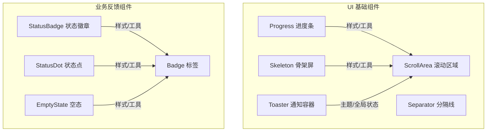
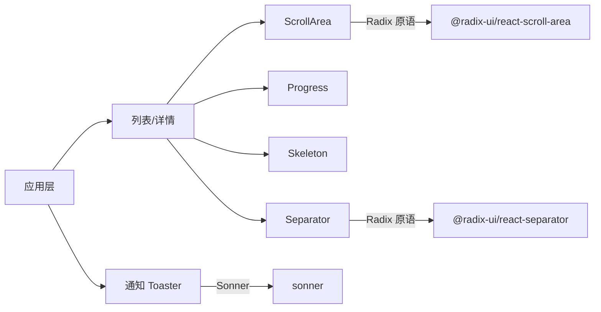
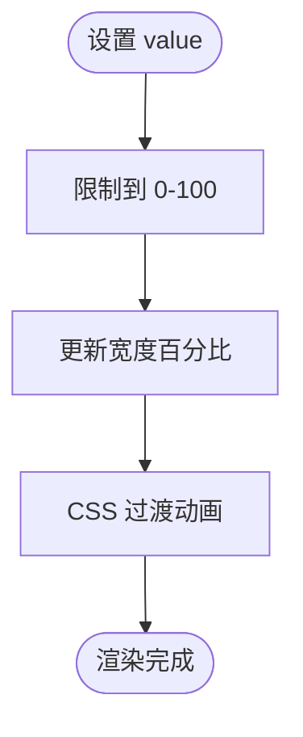
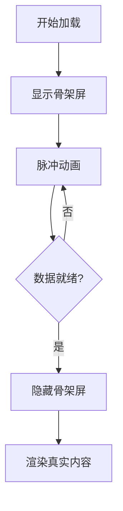
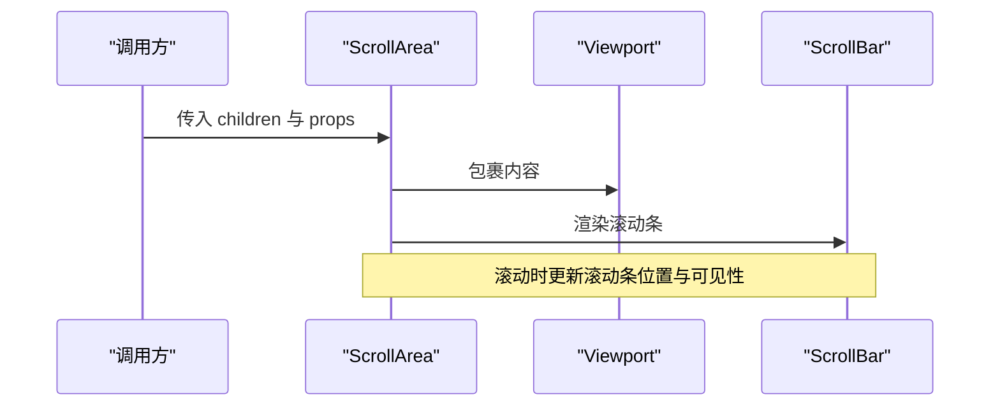
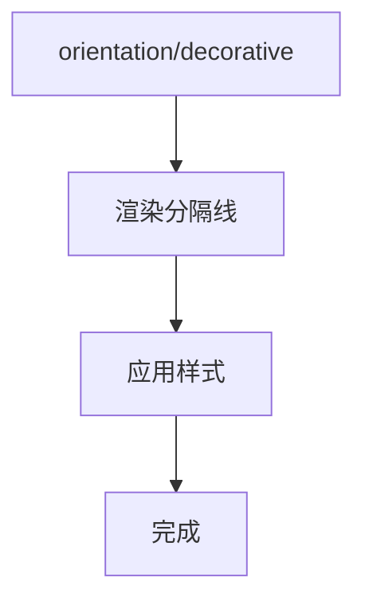
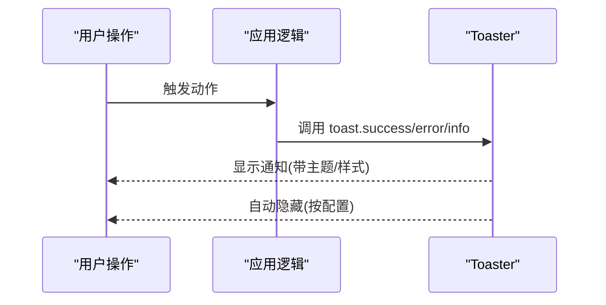
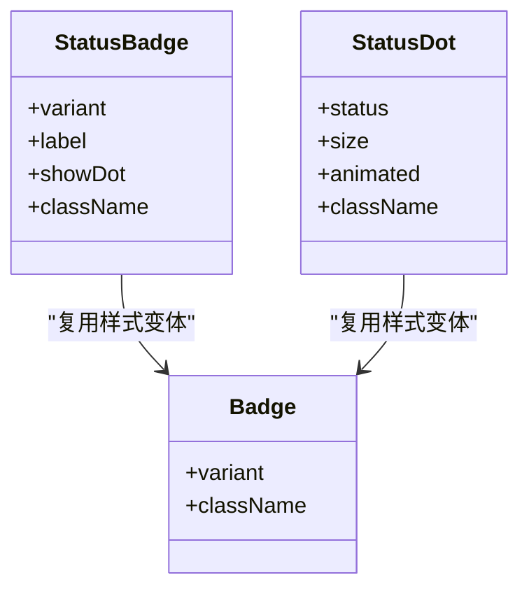
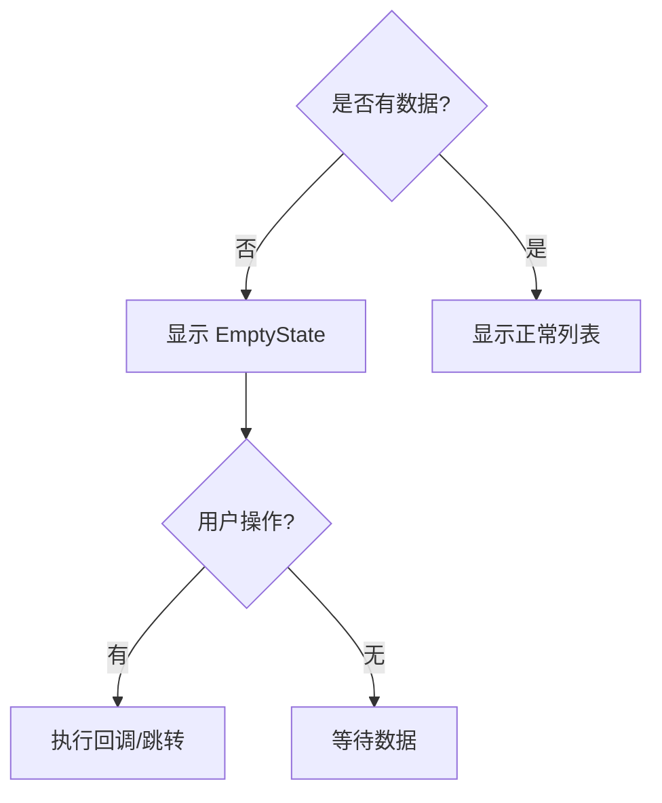
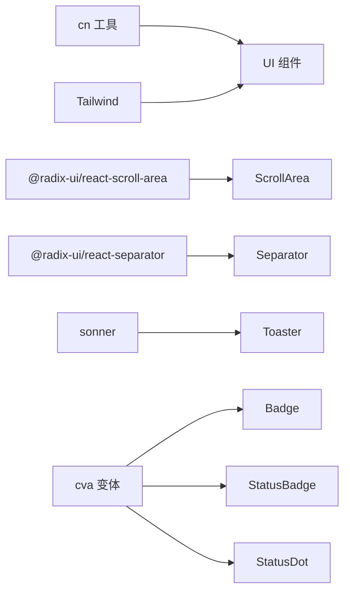

# 反馈组件

<cite>
**本文引用的文件**
- [progress.tsx](file://web/src/components/ui/progress.tsx)
- [skeleton.tsx](file://web/src/components/ui/skeleton.tsx)
- [scroll-area.tsx](file://web/src/components/ui/scroll-area.tsx)
- [separator.tsx](file://web/src/components/ui/separator.tsx)
- [sonner.tsx](file://web/src/components/ui/sonner.tsx)
- [badge.tsx](file://web/src/components/ui/badge.tsx)
- [StatusBadge.tsx](file://web/src/components/StatusBadge.tsx)
- [StatusDot.tsx](file://web/src/components/StatusDot.tsx)
- [EmptyState.tsx](file://web/src/components/EmptyState.tsx)
</cite>

## 目录
1. [简介](#简介)
2. [项目结构](#项目结构)
3. [核心组件](#核心组件)
4. [架构总览](#架构总览)
5. [详细组件分析](#详细组件分析)
6. [依赖关系分析](#依赖关系分析)
7. [性能考量](#性能考量)
8. [故障排查指南](#故障排查指南)
9. [结论](#结论)
10. [附录](#附录)

## 简介
本技术文档聚焦于 ResolveAgent Web 端的反馈组件体系，涵盖进度条、骨架屏、通知、滚动区域与分隔线等基础能力，并补充状态徽章与空态占位等辅助反馈。文档从状态指示、加载效果、动画过渡、可访问性、自动隐藏策略、用户交互响应、配置参数、样式定制与性能优化等维度进行系统化说明，帮助开发者在不同网络条件下提供稳定、一致且友好的用户体验。

## 项目结构
反馈组件位于 web/src/components/ui 目录下，采用原子化 UI 组件组织方式；业务级反馈（如状态徽章、空态）位于 web/src/components。各组件通过统一的工具函数 cn 进行类名合并，基于 Radix 原语构建可访问的滚动区域与分隔线，使用 Tailwind 完成样式与动画。

图表来源
- [progress.tsx:1-24](file://web/src/components/ui/progress.tsx#L1-L24)
- [skeleton.tsx:1-8](file://web/src/components/ui/skeleton.tsx#L1-L8)
- [scroll-area.tsx:1-39](file://web/src/components/ui/scroll-area.tsx#L1-L39)
- [separator.tsx:1-19](file://web/src/components/ui/separator.tsx#L1-L19)
- [sonner.tsx:1-28](file://web/src/components/ui/sonner.tsx#L1-L28)
- [badge.tsx:1-29](file://web/src/components/ui/badge.tsx#L1-L29)
- [StatusBadge.tsx:1-45](file://web/src/components/StatusBadge.tsx#L1-L45)
- [StatusDot.tsx:1-40](file://web/src/components/StatusDot.tsx#L1-L40)
- [EmptyState.tsx:1-38](file://web/src/components/EmptyState.tsx#L1-L38)

章节来源
- [progress.tsx:1-24](file://web/src/components/ui/progress.tsx#L1-L24)
- [skeleton.tsx:1-8](file://web/src/components/ui/skeleton.tsx#L1-L8)
- [scroll-area.tsx:1-39](file://web/src/components/ui/scroll-area.tsx#L1-L39)
- [separator.tsx:1-19](file://web/src/components/ui/separator.tsx#L1-L19)
- [sonner.tsx:1-28](file://web/src/components/ui/sonner.tsx#L1-L28)
- [badge.tsx:1-29](file://web/src/components/ui/badge.tsx#L1-L29)
- [StatusBadge.tsx:1-45](file://web/src/components/StatusBadge.tsx#L1-L45)
- [StatusDot.tsx:1-40](file://web/src/components/StatusDot.tsx#L1-L40)
- [EmptyState.tsx:1-38](file://web/src/components/EmptyState.tsx#L1-L38)

## 核心组件
- 进度条 Progress：用于展示任务或数据加载的百分比进度，支持平滑过渡与边界值保护。
- 骨架屏 Skeleton：在内容未就绪时提供占位与脉冲动画，降低感知等待时间。
- 滚动区域 ScrollArea：基于 Radix 的可访问滚动容器，提供自定义滚动条与方向控制。
- 分隔线 Separator：用于视觉分区，支持水平/垂直方向与装饰模式。
- 通知 Toaster：基于 Sonner 的全局通知容器，支持主题联动与样式覆盖。
- 状态徽章 StatusBadge / 状态点 StatusDot：表达系统/任务健康度与运行状态。
- 空态 EmptyState：无数据时的引导与操作入口。

章节来源
- [progress.tsx:1-24](file://web/src/components/ui/progress.tsx#L1-L24)
- [skeleton.tsx:1-8](file://web/src/components/ui/skeleton.tsx#L1-L8)
- [scroll-area.tsx:1-39](file://web/src/components/ui/scroll-area.tsx#L1-L39)
- [separator.tsx:1-19](file://web/src/components/ui/separator.tsx#L1-L19)
- [sonner.tsx:1-28](file://web/src/components/ui/sonner.tsx#L1-L28)
- [StatusBadge.tsx:1-45](file://web/src/components/StatusBadge.tsx#L1-L45)
- [StatusDot.tsx:1-40](file://web/src/components/StatusDot.tsx#L1-L40)
- [EmptyState.tsx:1-38](file://web/src/components/EmptyState.tsx#L1-L38)

## 架构总览
反馈组件以“原子组件 + 业务组合”的方式组织：UI 层提供通用能力，业务层组合出更丰富的反馈形态。通知通过全局主题驱动，滚动区域与分隔线借助 Radix 保证可访问性，进度条与骨架屏通过 CSS 过渡与动画提升观感。

图表来源
- [scroll-area.tsx:1-39](file://web/src/components/ui/scroll-area.tsx#L1-L39)
- [separator.tsx:1-19](file://web/src/components/ui/separator.tsx#L1-L19)
- [sonner.tsx:1-28](file://web/src/components/ui/sonner.tsx#L1-L28)

## 详细组件分析

### 进度条 Progress
- 功能特性
  - 展示 0-100 的线性进度，内部对 value 做边界保护，避免溢出。
  - 使用过渡动画实现平滑变化，提升视觉连贯性。
- 状态指示
  - value 为数值型，默认 0；外部负责计算与更新。
- 动画与过渡
  - 宽度变化配合 transition-all 与缓动曲线，时长适中，避免突兀。
- 可访问性
  - 作为语义化的容器，建议外层结合 aria 属性描述当前进度。
- 自动隐藏策略
  - 由调用方根据任务完成状态决定是否隐藏。
- 配置参数
  - value：进度百分比（0-100）。
  - className：样式覆盖。
- 样式定制
  - 通过 className 调整尺寸、圆角、背景色与前景色。
- 性能考虑
  - 高频更新时建议使用 requestAnimationFrame 或节流，减少重排。
- 使用场景
  - 长耗时任务（导入、分析、生成）的实时反馈。

图表来源
- [progress.tsx:1-24](file://web/src/components/ui/progress.tsx#L1-L24)

章节来源
- [progress.tsx:1-24](file://web/src/components/ui/progress.tsx#L1-L24)

### 骨架屏 Skeleton
- 功能特性
  - 在内容未就绪时显示占位块，配合脉冲动画模拟加载过程。
- 状态指示
  - 通过存在与否表示加载中/已加载。
- 动画与过渡
  - 使用脉冲动画营造“活跃”的加载感。
- 可访问性
  - 建议为骨架屏添加 role="progressbar" 或 aria-busy 等语义信息。
- 自动隐藏策略
  - 数据就绪后移除骨架屏，替换为真实内容。
- 配置参数
  - className：尺寸、颜色与布局覆盖。
- 样式定制
  - 通过 className 控制形状、大小与节奏。
- 性能考虑
  - 避免过多骨架屏同时闪烁；按需渲染，减少 DOM 节点数量。
- 使用场景
  - 列表项、卡片、表格行等内容的预占位。

图表来源
- [skeleton.tsx:1-8](file://web/src/components/ui/skeleton.tsx#L1-L8)

章节来源
- [skeleton.tsx:1-8](file://web/src/components/ui/skeleton.tsx#L1-L8)

### 滚动区域 ScrollArea
- 功能特性
  - 基于 Radix 的可访问滚动容器，提供视口、滚动条与角落处理。
  - 支持垂直/水平方向，滚动条样式可定制。
- 状态指示
  - 通过滚动位置与滚动条可见性反映内容溢出状态。
- 动画与过渡
  - 滚动条颜色与尺寸变化具备过渡效果。
- 可访问性
  - 遵循 Radix 的可访问性约定，键盘导航与焦点管理由底层保障。
- 自动隐藏策略
  - 当内容不溢出时，滚动条可隐藏以减少干扰。
- 配置参数
  - orientation：滚动方向（vertical/horizontal）。
  - className：容器与滚动条样式覆盖。
- 样式定制
  - 通过 className 调整滚动条宽度、圆角、边框与颜色。
- 性能考虑
  - 大量内容建议虚拟滚动；避免在滚动事件中执行高开销逻辑。
- 使用场景
  - 聊天面板、日志查看器、长列表等。

图表来源
- [scroll-area.tsx:1-39](file://web/src/components/ui/scroll-area.tsx#L1-L39)

章节来源
- [scroll-area.tsx:1-39](file://web/src/components/ui/scroll-area.tsx#L1-L39)

### 分隔线 Separator
- 功能特性
  - 用于视觉分区，支持水平/垂直方向与装饰模式。
- 状态指示
  - 通过方向与装饰属性表达用途。
- 动画与过渡
  - 静态元素，无动画。
- 可访问性
  - decorative 模式下不参与无障碍树，适合纯装饰分隔。
- 自动隐藏策略
  - 由布局决定显隐。
- 配置参数
  - orientation：horizontal/vertical。
  - decorative：是否参与无障碍树。
  - className：样式覆盖。
- 样式定制
  - 通过 className 调整粗细、颜色与间距。
- 性能考虑
  - 轻量 DOM，几乎无性能影响。
- 使用场景
  - 列表分组、卡片内部分区、表单字段间分隔。

图表来源
- [separator.tsx:1-19](file://web/src/components/ui/separator.tsx#L1-L19)

章节来源
- [separator.tsx:1-19](file://web/src/components/ui/separator.tsx#L1-L19)

### 通知 Toaster
- 功能特性
  - 基于 Sonner 的全局通知容器，支持主题联动与样式覆盖。
- 状态指示
  - 通过 toast 类型（成功、错误、警告、信息）表达结果。
- 动画与过渡
  - 入场/出场动画由库内置，体验流畅。
- 可访问性
  - 由 Sonner 提供语义与焦点管理。
- 自动隐藏策略
  - 可通过 toastOptions 配置自动消失时间与行为。
- 配置参数
  - theme：跟随应用主题。
  - toastOptions.classNames：覆盖 toast、描述、按钮等样式。
- 样式定制
  - 通过 classNames 统一风格，适配暗色/亮色主题。
- 性能考虑
  - 通知为轻量 DOM，频繁触发时注意去抖与上限控制。
- 使用场景
  - 操作反馈、错误提示、成功确认。

图表来源
- [sonner.tsx:1-28](file://web/src/components/ui/sonner.tsx#L1-L28)

章节来源
- [sonner.tsx:1-28](file://web/src/components/ui/sonner.tsx#L1-L28)

### 状态徽章 StatusBadge 与状态点 StatusDot
- 功能特性
  - 表达系统/任务的健康度与运行状态，支持多种变体与尺寸。
- 状态指示
  - healthy/degraded/failed/progressing/unknown 等状态。
- 动画与过渡
  - progressing 状态可启用脉冲动画，增强“进行中”感知。
- 可访问性
  - 建议为状态徽章添加 aria-label 描述当前状态。
- 自动隐藏策略
  - 由业务状态决定显隐。
- 配置参数
  - variant/status：状态类型。
  - size：尺寸（适用于 StatusDot）。
  - animated：是否启用脉冲（适用于 StatusDot）。
  - showDot：是否显示点（适用于 StatusBadge）。
- 样式定制
  - 通过 cva 变体与 className 覆盖颜色与排版。
- 性能考虑
  - 轻量组件，无额外性能负担。
- 使用场景
  - 服务健康监控、任务队列状态、工作流步骤状态。

图表来源
- [StatusBadge.tsx:1-45](file://web/src/components/StatusBadge.tsx#L1-L45)
- [StatusDot.tsx:1-40](file://web/src/components/StatusDot.tsx#L1-L40)
- [badge.tsx:1-29](file://web/src/components/ui/badge.tsx#L1-L29)

章节来源
- [StatusBadge.tsx:1-45](file://web/src/components/StatusBadge.tsx#L1-L45)
- [StatusDot.tsx:1-40](file://web/src/components/StatusDot.tsx#L1-L40)
- [badge.tsx:1-29](file://web/src/components/ui/badge.tsx#L1-L29)

### 空态 EmptyState
- 功能特性
  - 无数据时的引导界面，包含图标、标题、描述与可选操作。
- 状态指示
  - 通过是否存在数据驱动显隐。
- 动画与过渡
  - 静态展示，可叠加淡入动画。
- 可访问性
  - 标题与描述具备语义层级；操作按钮可聚焦。
- 自动隐藏策略
  - 数据就绪后切换为正常视图。
- 配置参数
  - icon/title/description/action：内容与行为。
  - className：样式覆盖。
- 样式定制
  - 通过 className 调整布局与配色。
- 性能考虑
  - 轻量组件，无性能问题。
- 使用场景
  - 首次使用引导、搜索无结果、列表为空。

图表来源
- [EmptyState.tsx:1-38](file://web/src/components/EmptyState.tsx#L1-L38)

章节来源
- [EmptyState.tsx:1-38](file://web/src/components/EmptyState.tsx#L1-L38)

## 依赖关系分析
- 样式与工具
  - cn：统一类名合并，确保样式优先级与冲突最小化。
  - Tailwind：提供动画与过渡（如 animate-pulse）。
- 可访问性与交互
  - @radix-ui/react-scroll-area、@radix-ui/react-separator：提供可访问的滚动与分隔能力。
  - sonner：提供通知能力与主题集成。
- 业务组合
  - StatusBadge/StatusDot 复用 badge 的变体系统，保持风格一致。

图表来源
- [scroll-area.tsx:1-39](file://web/src/components/ui/scroll-area.tsx#L1-L39)
- [separator.tsx:1-19](file://web/src/components/ui/separator.tsx#L1-L19)
- [sonner.tsx:1-28](file://web/src/components/ui/sonner.tsx#L1-L28)
- [badge.tsx:1-29](file://web/src/components/ui/badge.tsx#L1-L29)
- [StatusBadge.tsx:1-45](file://web/src/components/StatusBadge.tsx#L1-L45)
- [StatusDot.tsx:1-40](file://web/src/components/StatusDot.tsx#L1-L40)

章节来源
- [scroll-area.tsx:1-39](file://web/src/components/ui/scroll-area.tsx#L1-L39)
- [separator.tsx:1-19](file://web/src/components/ui/separator.tsx#L1-L19)
- [sonner.tsx:1-28](file://web/src/components/ui/sonner.tsx#L1-L28)
- [badge.tsx:1-29](file://web/src/components/ui/badge.tsx#L1-L29)
- [StatusBadge.tsx:1-45](file://web/src/components/StatusBadge.tsx#L1-L45)
- [StatusDot.tsx:1-40](file://web/src/components/StatusDot.tsx#L1-L40)

## 性能考量
- 进度条
  - 高频更新时使用节流或防抖，避免过度重绘。
  - 将 value 的计算与渲染分离，必要时使用 requestAnimationFrame。
- 骨架屏
  - 仅在必要区域渲染，避免整页骨架导致抖动。
  - 合理设置动画时长，避免长时间闪烁造成不适。
- 滚动区域
  - 大数据量场景引入虚拟滚动；避免在滚动事件中进行昂贵计算。
  - 滚动条样式尽量简单，减少重绘。
- 通知
  - 控制同屏通知数量，避免遮挡与性能损耗。
  - 短消息自动隐藏，长消息允许手动关闭。
- 状态徽章/点
  - 批量更新时合并状态变更，减少重渲染。
- 通用
  - 使用 CSS 过渡与动画而非 JS 动画，利用 GPU 加速。
  - 避免在关键路径创建大对象与闭包。

[本节为通用指导，不直接分析具体文件]

## 故障排查指南
- 进度条异常
  - 现象：进度不更新或超出范围。
  - 排查：检查 value 是否被正确限制在 0-100；确认父组件状态更新频率。
  - 参考：[progress.tsx:1-24](file://web/src/components/ui/progress.tsx#L1-L24)
- 骨架屏不消失
  - 现象：加载完成后仍显示骨架。
  - 排查：确认数据就绪条件与卸载逻辑；检查异步请求是否抛出异常。
  - 参考：[skeleton.tsx:1-8](file://web/src/components/ui/skeleton.tsx#L1-L8)
- 滚动区域不可用
  - 现象：无法滚动或滚动条不出现。
  - 排查：检查子内容高度是否超过容器；确认 orientation 与样式未被覆盖。
  - 参考：[scroll-area.tsx:1-39](file://web/src/components/ui/scroll-area.tsx#L1-L39)
- 分隔线错位
  - 现象：方向或尺寸不符合预期。
  - 排查：核对 orientation 与 className；确认父容器布局约束。
  - 参考：[separator.tsx:1-19](file://web/src/components/ui/separator.tsx#L1-L19)
- 通知不显示或样式错乱
  - 现象：通知未出现或主题不一致。
  - 排查：确认 Toaster 已挂载；检查 theme 与 classNames 配置。
  - 参考：[sonner.tsx:1-28](file://web/src/components/ui/sonner.tsx#L1-L28)
- 状态徽章/点状态不正确
  - 现象：状态与业务不符。
  - 排查：核对状态映射与更新时机；确认 animated 开关是否符合预期。
  - 参考：[StatusBadge.tsx:1-45](file://web/src/components/StatusBadge.tsx#L1-L45), [StatusDot.tsx:1-40](file://web/src/components/StatusDot.tsx#L1-L40)

章节来源
- [progress.tsx:1-24](file://web/src/components/ui/progress.tsx#L1-L24)
- [skeleton.tsx:1-8](file://web/src/components/ui/skeleton.tsx#L1-L8)
- [scroll-area.tsx:1-39](file://web/src/components/ui/scroll-area.tsx#L1-L39)
- [separator.tsx:1-19](file://web/src/components/ui/separator.tsx#L1-L19)
- [sonner.tsx:1-28](file://web/src/components/ui/sonner.tsx#L1-L28)
- [StatusBadge.tsx:1-45](file://web/src/components/StatusBadge.tsx#L1-L45)
- [StatusDot.tsx:1-40](file://web/src/components/StatusDot.tsx#L1-L40)

## 结论
ResolveAgent 的反馈组件体系以可访问、可定制、高性能为目标，通过原子化 UI 与业务组合满足多样化场景。进度条、骨架屏、滚动区域、分隔线与通知共同构建了完整的加载与反馈闭环；状态徽章与空态进一步丰富了状态表达与引导体验。建议在复杂网络环境下结合延迟降级、骨架优先、增量渲染与智能通知策略，持续提升用户感知与系统稳定性。

[本节为总结性内容，不直接分析具体文件]

## 附录
- 配置参数速览
  - Progress：value、className
  - Skeleton：className
  - ScrollArea：orientation、className
  - Separator：orientation、decorative、className
  - Toaster：theme、toastOptions.classNames
  - StatusBadge：variant、label、showDot、className
  - StatusDot：status、size、animated、className
  - EmptyState：icon、title、description、action、className
- 最佳实践
  - 使用骨架屏先行，数据到达后无缝替换。
  - 进度条与通知配合，提供明确的任务反馈。
  - 滚动区域承载长内容，避免主线程阻塞。
  - 状态徽章/点集中管理状态映射，便于统一维护。
  - 空态提供清晰的操作指引，提升转化率。

[本节为补充信息，不直接分析具体文件]