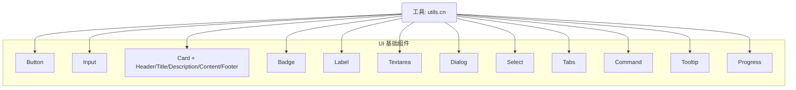
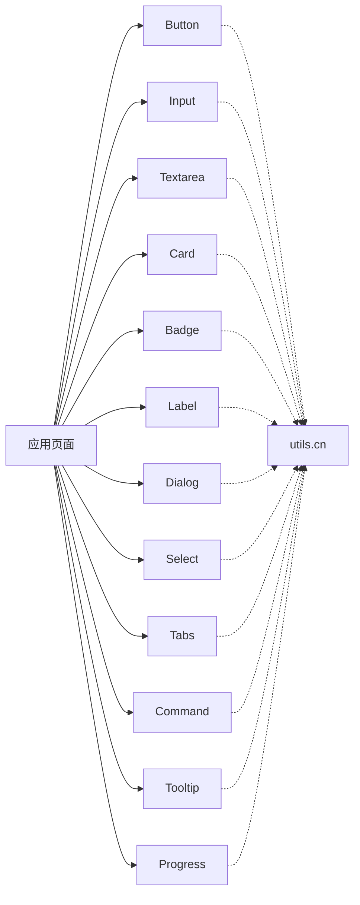
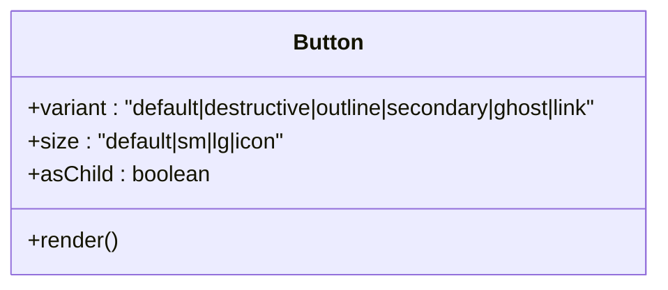
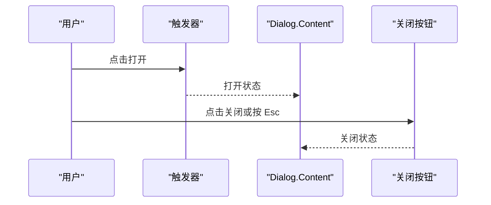
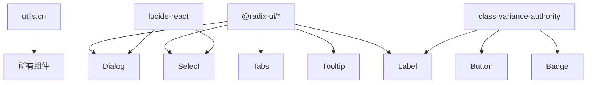

# 基础组件

<cite>
**本文引用的文件**
- [button.tsx](file://web/src/components/ui/button.tsx)
- [input.tsx](file://web/src/components/ui/input.tsx)
- [card.tsx](file://web/src/components/ui/card.tsx)
- [badge.tsx](file://web/src/components/ui/badge.tsx)
- [label.tsx](file://web/src/components/ui/label.tsx)
- [textarea.tsx](file://web/src/components/ui/textarea.tsx)
- [dialog.tsx](file://web/src/components/ui/dialog.tsx)
- [select.tsx](file://web/src/components/ui/select.tsx)
- [tabs.tsx](file://web/src/components/ui/tabs.tsx)
- [command.tsx](file://web/src/components/ui/command.tsx)
- [tooltip.tsx](file://web/src/components/ui/tooltip.tsx)
- [progress.tsx](file://web/src/components/ui/progress.tsx)
- [utils.ts](file://web/src/lib/utils.ts)
</cite>

## 目录
1. [简介](#简介)
2. [项目结构](#项目结构)
3. [核心组件](#核心组件)
4. [架构总览](#架构总览)
5. [详细组件分析](#详细组件分析)
6. [依赖关系分析](#依赖关系分析)
7. [性能考量](#性能考量)
8. [故障排查指南](#故障排查指南)
9. [结论](#结论)
10. [附录](#附录)

## 简介
本章节面向 ResolveAgent Web 前端的基础 UI 组件库，聚焦按钮、输入框、卡片、徽章、标签、文本域等常用原子组件。文档从设计理念、属性接口、变体样式、尺寸规格、状态管理、可访问性（键盘导航与屏幕阅读器）、样式定制方法、最佳实践以及组合使用场景等方面进行全面说明，帮助开发者快速、正确地使用并扩展这些组件。

## 项目结构
基础组件位于 web/src/components/ui 目录下，采用“按功能拆分”的组织方式：每个组件一个独立文件，并通过统一的工具函数 cn 进行类名合并；样式基于 Tailwind CSS 与 class-variance-authority（cva）实现变体与尺寸控制；可访问性与交互行为大量复用 Radix UI 的无样式基础组件，确保跨浏览器一致性和无障碍支持。

图表来源
- [utils.ts:4-6](file://web/src/lib/utils.ts#L4-L6)
- [button.tsx:6-30](file://web/src/components/ui/button.tsx#L6-L30)
- [input.tsx:4-17](file://web/src/components/ui/input.tsx#L4-L17)
- [card.tsx:4-44](file://web/src/components/ui/card.tsx#L4-L44)
- [badge.tsx:5-20](file://web/src/components/ui/badge.tsx#L5-L20)
- [label.tsx:6-13](file://web/src/components/ui/label.tsx#L6-L13)
- [textarea.tsx:4-17](file://web/src/components/ui/textarea.tsx#L4-L17)
- [dialog.tsx:6-48](file://web/src/components/ui/dialog.tsx#L6-L48)
- [select.tsx:6-84](file://web/src/components/ui/select.tsx#L6-L84)
- [tabs.tsx:5-50](file://web/src/components/ui/tabs.tsx#L5-L50)
- [command.tsx:8-33](file://web/src/components/ui/command.tsx#L8-L33)
- [tooltip.tsx:5-23](file://web/src/components/ui/tooltip.tsx#L5-L23)
- [progress.tsx:8-21](file://web/src/components/ui/progress.tsx#L8-L21)

章节来源
- [utils.ts:1-7](file://web/src/lib/utils.ts#L1-L7)
- [button.tsx:1-47](file://web/src/components/ui/button.tsx#L1-L47)
- [input.tsx:1-22](file://web/src/components/ui/input.tsx#L1-L22)
- [card.tsx:1-45](file://web/src/components/ui/card.tsx#L1-L45)
- [badge.tsx:1-29](file://web/src/components/ui/badge.tsx#L1-L29)
- [label.tsx:1-17](file://web/src/components/ui/label.tsx#L1-L17)
- [textarea.tsx:1-21](file://web/src/components/ui/textarea.tsx#L1-L21)
- [dialog.tsx:1-92](file://web/src/components/ui/dialog.tsx#L1-L92)
- [select.tsx:1-136](file://web/src/components/ui/select.tsx#L1-L136)
- [tabs.tsx:1-53](file://web/src/components/ui/tabs.tsx#L1-L53)
- [command.tsx:1-125](file://web/src/components/ui/command.tsx#L1-L125)
- [tooltip.tsx:1-26](file://web/src/components/ui/tooltip.tsx#L1-L26)
- [progress.tsx:1-25](file://web/src/components/ui/progress.tsx#L1-L25)

## 核心组件
本节概述各基础组件的职责、属性接口、变体与尺寸、状态管理与可访问性要点。

- 按钮 Button
  - 职责：提供可点击操作入口，支持多种视觉变体与尺寸。
  - 属性接口：支持标准 HTML button 属性；通过 variant 控制样式变体（如默认、破坏性、轮廓、次要、幽灵、链接），size 控制尺寸（默认、小、大、图标）。
  - 状态管理：内置 disabled 禁用态；focus-visible 焦点环；hover 悬停态。
  - 可访问性：原生 <button>，天然支持键盘 Enter/Space 触发；可通过 asChild 透传为其他元素以嵌入复杂结构。
  - 参考路径
    - [button.tsx:6-30](file://web/src/components/ui/button.tsx#L6-L30)
    - [button.tsx:32-46](file://web/src/components/ui/button.tsx#L32-L46)

- 输入框 Input
  - 职责：单行文本输入控件。
  - 属性接口：支持标准 input 属性（type、placeholder、disabled 等）。
  - 状态管理：focus-visible 焦点环；disabled 禁用态；占位符颜色与边框过渡。
  - 可访问性：原生 <input>，具备语义与键盘行为；可与 Label 关联。
  - 参考路径
    - [input.tsx:4-17](file://web/src/components/ui/input.tsx#L4-L17)

- 卡片 Card（含 Header/Title/Description/Content/Footer）
  - 职责：内容容器，用于聚合标题、描述、内容与操作区。
  - 属性接口：各子区域均接受标准 HTML 属性；通过 className 自定义样式。
  - 状态管理：无内部状态，纯展示容器。
  - 可访问性：语义化标签（h3 作为标题），适合屏幕阅读器阅读顺序。
  - 参考路径
    - [card.tsx:4-44](file://web/src/components/ui/card.tsx#L4-L44)

- 徽章 Badge
  - 职责：轻量状态或分类标识。
  - 属性接口：variant 控制样式（默认、次要、破坏性、轮廓）。
  - 状态管理：无内部状态。
  - 可访问性：可作为信息提示，必要时配合 aria-label。
  - 参考路径
    - [badge.tsx:5-20](file://web/src/components/ui/badge.tsx#L5-L20)
    - [badge.tsx:22-28](file://web/src/components/ui/badge.tsx#L22-L28)

- 标签 Label
  - 职责：表单控件的可读标签，提升可访问性。
  - 属性接口：基于 Radix Label 封装，支持所有根级属性。
  - 状态管理：禁用态样式联动。
  - 可访问性：与表单控件关联后，屏幕阅读器会朗读标签。
  - 参考路径
    - [label.tsx:6-13](file://web/src/components/ui/label.tsx#L6-L13)

- 文本域 Textarea
  - 职责：多行文本输入控件。
  - 属性接口：支持标准 textarea 属性。
  - 状态管理：focus-visible 焦点环；disabled 禁用态；可垂直调整大小。
  - 可访问性：原生 <textarea>，具备完整键盘与屏幕阅读器支持。
  - 参考路径
    - [textarea.tsx:4-17](file://web/src/components/ui/textarea.tsx#L4-L17)

- 对话框 Dialog
  - 职责：模态弹窗，承载重要操作或信息确认。
  - 属性接口：包含 Root、Trigger、Portal、Overlay、Close、Content、Header、Footer、Title、Description 等子组件。
  - 状态管理：open/closed 状态由 Radix 管理；关闭按钮具备 sr-only 文案。
  - 可访问性：自动焦点陷阱、Esc 关闭、ARIA 属性完善。
  - 参考路径
    - [dialog.tsx:6-48](file://web/src/components/ui/dialog.tsx#L6-L48)
    - [dialog.tsx:50-78](file://web/src/components/ui/dialog.tsx#L50-L78)

- 选择器 Select
  - 职责：下拉选择控件，支持分组、分隔符、滚动按钮。
  - 属性接口：Root、Group、Value、Trigger、Content、Label、Item、Separator、ScrollUp/DownButton。
  - 状态管理：选中项高亮；禁用态；弹出层动画。
  - 可访问性：Radix Select 提供键盘导航与 ARIA 支持。
  - 参考路径
    - [select.tsx:6-84](file://web/src/components/ui/select.tsx#L6-L84)
    - [select.tsx:86-122](file://web/src/components/ui/select.tsx#L86-L122)

- 选项卡 Tabs
  - 职责：在同一视图中切换不同内容面板。
  - 属性接口：Root、List、Trigger、Content。
  - 状态管理：active 态高亮；禁用态；焦点环。
  - 可访问性：Radix Tabs 提供键盘切换与 ARIA 角色。
  - 参考路径
    - [tabs.tsx:5-50](file://web/src/components/ui/tabs.tsx#L5-L50)

- 命令面板 Command
  - 职责：提供搜索与快速命令执行的面板，常与 Dialog 组合。
  - 属性接口：Root、Dialog、Input、List、Empty、Group、Separator、Item、Shortcut。
  - 状态管理：列表滚动、空状态、选中态。
  - 可访问性：结合 Dialog 的无障碍能力；输入框与列表项具备键盘导航。
  - 参考路径
    - [command.tsx:8-33](file://web/src/components/ui/command.tsx#L8-L33)
    - [command.tsx:35-124](file://web/src/components/ui/command.tsx#L35-L124)

- 提示 Tooltip
  - 职责：悬浮提示，补充上下文信息。
  - 属性接口：Provider、Root、Trigger、Content。
  - 状态管理：显示/隐藏动画；侧边偏移。
  - 可访问性：Radix Tooltip 提供键盘与屏幕阅读器支持。
  - 参考路径
    - [tooltip.tsx:5-23](file://web/src/components/ui/tooltip.tsx#L5-L23)

- 进度条 Progress
  - 职责：展示任务完成度。
  - 属性接口：value（0-100）。
  - 状态管理：根据 value 动态宽度；边界值保护。
  - 可访问性：建议配合 aria-valuenow、aria-valuemin、aria-valuemax 增强可读性。
  - 参考路径
    - [progress.tsx:4-21](file://web/src/components/ui/progress.tsx#L4-L21)

章节来源
- [button.tsx:1-47](file://web/src/components/ui/button.tsx#L1-L47)
- [input.tsx:1-22](file://web/src/components/ui/input.tsx#L1-L22)
- [card.tsx:1-45](file://web/src/components/ui/card.tsx#L1-L45)
- [badge.tsx:1-29](file://web/src/components/ui/badge.tsx#L1-L29)
- [label.tsx:1-17](file://web/src/components/ui/label.tsx#L1-L17)
- [textarea.tsx:1-21](file://web/src/components/ui/textarea.tsx#L1-L21)
- [dialog.tsx:1-92](file://web/src/components/ui/dialog.tsx#L1-L92)
- [select.tsx:1-136](file://web/src/components/ui/select.tsx#L1-L136)
- [tabs.tsx:1-53](file://web/src/components/ui/tabs.tsx#L1-L53)
- [command.tsx:1-125](file://web/src/components/ui/command.tsx#L1-L125)
- [tooltip.tsx:1-26](file://web/src/components/ui/tooltip.tsx#L1-L26)
- [progress.tsx:1-25](file://web/src/components/ui/progress.tsx#L1-L25)

## 架构总览
基础组件统一遵循以下设计原则：
- 样式系统：Tailwind CSS + class-variance-authority（cva）定义变体与尺寸；cn 工具函数合并类名避免冲突。
- 可访问性：优先使用 Radix UI 的无样式基础组件，保证键盘导航、焦点管理、ARIA 语义与屏幕阅读器兼容。
- 组合模式：将复杂交互拆分为多个小组件（如 Dialog 的 Content/Header/Footer），便于复用与组合。
- 主题适配：通过 CSS 变量（如 background、primary、ring 等）与 Tailwind 配置实现全局主题一致性。

图表来源
- [utils.ts:4-6](file://web/src/lib/utils.ts#L4-L6)
- [button.tsx:6-30](file://web/src/components/ui/button.tsx#L6-L30)
- [input.tsx:4-17](file://web/src/components/ui/input.tsx#L4-L17)
- [textarea.tsx:4-17](file://web/src/components/ui/textarea.tsx#L4-L17)
- [card.tsx:4-44](file://web/src/components/ui/card.tsx#L4-L44)
- [badge.tsx:5-20](file://web/src/components/ui/badge.tsx#L5-L20)
- [label.tsx:6-13](file://web/src/components/ui/label.tsx#L6-L13)
- [dialog.tsx:6-48](file://web/src/components/ui/dialog.tsx#L6-L48)
- [select.tsx:6-84](file://web/src/components/ui/select.tsx#L6-L84)
- [tabs.tsx:5-50](file://web/src/components/ui/tabs.tsx#L5-L50)
- [command.tsx:8-33](file://web/src/components/ui/command.tsx#L8-L33)
- [tooltip.tsx:5-23](file://web/src/components/ui/tooltip.tsx#L5-L23)
- [progress.tsx:8-21](file://web/src/components/ui/progress.tsx#L8-L21)

## 详细组件分析

### 按钮 Button
- 设计理念：以 cva 集中管理变体与尺寸，保持样式一致性与可扩展性。
- 属性接口：
  - variant：default、destructive、outline、secondary、ghost、link
  - size：default、sm、lg、icon
  - asChild：是否将渲染节点替换为 Slot（用于嵌套复杂元素）
- 状态管理：
  - disabled：禁用态（pointer-events-none、opacity 降低）
  - focus-visible：焦点环（ring-ring、ring-offset）
  - hover：背景色变化
- 可访问性：
  - 原生 <button>，支持键盘 Enter/Space
  - 通过 asChild 时注意保留语义与事件绑定
- 使用示例（路径）
  - [button.tsx:32-46](file://web/src/components/ui/button.tsx#L32-L46)
- 样式定制
  - 通过 className 追加 Tailwind 类覆盖默认样式
  - 通过 cva 新增 variant/size 扩展
- 最佳实践
  - 在需要语义化的场景中优先使用 asChild 包裹锚点或路由组件
  - 对图标按钮使用 icon 尺寸，确保触控目标大小

图表来源
- [button.tsx:6-30](file://web/src/components/ui/button.tsx#L6-L30)
- [button.tsx:32-46](file://web/src/components/ui/button.tsx#L32-L46)

章节来源
- [button.tsx:1-47](file://web/src/components/ui/button.tsx#L1-L47)

### 输入框 Input
- 设计理念：简洁的单行输入控件，强调可访问性与一致的视觉反馈。
- 属性接口：继承标准 input 属性（type、placeholder、disabled、required 等）。
- 状态管理：
  - focus-visible：焦点环
  - disabled：禁用态
  - placeholder：占位符样式
- 可访问性：
  - 与 Label 关联时，屏幕阅读器会朗读标签
- 使用示例（路径）
  - [input.tsx:4-17](file://web/src/components/ui/input.tsx#L4-L17)
- 样式定制
  - 通过 className 覆盖边框、圆角、阴影等
- 最佳实践
  - 始终为输入框提供可见或可被屏幕阅读器识别的标签
  - 对必填字段添加 required 与错误提示

章节来源
- [input.tsx:1-22](file://web/src/components/ui/input.tsx#L1-L22)

### 卡片 Card
- 设计理念：结构化内容容器，划分头部、标题、描述、内容与页脚，便于组织信息层次。
- 属性接口：各子组件均接受标准 HTML 属性；通过 className 定制布局与样式。
- 状态管理：无内部状态。
- 可访问性：
  - 标题使用 h3，符合语义层级
  - 内容顺序合理，利于屏幕阅读器阅读
- 使用示例（路径）
  - [card.tsx:4-44](file://web/src/components/ui/card.tsx#L4-L44)
- 样式定制
  - 通过 Tailwind 控制间距、边框、背景色等
- 最佳实践
  - 将相关操作放入 Footer，保持内容区专注展示
  - 标题与描述保持简洁，避免过长文本影响布局

章节来源
- [card.tsx:1-45](file://web/src/components/ui/card.tsx#L1-L45)

### 徽章 Badge
- 设计理念：轻量状态标识，常用于标签、计数、状态指示。
- 属性接口：variant（default、secondary、destructive、outline）。
- 状态管理：无内部状态。
- 可访问性：
  - 必要时添加 aria-label 或 role 以增强语义
- 使用示例（路径）
  - [badge.tsx:5-20](file://web/src/components/ui/badge.tsx#L5-L20)
  - [badge.tsx:22-28](file://web/src/components/ui/badge.tsx#L22-L28)
- 样式定制
  - 通过 className 覆盖背景、边框、字号等
- 最佳实践
  - 使用 destructive 表示错误或危险状态
  - 避免过多徽章造成视觉噪音

章节来源
- [badge.tsx:1-29](file://web/src/components/ui/badge.tsx#L1-L29)

### 标签 Label
- 设计理念：为表单控件提供可读标签，提升可访问性。
- 属性接口：基于 Radix Label，支持所有根级属性。
- 状态管理：禁用态样式联动。
- 可访问性：
  - 与表单控件关联后，屏幕阅读器会朗读标签
- 使用示例（路径）
  - [label.tsx:6-13](file://web/src/components/ui/label.tsx#L6-L13)
- 样式定制
  - 通过 className 控制字体、颜色、间距
- 最佳实践
  - 为每个输入控件提供唯一且明确的标签
  - 避免仅用 placeholder 替代标签

章节来源
- [label.tsx:1-17](file://web/src/components/ui/label.tsx#L1-L17)

### 文本域 Textarea
- 设计理念：多行文本输入，支持垂直调整大小与一致的视觉反馈。
- 属性接口：继承标准 textarea 属性。
- 状态管理：
  - focus-visible：焦点环
  - disabled：禁用态
  - resize-y：允许垂直调整大小
- 可访问性：
  - 原生 <textarea>，具备完整键盘与屏幕阅读器支持
- 使用示例（路径）
  - [textarea.tsx:4-17](file://web/src/components/ui/textarea.tsx#L4-L17)
- 样式定制
  - 通过 className 控制最小高度、边框、圆角等
- 最佳实践
  - 设置合理的 min-h 与 max-h，避免过大占用空间
  - 对长文本提供字符计数与错误提示

章节来源
- [textarea.tsx:1-21](file://web/src/components/ui/textarea.tsx#L1-L21)

### 对话框 Dialog
- 设计理念：模态弹窗，承载重要操作或信息确认，具备完善的焦点管理与动画。
- 属性接口：Root、Trigger、Portal、Overlay、Close、Content、Header、Footer、Title、Description。
- 状态管理：
  - open/closed：由 Radix 管理
  - 关闭按钮：sr-only 文案，确保屏幕阅读器可读
- 可访问性：
  - 自动焦点陷阱、Esc 关闭、ARIA 属性完善
- 使用示例（路径）
  - [dialog.tsx:6-48](file://web/src/components/ui/dialog.tsx#L6-L48)
  - [dialog.tsx:50-78](file://web/src/components/ui/dialog.tsx#L50-L78)
- 样式定制
  - 通过 className 控制尺寸、圆角、阴影、动画
- 最佳实践
  - 将重要操作集中在 Footer，避免分散注意力
  - 使用 Title 与 Description 明确弹窗目的

图表来源
- [dialog.tsx:6-48](file://web/src/components/ui/dialog.tsx#L6-L48)
- [dialog.tsx:50-78](file://web/src/components/ui/dialog.tsx#L50-L78)

章节来源
- [dialog.tsx:1-92](file://web/src/components/ui/dialog.tsx#L1-L92)

### 选择器 Select
- 设计理念：下拉选择控件，支持分组、分隔符与滚动按钮，具备完整的键盘导航。
- 属性接口：Root、Group、Value、Trigger、Content、Label、Item、Separator、ScrollUp/DownButton。
- 状态管理：
  - 选中项高亮、禁用态、弹出层动画
- 可访问性：
  - Radix Select 提供键盘导航与 ARIA 支持
- 使用示例（路径）
  - [select.tsx:6-84](file://web/src/components/ui/select.tsx#L6-L84)
  - [select.tsx:86-122](file://web/src/components/ui/select.tsx#L86-L122)
- 样式定制
  - 通过 className 控制触发器、内容、选项样式
- 最佳实践
  - 为长列表提供分组与分隔符，提升可读性
  - 为不可用选项设置 disabled

章节来源
- [select.tsx:1-136](file://web/src/components/ui/select.tsx#L1-L136)

### 选项卡 Tabs
- 设计理念：在同一视图中切换不同内容面板，提供清晰的导航结构。
- 属性接口：Root、List、Trigger、Content。
- 状态管理：
  - active 态高亮、禁用态、焦点环
- 可访问性：
  - Radix Tabs 提供键盘切换与 ARIA 角色
- 使用示例（路径）
  - [tabs.tsx:5-50](file://web/src/components/ui/tabs.tsx#L5-L50)
- 样式定制
  - 通过 className 控制激活态背景、阴影、圆角
- 最佳实践
  - 每个 Tab 对应独立的内容面板，避免内容重叠
  - 为禁用态提供明确提示

章节来源
- [tabs.tsx:1-53](file://web/src/components/ui/tabs.tsx#L1-L53)

### 命令面板 Command
- 设计理念：提供搜索与快速命令执行的面板，常与 Dialog 组合，提升效率。
- 属性接口：Root、Dialog、Input、List、Empty、Group、Separator、Item、Shortcut。
- 状态管理：
  - 列表滚动、空状态、选中态
- 可访问性：
  - 结合 Dialog 的无障碍能力；输入框与列表项具备键盘导航
- 使用示例（路径）
  - [command.tsx:8-33](file://web/src/components/ui/command.tsx#L8-L33)
  - [command.tsx:35-124](file://web/src/components/ui/command.tsx#L35-L124)
- 样式定制
  - 通过 className 控制分组标题、项高亮、快捷键样式
- 最佳实践
  - 为常用命令提供快捷键提示
  - 为空结果提供友好提示

章节来源
- [command.tsx:1-125](file://web/src/components/ui/command.tsx#L1-L125)

### 提示 Tooltip
- 设计理念：悬浮提示，补充上下文信息，不干扰主流程。
- 属性接口：Provider、Root、Trigger、Content。
- 状态管理：
  - 显示/隐藏动画；侧边偏移
- 可访问性：
  - Radix Tooltip 提供键盘与屏幕阅读器支持
- 使用示例（路径）
  - [tooltip.tsx:5-23](file://web/src/components/ui/tooltip.tsx#L5-L23)
- 样式定制
  - 通过 className 控制背景、圆角、阴影、动画
- 最佳实践
  - 避免在 Tooltip 中放置复杂交互
  - 为图标按钮提供 Tooltip 说明其作用

章节来源
- [tooltip.tsx:1-26](file://web/src/components/ui/tooltip.tsx#L1-L26)

### 进度条 Progress
- 设计理念：直观展示任务完成度，支持边界值保护。
- 属性接口：value（0-100）。
- 状态管理：
  - 根据 value 动态宽度；边界值保护（Math.min/Math.max）
- 可访问性：
  - 建议配合 aria-valuenow、aria-valuemin、aria-valuemax 增强可读性
- 使用示例（路径）
  - [progress.tsx:4-21](file://web/src/components/ui/progress.tsx#L4-L21)
- 样式定制
  - 通过 className 控制轨道与进度条样式
- 最佳实践
  - 对于不确定进度的任务，可使用 indeterminate 样式（需自行扩展）
  - 为屏幕阅读器提供数值描述

章节来源
- [progress.tsx:1-25](file://web/src/components/ui/progress.tsx#L1-L25)

## 依赖关系分析
- 样式工具：
  - cn 工具函数基于 clsx 与 tailwind-merge，负责类名合并与冲突解决。
- 交互与可访问性：
  - 大量组件基于 @radix-ui/react-* 系列，提供稳定的无障碍能力与键盘导航。
- 图标与视觉：
  - 使用 lucide-react 提供统一风格的图标。
- 变体与尺寸：
  - 使用 class-variance-authority（cva）集中管理变体与尺寸，便于扩展与维护。

图表来源
- [utils.ts:4-6](file://web/src/lib/utils.ts#L4-L6)
- [dialog.tsx:1-92](file://web/src/components/ui/dialog.tsx#L1-L92)
- [select.tsx:1-136](file://web/src/components/ui/select.tsx#L1-L136)
- [tabs.tsx:1-53](file://web/src/components/ui/tabs.tsx#L1-L53)
- [tooltip.tsx:1-26](file://web/src/components/ui/tooltip.tsx#L1-L26)
- [label.tsx:1-17](file://web/src/components/ui/label.tsx#L1-L17)
- [button.tsx:1-47](file://web/src/components/ui/button.tsx#L1-L47)
- [badge.tsx:1-29](file://web/src/components/ui/badge.tsx#L1-L29)

章节来源
- [utils.ts:1-7](file://web/src/lib/utils.ts#L1-L7)
- [button.tsx:1-47](file://web/src/components/ui/button.tsx#L1-L47)
- [badge.tsx:1-29](file://web/src/components/ui/badge.tsx#L1-L29)
- [label.tsx:1-17](file://web/src/components/ui/label.tsx#L1-L17)
- [dialog.tsx:1-92](file://web/src/components/ui/dialog.tsx#L1-L92)
- [select.tsx:1-136](file://web/src/components/ui/select.tsx#L1-L136)
- [tabs.tsx:1-53](file://web/src/components/ui/tabs.tsx#L1-L53)
- [tooltip.tsx:1-26](file://web/src/components/ui/tooltip.tsx#L1-L26)

## 性能考量
- 类名合并：使用 cn 工具函数减少重复与冲突，避免不必要的重排。
- 动画与过渡：合理使用 data-[state] 驱动的动画，避免过度动画导致卡顿。
- 列表渲染：在 Select、Command 等长列表中，注意虚拟化或分页以减少 DOM 节点数量。
- 事件处理：避免在高频事件中执行昂贵计算，必要时使用防抖/节流。
- 主题变量：通过 CSS 变量统一管理颜色与尺寸，减少运行时样式计算开销。

[本节为通用性能指导，不直接分析具体文件]

## 故障排查指南
- 焦点环不可见
  - 检查是否移除了 focus-visible 样式；确保未覆盖 ring 相关类。
  - 参考路径：[button.tsx:6-30](file://web/src/components/ui/button.tsx#L6-L30)、[input.tsx:4-17](file://web/src/components/ui/input.tsx#L4-L17)
- 禁用态无效
  - 确认 disabled 属性正确传递；检查是否被外层样式覆盖。
  - 参考路径：[button.tsx:6-30](file://web/src/components/ui/button.tsx#L6-L30)、[input.tsx:4-17](file://web/src/components/ui/input.tsx#L4-L17)
- 对话框无法关闭
  - 检查是否覆盖了 Radix 的关闭逻辑；确认 Close 按钮未被阻止冒泡。
  - 参考路径：[dialog.tsx:6-48](file://web/src/components/ui/dialog.tsx#L6-L48)
- 选择器选项不可选
  - 检查选项是否设置了 disabled；确认 Value 与 Item 的 key 唯一。
  - 参考路径：[select.tsx:86-122](file://web/src/components/ui/select.tsx#L86-L122)
- 进度条超出范围
  - 确保 value 在 0-100 之间；组件已做边界保护，但仍建议在业务层校验。
  - 参考路径：[progress.tsx:4-21](file://web/src/components/ui/progress.tsx#L4-L21)

章节来源
- [button.tsx:6-30](file://web/src/components/ui/button.tsx#L6-L30)
- [input.tsx:4-17](file://web/src/components/ui/input.tsx#L4-L17)
- [dialog.tsx:6-48](file://web/src/components/ui/dialog.tsx#L6-L48)
- [select.tsx:86-122](file://web/src/components/ui/select.tsx#L86-L122)
- [progress.tsx:4-21](file://web/src/components/ui/progress.tsx#L4-L21)

## 结论
ResolveAgent 基础 UI 组件库以 Radix UI 为核心保障可访问性与交互一致性，通过 Tailwind CSS 与 cva 实现灵活的样式变体与尺寸控制。组件设计遵循组合模式与语义化原则，便于在不同业务场景中复用与扩展。建议在实际使用中：
- 优先使用原生语义与 Radix 提供的无障碍能力
- 通过 className 与 cva 扩展样式，避免内联样式污染
- 为关键交互提供键盘导航与屏幕阅读器支持
- 在复杂组合中保持焦点管理与状态同步

[本节为总结性内容，不直接分析具体文件]

## 附录
- 组件组合使用示例（路径）
  - 对话框 + 按钮 + 输入框：用于确认与数据收集
    - [dialog.tsx:6-48](file://web/src/components/ui/dialog.tsx#L6-L48)
    - [button.tsx:32-46](file://web/src/components/ui/button.tsx#L32-L46)
    - [input.tsx:4-17](file://web/src/components/ui/input.tsx#L4-L17)
  - 卡片 + 徽章 + 按钮：用于信息展示与操作
    - [card.tsx:4-44](file://web/src/components/ui/card.tsx#L4-L44)
    - [badge.tsx:5-20](file://web/src/components/ui/badge.tsx#L5-L20)
    - [button.tsx:6-30](file://web/src/components/ui/button.tsx#L6-L30)
  - 选择器 + 标签 + 文本域：用于表单填写
    - [select.tsx:6-84](file://web/src/components/ui/select.tsx#L6-L84)
    - [label.tsx:6-13](file://web/src/components/ui/label.tsx#L6-L13)
    - [textarea.tsx:4-17](file://web/src/components/ui/textarea.tsx#L4-L17)
  - 选项卡 + 进度条：用于分步任务展示
    - [tabs.tsx:5-50](file://web/src/components/ui/tabs.tsx#L5-L50)
    - [progress.tsx:4-21](file://web/src/components/ui/progress.tsx#L4-L21)
  - 命令面板 + 输入框：用于快速搜索与执行
    - [command.tsx:8-33](file://web/src/components/ui/command.tsx#L8-L33)
    - [command.tsx:35-124](file://web/src/components/ui/command.tsx#L35-L124)

章节来源
- [dialog.tsx:6-48](file://web/src/components/ui/dialog.tsx#L6-L48)
- [button.tsx:6-30](file://web/src/components/ui/button.tsx#L6-L30)
- [input.tsx:4-17](file://web/src/components/ui/input.tsx#L4-L17)
- [card.tsx:4-44](file://web/src/components/ui/card.tsx#L4-L44)
- [badge.tsx:5-20](file://web/src/components/ui/badge.tsx#L5-L20)
- [select.tsx:6-84](file://web/src/components/ui/select.tsx#L6-L84)
- [label.tsx:6-13](file://web/src/components/ui/label.tsx#L6-L13)
- [textarea.tsx:4-17](file://web/src/components/ui/textarea.tsx#L4-L17)
- [tabs.tsx:5-50](file://web/src/components/ui/tabs.tsx#L5-L50)
- [progress.tsx:4-21](file://web/src/components/ui/progress.tsx#L4-L21)
- [command.tsx:8-33](file://web/src/components/ui/command.tsx#L8-L33)
- [command.tsx:35-124](file://web/src/components/ui/command.tsx#L35-L124)