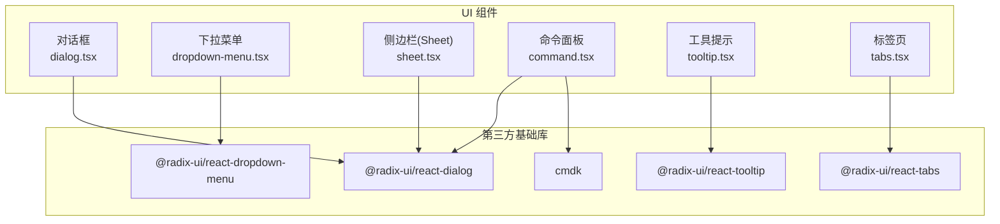
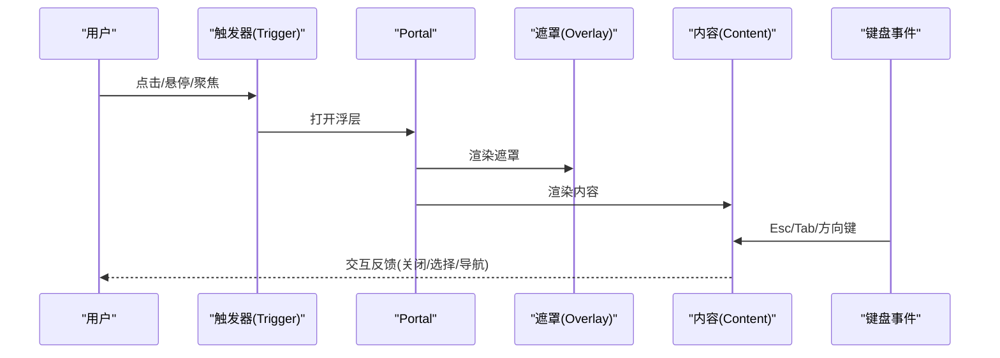
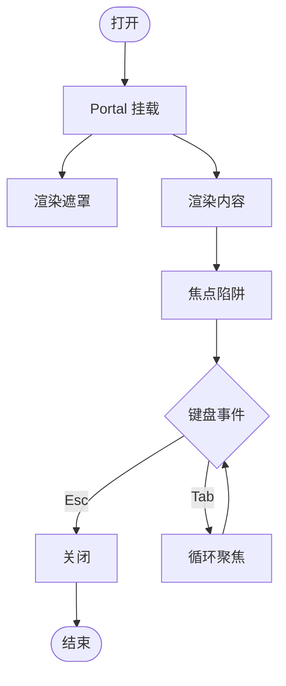
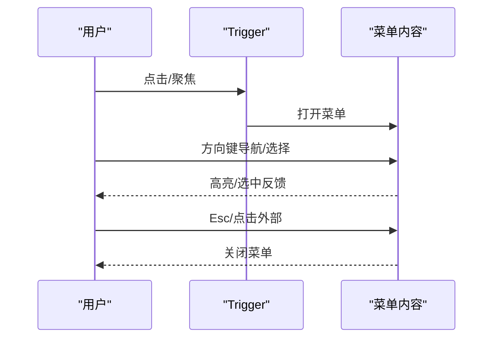
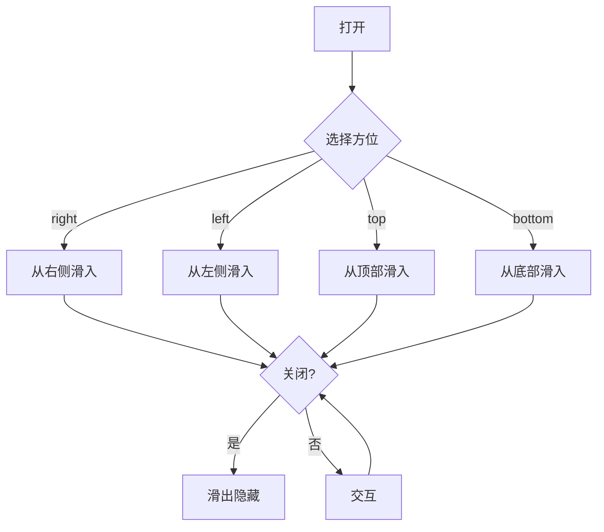
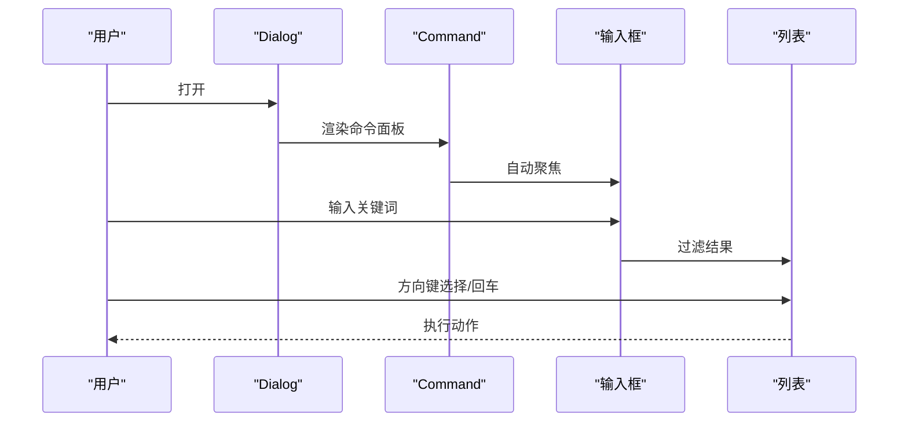
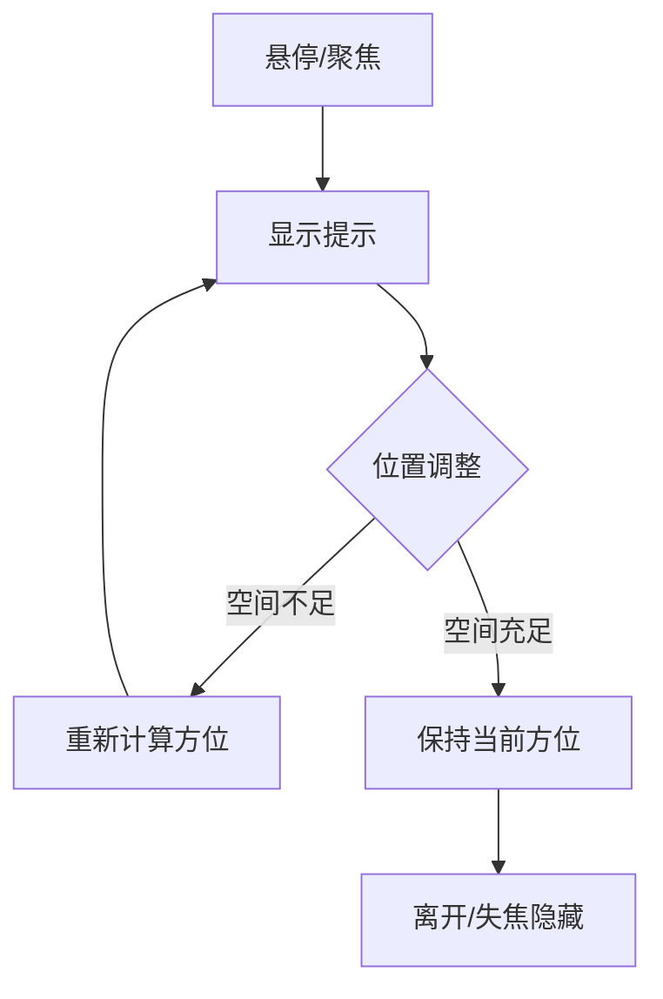
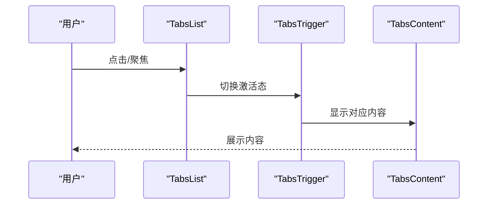
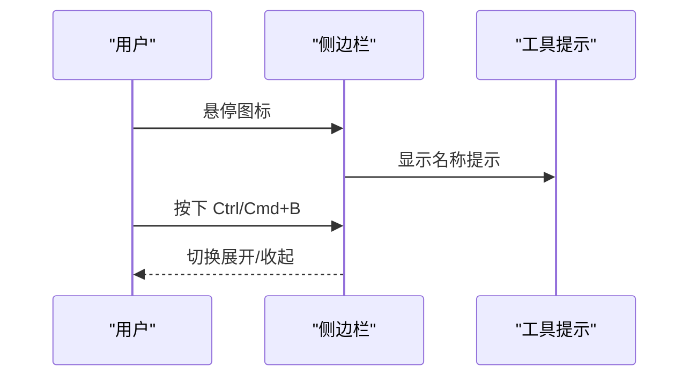
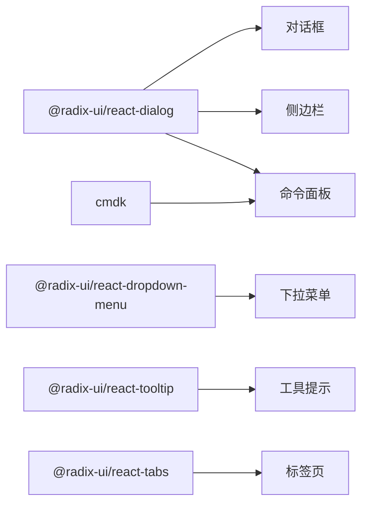

# 浮层组件

<cite>
**本文引用的文件**
- [dialog.tsx](file://web/src/components/ui/dialog.tsx)
- [dropdown-menu.tsx](file://web/src/components/ui/dropdown-menu.tsx)
- [sheet.tsx](file://web/src/components/ui/sheet.tsx)
- [command.tsx](file://web/src/components/ui/command.tsx)
- [tooltip.tsx](file://web/src/components/ui/tooltip.tsx)
- [tabs.tsx](file://web/src/components/ui/tabs.tsx)
- [Sidebar.tsx](file://web/src/components/Layout/Sidebar.tsx)
</cite>

## 目录
1. [简介](#简介)
2. [项目结构](#项目结构)
3. [核心组件](#核心组件)
4. [架构总览](#架构总览)
5. [详细组件分析](#详细组件分析)
6. [依赖关系分析](#依赖关系分析)
7. [性能考量](#性能考量)
8. [故障排查指南](#故障排查指南)
9. [结论](#结论)
10. [附录](#附录)

## 简介
本技术文档聚焦 ResolveAgent Web 前端中的“浮层”类 UI 组件，包括对话框、下拉菜单、侧边栏（Sheet）、命令面板、工具提示与标签页。文档从触发方式、定位策略、动画效果、焦点管理、层级控制、背景遮罩、键盘交互、配置选项、无障碍访问、使用场景、性能优化与常见问题等方面进行全面说明，帮助开发者正确、一致地使用这些组件。

## 项目结构
浮层相关组件统一位于 web/src/components/ui 目录下，采用基于 Radix UI 的无样式基础组件 + Tailwind 样式的组合模式：
- 对话框：dialog.tsx
- 下拉菜单：dropdown-menu.tsx
- 侧边栏（Sheet）：sheet.tsx
- 命令面板：command.tsx（基于 cmdk，并复用 Dialog）
- 工具提示：tooltip.tsx
- 标签页：tabs.tsx

此外，侧边栏在 Layout 中作为常驻区域使用 Tooltip 提供折叠态下的导航提示。

图表来源
- [dialog.tsx:1-92](file://web/src/components/ui/dialog.tsx#L1-L92)
- [dropdown-menu.tsx:1-168](file://web/src/components/ui/dropdown-menu.tsx#L1-L168)
- [sheet.tsx:1-104](file://web/src/components/ui/sheet.tsx#L1-L104)
- [command.tsx:1-125](file://web/src/components/ui/command.tsx#L1-L125)
- [tooltip.tsx:1-26](file://web/src/components/ui/tooltip.tsx#L1-L26)
- [tabs.tsx:1-53](file://web/src/components/ui/tabs.tsx#L1-L53)

章节来源
- [dialog.tsx:1-92](file://web/src/components/ui/dialog.tsx#L1-L92)
- [dropdown-menu.tsx:1-168](file://web/src/components/ui/dropdown-menu.tsx#L1-L168)
- [sheet.tsx:1-104](file://web/src/components/ui/sheet.tsx#L1-L104)
- [command.tsx:1-125](file://web/src/components/ui/command.tsx#L1-L125)
- [tooltip.tsx:1-26](file://web/src/components/ui/tooltip.tsx#L1-L26)
- [tabs.tsx:1-53](file://web/src/components/ui/tabs.tsx#L1-L53)

## 核心组件
- 对话框（Dialog）
  - 触发方式：通过 Trigger 打开，Close 关闭；支持 Portal 渲染到文档根节点。
  - 定位策略：居中固定定位，配合 translate(-50%, -50%) 实现水平垂直居中。
  - 动画效果：打开/关闭时具备淡入淡出与缩放、滑入滑出过渡。
  - 焦点管理：由 Radix 自动管理焦点陷阱与默认焦点行为。
  - 层级控制：z-50 确保浮层在最上层。
  - 背景遮罩：Overlay 提供半透明遮罩，点击可关闭。
  - 键盘交互：Esc 关闭、Tab 循环聚焦内容。
  - 无障碍：包含 sr-only 关闭按钮文本，标题与描述语义化。

- 下拉菜单（Dropdown Menu）
  - 触发方式：Trigger 打开，子项/子菜单支持嵌套。
  - 定位策略：基于 sideOffset 偏移，自动计算显示方位。
  - 动画效果：打开/关闭具备淡入淡出与缩放、滑入滑出过渡。
  - 焦点管理：方向键导航、Enter/Space 选择、Esc 关闭。
  - 层级控制：z-50。
  - 背景遮罩：无全局遮罩，仅菜单自身容器。
  - 无障碍：Item/Checkbox/Radio/Label/Separator 等语义化元素。

- 侧边栏（Sheet）
  - 触发方式：Trigger 打开，Close 关闭；Portal 渲染。
  - 定位策略：四向滑出（top/bottom/left/right），默认右侧。
  - 动画效果：打开/关闭具备滑动与时长差异的过渡。
  - 焦点管理：Radix 焦点陷阱与默认焦点行为。
  - 层级控制：z-50。
  - 背景遮罩：Overlay 半透明遮罩。
  - 键盘交互：Esc 关闭、Tab 循环。
  - 无障碍：标题与描述语义化，关闭按钮 sr-only 文本。

- 命令面板（Command）
  - 触发方式：通常以 Dialog 包裹，内部集成 cmdk 输入与列表。
  - 定位策略：继承 Dialog 的居中或自定义布局。
  - 动画效果：受 Dialog 控制。
  - 焦点管理：输入框自动聚焦，列表项键盘导航。
  - 层级控制：z-50。
  - 背景遮罩：由 Dialog Overlay 提供。
  - 键盘交互：搜索过滤、方向键选择、回车执行。
  - 无障碍：分组、分隔符、空状态等语义化。

- 工具提示（Tooltip）
  - 触发方式：Hover/Focus 触发。
  - 定位策略：sideOffset 偏移，自动计算方位。
  - 动画效果：淡入淡出与缩放、滑入滑出。
  - 焦点管理：Focus 时保持可见。
  - 层级控制：z-50。
  - 背景遮罩：无全局遮罩。
  - 键盘交互：Focus 显示，Blur 隐藏。
  - 无障碍：轻量提示，适合辅助信息。

- 标签页（Tabs）
  - 触发方式：点击 TabsTrigger 切换。
  - 定位策略：内联布局，非浮层。
  - 动画效果：激活态样式切换。
  - 焦点管理：方向键在 Tab 间切换，Enter/Space 激活。
  - 层级控制：常规文档流。
  - 背景遮罩：无。
  - 键盘交互：方向键导航、Enter/Space 激活。
  - 无障碍：List/Trigger/Content 语义化。

章节来源
- [dialog.tsx:1-92](file://web/src/components/ui/dialog.tsx#L1-L92)
- [dropdown-menu.tsx:1-168](file://web/src/components/ui/dropdown-menu.tsx#L1-L168)
- [sheet.tsx:1-104](file://web/src/components/ui/sheet.tsx#L1-L104)
- [command.tsx:1-125](file://web/src/components/ui/command.tsx#L1-L125)
- [tooltip.tsx:1-26](file://web/src/components/ui/tooltip.tsx#L1-L26)
- [tabs.tsx:1-53](file://web/src/components/ui/tabs.tsx#L1-L53)

## 架构总览
所有浮层组件均基于 Radix UI 的无样式基础组件，结合 Tailwind 完成样式与动画；命令面板额外依赖 cmdk 提供强大的键盘与搜索能力。侧边栏在页面布局中使用 Tooltip 为折叠态图标提供上下文提示。

图表来源
- [dialog.tsx:1-92](file://web/src/components/ui/dialog.tsx#L1-L92)
- [dropdown-menu.tsx:1-168](file://web/src/components/ui/dropdown-menu.tsx#L1-L168)
- [sheet.tsx:1-104](file://web/src/components/ui/sheet.tsx#L1-L104)
- [command.tsx:1-125](file://web/src/components/ui/command.tsx#L1-L125)
- [tooltip.tsx:1-26](file://web/src/components/ui/tooltip.tsx#L1-L26)

## 详细组件分析

### 对话框（Dialog）
- 触发方式：DialogTrigger 打开，DialogClose 关闭。
- 定位策略：fixed + 居中 translate(-50%, -50%)。
- 动画效果：data-[state] 驱动的 fade-in/out、zoom、slide。
- 焦点管理：Radix 自动处理焦点陷阱与默认焦点。
- 层级控制：z-50。
- 背景遮罩：DialogOverlay 半透明遮罩。
- 键盘交互：Esc 关闭，Tab 在内容内循环。
- 无障碍：sr-only 关闭按钮文本，DialogTitle/Description 语义化。

图表来源
- [dialog.tsx:1-92](file://web/src/components/ui/dialog.tsx#L1-L92)

章节来源
- [dialog.tsx:1-92](file://web/src/components/ui/dialog.tsx#L1-L92)

### 下拉菜单（Dropdown Menu）
- 触发方式：DropdownMenuTrigger 打开。
- 定位策略：sideOffset 偏移，自动计算方位。
- 动画效果：fade、zoom、slide。
- 焦点管理：方向键导航、Enter/Space 选择、Esc 关闭。
- 层级控制：z-50。
- 背景遮罩：无全局遮罩。
- 无障碍：Item/Checkbox/Radio/Label/Separator 语义化。

图表来源
- [dropdown-menu.tsx:1-168](file://web/src/components/ui/dropdown-menu.tsx#L1-L168)

章节来源
- [dropdown-menu.tsx:1-168](file://web/src/components/ui/dropdown-menu.tsx#L1-L168)

### 侧边栏（Sheet）
- 触发方式：SheetTrigger 打开，SheetClose 关闭。
- 定位策略：四向滑出（默认右侧）。
- 动画效果：打开/关闭具有不同持续时间的滑动过渡。
- 焦点管理：Radix 焦点陷阱与默认焦点。
- 层级控制：z-50。
- 背景遮罩：Overlay 半透明遮罩。
- 键盘交互：Esc 关闭，Tab 循环。
- 无障碍：标题与描述语义化，关闭按钮 sr-only 文本。

图表来源
- [sheet.tsx:1-104](file://web/src/components/ui/sheet.tsx#L1-L104)

章节来源
- [sheet.tsx:1-104](file://web/src/components/ui/sheet.tsx#L1-L104)

### 命令面板（Command）
- 触发方式：通常以 Dialog 包裹，内部使用 cmdk 提供输入与列表。
- 定位策略：继承 Dialog 布局。
- 动画效果：由 Dialog 控制。
- 焦点管理：输入框自动聚焦，列表项键盘导航。
- 层级控制：z-50。
- 背景遮罩：Dialog Overlay。
- 键盘交互：搜索过滤、方向键选择、回车执行。
- 无障碍：Group/Separator/Empty 等语义化。

图表来源
- [command.tsx:1-125](file://web/src/components/ui/command.tsx#L1-L125)
- [dialog.tsx:1-92](file://web/src/components/ui/dialog.tsx#L1-L92)

章节来源
- [command.tsx:1-125](file://web/src/components/ui/command.tsx#L1-L125)
- [dialog.tsx:1-92](file://web/src/components/ui/dialog.tsx#L1-L92)

### 工具提示（Tooltip）
- 触发方式：Hover/Focus。
- 定位策略：sideOffset 偏移，自动计算方位。
- 动画效果：fade、zoom、slide。
- 焦点管理：Focus 时保持可见。
- 层级控制：z-50。
- 背景遮罩：无全局遮罩。
- 键盘交互：Focus 显示，Blur 隐藏。
- 无障碍：轻量提示，适合辅助信息。

图表来源
- [tooltip.tsx:1-26](file://web/src/components/ui/tooltip.tsx#L1-L26)

章节来源
- [tooltip.tsx:1-26](file://web/src/components/ui/tooltip.tsx#L1-L26)

### 标签页（Tabs）
- 触发方式：点击 TabsTrigger 切换。
- 定位策略：内联布局，非浮层。
- 动画效果：激活态样式切换。
- 焦点管理：方向键在 Tab 间切换，Enter/Space 激活。
- 层级控制：常规文档流。
- 背景遮罩：无。
- 键盘交互：方向键导航、Enter/Space 激活。
- 无障碍：List/Trigger/Content 语义化。

图表来源
- [tabs.tsx:1-53](file://web/src/components/ui/tabs.tsx#L1-L53)

章节来源
- [tabs.tsx:1-53](file://web/src/components/ui/tabs.tsx#L1-L53)

### 实际使用示例：侧边栏与工具提示
侧边栏在折叠态下为每个导航项提供 Tooltip 提示，提升小尺寸下的可用性。同时支持快捷键 Ctrl/Cmd+B 切换展开/收起。

图表来源
- [Sidebar.tsx:1-255](file://web/src/components/Layout/Sidebar.tsx#L1-L255)
- [tooltip.tsx:1-26](file://web/src/components/ui/tooltip.tsx#L1-L26)

章节来源
- [Sidebar.tsx:1-255](file://web/src/components/Layout/Sidebar.tsx#L1-L255)
- [tooltip.tsx:1-26](file://web/src/components/ui/tooltip.tsx#L1-L26)

## 依赖关系分析
- 对话框、侧边栏、命令面板共享 @radix-ui/react-dialog 的能力（Portal、Overlay、Content、焦点陷阱）。
- 下拉菜单基于 @radix-ui/react-dropdown-menu。
- 工具提示基于 @radix-ui/react-tooltip。
- 标签页基于 @radix-ui/react-tabs。
- 命令面板基于 cmdk，并与 Dialog 组合使用。

图表来源
- [dialog.tsx:1-92](file://web/src/components/ui/dialog.tsx#L1-L92)
- [dropdown-menu.tsx:1-168](file://web/src/components/ui/dropdown-menu.tsx#L1-L168)
- [sheet.tsx:1-104](file://web/src/components/ui/sheet.tsx#L1-L104)
- [command.tsx:1-125](file://web/src/components/ui/command.tsx#L1-L125)
- [tooltip.tsx:1-26](file://web/src/components/ui/tooltip.tsx#L1-L26)
- [tabs.tsx:1-53](file://web/src/components/ui/tabs.tsx#L1-L53)

章节来源
- [dialog.tsx:1-92](file://web/src/components/ui/dialog.tsx#L1-L92)
- [dropdown-menu.tsx:1-168](file://web/src/components/ui/dropdown-menu.tsx#L1-L168)
- [sheet.tsx:1-104](file://web/src/components/ui/sheet.tsx#L1-L104)
- [command.tsx:1-125](file://web/src/components/ui/command.tsx#L1-L125)
- [tooltip.tsx:1-26](file://web/src/components/ui/tooltip.tsx#L1-L26)
- [tabs.tsx:1-53](file://web/src/components/ui/tabs.tsx#L1-L53)

## 性能考量
- 避免过多同时打开的浮层：多个 z-50 浮层叠加会增加重绘与焦点管理开销。
- 合理使用 Portal：将浮层渲染至根节点可减少 DOM 层级与样式计算成本。
- 控制动画复杂度：动画属性（transform、opacity）较高效，避免复杂滤镜。
- 延迟加载重型内容：如命令面板列表数据按需获取，减少首屏负担。
- 避免频繁重排：批量更新列表项或使用虚拟滚动（当列表很大时）。
- 最小化重绘：使用 Tailwind 原子类与稳定的 className，减少动态样式切换。

[本节为通用指导，不直接分析具体文件]

## 故障排查指南
- 浮层被遮挡
  - 检查 z-index：确保浮层组件为 z-50，且父级未设置 transform/opacity 导致新的层叠上下文。
  - 参考：对话框、下拉菜单、侧边栏、命令面板、工具提示均使用 z-50。
- 无法关闭
  - 确认是否阻止了默认行为（如 preventDefault）影响 Esc 关闭。
  - 检查是否有覆盖层拦截点击。
- 焦点异常
  - 确保浮层内容包含可聚焦元素，且未被禁用。
  - 使用 Radix 提供的焦点陷阱，避免焦点逃逸。
- 动画卡顿
  - 避免在浮层内大量重排操作；必要时使用 requestAnimationFrame 或分片渲染。
- 无障碍问题
  - 为关闭按钮添加 sr-only 文本。
  - 为标题与描述使用 Title/Description 语义化组件。

章节来源
- [dialog.tsx:1-92](file://web/src/components/ui/dialog.tsx#L1-L92)
- [dropdown-menu.tsx:1-168](file://web/src/components/ui/dropdown-menu.tsx#L1-L168)
- [sheet.tsx:1-104](file://web/src/components/ui/sheet.tsx#L1-L104)
- [command.tsx:1-125](file://web/src/components/ui/command.tsx#L1-L125)
- [tooltip.tsx:1-26](file://web/src/components/ui/tooltip.tsx#L1-L26)

## 结论
ResolveAgent 的浮层组件体系以 Radix UI 为基础，结合 Tailwind 实现了统一的触发、定位、动画与无障碍体验。通过 Portal 与 z-50 保证层级与隔离，通过 Radix 的焦点管理与键盘交互保障可访问性。命令面板在对话框基础上扩展了强大的搜索与键盘导航能力。建议在实际使用中遵循一致的触发与关闭约定，合理控制浮层数量与动画复杂度，以获得最佳性能与用户体验。

[本节为总结性内容，不直接分析具体文件]

## 附录
- 常用配置要点
  - 对话框：使用 Portal 渲染，设置 Overlay 与 Content，提供 Title/Description 与 Close。
  - 下拉菜单：使用 sideOffset 控制偏移，合理组织 Group/Label/Separator。
  - 侧边栏：选择 side 方位，提供 Header/Footer/Title/Description。
  - 命令面板：在 Dialog 中嵌入 Command，使用 Input/List/Group/Item。
  - 工具提示：使用 Provider/Trigger/Content，设置 sideOffset。
  - 标签页：使用 List/Trigger/Content 组织内容。
- 无障碍清单
  - 为关闭按钮添加 sr-only 文本。
  - 使用语义化组件（Title/Description/Label/Separator）。
  - 确保键盘可达性与焦点顺序合理。
- 使用场景建议
  - 对话框：表单、确认、详情查看。
  - 下拉菜单：操作入口、筛选、设置。
  - 侧边栏：面板、抽屉式内容。
  - 命令面板：全局快捷操作、快速导航。
  - 工具提示：辅助说明、快捷键提示。
  - 标签页：分区内容、多视图切换。

[本节为补充信息，不直接分析具体文件]