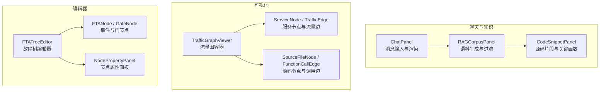
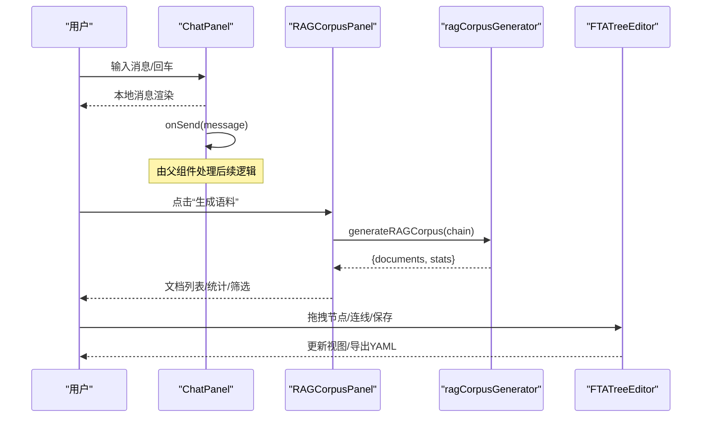
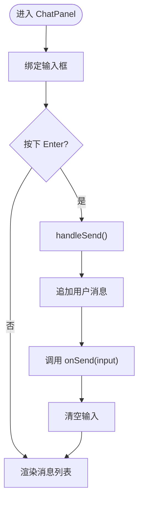
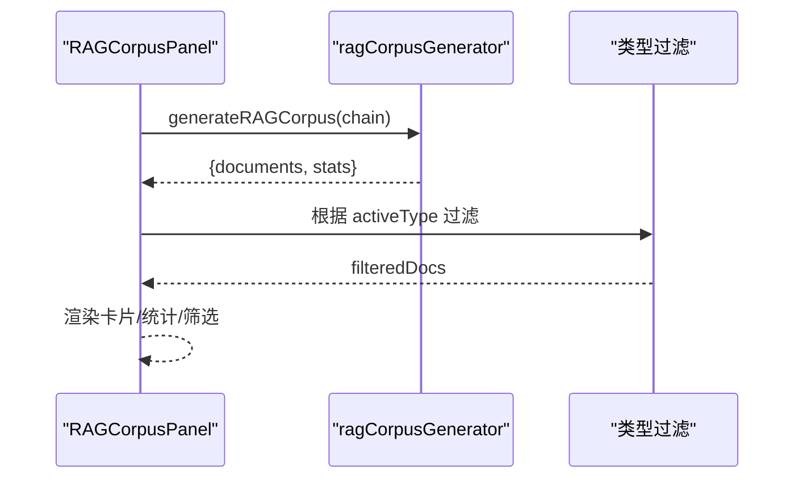
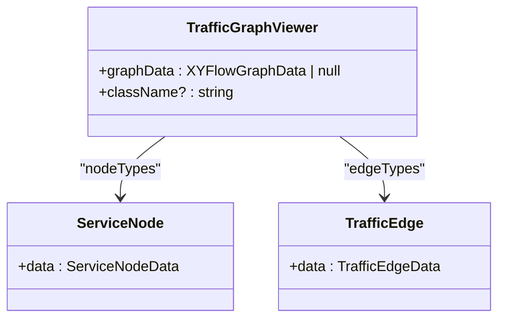
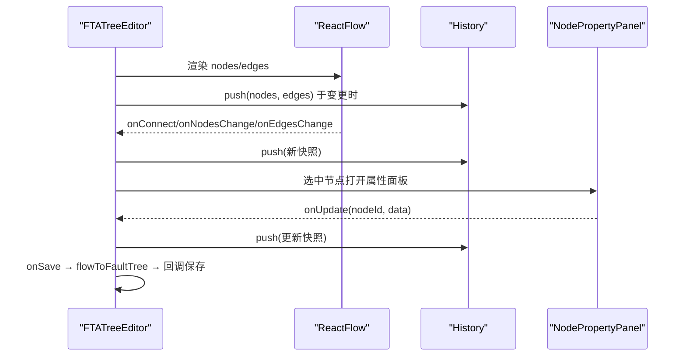
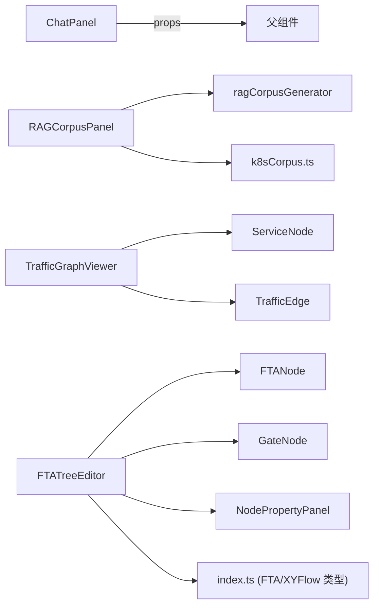

# 聊天界面组件

<cite>
**本文引用的文件**
- [ChatPanel.tsx](file://web/src/components/ChatInterface/ChatPanel.tsx)
- [RAGCorpusPanel.tsx](file://web/src/components/K8sCorpus/RAGCorpusPanel.tsx)
- [ragCorpusGenerator.ts](file://web/src/lib/ragCorpusGenerator.ts)
- [k8sCorpus.ts](file://web/src/types/k8sCorpus.ts)
- [CodeSnippetPanel.tsx](file://web/src/components/K8sCorpus/CodeSnippetPanel.tsx)
- [FunctionCallEdge.tsx](file://web/src/components/K8sCorpus/FunctionCallEdge.tsx)
- [SourceFileNode.tsx](file://web/src/components/K8sCorpus/SourceFileNode.tsx)
- [TrafficGraphViewer.tsx](file://web/src/components/TrafficGraph/TrafficGraphViewer.tsx)
- [ServiceNode.tsx](file://web/src/components/TrafficGraph/ServiceNode.tsx)
- [TrafficEdge.tsx](file://web/src/components/TrafficGraph/TrafficEdge.tsx)
- [FTATreeEditor.tsx](file://web/src/components/TreeEditor/FTATreeEditor.tsx)
- [FTANode.tsx](file://web/src/components/TreeEditor/FTANode.tsx)
- [GateNode.tsx](file://web/src/components/TreeEditor/GateNode.tsx)
- [NodePropertyPanel.tsx](file://web/src/components/TreeEditor/NodePropertyPanel.tsx)
- [index.ts](file://web/src/types/index.ts)
</cite>

## 目录
1. [简介](#简介)
2. [项目结构](#项目结构)
3. [核心组件](#核心组件)
4. [架构总览](#架构总览)
5. [详细组件分析](#详细组件分析)
6. [依赖关系分析](#依赖关系分析)
7. [性能考虑](#性能考虑)
8. [故障排查指南](#故障排查指南)
9. [结论](#结论)
10. [附录](#附录)

## 简介
本技术文档围绕 ResolveAgent 前端聊天界面及相关专业可视化组件展开，覆盖聊天面板、K8s 语料库展示、流量图可视化与故障树编辑器等。重点说明实时消息渲染、代码片段展示、函数调用连线、节点属性面板等功能特性；解释数据绑定、事件处理与状态同步机制；提供集成示例、API 接口约定与扩展开发指南；并给出性能优化、内存管理与用户体验改进建议。

## 项目结构
前端相关能力集中在 web/src 下：
- ChatInterface：基础聊天面板，负责消息输入与本地消息列表渲染
- K8sCorpus：基于调用链生成 RAG 语料，并提供源码文件详情、函数调用边、源码节点等可视化能力
- TrafficGraph：服务级流量拓扑图，包含服务节点与流量边
- TreeEditor：故障树（FTA）可视化编辑器，支持拖拽、连接、自动布局、撤销重做与 YAML 导出
- types：统一类型定义，贯穿各组件的数据契约

**图表来源**
- [ChatPanel.tsx:17-58](file://web/src/components/ChatInterface/ChatPanel.tsx#L17-L58)
- [RAGCorpusPanel.tsx:234-357](file://web/src/components/K8sCorpus/RAGCorpusPanel.tsx#L234-L357)
- [TrafficGraphViewer.tsx:27-88](file://web/src/components/TrafficGraph/TrafficGraphViewer.tsx#L27-L88)
- [FTATreeEditor.tsx:356-590](file://web/src/components/TreeEditor/FTATreeEditor.tsx#L356-L590)

**章节来源**
- [ChatPanel.tsx:17-58](file://web/src/components/ChatInterface/ChatPanel.tsx#L17-L58)
- [RAGCorpusPanel.tsx:234-357](file://web/src/components/K8sCorpus/RAGCorpusPanel.tsx#L234-L357)
- [TrafficGraphViewer.tsx:27-88](file://web/src/components/TrafficGraph/TrafficGraphViewer.tsx#L27-L88)
- [FTATreeEditor.tsx:356-590](file://web/src/components/TreeEditor/FTATreeEditor.tsx#L356-L590)

## 核心组件
- 聊天面板（ChatPanel）
  - 职责：接收用户输入，维护本地消息列表，触发 onSend 回调
  - 数据绑定：input 双向绑定，messages 单向渲染
  - 事件处理：Enter 发送、点击发送按钮、禁用态控制
- K8s 语料面板（RAGCorpusPanel）
  - 职责：基于调用链生成结构化 RAG 文档，按类型过滤与统计
  - 数据流：chain → generateRAGCorpus → documents/stats → 过滤与展示
  - 交互：生成/重新生成、类型筛选、复制内容
- 代码片段面板（CodeSnippetPanel）
  - 职责：展示源码文件信息、关键函数签名与代码片段、调用关系
- 流量图（TrafficGraphViewer + ServiceNode + TrafficEdge）
  - 职责：以 React Flow 渲染服务拓扑，展示请求量、错误率、延迟、协议
- 故障树编辑器（FTATreeEditor + FTANode + GateNode + NodePropertyPanel）
  - 职责：可视化编辑故障树，支持拖拽添加节点、连线、自动布局、撤销/重做、YAML 导出、属性编辑

**章节来源**
- [ChatPanel.tsx:17-58](file://web/src/components/ChatInterface/ChatPanel.tsx#L17-L58)
- [RAGCorpusPanel.tsx:234-357](file://web/src/components/K8sCorpus/RAGCorpusPanel.tsx#L234-L357)
- [CodeSnippetPanel.tsx:17-116](file://web/src/components/K8sCorpus/CodeSnippetPanel.tsx#L17-L116)
- [TrafficGraphViewer.tsx:27-88](file://web/src/components/TrafficGraph/TrafficGraphViewer.tsx#L27-L88)
- [FTATreeEditor.tsx:356-590](file://web/src/components/TreeEditor/FTATreeEditor.tsx#L356-L590)

## 架构总览
聊天界面与可视化组件通过统一的类型契约进行数据交换，核心流程如下：
- 聊天消息：父组件管理会话上下文，ChatPanel 仅负责 UI 与 onSend 回调
- 语料生成：RAGCorpusPanel 调用 ragCorpusGenerator 将 K8s 调用链转换为多类型文档集合
- 可视化：TrafficGraphViewer 与 FTATreeEditor 均基于 @xyflow/react，使用自定义节点与边类型
- 编辑器：FTATreeEditor 在 React Flow 之上实现 undo/redo、自动布局、YAML 导出与属性面板联动

**图表来源**
- [ChatPanel.tsx:21-26](file://web/src/components/ChatInterface/ChatPanel.tsx#L21-L26)
- [RAGCorpusPanel.tsx:238-247](file://web/src/components/K8sCorpus/RAGCorpusPanel.tsx#L238-L247)
- [ragCorpusGenerator.ts:97-131](file://web/src/lib/ragCorpusGenerator.ts#L97-L131)
- [FTATreeEditor.tsx:379-492](file://web/src/components/TreeEditor/FTATreeEditor.tsx#L379-L492)

## 详细组件分析

### 聊天面板（ChatPanel）
- 设计要点
  - 受控输入：input 状态与 Input 组件双向绑定
  - 消息列表：messages 数组渲染，区分 user/system/assistant 角色样式
  - 事件：Enter 键与按钮点击均触发 handleSend，未选择智能体时禁用
- 数据绑定
  - 内部状态：input、messages
  - 外部回调：onSend(message)，由父组件决定消息去向
- 事件处理
  - 键盘事件：onKeyDown 拦截 Enter
  - 按钮事件：onClick 触发发送
- 状态同步
  - 发送后清空 input，追加用户消息到 messages
  - 实际回复由父组件通过 onSend 的副作用完成

**图表来源**
- [ChatPanel.tsx:17-58](file://web/src/components/ChatInterface/ChatPanel.tsx#L17-L58)

**章节来源**
- [ChatPanel.tsx:17-58](file://web/src/components/ChatInterface/ChatPanel.tsx#L17-L58)

### K8s 语料库展示（RAGCorpusPanel）
- 设计要点
  - 基于 chain 生成 RAG 文档集合，分类统计（代码分析/运维场景）
  - 支持按 docType 过滤，显示预览、复制、元数据
- 数据流
  - chain → generateRAGCorpus → corpus.documents/stats
  - activeType 过滤 filteredDocs
- 交互
  - 生成/重新生成、类型筛选、复制内容、展开/折叠文档

**图表来源**
- [RAGCorpusPanel.tsx:234-357](file://web/src/components/K8sCorpus/RAGCorpusPanel.tsx#L234-L357)
- [ragCorpusGenerator.ts:97-131](file://web/src/lib/ragCorpusGenerator.ts#L97-L131)

**章节来源**
- [RAGCorpusPanel.tsx:234-357](file://web/src/components/K8sCorpus/RAGCorpusPanel.tsx#L234-L357)
- [ragCorpusGenerator.ts:97-131](file://web/src/lib/ragCorpusGenerator.ts#L97-L131)
- [k8sCorpus.ts:48-69](file://web/src/types/k8sCorpus.ts#L48-L69)

### 代码片段面板（CodeSnippetPanel）
- 功能
  - 展示源码文件基本信息、关键函数签名、代码片段、调用关系
- 数据绑定
  - sourceFile 作为 props，内部计算重要性标签与统计
- 交互
  - 关闭按钮、滚动查看、函数间分隔

**章节来源**
- [CodeSnippetPanel.tsx:17-116](file://web/src/components/K8sCorpus/CodeSnippetPanel.tsx#L17-L116)

### 函数调用连线（FunctionCallEdge）
- 功能
  - 自定义边渲染，支持不同调用类型颜色、异步虚线、初始化链路紫色调
- 数据模型
  - label、callType、chainType 决定视觉表现
- 渲染
  - BaseEdge + EdgeLabelRenderer，平滑曲线与箭头标记

**章节来源**
- [FunctionCallEdge.tsx:32-81](file://web/src/components/K8sCorpus/FunctionCallEdge.tsx#L32-L81)

### 源码节点（SourceFileNode）
- 功能
  - 展示源码文件所属组件、路径、函数数、行数、重要程度指示条
- 样式
  - 组件配色、形状差异（故障排查 vs 初始化）、选中高亮

**章节来源**
- [SourceFileNode.tsx:57-113](file://web/src/components/K8sCorpus/SourceFileNode.tsx#L57-L113)

### 流量图可视化（TrafficGraphViewer）
- 功能
  - 基于 React Flow 渲染服务拓扑，内置 Controls、MiniMap、背景点阵
- 数据
  - graphData.nodes/edges 映射为 React Flow 节点与边
- 空状态
  - 无数据时显示占位提示

**图表来源**
- [TrafficGraphViewer.tsx:27-88](file://web/src/components/TrafficGraph/TrafficGraphViewer.tsx#L27-L88)
- [ServiceNode.tsx:13-67](file://web/src/components/TrafficGraph/ServiceNode.tsx#L13-L67)
- [TrafficEdge.tsx:18-66](file://web/src/components/TrafficGraph/TrafficEdge.tsx#L18-L66)

**章节来源**
- [TrafficGraphViewer.tsx:27-88](file://web/src/components/TrafficGraph/TrafficGraphViewer.tsx#L27-L88)
- [ServiceNode.tsx:13-67](file://web/src/components/TrafficGraph/ServiceNode.tsx#L13-L67)
- [TrafficEdge.tsx:18-66](file://web/src/components/TrafficGraph/TrafficEdge.tsx#L18-L66)

### 故障树编辑器（FTATreeEditor）
- 功能
  - 将 FaultTree 转为 React Flow 节点/边，支持拖拽添加、连线校验、自动布局、撤销/重做、YAML 导出
- 数据转换
  - faultTreeToFlow / flowToFaultTree 双向转换
- 编辑器交互
  - 节点双击编辑、删除、属性面板更新、保存回推上游
- 历史管理
  - 自定义 useHistory 维护 past/future 快照，限制长度避免内存膨胀

**图表来源**
- [FTATreeEditor.tsx:77-246](file://web/src/components/TreeEditor/FTATreeEditor.tsx#L77-L246)
- [FTATreeEditor.tsx:379-533](file://web/src/components/TreeEditor/FTATreeEditor.tsx#L379-L533)
- [NodePropertyPanel.tsx:271-303](file://web/src/components/TreeEditor/NodePropertyPanel.tsx#L271-L303)

**章节来源**
- [FTATreeEditor.tsx:77-246](file://web/src/components/TreeEditor/FTATreeEditor.tsx#L77-L246)
- [FTATreeEditor.tsx:356-590](file://web/src/components/TreeEditor/FTATreeEditor.tsx#L356-L590)
- [NodePropertyPanel.tsx:71-183](file://web/src/components/TreeEditor/NodePropertyPanel.tsx#L71-L183)
- [NodePropertyPanel.tsx:187-267](file://web/src/components/TreeEditor/NodePropertyPanel.tsx#L187-L267)
- [NodePropertyPanel.tsx:271-303](file://web/src/components/TreeEditor/NodePropertyPanel.tsx#L271-L303)

### 事件与门节点（FTANode / GateNode）
- FTANode
  - 支持双击编辑名称、删除、状态样式、评估器显示
- GateNode
  - 显示门符号与类型，VOTING 显示 k/n，支持删除

**章节来源**
- [FTANode.tsx:32-133](file://web/src/components/TreeEditor/FTANode.tsx#L32-L133)
- [GateNode.tsx:35-79](file://web/src/components/TreeEditor/GateNode.tsx#L35-L79)

## 依赖关系分析
- 组件耦合
  - ChatPanel 低耦合，仅依赖 onSend 回调
  - RAGCorpusPanel 依赖 ragCorpusGenerator 与类型定义
  - TrafficGraphViewer 依赖 @xyflow/react 及自定义节点/边
  - FTATreeEditor 依赖 @xyflow/react、自定义节点/边与属性面板
- 外部依赖
  - @xyflow/react 用于可视化与交互
  - lucide-react 图标库
  - 自定义 UI 组件（Button、Input、Badge 等）
- 类型契约
  - k8sCorpus.ts 定义调用链数据结构
  - index.ts 定义通用类型（如 XYFlowGraphData、FTA 类型）

**图表来源**
- [RAGCorpusPanel.tsx:234-357](file://web/src/components/K8sCorpus/RAGCorpusPanel.tsx#L234-L357)
- [ragCorpusGenerator.ts:97-131](file://web/src/lib/ragCorpusGenerator.ts#L97-L131)
- [k8sCorpus.ts:48-69](file://web/src/types/k8sCorpus.ts#L48-L69)
- [TrafficGraphViewer.tsx:27-88](file://web/src/components/TrafficGraph/TrafficGraphViewer.tsx#L27-L88)
- [FTATreeEditor.tsx:356-590](file://web/src/components/TreeEditor/FTATreeEditor.tsx#L356-L590)
- [index.ts:82-110](file://web/src/types/index.ts#L82-L110)
- [index.ts:761-792](file://web/src/types/index.ts#L761-L792)

**章节来源**
- [k8sCorpus.ts:48-69](file://web/src/types/k8sCorpus.ts#L48-L69)
- [index.ts:82-110](file://web/src/types/index.ts#L82-L110)
- [index.ts:761-792](file://web/src/types/index.ts#L761-L792)

## 性能考虑
- 列表渲染
  - 使用 useMemo 缓存 corpus 与 filteredDocs，减少重复计算
  - 长列表建议虚拟滚动（当前 max-h 限制高度）
- 可视化性能
  - React Flow 节点/边数量较大时，启用 fitView 与 MiniMap 提升体验
  - 自定义边使用 memo 包裹（FunctionCallEdge、TrafficEdge）
- 历史快照
  - 限制过去快照长度（如 30），避免内存增长
- 文本处理
  - 大文档内容仅展示前 N 字符预览，展开再加载完整内容
- 网络与计算
  - 语料生成在前端执行，注意大数据集时的主线程阻塞风险，可考虑 Web Worker 或分片生成

[本节为通用指导，不直接分析具体文件]

## 故障排查指南
- 聊天面板无法发送
  - 检查 agentId 是否传入，disabled 状态是否正确
  - 确认 onSend 回调已正确传递并由父组件处理
- 语料生成无输出
  - 检查 chain 数据完整性（sourceFiles、edges、flowSteps）
  - 确认 generateRAGCorpus 返回结构与组件期望一致
- 流量图空白
  - 检查 graphData 是否为空，nodes/edges 格式是否符合 React Flow 要求
- 故障树编辑器异常
  - 连线校验：仅允许 ftaNode ↔ gateNode 连接
  - 自动布局失败：确保存在根节点或至少一个入度为 0 的节点
  - 撤销/重做无效：确认每次变更都调用 history.push

**章节来源**
- [ChatPanel.tsx:21-26](file://web/src/components/ChatInterface/ChatPanel.tsx#L21-L26)
- [RAGCorpusPanel.tsx:238-247](file://web/src/components/K8sCorpus/RAGCorpusPanel.tsx#L238-L247)
- [TrafficGraphViewer.tsx:42-48](file://web/src/components/TrafficGraph/TrafficGraphViewer.tsx#L42-L48)
- [FTATreeEditor.tsx:397-406](file://web/src/components/TreeEditor/FTATreeEditor.tsx#L397-L406)
- [FTATreeEditor.tsx:282-338](file://web/src/components/TreeEditor/FTATreeEditor.tsx#L282-L338)

## 结论
本组件体系以聊天面板为入口，结合 K8s 语料生成与多种可视化能力，形成从问题输入到知识检索、再到复杂系统可视化的完整闭环。通过统一类型契约与 React Flow 的灵活扩展，实现了高内聚、低耦合的前端架构。建议在大规模数据场景下引入虚拟化与异步计算，进一步优化性能与用户体验。

## 附录

### 集成示例与 API 约定
- 聊天面板集成
  - 向 ChatPanel 传入 agentId 与 onSend，由父组件管理会话与后端通信
  - 参考路径：[ChatPanel.tsx:12-26](file://web/src/components/ChatInterface/ChatPanel.tsx#L12-L26)
- 语料生成集成
  - 提供 K8sAnalysisChain 给 RAGCorpusPanel，点击生成后获取 documents/stats
  - 参考路径：[RAGCorpusPanel.tsx:28-30](file://web/src/components/K8sCorpus/RAGCorpusPanel.tsx#L28-L30)、[ragCorpusGenerator.ts:97-131](file://web/src/lib/ragCorpusGenerator.ts#L97-L131)
- 流量图集成
  - 构造 XYFlowGraphData（nodes/edges），传入 TrafficGraphViewer
  - 参考路径：[TrafficGraphViewer.tsx:19-22](file://web/src/components/TrafficGraph/TrafficGraphViewer.tsx#L19-L22)、[index.ts:761-792](file://web/src/types/index.ts#L761-L792)
- 故障树编辑器集成
  - 提供 FaultTree 给 FTATreeEditor，保存时通过 onSave 回调获取最新树结构
  - 参考路径：[FTATreeEditor.tsx:350-354](file://web/src/components/TreeEditor/FTATreeEditor.tsx#L350-L354)、[index.ts:82-110](file://web/src/types/index.ts#L82-L110)

**章节来源**
- [ChatPanel.tsx:12-26](file://web/src/components/ChatInterface/ChatPanel.tsx#L12-L26)
- [RAGCorpusPanel.tsx:28-30](file://web/src/components/K8sCorpus/RAGCorpusPanel.tsx#L28-L30)
- [ragCorpusGenerator.ts:97-131](file://web/src/lib/ragCorpusGenerator.ts#L97-L131)
- [TrafficGraphViewer.tsx:19-22](file://web/src/components/TrafficGraph/TrafficGraphViewer.tsx#L19-L22)
- [index.ts:761-792](file://web/src/types/index.ts#L761-L792)
- [FTATreeEditor.tsx:350-354](file://web/src/components/TreeEditor/FTATreeEditor.tsx#L350-L354)
- [index.ts:82-110](file://web/src/types/index.ts#L82-L110)

### 扩展开发指南
- 新增语料类型
  - 在 ragCorpusGenerator 中新增生成函数，并在 RAGCorpusPanel 的统计与过滤中注册
  - 参考路径：[ragCorpusGenerator.ts:337-464](file://web/src/lib/ragCorpusGenerator.ts#L337-L464)、[RAGCorpusPanel.tsx:32-53](file://web/src/components/K8sCorpus/RAGCorpusPanel.tsx#L32-L53)
- 自定义可视化节点/边
  - 基于 @xyflow/react 的 nodeTypes/edgeTypes 扩展，复用现有模式（ServiceNode、TrafficEdge、FunctionCallEdge）
  - 参考路径：[TrafficGraphViewer.tsx:24-25](file://web/src/components/TrafficGraph/TrafficGraphViewer.tsx#L24-L25)、[FunctionCallEdge.tsx:32-81](file://web/src/components/K8sCorpus/FunctionCallEdge.tsx#L32-L81)
- 增强编辑器能力
  - 在 FTATreeEditor 中添加新的节点类型或连线规则，完善 isValidConnection 与 autoLayout
  - 参考路径：[FTATreeEditor.tsx:397-406](file://web/src/components/TreeEditor/FTATreeEditor.tsx#L397-L406)、[FTATreeEditor.tsx:282-338](file://web/src/components/TreeEditor/FTATreeEditor.tsx#L282-L338)

**章节来源**
- [ragCorpusGenerator.ts:337-464](file://web/src/lib/ragCorpusGenerator.ts#L337-L464)
- [RAGCorpusPanel.tsx:32-53](file://web/src/components/K8sCorpus/RAGCorpusPanel.tsx#L32-L53)
- [TrafficGraphViewer.tsx:24-25](file://web/src/components/TrafficGraph/TrafficGraphViewer.tsx#L24-L25)
- [FunctionCallEdge.tsx:32-81](file://web/src/components/K8sCorpus/FunctionCallEdge.tsx#L32-L81)
- [FTATreeEditor.tsx:397-406](file://web/src/components/TreeEditor/FTATreeEditor.tsx#L397-L406)
- [FTATreeEditor.tsx:282-338](file://web/src/components/TreeEditor/FTATreeEditor.tsx#L282-L338)