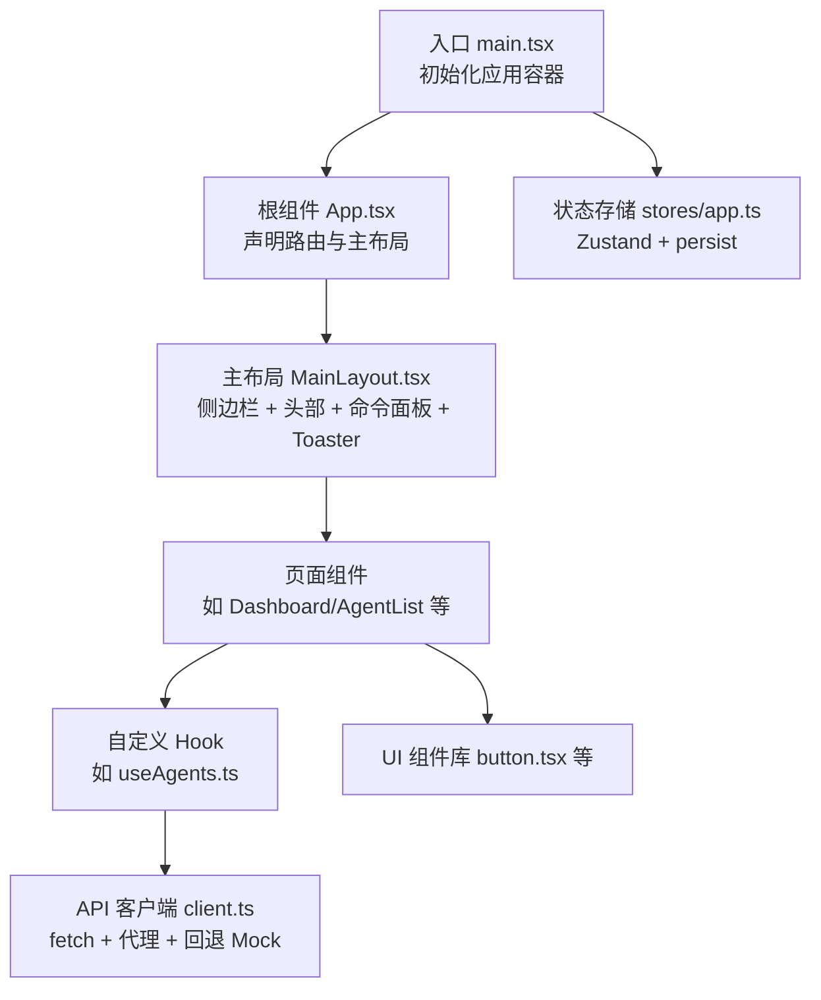
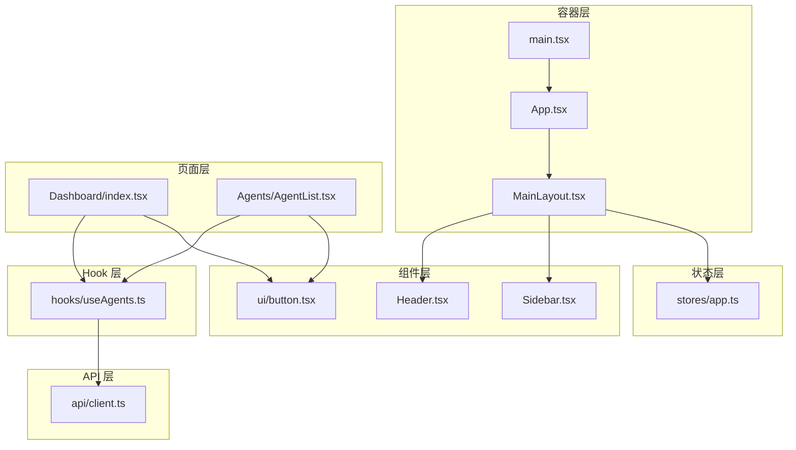
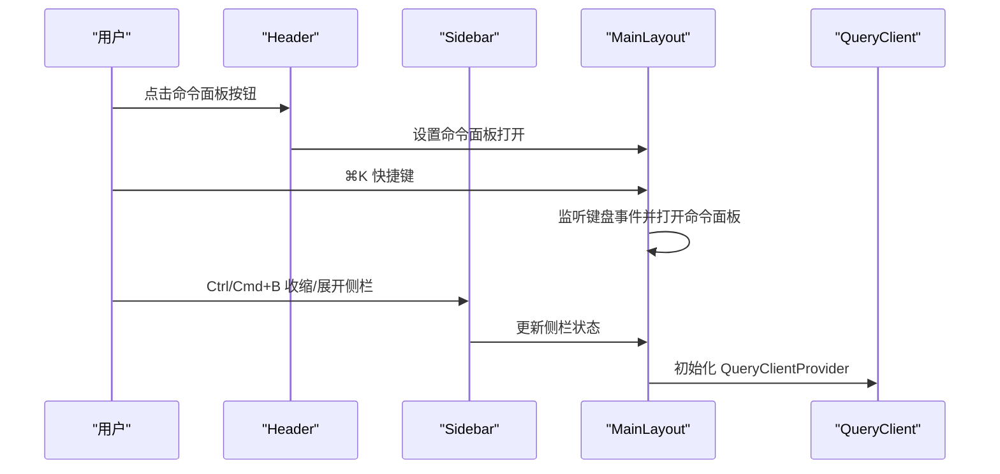
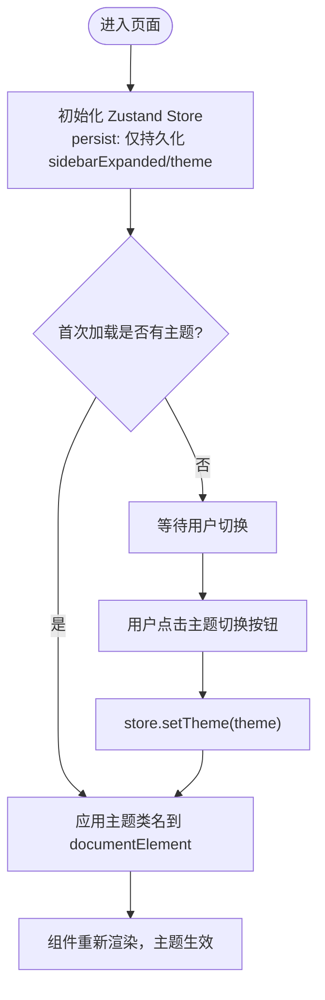
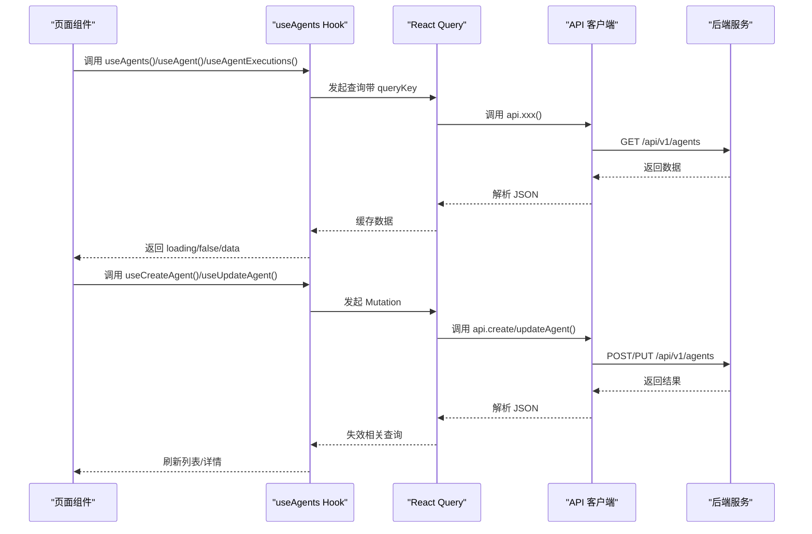
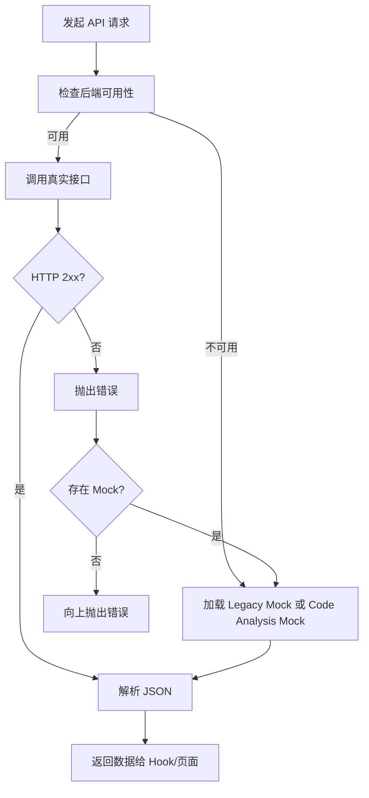
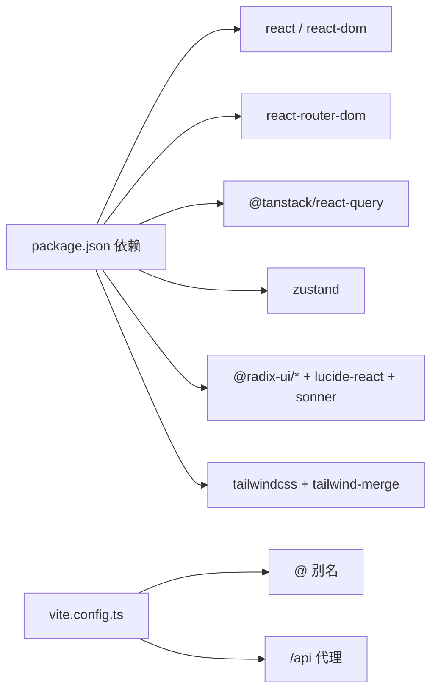

# Web 界面

<cite>
**本文引用的文件**
- [web/src/main.tsx](file://web/src/main.tsx)
- [web/src/App.tsx](file://web/src/App.tsx)
- [web/src/components/Layout/MainLayout.tsx](file://web/src/components/Layout/MainLayout.tsx)
- [web/src/components/Layout/Header.tsx](file://web/src/components/Layout/Header.tsx)
- [web/src/components/Layout/Sidebar.tsx](file://web/src/components/Layout/Sidebar.tsx)
- [web/src/stores/app.ts](file://web/src/stores/app.ts)
- [web/src/hooks/useAgents.ts](file://web/src/hooks/useAgents.ts)
- [web/src/pages/Agents/AgentList.tsx](file://web/src/pages/Agents/AgentList.tsx)
- [web/src/pages/Dashboard/index.tsx](file://web/src/pages/Dashboard/index.tsx)
- [web/src/components/ui/button.tsx](file://web/src/components/ui/button.tsx)
- [web/src/api/client.ts](file://web/src/api/client.ts)
- [web/src/lib/utils.ts](file://web/src/lib/utils.ts)
- [web/package.json](file://web/package.json)
- [web/tsconfig.json](file://web/tsconfig.json)
- [web/vite.config.ts](file://web/vite.config.ts)
</cite>

## 目录
1. [简介](#简介)
2. [项目结构](#项目结构)
3. [核心组件](#核心组件)
4. [架构总览](#架构总览)
5. [组件详解](#组件详解)
6. [依赖关系分析](#依赖关系分析)
7. [性能考量](#性能考量)
8. [故障排查指南](#故障排查指南)
9. [结论](#结论)
10. [附录](#附录)

## 简介
本文件为 ResolveAgent Web 界面的技术文档，聚焦于基于 React + TypeScript 的前端架构设计。内容涵盖页面路由系统、组件层次结构、状态管理模式、API 集成方案、响应式设计与主题系统、组件库使用以及性能优化策略，并提供具体代码路径与最佳实践建议，帮助开发者快速理解并高效扩展 Web 前端。

## 项目结构
前端位于 web 目录，采用 Vite + React + TypeScript 技术栈，使用 Tailwind CSS 作为样式基础，Radix UI 提供可访问性组件，Zustand 管理全局状态，React Query 管理数据获取与缓存，API 层通过代理实现真实接口与本地 Mock 的自动回退。

图表来源
- [web/src/main.tsx:1-29](file://web/src/main.tsx#L1-L29)
- [web/src/App.tsx:1-93](file://web/src/App.tsx#L1-L93)
- [web/src/components/Layout/MainLayout.tsx:1-109](file://web/src/components/Layout/MainLayout.tsx#L1-L109)
- [web/src/stores/app.ts:1-50](file://web/src/stores/app.ts#L1-L50)
- [web/src/hooks/useAgents.ts:1-160](file://web/src/hooks/useAgents.ts#L1-L160)
- [web/src/api/client.ts:1-435](file://web/src/api/client.ts#L1-L435)
- [web/src/components/ui/button.tsx:1-47](file://web/src/components/ui/button.tsx#L1-L47)

章节来源
- [web/src/main.tsx:1-29](file://web/src/main.tsx#L1-L29)
- [web/src/App.tsx:1-93](file://web/src/App.tsx#L1-L93)
- [web/package.json:1-60](file://web/package.json#L1-L60)
- [web/tsconfig.json:1-26](file://web/tsconfig.json#L1-L26)
- [web/vite.config.ts:1-22](file://web/vite.config.ts#L1-L22)

## 核心组件
- 应用入口与容器：在入口文件中配置 QueryClientProvider、BrowserRouter、TooltipProvider，统一注入全局上下文。
- 根路由与页面：App 组件集中声明所有页面路由，配合 MainLayout 包裹页面内容。
- 主布局：MainLayout 负责侧边栏、头部、命令面板、通知提示等；Header 负责面包屑与主题切换；Sidebar 负责导航与键盘快捷键。
- 全局状态：Zustand 存储侧边栏展开、主题、命令面板开关等，持久化到 localStorage。
- 自定义 Hook：围绕 API 的查询与变更封装，统一缓存失效策略。
- UI 组件库：基于 Radix UI 的 Button、Dialog、Dropdown 等，结合 Tailwind CSS 与工具函数 cn 实现样式合并。
- API 客户端：统一的 fetch 请求封装，带健康检查与 Mock 回退逻辑。

章节来源
- [web/src/main.tsx:1-29](file://web/src/main.tsx#L1-L29)
- [web/src/App.tsx:1-93](file://web/src/App.tsx#L1-L93)
- [web/src/components/Layout/MainLayout.tsx:1-109](file://web/src/components/Layout/MainLayout.tsx#L1-L109)
- [web/src/components/Layout/Header.tsx:1-118](file://web/src/components/Layout/Header.tsx#L1-L118)
- [web/src/components/Layout/Sidebar.tsx:1-245](file://web/src/components/Layout/Sidebar.tsx#L1-L245)
- [web/src/stores/app.ts:1-50](file://web/src/stores/app.ts#L1-L50)
- [web/src/hooks/useAgents.ts:1-160](file://web/src/hooks/useAgents.ts#L1-L160)
- [web/src/components/ui/button.tsx:1-47](file://web/src/components/ui/button.tsx#L1-L47)
- [web/src/api/client.ts:1-435](file://web/src/api/client.ts#L1-L435)
- [web/src/lib/utils.ts:1-7](file://web/src/lib/utils.ts#L1-L7)

## 架构总览
前端采用“容器 + 页面 + 组件 + Hook + Store + API”的分层架构：
- 容器层：main.tsx、App.tsx、MainLayout.tsx
- 页面层：Dashboard、AgentList 等
- 组件层：Header、Sidebar、UI 组件（Button、Dialog 等）
- Hook 层：useAgents.ts 等，封装 React Query
- 状态层：stores/app.ts（Zustand）
- API 层：api/client.ts（fetch + 代理 + 回退）

图表来源
- [web/src/main.tsx:1-29](file://web/src/main.tsx#L1-L29)
- [web/src/App.tsx:1-93](file://web/src/App.tsx#L1-L93)
- [web/src/components/Layout/MainLayout.tsx:1-109](file://web/src/components/Layout/MainLayout.tsx#L1-L109)
- [web/src/components/Layout/Header.tsx:1-118](file://web/src/components/Layout/Header.tsx#L1-L118)
- [web/src/components/Layout/Sidebar.tsx:1-245](file://web/src/components/Layout/Sidebar.tsx#L1-L245)
- [web/src/pages/Dashboard/index.tsx:1-742](file://web/src/pages/Dashboard/index.tsx#L1-L742)
- [web/src/pages/Agents/AgentList.tsx:1-249](file://web/src/pages/Agents/AgentList.tsx#L1-L249)
- [web/src/hooks/useAgents.ts:1-160](file://web/src/hooks/useAgents.ts#L1-L160)
- [web/src/stores/app.ts:1-50](file://web/src/stores/app.ts#L1-L50)
- [web/src/api/client.ts:1-435](file://web/src/api/client.ts#L1-L435)
- [web/src/components/ui/button.tsx:1-47](file://web/src/components/ui/button.tsx#L1-L47)

## 组件详解

### 路由系统与页面组织
- 路由集中在 App.tsx 中声明，覆盖首页、仪表盘、Agent 管理、Skills、工作流、RAG、解决方案、代码分析、Playground、追踪分析、评估基准、监控告警、数据库、架构说明、设置、Demo、Mobile 等。
- 页面组件按功能域划分目录，如 Agents、Skills、Workflows、RAG、Solutions、CodeAnalysis、Dashboard 等，便于维护与扩展。

章节来源
- [web/src/App.tsx:1-93](file://web/src/App.tsx#L1-L93)

### 主布局与导航
- MainLayout：负责整体布局、命令面板（⌘K 触发）、Toaster 通知、全局主题切换（Header）。
- Header：生成面包屑、展示健康指示灯、提供命令面板触发按钮与主题切换。
- Sidebar：分组导航、键盘快捷键（Ctrl/Cmd+B 收缩/展开）、外链支持、Tooltip 提示。

图表来源
- [web/src/components/Layout/MainLayout.tsx:1-109](file://web/src/components/Layout/MainLayout.tsx#L1-L109)
- [web/src/components/Layout/Header.tsx:1-118](file://web/src/components/Layout/Header.tsx#L1-L118)
- [web/src/components/Layout/Sidebar.tsx:1-245](file://web/src/components/Layout/Sidebar.tsx#L1-L245)
- [web/src/main.tsx:1-29](file://web/src/main.tsx#L1-L29)

章节来源
- [web/src/components/Layout/MainLayout.tsx:1-109](file://web/src/components/Layout/MainLayout.tsx#L1-L109)
- [web/src/components/Layout/Header.tsx:1-118](file://web/src/components/Layout/Header.tsx#L1-L118)
- [web/src/components/Layout/Sidebar.tsx:1-245](file://web/src/components/Layout/Sidebar.tsx#L1-L245)

### 状态管理模式
- Zustand Store：保存 sidebarExpanded、selectedAgentId、commandPaletteOpen、theme，并持久化部分状态；提供切换方法。
- 主题应用：setTheme 时动态为 documentElement 添加/移除 dark 类名，实现主题切换。
- 与 UI 的联动：Header 读取 theme 并切换图标；MainLayout 通过 TooltipProvider 提供全局 Tooltip。

图表来源
- [web/src/stores/app.ts:1-50](file://web/src/stores/app.ts#L1-L50)
- [web/src/components/Layout/Header.tsx:1-118](file://web/src/components/Layout/Header.tsx#L1-L118)
- [web/src/components/Layout/MainLayout.tsx:1-109](file://web/src/components/Layout/MainLayout.tsx#L1-L109)

章节来源
- [web/src/stores/app.ts:1-50](file://web/src/stores/app.ts#L1-L50)

### 自定义 Hook 与数据流
- useAgents.ts：围绕 Agent 的增删改查、执行记录、状态、对话、长时记忆、部署信息、协作会话、访问控制与审计日志等提供查询与变更 Hook。
- 统一缓存策略：QueryClient 默认 staleTime 与 retry；Mutation 成功后主动失效相关查询，确保 UI 与服务端一致。
- 页面使用：AgentList 通过 api.listAgents 获取列表；Dashboard 使用多个 Hook 组合展示指标、活动、统计与告警。

图表来源
- [web/src/hooks/useAgents.ts:1-160](file://web/src/hooks/useAgents.ts#L1-L160)
- [web/src/api/client.ts:1-435](file://web/src/api/client.ts#L1-L435)
- [web/src/pages/Agents/AgentList.tsx:1-249](file://web/src/pages/Agents/AgentList.tsx#L1-L249)
- [web/src/pages/Dashboard/index.tsx:1-742](file://web/src/pages/Dashboard/index.tsx#L1-L742)

章节来源
- [web/src/hooks/useAgents.ts:1-160](file://web/src/hooks/useAgents.ts#L1-L160)
- [web/src/api/client.ts:1-435](file://web/src/api/client.ts#L1-L435)

### API 集成与 Mock 回退
- 健康检查：首次调用 /api/v1/health 进行后端可用性探测，缓存 30 秒，避免频繁探测。
- 代理封装：通过 Proxy 动态选择真实接口或 Mock 方法；当后端不可用或真实接口抛错时，自动回退到 Mock。
- 代码分析 Mock：根据环境变量与方法名选择特定 Mock（如 call-graphs、traffic-graphs），提升开发体验。
- 请求封装：统一 Content-Type 与错误处理，非 2xx 抛出错误并包含 message 字段。

图表来源
- [web/src/api/client.ts:1-435](file://web/src/api/client.ts#L1-L435)

章节来源
- [web/src/api/client.ts:1-435](file://web/src/api/client.ts#L1-L435)

### 页面组件设计模式
- AgentList：列表懒加载骨架屏、空态占位、下拉菜单操作（查看详情、编辑、克隆、对比、删除）、删除二次确认对话框。
- Dashboard：指标卡片、Agent 状态网格、活动时间线、执行分析、24 小时趋势、平台状态、活跃告警、快速操作与系统信息；大量使用 Tabs、ScrollArea、Separator、Skeleton 等 UI 组件。

章节来源
- [web/src/pages/Agents/AgentList.tsx:1-249](file://web/src/pages/Agents/AgentList.tsx#L1-L249)
- [web/src/pages/Dashboard/index.tsx:1-742](file://web/src/pages/Dashboard/index.tsx#L1-L742)

### UI 组件库与样式系统
- 组件库：基于 Radix UI（Dialog、Dropdown、Tooltip、Tabs、ScrollArea、Separator 等）与自定义 Button，提供丰富的交互能力。
- 样式工具：cn 函数通过 clsx 与 tailwind-merge 合并类名，避免冲突与重复。
- 主题系统：通过 Zustand 设置 theme，动态为 documentElement 添加/移除 dark 类名，实现明/暗主题切换。

章节来源
- [web/src/components/ui/button.tsx:1-47](file://web/src/components/ui/button.tsx#L1-L47)
- [web/src/lib/utils.ts:1-7](file://web/src/lib/utils.ts#L1-L7)
- [web/src/stores/app.ts:1-50](file://web/src/stores/app.ts#L1-L50)

## 依赖关系分析
- 运行时依赖：React、React DOM、React Router、@tanstack/react-query、zustand、lucide-react、@radix-ui/*、sonner、tailwindcss-animate 等。
- 开发依赖：Vite、TypeScript、Tailwind CSS、ESLint、Prettier、Testing Library、Vitest 等。
- 构建与开发：Vite 配置了 React 插件、路径别名 @ -> src、开发服务器端口与 /api 代理到后端。

图表来源
- [web/package.json:1-60](file://web/package.json#L1-L60)
- [web/vite.config.ts:1-22](file://web/vite.config.ts#L1-L22)

章节来源
- [web/package.json:1-60](file://web/package.json#L1-L60)
- [web/vite.config.ts:1-22](file://web/vite.config.ts#L1-L22)

## 性能考量
- 查询缓存：QueryClient 默认 staleTime 与 retry，减少重复请求与网络抖动影响。
- 懒加载与骨架屏：列表与复杂卡片使用 Skeleton 与占位元素，改善首屏与切换体验。
- 本地 Mock：开发环境下自动回退 Mock，避免等待后端响应，提升迭代效率。
- 样式合并：使用 cn 合并类名，避免重复与冲突，降低样式计算成本。
- 图标与组件：使用 lucide-react 与 Radix UI，体积小、可访问性强，利于性能与可维护性。

## 故障排查指南
- 后端不可用：API 客户端会进行健康检查并缓存结果；若健康检查失败，将尝试加载 Legacy Mock 或 Code Analysis Mock。可通过浏览器控制台观察错误与回退行为。
- 主题不生效：检查 Zustand store 是否正确设置 theme，并确认 documentElement 上是否存在 dark 类名。
- 路由跳转无效：检查 App.tsx 中路由配置与 MainLayout 包裹关系，确认 Link 与 useNavigate 使用正确。
- 查询未刷新：确认 Mutation 成功后是否调用了 queryClient.invalidateQueries，使相关 queryKey 失效并触发重新请求。
- Mock 不生效：确认环境变量与方法名匹配，且对应 Mock 模块已正确导出相应方法。

章节来源
- [web/src/api/client.ts:1-435](file://web/src/api/client.ts#L1-L435)
- [web/src/stores/app.ts:1-50](file://web/src/stores/app.ts#L1-L50)
- [web/src/App.tsx:1-93](file://web/src/App.tsx#L1-L93)
- [web/src/hooks/useAgents.ts:1-160](file://web/src/hooks/useAgents.ts#L1-L160)

## 结论
ResolveAgent Web 前端以清晰的分层架构与完善的工具链构建，具备良好的可维护性与扩展性。通过 React Router、Zustand、React Query 与自定义 API 客户端的组合，实现了从路由到状态、从数据到 UI 的完整闭环。配合 Radix UI 与 Tailwind CSS，既保证了开发效率也兼顾了用户体验。建议在后续迭代中持续完善 Mock 覆盖率、增强错误边界与日志埋点，并对关键页面引入更细粒度的懒加载与缓存策略。

## 附录
- 代码示例路径（不直接展示代码内容）：
  - [入口与容器初始化:1-29](file://web/src/main.tsx#L1-L29)
  - [路由与页面声明:1-93](file://web/src/App.tsx#L1-L93)
  - [主布局与命令面板:1-109](file://web/src/components/Layout/MainLayout.tsx#L1-L109)
  - [头部与面包屑:1-118](file://web/src/components/Layout/Header.tsx#L1-L118)
  - [侧边栏与导航:1-245](file://web/src/components/Layout/Sidebar.tsx#L1-L245)
  - [全局状态 Store:1-50](file://web/src/stores/app.ts#L1-L50)
  - [Agent 相关 Hook:1-160](file://web/src/hooks/useAgents.ts#L1-L160)
  - [Agent 列表页面:1-249](file://web/src/pages/Agents/AgentList.tsx#L1-L249)
  - [仪表盘页面:1-742](file://web/src/pages/Dashboard/index.tsx#L1-L742)
  - [UI Button 组件:1-47](file://web/src/components/ui/button.tsx#L1-L47)
  - [API 客户端:1-435](file://web/src/api/client.ts#L1-L435)
  - [样式工具函数:1-7](file://web/src/lib/utils.ts#L1-L7)
  - [包管理与依赖:1-60](file://web/package.json#L1-L60)
  - [TypeScript 配置:1-26](file://web/tsconfig.json#L1-L26)
  - [Vite 开发配置:1-22](file://web/vite.config.ts#L1-L22)