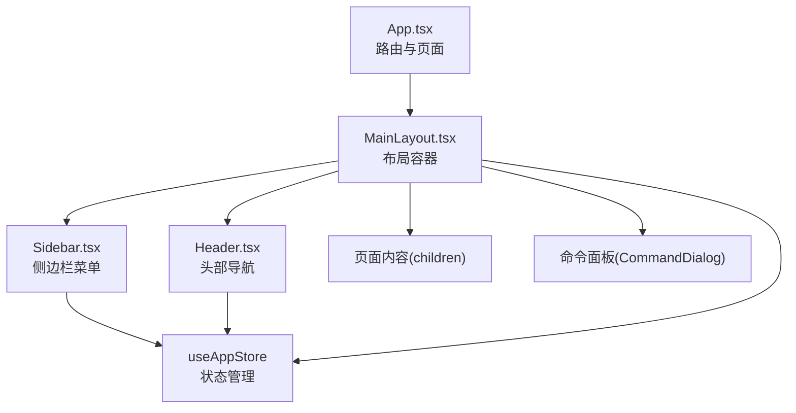
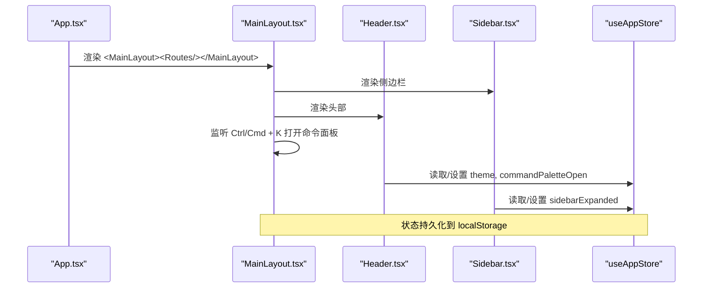
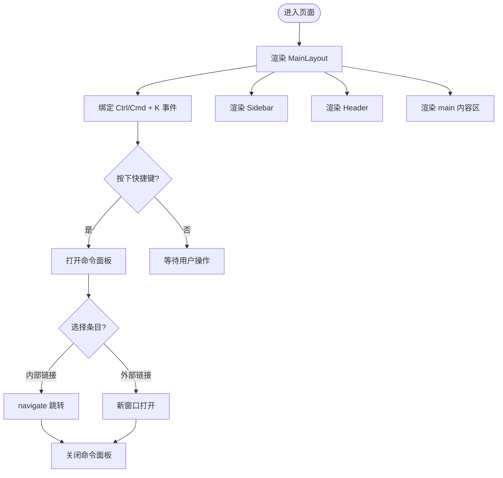
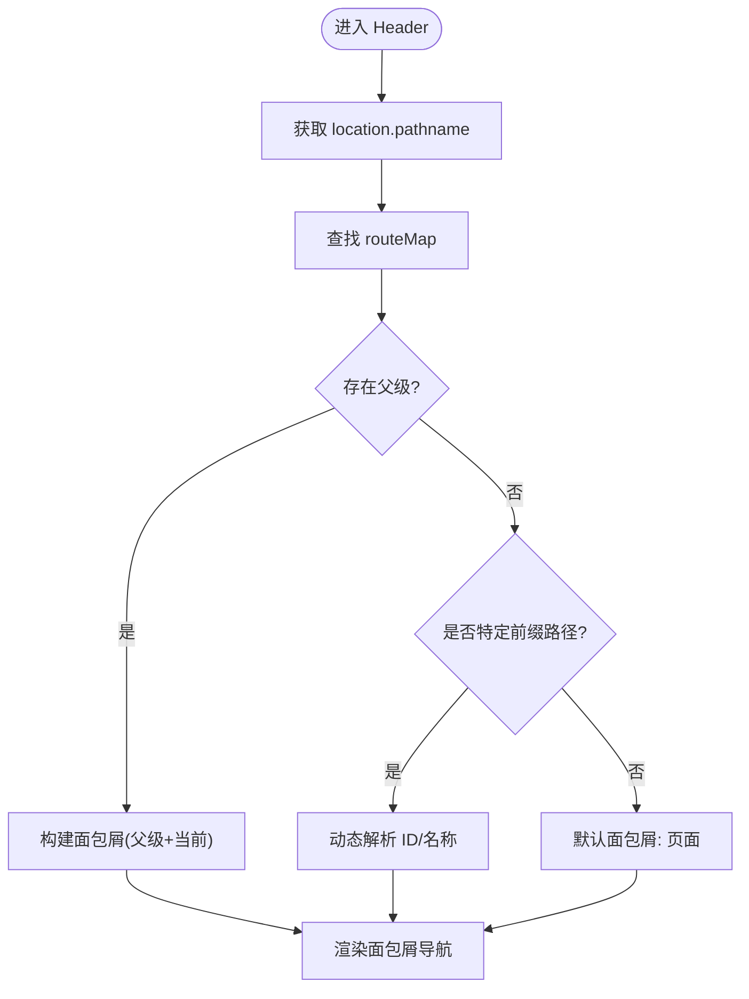
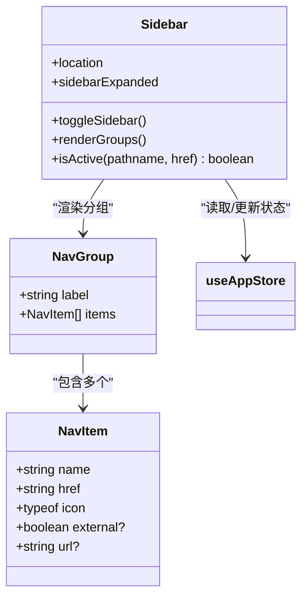
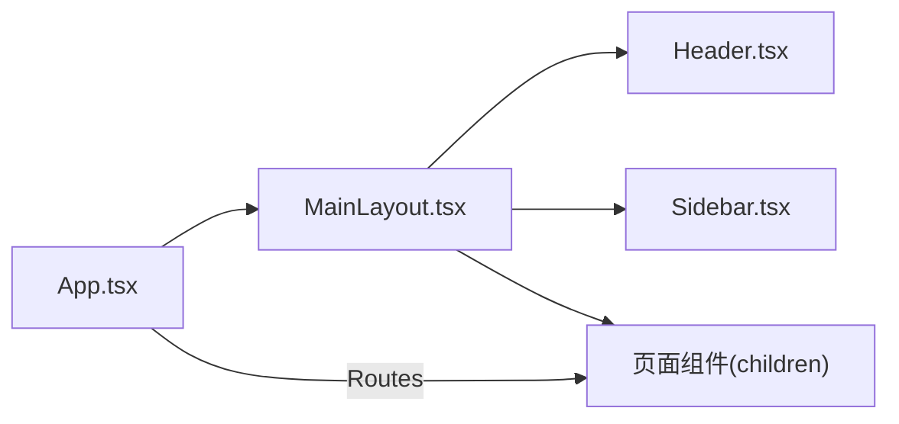
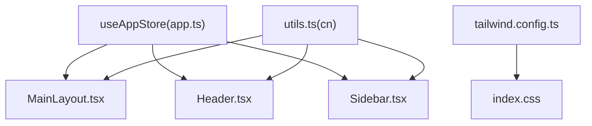

# 布局组件

<cite>
**本文引用的文件**
- [MainLayout.tsx](file://web/src/components/Layout/MainLayout.tsx)
- [Header.tsx](file://web/src/components/Layout/Header.tsx)
- [Sidebar.tsx](file://web/src/components/Layout/Sidebar.tsx)
- [App.tsx](file://web/src/App.tsx)
- [app.ts](file://web/src/stores/app.ts)
- [utils.ts](file://web/src/lib/utils.ts)
- [tailwind.config.ts](file://web/tailwind.config.ts)
- [index.css](file://web/src/index.css)
</cite>

## 目录
1. [简介](#简介)
2. [项目结构](#项目结构)
3. [核心组件](#核心组件)
4. [架构总览](#架构总览)
5. [详细组件分析](#详细组件分析)
6. [依赖关系分析](#依赖关系分析)
7. [性能考量](#性能考量)
8. [故障排查指南](#故障排查指南)
9. [结论](#结论)
10. [附录：使用示例与样式覆盖](#附录使用示例与样式覆盖)

## 简介
本技术文档聚焦 ResolveAgent Web 端的布局组件系统，系统性阐述主布局 MainLayout、头部 Header、侧边栏 Sidebar 的设计与实现。内容涵盖：
- 布局结构与响应式策略
- 导航菜单动态生成、面包屑导航、页面标题管理
- 命令面板（Command Palette）与快捷键
- 主题切换与状态管理
- Props 传递、可扩展性与样式定制方法
- 移动端适配策略与最佳实践

## 项目结构
布局相关代码位于 web/src/components/Layout 下，由三个核心组件构成：
- MainLayout：整体布局容器，承载 Header、Sidebar 与页面内容区，并集成命令面板
- Header：顶部导航条，包含面包屑、搜索触发器、主题切换与健康指示
- Sidebar：左侧导航菜单，支持分组、折叠/展开、外部链接与活动态高亮

路由与页面通过 App.tsx 注入到 MainLayout 的 children 中，形成“壳 + 内容”的布局模式。

图表来源
- [App.tsx:57-108](file://web/src/App.tsx#L57-L108)
- [MainLayout.tsx:68-122](file://web/src/components/Layout/MainLayout.tsx#L68-L122)
- [Header.tsx:58-117](file://web/src/components/Layout/Header.tsx#L58-L117)
- [Sidebar.tsx:125-254](file://web/src/components/Layout/Sidebar.tsx#L125-L254)
- [app.ts:1-50](file://web/src/stores/app.ts#L1-L50)

章节来源
- [App.tsx:57-108](file://web/src/App.tsx#L57-L108)
- [MainLayout.tsx:68-122](file://web/src/components/Layout/MainLayout.tsx#L68-L122)
- [Header.tsx:58-117](file://web/src/components/Layout/Header.tsx#L58-L117)
- [Sidebar.tsx:125-254](file://web/src/components/Layout/Sidebar.tsx#L125-L254)
- [app.ts:1-50](file://web/src/stores/app.ts#L1-L50)

## 核心组件
- MainLayout
  - 职责：提供全屏布局容器；组合 Header、Sidebar、main 内容区；挂载命令面板；监听全局快捷键打开命令面板
  - 关键能力：命令面板数据源来自本地导航项数组；支持外部链接在新窗口打开；集成 Toaster 通知
- Header
  - 职责：渲染面包屑导航；提供搜索触发按钮；主题切换；健康状态指示
  - 关键能力：根据当前路径计算面包屑；支持父级面包屑跳转；键盘提示 ⌘K
- Sidebar
  - 职责：渲染分组导航；支持折叠/展开；活动态高亮；外部链接；工具提示
  - 关键能力：按组渲染；isActive 判断精确匹配与子路径前缀匹配；收起时仅显示图标+Tooltip

章节来源
- [MainLayout.tsx:39-122](file://web/src/components/Layout/MainLayout.tsx#L39-L122)
- [Header.tsx:7-117](file://web/src/components/Layout/Header.tsx#L7-L117)
- [Sidebar.tsx:35-254](file://web/src/components/Layout/Sidebar.tsx#L35-L254)

## 架构总览
布局采用“固定外壳 + 可插拔内容”的模式：
- 外层容器使用 flex 布局，左侧 Sidebar 固定宽度，右侧区域包含 Header 和 main 内容区
- 路由层在 App.tsx 中定义，所有页面以 Suspense + lazy 方式加载，提升首屏性能
- 状态集中在 useAppStore，控制侧边栏展开、主题、命令面板开关等
- 样式基于 Tailwind CSS 与 CSS 变量，支持明暗主题切换

图表来源
- [App.tsx:57-108](file://web/src/App.tsx#L57-L108)
- [MainLayout.tsx:68-122](file://web/src/components/Layout/MainLayout.tsx#L68-L122)
- [Header.tsx:58-117](file://web/src/components/Layout/Header.tsx#L58-L117)
- [Sidebar.tsx:125-254](file://web/src/components/Layout/Sidebar.tsx#L125-L254)
- [app.ts:1-50](file://web/src/stores/app.ts#L1-L50)

## 详细组件分析

### MainLayout 主布局组件
- 布局结构
  - 外层容器使用 flex 与 h-screen，确保全屏高度
  - 左侧 Sidebar，右侧 flex-1 区域包含 Header 与 main
  - main 区域 overflow-y-auto，保证内容滚动独立
- 命令面板
  - 使用 CommandDialog 展示页面导航列表
  - 监听 Ctrl/Cmd + K 打开面板；外部链接在新窗口打开；内部链接使用 navigate 跳转
- 状态交互
  - 通过 useAppStore 控制命令面板开关
  - 集成 Toaster 用于全局消息提示

图表来源
- [MainLayout.tsx:68-122](file://web/src/components/Layout/MainLayout.tsx#L68-L122)

章节来源
- [MainLayout.tsx:39-122](file://web/src/components/Layout/MainLayout.tsx#L39-L122)

### Header 头部导航与面包屑
- 面包屑逻辑
  - 维护 routeMap 映射，支持 exact 与 parent 层级
  - 对 /agents/*、/skills/*、/workflows/*/execution 进行动态解析
  - 非匹配路径降级为“页面”
- 功能点
  - 搜索按钮触发命令面板
  - 主题切换按钮更新 store.theme，并在根节点添加/移除 dark class
  - 健康状态指示（StatusDot）

图表来源
- [Header.tsx:7-56](file://web/src/components/Layout/Header.tsx#L7-L56)
- [Header.tsx:58-117](file://web/src/components/Layout/Header.tsx#L58-L117)

章节来源
- [Header.tsx:7-117](file://web/src/components/Layout/Header.tsx#L7-L117)

### Sidebar 侧边栏菜单
- 数据结构
  - NavGroup 分组，NavItem 单个导航项，支持 external/url 字段
- 活动态判断
  - isActive 函数处理精确匹配与子路径前缀匹配，避免误匹配
- 交互与体验
  - 收起时仅显示图标，配合 Tooltip 显示名称
  - 外部链接在新标签页打开，带 ExternalLink 标识
  - 底部按钮切换展开/收起，支持 Ctrl/Cmd + B 快捷键

图表来源
- [Sidebar.tsx:35-123](file://web/src/components/Layout/Sidebar.tsx#L35-L123)
- [Sidebar.tsx:125-254](file://web/src/components/Layout/Sidebar.tsx#L125-L254)

章节来源
- [Sidebar.tsx:35-254](file://web/src/components/Layout/Sidebar.tsx#L35-L254)

### 路由与页面注入
- App.tsx 将 MainLayout 作为根布局包裹 Routes
- 页面按需懒加载，Suspense 提供加载占位
- 路由表覆盖首页、看板、Agent、Skills、工作流、RAG、数据库、架构、设置等模块

图表来源
- [App.tsx:57-108](file://web/src/App.tsx#L57-L108)
- [MainLayout.tsx:68-122](file://web/src/components/Layout/MainLayout.tsx#L68-L122)

章节来源
- [App.tsx:57-108](file://web/src/App.tsx#L57-L108)

## 依赖关系分析
- 组件耦合
  - MainLayout 依赖 Header、Sidebar 与 useAppStore
  - Header 依赖 useLocation/useNavigate、useAppStore
  - Sidebar 依赖 useLocation、useAppStore、ScrollArea、Separator、Tooltip
- 状态管理
  - useAppStore 集中管理 sidebarExpanded、theme、commandPaletteOpen
  - 主题切换通过 document.documentElement.classList 切换 dark 类名
  - 状态持久化至 localStorage（persist 中间件），部分状态选择性持久化
- 样式系统
  - Tailwind 配置启用 darkMode: 'class'，颜色通过 CSS 变量映射
  - index.css 定义明暗主题变量与基础样式
  - utils.ts 提供 cn 工具合并类名，避免冲突

图表来源
- [app.ts:1-50](file://web/src/stores/app.ts#L1-L50)
- [tailwind.config.ts:1-94](file://web/tailwind.config.ts#L1-L94)
- [index.css:1-152](file://web/src/index.css#L1-L152)
- [utils.ts:1-7](file://web/src/lib/utils.ts#L1-L7)

章节来源
- [app.ts:1-50](file://web/src/stores/app.ts#L1-L50)
- [tailwind.config.ts:1-94](file://web/tailwind.config.ts#L1-L94)
- [index.css:1-152](file://web/src/index.css#L1-L152)
- [utils.ts:1-7](file://web/src/lib/utils.ts#L1-L7)

## 性能考量
- 路由懒加载：页面组件使用 lazy 与 Suspense，减少首屏体积
- 命令面板：仅在需要时渲染，避免常驻开销
- 侧边栏折叠：收起后减少 DOM 与交互复杂度
- 主题切换：通过 class 切换，避免重绘大面积样式
- 建议
  - 对于大型页面继续采用懒加载
  - 命令面板数据量增长时可考虑分页或虚拟列表
  - 侧边栏分组过多时可考虑搜索过滤

[本节为通用指导，不直接分析具体文件]

## 故障排查指南
- 面包屑不正确
  - 检查 routeMap 是否覆盖当前路径；若为动态路径，确认解析逻辑是否正确提取参数
  - 参考面包屑生成函数与分支判断
- 命令面板无法打开
  - 确认快捷键监听已绑定；检查 store.commandPaletteOpen 是否被正确设置
- 主题切换无效
  - 检查 store.setTheme 是否调用 applyTheme；确认根节点是否存在 dark class
- 侧边栏活动态异常
  - 检查 isActive 函数对路径前缀的判断；确认 href 与 pathname 匹配规则

章节来源
- [Header.tsx:22-56](file://web/src/components/Layout/Header.tsx#L22-L56)
- [MainLayout.tsx:73-82](file://web/src/components/Layout/MainLayout.tsx#L73-L82)
- [app.ts:17-49](file://web/src/stores/app.ts#L17-L49)
- [Sidebar.tsx:116-123](file://web/src/components/Layout/Sidebar.tsx#L116-L123)

## 结论
ResolveAgent 的布局组件系统以 MainLayout 为核心，结合 Header 与 Sidebar 提供稳定的应用外壳。通过 useAppStore 统一管理状态，Tailwind 与 CSS 变量支撑主题与样式定制。面包屑、命令面板、快捷键与懒加载共同提升了用户体验与性能。该布局具备良好的扩展性，便于新增页面与导航项。

[本节为总结，不直接分析具体文件]

## 附录：使用示例与样式覆盖

### 使用示例
- 在 App.tsx 中将页面组件作为 MainLayout 的子节点传入，即可自动获得布局外壳
- 新增页面只需在 Routes 中添加路由，无需修改布局
- 新增导航项可在 Sidebar 的 navGroups 中添加 NavItem，或在 MainLayout 的命令面板导航数组中添加条目

章节来源
- [App.tsx:57-108](file://web/src/App.tsx#L57-L108)
- [Sidebar.tsx:48-114](file://web/src/components/Layout/Sidebar.tsx#L48-L114)
- [MainLayout.tsx:39-66](file://web/src/components/Layout/MainLayout.tsx#L39-L66)

### 样式覆盖方法
- 主题色与变量
  - 通过 index.css 中的 CSS 变量调整明暗主题配色
  - tailwind.config.ts 中 colors 映射到 HSL 变量，便于统一风格
- 布局尺寸与间距
  - 使用 Tailwind 类名调整 padding、margin、gap 等
  - 侧边栏宽度通过 w-60/w-16 切换，可按需自定义
- 字体与动画
  - 在 tailwind.config.ts 中扩展 fontFamily 与 keyframes/animation
  - 在 index.css 中追加自定义动画类

章节来源
- [index.css:5-88](file://web/src/index.css#L5-L88)
- [tailwind.config.ts:7-90](file://web/tailwind.config.ts#L7-L90)

### 移动端适配策略
- 当前布局未显式针对移动端做特殊处理，主要依赖 flex 与 overflow 自适应
- 建议策略
  - 在小屏幕下隐藏 Sidebar，改用 Sheet/Drawer 弹出式菜单
  - Header 的面包屑在小屏下截断或简化
  - 命令面板在小屏下优化输入与列表展示
  - 使用 Tailwind 响应式断点（sm/md/lg/xl）逐步增强布局

[本节为概念性指导，不直接分析具体文件]