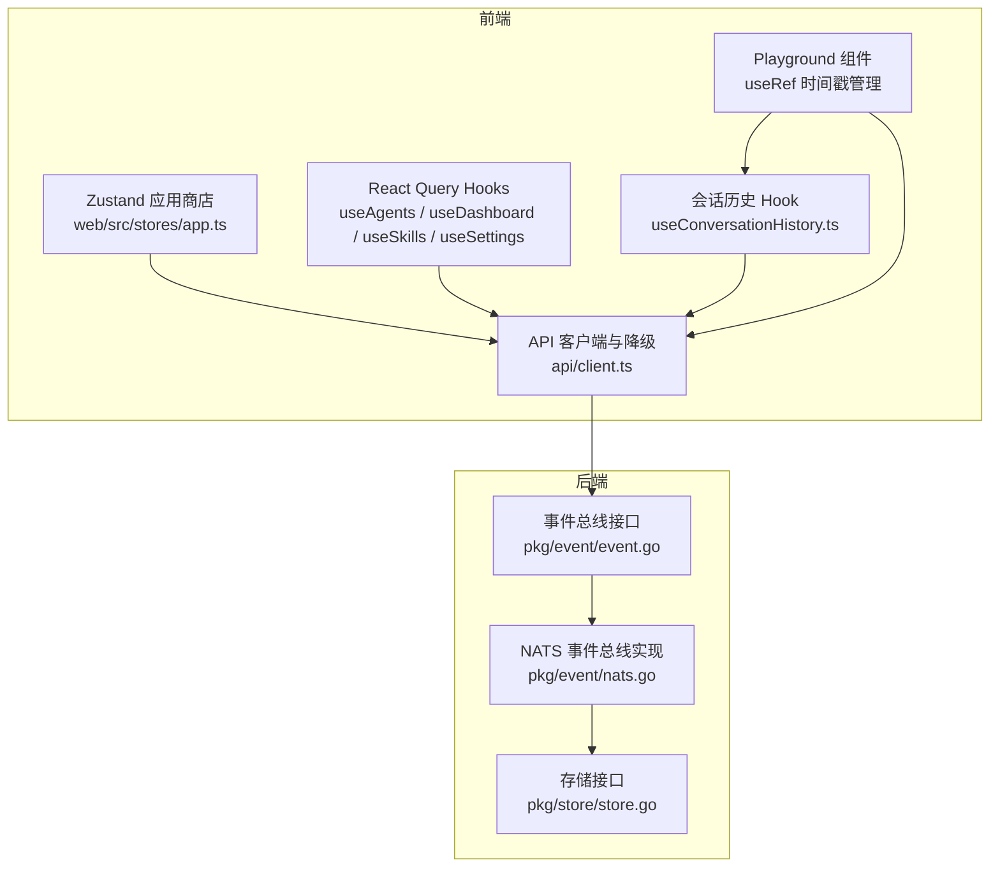
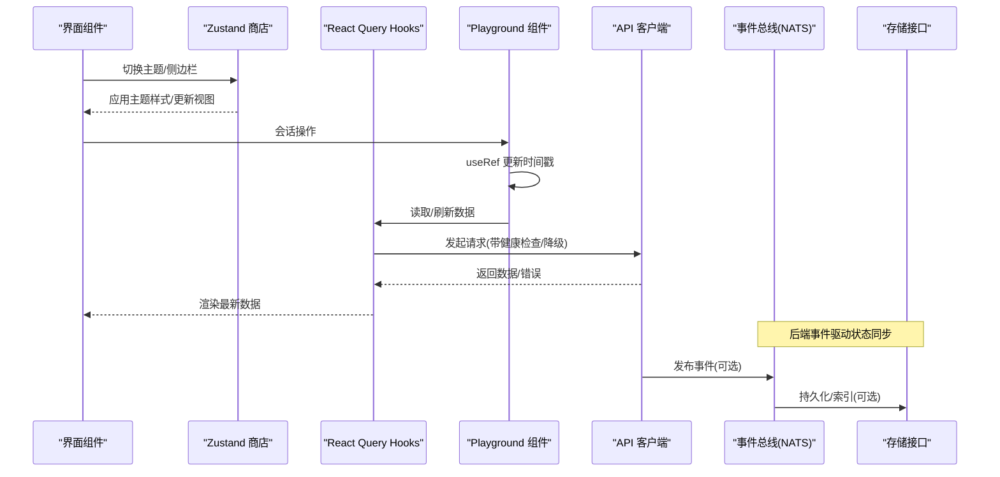
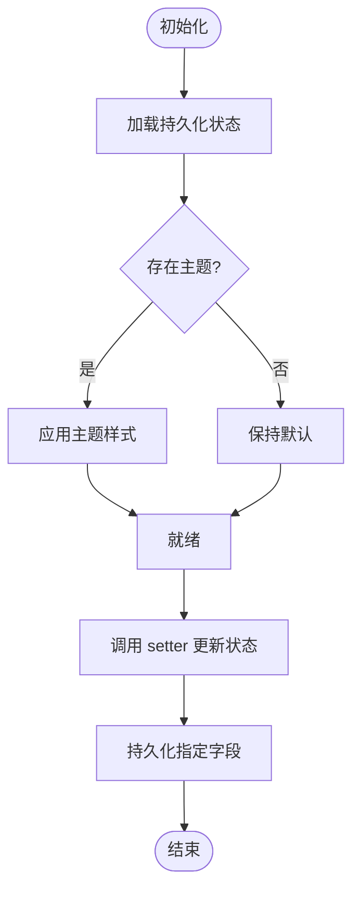
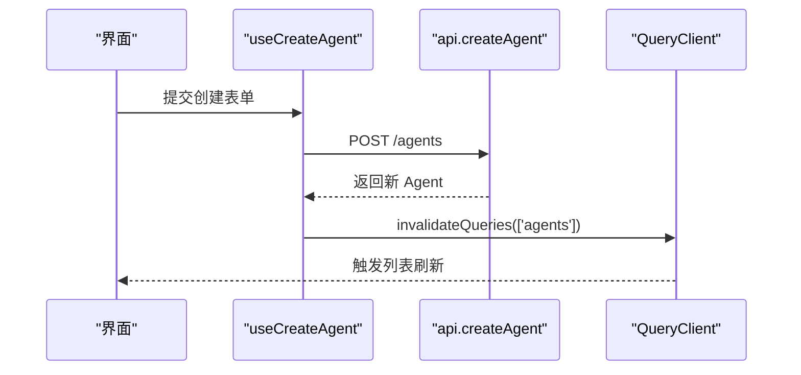
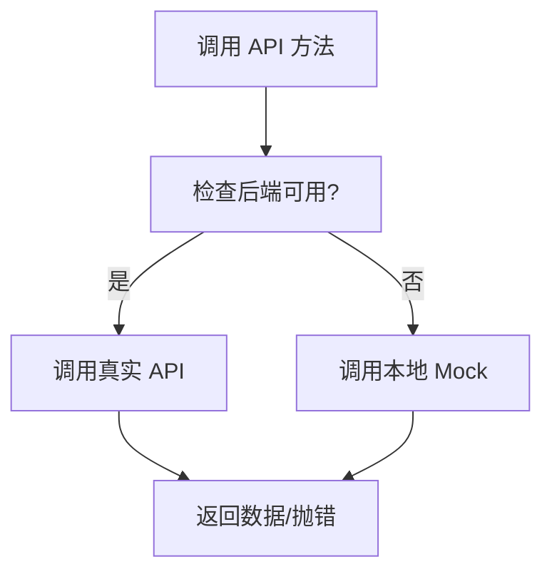
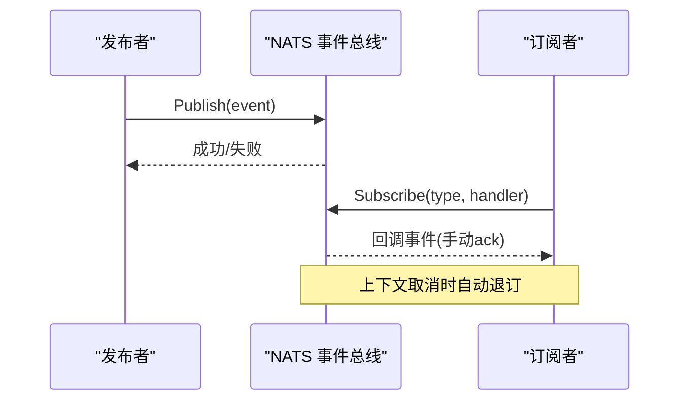
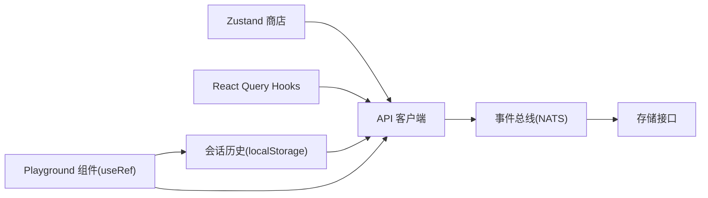

# 状态管理

<cite>
**本文引用的文件**
- [web/src/stores/app.ts](file://web/src/stores/app.ts)
- [web/src/stores/app.test.ts](file://web/src/stores/app.test.ts)
- [web/src/hooks/useAgents.ts](file://web/src/hooks/useAgents.ts)
- [web/src/hooks/useDashboard.ts](file://web/src/hooks/useDashboard.ts)
- [web/src/hooks/useSettings.ts](file://web/src/hooks/useSettings.ts)
- [web/src/hooks/useSkills.ts](file://web/src/hooks/useSkills.ts)
- [web/src/api/client.ts](file://web/src/api/client.ts)
- [web/src/pages/Playground/index.tsx](file://web/src/pages/Playground/index.tsx)
- [web/src/pages/Playground/useConversationHistory.ts](file://web/src/pages/Playground/useConversationHistory.ts)
- [pkg/event/event.go](file://pkg/event/event.go)
- [pkg/event/nats.go](file://pkg/event/nats.go)
- [pkg/store/store.go](file://pkg/store/store.go)
</cite>

## 更新摘要
**变更内容**
- 更新了 Playground 组件的状态管理实现，从普通变量迁移到 useRef hook
- 增强了会话时间戳管理的生命周期安全性
- 改进了消息持久化和历史加载的可靠性
- 优化了 Agent 切换操作的状态同步机制

## 目录
1. [简介](#简介)
2. [项目结构](#项目结构)
3. [核心组件](#核心组件)
4. [架构总览](#架构总览)
5. [详细组件分析](#详细组件分析)
6. [依赖关系分析](#依赖关系分析)
7. [性能考虑](#性能考虑)
8. [故障排查指南](#故障排查指南)
9. [结论](#结论)
10. [附录](#附录)

## 简介
本技术文档聚焦 ResolveAgent 的状态管理，覆盖全局状态设计、状态更新机制与持久化策略；阐述应用商店（Store）的设计模式、状态订阅与同步策略；并提供最佳实践、性能优化与调试技巧。同时给出具体示例、状态迁移方法与备份恢复机制的落地方案。

**最新更新**：Playground 组件已采用 useRef 管理会话创建时间戳，确保 React 组件生命周期安全和避免闭包陷阱问题。

## 项目结构
前端采用"局部状态 + 查询缓存 + 全局 UI Store"的分层状态管理：
- 全局 UI 状态：使用 Zustand 维护主题、侧边栏等跨页面共享的轻量 UI 状态，并持久化到本地存储。
- 数据状态：通过 React Query 在 hooks 中统一管理远端数据的请求、缓存与失效。
- 会话历史：使用自定义 Hook 将对话历史持久化到 localStorage，提供增删改查能力。
- **会话时间戳管理**：Playground 组件使用 useRef 管理会话创建时间戳，确保生命周期安全。
- 后端事件总线：基于 NATS 的事件发布/订阅，用于跨进程/服务的事件驱动状态同步。
- 后端存储抽象：统一的 Store 接口定义，便于扩展不同持久化实现。



**图表来源**
- [web/src/stores/app.ts:1-50](file://web/src/stores/app.ts#L1-L50)
- [web/src/hooks/useAgents.ts:1-160](file://web/src/hooks/useAgents.ts#L1-L160)
- [web/src/pages/Playground/index.tsx:114-234](file://web/src/pages/Playground/index.tsx#L114-L234)
- [web/src/pages/Playground/useConversationHistory.ts:1-112](file://web/src/pages/Playground/useConversationHistory.ts#L1-L112)
- [web/src/api/client.ts:45-90](file://web/src/api/client.ts#L45-L90)
- [pkg/event/event.go:1-23](file://pkg/event/event.go#L1-L23)
- [pkg/event/nats.go:122-201](file://pkg/event/nats.go#L122-L201)
- [pkg/store/store.go:1-14](file://pkg/store/store.go#L1-L14)

**章节来源**
- [web/src/stores/app.ts:1-50](file://web/src/stores/app.ts#L1-L50)
- [web/src/hooks/useAgents.ts:1-160](file://web/src/hooks/useAgents.ts#L1-L160)
- [web/src/pages/Playground/index.tsx:1-693](file://web/src/pages/Playground/index.tsx#L1-L693)
- [web/src/pages/Playground/useConversationHistory.ts:1-112](file://web/src/pages/Playground/useConversationHistory.ts#L1-L112)
- [web/src/api/client.ts:45-90](file://web/src/api/client.ts#L45-L90)
- [pkg/event/event.go:1-23](file://pkg/event/event.go#L1-L23)
- [pkg/event/nats.go:122-201](file://pkg/event/nats.go#L122-L201)
- [pkg/store/store.go:1-14](file://pkg/store/store.go#L1-L14)

## 核心组件
- 全局 UI 商店（Zustand）
  - 职责：维护跨页面共享的 UI 状态（主题、侧边栏展开、选中 Agent、命令面板开关），并在初始化时应用主题样式。
  - 持久化：仅持久化必要字段（如主题与侧边栏展开态），避免污染敏感或冗余数据。
  - 副作用：设置主题时同步 DOM class，保证 UI 即时生效。
- 数据状态（React Query Hooks）
  - 职责：封装对后端的读操作，统一 queryKey 管理，自动缓存与按需刷新。
  - 变更触发：写操作成功后通过 invalidateQueries 使相关列表/详情失效，驱动重新拉取。
- 会话历史（localStorage）
  - 职责：维护当前用户对话历史，支持保存、删除、按 Agent 过滤、清空等操作。
  - 持久化：每次变化写入 localStorage，限制最大条目数，异常时静默处理。
- **会话时间戳管理（useRef）**
  - 职责：使用 useRef 管理会话创建时间戳，确保在组件生命周期内保持引用稳定。
  - 优势：避免闭包陷阱，防止 stale closure 导致的时间戳不一致问题。
  - 应用场景：新对话创建、历史对话加载、Agent 切换时的时间戳同步。
- API 客户端与降级
  - 职责：统一 HTTP 请求封装、错误处理、健康检查缓存、开发环境 Mock 回退。
  - 降级策略：后端不可用时自动切换到本地 Mock，保障开发体验与演示可用性。
- 事件总线（NATS）
  - 职责：后端事件发布/订阅，支持手动确认、消费者名称、上下文取消自动退订。
  - 用途：跨服务/进程的状态同步与通知（例如执行完成、资源变更）。
- 存储接口（Store）
  - 职责：定义统一的持久化接口（健康检查、关闭），为后续多存储实现提供契约。

**章节来源**
- [web/src/stores/app.ts:1-50](file://web/src/stores/app.ts#L1-L50)
- [web/src/hooks/useAgents.ts:1-160](file://web/src/hooks/useAgents.ts#L1-L160)
- [web/src/pages/Playground/index.tsx:114-234](file://web/src/pages/Playground/index.tsx#L114-L234)
- [web/src/pages/Playground/useConversationHistory.ts:1-112](file://web/src/pages/Playground/useConversationHistory.ts#L1-L112)
- [web/src/api/client.ts:45-90](file://web/src/api/client.ts#L45-L90)
- [pkg/event/event.go:1-23](file://pkg/event/event.go#L1-L23)
- [pkg/event/nats.go:122-201](file://pkg/event/nats.go#L122-L201)
- [pkg/store/store.go:1-14](file://pkg/store/store.go#L1-L14)

## 架构总览
下图展示了从 UI 到后端事件与存储的整体状态流转：UI 状态由 Zustand 管理；业务数据由 React Query 管理；会话历史和时间戳由本地存储和 useRef 管理；后端通过事件总线进行跨进程状态同步，并通过存储接口对接持久化。



**图表来源**
- [web/src/stores/app.ts:17-48](file://web/src/stores/app.ts#L17-L48)
- [web/src/hooks/useAgents.ts:36-57](file://web/src/hooks/useAgents.ts#L36-L57)
- [web/src/pages/Playground/index.tsx:114-234](file://web/src/pages/Playground/index.tsx#L114-L234)
- [web/src/api/client.ts:45-90](file://web/src/api/client.ts#L45-L90)
- [pkg/event/nats.go:122-201](file://pkg/event/nats.go#L122-L201)
- [pkg/store/store.go:7-13](file://pkg/store/store.go#L7-L13)

## 详细组件分析

### 全局 UI 商店（Zustand）
- 设计要点
  - 使用 create 创建 store，结合 persist 中间件实现本地持久化。
  - partialize 控制持久化字段，避免不必要的数据落盘。
  - onRehydrateStorage 在恢复时应用主题样式，确保 UI 一致。
- 状态更新机制
  - 通过 set 函数原子更新状态，副作用（如 applyTheme）在 setter 内集中处理。
- 测试与验证
  - 单元测试覆盖初始值、切换逻辑与选择器行为，确保状态机稳定。



**图表来源**
- [web/src/stores/app.ts:17-48](file://web/src/stores/app.ts#L17-L48)

**章节来源**
- [web/src/stores/app.ts:1-50](file://web/src/stores/app.ts#L1-L50)
- [web/src/stores/app.test.ts:1-44](file://web/src/stores/app.test.ts#L1-L44)

### 数据状态（React Query Hooks）
- 设计要点
  - 每个领域（Agent、Dashboard、Skills、Settings）提供独立 Hook，统一 queryKey 命名规范。
  - 写操作成功后通过 invalidateQueries 精准失效相关缓存，减少全量刷新。
- 状态同步策略
  - 读：基于 queryKey 的缓存命中与后台静默更新。
  - 写：mutation 成功后主动失效，驱动 UI 自动刷新。
- 典型流程（以创建 Agent 为例）



**图表来源**
- [web/src/hooks/useAgents.ts:36-57](file://web/src/hooks/useAgents.ts#L36-L57)

**章节来源**
- [web/src/hooks/useAgents.ts:1-160](file://web/src/hooks/useAgents.ts#L1-L160)
- [web/src/hooks/useDashboard.ts:1-52](file://web/src/hooks/useDashboard.ts#L1-L52)
- [web/src/hooks/useSkills.ts:1-18](file://web/src/hooks/useSkills.ts#L1-L18)
- [web/src/hooks/useSettings.ts:1-10](file://web/src/hooks/useSettings.ts#L1-L10)

### 会话历史与时间戳管理（localStorage + useRef）
- 设计要点
  - 使用 useState 维护内存中的历史记录，useEffect 监听变化并写入 localStorage。
  - **会话时间戳使用 useRef 管理**，确保在组件生命周期内保持稳定引用。
  - 限制最大条目数，排序规则按更新时间倒序，保证最近记录优先显示。
  - 读写过程包含异常捕获，防止存储不可用导致崩溃。
- **useRef 时间戳管理的优势**
  - 避免闭包陷阱：ref 的值在组件重渲染时不会丢失，确保时间戳一致性。
  - 生命周期安全：ref 的生命周期与组件实例绑定，不会引起不必要的重渲染。
  - 性能优化：直接修改 ref.current 不会触发重新渲染，提升性能。
- 操作流程（保存/更新/删除/过滤/清空）

```mermaid
flowchart TD
S(["开始"]) --> Init["初始化 useRef 时间戳"]
Init --> Save["保存或更新记录"]
Save --> Merge["合并新旧记录并去重"]
Merge --> Sort["按更新时间降序排序"]
Sort --> Trim["裁剪至最大数量"]
Trim --> Persist["写入 localStorage"]
Persist --> Filter{"需要过滤?"}
Filter --> |是| ByAgent["按 AgentId 过滤"]
Filter --> |否| Done(["结束"])
ByAgent --> Done
Note: 所有时间戳操作都通过 conversationCreatedRef.current 访问
```

**图表来源**
- [web/src/pages/Playground/index.tsx:114-234](file://web/src/pages/Playground/index.tsx#L114-L234)
- [web/src/pages/Playground/useConversationHistory.ts:16-111](file://web/src/pages/Playground/useConversationHistory.ts#L16-L111)

**章节来源**
- [web/src/pages/Playground/index.tsx:114-234](file://web/src/pages/Playground/index.tsx#L114-L234)
- [web/src/pages/Playground/useConversationHistory.ts:1-112](file://web/src/pages/Playground/useConversationHistory.ts#L1-L112)

### API 客户端与降级
- 健康检查缓存
  - 首次探测后端可用性，结果缓存一段时间，避免频繁探测。
- 请求封装
  - 统一设置 Content-Type，解析响应体，非 2xx 抛出错误。
- 降级策略
  - 开发环境下可动态加载 Mock；后端不可用时自动回退到本地 Mock，保障演示与联调。



**图表来源**
- [web/src/api/client.ts:45-90](file://web/src/api/client.ts#L45-L90)
- [web/src/api/client.ts:305-393](file://web/src/api/client.ts#L305-L393)

**章节来源**
- [web/src/api/client.ts:45-90](file://web/src/api/client.ts#L45-L90)
- [web/src/api/client.ts:305-393](file://web/src/api/client.ts#L305-L393)

### 事件总线（NATS）
- 发布/订阅
  - 发布：序列化事件负载，发送到主题；失败时记录错误。
  - 订阅：基于主题前缀匹配事件类型，使用 durable consumer 与手动 ack，支持上下文取消自动退订。
- 健康检查
  - 提供连接健康检测，便于上层监控与自愈。



**图表来源**
- [pkg/event/nats.go:122-201](file://pkg/event/nats.go#L122-L201)

**章节来源**
- [pkg/event/event.go:1-23](file://pkg/event/event.go#L1-L23)
- [pkg/event/nats.go:122-201](file://pkg/event/nats.go#L122-L201)

### 存储接口（Store）
- 统一契约
  - Health：检查存储连接健康。
  - Close：释放资源。
- 扩展性
  - 通过接口约束，可替换不同后端（Postgres、Redis 等）实现。

**章节来源**
- [pkg/store/store.go:1-14](file://pkg/store/store.go#L1-L14)

## 依赖关系分析
- 前端
  - Zustand 商店依赖 DOM API 与浏览器存储；React Query Hooks 依赖 api/client；会话历史依赖 localStorage。
  - **Playground 组件依赖 useRef 管理会话时间戳，确保生命周期安全**。
  - 各 Hook 之间通过独立的 queryKey 解耦，避免强耦合。
- 后端
  - 事件总线依赖 NATS；存储接口抽象了持久化细节，便于替换与测试。
- 前后端交互
  - 前端通过 REST 获取/更新数据；后端可通过事件总线进行异步状态同步。



**图表来源**
- [web/src/stores/app.ts:1-50](file://web/src/stores/app.ts#L1-L50)
- [web/src/hooks/useAgents.ts:1-160](file://web/src/hooks/useAgents.ts#L1-L160)
- [web/src/pages/Playground/index.tsx:114-234](file://web/src/pages/Playground/index.tsx#L114-L234)
- [web/src/pages/Playground/useConversationHistory.ts:1-112](file://web/src/pages/Playground/useConversationHistory.ts#L1-L112)
- [web/src/api/client.ts:45-90](file://web/src/api/client.ts#L45-L90)
- [pkg/event/nats.go:122-201](file://pkg/event/nats.go#L122-L201)
- [pkg/store/store.go:1-14](file://pkg/store/store.go#L1-L14)

**章节来源**
- [web/src/stores/app.ts:1-50](file://web/src/stores/app.ts#L1-L50)
- [web/src/hooks/useAgents.ts:1-160](file://web/src/hooks/useAgents.ts#L1-L160)
- [web/src/pages/Playground/index.tsx:114-234](file://web/src/pages/Playground/index.tsx#L114-L234)
- [web/src/pages/Playground/useConversationHistory.ts:1-112](file://web/src/pages/Playground/useConversationHistory.ts#L1-L112)
- [web/src/api/client.ts:45-90](file://web/src/api/client.ts#L45-L90)
- [pkg/event/nats.go:122-201](file://pkg/event/nats.go#L122-L201)
- [pkg/store/store.go:1-14](file://pkg/store/store.go#L1-L14)

## 性能考虑
- 前端
  - 使用 React Query 的缓存与按需刷新，减少重复请求。
  - 通过 invalidateQueries 精准失效，避免全量刷新。
  - Zustand 仅持久化必要字段，降低 I/O 开销。
  - 会话历史限制最大条目数，避免 localStorage 过大。
  - **useRef 管理时间戳避免不必要的重渲染，提升性能**。
- 后端
  - 事件总线使用 durable consumer 与手动 ack，提升可靠性与吞吐。
  - 存储接口统一健康检查与资源释放，便于监控与扩容。

## 故障排查指南
- 前端
  - 主题未生效：检查 onRehydrateStorage 是否调用 applyTheme。
  - 数据不刷新：确认 mutation 成功后是否正确 invalidateQueries。
  - 后端不可用：查看健康检查缓存与降级逻辑，确认是否回退到 Mock。
  - **会话时间戳异常**：检查 useRef 引用是否正确更新，确认没有 stale closure 问题。
- 后端
  - 事件丢失：检查 NATS 连接与健康检查；确认消息 ack 是否成功。
  - 存储异常：通过 Store.Health 检查连接状态，必要时重启或切换实现。

**章节来源**
- [web/src/stores/app.ts:17-48](file://web/src/stores/app.ts#L17-L48)
- [web/src/hooks/useAgents.ts:36-57](file://web/src/hooks/useAgents.ts#L36-L57)
- [web/src/pages/Playground/index.tsx:114-234](file://web/src/pages/Playground/index.tsx#L114-L234)
- [web/src/api/client.ts:45-90](file://web/src/api/client.ts#L45-L90)
- [pkg/event/nats.go:186-201](file://pkg/event/nats.go#L186-L201)
- [pkg/store/store.go:7-13](file://pkg/store/store.go#L7-L13)

## 结论
ResolveAgent 的状态管理采用分层设计：Zustand 负责轻量全局 UI 状态，React Query 负责数据状态与缓存，localStorage 负责会话历史持久化，**useRef 负责会话时间戳的生命周期安全管理**；后端通过事件总线与存储接口实现跨进程状态同步与持久化。该架构清晰解耦、易于扩展，具备良好的性能与可观测性。**最新的 useRef 改进确保了会话时间戳的一致性和组件生命周期的安全性**。建议在生产环境中结合监控与日志完善事件流与存储健康度，持续优化缓存策略与降级路径。

## 附录

### 状态管理最佳实践
- 明确状态边界：UI 状态与业务数据分离，避免互相污染。
- 单一事实来源：同一数据只在一个地方维护（如 React Query 缓存）。
- 最小持久化：仅持久化必要字段，降低 I/O 与安全风险。
- 精确失效：写操作后只失效相关 queryKey，避免全量刷新。
- 健壮降级：前端具备 Mock 与离线能力，提升开发与演示体验。
- **生命周期安全**：使用 useRef 管理不需要触发重渲染的引用型状态，避免闭包陷阱。

### 状态迁移方法
- 版本化持久化：为持久化数据增加版本号，启动时根据版本进行迁移。
- 渐进式升级：旧格式兼容新逻辑，逐步淘汰旧字段。
- 回滚策略：保留旧数据结构快照，必要时可回滚到上一版本。

### 状态备份与恢复机制
- 前端
  - 定期导出 localStorage 关键键（如会话历史、UI 偏好）为 JSON 文件。
  - 导入时校验结构与版本，合并或覆盖现有数据。
- 后端
  - 基于 Store 接口的备份任务，定时导出关键数据。
  - 恢复时校验一致性，必要时重建索引。

### useRef 时间戳管理最佳实践
- **避免闭包陷阱**：useRef 的值在组件生命周期内保持稳定，适合存储需要跨多次渲染访问的状态。
- **性能优化**：直接修改 ref.current 不会触发重渲染，适合高频更新的场景。
- **生命周期安全**：ref 与组件实例绑定，确保在正确的上下文中访问状态。
- **适用场景**：会话时间戳、定时器引用、DOM 引用等不需要触发重渲染的状态。