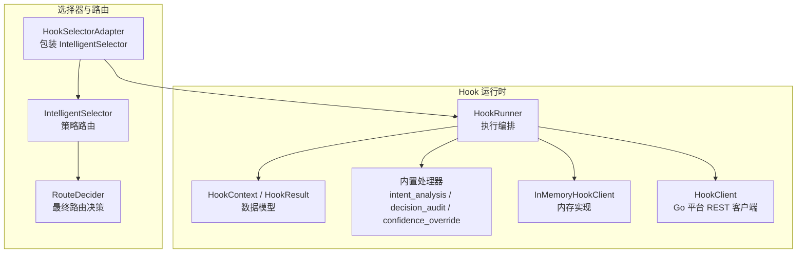
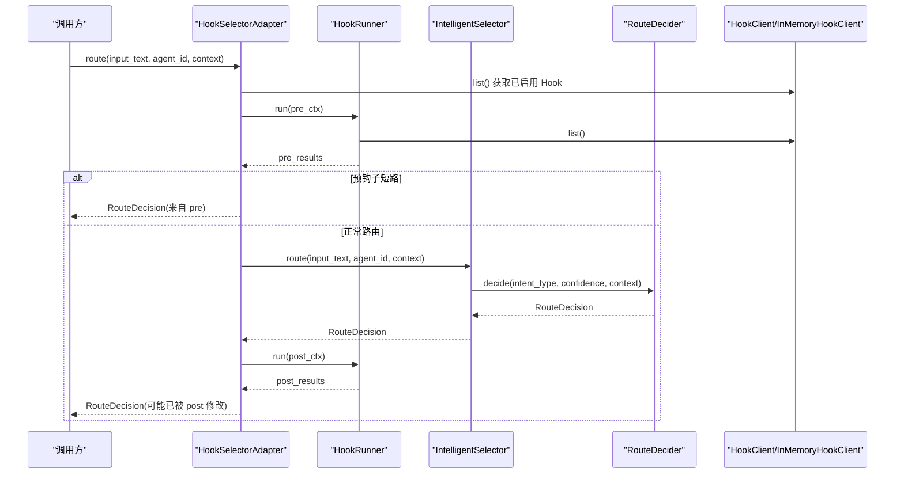
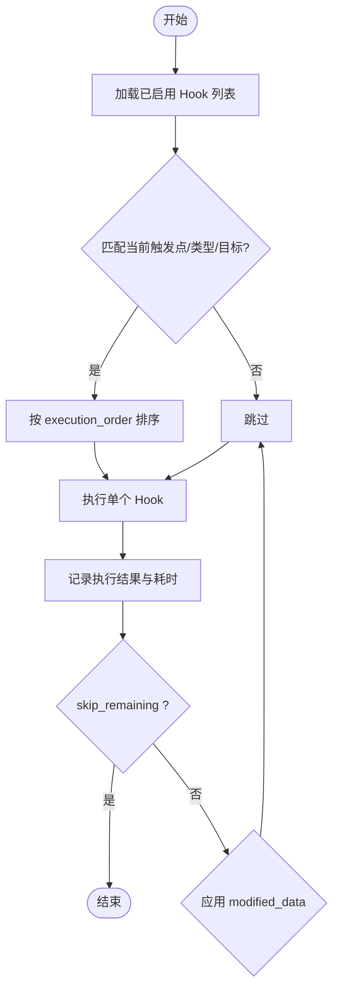
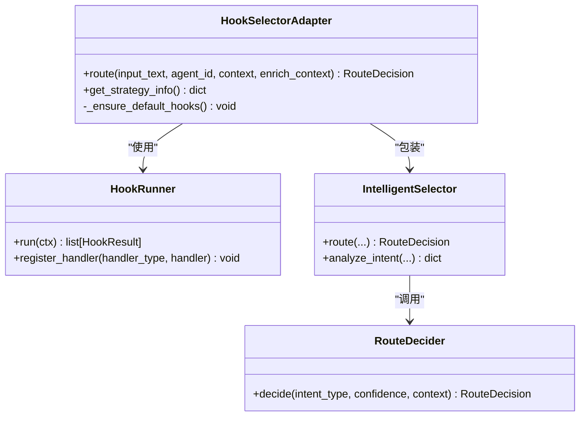
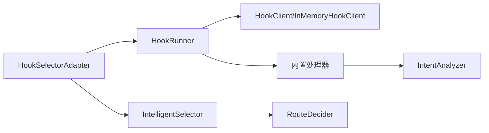

# 自定义 Hook

<cite>
**本文引用的文件**
- [__init__.py](file://python/src/resolveagent/hooks/__init__.py)
- [models.py](file://python/src/resolveagent/hooks/models.py)
- [runner.py](file://python/src/resolveagent/hooks/runner.py)
- [selector_handlers.py](file://python/src/resolveagent/hooks/selector_handlers.py)
- [memory_client.py](file://python/src/resolveagent/hooks/memory_client.py)
- [hook_client.py](file://python/src/resolveagent/store/hook_client.py)
- [hook_selector.py](file://python/src/resolveagent/selector/hook_selector.py)
- [router.py](file://python/src/resolveagent/selector/router.py)
- [selector.py](file://python/src/resolveagent/selector/selector.py)
</cite>

## 目录
1. [简介](#简介)
2. [项目结构](#项目结构)
3. [核心组件](#核心组件)
4. [架构总览](#架构总览)
5. [详细组件分析](#详细组件分析)
6. [依赖关系分析](#依赖关系分析)
7. [性能考量](#性能考量)
8. [故障排查指南](#故障排查指南)
9. [结论](#结论)
10. [附录](#附录)

## 简介
本技术文档围绕 ResolveAgent 的自定义 Hook 系统，系统性阐述其设计目标、数据模型、执行流程与扩展点。重点覆盖以下四类 Hook 场景：
- Agent 管理 Hook（触发点：agent.execute）
- 技能管理 Hook（触发点：skill.invoke）
- 工作流管理 Hook（触发点：workflow.run）
- RAG 管理 Hook（通过路由选择器与上下文注入参与决策）

文档将详细说明 Hook 的参数传递、状态管理、副作用处理、错误边界、Hook 间依赖与数据共享机制，并给出使用示例、最佳实践与常见问题解决方案。

## 项目结构
Hook 系统位于 Python 侧的 resolveagent.hooks 包中，配合 selector 子系统完成“前置/后置”拦截与增强；存储层通过 HookClient 对接 Go 平台 API，并提供 InMemoryHookClient 用于开发与测试。

图表来源
- [runner.py:17-101](file://python/src/resolveagent/hooks/runner.py#L17-L101)
- [models.py:9-34](file://python/src/resolveagent/hooks/models.py#L9-L34)
- [selector_handlers.py:18-86](file://python/src/resolveagent/hooks/selector_handlers.py#L18-L86)
- [memory_client.py:15-74](file://python/src/resolveagent/hooks/memory_client.py#L15-L74)
- [hook_client.py:14-105](file://python/src/resolveagent/store/hook_client.py#L14-L105)
- [hook_selector.py:27-150](file://python/src/resolveagent/selector/hook_selector.py#L27-L150)
- [selector.py:86-317](file://python/src/resolveagent/selector/selector.py#L86-L317)
- [router.py:17-145](file://python/src/resolveagent/selector/router.py#L17-L145)

章节来源
- [__init__.py:1-31](file://python/src/resolveagent/hooks/__init__.py#L1-L31)
- [runner.py:17-101](file://python/src/resolveagent/hooks/runner.py#L17-L101)
- [models.py:9-34](file://python/src/resolveagent/hooks/models.py#L9-L34)
- [selector_handlers.py:18-86](file://python/src/resolveagent/hooks/selector_handlers.py#L18-L86)
- [memory_client.py:15-74](file://python/src/resolveagent/hooks/memory_client.py#L15-L74)
- [hook_client.py:14-105](file://python/src/resolveagent/store/hook_client.py#L14-L105)
- [hook_selector.py:27-150](file://python/src/resolveagent/selector/hook_selector.py#L27-L150)
- [selector.py:86-317](file://python/src/resolveagent/selector/selector.py#L86-L317)
- [router.py:17-145](file://python/src/resolveagent/selector/router.py#L17-L145)

## 核心组件
- HookContext/HookResult：定义 Hook 执行的输入输出上下文与结果语义，支持 skip_remaining 短路、modified_data 数据透传、duration_ms 耗时统计。
- HookRunner：按 execution_order 顺序执行匹配的 Hook，支持 pre/post 两类，自动将 modified_data 回写到 ctx.input_data 或 ctx.output_data 以形成链式修改。
- HookClient/InMemoryHookClient：抽象了 Hook 定义的 CRUD 与执行记录查询；生产环境通过 REST 调用 Go 平台，开发测试使用内存实现。
- 内置处理器：意图分析、决策审计、置信度覆盖，作为可插拔 handler_type 注册到 Runner。
- HookSelectorAdapter：在 IntelligentSelector 前后插入 pre/post Hook，支持预短路返回决策、后处理修正 RouteDecision。
- IntelligentSelector/RouteDecider：核心路由引擎，负责意图分类、上下文增强、策略路由与最终决策。

章节来源
- [models.py:9-34](file://python/src/resolveagent/hooks/models.py#L9-L34)
- [runner.py:17-101](file://python/src/resolveagent/hooks/runner.py#L17-L101)
- [hook_client.py:14-105](file://python/src/resolveagent/store/hook_client.py#L14-L105)
- [memory_client.py:15-74](file://python/src/resolveagent/hooks/memory_client.py#L15-L74)
- [selector_handlers.py:18-86](file://python/src/resolveagent/hooks/selector_handlers.py#L18-L86)
- [hook_selector.py:27-150](file://python/src/resolveagent/selector/hook_selector.py#L27-L150)
- [selector.py:86-317](file://python/src/resolveagent/selector/selector.py#L86-L317)
- [router.py:17-145](file://python/src/resolveagent/selector/router.py#L17-L145)

## 架构总览
下图展示了从请求进入 HookSelectorAdapter，经 pre-Hook、IntelligentSelector、post-Hook，再到最终 RouteDecision 的完整链路。

图表来源
- [hook_selector.py:84-143](file://python/src/resolveagent/selector/hook_selector.py#L84-L143)
- [runner.py:49-101](file://python/src/resolveagent/hooks/runner.py#L49-L101)
- [selector.py:165-229](file://python/src/resolveagent/selector/selector.py#L165-L229)
- [router.py:34-87](file://python/src/resolveagent/selector/router.py#L34-L87)
- [hook_client.py:65-83](file://python/src/resolveagent/store/hook_client.py#L65-L83)

## 详细组件分析

### 数据模型与执行上下文
- HookContext：包含 trigger_point、hook_type、target_id、execution_id、input_data、output_data、metadata。pre 阶段主要读写 input_data，post 阶段主要读写 output_data。
- HookResult：success、modified_data、error、skip_remaining、duration_ms。skip_remaining 为 True 时，Runner 会终止后续 Hook 执行。

章节来源
- [models.py:9-34](file://python/src/resolveagent/hooks/models.py#L9-L34)

### Hook 执行器（HookRunner）
- 匹配规则：enabled、trigger_point、hook_type、target_id 精确匹配。
- 排序：按 execution_order 升序执行。
- 数据链式更新：pre 阶段的 modified_data 合并到 ctx.input_data；post 阶段的 modified_data 合并到 ctx.output_data。
- 异常隔离：单个 Hook 抛错不影响其他 Hook，记录失败结果并继续。
- 执行记录：best-effort 记录执行日志，不阻塞主流程。

图表来源
- [runner.py:49-101](file://python/src/resolveagent/hooks/runner.py#L49-L101)
- [runner.py:103-131](file://python/src/resolveagent/hooks/runner.py#L103-L131)

章节来源
- [runner.py:17-159](file://python/src/resolveagent/hooks/runner.py#L17-L159)

### 存储客户端（HookClient / InMemoryHookClient）
- HookClient：封装对 Go 平台的 REST 接口，提供 create/get/list/update/delete 以及 executions 查询。
- InMemoryHookClient：完全内存实现的等价接口，便于本地调试与单元测试。

章节来源
- [hook_client.py:14-105](file://python/src/resolveagent/store/hook_client.py#L14-L105)
- [memory_client.py:15-74](file://python/src/resolveagent/hooks/memory_client.py#L15-L74)

### 内置处理器（Selector 相关）
- intent_analysis_handler：pre 钩子，调用 IntentAnalyzer 对 input_text 进行分类，并将分类结果写入 modified_data.intent_classification。
- decision_audit_handler：post 钩子，记录路由决策审计信息。
- confidence_override_handler：post 钩子，根据 metadata.confidence_overrides 调整 route_decision.confidence。

章节来源
- [selector_handlers.py:18-86](file://python/src/resolveagent/hooks/selector_handlers.py#L18-L86)

### Hook 选择器适配器（HookSelectorAdapter）
- 职责：在 IntelligentSelector 前后插入 pre/post Hook，支持预短路返回决策、后处理修正决策。
- 默认 Hook：首次使用时自动安装意图分析与决策审计两个默认 Hook。
- 策略：内部维护 IntelligentSelector 实例，可通过 strategy 参数切换底层路由策略。

图表来源
- [hook_selector.py:27-150](file://python/src/resolveagent/selector/hook_selector.py#L27-L150)
- [selector.py:86-317](file://python/src/resolveagent/selector/selector.py#L86-L317)
- [router.py:17-145](file://python/src/resolveagent/selector/router.py#L17-L145)

章节来源
- [hook_selector.py:27-150](file://python/src/resolveagent/selector/hook_selector.py#L27-L150)

### 路由决策引擎（IntelligentSelector / RouteDecider）
- IntelligentSelector：统一入口，支持缓存、审计、策略选择（llm/rule/hybrid），上下文增强。
- RouteDecider：基于意图类型与上下文进行最终路由决策，考虑代码上下文、高置信度工作流等场景。

章节来源
- [selector.py:86-317](file://python/src/resolveagent/selector/selector.py#L86-L317)
- [router.py:17-145](file://python/src/resolveagent/selector/router.py#L17-L145)

## 依赖关系分析
- HookRunner 依赖 HookClient（或 InMemoryHookClient）获取 Hook 定义，依赖注册的 handler_type 执行具体逻辑。
- HookSelectorAdapter 依赖 HookRunner 与 IntelligentSelector，间接依赖 RouteDecider。
- selector_handlers 依赖 selector.intent.IntentAnalyzer 进行意图分类。
- store.hook_client 依赖 BaseStoreClient 访问 Go 平台 REST API。

图表来源
- [runner.py:17-101](file://python/src/resolveagent/hooks/runner.py#L17-L101)
- [selector_handlers.py:18-86](file://python/src/resolveagent/hooks/selector_handlers.py#L18-L86)
- [hook_selector.py:27-150](file://python/src/resolveagent/selector/hook_selector.py#L27-L150)
- [selector.py:86-317](file://python/src/resolveagent/selector/selector.py#L86-L317)
- [hook_client.py:14-105](file://python/src/resolveagent/store/hook_client.py#L14-L105)

章节来源
- [runner.py:17-101](file://python/src/resolveagent/hooks/runner.py#L17-L101)
- [selector_handlers.py:18-86](file://python/src/resolveagent/hooks/selector_handlers.py#L18-L86)
- [hook_selector.py:27-150](file://python/src/resolveagent/selector/hook_selector.py#L27-L150)
- [selector.py:86-317](file://python/src/resolveagent/selector/selector.py#L86-L317)
- [hook_client.py:14-105](file://python/src/resolveagent/store/hook_client.py#L14-L105)

## 性能考量
- 缓存命中：IntelligentSelector 内部对路由决策进行缓存，避免重复计算。
- 懒加载：策略实例与 IntentAnalyzer/ContextEnricher 按需初始化，减少启动开销。
- 短路与顺序控制：通过 execution_order 与 skip_remaining 控制执行路径，降低不必要开销。
- 异步与隔离：Hook 执行采用异步调用，异常隔离，单点失败不影响整体链路。
- 建议：
  - 合理设置 execution_order，将轻量且必要的 Hook 置于前面。
  - 谨慎使用 skip_remaining，仅在明确短路条件时使用。
  - 对高频场景启用缓存，必要时通过 bypass_cache 强制刷新。

章节来源
- [selector.py:121-229](file://python/src/resolveagent/selector/selector.py#L121-L229)
- [runner.py:49-101](file://python/src/resolveagent/hooks/runner.py#L49-L101)

## 故障排查指南
- 未找到处理器：当 hook.handler_type 未在 Runner 中注册时，会记录警告并返回成功空结果。检查 handler_type 与注册逻辑。
- Hook 执行失败：异常被捕获并记录错误，不影响后续 Hook。查看日志中的 hook_id 与 error 字段定位问题。
- 数据未生效：确认 modified_data 是否写入正确的字段（pre 阶段写入 input_data，post 阶段写入 output_data）。
- 默认 Hook 未安装：HookSelectorAdapter 首次运行会自动安装默认 Hook；若未生效，检查 InMemoryHookClient 或 HookClient 的 list/create 行为。
- 路由决策异常：检查 RouteDecider 的置信度阈值与上下文字段（如 code_context、active_workflows、rag_collections）。

章节来源
- [runner.py:103-131](file://python/src/resolveagent/hooks/runner.py#L103-L131)
- [hook_selector.py:56-82](file://python/src/resolveagent/selector/hook_selector.py#L56-L82)
- [router.py:34-87](file://python/src/resolveagent/selector/router.py#L34-L87)

## 结论
ResolveAgent 的自定义 Hook 系统通过清晰的数据模型与执行编排，提供了可扩展、可观测、可组合的拦截能力。结合 IntelligentSelector 与 RouteDecider，可在 Agent、技能、工作流与 RAG 等多类场景中实现灵活的路由增强与治理。推荐在生产环境中使用 HookClient 对接 Go 平台统一管理 Hook，并在关键路径上启用审计与置信度覆盖，以获得更好的可观测性与可控性。

## 附录

### 四类 Hook 的使用要点与示例
- Agent 管理 Hook（trigger_point: agent.execute）
  - 用途：在执行 Agent 前/后进行鉴权、限流、埋点、输入清洗等。
  - 示例思路：pre 阶段校验用户权限并注入租户上下文；post 阶段记录执行耗时与结果摘要。
  - 参考路径：[runner.py:49-101](file://python/src/resolveagent/hooks/runner.py#L49-L101)、[models.py:9-34](file://python/src/resolveagent/hooks/models.py#L9-L34)

- 技能管理 Hook（trigger_point: skill.invoke）
  - 用途：在调用技能前/后进行沙箱准备、资源配额、结果脱敏等。
  - 示例思路：pre 阶段创建临时沙箱环境；post 阶段清理资源并上报指标。
  - 参考路径：[runner.py:49-101](file://python/src/resolveagent/hooks/runner.py#L49-L101)

- 工作流管理 Hook（trigger_point: workflow.run）
  - 用途：在工作流执行前后进行版本校验、依赖检查、结果归档。
  - 示例思路：pre 阶段校验工作流版本兼容性；post 阶段生成执行报告。
  - 参考路径：[runner.py:49-101](file://python/src/resolveagent/hooks/runner.py#L49-L101)

- RAG 管理 Hook（通过路由选择器与上下文注入参与）
  - 用途：在路由决策前后增强检索策略、调整置信度、记录审计。
  - 示例思路：pre 阶段注入检索集合与权重；post 阶段根据业务规则调整 confidence。
  - 参考路径：[selector_handlers.py:18-86](file://python/src/resolveagent/hooks/selector_handlers.py#L18-L86)、[router.py:34-87](file://python/src/resolveagent/selector/router.py#L34-L87)

### 最佳实践
- 明确 trigger_point 与 hook_type，避免误匹配。
- 使用 execution_order 精细控制执行顺序，将必要且轻量的 Hook 前置。
- 合理使用 skip_remaining，避免意外短路导致功能缺失。
- 通过 metadata 传递配置项（如 confidence_overrides），保持 Hook 无状态与可复用。
- 在 post 阶段仅做最小化修改，避免破坏上游决策语义。

### 常见问题
- 为什么我的 Hook 没有执行？
  - 检查 enabled、trigger_point、hook_type、target_id 是否匹配；确认 Hook 已创建并可用。
- 为什么 modified_data 没有生效？
  - 确认在 pre 阶段写入 input_data，在 post 阶段写入 output_data；确保下游读取的是正确字段。
- 如何调试 Hook 执行？
  - 查看 Runner 记录的日志，关注 hook_id、success、duration_ms、error；必要时使用 InMemoryHookClient 快速验证。