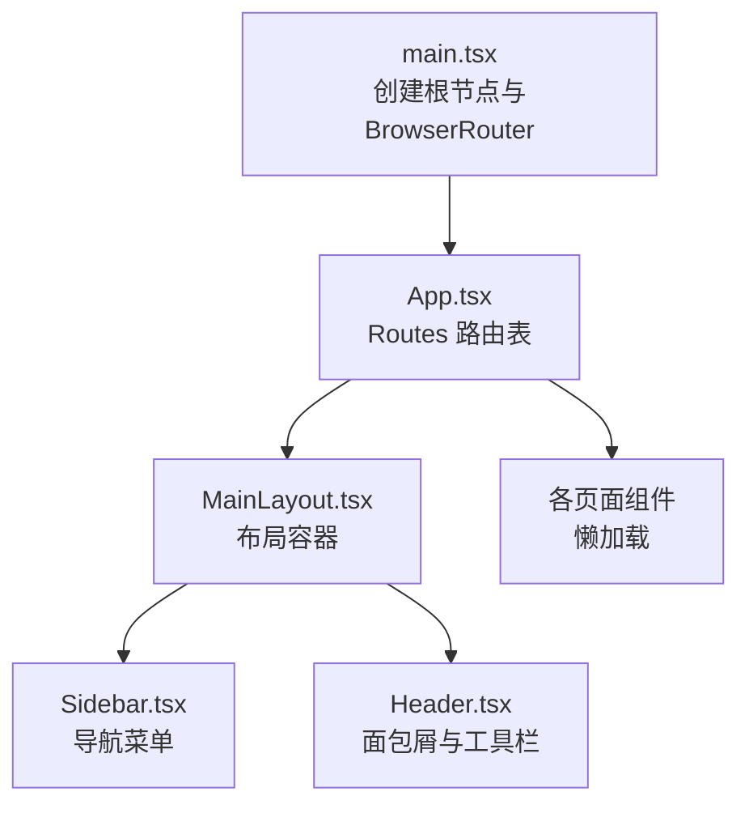
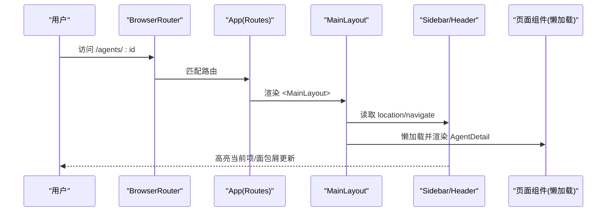
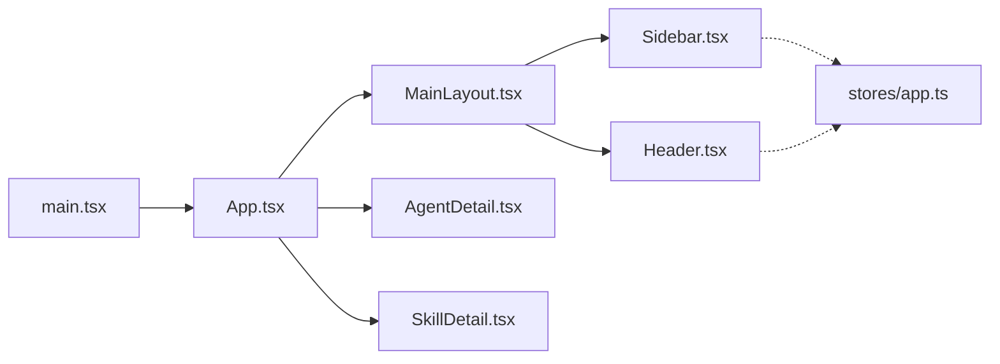

# 路由系统

<cite>
**本文引用的文件**
- [web/src/main.tsx](file://web/src/main.tsx)
- [web/src/App.tsx](file://web/src/App.tsx)
- [web/src/components/Layout/MainLayout.tsx](file://web/src/components/Layout/MainLayout.tsx)
- [web/src/components/Layout/Sidebar.tsx](file://web/src/components/Layout/Sidebar.tsx)
- [web/src/components/Layout/Header.tsx](file://web/src/components/Layout/Header.tsx)
- [web/src/stores/app.ts](file://web/src/stores/app.ts)
- [web/src/pages/Agents/AgentDetail.tsx](file://web/src/pages/Agents/AgentDetail.tsx)
- [web/src/pages/Skills/SkillDetail.tsx](file://web/src/pages/Skills/SkillDetail.tsx)
</cite>

## 目录
1. [简介](#简介)
2. [项目结构](#项目结构)
3. [核心组件](#核心组件)
4. [架构总览](#架构总览)
5. [详细组件分析](#详细组件分析)
6. [依赖关系分析](#依赖关系分析)
7. [性能考量](#性能考量)
8. [故障排查指南](#故障排查指南)
9. [结论](#结论)
10. [附录](#附录)

## 简介
本技术文档围绕 ResolveAgent Web 前端的路由系统展开，基于 React Router v6 实现。内容涵盖：
- 路由配置与组织方式（扁平化 Routes）
- 嵌套路由与主布局 MainLayout 的职责
- 动态路由参数与查询参数的使用
- 路由懒加载策略与 Suspense 降级体验
- 导航状态管理（侧边栏、命令面板、主题等）
- 面包屑与导航高亮的一致性方案
- 权限控制与路由守卫的扩展建议
- 最佳实践与常见问题排查

## 项目结构
前端采用单入口应用模式，通过 BrowserRouter 包裹全局路由上下文；App 中集中声明所有页面路由，并使用 React.lazy + Suspense 进行按需加载；MainLayout 作为统一布局容器，承载侧边栏、头部和页面内容区域。

图表来源
- [web/src/main.tsx:1-29](file://web/src/main.tsx#L1-L29)
- [web/src/App.tsx:1-111](file://web/src/App.tsx#L1-L111)
- [web/src/components/Layout/MainLayout.tsx:68-123](file://web/src/components/Layout/MainLayout.tsx#L68-L123)

章节来源
- [web/src/main.tsx:1-29](file://web/src/main.tsx#L1-L29)
- [web/src/App.tsx:1-111](file://web/src/App.tsx#L1-L111)

## 核心组件
- 路由入口与上下文
  - main.tsx：初始化 QueryClient、TooltipProvider 与 BrowserRouter，挂载 App。
  - App.tsx：集中定义 Routes，使用 lazy 导入页面组件，Suspense 提供加载态。
- 布局与导航
  - MainLayout：提供侧边栏、头部、主内容区，集成命令面板与快捷键。
  - Sidebar：分组导航、当前路径高亮、外部链接处理、收起/展开。
  - Header：根据当前路径生成面包屑，提供搜索触发与主题切换。
- 状态管理
  - stores/app.ts：使用 Zustand 管理侧边栏展开、命令面板开关、主题等。

章节来源
- [web/src/main.tsx:1-29](file://web/src/main.tsx#L1-L29)
- [web/src/App.tsx:1-111](file://web/src/App.tsx#L1-L111)
- [web/src/components/Layout/MainLayout.tsx:68-123](file://web/src/components/Layout/MainLayout.tsx#L68-L123)
- [web/src/components/Layout/Sidebar.tsx:1-255](file://web/src/components/Layout/Sidebar.tsx#L1-L255)
- [web/src/components/Layout/Header.tsx:1-118](file://web/src/components/Layout/Header.tsx#L1-L118)
- [web/src/stores/app.ts:1-50](file://web/src/stores/app.ts#L1-L50)

## 架构总览
React Router 在应用启动时注入路由上下文；App 中的 Routes 将 URL 映射到具体页面组件；MainLayout 作为外层容器渲染子路由内容；Sidebar 与 Header 通过 useLocation/useNavigate 感知并驱动导航；Zustand 存储跨组件共享的 UI 状态。

图表来源
- [web/src/main.tsx:18-28](file://web/src/main.tsx#L18-L28)
- [web/src/App.tsx:57-109](file://web/src/App.tsx#L57-L109)
- [web/src/components/Layout/MainLayout.tsx:68-123](file://web/src/components/Layout/MainLayout.tsx#L68-L123)
- [web/src/components/Layout/Sidebar.tsx:116-229](file://web/src/components/Layout/Sidebar.tsx#L116-L229)
- [web/src/components/Layout/Header.tsx:22-56](file://web/src/components/Layout/Header.tsx#L22-L56)

## 详细组件分析

### 路由配置与懒加载
- 路由组织
  - 使用 react-router-dom 的 Routes/Route 进行声明式路由。
  - 页面组件通过 React.lazy 延迟加载，配合 Suspense 提供 LoadingFallback。
- 路由清单（节选）
  - 首页与看板：/、/dashboard
  - Agent 模块：/agents、/agents/new、/agents/templates、/agents/compare、/agents/collaboration、/agents/:id、/agents/:id/edit、/agents/:id/memory、/agents/:id/analytics、/agents/:id/diagnostics、/agents/:id/deployment、/agents/:id/access、/agents/:id/executions/:execId
  - Skills：/skills、/skills/:name
  - Workflows：/workflows、/workflows/designer、/workflows/:id/execution
  - RAG：/rag/documents、/rag/collections
  - Solutions：/solutions、/solutions/:id
  - 其他：/code-analysis、/playground、/traces、/evaluation、/monitoring、/database、/architecture/*、/settings、/demo、/mobile

- 懒加载与降级
  - 每个页面以 lazy 形式引入，Suspense fallback 为旋转加载指示器。
  - 建议在大型页面或首屏关键路径上结合路由级代码分割与预取策略。

章节来源
- [web/src/App.tsx:1-111](file://web/src/App.tsx#L1-L111)

### 主布局 MainLayout
- 职责
  - 提供统一的三栏布局：左侧 Sidebar、顶部 Header、右侧主内容区。
  - 集成命令面板（CommandDialog），支持快捷键 ⌘K/Ctrl+K 打开。
  - 通过 useNavigate 实现内部跳转，外部链接在新标签页打开。
- 导航数据
  - navigationItems 集中维护导航项名称、路径、图标与是否外链标记。
- 交互
  - 监听键盘事件打开命令面板；关闭后自动聚焦恢复。

章节来源
- [web/src/components/Layout/MainLayout.tsx:39-123](file://web/src/components/Layout/MainLayout.tsx#L39-L123)

### 侧边栏与高亮逻辑
- 导航分组
  - navGroups 按功能域分组，便于维护与扩展。
- 高亮算法
  - isActive 精确匹配根路径，前缀匹配且下一字符为“/”以避免误匹配。
- 外部链接
  - 支持 external 标记，点击在新窗口打开，并在 Tooltip 显示外链标识。

章节来源
- [web/src/components/Layout/Sidebar.tsx:48-123](file://web/src/components/Layout/Sidebar.tsx#L48-L123)
- [web/src/components/Layout/Sidebar.tsx:179-229](file://web/src/components/Layout/Sidebar.tsx#L179-L229)

### 头部与面包屑
- 面包屑生成
  - routeMap 定义常见页面的标题与父级关系。
  - 对 /agents/:id、/skills/:name、/workflows/:id/execution 等动态路径进行解析。
- 交互
  - 提供命令面板触发按钮、主题切换、健康状态展示。

章节来源
- [web/src/components/Layout/Header.tsx:7-56](file://web/src/components/Layout/Header.tsx#L7-L56)
- [web/src/components/Layout/Header.tsx:58-118](file://web/src/components/Layout/Header.tsx#L58-L118)

### 动态路由参数与查询参数
- 动态参数
  - Agent 详情：/agents/:id，使用 useParams 获取 id。
  - 技能详情：/skills/:name，使用 useParams 获取 name。
  - 工作流执行：/workflows/:id/execution，使用 useParams 获取 id。
- 查询参数
  - 克隆 Agent：/agents/new?from=...，可在目标页面通过 useSearchParams 读取 from。
  - 对比 Agent：/agents/compare?a=...，可在目标页面通过 useSearchParams 读取 a。

章节来源
- [web/src/pages/Agents/AgentDetail.tsx:1-80](file://web/src/pages/Agents/AgentDetail.tsx#L1-L80)
- [web/src/pages/Skills/SkillDetail.tsx:1-31](file://web/src/pages/Skills/SkillDetail.tsx#L1-L31)

### 导航状态管理
- 全局状态
  - 侧边栏展开/收起、命令面板开关、主题模式等通过 Zustand 管理。
- 持久化
  - 主题与侧边栏状态持久化至 localStorage，刷新后保持用户偏好。
- 与路由联动
  - 通过 useLocation 计算高亮；useNavigate 进行编程式导航；命令面板内直接调用 navigate。

章节来源
- [web/src/stores/app.ts:1-50](file://web/src/stores/app.ts#L1-L50)
- [web/src/components/Layout/MainLayout.tsx:68-123](file://web/src/components/Layout/MainLayout.tsx#L68-L123)
- [web/src/components/Layout/Sidebar.tsx:125-139](file://web/src/components/Layout/Sidebar.tsx#L125-L139)

### 路由守卫与权限控制（现状与建议）
- 现状
  - 当前路由层未内置鉴权拦截；页面组件可依据自身业务进行权限判断。
- 建议方案
  - 封装 ProtectedRoute：在路由层统一校验登录态/角色，未授权时重定向至登录页。
  - 在 MainLayout 或 Header 中根据用户信息动态过滤导航项。
  - 对敏感路由（如设置、监控）增加二次确认或权限检查。

[本节为通用建议，不直接分析具体文件]

## 依赖关系分析
- 运行时依赖
  - react-router-dom：提供 BrowserRouter、Routes、Route、Link、useLocation、useNavigate、useParams。
  - @tanstack/react-query：数据请求与缓存（在 main.tsx 中注入）。
  - zustand：UI 状态管理（主题、侧边栏、命令面板）。
- 组件耦合
  - App 与 MainLayout：App 负责路由映射，MainLayout 负责布局与导航。
  - Sidebar/Header：通过 useLocation/useNavigate 与路由解耦，仅消费状态。
  - 页面组件：通过 useParams/useSearchParams 获取路由参数，通过 hooks 拉取数据。

图表来源
- [web/src/main.tsx:18-28](file://web/src/main.tsx#L18-L28)
- [web/src/App.tsx:57-109](file://web/src/App.tsx#L57-L109)
- [web/src/components/Layout/MainLayout.tsx:68-123](file://web/src/components/Layout/MainLayout.tsx#L68-L123)
- [web/src/components/Layout/Sidebar.tsx:125-229](file://web/src/components/Layout/Sidebar.tsx#L125-L229)
- [web/src/components/Layout/Header.tsx:58-118](file://web/src/components/Layout/Header.tsx#L58-L118)
- [web/src/stores/app.ts:26-49](file://web/src/stores/app.ts#L26-L49)

章节来源
- [web/src/main.tsx:1-29](file://web/src/main.tsx#L1-L29)
- [web/src/App.tsx:1-111](file://web/src/App.tsx#L1-L111)
- [web/src/stores/app.ts:1-50](file://web/src/stores/app.ts#L1-L50)

## 性能考量
- 路由级代码分割
  - 已使用 React.lazy + Suspense 对页面进行懒加载，减少首屏体积。
- 预取与预加载
  - 对高频页面可使用 router.prefetch 或 Link prefetch 提升体验。
- 资源优化
  - 图片与图标按需加载；避免在路由组件中引入重型库。
- 状态与渲染
  - 使用 Zustand 管理轻量 UI 状态，避免不必要的重渲染。
- 网络请求
  - 结合 React Query 的 staleTime、retry 等选项降低重复请求。

[本节为通用指导，不直接分析具体文件]

## 故障排查指南
- 路由不生效
  - 检查 Routes 中 path 是否与 URL 一致；注意 / 与 /xxx 的前缀匹配差异。
  - 确认 BrowserRouter 已在根节点正确包裹。
- 动态参数为空
  - 确保页面组件中使用 useParams 获取参数，并对空值做兜底。
- 懒加载白屏
  - 检查 Suspense fallback 是否正确渲染；确认 lazy 导入路径无误。
- 导航高亮异常
  - 核对 isActive 逻辑与路由层级；避免错误的前缀匹配。
- 命令面板无法打开
  - 检查键盘事件监听是否被移除；确认 store 状态更新正常。

章节来源
- [web/src/App.tsx:49-55](file://web/src/App.tsx#L49-L55)
- [web/src/components/Layout/Sidebar.tsx:116-123](file://web/src/components/Layout/Sidebar.tsx#L116-L123)
- [web/src/components/Layout/MainLayout.tsx:73-82](file://web/src/components/Layout/MainLayout.tsx#L73-L82)

## 结论
ResolveAgent 前端路由系统以 React Router v6 为核心，采用集中式路由配置与懒加载策略，结合 MainLayout 统一布局与导航，实现了清晰、可扩展的页面组织方式。通过 Zustand 管理全局 UI 状态，提升了用户体验与一致性。未来可在路由层引入统一的权限守卫与更细粒度的导航控制，进一步增强安全性与可维护性。

[本节为总结，不直接分析具体文件]

## 附录

### 路由配置示例（路径参考）
- 基础路由
  - 首页：/
  - 看板：/dashboard
- Agent 模块
  - 列表：/agents
  - 新建：/agents/new
  - 模板：/agents/templates
  - 对比：/agents/compare
  - 协作：/agents/collaboration
  - 详情：/agents/:id
  - 编辑：/agents/:id/edit
  - 记忆：/agents/:id/memory
  - 分析：/agents/:id/analytics
  - 诊断：/agents/:id/diagnostics
  - 部署：/agents/:id/deployment
  - 访问控制：/agents/:id/access
  - 执行详情：/agents/:id/executions/:execId
- Skills
  - 列表：/skills
  - 详情：/skills/:name
- Workflows
  - 列表：/workflows
  - 设计器：/workflows/designer
  - 执行：/workflows/:id/execution
- RAG
  - 文档：/rag/documents
  - 集合：/rag/collections
- Solutions
  - 列表：/solutions
  - 详情：/solutions/:id
- 其他
  - 代码分析：/code-analysis
  - Playground：/playground
  - 追踪：/traces
  - 评估：/evaluation
  - 监控：/monitoring
  - 数据库：/database
  - 架构：/architecture/*
  - 设置：/settings
  - 演示：/demo
  - 移动端：/mobile

章节来源
- [web/src/App.tsx:62-105](file://web/src/App.tsx#L62-L105)

### 路由参数传递方法
- 路径参数
  - 使用 useParams 获取 :id、:name 等动态段。
- 查询参数
  - 使用 useSearchParams 获取 ?from、?a 等键值对。
- 编程式导航
  - 使用 useNavigate 进行跳转，支持 push/replace 与状态传递。

章节来源
- [web/src/pages/Agents/AgentDetail.tsx:1-80](file://web/src/pages/Agents/AgentDetail.tsx#L1-L80)
- [web/src/pages/Skills/SkillDetail.tsx:1-31](file://web/src/pages/Skills/SkillDetail.tsx#L1-L31)

### 最佳实践建议
- 路由组织
  - 按功能域划分路由组，保持路径语义化与层次清晰。
- 懒加载
  - 对大体积页面启用懒加载，并提供合理的加载反馈。
- 导航一致性
  - 使用统一的 Sidebar/Header 管理导航与面包屑，避免分散逻辑。
- 权限控制
  - 在路由层封装 ProtectedRoute，集中处理鉴权与重定向。
- 错误处理
  - 为未知路由提供 404 页面；对懒加载失败提供重试机制。
- 可访问性
  - 为导航元素添加合适的 aria 属性；保证键盘操作可用。

[本节为通用指导，不直接分析具体文件]