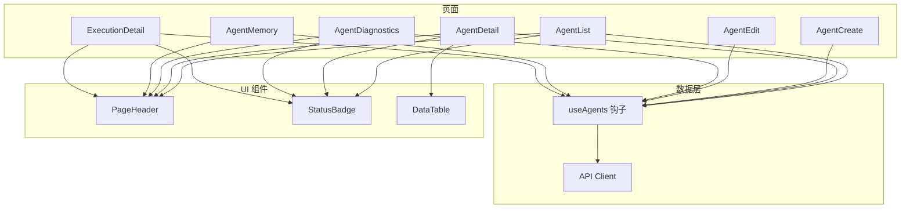
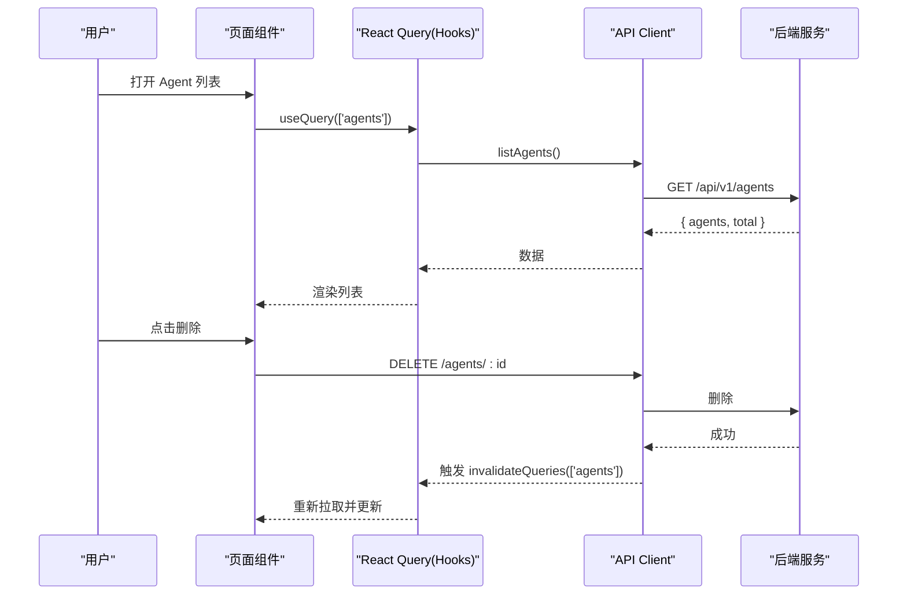
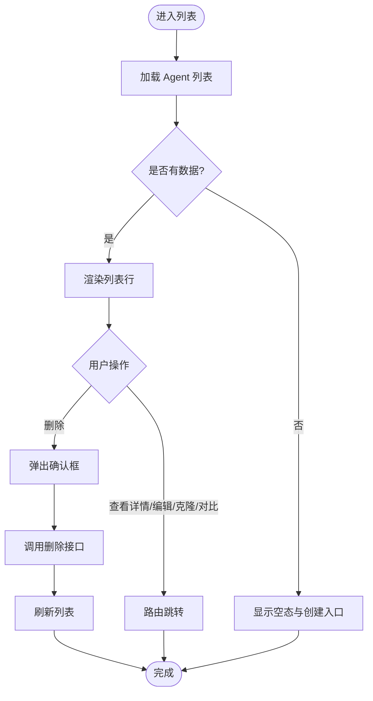
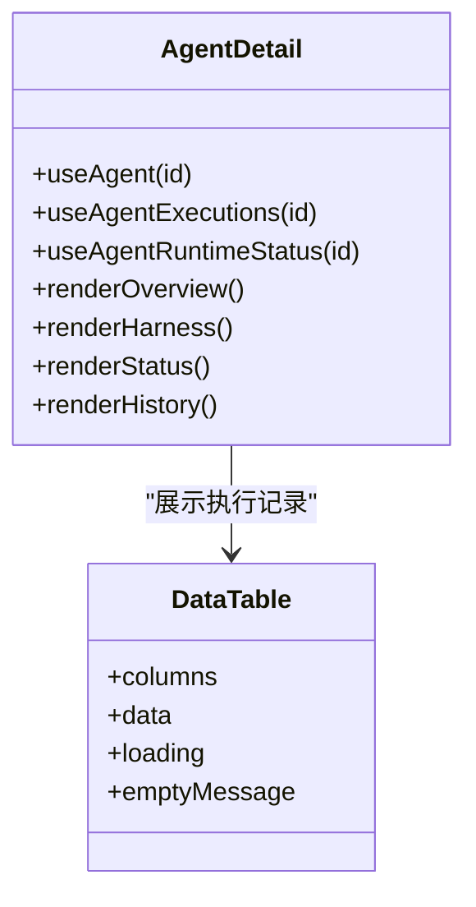
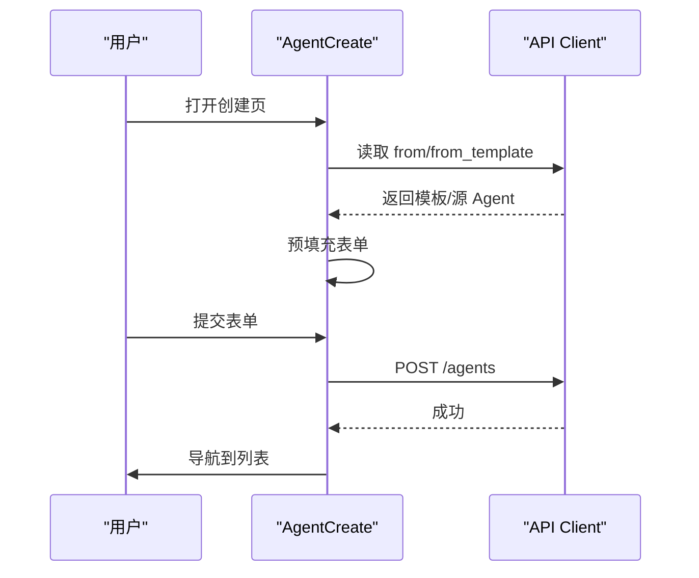
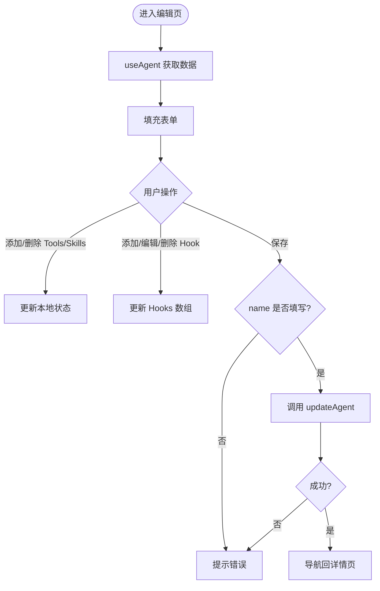
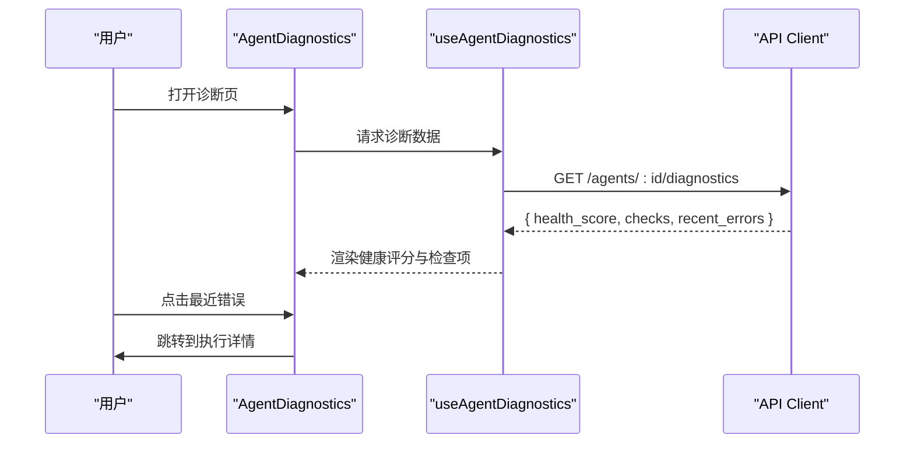
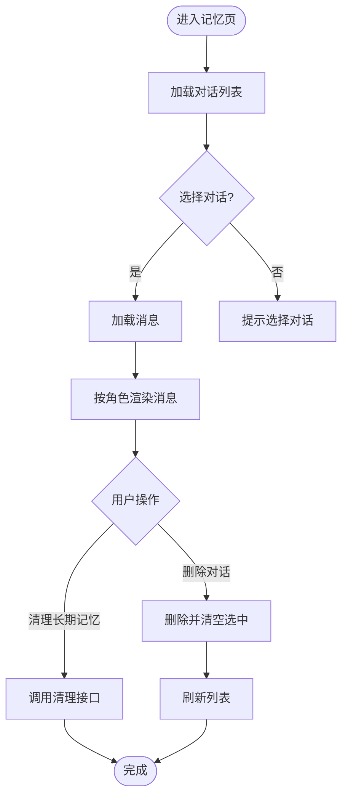
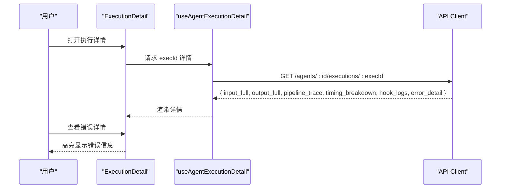
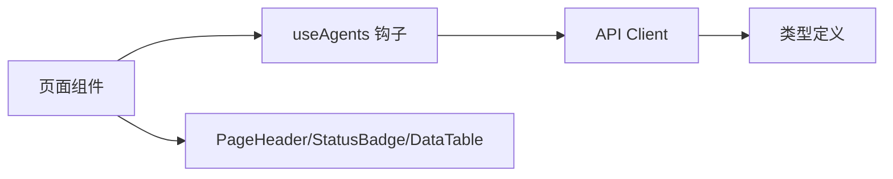

# Agent 管理页面

<cite>
**本文引用的文件**
- [AgentList.tsx](file://web/src/pages/Agents/AgentList.tsx)
- [AgentDetail.tsx](file://web/src/pages/Agents/AgentDetail.tsx)
- [AgentCreate.tsx](file://web/src/pages/Agents/AgentCreate.tsx)
- [AgentEdit.tsx](file://web/src/pages/Agents/AgentEdit.tsx)
- [AgentDiagnostics.tsx](file://web/src/pages/Agents/AgentDiagnostics.tsx)
- [AgentMemory.tsx](file://web/src/pages/Agents/AgentMemory.tsx)
- [ExecutionDetail.tsx](file://web/src/pages/Agents/ExecutionDetail.tsx)
- [useAgents.ts](file://web/src/hooks/useAgents.ts)
- [client.ts](file://web/src/api/client.ts)
- [index.ts（类型定义）](file://web/src/types/index.ts)
- [PageHeader.tsx](file://web/src/components/PageHeader.tsx)
- [StatusBadge.tsx](file://web/src/components/StatusBadge.tsx)
- [DataTable.tsx](file://web/src/components/DataTable.tsx)
</cite>

## 目录
1. [简介](#简介)
2. [项目结构](#项目结构)
3. [核心组件](#核心组件)
4. [架构总览](#架构总览)
5. [详细组件分析](#详细组件分析)
6. [依赖关系分析](#依赖关系分析)
7. [性能考虑](#性能考虑)
8. [故障排查指南](#故障排查指南)
9. [结论](#结论)
10. [附录](#附录)

## 简介
本技术文档围绕 Agent 管理页面的前端实现，系统梳理列表页、详情页、创建/编辑页、诊断页、记忆页与执行详情页的架构与实现。重点覆盖：
- 数据获取策略与缓存机制
- 状态管理模式（React Query + 本地状态）
- 表单验证与用户交互处理
- Agent 生命周期管理与执行历史追踪
- 页面间数据传递、错误处理与用户体验优化
- 代码级流程图与时序图，便于理解关键路径

## 项目结构
Agent 管理相关的前端代码集中在 web/src/pages/Agents 目录下，配合 hooks、api client 和通用 UI 组件组织。整体采用 React + TypeScript，使用 @tanstack/react-query 进行数据请求与缓存，UI 基于 shadcn/ui 风格组件。

图表来源
- [AgentList.tsx:1-249](file://web/src/pages/Agents/AgentList.tsx#L1-L249)
- [AgentDetail.tsx:1-521](file://web/src/pages/Agents/AgentDetail.tsx#L1-L521)
- [AgentCreate.tsx:1-151](file://web/src/pages/Agents/AgentCreate.tsx#L1-L151)
- [AgentEdit.tsx:1-370](file://web/src/pages/Agents/AgentEdit.tsx#L1-L370)
- [AgentDiagnostics.tsx:1-142](file://web/src/pages/Agents/AgentDiagnostics.tsx#L1-L142)
- [AgentMemory.tsx:1-239](file://web/src/pages/Agents/AgentMemory.tsx#L1-L239)
- [ExecutionDetail.tsx:1-200](file://web/src/pages/Agents/ExecutionDetail.tsx#L1-L200)
- [useAgents.ts:1-160](file://web/src/hooks/useAgents.ts#L1-L160)
- [client.ts:1-435](file://web/src/api/client.ts#L1-L435)
- [PageHeader.tsx:1-48](file://web/src/components/PageHeader.tsx#L1-L48)
- [StatusBadge.tsx:1-45](file://web/src/components/StatusBadge.tsx#L1-L45)
- [DataTable.tsx:1-93](file://web/src/components/DataTable.tsx#L1-L93)

章节来源
- [AgentList.tsx:1-249](file://web/src/pages/Agents/AgentList.tsx#L1-L249)
- [AgentDetail.tsx:1-521](file://web/src/pages/Agents/AgentDetail.tsx#L1-L521)
- [AgentCreate.tsx:1-151](file://web/src/pages/Agents/AgentCreate.tsx#L1-L151)
- [AgentEdit.tsx:1-370](file://web/src/pages/Agents/AgentEdit.tsx#L1-L370)
- [AgentDiagnostics.tsx:1-142](file://web/src/pages/Agents/AgentDiagnostics.tsx#L1-L142)
- [AgentMemory.tsx:1-239](file://web/src/pages/Agents/AgentMemory.tsx#L1-L239)
- [ExecutionDetail.tsx:1-200](file://web/src/pages/Agents/ExecutionDetail.tsx#L1-L200)
- [useAgents.ts:1-160](file://web/src/hooks/useAgents.ts#L1-L160)
- [client.ts:1-435](file://web/src/api/client.ts#L1-L435)
- [PageHeader.tsx:1-48](file://web/src/components/PageHeader.tsx#L1-L48)
- [StatusBadge.tsx:1-45](file://web/src/components/StatusBadge.tsx#L1-L45)
- [DataTable.tsx:1-93](file://web/src/components/DataTable.tsx#L1-L93)

## 核心组件
- 列表页（AgentList）：展示 Agent 列表、支持删除、克隆、跳转详情与对比；空态引导创建。
- 详情页（AgentDetail）：概览、Harness 配置、运行状态、执行记录、记忆与分析入口；Tabs 组织信息。
- 创建页（AgentCreate）：支持从模板或克隆源预填充；提交创建并导航回列表。
- 编辑页（AgentEdit）：编辑基本信息、System Prompt、Tools/Skills、Hooks、记忆与基础设施配置。
- 诊断页（AgentDiagnostics）：健康评分、检查项、最近错误；点击可跳转到执行详情。
- 记忆页（AgentMemory）：对话列表与消息流、长期记忆浏览与清理。
- 执行详情（ExecutionDetail）：输入输出、选择器管线追踪、耗时分解、Hook 日志、错误详情。

章节来源
- [AgentList.tsx:1-249](file://web/src/pages/Agents/AgentList.tsx#L1-L249)
- [AgentDetail.tsx:1-521](file://web/src/pages/Agents/AgentDetail.tsx#L1-L521)
- [AgentCreate.tsx:1-151](file://web/src/pages/Agents/AgentCreate.tsx#L1-L151)
- [AgentEdit.tsx:1-370](file://web/src/pages/Agents/AgentEdit.tsx#L1-L370)
- [AgentDiagnostics.tsx:1-142](file://web/src/pages/Agents/AgentDiagnostics.tsx#L1-L142)
- [AgentMemory.tsx:1-239](file://web/src/pages/Agents/AgentMemory.tsx#L1-L239)
- [ExecutionDetail.tsx:1-200](file://web/src/pages/Agents/ExecutionDetail.tsx#L1-L200)

## 架构总览
前端采用“页面 → 自定义 Hook → API Client → 后端”的分层架构。页面通过 useAgents 钩子发起查询与变更，统一由 api client 封装 HTTP 调用，并使用 @tanstack/react-query 进行缓存与失效刷新。UI 通过 PageHeader、StatusBadge、DataTable 等通用组件保持一致体验。

图表来源
- [useAgents.ts:5-10](file://web/src/hooks/useAgents.ts#L5-L10)
- [client.ts:95-100](file://web/src/api/client.ts#L95-L100)
- [AgentList.tsx:49-78](file://web/src/pages/Agents/AgentList.tsx#L49-L78)

章节来源
- [useAgents.ts:1-160](file://web/src/hooks/useAgents.ts#L1-L160)
- [client.ts:1-435](file://web/src/api/client.ts#L1-L435)
- [AgentList.tsx:1-249](file://web/src/pages/Agents/AgentList.tsx#L1-L249)

## 详细组件分析

### 列表页（AgentList）
- 数据获取：useEffect 中调用 api.listAgents，加载失败时 toast 提示；空态显示 EmptyState。
- 状态管理：本地 state 控制 loading、deleteTarget、deleting；删除后刷新列表。
- 用户交互：行内操作菜单提供查看、编辑、克隆、对比、删除；删除前弹窗确认。
- 错误处理：try/catch 包裹删除逻辑，toast 反馈结果。
- 性能优化：骨架屏占位提升感知速度；列表项使用 Link 直接跳转减少重渲染。

图表来源
- [AgentList.tsx:49-78](file://web/src/pages/Agents/AgentList.tsx#L49-L78)
- [AgentList.tsx:80-102](file://web/src/pages/Agents/AgentList.tsx#L80-L102)
- [AgentList.tsx:128-223](file://web/src/pages/Agents/AgentList.tsx#L128-L223)

章节来源
- [AgentList.tsx:1-249](file://web/src/pages/Agents/AgentList.tsx#L1-L249)

### 详情页（AgentDetail）
- 数据获取：并行获取 Agent 详情、运行状态、执行记录；使用 Tabs 组织内容。
- 状态管理：react-query 返回 isLoading/data；将后端 status 映射为 StatusVariant。
- 用户交互：顶部按钮支持编辑、克隆、诊断、部署、对比；Tab 切换不同视图。
- 错误处理：status 为空时显示未知；执行记录为空时显示空态。
- 性能优化：Skeleton 占位；格式化耗时与时间戳；条件渲染 Selector 模式下的编排信息。

图表来源
- [AgentDetail.tsx:76-81](file://web/src/pages/Agents/AgentDetail.tsx#L76-L81)
- [AgentDetail.tsx:132-148](file://web/src/pages/Agents/AgentDetail.tsx#L132-L148)
- [AgentDetail.tsx:501-516](file://web/src/pages/Agents/AgentDetail.tsx#L501-L516)
- [DataTable.tsx:1-93](file://web/src/components/DataTable.tsx#L1-L93)

章节来源
- [AgentDetail.tsx:1-521](file://web/src/pages/Agents/AgentDetail.tsx#L1-L521)
- [DataTable.tsx:1-93](file://web/src/components/DataTable.tsx#L1-L93)

### 创建页（AgentCreate）
- 数据获取：根据 URL 参数 from/from_template 预填充表单；调用模板列表接口匹配模板。
- 状态管理：本地 state 管理 name/type/model/prompt；loading/prefilling 控制按钮禁用。
- 表单验证：必填字段 name；提交时校验并调用 createAgent。
- 用户交互：成功后 toast 提示并导航至列表；失败提示重试。
- 错误处理：预填充失败捕获并 toast；提交失败捕获并提示。

图表来源
- [AgentCreate.tsx:27-56](file://web/src/pages/Agents/AgentCreate.tsx#L27-L56)
- [AgentCreate.tsx:58-70](file://web/src/pages/Agents/AgentCreate.tsx#L58-L70)
- [client.ts:97-99](file://web/src/api/client.ts#L97-L99)

章节来源
- [AgentCreate.tsx:1-151](file://web/src/pages/Agents/AgentCreate.tsx#L1-L151)
- [client.ts:97-99](file://web/src/api/client.ts#L97-L99)

### 编辑页（AgentEdit）
- 数据获取：useAgent 获取当前 Agent 数据并填充表单；支持 Hooks 动态增删改。
- 状态管理：本地 state 管理 name/type/model/status/mode/systemPrompt/tools/skills/hooks/memoryEnabled/sandboxType/contextStrategy。
- 表单验证：name 必填；保存时构造 UpdateAgentRequest 并调用 updateAgent。
- 用户交互：Tools/Skills 以标签形式展示并可移除；Hooks 支持添加、编辑、启用/禁用、删除。
- 错误处理：保存失败 toast 提示；成功则导航回详情页。

图表来源
- [AgentEdit.tsx:57-73](file://web/src/pages/Agents/AgentEdit.tsx#L57-L73)
- [AgentEdit.tsx:75-103](file://web/src/pages/Agents/AgentEdit.tsx#L75-L103)
- [AgentEdit.tsx:105-134](file://web/src/pages/Agents/AgentEdit.tsx#L105-L134)
- [AgentEdit.tsx:156-365](file://web/src/pages/Agents/AgentEdit.tsx#L156-L365)

章节来源
- [AgentEdit.tsx:1-370](file://web/src/pages/Agents/AgentEdit.tsx#L1-L370)

### 诊断页（AgentDiagnostics）
- 数据获取：useAgentDiagnostics 获取健康评分、检查项、最近错误；useAgent 获取名称用于标题。
- 状态管理：isLoading 控制骨架屏；overall_status 映射为 StatusVariant。
- 用户交互：点击最近错误跳转到对应执行详情；健康评分可视化。
- 错误处理：无数据时显示骨架屏；错误项用颜色区分。

图表来源
- [AgentDiagnostics.tsx:45-59](file://web/src/pages/Agents/AgentDiagnostics.tsx#L45-L59)
- [AgentDiagnostics.tsx:73-137](file://web/src/pages/Agents/AgentDiagnostics.tsx#L73-L137)
- [useAgents.ts:99-105](file://web/src/hooks/useAgents.ts#L99-L105)
- [client.ts:237-238](file://web/src/api/client.ts#L237-L238)

章节来源
- [AgentDiagnostics.tsx:1-142](file://web/src/pages/Agents/AgentDiagnostics.tsx#L1-L142)
- [useAgents.ts:99-105](file://web/src/hooks/useAgents.ts#L99-L105)
- [client.ts:237-238](file://web/src/api/client.ts#L237-L238)

### 记忆页（AgentMemory）
- 数据获取：useAgentConversations 获取对话列表；useConversationMessages 获取选中对话的消息；useAgentLongTermMemory 获取长期记忆。
- 状态管理：selectedConv 控制消息面板；删除对话后清空选中项；清理过期记忆调用 pruneMemories。
- 用户交互：左侧对话列表点击切换；右侧消息按角色渲染；长期记忆支持清理。
- 错误处理：删除/清理失败 toast 提示；空态提示选择对话。

图表来源
- [AgentMemory.tsx:30-55](file://web/src/pages/Agents/AgentMemory.tsx#L30-L55)
- [AgentMemory.tsx:92-183](file://web/src/pages/Agents/AgentMemory.tsx#L92-L183)
- [AgentMemory.tsx:185-234](file://web/src/pages/Agents/AgentMemory.tsx#L185-L234)
- [useAgents.ts:59-81](file://web/src/hooks/useAgents.ts#L59-L81)
- [client.ts:215-226](file://web/src/api/client.ts#L215-L226)

章节来源
- [AgentMemory.tsx:1-239](file://web/src/pages/Agents/AgentMemory.tsx#L1-L239)
- [useAgents.ts:59-81](file://web/src/hooks/useAgents.ts#L59-L81)
- [client.ts:215-226](file://web/src/api/client.ts#L215-L226)

### 执行详情（ExecutionDetail）
- 数据获取：useAgentExecutionDetail 获取执行详情；useAgent 获取 Agent 名称用于面包屑。
- 状态管理：isLoading 控制骨架屏；detail 为空时显示未找到。
- 用户交互：展示输入输出、选择器管线追踪、耗时分解、Hook 日志、错误详情。
- 错误处理：错误详情高亮显示；状态映射为 StatusVariant。

图表来源
- [ExecutionDetail.tsx:26-49](file://web/src/pages/Agents/ExecutionDetail.tsx#L26-L49)
- [ExecutionDetail.tsx:51-199](file://web/src/pages/Agents/ExecutionDetail.tsx#L51-L199)
- [useAgents.ts:83-89](file://web/src/hooks/useAgents.ts#L83-L89)
- [client.ts:229-230](file://web/src/api/client.ts#L229-L230)

章节来源
- [ExecutionDetail.tsx:1-200](file://web/src/pages/Agents/ExecutionDetail.tsx#L1-L200)
- [useAgents.ts:83-89](file://web/src/hooks/useAgents.ts#L83-L89)
- [client.ts:229-230](file://web/src/api/client.ts#L229-L230)

## 依赖关系分析
- 页面与 Hook：所有页面通过 useAgents 钩子获取数据，保证数据源一致性与缓存复用。
- Hook 与 API：useAgents 封装 react-query 查询与变更，调用 api client 暴露的方法。
- API 与后端：client.ts 统一封装 fetch 请求，包含健康检查、错误处理与 Mock 降级策略。
- 类型系统：types/index.ts 统一定义 Agent、Harness、Execution、Analytics、Diagnostics 等类型，确保前后端契约一致。
- UI 组件：PageHeader、StatusBadge、DataTable 被多个页面复用，提升一致性。

图表来源
- [useAgents.ts:1-160](file://web/src/hooks/useAgents.ts#L1-L160)
- [client.ts:1-435](file://web/src/api/client.ts#L1-L435)
- [index.ts:1-793](file://web/src/types/index.ts#L1-L793)
- [PageHeader.tsx:1-48](file://web/src/components/PageHeader.tsx#L1-L48)
- [StatusBadge.tsx:1-45](file://web/src/components/StatusBadge.tsx#L1-L45)
- [DataTable.tsx:1-93](file://web/src/components/DataTable.tsx#L1-L93)

章节来源
- [useAgents.ts:1-160](file://web/src/hooks/useAgents.ts#L1-L160)
- [client.ts:1-435](file://web/src/api/client.ts#L1-L435)
- [index.ts:1-793](file://web/src/types/index.ts#L1-L793)
- [PageHeader.tsx:1-48](file://web/src/components/PageHeader.tsx#L1-L48)
- [StatusBadge.tsx:1-45](file://web/src/components/StatusBadge.tsx#L1-L45)
- [DataTable.tsx:1-93](file://web/src/components/DataTable.tsx#L1-L93)

## 性能考虑
- 数据缓存与失效：使用 react-query 的 queryKey 隔离数据域；创建/更新后通过 invalidateQueries 精准刷新，避免全量重拉取。
- 骨架屏与空态：在加载与空数据场景下提供视觉反馈，降低用户等待焦虑。
- 条件渲染：仅在 selector 模式下渲染编排信息，减少不必要的 DOM 构建。
- 网络探测与健康检查：client.ts 内置后端可用性检测，失败时降级到 Mock，提升开发体验与鲁棒性。
- 列表渲染优化：列表项使用 Link 直接跳转，避免额外状态更新；表格列渲染按需定制。

[本节为通用性能建议，不直接分析具体文件]

## 故障排查指南
- 列表加载失败：检查 api.listAgents 调用与后端 /agents 接口；查看 toast 错误信息。
- 删除失败：确认 deleteAgent 调用与权限；检查后端响应与错误消息。
- 创建/编辑失败：校验表单必填字段；检查 UpdateAgentRequest 结构与后端契约。
- 诊断数据为空：确认 agentId 有效；检查 /agents/:id/diagnostics 接口。
- 记忆页消息为空：确认 selectedConv 非空；检查 /memory/conversations/:id 接口。
- 执行详情未找到：确认 execId 存在；检查 /agents/:id/executions/:execId 接口。

章节来源
- [AgentList.tsx:49-78](file://web/src/pages/Agents/AgentList.tsx#L49-L78)
- [AgentCreate.tsx:58-70](file://web/src/pages/Agents/AgentCreate.tsx#L58-L70)
- [AgentEdit.tsx:75-103](file://web/src/pages/Agents/AgentEdit.tsx#L75-L103)
- [AgentDiagnostics.tsx:45-59](file://web/src/pages/Agents/AgentDiagnostics.tsx#L45-L59)
- [AgentMemory.tsx:30-55](file://web/src/pages/Agents/AgentMemory.tsx#L30-L55)
- [ExecutionDetail.tsx:26-49](file://web/src/pages/Agents/ExecutionDetail.tsx#L26-L49)
- [client.ts:75-90](file://web/src/api/client.ts#L75-L90)

## 结论
Agent 管理页面通过清晰的分层架构与统一的类型定义，实现了列表、详情、创建/编辑、诊断、记忆与执行详情的完整闭环。数据获取采用 react-query 缓存与失效机制，状态管理结合本地 state 与全局缓存，表单验证与用户交互流畅。错误处理与用户体验优化贯穿各页面，保障稳定与易用。建议在后续迭代中继续强化：
- 更细粒度的错误分类与用户提示
- 更丰富的性能指标可视化（如延迟分布、成功率趋势）
- 更完善的权限控制与审计日志展示

[本节为总结性内容，不直接分析具体文件]

## 附录
- 页面间数据传递机制：
  - 路由参数：通过 useParams 获取 id、execId 等。
  - URL 查询参数：通过 useSearchParams 获取 from、from_template 等。
  - 组件状态：通过 useState 管理局部交互状态。
  - 全局缓存：通过 react-query 缓存跨页面共享的数据。
- 最佳实践指导：
  - 使用统一类型定义约束前后端契约。
  - 使用通用 UI 组件保持界面一致性。
  - 使用 Skeleton 与空态提升加载体验。
  - 使用 toast 提供即时反馈。
  - 使用条件渲染减少不必要计算。

[本节为补充说明，不直接分析具体文件]