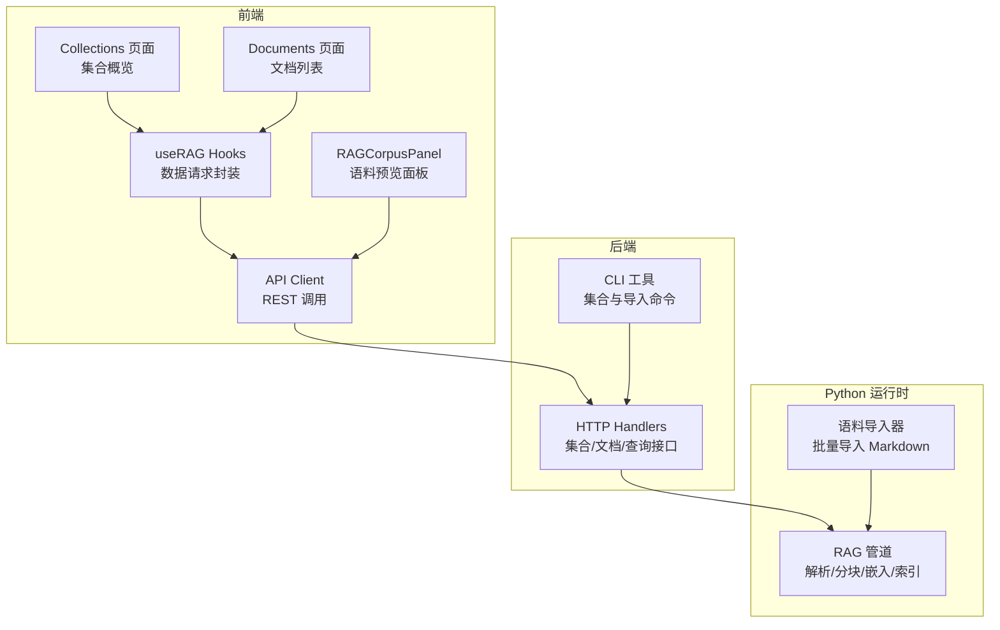
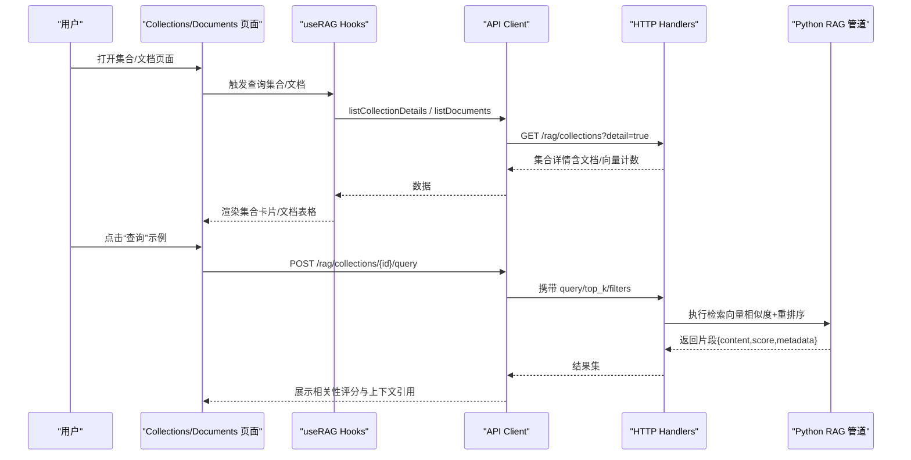
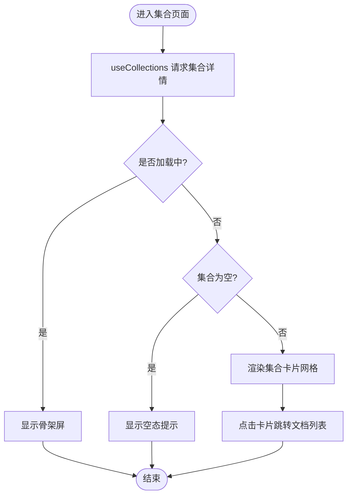
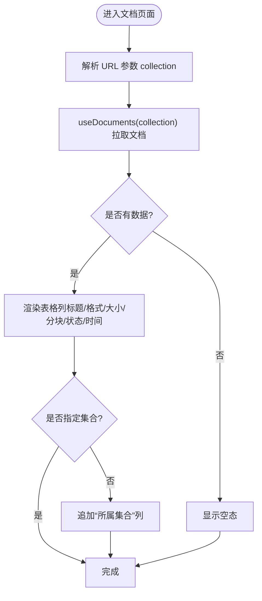
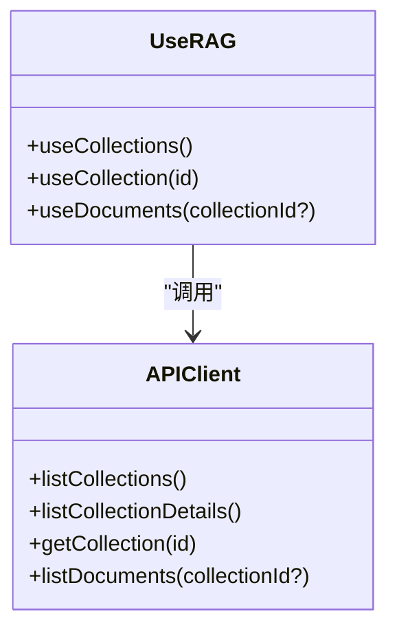
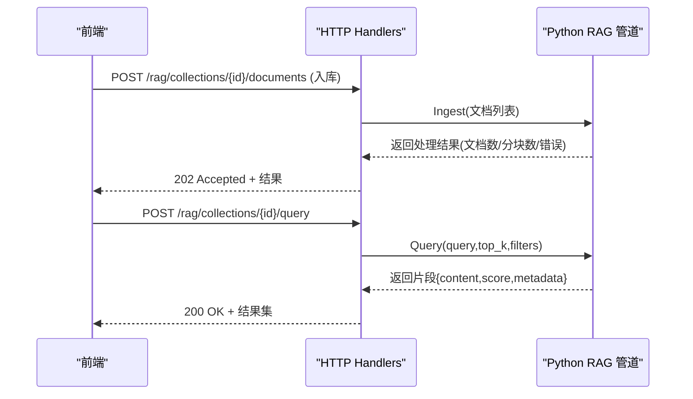
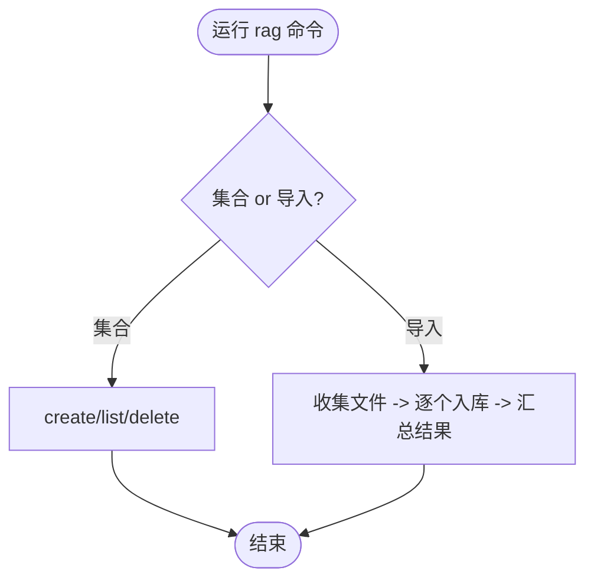
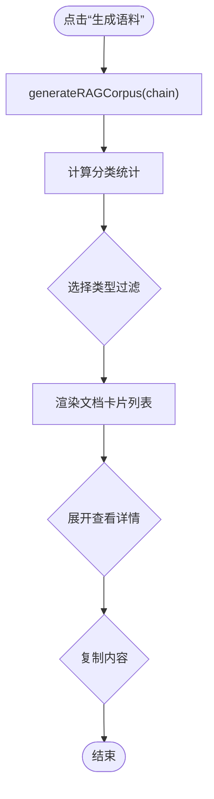
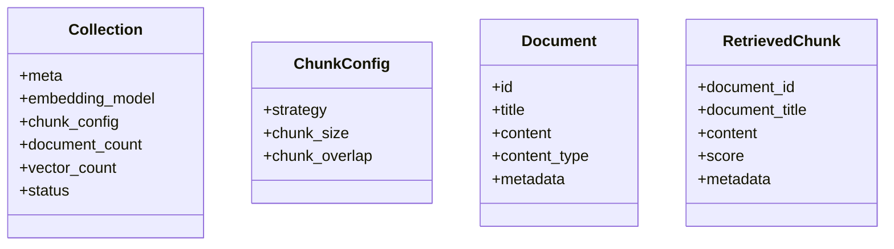
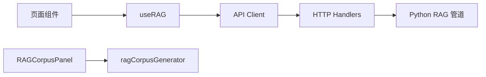

# RAG 管理页面

<cite>
**本文引用的文件**
- [web/src/pages/RAG/Collections.tsx](file://web/src/pages/RAG/Collections.tsx)
- [web/src/pages/RAG/Documents.tsx](file://web/src/pages/RAG/Documents.tsx)
- [web/src/hooks/useRAG.ts](file://web/src/hooks/useRAG.ts)
- [web/src/api/client.ts](file://web/src/api/client.ts)
- [api/proto/resolveagent/v1/rag.proto](file://api/proto/resolveagent/v1/rag.proto)
- [pkg/server/rag_handlers.go](file://pkg/server/rag_handlers.go)
- [internal/cli/rag/collection.go](file://internal/cli/rag/collection.go)
- [internal/cli/rag/ingest.go](file://internal/cli/rag/ingest.go)
- [python/src/resolveagent/corpus/rag_importer.py](file://python/src/resolveagent/corpus/rag_importer.py)
- [web/src/lib/ragCorpusGenerator.ts](file://web/src/lib/ragCorpusGenerator.ts)
- [web/src/components/K8sCorpus/RAGCorpusPanel.tsx](file://web/src/components/K8sCorpus/RAGCorpusPanel.tsx)
</cite>

## 目录
1. [简介](#简介)
2. [项目结构](#项目结构)
3. [核心组件](#核心组件)
4. [架构总览](#架构总览)
5. [详细组件分析](#详细组件分析)
6. [依赖关系分析](#依赖关系分析)
7. [性能考虑](#性能考虑)
8. [故障排除指南](#故障排除指南)
9. [结论](#结论)
10. [附录](#附录)

## 简介
本技术文档围绕 RAG（检索增强生成）管理页面的前端实现与后端协作，系统阐述知识库集合管理与文档管理页面的设计、数据流、交互逻辑与可视化方案。重点覆盖：
- 向量索引的创建、更新与查询的前端交互流程
- 文档上传、解析、分块与嵌入处理的用户界面与后端链路
- 检索结果展示、相关性评分与上下文引用的可视化
- RAG 管理的配置选项、性能优化与常见问题的前端解决方案

## 项目结构
RAG 管理页面由前端页面、数据获取 Hook、API 客户端与后端 HTTP/gRPC 处理器组成，同时通过 Python 运行时完成实际的文档解析、分块、嵌入与向量索引操作。

图表来源
- [web/src/pages/RAG/Collections.tsx:1-184](file://web/src/pages/RAG/Collections.tsx#L1-L184)
- [web/src/pages/RAG/Documents.tsx:1-122](file://web/src/pages/RAG/Documents.tsx#L1-L122)
- [web/src/hooks/useRAG.ts:1-25](file://web/src/hooks/useRAG.ts#L1-L25)
- [web/src/api/client.ts:129-138](file://web/src/api/client.ts#L129-L138)
- [pkg/server/rag_handlers.go:14-167](file://pkg/server/rag_handlers.go#L14-L167)
- [python/src/resolveagent/corpus/rag_importer.py:23-113](file://python/src/resolveagent/corpus/rag_importer.py#L23-L113)

章节来源
- [web/src/pages/RAG/Collections.tsx:1-184](file://web/src/pages/RAG/Collections.tsx#L1-L184)
- [web/src/pages/RAG/Documents.tsx:1-122](file://web/src/pages/RAG/Documents.tsx#L1-L122)
- [web/src/hooks/useRAG.ts:1-25](file://web/src/hooks/useRAG.ts#L1-L25)
- [web/src/api/client.ts:129-138](file://web/src/api/client.ts#L129-L138)
- [pkg/server/rag_handlers.go:14-167](file://pkg/server/rag_handlers.go#L14-L167)
- [python/src/resolveagent/corpus/rag_importer.py:23-113](file://python/src/resolveagent/corpus/rag_importer.py#L23-L113)

## 核心组件
- 集合页面（Collections）：展示知识库集合卡片、统计信息（文档数、向量数）、嵌入模型标识；提供进入文档列表的导航。
- 文档页面（Documents）：按集合过滤或全局列出文档，显示标题、格式、大小、分块数、状态、上传时间等列。
- 数据钩子（useRAG）：基于 React Query 封装集合与文档的查询，支持缓存与按需启用。
- API 客户端（client.ts）：统一 REST 调用，包含健康检查、错误处理与降级策略。
- 后端处理器（rag_handlers.go）：集合 CRUD、文档入库、查询返回结果与耗时统计。
- CLI 工具：集合创建/删除/列表，文档批量导入。
- Python 运行时：Markdown 解析、分块策略选择、向量化与索引写入。
- 语料预览面板（RAGCorpusPanel）：前端本地将调用链数据转换为结构化 RAG 语料，便于预览与筛选。

章节来源
- [web/src/pages/RAG/Collections.tsx:1-184](file://web/src/pages/RAG/Collections.tsx#L1-L184)
- [web/src/pages/RAG/Documents.tsx:1-122](file://web/src/pages/RAG/Documents.tsx#L1-L122)
- [web/src/hooks/useRAG.ts:1-25](file://web/src/hooks/useRAG.ts#L1-L25)
- [web/src/api/client.ts:129-138](file://web/src/api/client.ts#L129-L138)
- [pkg/server/rag_handlers.go:14-167](file://pkg/server/rag_handlers.go#L14-L167)
- [internal/cli/rag/collection.go:13-82](file://internal/cli/rag/collection.go#L13-L82)
- [internal/cli/rag/ingest.go:13-106](file://internal/cli/rag/ingest.go#L13-L106)
- [python/src/resolveagent/corpus/rag_importer.py:23-113](file://python/src/resolveagent/corpus/rag_importer.py#L23-L113)
- [web/src/components/K8sCorpus/RAGCorpusPanel.tsx:1-358](file://web/src/components/K8sCorpus/RAGCorpusPanel.tsx#L1-L358)

## 架构总览
前端通过 useRAG 发起集合与文档查询，API Client 调用后端 REST 接口；后端处理器校验参数并转发至 Python 运行时执行 RAG 管道（解析、分块、嵌入、索引）。查询时返回带分数与元数据的片段，用于前端展示相关性评分与上下文引用。

图表来源
- [web/src/hooks/useRAG.ts:4-24](file://web/src/hooks/useRAG.ts#L4-L24)
- [web/src/api/client.ts:129-138](file://web/src/api/client.ts#L129-L138)
- [pkg/server/rag_handlers.go:235-308](file://pkg/server/rag_handlers.go#L235-L308)
- [python/src/resolveagent/corpus/rag_importer.py:62-80](file://python/src/resolveagent/corpus/rag_importer.py#L62-L80)

## 详细组件分析

### 集合页面（Collections）
- 功能要点
  - 展示集合卡片：名称、描述、文档数、向量数、嵌入模型。
  - 提供 RAG 管道概念说明（解析→分块→嵌入→索引→检索→重排序）。
  - 空态与加载骨架屏。
- 数据流
  - 使用 useCollections 拉取集合详情，映射为卡片数据。
- 交互
  - 点击卡片跳转到对应集合的文档列表页。

图表来源
- [web/src/pages/RAG/Collections.tsx:19-184](file://web/src/pages/RAG/Collections.tsx#L19-L184)
- [web/src/hooks/useRAG.ts:4-9](file://web/src/hooks/useRAG.ts#L4-L9)

章节来源
- [web/src/pages/RAG/Collections.tsx:1-184](file://web/src/pages/RAG/Collections.tsx#L1-L184)
- [web/src/hooks/useRAG.ts:4-9](file://web/src/hooks/useRAG.ts#L4-L9)

### 文档页面（Documents）
- 功能要点
  - 根据 URL 中的 collection 参数过滤文档列表。
  - 表格列：标题、格式、大小、分块数、状态、上传时间；未过滤时额外显示所属集合。
  - 状态映射：已索引/处理中/失败；格式标签：PDF/MD/TXT/HTML。
- 数据流
  - useDocuments(collectionId?) 拉取文档列表；useCollection(id) 获取集合信息用于面包屑。
- 交互
  - 支持分页与空态展示。

图表来源
- [web/src/pages/RAG/Documents.tsx:31-122](file://web/src/pages/RAG/Documents.tsx#L31-L122)
- [web/src/hooks/useRAG.ts:19-24](file://web/src/hooks/useRAG.ts#L19-L24)

章节来源
- [web/src/pages/RAG/Documents.tsx:1-122](file://web/src/pages/RAG/Documents.tsx#L1-L122)
- [web/src/hooks/useRAG.ts:19-24](file://web/src/hooks/useRAG.ts#L19-L24)

### 数据获取与 API 客户端
- useRAG 封装了集合与文档的查询，使用 React Query 进行缓存与条件启用。
- API Client 提供统一的 REST 调用，包含健康检查与错误处理；RAG 相关方法包括集合列表（含详情）、集合详情、文档列表。

图表来源
- [web/src/hooks/useRAG.ts:1-25](file://web/src/hooks/useRAG.ts#L1-L25)
- [web/src/api/client.ts:129-138](file://web/src/api/client.ts#L129-L138)

章节来源
- [web/src/hooks/useRAG.ts:1-25](file://web/src/hooks/useRAG.ts#L1-L25)
- [web/src/api/client.ts:129-138](file://web/src/api/client.ts#L129-L138)

### 后端处理器与 gRPC/Python 集成
- 集合接口
  - 列表：返回集合基本信息与统计（文档数、向量数、状态）。
  - 创建：默认嵌入模型与分块策略，注册到集合注册表。
  - 删除：从注册表移除集合。
- 文档入库
  - 接收文档内容/元数据，转发至 Python 运行时执行解析、分块、嵌入与索引。
- 查询接口
  - 接收 query/top_k/filters，执行检索并返回片段、分数与元数据，附带耗时统计。

图表来源
- [pkg/server/rag_handlers.go:169-233](file://pkg/server/rag_handlers.go#L169-L233)
- [pkg/server/rag_handlers.go:235-308](file://pkg/server/rag_handlers.go#L235-L308)
- [python/src/resolveagent/corpus/rag_importer.py:62-80](file://python/src/resolveagent/corpus/rag_importer.py#L62-L80)

章节来源
- [pkg/server/rag_handlers.go:14-167](file://pkg/server/rag_handlers.go#L14-L167)
- [pkg/server/rag_handlers.go:169-233](file://pkg/server/rag_handlers.go#L169-L233)
- [pkg/server/rag_handlers.go:235-308](file://pkg/server/rag_handlers.go#L235-L308)

### 命令行工具（CLI）
- 集合管理：创建（支持嵌入模型、分块策略、描述）、列表、删除（可选强制）。
- 文档导入：支持单文件或递归目录，自动识别支持的文件类型，逐文件读取并通过 API 入库，汇总分块与向量插入数量。

图表来源
- [internal/cli/rag/collection.go:13-82](file://internal/cli/rag/collection.go#L13-L82)
- [internal/cli/rag/ingest.go:13-106](file://internal/cli/rag/ingest.go#L13-L106)

章节来源
- [internal/cli/rag/collection.go:13-82](file://internal/cli/rag/collection.go#L13-L82)
- [internal/cli/rag/ingest.go:13-153](file://internal/cli/rag/ingest.go#L13-L153)

### 语料预览与可视化（RAGCorpusPanel）
- 功能要点
  - 基于调用链数据在前端本地生成结构化 RAG 语料（代码分析与运维场景两类共 14 种文档类型）。
  - 提供分组统计、类型过滤、展开查看内容与元数据、复制内容等操作。
- 价值
  - 无需后端即可预览语料质量，辅助调试与优化分块/嵌入策略。

图表来源
- [web/src/components/K8sCorpus/RAGCorpusPanel.tsx:234-358](file://web/src/components/K8sCorpus/RAGCorpusPanel.tsx#L234-L358)
- [web/src/lib/ragCorpusGenerator.ts:1-800](file://web/src/lib/ragCorpusGenerator.ts#L1-L800)

章节来源
- [web/src/components/K8sCorpus/RAGCorpusPanel.tsx:1-358](file://web/src/components/K8sCorpus/RAGCorpusPanel.tsx#L1-L358)
- [web/src/lib/ragCorpusGenerator.ts:1-800](file://web/src/lib/ragCorpusGenerator.ts#L1-L800)

### 协议与数据结构
- Proto 定义涵盖集合、分块配置、文档、检索片段、请求/响应消息，明确字段类型与用途。
- 前端通过 API Client 与后端 JSON 交互，后端处理器对请求体进行校验与默认值设置。

图表来源
- [api/proto/resolveagent/v1/rag.proto:20-99](file://api/proto/resolveagent/v1/rag.proto#L20-L99)

章节来源
- [api/proto/resolveagent/v1/rag.proto:1-99](file://api/proto/resolveagent/v1/rag.proto#L1-L99)

## 依赖关系分析
- 前端依赖
  - Collections/Documents 页面依赖 useRAG 钩子；useRAG 依赖 API Client。
  - RAGCorpusPanel 依赖 ragCorpusGenerator 进行本地语料生成。
- 后端依赖
  - HTTP Handlers 依赖注册表与 Python 运行时客户端；文档入库与查询均转发至 Python 管道。
- 外部依赖
  - Python 运行时负责实际的分块、嵌入与向量索引（Milvus/Qdrant 等），以及批量导入 Markdown。

图表来源
- [web/src/pages/RAG/Collections.tsx:19-184](file://web/src/pages/RAG/Collections.tsx#L19-L184)
- [web/src/pages/RAG/Documents.tsx:31-122](file://web/src/pages/RAG/Documents.tsx#L31-L122)
- [web/src/hooks/useRAG.ts:1-25](file://web/src/hooks/useRAG.ts#L1-L25)
- [web/src/api/client.ts:129-138](file://web/src/api/client.ts#L129-L138)
- [pkg/server/rag_handlers.go:169-308](file://pkg/server/rag_handlers.go#L169-L308)
- [web/src/components/K8sCorpus/RAGCorpusPanel.tsx:234-358](file://web/src/components/K8sCorpus/RAGCorpusPanel.tsx#L234-L358)
- [web/src/lib/ragCorpusGenerator.ts:1-800](file://web/src/lib/ragCorpusGenerator.ts#L1-L800)

章节来源
- [web/src/pages/RAG/Collections.tsx:1-184](file://web/src/pages/RAG/Collections.tsx#L1-L184)
- [web/src/pages/RAG/Documents.tsx:1-122](file://web/src/pages/RAG/Documents.tsx#L1-L122)
- [web/src/hooks/useRAG.ts:1-25](file://web/src/hooks/useRAG.ts#L1-L25)
- [web/src/api/client.ts:129-138](file://web/src/api/client.ts#L129-L138)
- [pkg/server/rag_handlers.go:169-308](file://pkg/server/rag_handlers.go#L169-L308)
- [web/src/components/K8sCorpus/RAGCorpusPanel.tsx:1-358](file://web/src/components/K8sCorpus/RAGCorpusPanel.tsx#L1-L358)
- [web/src/lib/ragCorpusGenerator.ts:1-800](file://web/src/lib/ragCorpusGenerator.ts#L1-L800)

## 性能考虑
- 前端缓存与按需加载
  - 使用 React Query 缓存集合与文档数据，减少重复请求。
  - 仅在存在 collectionId 时启用集合详情查询，避免无效请求。
- 后端限流与默认值
  - 查询 top_k 限制在合理范围（默认 5，上限 100），防止过大结果集影响性能。
  - 健康检查与错误处理提升鲁棒性。
- 批处理与异步
  - 文档入库采用批量提交，Python 侧可并行解析与嵌入，降低端到端延迟。
- 本地预览优化
  - RAGCorpusPanel 在前端本地生成语料，避免网络往返，提高调试效率。

[本节为通用指导，不直接分析具体文件]

## 故障排除指南
- 后端不可用时的降级
  - API Client 具备健康检查与 mock 降级机制，当后端不可用时回退到本地模拟数据，保障开发体验。
- 常见错误定位
  - 集合不存在：创建/删除/入库前需验证集合 ID。
  - 查询参数缺失：确保 query 非空，top_k 为正数且在允许范围内。
  - 文档入库失败：检查文件格式与内容是否为空，关注 Python 运行时日志。
- 前端状态反馈
  - 使用骨架屏与空态提示改善用户体验。
  - 文档状态映射（已索引/处理中/失败）帮助快速定位问题阶段。

章节来源
- [web/src/api/client.ts:45-90](file://web/src/api/client.ts#L45-L90)
- [pkg/server/rag_handlers.go:169-233](file://pkg/server/rag_handlers.go#L169-L233)
- [pkg/server/rag_handlers.go:235-308](file://pkg/server/rag_handlers.go#L235-L308)
- [web/src/pages/RAG/Documents.tsx:12-77](file://web/src/pages/RAG/Documents.tsx#L12-L77)

## 结论
RAG 管理页面通过清晰的前后端分层与职责划分，实现了集合与文档的全生命周期管理。前端以简洁的卡片与表格呈现关键指标，结合本地语料预览提升调试效率；后端通过标准化接口与 Python 运行时协作，完成解析、分块、嵌入与索引的核心能力。配合合理的配置选项与性能优化策略，可在不同规模的知识库场景下稳定运行。

[本节为总结性内容，不直接分析具体文件]

## 附录
- 配置选项参考
  - 集合创建：嵌入模型（默认 bge-large-zh）、分块策略（默认 sentence）、描述。
  - 查询参数：query（必填）、top_k（默认 5，上限 100）、filters（可选）。
- 支持的文档格式
  - CLI 支持 .txt/.md/.json/.yaml/.yml/.pdf/.docx/.html；Python 导入器侧重 Markdown。
- 可视化建议
  - 在检索结果中展示 score 与 metadata，便于评估相关性并溯源上下文。
  - 使用颜色与徽章区分文档状态与格式，提升可读性。

[本节为补充信息，不直接分析具体文件]