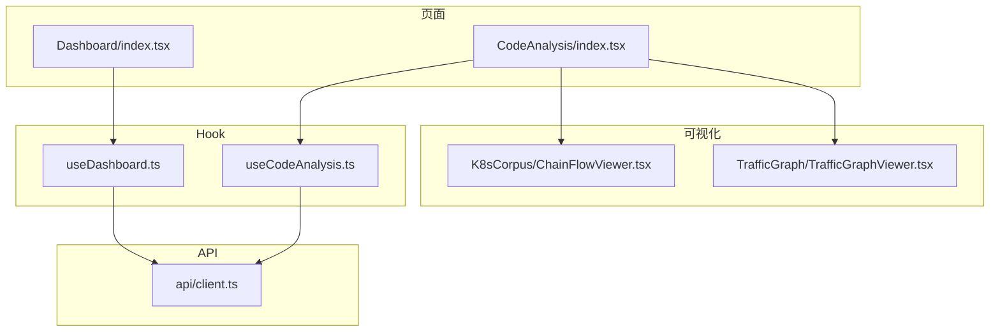
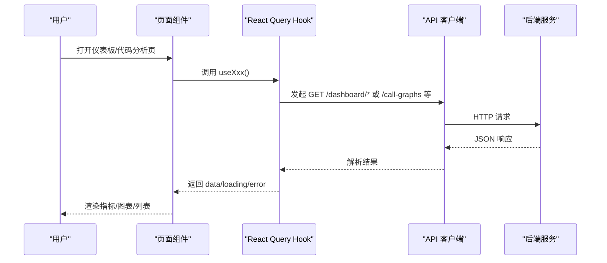
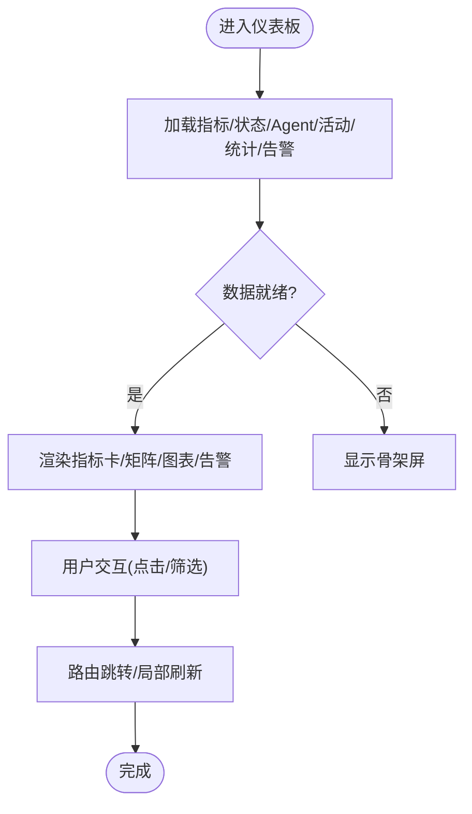
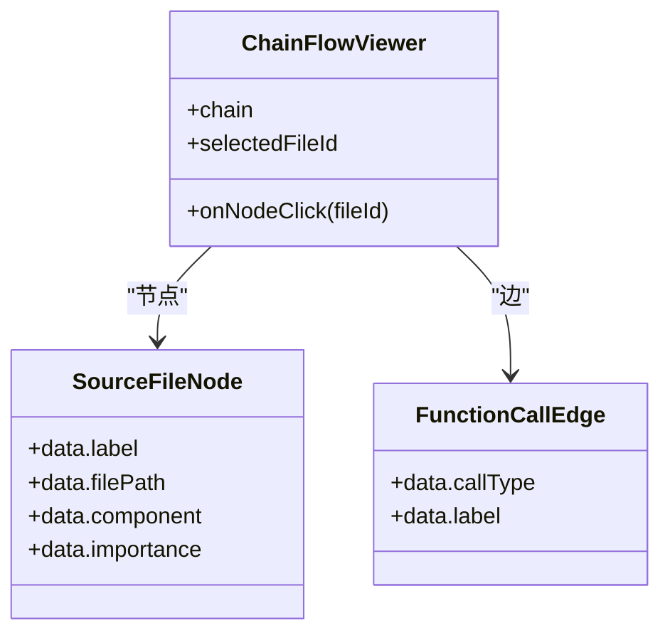
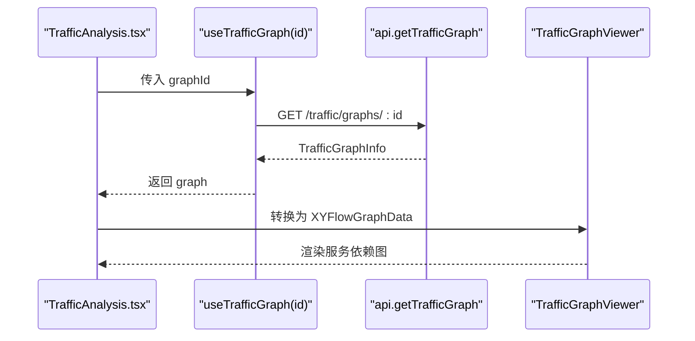
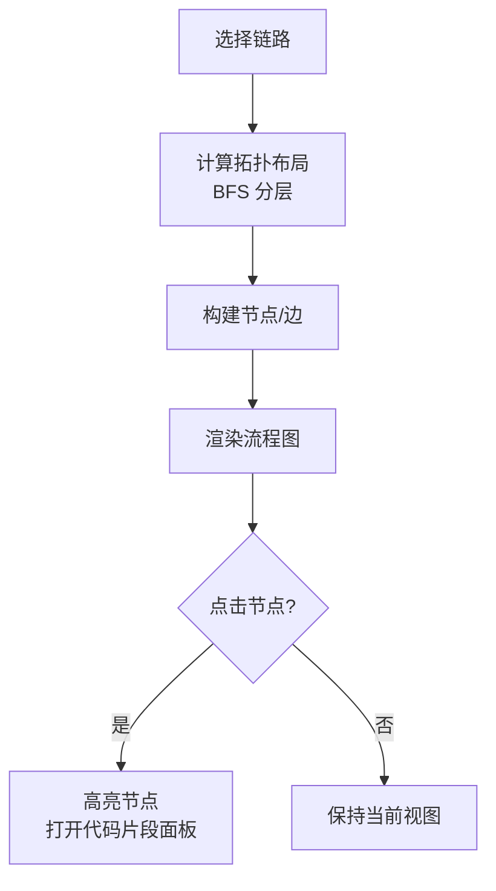
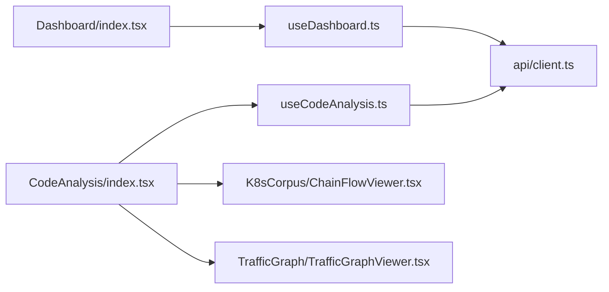

# 分析仪表板页面

<cite>
**本文引用的文件**
- [web/src/pages/Dashboard/index.tsx](file://web/src/pages/Dashboard/index.tsx)
- [web/src/hooks/useDashboard.ts](file://web/src/hooks/useDashboard.ts)
- [web/src/api/client.ts](file://web/src/api/client.ts)
- [web/src/pages/CodeAnalysis/index.tsx](file://web/src/pages/CodeAnalysis/index.tsx)
- [web/src/pages/CodeAnalysis/CallGraphList.tsx](file://web/src/pages/CodeAnalysis/CallGraphList.tsx)
- [web/src/pages/CodeAnalysis/TrafficAnalysis.tsx](file://web/src/pages/CodeAnalysis/TrafficAnalysis.tsx)
- [web/src/pages/CodeAnalysis/K8sCorpusAnalysis.tsx](file://web/src/pages/CodeAnalysis/K8sCorpusAnalysis.tsx)
- [web/src/components/K8sCorpus/ChainFlowViewer.tsx](file://web/src/components/K8sCorpus/ChainFlowViewer.tsx)
- [web/src/components/K8sCorpus/SourceFileNode.tsx](file://web/src/components/K8sCorpus/SourceFileNode.tsx)
- [web/src/components/K8sCorpus/FunctionCallEdge.tsx](file://web/src/components/K8sCorpus/FunctionCallEdge.tsx)
- [web/src/components/TrafficGraph/TrafficGraphViewer.tsx](file://web/src/components/TrafficGraph/TrafficGraphViewer.tsx)
- [web/src/components/TrafficGraph/ServiceNode.tsx](file://web/src/components/TrafficGraph/ServiceNode.tsx)
- [web/src/hooks/useCodeAnalysis.ts](file://web/src/hooks/useCodeAnalysis.ts)
- [web/src/types/k8sCorpus.ts](file://web/src/types/k8sCorpus.ts)
- [web/src/data/k8sCorpus.ts](file://web/src/data/k8sCorpus.ts)
</cite>

## 目录
1. [简介](#简介)
2. [项目结构](#项目结构)
3. [核心组件](#核心组件)
4. [架构总览](#架构总览)
5. [详细组件分析](#详细组件分析)
6. [依赖关系分析](#依赖关系分析)
7. [性能考虑](#性能考虑)
8. [故障排查指南](#故障排查指南)
9. [结论](#结论)
10. [附录](#附录)

## 简介
本技术文档聚焦于“分析仪表板页面”的前端实现，覆盖主仪表板、代码分析仪表板及其子页面（调用图谱、K8s 语料分析、流量分析）的设计模式与实现架构。重点说明实时监控数据的可视化展示、图表组件选择与配置、数据刷新机制、性能优化策略以及面向决策支持的界面设计指导。

## 项目结构
- 页面层
  - 主仪表板：聚合平台状态、执行指标、Agent 矩阵、活动流、告警等。
  - 代码分析仪表板：以 Tab 组织 Call Graph、Traffic Analysis、K8s 源码语料三大视图。
- 组件层
  - K8s 语料：基于 @xyflow/react 的流程图（节点/边自定义），支持顺序流水线与事件驱动两种拓扑布局。
  - 流量图：服务依赖图可视化，节点承载请求/错误/延迟等指标。
- Hook 与 API
  - React Query hooks 负责数据获取、缓存与失效；API 客户端统一封装后端接口并内置 Mock 降级能力。

**图示来源**
- [web/src/pages/Dashboard/index.tsx:362-742](file://web/src/pages/Dashboard/index.tsx#L362-L742)
- [web/src/pages/CodeAnalysis/index.tsx:19-146](file://web/src/pages/CodeAnalysis/index.tsx#L19-L146)
- [web/src/hooks/useDashboard.ts:1-52](file://web/src/hooks/useDashboard.ts#L1-L52)
- [web/src/hooks/useCodeAnalysis.ts:1-72](file://web/src/hooks/useCodeAnalysis.ts#L1-L72)
- [web/src/api/client.ts:139-161](file://web/src/api/client.ts#L139-L161)
- [web/src/components/K8sCorpus/ChainFlowViewer.tsx:172-271](file://web/src/components/K8sCorpus/ChainFlowViewer.tsx#L172-L271)
- [web/src/components/TrafficGraph/TrafficGraphViewer.tsx:27-89](file://web/src/components/TrafficGraph/TrafficGraphViewer.tsx#L27-L89)

**章节来源**
- [web/src/pages/Dashboard/index.tsx:362-742](file://web/src/pages/Dashboard/index.tsx#L362-L742)
- [web/src/pages/CodeAnalysis/index.tsx:19-146](file://web/src/pages/CodeAnalysis/index.tsx#L19-L146)
- [web/src/hooks/useDashboard.ts:1-52](file://web/src/hooks/useDashboard.ts#L1-L52)
- [web/src/hooks/useCodeAnalysis.ts:1-72](file://web/src/hooks/useCodeAnalysis.ts#L1-L72)
- [web/src/api/client.ts:139-161](file://web/src/api/client.ts#L139-L161)

## 核心组件
- 主仪表板
  - 指标卡片：Agent 总数、今日执行、成功率、平均延迟、Skills 执行、知识条目。
  - Agent 状态矩阵：按类型/状态/成功率/延迟/运行时长展示。
  - 活动流与执行分析：时间线、路由类型分布、24h 趋势柱状图与迷你折线。
  - 平台健康：连接状态、CPU/内存进度条、运行时间、Goroutines。
  - 活跃告警：严重级别、未确认计数、滚动列表。
- 代码分析仪表板
  - Call Graph 列表：统计节点/边/深度，支持查看详情与删除。
  - Traffic Analysis：服务拓扑快照、建议项、分析报表。
  - K8s 源码语料：链式流程可视化、调用类型分布、步骤渲染、RAG 生成面板。

**章节来源**
- [web/src/pages/Dashboard/index.tsx:362-742](file://web/src/pages/Dashboard/index.tsx#L362-L742)
- [web/src/pages/CodeAnalysis/CallGraphList.tsx:27-129](file://web/src/pages/CodeAnalysis/CallGraphList.tsx#L27-L129)
- [web/src/pages/CodeAnalysis/TrafficAnalysis.tsx:30-126](file://web/src/pages/CodeAnalysis/TrafficAnalysis.tsx#L30-L126)
- [web/src/pages/CodeAnalysis/K8sCorpusAnalysis.tsx:99-314](file://web/src/pages/CodeAnalysis/K8sCorpusAnalysis.tsx#L99-L314)

## 架构总览
前端采用“页面 + Hook + API 客户端 + 可视化组件”的分层架构：
- 页面负责 UI 组装与交互。
- Hook 使用 React Query 管理查询与缓存键，触发网络请求。
- API 客户端统一封装 REST 接口，并在开发环境提供 Mock 降级。
- 可视化组件基于 @xyflow/react 构建可交互的流程图，支持自定义节点/边与布局算法。

**图示来源**
- [web/src/hooks/useDashboard.ts:4-51](file://web/src/hooks/useDashboard.ts#L4-L51)
- [web/src/hooks/useCodeAnalysis.ts:4-72](file://web/src/hooks/useCodeAnalysis.ts#L4-L72)
- [web/src/api/client.ts:75-90](file://web/src/api/client.ts#L75-L90)
- [web/src/api/client.ts:139-161](file://web/src/api/client.ts#L139-L161)
- [web/src/api/client.ts:268-288](file://web/src/api/client.ts#L268-L288)

## 详细组件分析

### 主仪表板（Dashboard）
- 数据源与刷新
  - 通过多个 useQuery 分别拉取指标、平台状态、Agent 概览、活动事件、执行统计、告警。
  - 使用 React Query 的 queryKey 隔离缓存，便于按需失效与更新。
- 可视化与交互
  - 指标卡片、Agent 矩阵、活动流、路由分布、24h 趋势、平台健康进度条、告警列表。
  - 点击事件跳转至 Agent 详情、Playground、工作流、知识库等页面。
- 错误与空态
  - 加载骨架屏、错误重试按钮、无数据占位提示。

**图示来源**
- [web/src/pages/Dashboard/index.tsx:362-742](file://web/src/pages/Dashboard/index.tsx#L362-L742)
- [web/src/hooks/useDashboard.ts:4-51](file://web/src/hooks/useDashboard.ts#L4-L51)

**章节来源**
- [web/src/pages/Dashboard/index.tsx:362-742](file://web/src/pages/Dashboard/index.tsx#L362-L742)
- [web/src/hooks/useDashboard.ts:4-51](file://web/src/hooks/useDashboard.ts#L4-L51)

### 代码分析仪表板（CodeAnalysis）
- 总体结构
  - 顶部介绍区解释静态/动态分析与 RAG 双写沉淀。
  - 三个 Tab：Call Graphs、Traffic Analysis、K8s 源码语料。
- Call Graph 列表
  - 列表卡片展示入口点、仓库、语言、分支、节点/边/深度等。
  - 弹窗查看详细信息，支持删除操作。
- Traffic Analysis
  - 汇总唯一服务数、边数、已分析数量。
  - 卡片展示服务拓扑快照与建议项；弹窗内嵌流量图与分析报告。
- K8s 源码语料
  - 链路选择器区分“故障排查”和“集群初始化”，展示拓扑标签、组件、调用类型分布。
  - 流程图支持顺序流水线与事件驱动两种布局，节点为源码文件，边为函数调用关系。
  - 右侧代码片段面板与 RAG 生成面板联动。

**图示来源**
- [web/src/components/K8sCorpus/ChainFlowViewer.tsx:172-271](file://web/src/components/K8sCorpus/ChainFlowViewer.tsx#L172-L271)
- [web/src/components/K8sCorpus/SourceFileNode.tsx:57-114](file://web/src/components/K8sCorpus/SourceFileNode.tsx#L57-L114)
- [web/src/components/K8sCorpus/FunctionCallEdge.tsx:32-84](file://web/src/components/K8sCorpus/FunctionCallEdge.tsx#L32-L84)

**章节来源**
- [web/src/pages/CodeAnalysis/index.tsx:19-146](file://web/src/pages/CodeAnalysis/index.tsx#L19-L146)
- [web/src/pages/CodeAnalysis/CallGraphList.tsx:27-129](file://web/src/pages/CodeAnalysis/CallGraphList.tsx#L27-L129)
- [web/src/pages/CodeAnalysis/TrafficAnalysis.tsx:30-126](file://web/src/pages/CodeAnalysis/TrafficAnalysis.tsx#L30-L126)
- [web/src/pages/CodeAnalysis/K8sCorpusAnalysis.tsx:99-314](file://web/src/pages/CodeAnalysis/K8sCorpusAnalysis.tsx#L99-L314)

### 流量分析（Traffic Analysis）
- 数据到可视化的转换
  - 将后端 TrafficGraphInfo 转换为 XYFlowGraphData，节点类型为 serviceNode，边类型为 trafficEdge。
  - 节点展示请求量、错误量、平均延迟与协议；边支持动画表示异常。
- 弹窗详情
  - 内嵌 TrafficGraphViewer 进行交互式浏览，附带分析报告与建议项。

**图示来源**
- [web/src/pages/CodeAnalysis/TrafficAnalysis.tsx:213-327](file://web/src/pages/CodeAnalysis/TrafficAnalysis.tsx#L213-L327)
- [web/src/hooks/useCodeAnalysis.ts:50-72](file://web/src/hooks/useCodeAnalysis.ts#L50-L72)
- [web/src/api/client.ts:283-288](file://web/src/api/client.ts#L283-L288)
- [web/src/components/TrafficGraph/TrafficGraphViewer.tsx:27-89](file://web/src/components/TrafficGraph/TrafficGraphViewer.tsx#L27-L89)

**章节来源**
- [web/src/pages/CodeAnalysis/TrafficAnalysis.tsx:213-327](file://web/src/pages/CodeAnalysis/TrafficAnalysis.tsx#L213-L327)
- [web/src/components/TrafficGraph/TrafficGraphViewer.tsx:27-89](file://web/src/components/TrafficGraph/TrafficGraphViewer.tsx#L27-L89)
- [web/src/components/TrafficGraph/ServiceNode.tsx:13-68](file://web/src/components/TrafficGraph/ServiceNode.tsx#L13-L68)

### K8s 语料分析（K8s Corpus Analysis）
- 数据模型
  - 定义链拓扑（event-driven/sequential-pipeline）、链类型（troubleshooting/initialization）、调用类型分布、源码文件与边等。
- 布局与渲染
  - 根据拓扑计算节点坐标（BFS 分层），顺序流水线与事件驱动分别采用不同列宽与行高。
  - 节点样式按组件分类着色，边样式按调用类型与链类型差异化。
- 交互
  - 点击节点高亮并打开右侧代码片段面板；支持切换不同链路。

**图示来源**
- [web/src/components/K8sCorpus/ChainFlowViewer.tsx:38-159](file://web/src/components/K8sCorpus/ChainFlowViewer.tsx#L38-L159)
- [web/src/components/K8sCorpus/ChainFlowViewer.tsx:172-271](file://web/src/components/K8sCorpus/ChainFlowViewer.tsx#L172-L271)
- [web/src/types/k8sCorpus.ts:1-76](file://web/src/types/k8sCorpus.ts#L1-L76)
- [web/src/data/k8sCorpus.ts:7-598](file://web/src/data/k8sCorpus.ts#L7-L598)

**章节来源**
- [web/src/pages/CodeAnalysis/K8sCorpusAnalysis.tsx:99-314](file://web/src/pages/CodeAnalysis/K8sCorpusAnalysis.tsx#L99-L314)
- [web/src/components/K8sCorpus/ChainFlowViewer.tsx:38-159](file://web/src/components/K8sCorpus/ChainFlowViewer.tsx#L38-L159)
- [web/src/types/k8sCorpus.ts:1-76](file://web/src/types/k8sCorpus.ts#L1-L76)
- [web/src/data/k8sCorpus.ts:7-598](file://web/src/data/k8sCorpus.ts#L7-L598)

## 依赖关系分析
- 页面与 Hook
  - Dashboard 依赖 useDashboard 系列 Hook；CodeAnalysis 依赖 useCodeAnalysis 系列 Hook。
- Hook 与 API
  - Hook 通过 api.client 调用后端接口；在开发环境下可动态切换到 Mock 实现。
- 可视化组件依赖
  - 均基于 @xyflow/react，使用自定义节点/边类型与布局逻辑。

**图示来源**
- [web/src/pages/Dashboard/index.tsx:362-742](file://web/src/pages/Dashboard/index.tsx#L362-L742)
- [web/src/pages/CodeAnalysis/index.tsx:19-146](file://web/src/pages/CodeAnalysis/index.tsx#L19-L146)
- [web/src/hooks/useDashboard.ts:4-51](file://web/src/hooks/useDashboard.ts#L4-L51)
- [web/src/hooks/useCodeAnalysis.ts:4-72](file://web/src/hooks/useCodeAnalysis.ts#L4-L72)
- [web/src/api/client.ts:139-161](file://web/src/api/client.ts#L139-L161)
- [web/src/components/K8sCorpus/ChainFlowViewer.tsx:172-271](file://web/src/components/K8sCorpus/ChainFlowViewer.tsx#L172-L271)
- [web/src/components/TrafficGraph/TrafficGraphViewer.tsx:27-89](file://web/src/components/TrafficGraph/TrafficGraphViewer.tsx#L27-L89)

**章节来源**
- [web/src/api/client.ts:296-393](file://web/src/api/client.ts#L296-L393)

## 性能考虑
- 数据层
  - 使用 React Query 的 queryKey 隔离缓存，避免不必要的全局刷新；对删除/写入操作使用 invalidateQueries 精准失效。
  - API 客户端具备后端可用性探测与 Mock 降级，减少无效请求与失败抖动。
- 渲染层
  - 骨架屏与空态提升感知性能；大列表使用滚动区域与懒加载（如活动流、告警）。
  - 流程图组件按需构建节点/边，使用 useMemo/useCallback 减少重渲染。
- 可视化层
  - 自定义节点/边仅包含必要信息；箭头标记复用 ID，避免重复创建。
  - 布局算法按拓扑类型选择，降低复杂图形的计算成本。

[本节为通用性能建议，不直接分析具体文件]

## 故障排查指南
- 数据加载失败
  - 检查 API 路径与响应码；若后端不可用，自动回退到 Mock（开发环境）。
  - 使用 EmptyState 的重试按钮重新触发查询。
- 图表为空或报错
  - 确认输入数据结构是否符合预期（如 XYFlowGraphData 的 nodes/edges）。
  - 检查自定义节点/边的 props 映射是否正确。
- 性能卡顿
  - 减少不必要的重渲染（memo 包裹节点/边）。
  - 控制大图规模，必要时分页或分片加载。

**章节来源**
- [web/src/api/client.ts:51-90](file://web/src/api/client.ts#L51-L90)
- [web/src/api/client.ts:296-393](file://web/src/api/client.ts#L296-L393)
- [web/src/pages/CodeAnalysis/CallGraphList.tsx:62-88](file://web/src/pages/CodeAnalysis/CallGraphList.tsx#L62-L88)
- [web/src/pages/CodeAnalysis/TrafficAnalysis.tsx:89-103](file://web/src/pages/CodeAnalysis/TrafficAnalysis.tsx#L89-L103)

## 结论
该分析仪表板通过清晰的分层架构与模块化组件，实现了多场景监控与可视化：主仪表板提供全局运行态势，代码分析仪表板串联静态/动态分析与 RAG 沉淀，K8s 语料与流量图则支撑深入的根因定位与优化建议。结合 React Query 的数据管理与 @xyflow/react 的可扩展可视化，系统在易用性、性能与可扩展性之间取得良好平衡。

## 附录
- 关键数据类型
  - K8s 语料链：拓扑、类型、调用分布、源码文件与边。
  - 流量图：服务节点与边指标（请求、错误、延迟、协议）。
- 常用接口
  - 仪表板：/dashboard/metrics, /platform/status, /dashboard/agents, /dashboard/activity, /dashboard/execution-stats, /dashboard/alerts
  - 代码分析：/call-graphs, /traffic/captures, /traffic/graphs

[本节为补充信息，不直接分析具体文件]